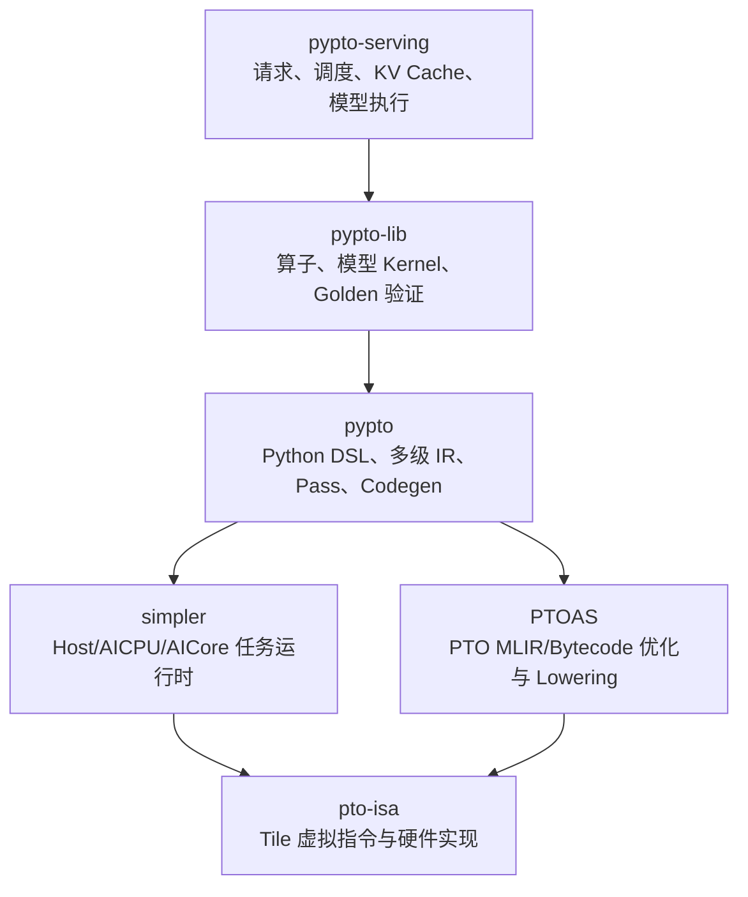
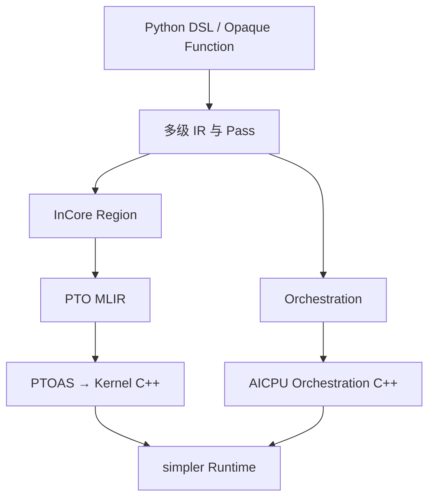
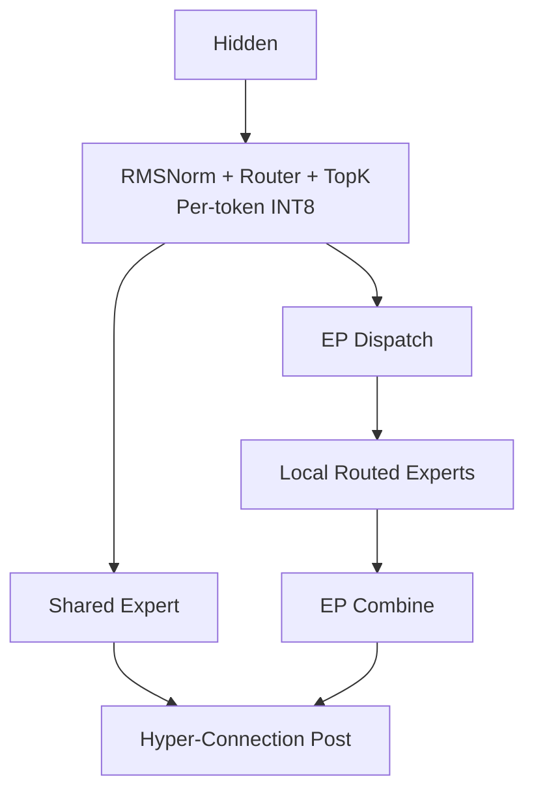
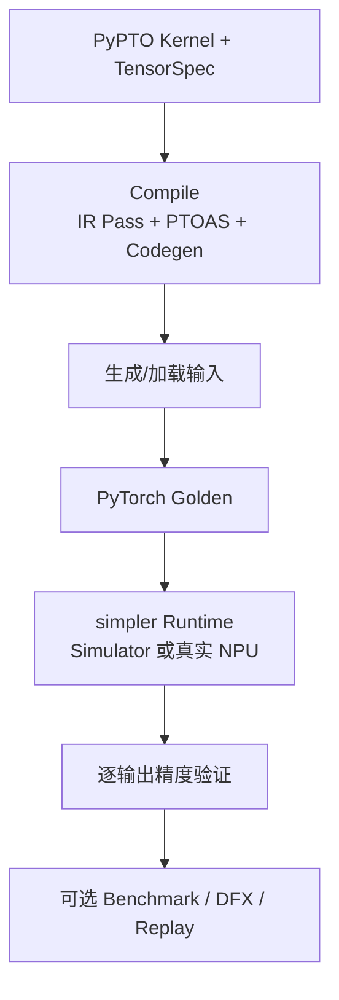

> 本文基于 [`hw-native-sys`](https://github.com/hw-native-sys) 组织在 **2026-08-09** 的公开仓库、README、架构文档、模型说明、关键代码入口和 CI 配置整理。重点是厘清各仓库真正拥有的职责，以及 `pypto-lib` 如何把编译器、运行时、模型 Kernel 和 Serving 串成可验证的端到端系统。本文没有在 Ascend 硬件上重新执行性能测试。

## 1. 先说结论：这是一个纵向一体化的 Ascend AI 软件栈

`hw-native-sys` 的公开目标是构建 hardware-native 的 AI Infra 与 MLsys 生态。但从当前已经落地的代码看，它最完整的主线是：

> 面向 Ascend A2/A3/A5，从 Tile 虚拟指令、MLIR 后端、异构任务运行时、高层 DSL、多级图编译，一直延伸到完整 LLM Kernel 和推理服务。

它不是 11 个彼此独立的项目。真正的核心执行链只有六个仓库，其他仓库负责工具、设计、文档、官网和 AI 辅助开发。



这条链可以分为两个平面：

| 平面 | 主链路 | 解决的问题 |
| --- | --- | --- |
| 编译平面 | `pypto-lib → pypto → PTOAS → pto-isa` | 模型程序如何变成 Tile、任务和设备代码 |
| 执行平面 | `pypto-serving → pypto/simpler → AICPU/AICore` | 请求、模型状态和编译产物如何在设备上运行 |

需要避免两个误解：

1. PTO 不是“把整个模型编译成一个物理 Kernel”的同义词。它同时表达 InCore 计算和 Orchestration 任务编排，最终仍可能生成多个 AIC、AIV 和运行时任务。
2. 组织愿景提到异构硬件，但当前核心代码明显以 CANN、Da Vinci、AICPU/AICore 和 Ascend 代际为中心；CPU 主要承担 Simulator 与无卡验证，并不是独立生产后端。

## 2. 11 个仓库的功能与定位

### 2.1 六个核心工程仓库

| 层次 | 仓库 | 它真正负责什么 | 明确不负责什么 |
| --- | --- | --- | --- |
| Tile ISA | [`pto-isa`](https://github.com/hw-native-sys/pto-isa) | PTO Tile 指令语义、分代实现、通信扩展、CPU Simulator、手工性能 Kernel | Tensor 图编译、请求调度、模型服务 |
| Kernel 后端 | [`PTOAS`](https://github.com/hw-native-sys/PTOAS) | PTO Dialect、IR 校验、同步/内存等 Pass、EmitC/Linalg Lowering、Python Binding | 高层 Tensor DSL、任务运行时 |
| 任务运行时 | [`simpler`](https://github.com/hw-native-sys/simpler) | DAG 提交、Orchestrator、Scheduler、Worker、Host/AICPU/AICore 协同、Buffer 生命周期与 DFX | 模型算法、Kernel 本体、HTTP 服务 |
| 高层编译框架 | [`pypto`](https://github.com/hw-native-sys/pypto) | Python DSL，Tensor/Tile/Block/Execution 多级 IR，Pass 与两路 Codegen | ISA 的具体硬件实现、业务请求调度 |
| 模型实现与验收 | [`pypto-lib`](https://github.com/hw-native-sys/pypto-lib) | 教学算子、融合 Kernel、Qwen/DeepSeek 模型图、Torch Golden、编译运行验证和调优入口 | 通用编译器、运行时核心、HTTP 服务、模型权重托管 |
| 推理服务 | [`pypto-serving`](https://github.com/hw-native-sys/pypto-serving) | Engine、Scheduler、KV Cache、采样、Worker、权重加载、OpenAI API 与实例管理 | 底层 Kernel/ISA/编译 Pass 的实现 |

### 2.2 五个辅助与治理仓库

| 仓库 | 功能 | 定位 |
| --- | --- | --- |
| [`pypto-tools`](https://github.com/hw-native-sys/pypto-tools) | VS Code Toolkit，展示 Chip Swimlane、任务依赖、SPMD、关键路径和性能看板 | 运行时可视化与性能诊断前端 |
| [`pypto_top_level_documents`](https://github.com/hw-native-sys/pypto_top_level_documents) | Training、AOT capture/replay、Sharded Tensor、Tensor Layout、UBL128 Serving 等跨仓设计 | 架构提案和设计孵化区，不等于已实现能力 |
| [`pypto-skills`](https://github.com/hw-native-sys/pypto-skills) | Codex/Claude Code 的 PR、Issue、Git 和 Profiling 工作流 | AI 辅助开发标准库，不进入编译执行链 |
| [`.github`](https://github.com/hw-native-sys/.github) | 组织 Profile 与公共治理信息 | 组织级配置仓 |
| [`hw-native-sys.github.io`](https://github.com/hw-native-sys/hw-native-sys.github.io) | `pypto.ai` 的 GitHub Pages/CNAME 入口 | 官网入口，不承载核心实现 |

`pypto-tools` 需要特别注意：它主要消费 `simpler/pypto` 输出的 `chip_swimlane_records*.json`、`deps*.json` 和 `name_map*.json`。因此它不是数据采集 Runtime，而是 DFX 结果的交互式观察器。当前 README 中 PyPTO Pass 记录仍处于待补充状态，成熟能力更集中在任务图和运行时泳道。

## 3. `pto-isa`：跨 Ascend 代际的 Tile 指令边界

`pto-isa` 定义 PTO（Parallel Tile Operation）虚拟 ISA，并为 A2/A3、A5 以及 CPU Simulator 提供实现。它的抽象粒度比物理机器指令高，但比 Tensor 编译器低。

核心内容包括：

- Tile、Tensor、Shape、Stride、Mask、Buffer 和 Event；
- Load/Store、Vector、Cube、Reduction、Convolution、Quantization；
- 点到点通信、信号同步、集合通信和计算通信融合；
- GEMM、Flash Attention、GEMM-AllReduce 等参考 Kernel；
- CPU-SIM 与 CostModel。

`pto-isa` 回答的是“一个 Tile 操作在不同芯片上怎样表达和执行”，并不决定模型怎样分层、任务怎样调度或请求怎样批处理。

## 4. `PTOAS`：PTO 专用 MLIR 后端

PTOAS 是 PTO Assembler & Optimizer，基于专用 LLVM 21 VPTO 分支构建。它负责：

1. 解析和验证 `.pto` IR/Bytecode；
2. 执行自动同步、内存规划、融合及 Da Vinci 相关 Pass；
3. Lowering 到 EmitC/Linalg 或调用 `pto-isa` 的 C++；
4. 提供 `ptoas`、`ptobc` CLI 和 Python Binding。

```text
PyPTO 生成 .pto
        ↓
PTOAS 校验、优化、Lowering
        ↓
生成调用 pto-isa 的 Kernel C++
        ↓
CANN/设备工具链生成 AICore 产物
```

因此，`pto-isa` 定义“有什么指令及其硬件语义”，PTOAS 决定“IR 怎样合法、怎样优化并降低到这些指令”。两者不是重复实现。

## 5. `simpler`：Host、AICPU 与 AICore 的任务运行时

`simpler` 管理三个独立编译、协同执行的程序：Host `.so`、AICPU `.so` 和 AICore `.o`。它拥有：

- DAG 提交和依赖调度；
- AICPU/Host Scheduler 与 Worker 生命周期；
- Host 与 Device 握手；
- TensorMap、Scope、RingBuffer 和 Buffer 回收；
- A2/A3、A5 的真实设备与线程模拟后端；
- Swimlane、依赖图、PMU、参数 Dump 等 DFX。

从 vLLM 的视角看，它不是 Request Scheduler，而更像“设备任务图 Runtime”。`pypto-serving` 决定哪些请求进入哪次模型执行，`simpler` 决定一次编译程序内部的任务如何在 AICPU/AICore 上落地。

## 6. `pypto`：同时生成 InCore Kernel 与 Orchestration

`pypto` 是整条链的编译中枢。高层程序经过 Tensor、Tile、Block、Execution 多级 IR 和 Pass 后，分成两条代码生成路径：



`pl.at(level=pl.Level.CORE_GROUP)` 是重要边界：区域内的计算被 outline 为 InCore，区域外控制流保留在 Orchestration。一个混合 Cube 和 Vector 的区域还可能被拆成两个 InCore Kernel，由 Orchestration 按依赖调用。

## 7. 深入分析 `pypto-lib`：它到底做了什么

### 7.1 它不是普通“公共函数库”

如果前面的仓库负责造语言、编译器和运行时，`pypto-lib` 就负责回答三个更现实的问题：

1. 这些抽象能否写出真实模型，而不只是 Add/MatMul Demo？
2. 编译后的程序能否在 Simulator/NPU 上运行并与 PyTorch 对齐？
3. 上层 Serving 能否通过稳定 ABI 装载 Kernel、权重和 KV Cache？

因此，它同时扮演四种角色：

| 角色 | 对应内容 |
| --- | --- |
| DSL 教材 | `examples/beginner`、`intermediate`、`advanced` |
| Kernel/模型源码库 | `models/qwen3_14b`、`deepseek_v4_*` 等 |
| 系统集成测试 | 同时覆盖 PyPTO、PTOAS、pto-isa、simpler |
| Serving Kernel ABI 提供方 | `contract.py`、权重转换和模型入口 |

### 7.2 仓库的三层结构

```text
examples/
  beginner/       Hello World、MatMul
  intermediate/   Softmax、RMSNorm、RoPE 等单阶段模式
  advanced/       GEMM+Eltwise、Multi-Proj、TopK 等融合与指令组合

models/
  qwen3_14b/                  完整 BF16 Prefill/Decode + Serving Contract
  deepseek_v4_flash_mtp/      完整 V4-Flash W8A8 + EP + MTP
  deepseek_v4_pro/            A5 Hybrid MXFP8/MXFP4 变体
  deepseek_v4_flash_dspark/   Batch 64/card，开发中的算子集
  deepseek_v3_2/              单层前后半拆分 Harness
  qwen3_32b/                  两种布局的单层 Decode Harness

golden/
  TensorSpec / ScalarSpec
  compile / runtime dispatch
  Torch golden / validation
  benchmark / save-and-replay
```

当前真正与 `pypto-serving` 打通的只有两棵完整模型树：

| 模型目录 | 完整程度 | Serving 状态 |
| --- | --- | --- |
| `qwen3_14b` | BF16 prefill/decode、采样、A8W8/TurboQuant 变体 | 已接入，相关 PR 有单卡 A2/A3 精度任务 |
| `deepseek_v4_flash_mtp` | V4-Flash、W8A8、EP、MTP=1、完整 prefill/decode | 已接入，相关 PR 有八卡精度任务 |
| `deepseek_v4_pro` | A5、Hybrid MXFP8-MXFP4 | 未接入 Serving |
| 其他目录 | 单层、算子或开发 Harness | 未接入 Serving |

所以不能看到 `models/` 下有目录，就默认它已经具备端到端在线服务能力。

### 7.3 两种 Kernel 编写形式与真实编译边界

`pypto-lib` 使用两种等价的表面形式：

- `@pl.jit` + `@pl.jit.inline`：DeepSeek V4 大量采用；
- `@pl.program` + `@pl.function`：适合把相关 Kernel 组织为程序类。

两者最终进入同一编译流水线。真正决定 InCore/Orchestration 边界的不是 Python 函数本身，而是内部的 `pl.at(CORE_GROUP)`、`pl.spmd`、`pl.parallel` 和 `pl.pipeline` 区域。

此外，入口参数必须正确标记：

- `pl.Out[...]`：纯输出，需要回传 Host；
- `pl.InOut[...]`：KV Cache、递归状态等读写状态；
- 普通 `pl.Tensor`：输入。

这不仅是类型美化。标错为普通输入时，Runtime 不会执行 Device→Host 回拷，Golden 看到的可能一直是零值。

### 7.4 Qwen3-14B：单步 Decode 已经覆盖完整模型链

`models/qwen3_14b` 实现 40 层、Hidden Size 5120、40 个 Q Head/8 个 KV Head 的 GQA 模型。主路径是 BF16 权重与 KV Cache，层间 Residual 保持 FP32。

Prefill 的执行结构是：

```text
Packed Prompt Tokens
  → Embedding
  → ×40 [RMSNorm → QKV → RoPE → KV Write
          → Causal Attention → O-Proj
          → RMSNorm → SwiGLU MLP → Residual]
  → Final RMSNorm
  → LM Head
```

它使用 Token-major 的 packed 输入，`T = sum(chunk_lens)`，不是 `[batch, max_seq]` 的大矩形 Padding；Batch、Prompt Token 数、KV Cache 行数和 Block Table 长度都通过 `pl.dynamic` 进入签名。隐藏状态按 128 Token Window 处理，用来限制中间态生命周期。

Decode 更值得关注。`decode_fwd.py` 是接近 2000 行的完整设备侧单步程序：

```text
上一轮 sampled_ids
  → Device Embedding
  → ×40 _decode_layer
       RMSNorm → QKV → Q/K Norm → RoPE → KV Write
       → Paged Attention → O-Proj
       → Post RMSNorm → SwiGLU → FP32 Residual
  → Final RMSNorm + LM Head
  → Device Greedy Sample
  → sampled_ids_out
```

其重要特征有四个：

1. **Embedding、40 层 Forward、LM Head 和 Greedy Sample 在一次设备侧 JIT 入口内串起来。**采样结果不必先回到 Host 才能得到下一 Token。
2. **内部 Pipeline 固定 Pad 到 16 行。**外部 Batch 可以大于 16，但会被切成多个 16 行 Window；这些 Window 复用一套 Paged-Attention metadata/workspace 并串行执行，权重也会重读，因此大于 16 后是“正确性扩展”，不是吞吐继续摊薄。
3. **每层通过 `_decode_layer` 内联。**源码显式保存 Task ID 和依赖，让 QKV、RoPE、Attention、O-Proj、MLP 等阶段在 Orchestration 中形成受控 DAG，而不只是顺序调用 Python 函数。
4. **Paged Attention 不是 PyPTO 自动生成。**`paged_attention_cce.py` 通过 `pl.jit.extern` 调用 CANN `FusedInferAttentionScore`；Q/O 使用活跃 TND，Paged K/V 使用类似 vLLM 的 `[page, token, kv_head, dim]` ABI。这说明 PyPTO 支持在完整模型图中嵌入手写 CCE Kernel，但也意味着 Qwen Decode 尚不是纯 PyPTO 生成链。

Greedy Sample 本身也不是简单 Host `argmax`：它在设备上把 Vocabulary 按 512 切块，通过 `sort32 + mrgsort` 找到各块候选，再对块间结果归并，最后直接写出 Token ID。

### 7.5 DeepSeek V4 Flash：稀疏注意力、MoE、EP 与 MTP 的组合验证场

`deepseek_v4_flash_mtp` 比 Qwen 路径更像一套系统级压力测试：

- MTP=1，每个请求一步携带 2 个 Token Row；
- 每卡 Decode Batch 为 4，即每步 8 行；
- 最大上下文 16384，Block Size 128；
- Attention 使用 DP，MoE 使用 EP；
- 支持 EP 2/4/8，部署点为 EP8；
- 权重主路径为 W8A8 INT8，Activation 按 Token 动态量化；
- KV/压缩状态与部分控制状态常驻设备并原地更新。

43 个主模型层和一个 MTP 层采用三种 Attention：

| 层 | Attention | 特点 |
| --- | --- | --- |
| 0、1、MTP | SWA | 128 Sliding Window，无 Compressor/Indexer |
| 2、4、…、42 | CSA | Ratio-4 重叠压缩 + Learned Indexer Top-512 |
| 3、5、…、41 | HCA | Ratio-128 非重叠压缩 + 确定性 Top-K |

完整 Decode 近似为：

```text
Embedding
  → Layer 0,1: SWA → MoE
  → 20 × [CSA → MoE, HCA → MoE]
  → Layer 42: CSA → MoE
  → Hyper-Connection Head
  → RMSNorm
  → 分布式 LM Head + Sampling
```

单层 Attention 的共用骨架是：

```text
hc_pre
  → RMSNorm
  → QKV Projection + RoPE
  → SWA / HCA Compressor / CSA Compressor+Indexer
  → Sparse Attention + Fused O-Proj
  → hc_post
```

MoE 则执行：



`moe.py` 中 `dispatch`、`expert_routed`、`combine` 不是抽象占位符：它使用 `DistributedTensor` Window、分源 Lane、Meta/Payload 两阶段到达信号和单调 Epoch，把数据发到持有目标 Expert 的 Rank；`@pl.jit.host` 的 L3 Driver 为各 Rank 分配通信 Window，再启动 Rank-generic Kernel。也就是说，`pypto-lib` 同时验证了模型计算、跨 Rank 数据布局和 `simpler` 分布式运行时接口。

MTP 路径进一步组合：

```text
decode_fwd
  → decode_mtp_verify
  → decode_mtp
  → 下一轮输入打包与 Paged Cache Metadata 更新
```

这也是为什么 `pypto-lib` 不能只被称为“算子库”：它包含完整 Decode Step 的状态机和跨设备组合，只是不拥有外层 HTTP/请求调度。

### 7.6 `contract.py`：`pypto-lib` 与 Serving 的稳定边界

Qwen3 和 DeepSeek 的完整模型树都把 Contract 放在模型目录中。Contract 描述：

- Model ID 和支持的 Stage；
- Kernel 入口及加载方式；
- 参数名称、顺序、Shape、DType、`in/out/inout`；
- 动态 Shape 与 ABI 常量；
- 编译参数构造；
- 权重到 Kernel Layout 的转换。

因此，职责边界是：

```text
pypto-lib
  提供“一个模型 Stage 要哪些张量、怎样编译、权重怎样排布”

pypto-serving
  提供“请求何时执行、KV 如何分配、权重何时加载、结果如何返回”
```

把这两层拆开后，Kernel 可以独立跑 Golden Harness，Serving 也不需要了解每个 `pl.at` 内部的 Tile 实现。

### 7.7 Golden Harness：它是跨仓端到端测试，不只是 `torch.allclose`

每个可运行 Kernel 通常使用 `golden.run`（`@pl.program`）或 `golden.run_jit`（`@pl.jit`）。完整链路为：



编译产物会落到：

```text
build_output/<ProgramName>_<timestamp>/
├── passes_dump/       每个 Pass 后的 IR
├── ptoas/             原始 .pto 与 PTOAS 中间产物
├── kernels/aic/       Cube Kernel C++
├── kernels/aiv/       Vector Kernel C++
├── orchestration/     AICPU Orchestration C++
├── kernel_config.py   Kernel ID 与 Core 类型
├── report/            内存和调度报告
├── data/              可选输入/Golden 快照
└── dfx_outputs/       Swimlane、依赖、PMU、参数 Dump
```

验证层支持：

- `TensorSpec/ScalarSpec` 明确参数顺序、Shape、DType 和输出方向；
- Torch Golden 在设备执行前计算，避免运行时修改参考输入；
- 默认 `torch.allclose`，也支持每个输出自定义 Comparator；
- 保存并重放同一批 Golden Data；
- 复用已有编译目录做 Runtime-only 调试；
- `PYPTO_BENCH=1` 进行 Warmup 和多轮计时；
- L2 Swimlane、Deps、PMU、Scope Stats 和 Args Dump。

这使 `pypto-lib` 成为整条软件栈最现实的回归入口：一次模型脚本失败，问题可能位于 DSL、Pass、PTOAS、ISA、Runtime、精度策略或模型实现，产物目录提供逐层隔离的证据。

### 7.8 CI 覆盖与成熟度边界

当前 CI 有三类信号：

1. A2/A3 与 A5 Simulator 遍历可运行模型文件，但会跳过 `# ci: no-sim` 和 Draft；
2. A2/A3 真实 NPU Daily CI 通过 `task-submit` 借卡执行，并可采集 benchmark；
3. 多卡文件通过 `# ci: devices=N` 声明默认卡数，但文档明确指出 EP4/EP8 高 world-size 主要仍靠专门任务或手工命令，不能把默认 EP2 覆盖等同于完整部署拓扑覆盖。

另外还有几个边界：

- `_draft.py` 明确排除在 CI 外；
- `deepseek_v4_pro` 当前不进入 Serving，也被主 Daily Model Loop 排除；
- Qwen Decode 的 Paged Attention 依赖外部 CCE，Simulator 无法覆盖完整路径；
- 仓库不保存模型权重，也不负责通用模型下载；
- 模型目录之间可能针对不同部署点复制并特化代码，它更偏“可执行模型构建集合”，不是 HuggingFace 风格的统一模型抽象层。

## 8. `pypto-serving`：请求级系统与模型 Kernel 的结合处

`pypto-serving` 位于最上层，当前主要覆盖 Qwen3-14B 和 DeepSeek V4。它拥有：

- CLI 与 OpenAI-compatible Completion/Chat API；
- Engine、Scheduler、连续批处理和请求生命周期；
- Paged/Grouped KV Cache；
- Tokenizer、采样与流式返回；
- 权重加载和模型 Executor；
- `simpler` Worker 封装；
- 多进程与多 NPU 离线执行；
- C++ Platform 控制层。

C++ `platform/` 主要负责分布式系统 Bootstrap、Channel、Module 和 Instance 生命周期，不进入逐 Token 热路径；Batching、KV Cache、Sampling 和模型执行仍属于 Python Serving/Model 层。

## 9. 辅助仓库怎样支撑主链

### `pypto_top_level_documents`

这里保存跨仓、尚未适合放入单个实现仓的设计，例如：

- Training/Autograd 和 Forward Activation 生命周期；
- 静态图 Capture/Replay 与 Dynamic Hole；
- Sharded Tensor 和 Typed Collective；
- Tensor Layout；
- UBL128 上 PD 分离、Prefix Cache、KV Metadata、MTP 和节点交互。

这些文档适合判断方向，但判断“是否已经支持”仍需回到代码、测试和 Serving Contract。

### `pypto-tools`

它把 `simpler/pypto` 产生的 DFX JSON 变成可操作的 Chip Swimlane、依赖图、关键路径和性能看板，是开发者定位“Kernel 慢”还是“任务调度有空洞”的主要观察入口。

### `pypto-skills`

它发布 `pypto-developer` 和 `pypto-user` 两类 Codex/Claude 插件，分别覆盖 PR/Issue/Git 工作流以及 IR Trace/InCore Profiling。它提高协作一致性，但不改变 PyPTO 运行语义。

## 10. 版本组合：不要把所有最新 `main` 直接拼在一起

这套系统通过子模块、Pin 或 PTOAS Release 固定兼容组合：

- `pypto` 固定 `simpler`；
- `simpler` 固定 `pto-isa`；
- `pypto` 选择兼容的 PTOAS Release；
- `pypto-serving` 固定 `pypto-lib`；
- `pypto-lib` 所选 PyPTO Revision 再间接决定 Runtime、PTOAS 和 ISA 版本。

因此复现问题时，第一步不是把六个仓库全部切到最新 `main`，而是从最上层调用方读取它记录的 Pin，再沿依赖链展开。否则编译期和运行期可能看到不同 PTO 指令、ABI 或任务语义。

## 11. 从问题出发，应该进入哪个仓库

| 问题 | 首先查看 | 通常继续下沉到 |
| --- | --- | --- |
| 新增 Tile 指令或修改硬件映射 | `pto-isa` | PTOAS、PyPTO Codegen |
| 新增 PTO Dialect Op/Pass/Lowering | `PTOAS` | pto-isa、pypto |
| 修改 DSL、IR、自动分块或 Kernel 边界 | `pypto` | PTOAS、simpler |
| 修改 Task DAG、Buffer 生命周期、AICPU 调度 | `simpler` | pypto Orchestration Codegen |
| 开发/优化 Attention、MoE、采样或完整 Forward | `pypto-lib` | pypto、PTOAS、pto-isa |
| 修改请求 Scheduler、KV Cache、权重加载、HTTP | `pypto-serving` | pypto-lib Contract、simpler Worker |
| 分析运行时空洞和关键路径 | `pypto-tools` | simpler DFX、模型 Kernel |
| 讨论 Training/分布式/PD 分离新抽象 | `pypto_top_level_documents` | 对应实现仓 |

## 12. 对这套系统的整体判断

它的优势不是某一个独立 Kernel，而是纵向打通：

- `pto-isa` 提供硬件感知的 Tile 边界；
- PTOAS 提供可扩展的 MLIR 后端；
- `simpler` 把任务编排下沉到 AICPU/AICore；
- `pypto` 同时表达 InCore 计算和 Orchestration；
- `pypto-lib` 用真实 Qwen/DeepSeek 模型验证这些抽象；
- `pypto-serving` 再把 Kernel 连接到请求、KV Cache 和 API。

其中 `pypto-lib` 是最值得观察的中间层：向下，它暴露编译器和运行时是否真的能承载复杂模型；向上，它定义 Serving 能否稳定加载模型的 ABI。Qwen3 的完整设备侧单步 Decode、DeepSeek V4 的 CSA/HCA/SWA + EP MoE + MTP，说明它已经超出单算子 Demo 阶段。

但它仍在快速演进：目前只有两棵模型树接入 Serving，部分高性能路径依赖外部 CCE，A5 Pro 尚未进入服务，多卡 CI 与真实部署拓扑之间仍存在覆盖差距。因此更准确的评价是：

> 这是一套已经具备端到端模型与 Serving 验证能力、但接口和部署覆盖仍在快速扩展中的 Ascend-native AI 编译与运行系统。

对于推理系统开发者，最有效的阅读顺序是：

```text
pypto-serving Scheduler / KV Cache
        ↓
pypto-lib Contract / Decode Forward / Golden Harness
        ↓
pypto IR 与 Orchestration Codegen
        ↓
simpler DAG / Buffer / Worker
        ↓
PTOAS 与 pto-isa
```

这样可以先从一次真实请求和完整 Decode Step 出发，再逐层下沉到编译和硬件，而不是从 90 多条 Tile 指令开始迷失在底层细节里。
