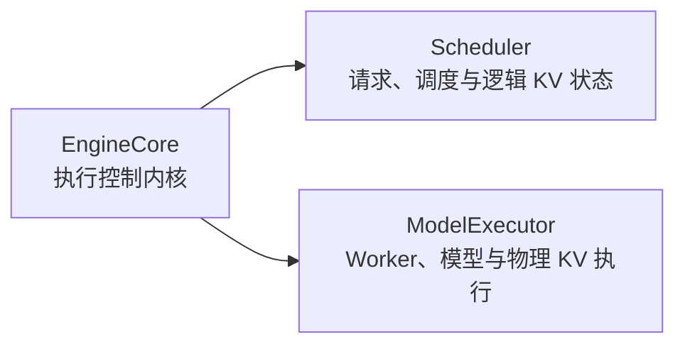
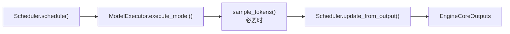
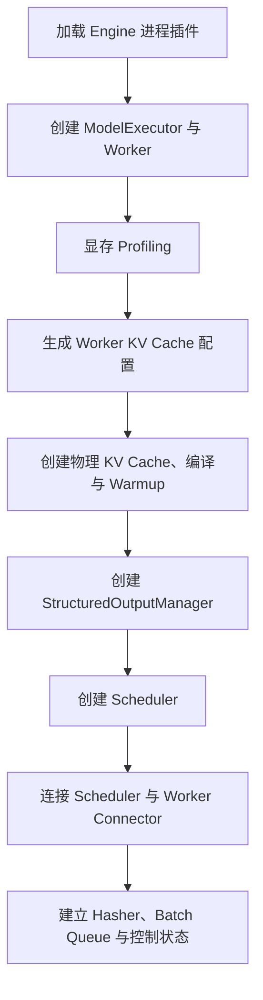

> 本文基于 [`vllm-project/vllm`](https://github.com/vllm-project/vllm) 的 `releases/v0.22.1` 分支，固定分析提交为 [`0decac0d`](https://github.com/vllm-project/vllm/tree/0decac0d96c42b49572498019f0a0e3600f50398)。本文只聚焦 [`vllm/v1/engine/core.py`](https://github.com/vllm-project/vllm/blob/0decac0d96c42b49572498019f0a0e3600f50398/vllm/v1/engine/core.py) 中的 `EngineCore` 基类；`EngineCoreProc`、`DPEngineCoreProc` 和客户端通信体系将在后续文章单独展开。

## 1. 最短答案

`EngineCore` 是 vLLM V1 的执行控制内核。它自己不实现模型算子，也不决定外部 API 的输入输出格式，而是持有两个最关键的组件：



它在每一轮推理中完成：



所以最准确的定位是：

> **Scheduler 是请求和 KV 状态机，ModelExecutor 是物理执行层，EngineCore 是把两者组织成持续推理循环的控制层。**

---

## 2. EngineCore 方法全景

`EngineCore` 基类的方法可以分成八组：

| 分组 | 方法 |
| --- | --- |
| 初始化 | `__init__()`、`_initialize_kv_caches()` |
| 能力查询 | `get_supported_tasks()`、`get_kv_cache_group_metadata()` |
| 请求管理 | `preprocess_add_request()`、`add_request()`、`abort_requests()`、`_process_aborts_queue()` |
| 推理循环 | `step()`、`post_step()`、`step_with_batch_queue()` |
| 可观测性 | `log_error_detail()`、`log_iteration_details()`、`profile()` |
| Cache 与生命周期 | `reset_mm_cache()`、`reset_prefix_cache()`、`reset_encoder_cache()`、`_reset_caches()`、`shutdown()` |
| 暂停与休眠 | `pause_scheduler()`、`resume_scheduler()`、`is_scheduler_paused()`、`sleep()`、`wake_up()`、`is_sleeping()` |
| Executor 控制与扩展 | `execute_dummy_batch()`、LoRA 方法、`save_sharded_state()`、`collective_rpc()`、Elastic EP 钩子 |

下面按真实调用关系逐一分析。

---

## 3. `__init__()`：构造可执行的 Engine

源码：[`EngineCore.__init__()`](https://github.com/vllm-project/vllm/blob/0decac0d96c42b49572498019f0a0e3600f50398/vllm/v1/engine/core.py#L97-L230)

`__init__()` 不是普通的字段赋值，而是一套完整的 Engine 启动过程：



### 3.1 构造参数

```python
def __init__(
    self,
    vllm_config: VllmConfig,
    executor_class: type[Executor],
    log_stats: bool,
    executor_fail_callback: Callable | None = None,
    include_finished_set: bool = False,
)
```

- `vllm_config`：全局配置对象。初始化期间会被读取，也会被 KV profiling 结果修改。
- `executor_class`：具体 Executor 类，而不是实例。EngineCore 借此与 UniProc、Multiproc、Ray 等部署方式解耦。
- `log_stats`：同时传给 EngineCore 和 Scheduler，控制运行指标生成。
- `executor_fail_callback`：将 Executor 后台故障重新投递到 EngineCore 主循环。
- `include_finished_set`：要求 Scheduler 在输出里携带完成的 request ID，供多 Engine 客户端清理 `request_id → engine` 映射。

### 3.2 加载插件

```python
from vllm.plugins import load_general_plugins
load_general_plugins()
```

多进程模式下，API Server、EngineCore 和 Worker 属于不同进程。前端加载过插件，不代表 EngineCore 进程已经加载，因此必须在创建 Executor 和 Scheduler 前再次执行插件注册。

### 3.3 创建 ModelExecutor

```python
self.model_executor = executor_class(vllm_config)
```

后续 KV Cache 初始化依赖 Executor 提供：

- Worker 数量和拓扑；
- 每个 Worker 负责的 layer；
- KV Cache spec；
- 模型加载后的显存占用；
- collective RPC。

如果传入失败回调：

```python
self.model_executor.register_failure_callback(
    executor_fail_callback
)
```

那么 Worker 或 Executor 的后台失败可以唤醒 EngineCore 主线程，避免错误只停留在后台线程。

### 3.4 Elastic EP 的提前钩子

```python
self.available_gpu_memory_for_kv_cache = -1

if envs.VLLM_ELASTIC_EP_SCALE_UP_LAUNCH:
    self._eep_scale_up_before_kv_init()
```

普通启动会在显存 profiling 后填写 `available_gpu_memory_for_kv_cache`。Elastic EP 新 rank 加入已有集群时，需要先完成部分扩容状态机，再进入 KV 初始化。

这里还有一个继承上的细节：基类构造函数调用了可覆盖方法。因此 `DPEngineCoreProc` 必须在 `super().__init__()` 前准备好 Elastic EP 所需字段。

### 3.5 初始化 KV Cache

```python
kv_cache_config = self._initialize_kv_caches(
    vllm_config
)
```

这是构造阶段最重的操作，下一节单独分析。

### 3.6 Structured Output 与 Scheduler

```python
self.structured_output_manager = (
    StructuredOutputManager(vllm_config)
)
Scheduler = (
    vllm_config.scheduler_config.get_scheduler_cls()
)
```

Scheduler 类不是写死的，可以由配置指定自定义实现。`StructuredOutputManager` 必须先创建，因为 Scheduler 会直接持有它，用于判断 grammar 编译状态和生成 bitmask。

如果模型没有 KV Cache group，代码会关闭 chunked prefill：

```python
if len(kv_cache_config.kv_cache_groups) == 0:
    ...
    enable_chunked_prefill = False
```

随后计算两种 block size：

```python
scheduler_block_size, hash_block_size = (
    resolve_kv_cache_block_sizes(...)
)
```

- `scheduler_block_size`：Scheduler 的 token 对齐和 KV 分配粒度。
- `hash_block_size`：前缀缓存和 KV Connector 计算 block hash 的粒度。

对于多个 hybrid KV group，Scheduler 粒度可能取各组 block size 的最小公倍数，而 hash 粒度可以取最大公约数，因此两者不一定相同。

### 3.7 创建 Scheduler

```python
self.scheduler = Scheduler(
    vllm_config=vllm_config,
    kv_cache_config=kv_cache_config,
    structured_output_manager=...,
    include_finished_set=include_finished_set,
    log_stats=self.log_stats,
    block_size=scheduler_block_size,
    hash_block_size=hash_block_size,
)
```

Scheduler 必须在 KV profiling 和物理 KV Cache 初始化后创建，因为此时以下信息才最终确定：

- `num_gpu_blocks`；
- KV cache groups；
- block size；
- `max_model_len`；
- KV Connector 相关配置。

### 3.8 Connector 和多模态缓存

如果 Scheduler 创建了 KV Connector：

```python
self.model_executor.init_kv_output_aggregator(
    self.scheduler.connector
)
```

EngineCore 随后收集所有 Worker 的 KV Connector 握手信息，并合并成：

```python
{
    tp_rank: worker_metadata
}
```

再交给 Scheduler Connector。该步骤必须位于 Worker KV Cache 注册之后，否则握手信息不完整。

多模态缓存通过：

```python
self.mm_receiver_cache = (
    MULTIMODAL_REGISTRY
    .engine_receiver_cache_from_config(vllm_config)
)
```

创建，稍后在请求预处理阶段恢复跨进程传输的多模态特征。

### 3.9 Batch Queue 和 step 选择

```python
self.batch_queue_size = (
    self.model_executor.max_concurrent_batches
)
```

当并发 batch 数大于 1 时：

```python
self.batch_queue = deque(
    maxlen=self.batch_queue_size
)
```

最终把热路径绑定到具体方法：

```python
self.step_fn = (
    self.step
    if self.batch_queue is None
    else self.step_with_batch_queue
)
```

这样运行时不必每轮重新判断是否启用 batch queue。

### 3.10 其他运行状态

```python
self.is_ec_consumer = ...
self.is_pooling_model = ...
self.request_block_hasher = ...
self.async_scheduling = ...
self.aborts_queue = queue.Queue()
self._idle_state_callbacks = []
```

- `is_ec_consumer`：区分 Encoder Cache producer/consumer。
- `is_pooling_model`：Pooling 模型不走普通 token sampling。
- `request_block_hasher`：为 prefix caching 或 KV transfer 增量计算完整 block 的 hash。
- `aborts_queue`：允许模型执行期间并发接收 abort。
- `_idle_state_callbacks`：用于异步完成 pause/sleep。

最后冻结启动阶段的 Python heap：

```python
freeze_gc_heap()
```

这些长期对象不再被老年代 GC 重复扫描，可以降低推理时的 GC pause。`shutdown()` 会对应执行 `gc.unfreeze()`。

---

## 4. `_initialize_kv_caches()`：对齐逻辑和物理 KV Cache

源码：[`_initialize_kv_caches()`](https://github.com/vllm-project/vllm/blob/0decac0d96c42b49572498019f0a0e3600f50398/vllm/v1/engine/core.py#L235-L313)

### 4.1 查询各 Worker 的 KV 规格

```python
kv_cache_specs = (
    self.model_executor.get_kv_cache_specs()
)
```

概念结果是：

```python
[
    {
        "model.layers.0.self_attn": FullAttentionSpec(...),
        "model.layers.1.self_attn": FullAttentionSpec(...),
    },
    # 其他 Worker
]
```

PP 场景下，不同 Worker 负责不同 layer；同一 layer 在不同 TP rank 上必须具有一致的 KV 规格。

### 4.2 计算 KV Cache 可用显存

如果模型需要 KV Cache：

```python
available_gpu_memory = (
    self.model_executor.determine_available_memory()
)
```

Worker 会通过 profiling forward 统计权重、峰值激活、编译和 CUDA Graph 等开销，再根据 `gpu_memory_utilization` 给出 KV Cache 预算。

没有 KV Cache 的 attention-free 或部分 encoder/pooling 模型直接使用零预算。

### 4.3 生成各 Worker 的物理配置

```python
kv_cache_configs = get_kv_cache_configs(
    vllm_config,
    kv_cache_specs,
    available_gpu_memory,
)
```

该函数会：

1. 合并全部 Worker 的 layer specs；
2. 构造 Full Attention、Sliding Window、Mamba 等 KV group；
3. 将全局 group 投影回各 PP Worker；
4. 计算每个 Worker 能容纳的 block 数；
5. 取所有 Worker 共同支持的最小 block 数；
6. 执行 `max_model_len` 的 auto-fit 和显存检查；
7. 生成每个 Worker 的 `KVCacheConfig`。

集中式 Scheduler 必须在所有 Worker 上使用同一 block 编号空间，所以不能让某个 PP stage 拥有比其他 stage 更多的可调度 block。

### 4.4 同步 auto-fit 后的最大长度

```python
if max_model_len_after != max_model_len_before:
    self.collective_rpc(
        "update_max_model_len",
        args=(max_model_len_after,),
    )
```

Worker 在 profiling 前已经创建，内部可能保存旧值。如果 auto-fit 缩短了模型最大长度，EngineCore 必须同步更新所有 Worker。

### 4.5 生成 Scheduler 逻辑视图

```python
scheduler_kv_cache_config = (
    generate_scheduler_kv_cache_config(
        kv_cache_configs
    )
)
```

Worker 配置描述具体 layer 和物理 tensor；Scheduler 只需要统一的 group、block 数和 block size。生成逻辑视图后，代码回写：

```python
vllm_config.cache_config.num_gpu_blocks = ...
vllm_config.cache_config.block_size = ...
```

因此 `vllm_config` 在这里会被运行时探测结果修改。

### 4.6 创建物理 KV Cache

```python
self.model_executor.initialize_from_config(
    kv_cache_configs
)
```

Executor 将配置下发到 Worker，完成：

- KV tensor 分配；
- Attention layer 与 KV tensor 绑定；
- 模型编译；
- CUDA Graph 捕获；
- warmup。

执行结束后，模型才真正具备处理 `SchedulerOutput` 的条件。

---

## 5. `get_supported_tasks()`：查询模型能力

源码：[`get_supported_tasks()`](https://github.com/vllm-project/vllm/blob/0decac0d96c42b49572498019f0a0e3600f50398/vllm/v1/engine/core.py#L315-L316)

```python
def get_supported_tasks(self):
    return self.model_executor.supported_tasks
```

该方法只是将 Executor/Worker 确认的模型能力暴露给前端，例如：

- `generate`；
- `embed`；
- `classify`；
- `score`。

它由 `EngineCoreClient` 通过本地调用或 Utility RPC 获取。

---

## 6. `get_kv_cache_group_metadata()`：导出 Scheduler KV 信息

源码：[`get_kv_cache_group_metadata()`](https://github.com/vllm-project/vllm/blob/0decac0d96c42b49572498019f0a0e3600f50398/vllm/v1/engine/core.py#L318-L335)

该方法把 Scheduler 的 `KVCacheConfig` 转换成易于 msgpack 序列化的元数据：

```python
{
    "group_idx": group_idx,
    "kind": ...,
    "block_size": ...,
    "sliding_window": ...,
}
```

这里不会返回物理 KV tensor，只提供：

- group 编号；
- KV 类型；
- block size；
- sliding window。

它属于控制面查询接口，适合前端、调试和运行时编排获取逻辑 KV 布局。

---

## 7. `preprocess_add_request()`：从传输对象构造内部 Request

源码：[`preprocess_add_request()`](https://github.com/vllm-project/vllm/blob/0decac0d96c42b49572498019f0a0e3600f50398/vllm/v1/engine/core.py#L794-L816)

前端传给 EngineCore 的是可序列化 `EngineCoreRequest`，而 Scheduler 管理的是内部 `Request`。转换过程为：

```text
EngineCoreRequest
    ↓
恢复多模态 Feature
    ↓
Request.from_engine_core_request()
    ↓
初始化 Structured Output Grammar
    ↓
(Request, current_wave)
```

如果存在 Engine 级多模态缓存：

```python
request.mm_features = (
    self.mm_receiver_cache
    .get_and_update_features(request.mm_features)
)
```

然后创建内部 Request：

```python
req = Request.from_engine_core_request(
    request,
    self.request_block_hasher,
)
```

`request_block_hasher` 会让 Request 后续能够随着 token 增长，增量生成 prefix-cache block hash。

Structured Output 请求还会调用：

```python
self.structured_output_manager.grammar_init(req)
```

grammar 可以异步编译；Scheduler 在其未就绪时不会错误地调度该请求。

在 `EngineCoreProc` 中，这个方法运行于输入处理线程，从而让多模态恢复、Request 构造和 grammar 初始化与 GPU forward 重叠。

---

## 8. `add_request()`：将 Request 交给 Scheduler

源码：[`add_request()`](https://github.com/vllm-project/vllm/blob/0decac0d96c42b49572498019f0a0e3600f50398/vllm/v1/engine/core.py#L337-L372)

首先验证 `request_id` 必须是字符串：

```python
if not isinstance(request.request_id, str):
    raise TypeError(...)
```

对于 pooling 请求，检查具体 task 是否属于模型支持的 pooling task：

```python
if pooling_params.task not in supported_pooling_tasks:
    raise ValueError(...)
```

如果请求携带 `kv_transfer_params`，但当前 Scheduler 没有 KV Connector，只记录警告。随后：

```python
self.scheduler.add_request(request)
```

真正将 Request 放入 Scheduler 的 `waiting` 队列。

如果 `abort_immediately=True`，请求仍然先进入 Scheduler，再走标准 abort：

```python
self.abort_requests([request.request_id])
```

这是为了让 Connector 的 `request_finished` hook 得到执行，从而释放 admission 阶段预留的远端 KV 资源。

---

## 9. `abort_requests()`：结束请求

源码：[`abort_requests()`](https://github.com/vllm-project/vllm/blob/0decac0d96c42b49572498019f0a0e3600f50398/vllm/v1/engine/core.py#L374-L381)

```python
self.scheduler.finish_requests(
    request_ids,
    RequestStatus.FINISHED_ABORTED,
)
```

EngineCore 不直接删除 waiting/running 队列，也不直接释放 KV block。这些状态都由 Scheduler 的统一完成路径处理。

这样用户主动取消、关闭服务和 admission rejection 可以共享相同的资源回收逻辑。

---

## 10. `_process_aborts_queue()`：处理 forward 期间到达的 Abort

源码：[`_process_aborts_queue()`](https://github.com/vllm-project/vllm/blob/0decac0d96c42b49572498019f0a0e3600f50398/vllm/v1/engine/core.py#L587-L595)

多进程模式下，输入线程可能在 EngineCore 主线程等待 GPU Future 时收到 abort。它会把 request ID 放入独立的 `aborts_queue`。

模型返回后，EngineCore 将多个 abort 合并：

```python
while not self.aborts_queue.empty():
    request_ids.extend(...)

self.abort_requests(request_ids)
```

批量调用一次 Scheduler 比逐请求 abort 更高效。

更重要的是处理时机：

```text
模型 forward 完成
    ↓
处理 aborts_queue
    ↓
Scheduler.update_from_output()
```

这能避免已经取消的请求继续消费本轮模型输出。

---

## 11. `log_error_detail()`：模型执行异常上下文

源码：[`log_error_detail()`](https://github.com/vllm-project/vllm/blob/0decac0d96c42b49572498019f0a0e3600f50398/vllm/v1/engine/core.py#L383-L397)

这是一个 context manager：

```python
with self.log_error_detail(scheduler_output):
    model_output = future.result()
```

如果模型执行抛出普通 `Exception`，它会调用：

```python
dump_engine_exception(
    self.vllm_config,
    scheduler_output,
    self.scheduler.make_stats(),
)
```

记录：

- 本轮 SchedulerOutput；
- Engine 配置；
- Scheduler 状态与统计。

随后重新抛出原异常。它不捕获 `BaseException`，因此不会把 `SystemExit`、`KeyboardInterrupt` 等进程控制事件误判为模型执行故障。

---

## 12. `log_iteration_details()`：记录单轮工作量和耗时

源码：[`log_iteration_details()`](https://github.com/vllm-project/vllm/blob/0decac0d96c42b49572498019f0a0e3600f50398/vllm/v1/engine/core.py#L399-L426)

仅在：

```python
enable_logging_iteration_details=True
```

时启用。进入 context 前，通过 `compute_iteration_details()` 统计：

- context/prefill request 数量；
- context token 数量；
- generation request 数量；
- generation token 数量。

退出时记录这一轮从等待模型结果到完成处理的耗时，并递增 `_iteration_index`。

关闭该配置时，context manager 直接 `yield`，避免额外统计开销。

---

## 13. `step()`：普通推理主循环

源码：[`step()`](https://github.com/vllm-project/vllm/blob/0decac0d96c42b49572498019f0a0e3600f50398/vllm/v1/engine/core.py#L428-L457)

这是 EngineCore 最核心的方法。

### 13.1 空闲检查

```python
if not self.scheduler.has_requests():
    return {}, False
```

这里的 `has_requests()` 不只表示存在未完成请求，也可能表示完成请求尚未从当前 batch 中清理。

### 13.2 Scheduler 生成执行计划

```python
scheduler_output = self.scheduler.schedule()
```

`SchedulerOutput` 描述本轮物理执行需要的内容，例如：

- scheduled request IDs；
- 每个 Request 执行多少 token；
- 新分配和释放的 KV block；
- resumed/preempted 请求；
- speculative token；
- encoder input；
- KV Connector metadata。

### 13.3 非阻塞提交模型

```python
future = self.model_executor.execute_model(
    scheduler_output,
    non_block=True,
)
```

EngineCore 拿到 Future，而不是立即得到结果。不同 Executor 可以在内部使用进程消息队列、Ray RPC 或本地调用。

### 13.4 准备 grammar bitmask

```python
grammar_output = (
    self.scheduler
    .get_grammar_bitmask(scheduler_output)
)
```

Structured Output 请求需要对 sampling token 进行约束。该 bitmask 与本轮调度结果对齐。

### 13.5 等待结果并 sampling

```python
model_output = future.result()

if model_output is None:
    model_output = self.model_executor.sample_tokens(
        grammar_output
    )
```

不同执行模式可能：

- 在 `execute_model()` 内完成 sampling 并直接返回 `ModelRunnerOutput`；
- 只完成 forward，返回 `None`，由 EngineCore 再调用 `sample_tokens()`。

### 13.6 更新 Scheduler

在模型输出交给 Scheduler 前，先处理 forward 期间收到的 abort：

```python
self._process_aborts_queue()
```

然后：

```python
engine_core_outputs = (
    self.scheduler.update_from_output(
        scheduler_output,
        model_output,
    )
)
```

Scheduler 在这里：

- 把新 token 添加到 Request；
- 判断 stop/length；
- 更新 computed token 数；
- 接受或拒绝 speculative token；
- 释放完成请求的 KV block；
- 生成按 `client_index` 分组的 `EngineCoreOutputs`。

最后返回：

```python
(
    engine_core_outputs,
    scheduler_output.total_num_scheduled_tokens > 0,
)
```

第二个布尔值表示本轮是否真的执行了模型 token，而不是简单表示 Scheduler 是否被调用。

---

## 14. `post_step()`：回收 speculative draft token

源码：[`post_step()`](https://github.com/vllm-project/vllm/blob/0decac0d96c42b49572498019f0a0e3600f50398/vllm/v1/engine/core.py#L459-L467)

普通非异步 scheduling 的 speculative decoding 路径中：

```python
draft_token_ids = (
    self.model_executor.take_draft_token_ids()
)
```

然后：

```python
self.scheduler.update_draft_token_ids(
    draft_token_ids
)
```

Scheduler 需要保存新的 draft token，供下一轮构造调度计划。

当启用 async scheduling 时，draft token 已在 Worker 内更新，不再由 EngineCore 重复回写。

---

## 15. `step_with_batch_queue()`：流水线批次执行

源码：[`step_with_batch_queue()`](https://github.com/vllm-project/vllm/blob/0decac0d96c42b49572498019f0a0e3600f50398/vllm/v1/engine/core.py#L469-L585)

当 `max_concurrent_batches > 1` 时，EngineCore 使用这一实现。

队列元素为：

```python
(
    sample_or_model_future,
    scheduler_output,
    execute_model_future,
)
```

整体策略是：

```text
队列未满并且可以调度
    ↓
优先提交新 batch
    ↓
还能继续填充时，不等待最老 batch
    ↓
队列满或没有新 batch
    ↓
等待最早提交的 Future
    ↓
更新 Scheduler
```

### 15.1 为什么优先填队列

PP 场景中，同时保留多个在途 batch 才能让不同 pipeline stage 持续工作。若每提交一批就立即等待输出，会重新退化成串行执行并产生 pipeline bubble。

### 15.2 sampling Future 的选择

Pooling 模型或本轮没有真实 token 执行时，直接把 `execute_model` Future 放入队列。

普通生成模型如果不等待 structured-output token：

```python
future = self.model_executor.sample_tokens(
    grammar_output,
    non_block=True,
)
```

如果 structured output 依赖前一轮 token，sampling 被暂存为 `deferred_scheduler_output`，等旧 batch 输出处理完再计算 grammar bitmask。

### 15.3 消费最老结果

```python
future, scheduler_output, exec_model_fut = (
    batch_queue.pop()
)
model_output = future.result()
```

如果 sampling Future 返回 `None`，代码会访问原始 `exec_model_fut.result()`，优先抛出真正的模型执行异常。

### 15.4 deferred structured-output sampling

Speculative decoding 下，先获取上一轮 draft tokens：

```python
draft_token_ids = (
    self.model_executor.take_draft_token_ids()
)
```

再调用：

```python
self.scheduler.update_draft_token_ids_in_output(
    draft_token_ids,
    deferred_scheduler_output,
)
```

目的是把无效 speculative token 填充为 `-1` 并从 grammar bitmask 计算中跳过。之后才能正确提交 deferred sampling。

普通 `step()` 是一轮完成后再开始下一轮，而 batch queue 把调度、模型执行、sampling 和结果回写变成多个在途阶段。

---

## 16. `shutdown()`：对称释放启动资源

源码：[`shutdown()`](https://github.com/vllm-project/vllm/blob/0decac0d96c42b49572498019f0a0e3600f50398/vllm/v1/engine/core.py#L597-L611)

关闭顺序为：

```python
self.structured_output_manager.clear_backend()
self.model_executor.shutdown()
self.scheduler.shutdown()
gc.unfreeze()
cleanup_dist_env_and_memory()
```

这里释放：

- grammar backend 与线程池资源；
- Worker/Executor；
- Scheduler Connector 和事件发布器；
- 初始化时冻结的 GC heap；
- torch distributed 状态；
- 缓存的设备内存。

`gc.unfreeze()` 对进程内反复创建和销毁 Engine 尤其重要，否则启动阶段对象可能持续留在永久代。

---

## 17. `profile()`：透传性能采集控制

源码：[`profile()`](https://github.com/vllm-project/vllm/blob/0decac0d96c42b49572498019f0a0e3600f50398/vllm/v1/engine/core.py#L613-L614)

```python
self.model_executor.profile(
    is_start,
    profile_prefix,
)
```

EngineCore 不实现 profiler，只负责把开始/停止命令广播到执行层。多进程客户端通常通过 Utility RPC 调用它。

---

## 18. `reset_mm_cache()`：重置多模态缓存

源码：[`reset_mm_cache()`](https://github.com/vllm-project/vllm/blob/0decac0d96c42b49572498019f0a0e3600f50398/vllm/v1/engine/core.py#L616-L629)

如果仍有请求执行，代码会警告：

```text
EngineCore Receiver Cache
Worker Receiver Cache
Frontend Sender Cache
```

可能失去同步。

随后分别清理：

```python
self.mm_receiver_cache.clear_cache()
self.model_executor.reset_mm_cache()
```

也就是同时清理 EngineCore 逻辑接收缓存和 Worker 侧物理缓存。

---

## 19. `reset_prefix_cache()`：重置前缀 KV 缓存

源码：[`reset_prefix_cache()`](https://github.com/vllm-project/vllm/blob/0decac0d96c42b49572498019f0a0e3600f50398/vllm/v1/engine/core.py#L631-L636)

```python
return self.scheduler.reset_prefix_cache(
    reset_running_requests,
    reset_connector,
)
```

Prefix Cache 属于 Scheduler/KV Cache Manager 的逻辑状态，因此 EngineCore 直接委托 Scheduler。

- `reset_running_requests`：是否连正在运行请求相关的缓存状态一起重置。
- `reset_connector`：是否同步重置 KV Connector 状态。

返回值表示重置是否成功。

---

## 20. `reset_encoder_cache()`：同时重置逻辑与物理 Encoder Cache

源码：[`reset_encoder_cache()`](https://github.com/vllm-project/vllm/blob/0decac0d96c42b49572498019f0a0e3600f50398/vllm/v1/engine/core.py#L638-L656)

Encoder Cache 存在两份状态：

```text
Scheduler EncoderCacheManager
    └── 逻辑记录、引用关系

ModelRunner Encoder Cache
    └── GPU 上的真实 encoder output
```

因此必须同时调用：

```python
self.scheduler.reset_encoder_cache()
self.model_executor.reset_encoder_cache()
```

典型场景是模型权重更新后，旧 vision embedding 或 encoder output 已经失效，必须避免继续复用。

---

## 21. `_reset_caches()`：统一 Cache 重置入口

源码：[`_reset_caches()`](https://github.com/vllm-project/vllm/blob/0decac0d96c42b49572498019f0a0e3600f50398/vllm/v1/engine/core.py#L658-L661)

```python
self.reset_prefix_cache(...)
self.reset_mm_cache()
self.reset_encoder_cache()
```

该私有方法主要被 `pause_scheduler()` 和 `sleep()` 使用，确保进入休眠或重新加载权重前，三类可能失效的缓存都被清理。

---

## 22. `pause_scheduler()`：停止调度

源码：[`pause_scheduler()`](https://github.com/vllm-project/vllm/blob/0decac0d96c42b49572498019f0a0e3600f50398/vllm/v1/engine/core.py#L663-L692)

支持三种语义：

| mode | 新请求 | 已有请求 | Scheduler 状态 |
| --- | --- | --- | --- |
| `abort` | 排队 | 立即 abort | `PAUSED_NEW` |
| `wait` | 排队 | 等待完成 | `PAUSED_NEW` |
| `keep` | 排队 | 冻结保留 | `PAUSED_ALL` |

基类属于 in-process EngineCore，因此不支持异步等待已有请求排空：

```python
if mode == "wait":
    raise ValueError(...)
```

`abort` 模式先完成所有 Request：

```python
self.scheduler.finish_requests(
    None,
    RequestStatus.FINISHED_ABORTED,
)
```

然后设置 PauseState。需要清缓存时调用 `_reset_caches()`。

基类总是同步完成并返回 `None`；`EngineCoreProc` 会覆盖该方法，通过 Future 等待输出队列真正排空。

---

## 23. `resume_scheduler()`：恢复 Scheduler

源码：[`resume_scheduler()`](https://github.com/vllm-project/vllm/blob/0decac0d96c42b49572498019f0a0e3600f50398/vllm/v1/engine/core.py#L694-L696)

```python
self.scheduler.set_pause_state(
    PauseState.UNPAUSED
)
```

暂停期间进入 Scheduler 的新请求不会丢失。恢复后它们重新参与正常调度。

DP/MoE 子类会覆盖该方法，并在恢复前后增加 DP rank 间同步。

---

## 24. `is_scheduler_paused()`：查询暂停状态

源码：[`is_scheduler_paused()`](https://github.com/vllm-project/vllm/blob/0decac0d96c42b49572498019f0a0e3600f50398/vllm/v1/engine/core.py#L698-L700)

```python
return (
    self.scheduler.pause_state
    != PauseState.UNPAUSED
)
```

它同时把 `PAUSED_NEW` 和 `PAUSED_ALL` 视为已暂停，不区分具体 pause mode。

---

## 25. `sleep()`：先停调度，再处理 GPU 内存

源码：[`sleep()`](https://github.com/vllm-project/vllm/blob/0decac0d96c42b49572498019f0a0e3600f50398/vllm/v1/engine/core.py#L702-L738)

Sleep level：

| level | 行为 |
| --- | --- |
| `0` | 只暂停 Scheduler，不改变 GPU 内存 |
| `1` | 权重 offload 到 CPU，丢弃 KV Cache |
| `2` | 丢弃全部 GPU 内存 |

首先：

```python
pause_future = self.pause_scheduler(
    mode=mode,
    clear_cache=level >= 1,
)
```

Level 0 到此结束。

Level 1/2 才调用：

```python
self.model_executor.sleep(level)
```

如果子类的 pause 是异步 Future，`sleep()` 会创建新的 Future，并在 pause 完成回调里执行 Executor sleep：

```text
Pause 请求
    ↓
等待请求与输出排空
    ↓
清理 Cache
    ↓
Executor.sleep(level)
    ↓
Sleep Future 完成
```

这样不会在仍有 in-flight 模型执行或输出时直接释放 GPU 内存。

---

## 26. `wake_up()`：恢复内存与调度

源码：[`wake_up()`](https://github.com/vllm-project/vllm/blob/0decac0d96c42b49572498019f0a0e3600f50398/vllm/v1/engine/core.py#L740-L754)

`tags` 中的 `"scheduling"` 是 EngineCore 层标签，不需要传给 Executor：

```python
tags = [
    tag for tag in tags
    if tag != "scheduling"
]
```

如果还存在其他 tag，先调用：

```python
self.model_executor.wake_up(tags)
```

最后统一：

```python
self.resume_scheduler()
```

也就是说 wake-up 顺序是：

```text
恢复权重 / GPU 内存
    ↓
恢复 Scheduler
```

避免 Scheduler 在模型资源尚未恢复时开始提交 batch。

---

## 27. `is_sleeping()`：综合判断 Engine 是否休眠

源码：[`is_sleeping()`](https://github.com/vllm-project/vllm/blob/0decac0d96c42b49572498019f0a0e3600f50398/vllm/v1/engine/core.py#L756-L758)

```python
return (
    self.is_scheduler_paused()
    or self.model_executor.is_sleeping
)
```

只暂停调度的 level 0 和真正释放 GPU 内存的 level 1/2，都被视为 sleeping。

---

## 28. `execute_dummy_batch()`：保持分布式 collective 对齐

源码：[`execute_dummy_batch()`](https://github.com/vllm-project/vllm/blob/0decac0d96c42b49572498019f0a0e3600f50398/vllm/v1/engine/core.py#L760-L761)

```python
self.model_executor.execute_dummy_batch()
```

基类只负责透传。其主要使用者是 `DPEngineCoreProc`：

- 某些 DP/EP rank 有真实请求；
- 当前 rank 没有可执行请求；
- 但该 rank 仍必须进入相同的 MoE collective。

此时执行 dummy batch，避免其他 rank 卡在 collective。

---

## 29. `add_lora()`：加载 LoRA

源码：[`add_lora()`](https://github.com/vllm-project/vllm/blob/0decac0d96c42b49572498019f0a0e3600f50398/vllm/v1/engine/core.py#L763-L764)

```python
return self.model_executor.add_lora(
    lora_request
)
```

Executor 负责把 LoRA 广播到所有相关 Worker，并返回是否加载成功。

---

## 30. `remove_lora()`：卸载 LoRA

源码：[`remove_lora()`](https://github.com/vllm-project/vllm/blob/0decac0d96c42b49572498019f0a0e3600f50398/vllm/v1/engine/core.py#L766-L767)

```python
return self.model_executor.remove_lora(lora_id)
```

EngineCore 不维护独立 LoRA 列表，真实状态以 Executor/Worker 为准。

---

## 31. `list_loras()`：查询已加载 LoRA

源码：[`list_loras()`](https://github.com/vllm-project/vllm/blob/0decac0d96c42b49572498019f0a0e3600f50398/vllm/v1/engine/core.py#L769-L770)

```python
return self.model_executor.list_loras()
```

返回 `set[int]`，即已加载 LoRA ID 集合。

---

## 32. `pin_lora()`：固定 LoRA

源码：[`pin_lora()`](https://github.com/vllm-project/vllm/blob/0decac0d96c42b49572498019f0a0e3600f50398/vllm/v1/engine/core.py#L772-L773)

```python
return self.model_executor.pin_lora(lora_id)
```

Pin 的作用是防止指定 LoRA 因缓存容量和替换策略被驱逐。具体缓存和替换行为仍由 Worker 的 LoRA Manager 实现。

---

## 33. `save_sharded_state()`：保存分片模型状态

源码：[`save_sharded_state()`](https://github.com/vllm-project/vllm/blob/0decac0d96c42b49572498019f0a0e3600f50398/vllm/v1/engine/core.py#L775-L783)

```python
self.model_executor.save_sharded_state(
    path=path,
    pattern=pattern,
    max_size=max_size,
)
```

EngineCore 只暴露控制接口，Executor 根据 TP/PP Worker 拓扑保存各自负责的权重分片。

- `path`：保存目录；
- `pattern`：分片文件命名模式；
- `max_size`：单个分片最大大小。

---

## 34. `collective_rpc()`：向全部 Worker 调用方法

源码：[`collective_rpc()`](https://github.com/vllm-project/vllm/blob/0decac0d96c42b49572498019f0a0e3600f50398/vllm/v1/engine/core.py#L785-L792)

```python
return self.model_executor.collective_rpc(
    method,
    timeout,
    args,
    kwargs,
)
```

它是 EngineCore 到 Worker 控制面的通用入口，可以传：

- 方法名字符串；
- Callable；
- positional args；
- keyword args；
- timeout。

返回值是每个 Worker 的结果列表。

初始化阶段同步 `max_model_len`、profiling、LoRA、保存权重等高层接口，最终都建立在类似的 Executor collective 能力上。

---

## 35. `_eep_scale_up_before_kv_init()`：Elastic EP 初始化扩展点

源码：[`_eep_scale_up_before_kv_init()`](https://github.com/vllm-project/vllm/blob/0decac0d96c42b49572498019f0a0e3600f50398/vllm/v1/engine/core.py#L818-L819)

基类实现：

```python
raise NotImplementedError
```

只有 Elastic EP 扩容启动路径会调用它。`DPEngineCoreProc` 覆盖后创建 `ElasticEPScalingState`，在 KV Cache 初始化前推进新 rank 的分布式重配置状态。

普通 EngineCore 不应进入该路径。

---

## 36. `_eep_send_engine_core_notification()`：Elastic EP 通知扩展点

源码：[`_eep_send_engine_core_notification()`](https://github.com/vllm-project/vllm/blob/0decac0d96c42b49572498019f0a0e3600f50398/vllm/v1/engine/core.py#L821-L827)

基类同样抛出 `NotImplementedError`。

DP 子类用它向 EngineCoreClient 发送 Elastic EP 生命周期通知，例如：

- 新 EngineCore 初始化完成；
- 新 rank 权重准备完成；
- 分布式重配置完成；
- 被移除 rank 已关闭。

它被保留在 EngineCore 基类中，是因为 `__init__()` 的 Elastic EP 分支需要通过统一的多态接口调用子类行为。

---

## 37. 把所有方法重新串成一条请求链路

### 37.1 Engine 启动

```text
EngineCore.__init__()
    ├── 创建 ModelExecutor
    ├── _initialize_kv_caches()
    ├── 创建 StructuredOutputManager
    ├── 创建 Scheduler
    └── 选择 step_fn
```

### 37.2 请求进入

```text
EngineCoreRequest
    ↓
preprocess_add_request()
    ↓
Request
    ↓
add_request()
    ↓
Scheduler.waiting
```

### 37.3 单轮推理

```text
step()
    ├── Scheduler.schedule()
    ├── ModelExecutor.execute_model()
    ├── get_grammar_bitmask()
    ├── sample_tokens()
    ├── _process_aborts_queue()
    └── Scheduler.update_from_output()
          ↓
    EngineCoreOutputs
```

### 37.4 Pipeline/异步执行

```text
step_with_batch_queue()
    ├── 尽量填充在途 batch
    ├── 延迟等待最老 Future
    ├── 处理 deferred grammar sampling
    └── 回写 Scheduler
```

### 37.5 管理操作

```text
pause_scheduler()
    ↓
_reset_caches()
    ↓
ModelExecutor.sleep()
    ↓
wake_up()
    ↓
resume_scheduler()
```

---

## 38. EngineCore 的设计边界

分析所有函数后，可以清楚看到 `EngineCore` 刻意不负责什么。

### 38.1 它不负责外部输入解析

Prompt、Chat Template、tokenization 和外部请求校验发生在 Engine 前端。EngineCore 接收的已经是 `EngineCoreRequest`。

### 38.2 它不实现调度策略

请求优先级、preemption、token budget 和 KV block 选择属于 Scheduler。

### 38.3 它不执行模型算子

Attention、GEMM、sampling kernel 和 Worker 拓扑属于 ModelExecutor/Worker/ModelRunner。

### 38.4 它负责跨组件一致性

EngineCore 真正负责的是：

- 让 Scheduler 和 Worker 使用一致的 KV Cache 配置；
- 保证 schedule、execute、update 顺序正确；
- 在模型执行期间安全处理 abort；
- 让 structured output、spec decode 和 pipeline batch 正确协作；
- 为 pause、sleep、LoRA 和 RPC 提供统一控制入口。

---

## 39. 阅读 EngineCore 时最值得记住的五点

1. **`EngineCoreRequest` 不是 Scheduler 内部的 `Request`。**  
   两者之间还有多模态恢复、block hash 和 grammar 初始化。

2. **Scheduler 必须在 KV Cache profiling 之后创建。**  
   Scheduler 的逻辑 block 空间必须与所有 Worker 的物理 KV Cache 对齐。

3. **`step()` 的核心不是模型 forward，而是状态闭环。**  
   `schedule → execute → update` 缺一不可。

4. **batch queue 保存的是多个在途执行阶段。**  
   它用于隐藏 PP bubble 和异步执行延迟，不是简单的请求等待队列。

5. **EngineCore 基类保持部署无关。**  
   ZMQ 进程通信、DP wave、Ray Actor 和 Elastic EP 的具体协调主要由子类增加。

从这里继续向下阅读，最自然的下一站是 `Scheduler.schedule()`：它会解释 `EngineCore.step()` 拿到的 `SchedulerOutput` 究竟如何从 waiting/running Request、token budget 和 KV Cache Manager 中生成。
