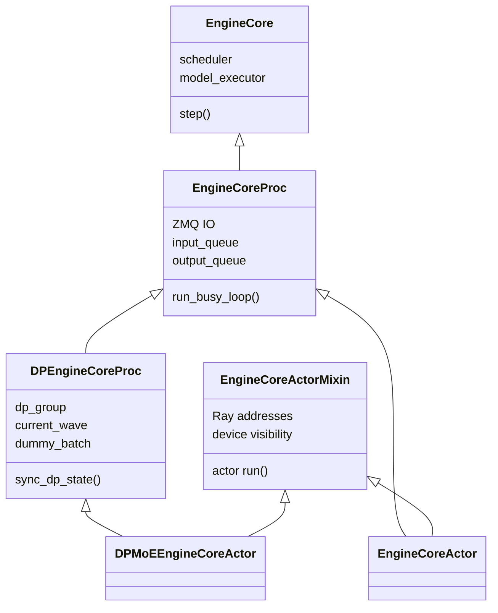
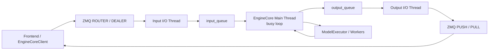
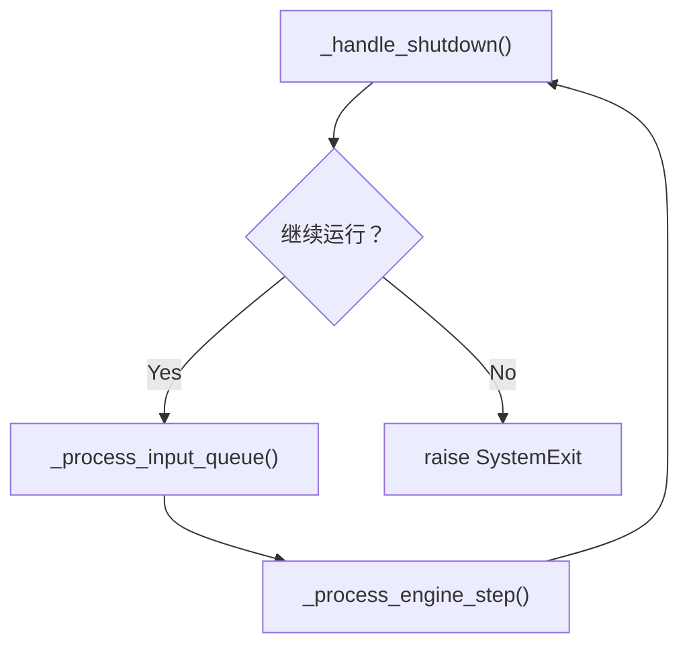
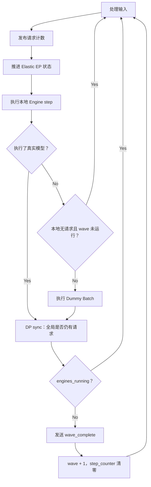
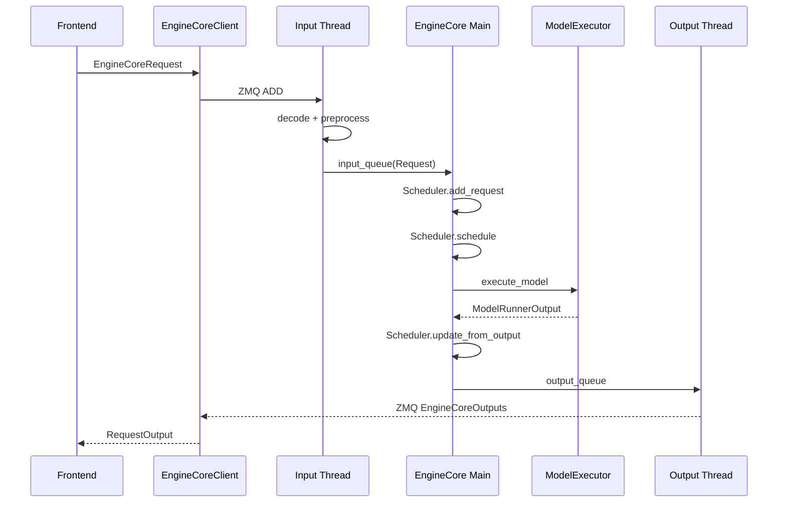

> 本文基于 [`vllm-project/vllm`](https://github.com/vllm-project/vllm) 的 `releases/v0.22.1` 分支，固定分析提交为 [`0decac0d`](https://github.com/vllm-project/vllm/tree/0decac0d96c42b49572498019f0a0e3600f50398)。上一篇文章已经逐函数分析 [`EngineCore` 基类]({{ '/articles/vllm-enginecore-source-walkthrough/' | relative_url }})；本文继续分析其进程、MoE DP 和 Ray 派生实现。

## 1. 最短答案

`EngineCore` 子类没有重新实现 Scheduler 或模型推理算法，而是在基类之上依次增加三类能力：



可以把每一层理解为：

| 类 | 新增职责 |
| --- | --- |
| `EngineCoreProc` | 把 EngineCore 放进独立进程，增加 ZMQ、I/O 线程、请求协议、busy loop 和进程关闭 |
| `DPEngineCoreProc` | 为 MoE DP/EP 增加 wave、dummy forward、跨 rank 完成同步和 Elastic EP |
| `EngineCoreActorMixin` | 把进程启动和握手替换为 Ray Actor 生命周期、地址注入和设备隔离 |
| `EngineCoreActor` | Ray 环境中的普通 EngineCoreProc |
| `DPMoEEngineCoreActor` | Ray 环境中的 MoE DPEngineCoreProc |

最关键的运行时选型是：

```text
DP > 1 并且模型是 MoE
    → DPEngineCoreProc / DPMoEEngineCoreActor

其他场景，包括 Dense DP
    → EngineCoreProc / EngineCoreActor
```

Dense DP 的每个 EngineCore 都是独立推理实例；MoE DP/EP 才要求各 rank 进入匹配的 collective，因此需要专门的同步循环。

---

## 2. 进程和线程拓扑

`EngineCoreProc` 进程内部不是单线程结构：



职责边界为：

- 输入线程：收 ZMQ、反序列化、恢复多模态 tensor、构造内部 Request；
- EngineCore 主线程：唯一修改 Scheduler 状态，执行 `schedule → execute → update`；
- 输出线程：序列化 `EngineCoreOutputs`，按 client index 路由，并复用发送 buffer；
- ModelExecutor：在本地或其他 Worker 进程执行模型。

这样既让 ZMQ I/O 和序列化与 GPU forward 重叠，又避免多个线程同时修改 Scheduler。

---

## 3. `EngineShutdownState`：进程关闭状态机

源码：[`EngineShutdownState`](https://github.com/vllm-project/vllm/blob/0decac0d96c42b49572498019f0a0e3600f50398/vllm/v1/engine/core.py#L829-L833)

```python
class EngineShutdownState(IntEnum):
    RUNNING = 0
    REQUESTED = 1
    SHUTTING_DOWN = 2
```

- `RUNNING`：正常接收和执行请求；
- `REQUESTED`：收到 SIGTERM/SIGINT，尚未决定 abort 或 drain；
- `SHUTTING_DOWN`：关闭策略已经执行，继续处理剩余工作直到 `has_work()` 为假。

信号处理函数只修改状态并唤醒主循环，不直接在 signal handler 内操作 Scheduler。这避免信号打断主线程持有的非可重入 Queue 锁。

---

# 第一部分：EngineCoreProc

## 4. `EngineCoreProc.__init__()`：把基类包装成后台进程

源码：[`EngineCoreProc.__init__()`](https://github.com/vllm-project/vllm/blob/0decac0d96c42b49572498019f0a0e3600f50398/vllm/v1/engine/core.py#L842-L949)

### 4.1 创建进程内队列

```python
self.input_queue = queue.Queue()
self.output_queue = queue.Queue()
```

ZMQ 线程不直接调用 Scheduler，而是通过这两个 Queue 与主线程通信：

```text
ZMQ Input Thread → input_queue → Main Thread
Main Thread → output_queue → ZMQ Output Thread
```

### 4.2 Executor 失败回调

```python
executor_fail_callback = lambda: (
    self.input_queue.put_nowait(
        (EngineCoreRequestType.EXECUTOR_FAILED, b"")
    )
)
```

Executor 后台失败会被转换为一个内部请求，随后在 `_handle_client_request()` 中抛出 `RuntimeError`。这样异常最终发生在 EngineCore 主线程，并进入统一的 fatal-error 处理。

### 4.3 Engine identity

```python
self.engine_index = engine_index
identity = engine_index.to_bytes(2, "little")
```

该两字节 identity 用于 ZMQ ROUTER/DEALER 路由。前端可以通过相同 ROUTER socket 与多个 EngineCore 通信。

### 4.4 Tensor IPC

传入 multiprocessing `tensor_queue` 时：

```python
self.tensor_ipc_receiver = TensorIpcReceiver(
    tensor_queue
)
```

多模态 tensor 可以走独立的共享内存/IPC 通道，而不是全部复制进 msgpack 主消息。

### 4.5 握手和配置更新

构造函数进入：

```python
with self._perform_handshakes(...) as addresses:
    ...
```

握手不仅交换 ZMQ 地址，还可能从 rank 0 前端同步 ParallelConfig。直到 with body 完成，EngineCore 才向前端发送最终 READY。

### 4.6 Coordinator 与内部负载均衡

```python
self.has_coordinator = (
    addresses.coordinator_output is not None
)

internal_dp_balancing = (
    self.has_coordinator
    and not data_parallel_external_lb
)
```

只有内部或 hybrid DP 负载均衡需要：

- 向 Coordinator 发布 waiting/running 计数；
- 在输出中携带 `finished_requests`；
- 让前端维护 request 到 EngineCore 的映射。

因此 `internal_dp_balancing` 被作为 `include_finished_set` 传给 `EngineCore.__init__()`。

### 4.7 初始化顺序

```text
握手得到地址
    ↓
初始化 DP 环境
    ↓
EngineCore.__init__()
    ↓
模型、KV Cache、Scheduler 完成
    ↓
启动输入线程
    ↓
启动输出线程
    ↓
等待 Coordinator READY
    ↓
退出握手 with，向前端发送最终 READY
```

输入/输出线程在模型初始化之后启动，避免前端过早发送请求。

---

## 5. `_perform_handshakes()`：选择单握手或双握手

源码：[`_perform_handshakes()`](https://github.com/vllm-project/vllm/blob/0decac0d96c42b49572498019f0a0e3600f50398/vllm/v1/engine/core.py#L951-L1014)

该方法覆盖多种部署拓扑。

### 单握手

适用于：

- DP=1；
- 离线模式；
- 纯内部负载均衡；
- 不需要单独 colocated frontend 的场景。

EngineCore 从同一个前端取得：

- client input/output 地址；
- coordinator 地址；
- DP process-group 信息。

### 双握手

外部或 hybrid DP 负载均衡时，EngineCore 可能同时连接：

1. rank 0 前端：获得 Coordinator 和 DP 配置；
2. 本机前端：获得本地 client input/output 地址。

代码将两次结果合并：

```python
addresses.inputs = client_addresses.inputs
addresses.outputs = client_addresses.outputs
```

最后执行：

```python
vllm_config.__post_init__()
```

因为 ParallelConfig 在握手中被更新，需要重新运行配置派生和校验逻辑。

---

## 6. `_perform_handshake()`：一次 DEALER 握手的生命周期

源码：[`_perform_handshake()`](https://github.com/vllm-project/vllm/blob/0decac0d96c42b49572498019f0a0e3600f50398/vllm/v1/engine/core.py#L1016-L1053)

它创建临时 DEALER socket：

```python
make_zmq_socket(
    ctx,
    handshake_address,
    zmq.DEALER,
    identity=identity,
)
```

然后：

```text
startup_handshake()
    ↓
yield addresses
    ↓
EngineCore 完成模型和 I/O 初始化
    ↓
发送 READY
```

READY 放在 `yield` 之后很重要：收到 READY 的前端可以认为整个 EngineCore 已可服务，而不只是地址交换完成。

DP>1 时 READY 还携带：

```python
parallel_config.compute_hash()
```

Coordinator 可以据此验证不同 EngineCore 的并行配置是否一致。

---

## 7. `startup_handshake()`：HELLO、INIT 和地址解析

源码：[`startup_handshake()`](https://github.com/vllm-project/vllm/blob/0decac0d96c42b49572498019f0a0e3600f50398/vllm/v1/engine/core.py#L1055-L1091)

EngineCore 首先发送：

```python
{
    "status": "HELLO",
    "local": local_client,
    "headless": headless,
}
```

随后最多等待五分钟接收前端 INIT 消息。INIT 被解码为 `EngineHandshakeMetadata`，其中包含：

- `EngineZmqAddresses`；
- 需要覆盖的 ParallelConfig 字段。

如果传入 `parallel_config`，代码逐项 `setattr()` 更新。这使远端 EngineCore 能由前端统一注入 DP master、Coordinator 等运行时信息。

---

## 8. `run_engine_core()`：子类真正的进程入口

源码：[`run_engine_core()`](https://github.com/vllm-project/vllm/blob/0decac0d96c42b49572498019f0a0e3600f50398/vllm/v1/engine/core.py#L1093-L1176)

这是 multiprocessing 子进程的 target。

### 8.1 进程初始化

它先注册可序列化 Transformer config，设置：

- 进程标题；
- tracing；
- 日志装饰；
- NUMA 信息；
- 当前 DP index。

DP + KV Transfer 场景还把本地 DP rank 加入 `engine_id`，避免不同 rank 的 Connector 身份冲突。

### 8.2 最关键的类选择

```python
if data_parallel and model_config.is_moe:
    engine_core = DPEngineCoreProc(...)
else:
    parallel_config.data_parallel_size = 1
    parallel_config.data_parallel_rank = 0
    engine_core = EngineCoreProc(
        ..., engine_index=dp_rank
    )
```

这意味着：

| 场景 | 实际实例 |
| --- | --- |
| 单 Engine | `EngineCoreProc` |
| Dense DP | 每个 rank 一个独立 `EngineCoreProc` |
| MoE DP/EP | `DPEngineCoreProc` |

Dense DP rank 的配置在单个 EngineCore 内被重置为 DP=1，但原始 rank 仍保存在：

```python
parallel_config.data_parallel_index
engine_index
```

前端负责请求级负载均衡；各 EngineCore 不需要同步 forward。

### 8.3 信号处理

Signal handler 只做：

```python
shutdown_state = REQUESTED
signal_callback.trigger()
```

`SignalCallback` 再把 WAKEUP 投进 `input_queue`，唤醒可能阻塞在 `queue.get()` 的主循环。

### 8.4 异常和清理

- 初始化前失败：记录 “failed to start”；
- 初始化后 fatal error：调用 `_send_engine_dead()` 通知客户端；
- finally：恢复默认 signal handler，停止 SignalCallback，调用 `shutdown()`。

---

## 9. `_init_data_parallel()`：普通进程的空实现

源码：[`_init_data_parallel()`](https://github.com/vllm-project/vllm/blob/0decac0d96c42b49572498019f0a0e3600f50398/vllm/v1/engine/core.py#L1178-L1179)

```python
def _init_data_parallel(...):
    pass
```

它是模板方法。普通或 Dense DP EngineCore 不建立跨 EngineCore process group；`DPEngineCoreProc` 覆盖它建立 stateless DP group。

---

## 10. `has_work()`：主循环是否需要继续 step

源码：[`has_work()`](https://github.com/vllm-project/vllm/blob/0decac0d96c42b49572498019f0a0e3600f50398/vllm/v1/engine/core.py#L1181-L1187)

```python
return (
    self.engines_running
    or self.scheduler.has_requests()
    or bool(self.batch_queue)
)
```

三种工作来源：

- DP wave 要求 Engine 即使没有本地 Request 也继续执行；
- Scheduler 仍有请求或待清理状态；
- pipeline batch queue 中仍有 Future。

对于普通 EngineCore，`engines_running` 通常为 False；它主要服务于 DP 子类。

---

## 11. `is_running()`：是否仍处于正常服务状态

源码：[`is_running()`](https://github.com/vllm-project/vllm/blob/0decac0d96c42b49572498019f0a0e3600f50398/vllm/v1/engine/core.py#L1189-L1191)

```python
return (
    self.shutdown_state
    == EngineShutdownState.RUNNING
)
```

一旦收到关闭请求，输入等待循环就不应继续长期阻塞。

---

## 12. `run_busy_loop()`：普通 EngineCore 主循环

源码：[`run_busy_loop()`](https://github.com/vllm-project/vllm/blob/0decac0d96c42b49572498019f0a0e3600f50398/vllm/v1/engine/core.py#L1193-L1201)



主线程只重复两件事：

1. 等待或批量处理输入；
2. 执行一次 EngineCore step 并投递输出。

关闭完成后抛 `SystemExit`，由进程入口捕获并进入 finally 清理。

---

## 13. `_process_input_queue()`：阻塞等待与批量排空

源码：[`_process_input_queue()`](https://github.com/vllm-project/vllm/blob/0decac0d96c42b49572498019f0a0e3600f50398/vllm/v1/engine/core.py#L1203-L1232)

当没有工作且仍正常运行时：

```python
while not self.has_work() and self.is_running():
    ...
    req = self.input_queue.get(block=block)
    self._handle_client_request(*req)
```

进入阻塞前会：

- 执行等待 Engine idle 的回调；
- 若 input queue 为空，清掉已在正常 input queue 中保序的重复 abort；
- 根据 `process_input_queue_block` 选择阻塞或非阻塞。

Elastic EP 状态机推进期间会把 `process_input_queue_block=False`，避免主循环被请求队列永久阻塞。

拿到一个请求后，方法还会继续：

```python
while not self.input_queue.empty():
    ...
```

尽量批量排空已到达消息，减少一次模型 step 前的 Queue 往返。

---

## 14. `_process_engine_step()`：调用基类 step_fn 并输出

源码：[`_process_engine_step()`](https://github.com/vllm-project/vllm/blob/0decac0d96c42b49572498019f0a0e3600f50398/vllm/v1/engine/core.py#L1234-L1251)

```python
outputs, model_executed = self.step_fn()
```

`step_fn` 已在基类初始化时绑定为：

- `step()`；
- 或 `step_with_batch_queue()`。

结果按 `client_index` 写入：

```python
for output in outputs.items():
    self.output_queue.put_nowait(output)
```

然后执行 `post_step()`。

如果本轮没有执行模型，但 Scheduler 仍有请求，例如：

- 等待远端 KV；
- Connector 延迟释放资源；

代码会短暂 `sleep(0.001)`，让后台传输线程获得 GIL 和推进机会，避免 CPU busy spin。

---

## 15. `_notify_idle_state_callbacks()`：完成异步 pause/sleep

源码：[`_notify_idle_state_callbacks()`](https://github.com/vllm-project/vllm/blob/0decac0d96c42b49572498019f0a0e3600f50398/vllm/v1/engine/core.py#L1253-L1256)

```python
while self._idle_state_callbacks:
    callback = self._idle_state_callbacks.pop()
    callback(self)
```

回调采用 LIFO。它们只在 `_process_input_queue()` 判断 `not has_work()` 时执行，因此代表 EngineCore 的 Scheduler 和 batch queue 已空闲。

需要注意：这里判断的是 EngineCore 工作状态，不直接等待 ZeroMQ MessageTracker 确认所有网络字节已经送达。

---

## 16. `_handle_shutdown()`：abort 或 drain

源码：[`_handle_shutdown()`](https://github.com/vllm-project/vllm/blob/0decac0d96c42b49572498019f0a0e3600f50398/vllm/v1/engine/core.py#L1258-L1292)

首次看到 `REQUESTED` 时读取：

```python
shutdown_timeout = self.vllm_config.shutdown_timeout
```

### `shutdown_timeout == 0`

立即结束全部请求：

```python
aborted_reqs = self.scheduler.finish_requests(
    None,
    FINISHED_ABORTED,
)
self._send_abort_outputs(aborted_reqs)
```

客户端会收到标准 abort output，而不是直接断开。

### `shutdown_timeout > 0`

本方法不再接收新请求，继续 step 现有请求，直到 `has_work()` 为 False。

这里的 timeout 值在本方法内用于选择 abort/drain，不自行维护倒计时；进程管理器负责外层的超时终止策略。

完成首次处理后状态变为 `SHUTTING_DOWN`。当没有剩余工作时返回 False，busy loop 退出。

---

## 17. `_handle_client_request()`：EngineCore 进程协议分发器

源码：[`_handle_client_request()`](https://github.com/vllm-project/vllm/blob/0decac0d96c42b49572498019f0a0e3600f50398/vllm/v1/engine/core.py#L1294-L1327)

支持：

| 类型 | 行为 |
| --- | --- |
| `WAKEUP` | 只唤醒 Queue，不执行业务 |
| `ADD` | 解包 `(Request, wave)` 并调用 `add_request()` |
| `ABORT` | 调用 `abort_requests()` |
| `UTILITY` | 动态调用 EngineCore 控制方法 |
| `EXECUTOR_FAILED` | 抛出 fatal `RuntimeError` |

UTILITY 数据格式为：

```python
(
    client_idx,
    call_id,
    method_name,
    args,
)
```

代码通过 `getattr(self, method_name)` 查找方法，将结果放进 `UtilityOutput`。如果返回 Future，则注册回调，待 Future 完成后再生成输出。

UTILITY 是可信 EngineCoreClient 的内部控制协议，不是面向任意外部用户的 RPC 接口。

---

## 18. `_reject_add_in_shutdown()`：关闭期间拒绝新请求

源码：[`_reject_add_in_shutdown()`](https://github.com/vllm-project/vllm/blob/0decac0d96c42b49572498019f0a0e3600f50398/vllm/v1/engine/core.py#L1329-L1335)

只要状态不再是 RUNNING：

```python
self._send_abort_outputs_to_client(
    [request.request_id],
    request.client_index,
)
```

请求不会静默丢失，前端会收到明确的 `FinishReason.ABORT`。

---

## 19. `_reject_utility_in_shutdown()`：关闭期间拒绝控制调用

源码：[`_reject_utility_in_shutdown()`](https://github.com/vllm-project/vllm/blob/0decac0d96c42b49572498019f0a0e3600f50398/vllm/v1/engine/core.py#L1337-L1349)

它构造：

```python
UtilityOutput(
    call_id,
    failure_message="Server shutting down",
)
```

保留原 `call_id`，使客户端等待的 Future 能正常结束并收到失败原因，而不是永久挂起。

---

## 20. `_invoke_utility_method()`：统一处理同步、异步和异常结果

源码：[`_invoke_utility_method()`](https://github.com/vllm-project/vllm/blob/0decac0d96c42b49572498019f0a0e3600f50398/vllm/v1/engine/core.py#L1351-L1368)

普通返回值被包装成：

```python
output.result = UtilityResult(result)
```

返回 Future 时，它不阻塞 EngineCore 主循环，而是注册完成回调，并递归复用同一方法处理最终结果。

异常不会让整个 EngineCore 退出，而是写入：

```python
output.failure_message
```

因此 Utility 调用失败属于单次控制请求失败，`EXECUTOR_FAILED` 才属于 Engine fatal error。

---

## 21. `_convert_msgspec_args()`：恢复 Utility 的强类型参数

源码：[`_convert_msgspec_args()`](https://github.com/vllm-project/vllm/blob/0decac0d96c42b49572498019f0a0e3600f50398/vllm/v1/engine/core.py#L1370-L1384)

msgpack 解码后，某些参数可能只是 dict/list。该方法检查目标方法签名：

```python
signature(method).parameters
```

如果参数注解是 `msgspec.Struct` 子类且当前值不是目标实例，就调用：

```python
msgspec.convert(value, type=annotation)
```

Elastic EP 的 `ReconfigureDistributedRequest` 等控制对象因此可以在 RPC 边界恢复成强类型对象。

---

## 22. `_send_engine_dead()`：通知客户端 Engine 已死亡

源码：[`_send_engine_dead()`](https://github.com/vllm-project/vllm/blob/0decac0d96c42b49572498019f0a0e3600f50398/vllm/v1/engine/core.py#L1386-L1398)

fatal error 后：

```python
self.output_queue.put_nowait(
    EngineCoreProc.ENGINE_CORE_DEAD
)
```

然后最多等待输出线程五秒。输出线程收到 sentinel 后，会向所有 client output socket 广播死亡消息。

如果输出线程仍未结束，只能记录 fatal 日志，因为此时 EngineCore 已无法保证客户端收到故障通知。

---

## 23. `process_input_sockets()`：输入 I/O 线程

源码：[`process_input_sockets()`](https://github.com/vllm-project/vllm/blob/0decac0d96c42b49572498019f0a0e3600f50398/vllm/v1/engine/core.py#L1400-L1493)

### 23.1 Decoder

ADD 使用带类型的：

```python
MsgpackDecoder(
    EngineCoreRequest,
    oob_tensor_provider=tensor_ipc_receiver,
)
```

其他控制消息使用 generic decoder。多模态 tensor 可以通过 out-of-band provider 恢复。

### 23.2 Socket

每个 client input address 创建一个 DEALER；如果有 Coordinator，则额外创建 XSUB，并发送订阅消息。

在接收请求前，输入线程先通过每个 DEALER 发送 `EngineCoreReadyResponse`：

- 最终 `max_model_len`；
- `num_gpu_blocks`；
- DP stats 地址；
- dtype。

ROUTER 必须先看到 DEALER 的首条消息，才能建立 identity 路由。

### 23.3 请求处理

ADD 在输入线程直接调用：

```python
self.preprocess_add_request(req)
```

CPU 预处理可以和主线程 GPU forward 重叠。失败时只向对应请求发送 ERROR，不杀死整个 Engine。

ABORT 同时进入：

```text
aborts_queue
    → 尽快在 forward 后、update 前生效

input_queue
    → 保证与 ADD 的消息顺序
```

Scheduler abort 是幂等的，因此重复处理是安全的。

---

## 24. `process_output_sockets()`：输出 I/O 线程

源码：[`process_output_sockets()`](https://github.com/vllm-project/vllm/blob/0decac0d96c42b49572498019f0a0e3600f50398/vllm/v1/engine/core.py#L1495-L1560)

每个客户端 output path 创建 PUSH socket，Coordinator 也可以有单独 PUSH socket。

输出 Queue 数据格式为：

```python
(client_index, EngineCoreOutputs)
```

发送前设置：

```python
outputs.engine_index = engine_index
```

`client_index == -1` 表示消息发给 Coordinator，而不是普通前端。

### Zero-copy 生命周期

Encoder 可以将 tensor/NumPy backing buffer 作为 multipart frame 零拷贝发送。代码使用 `MessageTracker` 和 `pending` deque 保持：

- `EngineCoreOutputs`；
- bytearray；
- tensor backing storage；

直到 ZMQ 完成发送，避免 Python 对象提前释放。

已完成发送的 bytearray 会进入 `reuse_buffers`，减少每轮序列化分配。

---

## 25. `_handle_request_preproc_error()`：请求级预处理失败

源码：[`_handle_request_preproc_error()`](https://github.com/vllm-project/vllm/blob/0decac0d96c42b49572498019f0a0e3600f50398/vllm/v1/engine/core.py#L1562-L1569)

多模态恢复、Request 转换或 grammar 初始化失败时：

```python
self._send_error_outputs_to_client(
    [request.request_id],
    request.client_index,
)
```

该请求以 `FinishReason.ERROR` 结束，但输入线程继续服务其他请求。

---

## 26. `pause_scheduler()`：进程版异步暂停

源码：[`EngineCoreProc.pause_scheduler()`](https://github.com/vllm-project/vllm/blob/0decac0d96c42b49572498019f0a0e3600f50398/vllm/v1/engine/core.py#L1571-L1611)

相较基类，它支持 `wait`，并可能返回 Future。

### `abort`

结束所有请求并主动发送 abort outputs。

### `wait`

设置 `PAUSED_NEW`：

- 新请求继续进入等待队列；
- 已有请求继续 step，直至完成。

### `keep`

设置 `PAUSED_ALL`：

- 新请求排队；
- 现有 Request 保留但停止执行。

如果 `_pause_complete()` 已为 True，同步清 Cache 并返回 `None`；否则把 callback 放入 `_idle_state_callbacks`，Engine idle 后：

```python
reset caches
future.set_result(None)
```

---

## 27. `_pause_complete()`：普通进程的暂停完成条件

源码：[`_pause_complete()`](https://github.com/vllm-project/vllm/blob/0decac0d96c42b49572498019f0a0e3600f50398/vllm/v1/engine/core.py#L1613-L1618)

```python
return not self.has_work()
```

也就是：

- Scheduler 没有需处理状态；
- batch queue 为空；
- DP 子类没有要求继续运行。

DP 子类会覆盖它，加入跨 rank pause consensus。

---

## 28. `_send_finish_outputs_to_client()`：构造进程侧完成输出

源码：[`_send_finish_outputs_to_client()`](https://github.com/vllm-project/vllm/blob/0decac0d96c42b49572498019f0a0e3600f50398/vllm/v1/engine/core.py#L1620-L1628)

为每个 request ID 创建空 token 输出：

```python
EngineCoreOutput(
    request_id,
    [],
    finish_reason=...,
)
```

并同时设置 `finished_requests`，再按 client index 放入 output queue。

这样客户端既能得到标准 finish reason，也能清理多 Engine 路由映射。

---

## 29. `_send_abort_outputs_to_client()`：Abort 快捷封装

源码：[`_send_abort_outputs_to_client()`](https://github.com/vllm-project/vllm/blob/0decac0d96c42b49572498019f0a0e3600f50398/vllm/v1/engine/core.py#L1630-L1633)

它将 finish reason 固定为：

```python
FinishReason.ABORT
```

用于关闭期间拒绝 ADD、pause abort 和立即关闭。

---

## 30. `_send_error_outputs_to_client()`：Error 快捷封装

源码：[`_send_error_outputs_to_client()`](https://github.com/vllm-project/vllm/blob/0decac0d96c42b49572498019f0a0e3600f50398/vllm/v1/engine/core.py#L1635-L1638)

它将 finish reason 固定为：

```python
FinishReason.ERROR
```

主要用于请求预处理异常。前端会把它转换为请求级内部错误，而不是 Engine 死亡。

---

## 31. `_send_abort_outputs()`：按客户端聚合 Abort

源码：[`_send_abort_outputs()`](https://github.com/vllm-project/vllm/blob/0decac0d96c42b49572498019f0a0e3600f50398/vllm/v1/engine/core.py#L1640-L1649)

Scheduler 返回：

```python
list[tuple[request_id, client_index]]
```

该方法先按 `client_index` 聚合 request ID，再为每个客户端发送一份输出，避免逐请求创建独立 ZMQ 消息。

---

# 第二部分：DPEngineCoreProc

## 32. `DPEngineCoreProc.__init__()`：MoE DP 状态

源码：[`DPEngineCoreProc.__init__()`](https://github.com/vllm-project/vllm/blob/0decac0d96c42b49572498019f0a0e3600f50398/vllm/v1/engine/core.py#L1655-L1698)

首先强制：

```python
assert vllm_config.model_config.is_moe
```

然后初始化：

- `step_counter`：控制完成同步频率；
- `current_wave`：当前 DP 执行波次；
- `last_counts`：上次发布的 waiting/running；
- `pending_pause`：本 rank 请求两阶段 pause；
- `ignore_start_dp_wave`：pause consensus 后忽略旧 START 消息；
- `eep_scaling_state`：Elastic EP 状态机。

最后将真实 DP rank 作为 `engine_index` 传给父类。

---

## 33. `_init_data_parallel()`：创建 stateless DP group

源码：[`DPEngineCoreProc._init_data_parallel()`](https://github.com/vllm-project/vllm/blob/0decac0d96c42b49572498019f0a0e3600f50398/vllm/v1/engine/core.py#L1700-L1714)

校验 rank 后：

```python
dp_group, dp_store = (
    parallel_config.stateless_init_dp_group(
        return_store=True
    )
)
```

该 group 用于 EngineCore rank 间的轻量控制同步，例如：

- 是否还有全局未完成请求；
- pause consensus；
- resume 时检查全局请求。

它不是模型 TP group，也不是 Worker 内部的 Expert collective group。

---

## 34. `shutdown()`：额外销毁 DP group

源码：[`DPEngineCoreProc.shutdown()`](https://github.com/vllm-project/vllm/blob/0decac0d96c42b49572498019f0a0e3600f50398/vllm/v1/engine/core.py#L1716-L1719)

先执行父类清理，再：

```python
stateless_destroy_torch_distributed_process_group(
    dp_group
)
```

避免 EngineCore 控制 group 在进程关闭期间残留。

---

## 35. `_pause_complete()`：启动两阶段 DP Pause

源码：[`DPEngineCoreProc._pause_complete()`](https://github.com/vllm-project/vllm/blob/0decac0d96c42b49572498019f0a0e3600f50398/vllm/v1/engine/core.py#L1721-L1737)

```python
self.pending_pause = True
self.engines_running = True
return False
```

即使本 rank 当前 idle，也必须把自己唤醒并进入 DP all-reduce。否则其他 rank 等待 pause consensus 时，本 rank 永远不会到达同步点。

它始终返回 False，让父类注册 idle callback；真正完成由 `_has_global_unfinished_reqs()` 中的 collective consensus 决定。

---

## 36. `add_request()`：维护 DP wave

源码：[`DPEngineCoreProc.add_request()`](https://github.com/vllm-project/vllm/blob/0decac0d96c42b49572498019f0a0e3600f50398/vllm/v1/engine/core.py#L1739-L1753)

先复用父类加入 Scheduler。

如果请求 wave 大于当前 wave，说明前端已经推进，更新 `current_wave`。

如果收到旧 wave 请求，并且 Engine 已停止但未 pause，则说明请求与 wave-finished 通知发生竞态。该 rank 会：

```python
self.engines_running = True
self.output_queue.put_nowait(
    (-1, EngineCoreOutputs(
        start_wave=self.current_wave
    ))
)
```

通知 Coordinator 重新启动必要的 wave，避免请求留在某个 rank 上却没有其他 rank 配合 collective。

---

## 37. `resume_scheduler()`：DP 一致恢复

源码：[`DPEngineCoreProc.resume_scheduler()`](https://github.com/vllm-project/vllm/blob/0decac0d96c42b49572498019f0a0e3600f50398/vllm/v1/engine/core.py#L1755-L1778)

如果 pause 仍在 flight，立即报错；调用方必须等待 pause Future 完成。

如果 Engine 尚在运行，重复 resume 被忽略。

正常恢复顺序：

```text
父类设为 UNPAUSED
    ↓
清除 ignore_start_dp_wave
    ↓
DP all-reduce 检查任意 rank 是否有请求
    ↓
有全局请求则 engines_running=True
```

所有 rank 都通过同一个 collective 后才重新开始 step，避免某个 rank 提前进入 MoE collective。

---

## 38. `barrier()`：测试专用 DP Barrier

源码：[`barrier()`](https://github.com/vllm-project/vllm/blob/0decac0d96c42b49572498019f0a0e3600f50398/vllm/v1/engine/core.py#L1780-L1784)

```python
dist.barrier(group=self.dp_group)
```

源码明确标注为 test-only utility，不属于正常推理热路径。

---

## 39. `_handle_client_request()`：增加 START_DP_WAVE

源码：[`DPEngineCoreProc._handle_client_request()`](https://github.com/vllm-project/vllm/blob/0decac0d96c42b49572498019f0a0e3600f50398/vllm/v1/engine/core.py#L1786-L1804)

对于 `START_DP_WAVE`：

1. pause consensus 后直接忽略；
2. 解包 `(new_wave, exclude_eng_index)`；
3. 被排除的 Engine 通常是已经收到首个真实请求的目标 rank；
4. 其他 rank 若 wave 不旧，则更新 wave 并设置 `engines_running=True`。

其他请求仍交给 `EngineCoreProc` 分发。

---

## 40. `_maybe_publish_request_counts()`：发布负载均衡状态

源码：[`_maybe_publish_request_counts()`](https://github.com/vllm-project/vllm/blob/0decac0d96c42b49572498019f0a0e3600f50398/vllm/v1/engine/core.py#L1806-L1817)

只在内部/hybrid 负载均衡时执行。

Scheduler 返回：

```python
(num_waiting, num_running)
```

只有计数变化才构造 `SchedulerStats`，附带：

- `step_counter`；
- `current_wave`。

消息通过 `client_index=-1` 发给 Coordinator，避免每轮重复发布相同状态。

---

## 41. `run_busy_loop()`：MoE DP 同步主循环

源码：[`DPEngineCoreProc.run_busy_loop()`](https://github.com/vllm-project/vllm/blob/0decac0d96c42b49572498019f0a0e3600f50398/vllm/v1/engine/core.py#L1819-L1875)



为什么没有本地请求还要 dummy forward？

```text
DP rank 0：有真实 MoE Request
DP rank 1：无 Request
DP rank 2：有真实 MoE Request
```

MoE Expert Parallel 可能在 forward 中执行跨 rank collective。rank 1 如果休眠，其他 rank 会卡住。因此只要全局 wave 仍运行，空闲 rank 就必须执行 dummy batch，进入匹配的 collective。

当所有 rank 都完成时：

- rank 0 或无 Coordinator 模式的每个本地 rank发送 `wave_complete`；
- `current_wave += 1`；
- `step_counter = 0`；
- EngineCore 回到等待状态。

---

## 42. `_has_global_unfinished_reqs()`：每 32 步同步全局状态

源码：[`_has_global_unfinished_reqs()`](https://github.com/vllm-project/vllm/blob/0decac0d96c42b49572498019f0a0e3600f50398/vllm/v1/engine/core.py#L1877-L1894)

为了避免每个 token step 都进行控制面 all-reduce：

```python
self.step_counter += 1
if self.step_counter % 32 != 0:
    return True
```

每 32 步调用：

```python
has_unfinished, pause_consensus = (
    ParallelConfig.sync_dp_state(...)
)
```

这带来一个明确取舍：

- 降低 DP 控制同步频率；
- 全局已经完成后，最多仍可能多执行若干 dummy step，直到下一个 32-step 边界。

如果所有 rank 都设置了 `pending_pause`：

```python
self.ignore_start_dp_wave = True
self.pending_pause = False
```

旧的 Coordinator wave 消息不会在 pause 完成后把 Engine 重新唤醒。

---

## 43. `reinitialize_distributed()`：启动 Elastic EP 重配置

源码：[`reinitialize_distributed()`](https://github.com/vllm-project/vllm/blob/0decac0d96c42b49572498019f0a0e3600f50398/vllm/v1/engine/core.py#L1896-L1942)

该 Utility RPC 接收 `ReconfigureDistributedRequest`。

它先深拷贝当前 ParallelConfig，再更新：

- 新 DP size；
- 新 rank 或保留当前 rank；
- DP master IP/port；
- master port list；
- Coordinator store port。

随后判断：

```python
scale_type = "scale_down" or "scale_up"
worker_type = "removing" or "existing"
```

并创建 `ElasticEPScalingState`。

最后：

```python
self.process_input_queue_block = False
```

让 busy loop 即使没有用户请求，也持续调用 `eep_scaling_state.progress()`。

---

## 44. `_eep_send_engine_core_notification()`：发送扩缩容通知

源码：[`_eep_send_engine_core_notification()`](https://github.com/vllm-project/vllm/blob/0decac0d96c42b49572498019f0a0e3600f50398/vllm/v1/engine/core.py#L1944-L1982)

通知被包装为特殊 UtilityOutput：

```python
UtilityOutput(
    call_id=EEP_NOTIFICATION_CALL_ID,
    result=UtilityResult(
        (notification_type.value, dp_rank)
    ),
)
```

如果输出线程已启动，走正常 output queue；如果在 `EngineCoreProc.__init__()` 早期、输出线程尚不存在，则临时创建 PUSH socket 直接发送。

这解决了“新 EngineCore 初始化完成通知发生在常规 I/O 线程建立之前”的时序问题。

---

## 45. `eep_handle_engine_core_notification()`：转交状态机

源码：[`eep_handle_engine_core_notification()`](https://github.com/vllm-project/vllm/blob/0decac0d96c42b49572498019f0a0e3600f50398/vllm/v1/engine/core.py#L1984-L1994)

它将字符串恢复为 `EEPNotificationType`，然后调用：

```python
self.eep_scaling_state.handle_notification(
    notification_type
)
```

EngineCore 本身不解释每种通知如何推进扩缩容，具体状态转换封装在 `ElasticEPScalingState`。

---

## 46. `_eep_scale_up_before_kv_init()`：新 rank 的 KV 前置状态

源码：[`DPEngineCoreProc._eep_scale_up_before_kv_init()`](https://github.com/vllm-project/vllm/blob/0decac0d96c42b49572498019f0a0e3600f50398/vllm/v1/engine/core.py#L1996-L2010)

新扩容 rank 创建：

```python
ElasticEPScalingState(
    worker_type="new",
    scale_type="scale_up",
)
```

然后在物理 KV Cache 初始化前执行：

```python
run_pre_kv_init_states()
```

完成新 rank 加入并行拓扑所需的前置阶段。之后将输入处理改为非阻塞，使状态机可以继续推进。

---

# 第三部分：EngineCoreActorMixin 与 Ray 派生

## 47. `EngineCoreActorMixin.__init__()`：准备 Ray Actor 环境

源码：[`EngineCoreActorMixin.__init__()`](https://github.com/vllm-project/vllm/blob/0decac0d96c42b49572498019f0a0e3600f50398/vllm/v1/engine/core.py#L2017-L2055)

它不创建 Scheduler 或 ModelExecutor，只完成 Ray 特有准备：

1. 初始化 actor tracing；
2. 保存创建 Actor 前已经确定的 ZMQ addresses；
3. 设置 `data_parallel_index` 和本地 DP rank；
4. 设置 NIXL side-channel host；
5. 在创建 Worker 前限制 Actor 可见设备。

之后具体 Actor 类会显式调用 `EngineCoreProc.__init__()` 或 `DPEngineCoreProc.__init__()`。

---

## 48. `_set_nixl_side_channel_host()`：填充 Actor 节点地址

源码：[`_set_nixl_side_channel_host()`](https://github.com/vllm-project/vllm/blob/0decac0d96c42b49572498019f0a0e3600f50398/vllm/v1/engine/core.py#L2057-L2064)

Ray driver 的该环境变量不会自动传播，所以 Actor 内执行：

```python
os.environ.setdefault(
    "VLLM_NIXL_SIDE_CHANNEL_HOST",
    ray.util.get_node_ip_address(),
)
```

`setdefault` 会保留用户显式配置，只在缺省时使用当前 Ray node IP。

---

## 49. `_set_visible_devices()`：按平台选择设备隔离方式

源码：[`_set_visible_devices()`](https://github.com/vllm-project/vllm/blob/0decac0d96c42b49572498019f0a0e3600f50398/vllm/v1/engine/core.py#L2066-L2075)

XPU 路径不在这里修改环境变量；其他平台从 `current_platform.device_control_env_var` 获得：

- `CUDA_VISIBLE_DEVICES`；
- 或平台等价变量。

然后调用 `_set_cuda_visible_devices()`。

---

## 50. `_set_cuda_visible_devices()`：切出当前 DP shard 的设备

源码：[`_set_cuda_visible_devices()`](https://github.com/vllm-project/vllm/blob/0decac0d96c42b49572498019f0a0e3600f50398/vllm/v1/engine/core.py#L2077-L2094)

```python
value = get_device_indices(
    device_control_env_var,
    local_dp_rank,
    world_size,
)
os.environ[device_control_env_var] = value
```

每个 EngineCore Actor 应看到当前 DP shard 对应的 TP×PP 设备切片。

必须在创建 Executor/Worker 前设置，因为 Ray 会管理 Actor 与 Worker 的 GPU 可见性；设备环境一旦被子 Worker 继承就很难修正。

越界时异常会打印：

- 当前 local DP rank 对应的设备范围；
- 原始环境变量值。

---

## 51. `_perform_handshakes()`：Ray 路径跳过真实握手

源码：[`EngineCoreActorMixin._perform_handshakes()`](https://github.com/vllm-project/vllm/blob/0decac0d96c42b49572498019f0a0e3600f50398/vllm/v1/engine/core.py#L2096-L2109)

```python
yield self.addresses
```

Ray Manager 在创建 Actor 前已经知道全部 ZMQ 地址，因此不需要 HELLO/INIT 协议。

由于 MRO 中 Mixin 位于 `EngineCoreProc` 前面，`EngineCoreProc.__init__()` 调用：

```python
self._perform_handshakes(...)
```

时会命中这个覆盖实现。

---

## 52. `wait_for_init()`：Ray 初始化屏障

源码：[`wait_for_init()`](https://github.com/vllm-project/vllm/blob/0decac0d96c42b49572498019f0a0e3600f50398/vllm/v1/engine/core.py#L2111-L2119)

方法体是 `pass`，但远端语义并不为空。

调用：

```python
ray.get(actor.wait_for_init.remote())
```

能够返回，意味着 Actor 的 `__init__()` 已完成。因此它是依靠 Ray Actor 串行方法执行语义实现的初始化 barrier。

---

## 53. `run()`：Ray Actor 的 busy-loop 入口

源码：[`EngineCoreActorMixin.run()`](https://github.com/vllm-project/vllm/blob/0decac0d96c42b49572498019f0a0e3600f50398/vllm/v1/engine/core.py#L2121-L2134)

```python
try:
    self.run_busy_loop()
finally:
    self.shutdown()
```

它对应 multiprocessing 路径的静态 `run_engine_core()`，但进程生命周期由 Ray 管理。

`SystemExit` 只记录 debug；其他异常记录 fatal 日志并重新抛给 Ray。无论如何都执行 EngineCore shutdown。

---

## 54. `DPMoEEngineCoreActor.__init__()`：组合 Ray 与 MoE DP

源码：[`DPMoEEngineCoreActor.__init__()`](https://github.com/vllm-project/vllm/blob/0decac0d96c42b49572498019f0a0e3600f50398/vllm/v1/engine/core.py#L2140-L2158)

继承顺序：

```python
class DPMoEEngineCoreActor(
    EngineCoreActorMixin,
    DPEngineCoreProc,
)
```

构造函数显式执行：

```python
EngineCoreActorMixin.__init__(...)
DPEngineCoreProc.__init__(...)
```

先设置 Actor 地址和设备环境，再创建 Executor、DP group、KV Cache 和 Scheduler。

由于 Mixin 优先，DPEngineCoreProc 内部继承的握手调用会直接使用已注入地址。

---

## 55. `EngineCoreActor.__init__()`：普通 Ray Engine

源码：[`EngineCoreActor.__init__()`](https://github.com/vllm-project/vllm/blob/0decac0d96c42b49572498019f0a0e3600f50398/vllm/v1/engine/core.py#L2163-L2185)

它用于非 MoE 和/或非 DP 场景。

与 multiprocessing 的普通分支一致，它把单个 Actor 内部配置重置为：

```python
data_parallel_size = 1
data_parallel_size_local = 1
data_parallel_rank = 0
```

但将外部 `dp_rank` 保留为：

```python
engine_index=dp_rank
```

所以 Dense DP 下仍然是多个独立 EngineCore Actor，由前端负载均衡，而不是让它们进入 `DPEngineCoreProc` 同步循环。

---

## 56. Ray 和 multiprocessing 的对应关系

| 维度 | multiprocessing | Ray |
| --- | --- | --- |
| 生命周期入口 | `run_engine_core()` | Actor `run()` |
| 地址获得 | HELLO/INIT/READY 握手 | Manager 创建前注入 |
| 设备隔离 | 父进程启动子进程时配置 | Actor 内、Worker 创建前配置 |
| 普通实例 | `EngineCoreProc` | `EngineCoreActor` |
| MoE DP 实例 | `DPEngineCoreProc` | `DPMoEEngineCoreActor` |
| 故障传播 | ENGINE_CORE_DEAD + 进程监控 | Ray task/actor failure |

Ray Actor 不是另一套推理实现；它复用了同一个 EngineCoreProc/DPEngineCoreProc，只替换部署适配层。

---

## 57. 一条请求的完整跨进程路径



在 DP/MoE 模式下，首次请求还会触发：

```text
目标 EngineCore 收到真实请求
    ↓
Client 通知 Coordinator FIRST_REQ
    ↓
Coordinator 广播 START_DP_WAVE
    ↓
其他 EngineCore 设置 engines_running=True
    ↓
有请求的 rank 跑真实 batch
无请求的 rank 跑 dummy batch
    ↓
每 32 step 同步全局完成状态
```

---

## 58. 子类设计的核心结论

### 58.1 EngineCoreProc 是部署适配器，也是进程协议宿主

它增加的不是推理策略，而是：

- 生命周期；
- 消息传输；
- 并发 I/O；
- Utility RPC；
- 错误传播；
- 优雅关闭。

### 58.2 DPEngineCoreProc 的目标不是普通负载均衡

它解决的是 MoE/EP collective 对齐：

- wave 让所有 rank 同时进入和退出执行阶段；
- dummy batch 让空闲 rank 仍参与 collective；
- `sync_dp_state()` 确认全局完成和 pause consensus。

### 58.3 Dense DP 与 MoE DP 必须分开理解

Dense DP：

```text
Frontend Load Balancer
├── Independent EngineCore 0
├── Independent EngineCore 1
└── Independent EngineCore 2
```

MoE DP/EP：

```text
Frontend / Coordinator
└── 同一个 wave
    ├── DPEngineCore rank 0：真实或 dummy
    ├── DPEngineCore rank 1：真实或 dummy
    └── DPEngineCore rank 2：真实或 dummy
```

### 58.4 Ray Actor 通过 Mixin 和 MRO 复用主实现

Mixin 覆盖握手、设置设备和提供 Actor 入口；EngineCoreProc 仍然拥有 Scheduler、Executor、线程和 busy loop。这避免维护两份推理控制代码。

---

## 59. 阅读这些子类时最值得记住的六点

1. **Scheduler 只能由 EngineCore 主线程修改。**  
   输入/输出线程通过 Queue 与主线程隔离。

2. **ABORT 同时进入两个 Queue 是有意设计。**  
   一个负责执行期间及时生效，一个负责维持与 ADD 的消息顺序。

3. **READY 表示完整初始化完成。**  
   不只是 ZMQ 地址握手成功，模型、KV Cache、Scheduler 和 I/O 线程都已经就绪。

4. **`shutdown_timeout > 0` 在 EngineCore 内表示 drain 模式。**  
   具体超时强制终止由外层进程管理器负责。

5. **MoE DP 空闲 rank 不能直接休眠。**  
   它必须通过 dummy batch 进入匹配的 Expert collective。

6. **Ray Actor 不是新的 Engine 实现。**  
   它是对同一 EngineCoreProc/DPEngineCoreProc 的生命周期与资源部署适配。

至此，`EngineCore` 负责的“单 Engine 调度—执行闭环”和其子类负责的“进程—多 Engine—分布式运行时”已经完整连起来。下一步继续深入时，可以沿两个方向展开：

- 向内进入 `Scheduler.schedule()`，理解 Request、token budget 和 KV Cache Manager；
- 向外进入 `EngineCoreClient` 与 DP Coordinator，理解多前端、多 Engine 的请求路由和输出归并。
