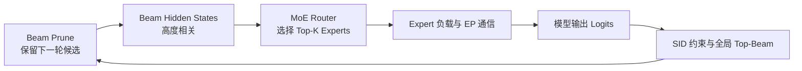
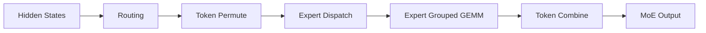

## 1. 问题背景

本文讨论一种典型的生成式推荐推理负载：

- 模型：Qwen3-30B-A3B 一类 MoE 模型；
- 用户行为序列：约 10K Token；
- Beam Width：128 或 512；
- 目标输出：长度为 3–5 的 Semantic ID（SID）；
- 目标：优先降低端到端延迟，同时兼顾吞吐。

这类负载与普通聊天模型明显不同：

1. **Prefill 很长**：10K Token 的用户历史使 TTFT 成为重要成本；
2. **输出很短**：只生成 3–5 个 SID Token；
3. **Beam 很宽**：每个 Decode Step 同时处理 128 或 512 条候选路径；
4. **模型是 MoE**：每个 Token 还会在每一层动态选择少量 Expert；
5. **推荐约束很强**：SID 往往只能沿 Trie 或层级编码中的合法分支生成。

因此，不能只单独优化 Beam Search，也不能只单独优化 MoE。真正的数据流是：



本文重点分析这条闭环中容易出现的问题。

---

## 2. Dense Transformer 与 MoE Transformer 的差异

### 2.1 Dense Transformer

普通 Decoder Transformer Layer 可以简化为：

```text
输入
  ↓
Self Attention
  ↓
Dense FFN / MLP
  ↓
输出
```

Dense FFN 通常采用 SwiGLU：

```text
gate_proj ── SiLU ─┐
                   × ── down_proj
up_proj ───────────┘
```

对所有 Token 而言，同一层都使用同一套 FFN 权重。

### 2.2 MoE Transformer

MoE 通常保留 Attention，只把 FFN 替换为：

```text
输入
  ↓
Router
  ↓
选择 Top-K Experts
  ↓
多个 Expert FFN
  ↓
加权合并
```

一个 Expert 并不是完整 Transformer，而是一个独立 FFN。

以 Qwen3-30B-A3B 为例，核心特征可以概括为：

- 约 30B 总参数；
- 每个 Token 约激活 3B 参数；
- 128 个 Routed Expert；
- 每个 Token 选择 8 个 Expert；
- 48 层均使用 MoE；
- 32 个 Q Head；
- 4 个 KV Head；
- Hidden Size 为 2048。

“30B-A3B”中的 30B 表示需要加载的总参数规模，A3B 表示单个 Token 实际参与计算的参数量约为 3B。MoE 降低的是每 Token 计算量，而不是把权重显存自动降到 3B 模型的水平。

---

## 3. MoE 的实际执行链

一个 MoE 层通常包含以下阶段：



高性能实现会融合部分阶段，因此 Profiler 中不一定能看到五个同名 Kernel。

### 3.1 Routing

Router 通常是一个从 Hidden Size 映射到 Expert 数量的线性层：

```text
hidden_states: [T, H]
router_logits: [T, E]
```

随后执行 Softmax 或 Sigmoid，并为每个 Token 选择 Top-K Expert：

```text
topk_ids:     [T, K]
topk_weights: [T, K]
```

对于 Qwen3-30B-A3B：

```text
E = 128
K = 8
```

Routing 只生成元数据，不会移动 Token，也不会长期缓存 Router 结果。

### 3.2 Token Permute

原始 Token 按请求顺序排布，但 Expert GEMM 希望同一 Expert 的 Token 连续存放。

例如：

```text
T0 → E0, E3
T1 → E1, E2
T2 → E3, E0
```

Token 会先扩展为 `T × K` 条 Expert Assignment，再按 Expert ID 排序：

```text
E0: T0, T2
E1: T1
E2: T1
E3: T0, T2
```

Permute 是**单卡内存重排**，主要生成：

- 按 Expert 连续排列的激活；
- 每个 Expert 的 Token 起止 Offset；
- 用于恢复原顺序的逆排列索引。

### 3.3 Expert Dispatch

开启 Expert Parallel 后，不同完整 Expert 固定驻留在不同 GPU 上。

因此运行时移动的不是 Expert 权重，而是：

- Token Hidden State；
- Top-K Expert ID；
- Top-K Weight；
- 可选量化 Scale。

Dispatch 的目标是把 Token 发到拥有对应 Expert 的 GPU。

```text
GPU 0: Expert 0–31
GPU 1: Expert 32–63
GPU 2: Expert 64–95
GPU 3: Expert 96–127
```

如果一个 Token 选择的 8 个 Expert 分布在多张 GPU，它的 Hidden State 会向多个 Rank 扇出。

### 3.4 Expert Grouped GEMM

每个 Expert 收到的 Token 数不同：

```text
Expert 0: 21 Token
Expert 1: 0 Token
Expert 2: 47 Token
Expert 3: 3 Token
```

不能为每个 Expert 单独启动一个小 GEMM。Grouped GEMM 会一次提交多个不同 M 维度的矩阵乘：

```text
[M0, H] × [H, 2I]
[M1, H] × [H, 2I]
...
```

一个 Qwen Expert 的主要计算是：

```text
Grouped GEMM 1
  ↓
SwiGLU
  ↓
Grouped GEMM 2
```

Expert 收到的 Token 越多，Grouped GEMM 越容易跑满 GPU。

### 3.5 Token Combine

Expert 输出仍然按照 Expert 顺序排列，需要：

1. 恢复到原始 Token 与 Top-K Slot；
2. 乘以 Router Weight；
3. 对 K 个 Expert 输出求和；
4. EP 场景下将结果返回原始 Token 所属 Rank。

高性能后端可能把以下操作融合：

```text
Unpermute
+ Router Weight
+ Top-K Reduce
+ 跨 GPU Combine
```

---

## 4. MoE 与 KV Cache 的关系

### 4.1 MoE 不直接管理 KV Cache

KV Cache 属于 Attention：

```text
Attention:
  生成 Q/K/V
  读写历史 K/V

MoE:
  Router
  Expert FFN
  Combine
```

MoE 不会缓存：

- Router Logits；
- Top-K Expert ID；
- Expert 中间激活；
- Permute 结果；
- Grouped GEMM Workspace。

这些数据只服务于当前 Forward。

### 4.2 MoE 会间接影响后续 K/V 数值

第 L 层 MoE 输出会成为第 L+1 层 Attention 的输入，因此会改变后续层生成的 K/V 数值。但它不会改变 KV Cache 的分页结构、Block 管理方式或生命周期。

### 4.3 TP 下的 KV Cache

Qwen3-30B-A3B 有 4 个 KV Head。

| TP | 每卡 Q Head | 每卡 KV Head | KV 情况 |
|---:|---:|---:|---|
| 1 | 32 | 4 | 完整 KV |
| 2 | 16 | 2 | 自然切分 |
| 4 | 8 | 1 | 自然切分 |
| 8 | 4 | 1 | KV Head 开始复制 |

因此：

> 从 KV Cache 切分角度看，TP4 是 4-KV-Head 模型的自然上限。

TP 下每个 Rank 使用自己的本地 Q Head 和本地 KV Cache 完成 Attention，不需要在每个 Decode Step 交换历史 KV。通信主要出现在：

- Attention `o_proj` 后的 All-Reduce；
- Dense FFN 或 TP-MoE 输出后的 All-Reduce；
- 最终 Vocab Parallel 或 Sampling 阶段。

### 4.4 DP 下的 KV Cache

标准 DP 中，每个 Replica：

- 保存完整模型副本或自己的 TP Group；
- 处理独立请求；
- 拥有独立 KV Cache。

请求一旦分配到某个 DP Replica，通常在整个生命周期内保持粘性。若中途迁移，就需要重新 Prefill 或显式转移 KV Cache。

---

## 5. 目标负载的规模估算

### 5.1 10K Prefill

对于每 Token Top-8 Expert：

```text
10,000 Token × 8 = 80,000 Expert Assignment / MoE Layer
```

这是很大的 Expert Batch，Prefill 阶段通常适合 EP 和高吞吐 Grouped GEMM。

### 5.2 Beam Decode

Beam 展开后，每个 Decode Step 的 Token 数约等于活动 Beam 数：

```text
Beam 128:
128 × 8 = 1,024 Expert Assignment / Layer

Beam 512:
512 × 8 = 4,096 Expert Assignment / Layer
```

模型有 128 个 Expert。若完全均匀：

```text
Beam 128:
平均每 Expert 8 个 Token

Beam 512:
平均每 Expert 32 个 Token
```

这说明 Beam512 虽然总量较大，但单个 Expert 的平均 Batch 仍不算特别大。

### 5.3 端到端延迟组成

SID 长度为 D 时，更准确的延迟表达是：

```text
T_total
= T_prefill
+ T_prune_1
+ Σ(T_decode_d + T_prune_d), d = 2...D
```

Prefill 已经产生第一个 SID Token 的 Logits，所以额外模型 Decode Forward 通常只有 `D - 1` 次；但每个 SID 层级都需要一次候选筛选和 Beam Prune。

---

## 6. Beam Search 与 MoE 的核心耦合问题

### 6.1 Beam 大，不代表 Expert 路由均匀

Beam 之间不是独立随机样本。它们共享：

- 同一个 10K 用户历史；
- 相同的 Prompt KV；
- 高度相似的 Hidden State；
- 相邻的 SID Prefix；
- 少量共同父 Beam。

因此可能出现：

```text
512 个 Beam
  ↓
大量 Beam 选择相同的 Top-8 Expert
  ↓
少数 Expert 很热
  ↓
其他 Expert 几乎空闲
```

极端情况下：

```text
8 个 Expert: 每个 512 Token
120 个 Expert: 0 Token
```

需要重点区分两个指标：

- 每 Expert Token 数；
- 每 EP Rank 的总 Assignment 数。

决定全局延迟的是最慢 EP Rank，而不是全局平均 Expert Token 数。

### 6.2 Beam Prune 会进一步增强 Router 相关性

每一步 Prune 可能保留大量来自同一父 Beam 的子路径：

```text
512 条新 Beam
  ├─ 200 条来自 Parent A
  ├─ 150 条来自 Parent B
  ├─ 100 条来自 Parent C
  └─ 62 条来自其他 Parent
```

下一步 Beam 的 Hidden State 更相似，Router 选择可能更加集中。

建议记录：

```text
Parent Concentration
= 单一父 Beam 贡献的最大子 Beam 数 / Beam Width
```

并把它与 Expert 负载偏斜联合分析。

### 6.3 Expert 偏斜具有双重效果

热点 Expert 会收到更多 Token，单个 GEMM 反而更大、更容易利用 Tensor Core。

但是：

```text
热点 Expert GEMM 更高效
          +
热点 Expert 所在 Rank 成为 Straggler
```

其他 Rank 可能大量空闲，整个 MoE Layer 仍然等待热点 Rank。

优化目标不是强行让每个 Expert 完全均匀，而是：

> 让每个 EP Rank 的总计算量尽量接近。

### 6.4 EP Group 越大，单 Token 扇出越广

每个 Token 选择 8 个 Expert。

在 Expert 均匀放置的近似下：

- EP4：一个 Token 往往涉及约 3–4 个 Rank；
- EP8：一个 Token 往往涉及约 5 个 Rank。

EP8 不会增加单 Expert 的 Token 数，只会把 Expert 分散到更多 GPU：

```text
EP4:
每卡 32 个 Expert

EP8:
每卡 16 个 Expert
```

因此 EP8 带来：

- 更多通信目标；
- 更多同步 Rank；
- 更高 Straggler 概率；
- 更小的每 Rank 本地 Batch。

Beam512 并不能自动证明 EP8 优于 EP4。

### 6.5 层内 Barrier 与 Step Barrier 叠加

每个 MoE 层需要经历：

```text
Dispatch
  ↓
Expert Compute
  ↓
Combine
```

模型 Forward 完成后，还需要：

```text
LM Head
  ↓
候选 Top-K
  ↓
全局 Beam Prune
  ↓
下一次 Forward
```

因此有两类同步：

1. **层内 Barrier**：每个 MoE Layer 等待相关 Expert Rank；
2. **Step Barrier**：所有 Beam 完成并 Prune 后才能开始下一步。

任意一个慢 Rank 都会拖慢整个 Beam Step。

### 6.6 标准 Beam Search 可能制造 CPU Bubble

截至当前 vLLM Beam Search 实现，每个活动 Beam 默认请求：

```text
logprobs = 2 × beam_width
max_tokens = 1
```

Beam512 时，候选上界约为：

```text
512 × 1024 = 524,288
```

随后实现会在 Python 层：

- 遍历 Logprobs；
- 创建新 Beam 对象；
- 累加分数；
- 过滤非法 Token；
- `sorted()`；
- 截取 Top-512。

时间线可能变成：

```text
GPU 完成 MoE Forward
        ↓
GPU 空等
        ↓
CPU 处理数十万候选
        ↓
启动下一次 GPU Forward
```

即使 EP 与 Expert GEMM 已经优化，CPU Prune 仍可能让整个 GPU Group 出现明显空洞。

### 6.7 SID 约束放得太晚

SID 每一层通常只有少量合法子节点。

低效路径是：

```text
完整 LM Head
  ↓
151K 词表 Logits
  ↓
每 Beam Top-1024
  ↓
SID Trie 过滤
```

更合理的是：

```text
当前 SID Prefix
  ↓
查询合法子节点
  ↓
只计算或保留合法 SID Token Logits
  ↓
GPU 全局 Top-Beam
```

Beam512 对完整 151K 词表物化 Logits 时，单步矩阵规模约为：

```text
[512, 151936]
```

这部分可能成为 MoE Forward 之后的另一大瓶颈。

### 6.8 候选爆炸不会直接乘进下一轮 MoE

虽然 Beam512 可能产生 52 万候选，但 Prune 后仍只保留 512 条 Beam。

因此下一轮 MoE 输入仍是：

```text
512 Token
```

候选爆炸主要影响：

- LM Head；
- Top-K；
- Prune；
- 状态管理；
- GPU 等待时间。

### 6.9 EPLB 的时间尺度可能不匹配

EPLB 更适合处理长期线上流量中的 Expert 热点。

但单个 SID 只生成 3–5 步，瞬时热点可能在一次请求内部快速变化：

```text
SID Level 1: Expert A/B 热
SID Level 2: Expert C/D 热
SID Level 3: Expert E/F 热
```

周期性 EPLB 很难在一个请求内部及时重平衡。

更有效的方法是：

- 用真实推荐流量离线 Profile；
- 分层统计 Expert 热点；
- 对稳定热点做静态 Placement；
- 必要时增加少量冗余 Expert；
- EPLB 处理长期分布变化。

### 6.10 DBO 的收益依赖 Beam 规模

DBO 会把 Batch 拆成两个 Microbatch，并尝试重叠一个 Microbatch 的 All-to-All 与另一个的 Expert Compute。

Beam512：

```text
256 + 256
```

每个 Microbatch 仍有约 2048 个 Assignment，值得测试。

Beam128：

```text
64 + 64
```

每个 Microbatch 平均每 Expert 只有约 4 个 Token，可能让 Grouped GEMM 更碎。

因此：

- Beam512：DBO 值得测试；
- Beam128：不应默认开启。

### 6.11 活动 Beam 数动态变化

真实运行中 Beam 数可能逐层下降：

```text
Depth 1: 512
Depth 2: 512
Depth 3: 386
Depth 4: 171
Depth 5: 完成
```

这会影响：

- CUDA Graph Capture Shape；
- DeepEP Buffer 容量；
- Expert Padding；
- Grouped GEMM 利用率；
- 每一步的通信与计算比。

### 6.12 不建议轻易把单请求 Beam 拆到多个 DP Replica

看似可以把 Beam512 拆成 4 组，每组 128，但 Prune 后 Winner 可能严重偏向某一组。

若重新均衡 Beam，需要迁移：

- Beam Token；
- 累计分数；
- Trie 状态；
- Parent 映射；
- 增量 KV Block。

最困难的是 KV Cache 所有权与迁移。

第一版更稳妥的原则是：

> 一个请求的所有 Beam 固定在同一个 TP/EP Group 内，DP 用于处理不同用户请求。

### 6.13 双重离散 Top-K 放大数值扰动

MoE 内部有 Router Top-8，Beam Search 外部有 Global Top-128/512。

小数值误差可能导致：

```text
Router Expert 集合变化
  ↓
Hidden State 变化
  ↓
Logits 排名变化
  ↓
最终 SID 路径变化
```

因此 FP8、不同 Kernel、不同归约顺序和不同 Batch Shape 都需要用推荐指标验证，而不仅是比较 Perplexity。

建议验证：

- Router Top-8 一致率；
- Beam 路径一致率；
- 最终 SID Top-K 重合率；
- Recall@K；
- NDCG@K；
- Batch 组合变化下的结果稳定性。

### 6.14 Prefill 与 Decode 对 EP 后端的偏好不同

10K Prefill：

```text
80,000 Assignment / Layer
```

更偏向高吞吐后端。

Beam Decode：

```text
1,024 或 4,096 Assignment / Layer
```

更关注小步延迟和尾延迟。

同一实例很难同时让 Prefill 与 Decode 都达到各自最优，需要基于端到端延迟占比选择后端，而不是只看单个 MoE Kernel。

---

## 7. 主要切分方案

### 7.1 TP4，不开启 EP

```text
Attention: TP4
Expert:    TP4
```

每张卡拥有所有 Expert 的四分之一矩阵。

优点：

- 没有 Token All-to-All；
- 通信模式规则；
- 不受 Expert 路由偏斜影响；
- 尾延迟通常更稳定。

缺点：

- Expert Intermediate Width 被切到 192；
- 每张卡都涉及所有 128 个 Expert；
- 大 Beam 下无法充分利用完整 Expert GEMM。

适合作为严格的性能基线。

### 7.2 TP4 + EP4

```text
Attention: TP4
Expert:    EP4
```

每张卡：

- 8 个 Q Head；
- 1 个 KV Head；
- 32 个完整 Expert。

优点：

- 4 个 KV Head 与 TP4 完全对齐；
- Expert 保持完整矩阵；
- Beam128/512 都有足够 Assignment；
- 低延迟与吞吐较平衡。

缺点：

- 每个 MoE 层都有 Dispatch/Combine；
- 依赖 NVLink/NVSwitch；
- 对 Expert 热点和慢 Rank 敏感。

这是本文场景下最推荐的第一主方案。

### 7.3 8 卡部署两个独立 TP4 + EP4 Replica

```text
Replica 0: GPU 0–3
Replica 1: GPU 4–7
```

优点：

- 请求隔离；
- P99 更稳定；
- 可以同时处理两个大 Beam 请求；
- 外部负载均衡简单。

缺点：

- 单请求最多使用 4 张 GPU；
- 不能用全部 8 卡压缩单请求延迟。

生产环境通常优先于一个超大 EP8 实例。

### 7.4 TP4 + DP2 + EP8

```text
两个 Attention TP4 Group
所有 8 张 GPU 组成 EP8
```

优点：

- 同时处理两个独立请求；
- Expert Token 可跨两个 DP Group 聚合；
- 适合稳定高 QPS。

缺点：

- 两个请求在 Expert 层耦合；
- 一个慢 Rank 会影响另一请求；
- 空闲 DP Rank 仍可能参与同步；
- 单请求 Attention 仍只使用 4 张 GPU。

更适合吞吐优先，而不是严格 P99。

### 7.5 TP8 + EP8

每张卡：

- 4 个 Q Head；
- 1 个 KV Head；
- 16 个完整 Expert。

优点：

- 单请求使用全部 8 卡；
- Beam512 的 Assignment 数足以支持 EP8。

缺点：

- TP8 超过 4 个 KV Head，KV 开始复制；
- 每卡 KV Cache 不再继续下降；
- Attention 与 EP 都扩大到 8 Rank；
- Straggler 概率上升；
- Hidden Size 2048 对 TP8 可能切得过细。

不应作为默认方案，只能与 TP4+EP4 实测比较。

### 7.6 TP8 + DCP2 + EP8

DCP 会复用 TP Group 内 GPU，在 Decode 阶段进一步按上下文分摊长 KV 读取。

优点：

- 更针对 10K Prefix + Beam512 的长上下文 Decode；
- 有机会缓解 TP8 下 KV 复制与重复读取；
- 全部 8 卡参与单请求。

缺点：

- Attention 通信更复杂；
- 与 EP、CUDA Graph、Backend 的组合要求高；
- 当前属于高级路径，需要严格验证兼容性和稳定性。

只有当 Profile 明确显示 Attention/KV 读取是主要瓶颈时再引入。

### 7.7 PP、PCP 与 Prefill/Decode 分离

PP 更适合容量不足或跨节点，不是本场景的低延迟首选。

PCP 可以直接切分 10K Prefill 的序列维度，适合 TTFT 明显占主导时测试。

Prefill/Decode 分离需要转移约 10K Prefix 的 KV Cache。由于 SID 只生成 3–5 步，KV 传输成本可能吞掉分离收益，因此不应过早引入。

---

## 8. Beam128 与 Beam512 的建议

### 8.1 Beam128

推荐顺序：

```text
1. TP4，不开 EP
2. TP4 + EP4
3. 8 卡部署 2 个独立 TP4 + EP4 Replica
4. 高 QPS 时再测试 TP4 + DP2 + EP8
```

Beam128 足以测试 EP4，但不应默认假设 EP8 或 DBO 有收益。

### 8.2 Beam512

推荐顺序：

```text
1. TP4 + EP4
2. Shared Prefix KV + Beam Batch
3. SID Trie 前置约束
4. GPU 全局 Top-Beam
5. 测试 DBO
6. Attention 成为瓶颈后，再测试 TP8 + DCP2 + EP8
```

Beam512 的第一瓶颈未必是 Expert GEMM，更可能是：

- 512 个 Query 重复读取 10K Prefix KV；
- 完整词表 LM Head；
- 数十万候选的 Prune；
- Expert Rank 偏斜导致的慢 Rank。

---

## 9. 工程优化优先级

本文场景的推荐优化顺序是：

### 第一优先级：确认 Prefix KV 真正共享

必须避免把 10K Prefix 为每个 Beam 复制一份。

正确结构：

```text
公共 10K Prefix KV
  ├─ Beam 0 增量 KV
  ├─ Beam 1 增量 KV
  └─ ...
```

### 第二优先级：一个 Forward 批量执行所有 Beam

不要把 Beam 当成 128/512 个独立请求反复下发。应在模型内部形成统一 Token Batch。

### 第三优先级：SID Trie 前置

在 LM Head 或 Top-K 前应用合法 SID 子节点约束。

### 第四优先级：GPU 上完成 Global Top-Beam

避免将数十万候选拉回 Python 后创建对象和排序。

### 第五优先级：TP4 与 TP4+EP4 A/B

先确认 EP 的完整 Expert GEMM 收益是否大于 Dispatch/Combine 和偏斜成本。

### 第六优先级：针对 Beam512 测试 DBO

确认计算与通信是否能有效重叠。

### 第七优先级：Shared-Prefix Attention / TreeAttention

让多个 Beam Query 在读取共同 10K Prefix 时复用 KV Tile 与 Attention 工作。

### 第八优先级：DCP、PCP、PD 分离

这些属于 Profile 驱动的高级优化，而不是第一版默认架构。

---

## 10. 必须采集的 Profiling 指标

### 10.1 Beam 指标

- 每个 SID Depth 的活动 Beam 数；
- 每个父 Beam 贡献的子 Beam 数；
- Parent Concentration；
- 每 Beam 合法 SID 子节点数；
- Prune 候选总数；
- GPU Forward 结束到下一次 Forward 开始的空洞时间。

### 10.2 Router 与 Expert 指标

- 每层 `topk_ids` 分布；
- 每 Expert Token 数；
- 每 EP Rank Assignment 总数；
- Max/Mean Expert Load；
- Max/Mean EP Rank Load；
- 不同 SID Depth 的热点 Expert；
- Router Top-8 一致率。

### 10.3 MoE Kernel 指标

- Router；
- Token Permute；
- Dispatch；
- Grouped GEMM 1；
- Activation；
- Grouped GEMM 2；
- Combine；
- All-to-All 带宽与启动延迟；
- Straggler Rank 时间。

### 10.4 Attention 与 KV 指标

- 10K Prefill Attention 时间；
- 每个 Beam Decode Step 的 Attention 时间；
- KV Cache 实际占用；
- Prefix KV 是否共享；
- 每步 KV 读取带宽；
- TP4 到 TP8 的 Attention 收益。

### 10.5 推荐质量指标

- Recall@K；
- NDCG@K；
- HitRate@K；
- 最终 SID Top-K 重合率；
- 不同精度与不同并行拓扑下的结果稳定性。

---

## 11. 最终结论

对于 Qwen3-30B-A3B、10K 输入、Beam Width 128/512、SID 长度 3–5 的生成式推荐：

1. **MoE 不直接管理 KV Cache**，但 Beam Hidden State 会影响 Router 与 Expert 分布；
2. **Beam 大不等于 Expert 均衡**，高度相关的 Beam 反而可能集中命中少数 Expert；
3. **Beam Prune 会进一步增强这种相关性**，导致热点 EP Rank 和尾延迟；
4. **EP4 是比 EP8 更稳妥的起点**；
5. **TP4 + EP4 是首选单实例方案**；
6. 8 卡生产优先考虑 **2 个独立 TP4 + EP4 Replica**；
7. Beam512 可进一步测试 DBO 与 TP8+DCP2+EP8，但必须由 Profile 驱动；
8. 真正的系统瓶颈很可能同时存在于：
   - 长 Prefix Attention；
   - Expert Rank 偏斜；
   - 完整词表 LM Head；
   - CPU Beam Prune；
9. 优先解决：
   - Prefix KV 共享；
   - Beam 单次批量 Forward；
   - SID Trie 前置；
   - GPU Global Top-Beam；
   - Shared-Prefix Attention。

最终建议的第一版架构是：

```text
4 GPU 单实例:
TP4 + EP4

8 GPU 生产:
2 × (TP4 + EP4)

一个请求的所有 Beam:
固定在同一个 TP/EP Group 内

SID 解码:
Trie 约束前置 + GPU 全局 Top-Beam
```

只有在确认 Expert 负载相对均衡、Dispatch/Combine 占比可控，并且 Attention/KV 已成为主瓶颈后，才继续扩大到 EP8、DCP 或更复杂的跨实例 Beam Parallel。

---

## 参考实现

- [Qwen3-30B-A3B 配置](https://huggingface.co/Qwen/Qwen3-30B-A3B/blob/main/config.json)
- [vLLM Qwen3 MoE 模型实现](https://github.com/vllm-project/vllm/blob/main/vllm/model_executor/models/qwen3_moe.py)
- [vLLM Fused MoE Modular Kernel 设计](https://github.com/vllm-project/vllm/blob/main/docs/design/fused_moe_modular_kernel.md)
- [vLLM Expert Parallel Deployment](https://github.com/vllm-project/vllm/blob/main/docs/serving/expert_parallel_deployment.md)
- [vLLM Data Parallel Deployment](https://github.com/vllm-project/vllm/blob/main/docs/serving/data_parallel_deployment.md)
- [vLLM Beam Search 实现](https://github.com/vllm-project/vllm/blob/main/vllm/entrypoints/generate/beam_search/offline.py)
- [vLLM ParallelConfig](https://github.com/vllm-project/vllm/blob/main/vllm/config/parallel.py)
