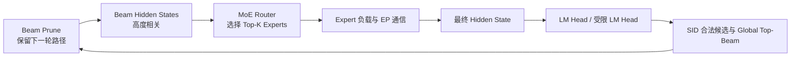
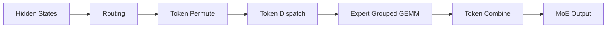

## 1. 问题背景

本文讨论一种典型但非常特殊的生成式推荐推理负载：

- 模型：Qwen3-30B-A3B 一类 MoE 模型；
- 用户行为序列：约 10K Token；
- Beam Width：128 或 512；
- 输出：长度为 3–5 的 Semantic ID（SID）；
- 目标：优先降低端到端延迟，同时兼顾吞吐。

它与普通聊天推理的区别是：

1. **Prefill 很长**：10K 用户历史使 TTFT 成为主要成本之一；
2. **Decode 很短**：只额外生成 3–5 个 SID Token；
3. **Beam 很宽**：每个 Decode Step 同时存在 128 或 512 条活动路径；
4. **模型是 MoE**：每个活动 Beam Token 又会动态选择多个 Expert；
5. **输出约束很强**：下一 SID Token 必须属于当前 Trie 节点的合法子节点。

因此不能只优化 Beam Search，也不能只优化 MoE。真正的数据流是：



本文先建立 MoE、KV Cache 和 Beam Search 的基础，再重点分析并行切分方案。

---

## 2. Dense Transformer 与 MoE Transformer

### 2.1 Dense Transformer

普通 Decoder Transformer Layer 可以简化为：

```text
输入 Hidden State
    ↓
Self Attention
    ↓
Dense FFN / MLP
    ↓
输出 Hidden State
```

Dense FFN 通常采用 SwiGLU：

```text
gate_proj ── SiLU ─┐
                    × ── down_proj
up_proj ───────────┘
```

同一层中的所有 Token 都使用同一套 FFN 权重。

### 2.2 MoE Transformer

MoE 一般保留 Attention，只把 Dense FFN 替换为：

```text
输入 Hidden State
    ↓
Router
    ↓
选择 Top-K Experts
    ↓
多个 Expert FFN
    ↓
按 Router Weight 加权合并
```

一个 Expert 并不是一个完整 Transformer，而是一个独立 FFN。

Qwen3-30B-A3B 的关键配置是：

- Hidden Size：2048；
- Head Dim：128；
- 32 个 Q Head；
- 4 个 KV Head；
- 48 个 Decoder Layer；
- 128 个 Routed Expert；
- 每个 Token 选择 Top-8 Expert；
- Expert Intermediate Size：768；
- Vocabulary Size：151,936；
- 48 层均使用 MoE。

“30B-A3B”中的 30B 表示总参数规模，A3B 表示单 Token 实际激活的参数规模约为 3B。MoE 降低的是每 Token 计算量，不会把权重显存自动降到 3B 模型的水平。

---

## 3. MoE 的实际执行链

一个 MoE Layer 通常包含：



高性能实现会融合部分阶段，因此 Profiler 中不一定出现五个同名 Kernel。

### 3.1 Routing

Router 是从 Hidden Size 到 Expert 数量的线性映射：

```text
hidden_states: [T, H]
router_logits: [T, E]
```

随后执行 Softmax 或 Sigmoid，并得到：

```text
topk_ids:     [T, K]
topk_weights: [T, K]
```

对 Qwen3-30B-A3B：

```text
E = 128
K = 8
```

Routing 只产生元数据，不会长期缓存 Router 结果。

### 3.2 Token Permute

每个 Token 选择 K 个 Expert，因此会展开为 `T × K` 条 Expert Assignment。随后按 Expert ID 排序，把同一 Expert 的 Token 放在连续内存中。

```text
T0 → E0, E3
T1 → E1, E2
T2 → E3, E0

重排后：
E0: T0, T2
E1: T1
E2: T1
E3: T0, T2
```

Permute 是单卡内存重排，主要生成：

- 连续的 Expert 输入；
- 每个 Expert 的 Token Offset；
- 用于恢复原顺序的逆排列索引。

### 3.3 Token Dispatch

开启 EP 后，不同完整 Expert 固定驻留在不同 GPU。运行时移动的是 Token 激活，而不是 Expert 权重。

Dispatch 可能传输：

- Hidden State；
- Top-K Expert ID；
- Top-K Weight；
- 可选量化 Scale。

如果一个 Token 的 8 个 Expert 分布在多张 GPU，它的 Hidden State 会向多个 Rank 扇出。

### 3.4 Expert Grouped GEMM

每个 Expert 收到的 Token 数不同：

```text
Expert 0: 21 Token
Expert 1: 0 Token
Expert 2: 47 Token
Expert 3: 3 Token
```

Grouped GEMM 会一次提交多组不同 M 维度的矩阵乘：

```text
[M0, H] × [H, 2I]
[M1, H] × [H, 2I]
...
```

一个 Expert 的主要计算为：

```text
Grouped GEMM 1
    ↓
SwiGLU
    ↓
Grouped GEMM 2
```

Expert 收到的 Token 越多，GEMM 越容易跑满 GPU。

### 3.5 Token Combine

Expert 输出需要：

1. 恢复到原始 Token 与 Top-K Slot；
2. 乘以 Router Weight；
3. 对 K 个 Expert 输出求和；
4. EP 场景下返回原始 Token 所属 Rank。

高性能后端可能融合：

```text
Unpermute
+ Router Weight
+ Top-K Reduce
+ 跨 GPU Combine
```

---

## 4. MoE 与 KV Cache

### 4.1 MoE 不直接管理 KV Cache

KV Cache 属于 Attention：

```text
Attention:
  生成 Q/K/V
  读取历史 K/V
  写入本轮 K/V

MoE:
  Router
  Expert FFN
  Combine
```

MoE 不会长期缓存 Router Logits、Top-K Expert ID、Expert 中间激活或 Permute Workspace。

MoE 输出会成为下一层 Attention 的输入，所以会间接影响后续 K/V 数值，但不会改变 KV Cache 的分页结构、Block 生命周期和所有权模型。

### 4.2 TP 下 KV Cache 如何分布

Qwen3-30B-A3B 有 4 个 KV Head：

| TP | 每卡 Q Head | 每卡 KV Head | KV 情况 |
|---:|---:|---:|---|
| 1 | 32 | 4 | 完整 KV |
| 2 | 16 | 2 | 自然切分 |
| 4 | 8 | 1 | 自然切分 |
| 8 | 4 | 1 | KV Head 复制 2 份 |

因此从 KV Head 切分角度看，TP4 是自然上限。TP4 继续增大到 TP8 后，每卡仍保存一个 KV Head，KV Cache 不会继续按 TP 比例下降。

TP Rank 使用本地 Q Head 和本地 KV Cache 完成 Attention，不需要在每个 Decode Step All-Gather 历史 KV。通信主要出现在 Attention `o_proj`、FFN/MoE 输出和部分 Vocab Parallel/Sampling 阶段。

### 4.3 10K Prefix KV 的规模

BF16 下，单 Token 的完整 KV Cache 约为：

```text
2 × 48 层 × 4 KV Head × 128 Head Dim × 2 Byte
= 96 KiB / Token
```

10K Prefix 约为：

```text
约 937.5 MiB
```

不同 TP 下每卡大致为：

| TP | 每卡 10K Prefix KV |
|---:|---:|
| TP1 | 937.5 MiB |
| TP2 | 468.75 MiB |
| TP4 | 234.38 MiB |
| TP8 | 234.38 MiB，存在复制 |

### 4.4 Beam 必须共享 Prefix KV

错误方式是为每条 Beam 复制完整 10K Prefix。Beam512 会达到约 469 GiB，完全不可接受。

正确结构是：

```text
公共 10K Prefix KV
    ├─ Beam 0: 只保存增量 KV
    ├─ Beam 1: 只保存增量 KV
    ├─ ...
    └─ Beam 511: 只保存增量 KV
```

容量问题可以通过共享解决，但普通 Attention 仍可能让 512 个 Query 分别读取同一个 10K Prefix。此时瓶颈会从 KV 容量转向 HBM 带宽和 Attention Kernel 的共享复用能力。

### 4.5 DP 下 KV Cache

标准 DP 中，每个 Replica 处理独立请求，并拥有独立 KV Cache。请求通常在整个生命周期内保持粘性。

```text
DP Replica 0:
  Request A
  KV Cache A

DP Replica 1:
  Request B
  KV Cache B
```

普通 DP 不会自动把一个 Beam512 请求切成四份。若自定义跨 DP 拆 Beam，Prune 后还需要处理 Beam 重平衡、Trie 状态和 KV Block 迁移，复杂度很高。

---

## 5. 目标负载的计算规模

### 5.1 10K Prefill

每 Token 选择 8 个 Expert：

```text
10,000 × 8 = 80,000 Expert Assignment / MoE Layer
```

这是非常大的 Expert Batch，Prefill 对 EP 和 Grouped GEMM 通常较友好。

### 5.2 Beam Decode

每个 Decode Step 的活动 Token 数约等于 Beam 数：

```text
Beam128:
128 × 8 = 1,024 Assignment / Layer

Beam512:
512 × 8 = 4,096 Assignment / Layer
```

若 128 个 Expert 完全均匀：

```text
Beam128: 平均每 Expert 8 Token
Beam512: 平均每 Expert 32 Token
```

Beam512 的总 Assignment 很大，但单 Expert 的平均 Batch 仍不算特别大。

### 5.3 端到端延迟

SID 长度为 D 时：

```text
T_total
= T_prefill
+ T_prune_1
+ Σ(T_decode_d + T_prune_d), d = 2...D
```

Prefill 已经产生第一个 SID Token 的 Logits，所以额外模型 Decode Forward 通常只有 `D - 1` 次；但每个 SID 层级都需要候选筛选和 Beam Prune。

---

## 6. Beam Search × MoE 的耦合问题

### 6.1 Beam 大不代表 Expert 均匀

Beam 之间共享相同 10K 历史，只在少量 SID Token 上不同，Hidden State 高度相关。因此可能集中命中少数 Expert。

```text
512 个 Beam
    ↓
大量 Beam 选择相同 Top-8 Expert
    ↓
少数 Expert / EP Rank 过热
    ↓
整个 Layer 等待最慢 Rank
```

需要同时统计：

- 每 Expert Token 数；
- 每 EP Rank Assignment 总数；
- Max/Mean Expert Load；
- Max/Mean EP Rank Load。

真正决定尾延迟的是最慢 EP Rank，而不是全局平均值。

### 6.2 Beam Prune 会增强 Router 相关性

Prune 后的 512 条新 Beam 可能大量来自少数父 Beam：

```text
200 条来自 Parent A
150 条来自 Parent B
100 条来自 Parent C
62 条来自其他 Parent
```

下一轮 Hidden State 更相似，Router 分布可能更集中。建议记录：

```text
Parent Concentration
= 单一父 Beam 贡献的最大子 Beam 数 / Beam Width
```

并与 Expert 热点联合分析。

### 6.3 Expert 热点具有双重效果

热点 Expert 收到更多 Token，单个 GEMM 更大；但热点所在 Rank 会成为 Straggler。优化目标不是让每个 Expert 完全相同，而是让每个 EP Rank 的总工作量尽量接近。

### 6.4 EP Group 越大，单 Token 扇出越广

每个 Token 选择 8 个 Expert。近似均匀分布时：

- EP4：一个 Token 通常涉及约 3–4 个 Rank；
- EP8：一个 Token 通常涉及约 5 个 Rank。

EP8 不会增加单 Expert 的 Token 数，只会把 Expert 分到更多 GPU，并增加通信目标和同步 Rank。Beam512 并不能自动证明 EP8 优于 EP4。

### 6.5 层内 Barrier 与 Step Barrier

一次 Beam Decode Step 同时存在：

1. **MoE 层内 Barrier**：Dispatch、Expert Compute、Combine 等待相关 Rank；
2. **Beam Step Barrier**：模型结束后必须完成 LM Head、候选选择和 Global Prune，才能进入下一步。

一个慢 Rank 或一次慢 Prune 都会阻塞全部 Beam。

### 6.6 标准 Beam Search 可能制造 CPU Bubble

标准 Beam Search 常为每条 Beam 请求 `2 × beam_width` 个 Logprob 候选。Beam512 的候选上界可达到：

```text
512 × 1024 = 524,288
```

如果在 Python 中逐个创建 Beam 对象、排序并裁剪，会形成：

```text
GPU 完成 MoE Forward
    ↓
GPU 空等
    ↓
CPU 处理数十万候选
    ↓
启动下一次 Forward
```

即使 MoE 已优化，Beam Prune 仍可能成为主要 Bubble。

### 6.7 数值扰动被双重 Top-K 放大

MoE 内部执行 Router Top-8，Beam Search 外部执行 Global Top-128/512。FP8、不同 Kernel、不同归约顺序或 Batch Shape 的微小误差，可能先改变 Expert 选择，再改变最终 SID 排名。

需要验证：

- Router Top-8 一致率；
- Beam 路径一致率；
- 最终 SID Top-K 重合率；
- Recall@K、NDCG@K、HitRate@K；
- 不同并行拓扑下的结果稳定性。

---

## 7. 切分前必须先理解：每种并行到底切什么

并行策略不能只看缩写。它们切分的维度、通信位置和 KV Cache 归属完全不同。

### 7.1 一张总表

| 策略 | 主要切分对象 | 是否切 Beam 数 | KV Cache | 主要通信 | 主要目标 |
|---|---|---:|---|---|---|
| TP | Attention Head、Linear 矩阵维度 | 否 | 按 KV Head 切分或复制 | All-Reduce / All-Gather | 单实例模型并行 |
| EP | 完整 Expert 的集合 | 否 | 不改变 | All-to-All Dispatch/Combine | MoE 计算局部性和吞吐 |
| DP | 请求批次 / 模型副本 | 通常否 | 每 Replica 独立 | 普通 Dense DP 基本无层间通信；MoE DP+EP 会同步 | 扩请求吞吐 |
| PP | Transformer Layer | 否 | 按 Layer 分布在 Stage | Stage 间发送 Hidden State | 容量与跨节点扩展 |
| DCP | Decode 时的上下文/KV 序列维度 | 否 | 在 TP 域内减少重复 | Context Parallel 通信 | 长上下文 Decode |
| PCP | Prefill 时的新 Token 序列维度 | 否 | 沿上下文分片 | Prefill Attention 通信 | 降低长 Prefill TTFT |
| Beam Parallel | Beam 维度 | 是 | 需要共享、复制或迁移 KV | Global Prune + KV 管理 | 超大 Beam 单请求扩展 |

一个非常重要的结论是：

> TP、EP、DCP 主要切模型或上下文，不会自动把 512 条 Beam 均分成多个独立请求。

### 7.2 `TP4 + EP4` 为什么不是 16 卡

在当前 vLLM 的 MoE 部署语义中，Attention 层和 Expert 层可以在同一组 GPU 上采用不同的并行组织：

```text
同一组 4 张 GPU

Attention Layer:
  使用 TP4

MoE Expert Layer:
  开启 EP 后使用 EP4
```

因此：

```text
TP4 + EP4 + DP1 = 4 张 GPU
```

不是 `4 × 4 = 16` 张 GPU。

当设置：

```text
TP4 + DP2 + enable EP
```

总 GPU 数是：

```text
TP × DP = 4 × 2 = 8
```

Attention 形成两个 TP4 Group，Expert 则形成 EP8 Group。

### 7.3 TP：切 Head 和矩阵，不切 Token Batch

以 Beam512、TP4 为例：

```text
每张卡都看到 512 条活动 Beam
但每张卡只计算：
- 8 个 Q Head
- 1 个 KV Head
- 本地 Linear Weight 分片
```

TP 不会变成：

```text
GPU0: Beam 0–127
GPU1: Beam 128–255
...
```

它实际是：

```text
GPU0: 512 Beam × Q Head 0–7
GPU1: 512 Beam × Q Head 8–15
GPU2: 512 Beam × Q Head 16–23
GPU3: 512 Beam × Q Head 24–31
```

Attention 输出经过 Row Parallel `o_proj` 后进行 All-Reduce，使每个 Rank 重新获得完整 Hidden State。

#### 未开启 EP 时，MoE 如何使用 TP

TP4、不启用 EP 时，每张卡包含全部 128 个 Expert，但每个 Expert 只保存四分之一矩阵：

```text
Expert Intermediate Size = 768
TP4 本地 Intermediate Width = 192
```

每个 Rank 对相同的 Top-8 Expert 计算局部结果，之后归约。

优点是通信规则、没有 Token All-to-All；缺点是 Expert GEMM 被切得很窄。

### 7.4 EP：切完整 Expert，不切 Attention 和 KV

EP4 时：

```text
GPU0: 32 个完整 Expert
GPU1: 32 个完整 Expert
GPU2: 32 个完整 Expert
GPU3: 32 个完整 Expert
```

每个 Token 的 Top-8 Expert 可能跨多卡，因此需要：

```text
Router
  ↓
Token Dispatch / All-to-All
  ↓
本地完整 Expert GEMM
  ↓
Token Combine / All-to-All
```

EP 与 TP 的 Expert 显存总分摊比例接近，区别是组织方式：

```text
TP4: 128 个四分之一 Expert / 卡
EP4: 32 个完整 Expert / 卡
```

EP 的收益来自完整 Expert GEMM 和更好的局部性；代价是动态 All-to-All 和负载偏斜。

EP 不改变 KV Cache。KV Cache 仍由 Attention 的 TP/DP 拓扑决定。

### 7.5 DP：切请求，不应默认切单请求 Beam

DP2 的正常含义是：

```text
DP Rank 0: Request A
DP Rank 1: Request B
```

每个 Rank 有独立 KV Cache。

对 MoE 模型，若使用 vLLM 内置 `DP + EP`，Attention 请求与 KV Cache 仍按 DP Rank 独立，但 Expert 层会跨 `TP × DP` Rank 同步，因此不同请求会在 Expert 层产生耦合。

若严格追求请求隔离，更稳妥的是启动两个独立服务实例，而不是把它们放入同一个 DP+EP Group。

### 7.6 PP：切层

Qwen3-30B-A3B 有 48 层。PP2 可以切为：

```text
Stage 0: Layer 0–23
Stage 1: Layer 24–47
```

每个 Stage 只保存自己的权重和对应层 KV Cache。Stage 之间传输 Hidden State。

优点：

- 降低单卡权重与 KV 容量；
- 适合模型放不下或跨节点；
- 避免把每层 TP/EP Collective 扩大到非常大的跨节点 Group。

缺点：

- 单 Token 必须依次通过各 Stage；
- SID 只有 3–5 步，Pipeline 难以长期填满；
- 对单请求低延迟不友好。

### 7.7 DCP：切 Decode Context，而不是切 Beam

TP8 时，Qwen 的 4 个 KV Head 会被复制两份。DCP2 可以复用 TP 域中的这两份 Rank，把 KV Context 沿序列维度切分，从而减少 KV 重复并分摊长上下文读取。

```text
TP8, 4 KV Heads:
每个 KV Head 有 2 个 Replica

加入 DCP2:
两个 Replica 分别保存/处理一部分 Context
```

DCP 的价值在于 10K Prefix Decode，而不是 MoE Expert。它不会把 Beam512 切成两个 Beam256；每个 DCP Rank 处理的是上下文分片。

TP4 时 4 个 KV Head 已经自然切满，通常没有同样强的 DCP 去重空间。

### 7.8 PCP：切 10K Prefill Token

TP 切 Head，但每个 TP Rank 仍要处理完整 10K Token 序列。PCP 则沿 Prefill Token 维度切分：

```text
10K Prefix, PCP2:
Rank Group 0: 约 5K Token Chunk
Rank Group 1: 约 5K Token Chunk
```

PCP 直接针对 TTFT，但会增加 Prefill Attention 的上下文通信和实现复杂度。它更适合 Profile 明确显示 10K Prefill 占端到端延迟大头的场景。

### 7.9 Prefill/Decode 分离不是普通模型切分

P/D 分离把请求生命周期切成两个服务池：

```text
Prefill Pool:
  处理 10K Prompt
  生成 Prefix KV

Decode Pool:
  处理 Beam128/512 和 SID 3–5
```

它的关键代价是传输 Prefix KV。BF16 10K Prefix 约 937.5 MiB，而 Decode 只有 2–4 次额外 Forward，KV 传输很可能吞掉收益。

---

## 8. 具体切分方案与优劣

下面假设优先考虑单机 4 卡或 8 卡高带宽互联。PCIe-only 或跨节点环境需要更保守地使用 EP。

### 8.1 TP2，不开启 EP

```text
GPU 数: 2
Attention: TP2
Expert: TP2
每卡 KV Head: 2
每个 Expert 本地 Intermediate Width: 384
```

优点：

- Collective 只有 2 Rank，延迟较低；
- Expert 本地宽度 384，仍有一定 GEMM 效率；
- 请求隔离和部署简单；
- 适合多 Replica 扩吞吐。

缺点：

- 10K Attention 只分到两张卡；
- Beam512 时每卡承担 256 条 Query 对长 Prefix 的 Attention；
- 单请求 TTFT 与 Decode Attention 可能较高。

适合 Beam128、高 QPS、多副本场景，是重要基线。

### 8.2 TP2 + EP2

```text
GPU 数: 2
Attention: TP2
Expert: EP2
每卡: 64 个完整 Expert
```

优点：

- EP Group 只有 2 Rank，通信扇出较小；
- Expert 保持完整 768 Intermediate Width；
- Beam128 已有 1024 Assignment，可尝试摊薄 EP 成本。

缺点：

- 仍然只有两卡 Attention；
- 对热点 Expert 有一定敏感性；
- 小负载时 All-to-All 固定开销明显。

适合作为 Beam128 的低延迟 EP 候选，但 Beam512 单请求通常更值得使用 TP4/EP4。

### 8.3 TP4，不开启 EP

```text
GPU 数: 4
Attention: TP4
Expert: TP4
每卡: 8 Q Head, 1 KV Head
Expert 本地 Intermediate Width: 192
```

优点：

- 4 个 KV Head 与 TP4 完全对齐；
- 不发生 Token All-to-All；
- 不受 Expert Rank 热点影响；
- 通信模式规则，P99 通常更稳定；
- 是验证 EP 收益的必要对照组。

缺点：

- 每个 Expert 被切成宽度 192 的小矩阵；
- 每张卡仍涉及全部 128 个 Expert；
- Beam512 的大 Assignment Batch 无法转化为完整 Expert GEMM。

对严格尾延迟非常重要，不能因为模型是 MoE 就跳过这组基线。

### 8.4 TP4 + EP4

```text
GPU 数: 4
Attention: TP4
Expert: EP4
每卡: 8 Q Head, 1 KV Head, 32 个完整 Expert
```

优点：

- KV Head 自然切分，无复制；
- Expert 保持完整矩阵；
- Prefill 每层 80K Assignment，非常适合 EP；
- Beam128/512 都有一定本地 Expert Batch；
- 单请求延迟、显存和吞吐比较平衡。

缺点：

- 48 个 MoE 层都要 Dispatch/Combine；
- 对 NVLink/NVSwitch 和 All-to-All 后端敏感；
- Beam 高相关性可能造成 EP Rank 偏斜；
- P99 受最慢 Rank 影响。

这是本文场景的第一主方案，但必须与 TP4 无 EP 做 A/B。

### 8.5 8 卡：两个独立 TP4 + EP4 Replica

```text
Replica 0: GPU 0–3
Replica 1: GPU 4–7
```

优点：

- 请求隔离；
- P99 稳定；
- 同时处理两个大 Beam 请求；
- 负载均衡、故障隔离和容量规划简单；
- 每个实例仍保持 TP4 的自然 KV Head 切分。

缺点：

- 单请求最多使用 4 张 GPU；
- 无法通过全部 8 卡继续压缩单请求 Attention 时间。

生产环境通常应先选择这个拓扑，而不是直接构造一个 EP8 大实例。

### 8.6 TP4 + DP2 + EP8

```text
GPU 数: 8
Attention:
  DP Rank 0 内 TP4
  DP Rank 1 内 TP4

Expert:
  8 张卡形成 EP8
```

优点：

- 同时处理两个独立请求；
- 两个请求的 Expert Token 可以在 EP8 中聚合；
- 高稳定 QPS 下 Expert 利用率可能更好；
- Attention 仍保持 TP4 的自然 KV Head 切分。

缺点：

- 两个请求在 Expert 层耦合；
- 一个请求或 Rank 抖动会影响另一请求；
- 空闲 DP Rank 可能仍需参与同步；
- 单请求 Attention 仍只使用 4 张 GPU；
- EP8 单 Token 扇出比 EP4 更广。

适合吞吐优先、流量稳定的服务，不适合作为严格 P99 的默认方案。

### 8.7 TP8 + EP8

```text
GPU 数: 8
Attention: TP8
Expert: EP8
每卡: 4 Q Head, 1 KV Head, 16 个完整 Expert
```

优点：

- 单请求使用全部 8 卡；
- Beam512 的 4096 Assignment 能为 EP8 提供一定工作量；
- 可测试单请求极限性能。

缺点：

- 4 个 KV Head 在 TP8 下复制两份；
- 每卡 KV Cache 不比 TP4 更小；
- Attention All-Reduce 与 Expert All-to-All 都扩大到 8 Rank；
- Hidden Size 2048 对 TP8 可能切得过细；
- Straggler 概率与同步开销上升。

TP8+EP8 不应按“卡更多一定更快”判断，必须直接与 TP4+EP4 比较单步时间。

### 8.8 TP8 + DCP2 + EP8

```text
GPU 数: 8
Attention: TP8 + DCP2
Expert: EP8
```

优点：

- 利用 TP8 中每个 KV Head 的两份 Replica；
- 将 10K Context 沿序列维度分摊；
- 有机会降低 Beam512 长上下文 Decode 的 KV 重复读取；
- 全部 8 卡参与单请求。

缺点：

- DCP 引入额外 Attention 通信；
- 与 EP、CUDA Graph 和 Attention Backend 的组合复杂；
- 对版本与后端兼容性要求高；
- 若瓶颈实际在 LM Head、Prune 或 Expert 偏斜，DCP 收益有限。

只有 Profile 证明 Decode Attention/KV Read 是主瓶颈后再引入。

### 8.9 PCP2 + 模型并行

概念上可用额外设备沿 10K Prefix 序列切分 Prefill，再在模型维度使用 TP/EP。

优点：

- 直接降低 10K Prefill TTFT；
- 比单纯从 TP4 扩到 TP8 更针对序列维度。

缺点：

- Prefill Attention 通信复杂；
- PCP 与 TP、EP、Chunked Prefill 的组合需要严格验证；
- Decode 只有 3–5 步，PCP 主要帮助 Prefill；
- 若 Prune 或 Decode Attention 占比更高，端到端收益有限。

这是 Profile 驱动的高级方案，不是第一版默认配置。

### 8.10 PP2 × 4 卡模型并行

```text
总 GPU 数: 8
Stage 0: 24 层，内部 TP4 或 TP4/EP4
Stage 1: 24 层，内部 TP4 或 TP4/EP4
```

优点：

- 每个 Stage 只保存一半层；
- 每卡权重和 KV Cache 按层下降；
- 跨节点容量扩展更自然。

缺点：

- 单请求逐 Stage 串行；
- SID 只有少数 Step，Pipeline Bubble 难以摊薄；
- Stage 间还要传输 Beam512 的 Hidden State；
- 不直接解决共享 Prefix Attention。

只有模型容量、显存或跨节点拓扑迫使使用 PP 时再选择。

### 8.11 Prefill/Decode 分离

Prefill Pool 可使用 TP/PCP 优化 10K 输入；Decode Pool 可使用 TP4+EP4 或 TP8+DCP2+EP8 优化 Beam。

优点：

- Prefill 与 Decode 独立扩缩容；
- 避免长 Prefill 干扰 Beam Decode；
- 可以分别选择高吞吐和低延迟通信后端。

缺点：

- 每请求需要转移约 937.5 MiB Prefix KV；
- SID Decode 很短，KV 传输很难摊薄；
- 增加调度、故障恢复和连接器复杂度。

除非线上已经存在明显的 Prefill/Decode 互相干扰，否则不应过早采用。

### 8.12 自定义 Beam Parallel

长期可以考虑显式切 Beam：

```text
一个 10K Prefill
    ↓
共享/分发 Prefix KV
    ↓
Worker 0: Beam 0–127
Worker 1: Beam 128–255
Worker 2: Beam 256–383
Worker 3: Beam 384–511
    ↓
每个 SID Depth 做 Global Top-512
```

这是真正切 Beam 维度的方案，但标准 TP/EP/DP 不会自动完成。其困难包括：

- Prefix KV 如何共享或复制；
- Prune 后 Beam 如何跨 Worker 重平衡；
- Parent Beam 与增量 KV Block 如何迁移；
- Global Top-Beam 如何低延迟归并。

在第一版中，一个请求的所有 Beam 应固定在同一个 TP/EP Group 内。

---

## 9. Beam128 与 Beam512 的选择建议

### 9.1 Beam128

推荐测试顺序：

```text
1. TP2，无 EP
2. TP4，无 EP
3. TP2 + EP2
4. TP4 + EP4
5. 8 卡部署多个独立 Replica
6. 高稳定 QPS 后再测试 DP2 + EP8
```

Beam128 的每 Expert 平均 Token 数仅约 8。EP4 有机会获益，但不应默认假设 EP8 或 DBO 一定更快。

### 9.2 Beam512

推荐测试顺序：

```text
1. TP4，无 EP，建立稳定基线
2. TP4 + EP4
3. 确认 Prefix KV 真正共享
4. Beam 作为一个 GPU Batch 执行
5. 候选阶段使用 SID Trie 约束
6. GPU Global Top-Beam
7. 测试 DBO
8. Attention/KV 成为主瓶颈后，再测试 TP8 + DCP2 + EP8
```

Beam512 的第一瓶颈未必是 Expert GEMM，更可能是：

- 512 个 Query 重复读取 10K Prefix KV；
- Expert Rank 偏斜；
- 完整词表 LM Head；
- 数十万候选的 CPU Prune；
- 层内和 Step 级同步。

### 9.3 4 卡与 8 卡的推荐矩阵

| 资源与目标 | 推荐起点 | 主要原因 |
|---|---|---|
| 4 卡，严格 P99 | TP4，无 EP | 通信规则、无 Expert Rank 偏斜 |
| 4 卡，综合性能 | TP4 + EP4 | KV Head 自然切分，Expert 完整 |
| 8 卡，高 QPS/P99 | 2 × TP4+EP4 独立实例 | 请求隔离、线性扩吞吐 |
| 8 卡，稳定高并发 | TP4 + DP2 + EP8 | Expert Token 跨请求聚合 |
| 8 卡，单请求 Beam512 | TP8+EP8 与 TP8+DCP2+EP8 A/B | 全卡参与，DCP 针对长 Context |
| 跨节点或显存受限 | PP + 节点内 TP/EP | 避免超大跨节点 TP/EP Group |

---

## 10. SID Trie 应该放在哪里

“SID Trie 前置”不能理解为在 MoE 前过滤 Token。

Transformer/MoE 必须先产生最终 Hidden State，才能计算下一 SID Token 的模型分数：

```text
Attention
    ↓
MoE
    ↓
最终 Hidden State
    ↓
LM Head / 受限 LM Head
    ↓
合法 SID Top-K
```

Trie 可以在本轮 Forward 前提前查询出合法子节点，但实际作用位置在 MoE 之后。

### 10.1 基础方案：完整 LM Head 后、Top-K 前 Mask

```text
Hidden State
    ↓
完整 Vocab Logits
    ↓
非法 SID Token 设为 -∞
    ↓
Top-K
```

实现简单且正确，但不节省完整 LM Head。

### 10.2 更优方案：Mask 融入 Top-K

完整 Logits 仍然存在，但 Top-K Kernel 只扫描合法 Token，避免先选出非法候选再过滤。

### 10.3 高级方案：受限 LM Head

在 MoE 产生 Hidden State 后，根据 Trie 只选取合法 Token 对应的 LM Head 权重行：

```text
Hidden State
    ↓
Trie 合法 Token IDs
    ↓
Gather LM Head Weight Rows
    ↓
只计算合法 SID Logits
    ↓
Top-K
```

如果多个 Beam 位于同一 Trie 节点，可以先按 Trie Node 分组：

```text
Node A: 200 Beam × 24 个合法 Token
Node B: 180 Beam × 40 个合法 Token
Node C: 132 Beam × 12 个合法 Token
```

然后执行少量规整 GEMM，而不是 512 个微小 GEMM。

因此文章中的优先级应表述为：

> 将 SID Trie 约束前置到候选生成阶段：至少在 Top-K 前应用；进一步可在完整 LM Head 投影前选择合法词表行。它不是在 MoE 前过滤本轮活动 Beam。

Trie 可以通过终止无合法子节点的 Beam，减少下一轮 MoE Token 数，但不会跳过当前轮已有 Beam 的 Transformer/MoE Forward。

---

## 11. 工程优化优先级

### 第一优先级：确认 Prefix KV 真正共享

避免为每个 Beam 复制 10K Prefix。

### 第二优先级：所有 Beam 在一次 Forward 中形成统一 Batch

不要把 Beam 当成 128/512 个独立请求反复下发。

### 第三优先级：建立 TP4 无 EP 基线

先获得规则通信和稳定 P99，才能判断 EP 的真实收益。

### 第四优先级：TP4 + EP4 A/B

确认完整 Expert GEMM 收益是否大于 Dispatch/Combine 与负载偏斜成本。

### 第五优先级：SID Trie 约束进入候选生成阶段

至少在 Top-K 前 Mask；进一步实现受限 LM Head。

### 第六优先级：GPU Global Top-Beam

避免数十万候选返回 Python 创建对象和排序。

### 第七优先级：Shared-Prefix Attention / TreeAttention

让多个 Beam Query 共享读取同一 10K Prefix KV Tile。

### 第八优先级：Beam512 测试 DBO

验证 All-to-All 与 Expert Compute 是否能够有效重叠。

### 第九优先级：DCP、PCP、P/D 分离

这些必须由 Attention/KV 或 Prefill Profile 驱动，而不是默认开启。

---

## 12. 必须采集的 Profiling 指标

### 12.1 端到端分段

- 10K Prefill 时间；
- 每个 Beam Decode Step 时间；
- LM Head 时间；
- Masked Top-K / Restricted LM Head 时间；
- Global Beam Prune 时间；
- Forward 结束到下一次 Forward 开始的 Bubble。

### 12.2 Beam 指标

- 每个 SID Depth 的活动 Beam 数；
- Parent Concentration；
- 每 Beam 合法 SID 子节点数；
- Prune 前候选总数；
- Prune 后 Beam 来源分布。

### 12.3 Router 与 Expert 指标

- 每层 Top-K Expert 分布；
- 每 Expert Token 数；
- 每 EP Rank Assignment 数；
- Max/Mean Expert Load；
- Max/Mean EP Rank Load；
- 不同 SID Depth 的热点 Expert；
- Straggler Rank 时间。

### 12.4 MoE Kernel 分段

- Router；
- Permute；
- Dispatch；
- Grouped GEMM 1；
- Activation；
- Grouped GEMM 2；
- Combine；
- All-to-All 带宽和启动延迟。

### 12.5 Attention 与 KV

- 每卡 KV Cache 实际占用；
- Prefix Block 引用计数；
- Beam Decode Attention 时间；
- HBM 读带宽；
- TP4 到 TP8 的收益；
- TP8 开启 DCP2 前后的 KV 重复与单步时间。

### 12.6 推荐质量

- Recall@K；
- NDCG@K；
- HitRate@K；
- SID Top-K 重合率；
- Router Top-8 一致率；
- 不同量化和并行拓扑下的结果稳定性。

---

## 13. 最终结论

对于 Qwen3-30B-A3B、10K 输入、Beam128/512、SID 长度 3–5：

1. MoE 不直接改变 KV Cache，但 Beam Hidden State 会影响 Router 和 Expert 分布；
2. TP 切 Head 和矩阵，不切 Beam 数；
3. EP 切完整 Expert，代价是动态 All-to-All；
4. DP 通常切请求，不应默认把一个 Beam512 请求拆到多个 Replica；
5. DCP 切 Decode Context，PCP 切 Prefill Token，二者都不是 Beam Parallel；
6. TP4 与 4 个 KV Head 自然对齐，是最关键的基准点；
7. TP4 无 EP 是严格 P99 基线，TP4+EP4 是综合性能主方案；
8. 8 卡生产优先考虑两个独立 TP4+EP4 实例；
9. TP4+DP2+EP8 更偏吞吐，TP8+DCP2+EP8 更偏单请求长上下文 Decode；
10. SID Trie 约束作用于 MoE 之后的候选生成阶段，而不是在 MoE 之前过滤本轮 Beam；
11. 真正的系统瓶颈可能同时存在于长 Prefix Attention、Expert Rank 偏斜、完整 LM Head 和 CPU Prune。

第一版推荐架构：

```text
4 GPU 单实例:
  TP4，无 EP 与 TP4+EP4 做 A/B

8 GPU 生产:
  2 × TP4+EP4 独立 Replica

单请求 Beam:
  所有 Beam 固定在同一个 TP/EP Group

SID 解码:
  Prefix KV 共享
  + Beam Batch Forward
  + Trie 约束候选生成
  + GPU Global Top-Beam
```

只有在 Profile 证明 Decode Attention/KV Read 已成为主瓶颈后，再扩展到 TP8+DCP2+EP8；只有在稳定多请求并发且可以接受 Expert 层耦合时，再测试 TP4+DP2+EP8。

---

## 参考资料

- [Qwen3-30B-A3B config](https://huggingface.co/Qwen/Qwen3-30B-A3B/blob/main/config.json)
- [vLLM Expert Parallel Deployment](https://docs.vllm.ai/en/latest/serving/expert_parallel_deployment/)
- [vLLM Data Parallel Deployment](https://docs.vllm.ai/en/latest/serving/data_parallel_deployment.html)
- [vLLM Context Parallel Deployment](https://docs.vllm.ai/en/latest/serving/context_parallel_deployment/)
- [vLLM Fused MoE Modular Kernel](https://github.com/vllm-project/vllm/blob/main/docs/design/fused_moe_modular_kernel.md)
- [vLLM Beam Search implementation](https://github.com/vllm-project/vllm/blob/main/vllm/entrypoints/generate/beam_search/offline.py)
