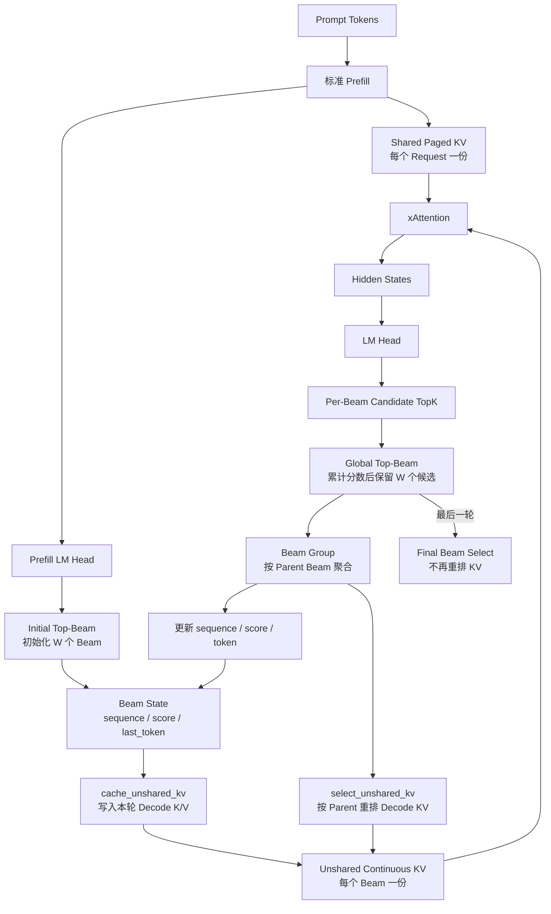
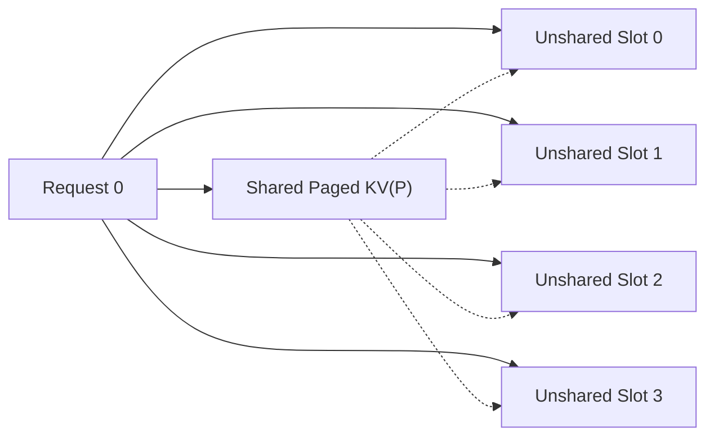
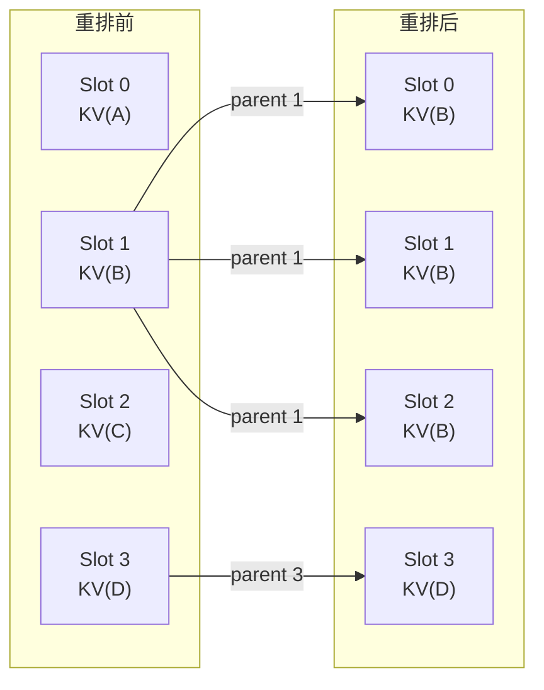
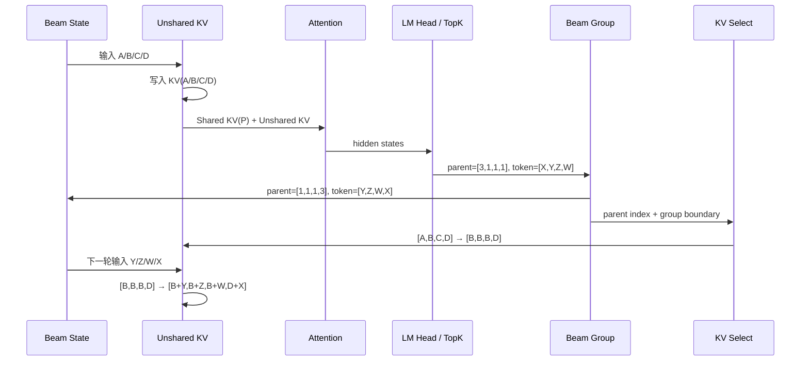

## 1. 问题背景

生成式推荐通常具有以下负载特征：

- Prompt 很长，例如用户行为历史；
- Decode 很短，例如只生成 3～5 个 Semantic ID Token；
- Beam Width 很大，同一请求可能维护几十到几百条候选路径；
- 不同 Beam 在 Prefill 阶段完全相同，只在 Decode 阶段逐步分叉。

如果把每个 Beam 都当成一条完整、独立的序列，那么长 Prompt 的 KV Cache 会被重复保存 `beam_width` 次。更合适的做法是把 KV Cache 拆为两部分：

```text
Shared KV
  保存 Prompt 的 K/V
  每个 Request 只保存一份
  同一 Request 的所有 Beam 共享

Unshared KV
  保存 Beam 分叉后的 Decode K/V
  每个 Beam 独立维护
  Beam 更新后需要跟随父子关系重排
```

本文重点解释这种组织下，一轮 Beam Search 中的数据究竟怎样流动。

---

## 2. 完整数据流



这条链路可以划分为两个平面：

| 平面 | 主要数据 | 作用 |
| --- | --- | --- |
| 逻辑 Beam 状态 | `sequence`、`beam_score`、`last_token`、`parent_index` | 决定哪些候选继续存活 |
| 物理 KV 状态 | Shared KV、Unshared KV、Block Table | 保证下一轮 Attention 读取到与存活 Beam 一致的历史 |

只更新逻辑 Beam 状态是不够的。Beam 的父子关系变化后，物理 Unshared KV 也必须同步变化，否则下一轮 Token 会读取到错误的历史。

---

## 3. KV Cache 的逻辑与物理组织

### 3.1 Shared KV：Prompt 部分

假设 Batch 中有 `B` 个请求，每个请求有 `W` 个 Beam。Shared KV 的逻辑所有权是：

```text
Request 0 ── Shared KV 0 ── Beam 0 / 1 / ... / W-1 共同读取
Request 1 ── Shared KV 1 ── Beam 0 / 1 / ... / W-1 共同读取
...
```

Shared KV 通常继续沿用 vLLM 的 Paged KV Cache：

```text
Shared KV Pool
├── Physical Block 0
├── Physical Block 1
├── Physical Block 2
└── ...

shared_block_table[request]
    └── 给出该请求 Prompt 对应的物理 Block 序列
```

Beam Search 不改变 Prompt，因此中间 Beam 更新不需要复制或重排 Shared KV。

### 3.2 Unshared KV：Decode 部分

Unshared KV 保存 Beam 分叉后的短历史。一种适合短 Decode 的连续布局为：

```text
[batch, beam, kv_head, max_decode_step, head_dim]
```

每层分别维护 Key 和 Value：

```text
unshared_key_cache[layer]
unshared_value_cache[layer]
```

如果 `B=1`、`W=4`，物理上可以理解为：



图中的虚线表示四个 Beam 在 Attention 时都读取同一份 Prompt KV，但每个 Beam 只追加自己的 Decode KV。

### 3.3 Attention 的数学视图

对请求 `b` 的第 `w` 个 Beam：

```text
K(b,w) = concat(K_shared(b), K_unshared(b,w))
V(b,w) = concat(V_shared(b), V_unshared(b,w))
```

Attention 为：

```text
O(b,w) = softmax(Q(b,w) × K(b,w)^T / sqrt(d)) × V(b,w)
```

这里的 `concat` 是逻辑拼接。实现上不需要真的把两段 KV 复制到一块连续内存，只需要 Attention Kernel 分别读取 Shared 和 Unshared 两个地址区间。

---

## 4. Beam Width = 4 的完整例子

下面只考虑一个 Request：

```text
batch_size = 1
beam_width = 4
Prompt = P
```

### 4.1 Prefill：只生成 Shared KV

输入 Prompt：

```text
P = [p0, p1, p2]
```

Prefill 后：

```text
Shared KV = KV(P)
Unshared KV = empty
```

此时还没有必要为四个 Beam 复制四份 `KV(P)`。

### 4.2 Initial Top-Beam：产生初始分支

Prefill LM Head 选择四个初始 Token：

| Beam Slot | Sequence | Beam Score | Last Token | Unshared KV |
| ---: | --- | ---: | --- | --- |
| 0 | `P + A` | -0.20 | `A` | empty |
| 1 | `P + B` | -0.10 | `B` | empty |
| 2 | `P + C` | -0.35 | `C` | empty |
| 3 | `P + D` | -0.18 | `D` | empty |

注意：`A/B/C/D` 已经进入逻辑 Sequence，但它们还没有经过下一次 Transformer Forward，因此对应 K/V 尚未写入 Unshared KV。

逻辑结构为：

```text
                         ┌── Beam 0: P + A
Shared KV(P) ────────────├── Beam 1: P + B
                         ├── Beam 2: P + C
                         └── Beam 3: P + D
```

### 4.3 Decode Attention：写入 A/B/C/D 的 K/V

第一轮 Decode Forward 的输入为：

```text
[A, B, C, D]
```

`cache_unshared_kv` 写入本轮 K/V：

| Slot | Input Token | 写入后的 Unshared KV | Attention 读取的完整历史 |
| ---: | --- | --- | --- |
| 0 | `A` | `KV(A)` | `KV(P) + KV(A)` |
| 1 | `B` | `KV(B)` | `KV(P) + KV(B)` |
| 2 | `C` | `KV(C)` | `KV(P) + KV(C)` |
| 3 | `D` | `KV(D)` | `KV(P) + KV(D)` |

经过 Attention、后续 Transformer Layer 和 LM Head 后，每个 Beam 都会产生下一 Token 的候选概率。

### 4.4 Global Top-Beam：得到 `[3, 1, 1, 1]`

假设最终进入全局 Top-4 的候选为：

| 全局分数排名 | Parent Slot | Candidate Token | Candidate LogP | 累计 Score |
| ---: | ---: | --- | ---: | ---: |
| 1 | 3 | `X` | -0.03 | `-0.18 - 0.03 = -0.21` |
| 2 | 1 | `Y` | -0.12 | `-0.10 - 0.12 = -0.22` |
| 3 | 1 | `Z` | -0.15 | `-0.10 - 0.15 = -0.25` |
| 4 | 1 | `W` | -0.20 | `-0.10 - 0.20 = -0.30` |

于是按照累计分数得到：

```text
parent_index = [3, 1, 1, 1]
token_id     = [X, Y, Z, W]
score        = [-0.21, -0.22, -0.25, -0.30]
```

`[3, 1, 1, 1]` 的含义不是四条新 Beam 的最终物理顺序必须永远如此，而是：

```text
第 0 个获胜候选来自旧 Slot 3
第 1 个获胜候选来自旧 Slot 1
第 2 个获胜候选来自旧 Slot 1
第 3 个获胜候选来自旧 Slot 1
```

它描述的是父子关系。

### 4.5 Beam Group：按父 Beam 聚合

为了让同一父 Beam 的孩子连续存放，Beam Group 将上面的候选重新组织为：

```text
parent_index = [1, 1, 1, 3]
token_id     = [Y, Z, W, X]
score        = [-0.22, -0.25, -0.30, -0.21]
```

对应的新逻辑状态为：

| New Slot | Parent Slot | New Token | New Score | New Sequence |
| ---: | ---: | --- | ---: | --- |
| 0 | 1 | `Y` | -0.22 | `P + B + Y` |
| 1 | 1 | `Z` | -0.25 | `P + B + Z` |
| 2 | 1 | `W` | -0.30 | `P + B + W` |
| 3 | 3 | `X` | -0.21 | `P + D + X` |

这个步骤没有丢失或增加候选，只是把物理输出顺序从“按分数排序”转成“按 Parent 聚合”。

父 Beam 的累计分组边界为：

```text
group_token_num = [0, 3, 3, 4]
```

它可以理解为各父 Slot 处理完成后的累计输出数：

| Parent Slot | 自己产生的存活孩子数 | 累计结束位置 |
| ---: | ---: | ---: |
| 0 | 0 | 0 |
| 1 | 3 | 3 |
| 2 | 0 | 3 |
| 3 | 1 | 4 |

因此：

```text
new slot [0, 3) 复制 parent slot 1
new slot [3, 4) 复制 parent slot 3
```

### 4.6 KV Select：同步重排物理历史

Beam Group 更新了 Sequence，但此时 Unshared KV 仍然是旧物理状态：

```text
old slot 0 = KV(A)
old slot 1 = KV(B)
old slot 2 = KV(C)
old slot 3 = KV(D)
```

根据新的 `parent_index=[1,1,1,3]`，KV Select 执行：

```text
new slot 0 ← old slot 1
new slot 1 ← old slot 1
new slot 2 ← old slot 1
new slot 3 ← old slot 3
```

物理 KV 变化为：



即：

```text
[KV(A), KV(B), KV(C), KV(D)]
              ↓ select_unshared_kv
[KV(B), KV(B), KV(B), KV(D)]
```

旧 Slot 0 和 Slot 2 对应的路径已经被淘汰，其 KV 空间可直接被覆盖。旧 Slot 1 被三个新 Beam 继承，因此需要产生三份逻辑上独立的 Decode 历史；后续三个孩子会分别追加不同 Token。

### 4.7 下一轮 Decode：追加 Y/Z/W/X

下一轮模型输入为：

```text
[Y, Z, W, X]
```

`cache_unshared_kv` 在刚刚重排后的历史上追加本轮 K/V：

| Slot | Input | 追加前 | 追加后 | 对应 Sequence |
| ---: | --- | --- | --- | --- |
| 0 | `Y` | `KV(B)` | `KV(B + Y)` | `P + B + Y` |
| 1 | `Z` | `KV(B)` | `KV(B + Z)` | `P + B + Z` |
| 2 | `W` | `KV(B)` | `KV(B + W)` | `P + B + W` |
| 3 | `X` | `KV(D)` | `KV(D + X)` | `P + D + X` |

此时逻辑 Sequence 和物理 KV 再次对齐：

```text
Slot 0: Sequence P+B+Y  ↔ Shared KV(P) + Unshared KV(B+Y)
Slot 1: Sequence P+B+Z  ↔ Shared KV(P) + Unshared KV(B+Z)
Slot 2: Sequence P+B+W  ↔ Shared KV(P) + Unshared KV(B+W)
Slot 3: Sequence P+D+X  ↔ Shared KV(P) + Unshared KV(D+X)
```

然后重新进入：

```text
xAttention
  → LM Head
  → Candidate TopK
  → Global Top-Beam
  → Beam Group
  → KV Select
```

---

## 5. 单步数据变化总览



一轮中四类数据的变化可以压缩为：

| 数据 | Top-Beam 前 | Beam Group 后 | KV Select 后 |
| --- | --- | --- | --- |
| Parent | 未知 | `[1,1,1,3]` | `[1,1,1,3]` 已消费 |
| Token | `[A,B,C,D]` | `[Y,Z,W,X]` | `[Y,Z,W,X]` |
| Sequence | `[P+A,P+B,P+C,P+D]` | `[P+B+Y,P+B+Z,P+B+W,P+D+X]` | 不变 |
| Score | `[-.20,-.10,-.35,-.18]` | `[-.22,-.25,-.30,-.21]` | 不变 |
| Unshared KV | `[A,B,C,D]` | 仍是旧布局 | `[B,B,B,D]` |

最关键的时间顺序是：

```text
先用旧 Beam 的本轮 Token 写 KV
    ↓
再根据 LM Head 结果选择下一 Token
    ↓
再把已经写好的历史 KV 按新父子关系重排
    ↓
下一轮才写入新 Token 的 KV
```

不能把“Sequence 已经追加新 Token”和“新 Token 的 K/V 已经生成”混为一谈。

---

## 6. 多请求 Batch 下的索引

如果 Batch 中存在多个 Request，Global Beam Search 算子可能输出展平后的全局 Parent Index。

例如：

```text
batch_size = 2
beam_width = 4

Request 0 的全局 Slot = [0,1,2,3]
Request 1 的全局 Slot = [4,5,6,7]
```

假设 Request 1 的获胜父 Beam 为：

```text
global_parent = [7,5,5,5]
```

转换为 Request 内部的局部索引：

```text
request_offset = request_id × beam_width = 1 × 4 = 4

local_parent
  = global_parent - request_offset
  = [7,5,5,5] - 4
  = [3,1,1,1]
```

KV Select 操作的是每个 Request 内部的 Beam Slot，因此需要使用局部 Parent Index。不同请求之间的 Unshared KV 不应互相复制。

---

## 7. 为什么先 Group 再 Select

从数学正确性看，可以直接根据：

```text
parent = [3,1,1,1]
```

做四次任意位置 Gather。但按父 Beam 聚合后：

```text
parent = [1,1,1,3]
```

有几个工程优势：

1. 同一源 Beam 的多个孩子形成连续输出区间；
2. `group_token_num` 可以直接描述每个父 Beam 的目标区间；
3. 同一源 KV 可以连续复制到多个目标 Slot；
4. 更容易做分块搬运、向量化和多核任务切分；
5. Sequence、Token、Score 和 KV 可以采用统一的新 Slot 顺序。

它仍然属于 Gather/Copy 类型访存，但不再是完全无规律的逐元素稀疏 Gather。由于 Decode 长度通常只有 3～5，单 Beam 需要搬运的 KV 历史较短；通过父 Beam 聚合后，也更容易让 NPU Kernel 获得连续的读写区间。

---

## 8. 最后一轮为什么不需要 KV Select

KV Select 的目的，是为下一轮 Attention 准备正确的 Beam 历史。

如果当前已经是最后一轮：

```text
LM Head
  → Final Beam Select
  → 返回结果
```

后面不再执行 Decode Attention，因此没有必要继续复制或重排 KV。最后一轮只需要得到最终 Token、Sequence 和 Score，跳过 KV Select 可以减少一次无用的显存或 HBM 搬运。

---

## 9. 需要始终保持的三个不变量

### 不变量一：Shared KV 归 Request 所有

```text
一个 Request 一份 Prompt KV
所有 Beam 只读共享
Beam 更新不改变 Shared Block Table
```

### 不变量二：Unshared Slot 与当前 Beam Slot 一一对应

在进入下一轮 Attention 前，必须满足：

```text
sequence[b,w] 的 Decode 历史
    ==
unshared_kv[b,w] 保存的历史
```

### 不变量三：Beam 的所有状态使用同一种重排

以下数据必须使用同一个 Parent Mapping：

```text
sequence
beam_score
last_token
finished flag
constraint / trie state
unshared KV
```

如果只重排其中一部分，错误通常不会立刻表现为 Shape 异常，而会表现为概率、约束状态或最终推荐结果悄然错误，因此更难排查。

---

## 10. 总结

Shared/Unshared KV 方案的核心不是简单地增加一块 Decode Cache，而是让 Beam Search 的逻辑状态变化与 KV Cache 的物理状态变化严格同步：

```text
Prompt
  → Shared Paged KV，只保存一次

Beam Decode
  → Unshared KV，每个 Beam 独立

LM Head
  → 根据累计分数选出新的 Beam

Beam Group
  → 把同一父 Beam 的孩子放到连续 Slot

KV Select
  → 按相同父子关系重排物理 Decode KV

Next Decode
  → 在正确历史上追加新 Token 的 K/V
```

对于本文的例子，最重要的一次变化是：

```text
Global Top-Beam parent:
[3,1,1,1]

Group 后：
[1,1,1,3]

Unshared KV：
[KV(A),KV(B),KV(C),KV(D)]
    →
[KV(B),KV(B),KV(B),KV(D)]

下一轮追加：
[KV(B+Y),KV(B+Z),KV(B+W),KV(D+X)]
```

这就是从 LM Head 输出到下一轮 Attention 之间，Beam 状态与 KV Cache 数据流的完整闭环。
