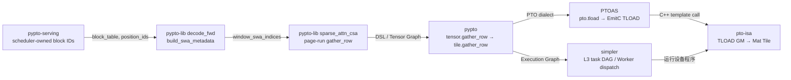
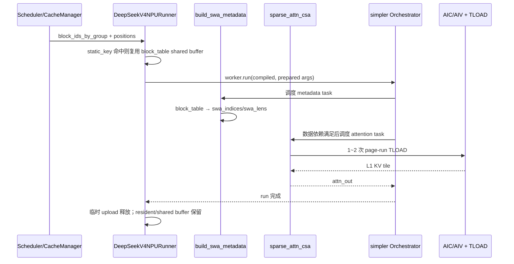

> 本章分析基于 2026-08-10 六个仓库默认分支：`pto-isa@0cefc9a`、`simpler@a8d7ce1`、`PTOAS@307d048`、`pypto@2dc2bb2`、`pypto-lib@5b8d1e9`、`pypto-serving@272b874`。结论来自合入代码与测试；本文没有在本地 Ascend 设备上重新跑 benchmark。PR 描述中的设备结果会单独标为“上游实验事实”。

## 1. 今日主线及其课程位置

PTO 全栈的第一章不从目录概览开始，而从一个真实的性能改动逆向追踪：DeepSeek-V4 Flash decode 的 CSA sparse attention，为什么能把滑窗 KV 的 **128 次单行 GM→L1 搬运**压缩成通常 **1～2 个 page-run 搬运**？

这个问题正好穿过六层边界：



本章处在长期路线“服务状态与 Python 模型代码如何落到设备执行”的起点。前置知识只需三点：Paged KV 用 block table 将逻辑位置映射到物理页；DeepSeek-V4 的 `head_dim=512`、BF16，因此一行 KV 是 `512 × 2 = 1024 B`；PTO 的 `Tile` 是有 memory space/layout/valid shape 的设备数据对象，不是普通二维数组。

## 2. 今天要回答的维护问题

1. 谁拥有 physical block，谁只消费映射？
2. `window_swa_indices` 是 Host 端提前算好，还是设备程序生成？
3. 一个逻辑窗口跨页时，如何保证两个 run 既不漏行也不越界？
4. `valid_shape` 为什么必须同时进入目标 subview 和源 `partition_view`？
5. 这次优化改变的是传输字节数、DMA 次数，还是两者？
6. 如果修改 `BLOCK_SIZE/WIN/ATTN_K_TILE`，六个仓的哪些 contract 会一起受影响？

## 3. 六仓知识点与 owner map

| 仓库 | 本章知识点 | 输入 | 输出/责任边界 |
| --- | --- | --- | --- |
| [`pypto-serving`](https://github.com/hw-native-sys/pypto-serving/tree/272b87492695f78d44c2e8cfe808f372706de594) | scheduler block IDs 到固定形状 block table | 每请求六组物理 block IDs | 构造并复用 Host shared buffer；不决定 attention 的页内 run |
| [`pypto-lib`](https://github.com/hw-native-sys/pypto-lib/tree/5b8d1e9846ff7401f0f8525bc5a5b67c8191c13e) | SWA metadata 与 CSA page-run gather | `position_ids/block_table/ori_kv` | 生成物理 row index，分 run 搬到 L1，执行 attention；本章重点 |
| [`pypto`](https://github.com/hw-native-sys/pypto/tree/2dc2bb25434afa7b6229e6f1b6c9b361f81f286f) | `gather_row` 的 DPS 与 lowering | GM Tensor、L1 accumulator、static shape、runtime valid shape | `subview + partition_view + tload`；不拥有 KV 分页策略 |
| [`PTOAS`](https://github.com/hw-native-sys/PTOAS/tree/307d0484a9e7d5e36f01b253d2bebe4d2f45fe81) | `TLoadOp` verifier 和 EmitC conversion | PTO dialect 的 view/type/valid shape | 拒绝非法 IR，并发出 `TLOAD(dst, src)` |
| [`pto-isa`](https://github.com/hw-native-sys/pto-isa/tree/0cefc9a5a1c24c62655cc345d408559595a8af32) | `TLOAD` 的跨代设备语义 | `GlobalTensor` 与 Vec/Mat `Tile` | 完成 GM→Tile 传输和布局转换；不理解 block table |
| [`simpler`](https://github.com/hw-native-sys/simpler/tree/a8d7ce12c7433442f4930baf9daf6ab4e3b7edb5) | L3 callable 的任务依赖与 dispatch | PyPTO Execution Graph、tensor arguments | 依赖计算、资源调度、运行与完成通知；不改 kernel 内 run 算法 |

这张 owner map 给出第一个长期不变量：**Serving 拥有分配，model/kernel 拥有解释，compiler 保真 lowering，runtime 拥有时序，ISA 拥有最后一公里语义。** 把任意两层揉在一起，短期可能少传一个参数，长期会让缓存策略、编译器和硬件代际同时耦合。

## 4. 端到端调用链：从请求的物理页到 CSA 输出

### 4.1 Serving：物理 block ID 的 owner

[`DeepSeekV4CacheMetadataBuilder.paged_ori_block_table_from_ids`](https://github.com/hw-native-sys/pypto-serving/blob/272b87492695f78d44c2e8cfe808f372706de594/pypto_serving/model/deepseek/npu_runner.py#L708-L727) 接收 scheduler 为每个请求分配的 `ori` block IDs，检查非空、非负和最大页数，再用 `ring_block_table_from_ids` 扩展到固定 `ori_table_max_blocks`。对 decode 来说，固定形状不是数据模型要求，而是已编译程序和共享 buffer 的 ABI 要求。

[`prepare_decode_inputs`](https://github.com/hw-native-sys/pypto-serving/blob/272b87492695f78d44c2e8cfe808f372706de594/pypto_serving/model/deepseek/npu_runner.py#L2098-L2155) 只在 `static_key`（六组 block IDs）变化时重建并拷贝 `block_table` 等静态 metadata；每步变化的 `input_ids/position_ids/kv_seq_lens` 写入 runner-owned reusable shared tensor。`DeepSeekV4PreparedDecodeInputs` 明确声明这些字段只是 view，**只保证在下一批 decode prepare 之前有效**。这是典型的固定地址优化，也意味着异步调用者不能把对象缓存到下一轮。

最后 [`_run_l3`](https://github.com/hw-native-sys/pypto-serving/blob/272b87492695f78d44c2e8cfe808f372706de594/pypto_serving/model/deepseek/npu_runner.py#L3674-L3697) 将参数转成 worker 可接受的 device/shared tensor，执行 `worker.run(callable_spec.compiled, *l3_args)`，并释放本次临时 upload；resident/shared 参数由 runner/worker 继续持有。

### 4.2 pypto-lib：在设备内把逻辑位置翻译成物理 row

真正的 `window_swa_indices` 不是 Serving 在 Host 上逐 token 计算的。主 decode program 内联调用 [`build_swa_metadata`](https://github.com/hw-native-sys/pypto-lib/blob/5b8d1e9846ff7401f0f8525bc5a5b67c8191c13e/models/deepseek_v4_flash_dspark/decode_metadata.py#L51-L107)。对 token `t`：

```text
request       = t // S
valid_len     = min(position + 1, WIN)
start         = position - valid_len + 1
logical_block = visible_position // BLOCK_SIZE
offset        = visible_position % BLOCK_SIZE
physical_row  = ori_block_table[request, logical_block] * BLOCK_SIZE + offset
```

输出有三份：当前 token 写 KV 的 `swa_slot_mapping[T] int64`、可见历史行 `swa_indices[T, WIN] int32`、有效长度 `swa_lens[T] int32`。不足 `WIN` 的尾部保持 `-1`。这里 block table 是只读输入，metadata tensor 是本次 decode graph 的中间产物，由下游 attention 消费；没有跨请求持久化。

### 4.3 pypto-lib：从 128 个散点误判中恢复“页内连续性”

本章核心是 [`decode_sparse_attn_csa.py`](https://github.com/hw-native-sys/pypto-lib/blob/5b8d1e9846ff7401f0f8525bc5a5b67c8191c13e/models/deepseek_v4_flash_dspark/decode_sparse_attn_csa.py#L238-L295)。旧实现逐个读取 `window_swa_indices[t, s]`，每行调用一次 `pl.gather_row`。逻辑上正确，却丢掉了一个物理事实：在同一 KV page 内，相邻 logical token 映射成相邻 physical row。

新实现先算：

```text
SWA_TILE_WIN_ROWS = min(ATTN_K_TILE, WIN)
SWA_RUNS = ceil((SWA_TILE_WIN_ROWS + 2*(BLOCK_SIZE-1)) / BLOCK_SIZE)
```

随后对每个 tile 窗口，根据首行的页内偏移 `qk_head`，求 run 的 `[lo, hi)`，只从每个 run 第一行读取一次物理地址，然后：

```python
pl.gather_row(
    acc=qk_k_acc,
    src=ori_kv,
    dst_offset=[qk_s0 + lo, 0],
    src_offset=[physical_row, 0, 0],
    shapes=[ATTN_K_TILE, HEAD_DIM],      # 编译期 boxing
    valid_shape=[hi - lo, HEAD_DIM],    # 运行期真实 DMA 范围
)
```

未映射/无效尾部使用安全 row 0 作为地址，但 logits 端以 `NEG_INF` mask；累加器的无效尾巴也显式填充，避免上一次 L1 内容泄漏进 softmax。压缩缓存的 top-k 行仍然是真正离散的，因此保留逐行 gather。这说明优化不是“见 gather 就合并”，而是利用 producer 的连续性 contract 做局部批处理。

接着 `qk_k_acc` 与 query 进入 matmul、scale、mask、softmax，概率再与同一 L1 KV tile 做 PV，最终与 compressed path 合并并经过量化 output projection，写出 `attn_out[T, 4096] BF16`。Golden reference [`golden_sparse_attn`](https://github.com/hw-native-sys/pypto-lib/blob/5b8d1e9846ff7401f0f8525bc5a5b67c8191c13e/models/deepseek_v4_flash_dspark/decode_sparse_attn_csa.py#L570-L698) 则直接按 `window_swa_indices` 取 PyTorch 行，形成与优化实现不同但语义等价的验证路径。

## 5. `gather_row` 如何穿过编译栈

### 5.1 PyPTO API contract

[`pl.create_l1` 与 `pl.gather_row`](https://github.com/hw-native-sys/pypto/blob/2dc2bb25434afa7b6229e6f1b6c9b361f81f286f/python/pypto/language/op/tensor_ops.py) 采用 destination-passing style：返回值和 `acc` 是同一个逻辑 accumulator 的新 SSA 版本。关键 contract 是：

- `acc` 位于 L1/Mat，`src` 位于 GM，二者 dtype 相同；
- `dst_offset/src_offset` 可以是运行时标量；
- `shapes` 必须编译期常量，决定 accumulator 中可写 subview 的物理盒子和结果 type；
- `valid_shape` 可以运行时变化，但只能缩小实际传输，不改变分配大小或返回 type；
- dynamic `valid_shape` 不能与 transpose 路径组合；调用者必须保证每个维度 `0 < valid <= shape`，且 offset 不越界。

Tensor→Tile conversion 在 [`op_conversion_registry.cpp`](https://github.com/hw-native-sys/pypto/blob/2dc2bb25434afa7b6229e6f1b6c9b361f81f286f/src/ir/transforms/op_conversion_registry.cpp#L2029-L2049) 原样转发第六个可选参数。后端 [`MakeGatherRowCodegenPTO`](https://github.com/hw-native-sys/pypto/blob/2dc2bb25434afa7b6229e6f1b6c9b361f81f286f/src/backend/common/pto_ops_datamove.cpp#L290-L484) 生成：

```text
%dst_view = pto.subview %l1_acc valid_rows=%run_rows
%src_view = pto.partition_view %ori_kv offsets=[physical_row,0,0]
                                      sizes=[%run_rows,1,HEAD_DIM]
pto.tload ins(%src_view) outs(%dst_view)
```

这里没有 `pto.tmov`，也不是 `MGATHER`。kernel 先用标量索引选定每个连续 run 的基址，然后 `TLOAD` 搬整个 run。

### 5.2 PTOAS：验证并转成 C++ ISA 调用

[`TLoadOp::verify`](https://github.com/hw-native-sys/PTOAS/blob/307d0484a9e7d5e36f01b253d2bebe4d2f45fe81/lib/PTO/IR/PTO.cpp#L3312) 检查源必须是合法 partition view、目标必须是 tile buffer，shape 为正且满足架构 dtype/layout 约束。之后 [`PTOTLoadToTLOAD`](https://github.com/hw-native-sys/PTOAS/blob/307d0484a9e7d5e36f01b253d2bebe4d2f45fe81/lib/PTO/Transforms/PTOToEmitC.cpp#L4778-L4792) 把 op 变成 EmitC opaque call `TLOAD(dst, src)`。

一个容易忽略的历史兼容点是 PTOAS 已合入 [`allow tload valid shape <= partition`](https://github.com/hw-native-sys/PTOAS/commit/6d082bdc6bdeae95bfc5c7b86f13a3ac697cd18c)：valid extent 可以小于静态 partition。这正是动态 page-run 的必要条件。若未来 verifier 又收紧成“必须相等”，pypto-lib 会在编译期直接断裂。

### 5.3 pto-isa：真正控制 DMA 范围

[`TLOAD` 文档](https://github.com/hw-native-sys/pto-isa/blob/0cefc9a5a1c24c62655cc345d408559595a8af32/docs/isa/TLOAD_zh.md) 定义 GM→Vec/Mat Tile；本例走 Mat/L1 和 ND→NZ 类路径。A2/A3 实现位于 [`include/pto/npu/a2a3/TLoad.hpp`](https://github.com/hw-native-sys/pto-isa/blob/0cefc9a5a1c24c62655cc345d408559595a8af32/include/pto/npu/a2a3/TLoad.hpp)，A5 有独立实现 [`a5/TLoad.hpp`](https://github.com/hw-native-sys/pto-isa/blob/0cefc9a5a1c24c62655cc345d408559595a8af32/include/pto/npu/a5/TLoad.hpp)。

为什么 PyPTO 必须让 `valid_shape` 同时控制 GM `partition_view` 的 shape？A2/A3 的 GM→L1 ND2NZ 路径从 `GlobalTensor` shape 推导 burst/stride；如果只缩小目标 tile 的 valid rows，而源仍描述 128 行，硬件路径可能仍搬满 128 行，得到“类型看似正确、尾部悄悄被覆盖”的错数。A5 的具体实现不同，但同一 IR contract 让两代后端一致。

## 6. simpler：谁保证这些任务按正确时序运行

PyPTO Golden runner 最终通过 `pypto.runtime.execute_compiled` 注册编译产物，构造 orchestration args，并调用 `simpler.worker.Worker`。Serving 则复用长期存活的 L3 worker。Python [`Worker.register/submit/run`](https://github.com/hw-native-sys/simpler/blob/a8d7ce12c7433442f4930baf9daf6ab4e3b7edb5/python/simpler/worker.py#L5799) 把 callable 变成 handle；同步 `run` 本质上是 `submit(...).wait()`。

A5 TensorMap/RingBuffer runtime 的 [`compute_task_fanin`](https://github.com/hw-native-sys/simpler/blob/a8d7ce12c7433442f4930baf9daf6ab4e3b7edb5/src/a5/runtime/tensormap_and_ringbuffer/runtime/pto_dep_compute.h#L82-L139) 按 tensor 的读写/overlap 查询 producer，注册 fan-in；[`pto_orchestrator.cpp`](https://github.com/hw-native-sys/simpler/blob/a8d7ce12c7433442f4930baf9daf6ab4e3b7edb5/src/a5/runtime/tensormap_and_ringbuffer/runtime/pto_orchestrator.cpp#L814-L933) 再处理 lookup、validity 和 output/inout 注册。

因此本章状态有两层生命周期：



代码事实是 `pl.spmd(NUM_QK_CORES)` 声明并行 grid、simpler 基于 Execution Graph 调度任务；但仅凭源码没有在本文环境编译出最终 graph，所以“一个 token 精确生成几个 runtime task、映射到哪个 AIC/AIV task ID”仍是待验证项，不能从 Python 循环次数直接猜。

## 7. 具体演算：position 8192 为什么是 127+1

取实际常量：`BLOCK_SIZE=128`、`WIN=128`、`ATTN_K_TILE=128`、`HEAD_DIM=512`、BF16。当前 token position 为 8192，则可见窗口是 `[8065, 8192]`：

- `8065 = 63 × 128 + 1`，首行页内偏移 `qk_head=1`；
- run 0 覆盖当前物理页 offset `[1,128)`，共 127 行；
- run 1 覆盖下一物理页 offset `[0,1)`，共 1 行；
- 若 block table 将逻辑页 63、64 映射到物理 block 7、42，则两个源基址分别是 `7×128+1=897` 与 `42×128=5376`；物理页无需相邻。

旧路径：128 次 `gather_row`，每次 1 KiB，总 payload 128 KiB。新路径：2 次 `gather_row/TLOAD`，分别搬 127 KiB 和 1 KiB，总 payload 仍为 128 KiB。优化减少的是 DMA setup/指令和标量循环开销，不是数据量。

边界 position 0 则 `valid_len=1`：有效 run 只有 1 行，剩余 127 行必须被安全填充并 mask。若误写 `qk_head=0`，页跨越 fixture 会在 position 8192 把错误物理页当成连续页；这类 bug 在页对齐位置或只测试单页时完全看不出来。

`SWA_RUNS` 使用保守上界而非硬编码 2。对长度不超过 128 的连续逻辑区间，最多跨两个 128-row page；公式额外考虑 tile 起点和页边界。临时把 `ATTN_K_TILE` 提到 256 时，上游测试也能覆盖更多 run，而无需改循环结构。

## 8. 为什么这样设计，以及替代方案

### 方案 A：保留逐行 gather

最简单、对任意离散索引正确，也最容易复用。但固定窗口内要发 128 次小 DMA，无法利用页内连续性。适合 compressed top-k，不适合 SWA。

### 方案 B：Host 端直接生成 run descriptor

Serving 可传 `(physical_base, rows)` 列表，设备省掉 metadata 计算。代价是 Host 每步构造动态描述符、跨进程/Host-Device 传输增加，固定地址与 graphability 变差，Serving 被迫理解 kernel tile 选择。当前把逻辑 block table 作为稳定 ABI、设备内生成 metadata，更适合长期 resident program。

### 方案 C：真正的硬件 gather/MGATHER

可以消费离散索引，但对页内连续区间通常不如大块 DMA；还会增加 ISA/后端差异。本例已能把离散表规约成两段连续区间，因此 `TLOAD` 是更小的抽象和升级面。

### 方案 D：直接把 ring cache 永远物理连续化

能让窗口一次搬完，却把 allocator 限制为连续物理页，增加碎片、迁移或预留容量，破坏 Serving 的独立分页策略。当前方案只要求“单页内连续”，允许不同页任意放置，是更稳健的分层。

## 9. 性能、正确性与硬件约束

- **延迟**：小 DMA 数从 128 降到通常 2；上游提交记录的 8192 position benchmark 中中位数区间重叠，尚不能宣称端到端显著加速。attention/matmul/调度仍可能主导。
- **带宽/显存**：payload 和 KV 容量不变，L1 accumulator 仍按静态 `[128,512]` boxing；只改变有效传输范围。
- **并行**：qk/pv 以 `NUM_QK_CORES=24` 的 SPMD grid 分工；run 内没有线程间共享可变 offset。修改 token/core 映射时必须重新检查 accumulator ownership。
- **确定性**：索引、run 边界为整数运算，不改变 attention 数学顺序；但无效尾填充和 `NEG_INF` mask 缺一不可，否则 L1 复用会引入历史数据依赖。
- **A2/A3 与 A5**：统一 `TLOAD` contract，具体 DMA/布局实现分代。只在模拟器通过不足以证明 dynamic valid extent 在真机生效。
- **图模式**：静态 `shapes` 保持分配/type/address 结构固定，动态 `valid_shape` 只改变有效区域，适合复用编译产物；若让 result shape 随 run 变化，会污染后续 matmul type 与 graph caching。

## 10. 测试证据与缺口

### 已有证据

1. PyPTO 真机 sentinel 测试 [`test_gather_row_dynamic_valid_shape.py`](https://github.com/hw-native-sys/pypto/blob/2dc2bb25434afa7b6229e6f1b6c9b361f81f286f/tests/st/runtime/ops/test_gather_row_dynamic_valid_shape.py) 用 `src[p,:]=p`，先以 sentinel 填满 128 行，再以运行时 `valid_rows∈{1,63,127,128}` 覆盖前缀；若 DMA 偷搬满窗口，尾部断言立刻失败。另有 `1/63/127` 的 two-run split。
2. PTOAS lit 测试 [`load_store_tile_native.pto`](https://github.com/hw-native-sys/PTOAS/blob/307d0484a9e7d5e36f01b253d2bebe4d2f45fe81/test/lit/pto/load_store_tile_native.pto) 检查 native IR 保留 `pto.tload`、A3 EmitC 出现 `TLOAD`；[`emitc_memref_cast_from_dynamic_subview.pto`](https://github.com/hw-native-sys/PTOAS/blob/307d0484a9e7d5e36f01b253d2bebe4d2f45fe81/test/lit/pto/emitc_memref_cast_from_dynamic_subview.pto) 覆盖动态 subview/partition 的合法化。
3. pypto-lib 当前提交 [`#919 / 5b8d1e9`](https://github.com/hw-native-sys/pypto-lib/commit/5b8d1e9846ff7401f0f8525bc5a5b67c8191c13e) 记录：golden suite 通过；MTP/DSpark CSA cases 在 A2/A3 通过；position `0/127/255/8192` 覆盖短窗口与跨页；把 `qk_head` 错设为 0 的 negative control 会失败；临时 `ATTN_K_TILE=256` 也通过。
4. `decode_sparse_attn_csa` 输出比较使用 `ratio_allclose(atol=1e-4, rtol=1/128)`，默认最多允许 0.5% 元素超差，而不是 strict allclose。这个阈值适合量化 attention，但也可能掩盖低比例、固定位置的索引错误。

### 最小 CI guard 与未覆盖风险

- 在 pypto-lib 保留跨两个**不相邻 physical block** 的 deterministic fixture，并对窗口中每一行编码 source row ID；仅比较最终 `attn_out` 的 ratio 不够敏感。
- 为 `BLOCK_SIZE != WIN`、`ATTN_K_TILE > BLOCK_SIZE`、batch 内不同 position offset 增加参数化测试。
- Serving unit test应把 scheduler 分配的 ring block IDs 经过 `prepare_decode_inputs → build_swa_metadata` 与纯 PyTorch 映射逐元素比对；当前 Host builder 和设备 metadata 各自有测试，跨仓 ABI 缺少一条 guard。
- A5 需要与 A2/A3 相同的 dynamic-valid 真机矩阵；模拟器与 EmitC pattern 只证明编译路径，不证明 DMA 实际范围。
- 增加性能 microbenchmark：分别报告 TLOAD 次数、搬运字节、metadata 时间和完整 attention 时间，避免只看端到端噪声。

## 11. 修改这一带时的影响面检查表

- `BLOCK_SIZE/WIN/HEAD_DIM` 是否同时匹配 Serving layout、pypto-lib constant、KV pool shape 和 pto-isa layout限制？
- `block_table` 是绝对 logical block table 还是 ring-expanded table？是否允许 `-1`？当前 Serving 要求 physical ID 非负，pypto-lib 尾部 `-1` 属于生成后的 index tensor。
- prepared inputs 是否仍为 runner-owned reusable view？有没有异步消费者跨 batch 保存引用？
- `shapes` 是否保持编译期常量，`valid_shape` 是否只缩小且同时喂给源/目标 view？
- Tensor→Tile→PTO lowering 是否仍保持 DPS alias 和 GM source，不意外插入 GM↔GM/Tile↔Tile copy？
- PTOAS verifier 与 A2/A3、A5 `TLOAD` 对 dynamic valid extent 的解释是否一致？
- Golden 是否使用独立 reference，是否覆盖非相邻物理页、短窗口和恰好页边界？
- 更改 task/grid 后，simpler 的 tensor read/write region 能否正确推导 fan-in，worker resident buffer 生命周期是否仍成立？
- 安装包版本是否锁定兼容的 `pypto/PTOAS/pto-isa/simpler` 组合？跨仓单独发布极易产生“能 import、编译时报 verifier 错”的漂移。

## 12. 今日知识拼图、债务与下一章

今天确认的完整链路是：

> scheduler physical block IDs → Serving 固定形状 `block_table` → 设备 `build_swa_metadata` → `window_swa_indices` → CSA page-run `gather_row` → PyPTO `subview + partition_view + pto.tload` → PTOAS `TLOAD(dst,src)` → pto-isa GM→L1 → simpler 按 tensor 依赖调度并回收本次运行状态。

最高风险点不是 run 公式本身，而是 **dynamic `valid_shape` 的跨层一致性**：Python DSL、PTO IR、EmitC、GlobalTensor shape 和两代设备实现只要有一层把“静态盒子”误当成“实际传输范围”，就会产生静默错数。

尚未闭合的知识债：最终 Execution Graph 中 metadata/attention 的精确 task 数和 AIC/AIV 映射；Serving cache group allocator 如何回收六组 block；A5 真机 dynamic-valid 覆盖；六仓发布版本的兼容矩阵。

三个理解检查问题：

1. 为什么 position 8192 的 128-token 窗口是 127+1，而不是 128+0？
2. 为什么仅设置 destination tile 的 `valid_rows=1`，却让 source partition 仍为 128 行，会有静默覆盖风险？
3. compressed top-k 为什么不能照搬 SWA 的 page-run 合并？什么额外条件成立时才可以？

下一章将沿今天留下的运行时断点继续：**PyPTO 的 Tensor Graph 如何形成 Block/Execution Graph，以及 simpler TensorMap 如何从 region read/write 计算 task DAG**。届时会把 `pl.spmd(24)` 精确追到编译产物、task payload 和 AIC/AIV resource shape，而不是停留在 Python 语义层。

