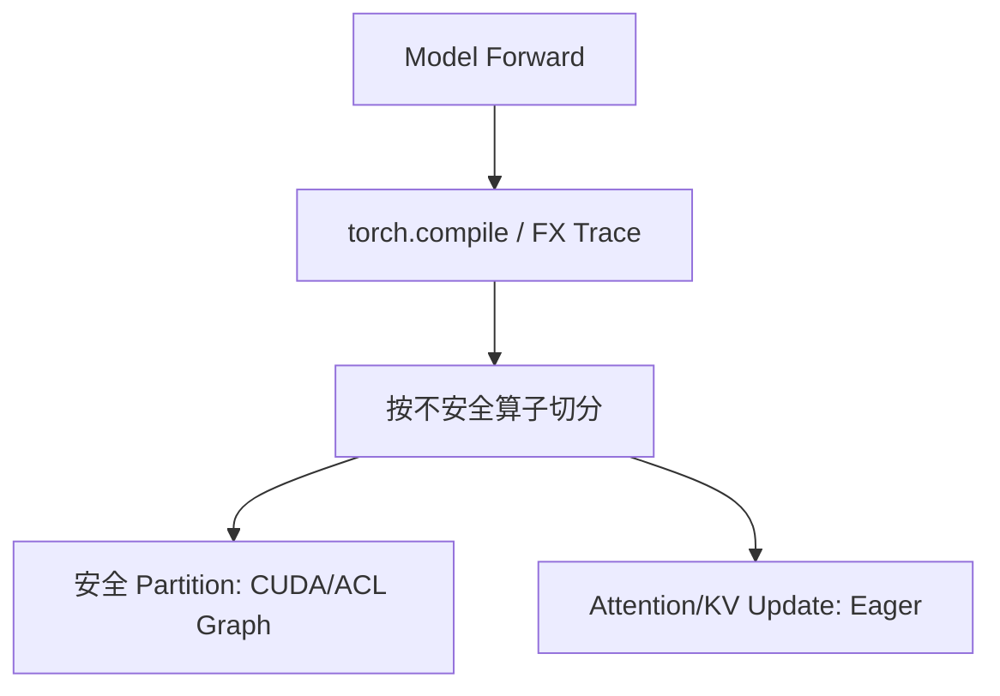
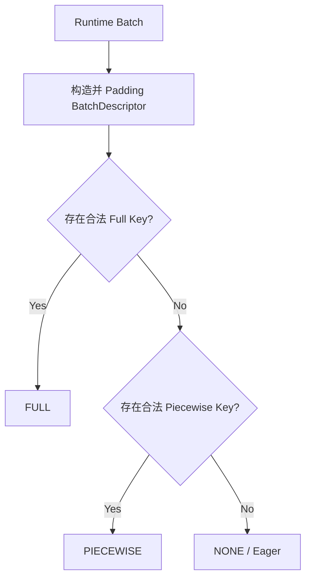
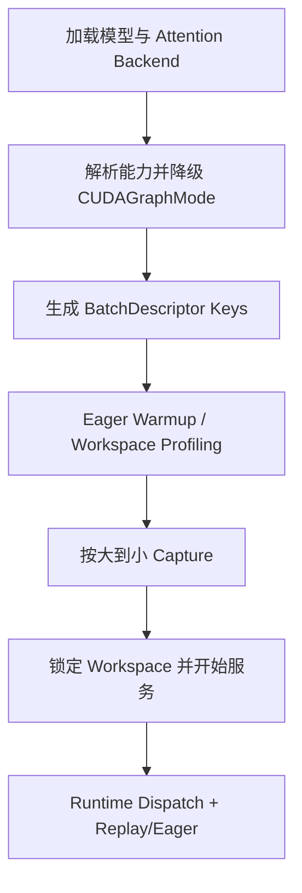
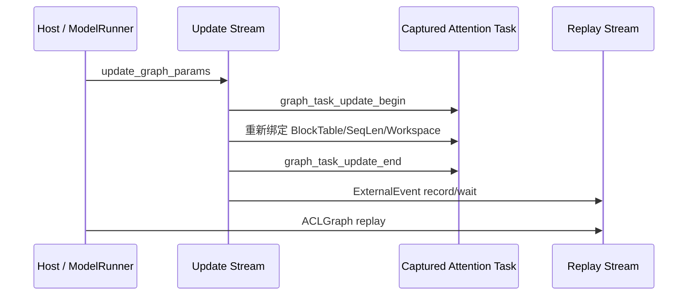

> 本文基于 2026-08-10 的 GitHub 默认分支快照：vLLM `a123159f`、vllm-ascend `ac19e1e6`。重点不是介绍 CUDA Graph API，而是回答工程中更关键的问题：vLLM 到底有哪些图模式、一次请求什么时候会落到 Full/Piecewise/Eager、框架和算子分别必须满足什么条件，以及 Ascend ACLGraph 为什么不能简单视为 CUDA Graph 的 API 替换。

## 目录

1. [核心结论](#1-核心结论)
2. [先区分三种容易混淆的图](#2-先区分三种容易混淆的图)
3. [vLLM 的五种配置模式与三种运行模式](#3-vllm-的五种配置模式与三种运行模式)
4. [Full Graph 的真实捕获边界](#4-full-graph-的真实捕获边界)
5. [BatchDescriptor 与运行时 Dispatcher](#5-batchdescriptor-与运行时-dispatcher)
6. [Capture Size、Padding 与图复用](#6-capture-sizepadding-与图复用)
7. [Attention Backend：Full Graph 的第一道门槛](#7-attention-backendfull-graph-的第一道门槛)
8. [框架层的成图要求](#8-框架层的成图要求)
9. [算子层的成图要求](#9-算子层的成图要求)
10. [Piecewise Graph 到底如何切图](#10-piecewise-graph-到底如何切图)
11. [vLLM Capture 与 Replay 生命周期](#11-vllm-capture-与-replay-生命周期)
12. [Ascend 图模式的两阶段结构](#12-ascend-图模式的两阶段结构)
13. [ACLGraph 最关键的差异：Attention Task 参数更新](#13-aclgraph-最关键的差异attention-task-参数更新)
14. [ACLGraph 的平台限制与资源约束](#14-aclgraph-的平台限制与资源约束)
15. [配置、验证与故障排查](#15-配置验证与故障排查)
16. [对 vllm-gr Beam Decode Full Graph 的启示](#16-对-vllm-gr-beam-decode-full-graph-的启示)
17. [总结](#17-总结)

---

## 1. 核心结论

先给出全文最重要的结论：

1. vLLM 当前并不是简单的“有图/无图”或“Piecewise/Full”二选一，而是五种配置策略、三种实际运行模式。
2. `FULL` 表示整个模型 `forward` 被一个静态图 wrapper 捕获；它通常不包含 LM Head、Sampler、请求状态更新和调度逻辑。
3. Full Graph 能否成立，首先由 Attention Backend 的图能力决定；Attention 是大多数 LLM 中最复杂、动态元数据最多的算子。
4. Piecewise Graph 依赖 `torch.compile` 的图切分：Attention、KV Cache Update 等不安全算子留在图外，其余计算段分别 capture。
5. 同一配置下，不同运行批次可以动态落到 `FULL`、`PIECEWISE` 或 `NONE`；配置值不能直接代表每一轮真实执行模式。
6. CUDA Graph 的底层约束可以概括为：设备化、异步化、静态化。Shape、地址、Launch Topology、Workspace 和跨流依赖都必须稳定。
7. vllm-ascend 复用了上游的模式、BatchDescriptor、Dispatcher 和 Padding 策略，但底层使用 `torch.npu.NPUGraph`，并增加 Attention Task Handle 更新机制。
8. Ascend 的 `Npugraph_ex` 是编译期 FX 优化层，ACLGraph 才是运行时 Capture/Replay；二者解决的问题不同。
9. Ascend Full Graph 不只要求 Attention 可以被 capture，还要求 Backend 能在 replay 前通过 `update_graph_params()` 更新动态 Attention 参数。
10. 对 Beam Search 场景而言，上游所谓 Full Graph 只是“模型主体 Full Graph”；要实现端到端 Beam Decode Full Graph，还需继续把 LM Head、候选选择、BeamKV 更新和状态推进设备化。

---

## 2. 先区分三种容易混淆的图

讨论 vLLM 图模式前，需要先分清 `torch.compile`、CUDA/ACL Graph 和 Piecewise Graph 的职责。

### 2.1 `torch.compile` / FX Graph

`torch.compile` 主要负责：

- 追踪 Python/PyTorch 模型代码；
- 构建 FX Graph；
- 进行算子融合和图优化；
- 通过 Inductor 或平台编译器生成优化后的 callable；
- 处理动态 Shape、Guard 和编译缓存。

但一个编译后的 callable 仍可能包含大量独立 Kernel Launch。`torch.compile` 并不天然等价于 CUDA Graph。

### 2.2 CUDA Graph / ACLGraph

CUDA Graph 或 ACLGraph 记录的是一次真实设备执行中产生的：

- Kernel Launch；
- Memcpy；
- Event/Stream Dependency；
- 支持图捕获的通信算子；
- 设备任务之间的固定依赖关系。

后续 replay 不再由 Python 逐个提交 Kernel，而是由运行时一次发起整张图，从而减少 CPU Launch Overhead。

### 2.3 vLLM Piecewise Graph

Piecewise Graph 是编译图与运行时图的组合：



其典型过程是：

1. 用 `torch.compile` 得到 FX Graph；
2. 在 Attention、KV Cache Update 等不安全算子处切分；
3. 不安全算子继续 Eager 执行；
4. 两侧的安全 Partition 分别 Capture；
5. Runtime 仍按原顺序执行多个小图和图外算子。

因此，Piecewise Graph 不是“较小的 Full Graph”，而是一种显式绕开不兼容算子的混合执行策略。

---

## 3. vLLM 的五种配置模式与三种运行模式

当前 `CompilationConfig.cudagraph_mode` 定义了五种配置模式：

```python
class CUDAGraphMode(enum.Enum):
    NONE = 0
    PIECEWISE = 1
    FULL = 2
    FULL_DECODE_ONLY = (FULL, NONE)
    FULL_AND_PIECEWISE = (FULL, PIECEWISE)
```

真正传给 Graph Wrapper 的具体运行模式只有：

- `NONE`
- `PIECEWISE`
- `FULL`

`FULL_DECODE_ONLY` 和 `FULL_AND_PIECEWISE` 是 Dispatcher 策略：它们根据运行批次类型选择上述三个具体模式之一。

| 配置模式 | Uniform Decode | Prefill / Mixed Batch | 是否需要 Piecewise Compilation |
| --- | --- | --- | --- |
| `NONE` | Eager | Eager | 否 |
| `PIECEWISE` | Piecewise | Piecewise | 是 |
| `FULL` | Full | Full | 否 |
| `FULL_DECODE_ONLY` | Full | Eager | 否 |
| `FULL_AND_PIECEWISE` | Full | Piecewise | 是 |

### 3.1 Uniform Decode 是什么

vLLM 将所有请求本轮 Query Length 相同的 Batch 称为 Uniform Batch。

普通 Decode：

```text
每个请求本轮输入 1 个 token
uniform_decode_query_len = 1
```

Speculative Decode 的验证阶段：

```text
每个请求本轮输入 1 + num_spec_tokens 个 token
uniform_decode_query_len = 1 + num_spec_tokens
```

Prefill 或 Prefill/Decode 混合批次则属于 Non-uniform Batch。

### 3.2 `FULL` 模式的特殊语义

单一 `FULL` 模式不是“只为 Decode 捕获 Full Graph”。它要为 Non-uniform Batch 捕获 Full Graph，并允许相同 Shape 的 Uniform Decode 复用这个更一般化的图。

这意味着 `FULL` 对 Attention Backend 的要求最高：Backend 必须能够用相同图结构处理 Prefill、Mixed 和 Decode。

如果 Backend 只支持 Uniform Decode，vLLM 会尝试把 `FULL` 降级为：

- 有 Piecewise Compilation：`FULL_AND_PIECEWISE`；
- 无 Piecewise Compilation：`FULL_DECODE_ONLY`。

### 3.3 优化等级映射

当前优化等级大致对应：

| 优化等级 | Compilation | CUDA Graph |
| --- | --- | --- |
| `-O0` | `NONE` | `NONE` |
| `-O1` | `VLLM_COMPILE` | `PIECEWISE` |
| `-O2` | `VLLM_COMPILE` | `FULL_AND_PIECEWISE` |
| `-O3` | 当前基本等于 `-O2` | `FULL_AND_PIECEWISE` |

生产环境默认 `-O2` 的目的，是让 Uniform Decode 获得 Full Graph 的低延迟，同时保持 Prefill/Mixed Batch 的兼容性。

---

## 4. Full Graph 的真实捕获边界

“Full Graph”这个名字很容易造成误解。

在通用 GPU ModelRunner 路径中，Graph Forward Context 包住的是：

```python
model_output = self._model_forward(...)
```

随后才执行：

```python
sample_hidden_states = hidden_states[logits_indices]
logits = self.model.compute_logits(sample_hidden_states)
sampler_output = self._sample(logits, spec_decode_metadata)
```

所以通用 Full Graph 通常覆盖：

```text
Transformer / Model Backbone Forward
```

而以下内容通常仍在图外：

- Scheduler；
- Python 输入整理；
- Attention Metadata 构建；
- LM Head / `compute_logits`；
- Sampler；
- Grammar Bitmask；
- Request/Sequence/Beam 状态更新；
- EngineCore Bookkeeping；
- CPU 侧输出处理。

可以把三个层次区分为：

| 名称 | 捕获范围 |
| --- | --- |
| Piecewise Model Graph | 模型 Forward 中的若干安全计算段 |
| Full Model Graph | 整个模型 Forward |
| End-to-End Decode Graph | Forward + LM Head + Sampler/Beam + KV/状态更新 |

因此，vLLM 配置显示 `FULL`，并不代表完整 Decode Step 已经没有 Host Launch。

---

## 5. BatchDescriptor 与运行时 Dispatcher

vLLM 用 `BatchDescriptor` 作为 Graph Dispatch Key：

```python
@dataclass(frozen=True)
class BatchDescriptor:
    num_tokens: int
    num_reqs: int | None = None
    uniform: bool = False
    has_lora: bool = False
    num_active_loras: int = 0
```

### 5.1 `num_tokens` 不是简单的 Batch Size

它表示本轮 Scheduled Token 总数：

| 场景 | `num_tokens` 近似值 |
| --- | --- |
| 普通 Decode | `num_reqs` |
| Spec Decode 验证 | `num_reqs × (1 + num_spec_tokens)` |
| Prefill | 所有请求本轮 Prefill Token 总和 |
| Mixed Batch | Prefill Token + Decode Token |

所以 `cudagraph_capture_sizes` 实际上是 Token Gear，不总是请求数 Gear。

### 5.2 Full Key 为什么更严格

Full Graph Key 需要区分：

- Padded Token 数；
- Request 数；
- 是否为 Uniform Decode；
- 是否存在 LoRA；
- Active LoRA 数量。

原因是 Attention Metadata、Kernel Scheduler、Block Table Shape、LoRA Kernel Grid 都可能依赖这些条件。

### 5.3 Piecewise Key 为什么可以放松

Piecewise 模式会将 Key 放松为：

```python
num_reqs = None
uniform = False
```

因为 Attention 已在图外，图内的 GEMM、RMSNorm、MLP 等计算通常只关心 Padded Token 数，不关心 Token 属于多少请求、Query Length 如何分布。

### 5.4 Dispatcher 的选择过程



实际 Dispatch 优先级为：

```text
FULL > PIECEWISE > NONE
```

但 Dispatcher 会先排除当前批次不允许的模式，例如：

- Cascade Attention：禁用 `FULL`；
- Encoder Input 存在：禁用 `FULL`；
- 强制 Eager：只允许 `NONE`；
- DP Rank 协调后要求所有 Rank 使用相同 Runtime Mode；
- 超过最大 Capture Size：直接 `NONE`。

---

## 6. Capture Size、Padding 与图复用

静态图要求固定 Shape，但 Serving Batch 大小不断变化。vLLM 的解决方式是：预定义有限数量的 Capture Size，并把运行时 Token 数 Padding 到最近的可用 Gear。

默认候选大致为：

```python
[1, 2, 4]
+ list(range(8, 256, 8))
+ list(range(256, max_size + 1, 16))
```

例如：

```text
Capture Sizes = [1, 2, 4, 8, 16, 24, 32]
Runtime num_tokens = 19
Selected Graph Size = 24
Padding = 5 tokens
```

如果：

```text
num_tokens > max_cudagraph_capture_size
```

本轮不会选择图，而是回退 Eager。

### 6.1 默认最大 Capture Size

当前默认近似为：

```python
default_max = 1024 if data_center_blackwell else 512

max_graph_size = min(
    max_num_seqs * decode_query_len * 2,
    default_max,
    max_num_batched_tokens,
)
```

其目的不是覆盖所有可能的 Prefill Token 数，而是控制：

- Graph 数量；
- Capture 启动时间；
- Graph Pool 显存；
- Padding 浪费；
- 小 Batch 的延迟。

### 6.2 Padding 正确性要求

Padding 后，所有读取和写入型算子都必须识别无效槽位：

- Attention 不得读取无效 Query；
- KV Cache Update 不得写入真实 Block；
- MoE Routing 不得把 Padding Token 当作有效 Token；
- Logits/Sampler 不得返回 Padding 位置；
- Beam/KV 算子必须使用 Valid Mask 或 `PAD_SLOT_ID`。

只要有一个副作用算子不能正确忽略 Padding，Graph 即使成功 Capture，也可能产生 Silent Wrong Result。

### 6.3 LoRA 会扩大 Graph Key 空间

启用 LoRA 后，vLLM 可以分别为：

- 无 LoRA；
- 有 LoRA；
- 不同 Active LoRA 数量；

捕获不同 Graph。这样可以避免无 LoRA 请求执行多余 LoRA Kernel，但会增加启动时间和显存占用。

---

## 7. Attention Backend：Full Graph 的第一道门槛

vLLM 用 `AttentionCGSupport` 描述 Attention Backend 的 Full Graph 能力：

```python
class AttentionCGSupport(Enum):
    ALWAYS = 3
    UNIFORM_BATCH = 2
    UNIFORM_SINGLE_TOKEN_DECODE = 1
    NEVER = 0
```

| 能力 | 可支持场景 |
| --- | --- |
| `ALWAYS` | Prefill、Mixed、Uniform Decode |
| `UNIFORM_BATCH` | 所有请求 Query Length 相同，包括 Spec Decode |
| `UNIFORM_SINGLE_TOKEN_DECODE` | 仅普通单 Token Decode |
| `NEVER` | 不能进入 Full Graph |

如果模型包含多类 Attention，例如 Hybrid Attention/Mamba，最终能力取所有 Backend 的最小值。

### 7.1 当前典型 CUDA Backend 能力

| Attention Backend | 声明能力 | 说明 |
| --- | --- | --- |
| FlashAttention 3 | `ALWAYS` | 可统一处理 Mixed 和 Decode |
| Triton Attention | `ALWAYS` | 通常仍偏好双模式以获得更好性能 |
| FlashAttention 2 | `UNIFORM_BATCH` | 实现能力更宽，但出于性能策略降级声明 |
| AITER FlashAttention | `UNIFORM_BATCH` | Uniform Batch Full Graph |
| FlashMLA | `UNIFORM_BATCH` | 支持 Spec Decode 形态 |
| FlashInfer MLA/Sparse MLA | `UNIFORM_BATCH` | Uniform Batch Full Graph |
| FlashInfer | `UNIFORM_SINGLE_TOKEN_DECODE` | 常规情况下仅单 Token Decode |
| AITER MLA | `UNIFORM_SINGLE_TOKEN_DECODE` | 仅普通 Decode |
| CUTLASS MLA | `UNIFORM_SINGLE_TOKEN_DECODE` | 仅普通 Decode |
| Mamba | `UNIFORM_SINGLE_TOKEN_DECODE` | Cache 状态要求更严格 |
| 未声明 Backend | `NEVER` | 默认不允许 Full Graph |

### 7.2 Speculative Decode 的额外条件

当：

```text
uniform_decode_query_len = 1 + num_spec_tokens > 1
```

Backend 至少需要达到 `UNIFORM_BATCH`。

只有 `UNIFORM_SINGLE_TOKEN_DECODE` 能力时，会回退到：

- `PIECEWISE`，如果 Attention 可以被切出；
- 否则 `NONE`。

### 7.3 Cascade Attention

当前 Cascade Attention 被明确排除在 Full Graph 外。

运行时结果为：

| 配置 | 使用 Cascade 时的结果 |
| --- | --- |
| `FULL_AND_PIECEWISE` | `PIECEWISE` |
| `FULL_DECODE_ONLY` | `NONE` |
| `FULL` | 无 Full Key 时 `NONE` |

这说明：Graph Mode 是逐批次决策，不是进程启动后永远固定。

---

## 8. 框架层的成图要求

### 8.1 Piecewise 必须能完成模型编译与切分

Piecewise Graph 要求：

```text
CompilationMode.VLLM_COMPILE
+ 非空 splitting_ops
+ Attention 位于切分点
```

默认切分点通常包括：

- Attention Custom Ops；
- `vllm::unified_kv_cache_update`；
- `vllm::unified_mla_kv_cache_update`。

如果使用实验性的 Inductor Graph Partition，则不安全算子可通过：

```python
tags=(torch._C.Tag.cudagraph_unsafe)
```

在 Inductor Codegen 阶段被排除出 Piecewise Graph。

### 8.2 Full Graph 不强制依赖 Piecewise Compilation

Full Wrapper 位于整个 Model Callable 外层。即使内部是被切分的编译 Callable，外层 Capture 仍然可以记录：

- 编译后的安全 Partition；
- 图外 Attention；
- 图外 KV Update；
- 它们之间完整的 Launch 顺序。

因此 Full Graph 与 `torch.compile` 在架构上是正交的；但 Full Capture 内所有真实运行算子仍必须支持底层 Graph Capture。

### 8.3 输入必须由 Persistent Buffer 承载

vLLM 的 Graph Wrapper 自己不负责为 Full Graph 复制输入。ModelRunner 必须保证：

- Replay 使用同一块输入地址；
- Shape、DType、Stride、Layout 一致；
- 新数据通过原地 Copy 写入旧 Buffer；
- Output 和 Workspace 生命周期覆盖 Graph 生命周期。

Debug 模式会检查：

```python
new_input.data_ptr() == captured_input.data_ptr()
```

正确做法：

```python
static_input.copy_(runtime_input)
graph.replay()
```

错误做法：

```python
static_input = runtime_input.clone()
graph.replay()
```

后者改变了底层地址，而 Graph 仍然访问 Capture 时的旧地址。

### 8.4 动态状态必须改写为设备 Buffer

每轮变化的：

- Token ID；
- Position；
- Slot Mapping；
- Block Table；
- Sequence Length；
- Decode Step；
- Beam Parent Mapping；
- Active/Finished Mask；

应采用：

```text
固定地址 Device Buffer
+ Replay 前原地更新内容
```

不能依赖：

- Python Int 变化；
- 新建 Tensor；
- Python 分支选择不同 Kernel；
- CPU 读取设备结果后决定后续路径。

### 8.5 分布式 Rank 必须保持一致的执行拓扑

TP/DP/EP 场景中，每个 Rank 必须保证：

- Collective 次数一致；
- Collective 顺序一致；
- Runtime Mode 一致；
- Padded Token Gear 与通信 Shape 兼容；
- Sequence Parallel Token 数满足整除约束。

否则某些 Rank replay Full Graph、另一些 Rank 执行 Eager，极易产生通信 Hang。

---

## 9. 算子层的成图要求

CUDA Graph 的核心原则可以概括为：

```text
GPU-only
Asynchronous
Static
```

### 9.1 Launch Topology 固定

同一张图每次 Replay 必须保持：

- Kernel 数量相同；
- Kernel 顺序相同；
- Grid/Block/Shared Memory 配置固定；
- Stream/Event 依赖固定；
- Collective 次数和顺序固定。

不适合直接成图的逻辑：

```python
if current_step == 0:
    launch_kernel_a()
else:
    launch_kernel_b()
```

常见改法：

- 为不同 Step 捕获不同 Graph；
- 使用固定拓扑 + Device Mask；
- 使用 `torch.where` 等设备侧选择；
- 把 Python 分支移到 Graph 外。

### 9.2 Shape、Stride 与 Layout 固定

同一 Graph Key 下要求：

- Tensor Shape 固定；
- DType 固定；
- Stride 固定；
- Layout 固定；
- Output Shape 固定；
- Workspace Size 固定。

仅仅“元素数量相同”不够。如果 Layout 或 Stride 变化，Kernel 参数和地址解释方式也可能改变。

### 9.3 禁止 Host-Device 同步

Capture 区域内应避免：

- `tensor.item()`；
- `tensor.cpu()`；
- 打印 GPU Tensor；
- Device/Stream/Event Synchronize；
- 同步 Memcpy；
- 查询 Stream/Event 完成状态。

这些操作要么直接导致 Capture 失败，要么导致 CPU 逻辑只在 Capture 时执行一次、Replay 时不再执行。

### 9.4 CPU 逻辑不会 Replay

以下 Python 行为不会在 Graph Replay 时重新发生：

- Python List Append；
- Python Counter 更新；
- 日志；
- Python RNG；
- 文件或网络 I/O；
- 根据 Python 对象状态选择路径。

如果后续设备计算依赖这些每轮变化的 Host 状态，就会出现 Silent Wrong Result。

### 9.5 Workspace 固定

一个图兼容算子应满足至少一种策略：

1. 完全无 Workspace；
2. 初始化阶段预分配固定 Workspace；
3. Warmup 时按最大 Shape 分配最大 Workspace；
4. 每个 Graph Key 缓存独立 Workspace。

不能在 Replay 时根据输入内容临时扩容。

这也是后处理和 Beam Search Kernel 中“无 Workspace 单 Kernel”具有额外价值的原因：它不仅减少内存和 Launch，还降低了 Full Graph 集成复杂度。

### 9.6 Custom Op 同时满足 Compile 与 Capture

`torch.compile` 层要求：

- Schema 正确；
- Fake/Meta Implementation 正确；
- Shape 推导不读取真实设备数据；
- Mutation/Alias 描述准确；
- Functionalization 可处理 In-place 行为；
- 不把动态 Python 对象硬编码进图。

CUDA/ACL Graph 层要求：

- 内部只使用 Capture-safe API；
- 不执行隐式 `.item()` 或同步；
- 不在运行期创建不稳定 Stream；
- Kernel Grid 不依赖未固化 Host 值；
- Workspace 地址和生命周期稳定；
- Collective 支持 Graph Capture。

一个算子可能支持 `torch.compile`，但不支持 CUDA Graph。此时：

- Piecewise：将它加入 `splitting_ops` 或标记 `cudagraph_unsafe`；
- Full：不能绕过，整个 Full Graph 都无法成立。

### 9.7 RNG

如果 Graph 内存在随机采样：

- 必须使用 Graph-safe Generator；
- RNG State 必须由 Graph 支持的机制推进；
- 不能使用 Python RNG；
- 不能每轮创建新 Generator；
- 多 Rank/多请求必须定义清晰的 Seed 语义。

上游 Full Model Graph 通常不包含 Sampler，因此把 Sampler 纳入 End-to-End Decode Graph 时需要额外处理 RNG。

### 9.8 KV Cache 与副作用写入

KV Cache Tensor 通常是长期持有的大 Buffer，本身适合成图。困难主要来自：

- Slot Mapping 每轮变化；
- Block Table 每轮变化；
- Beam Parent Mapping 每轮变化；
- 写入位置动态；
- Active Token 数变化；
- Padding 位置必须禁止写入。

图友好的实现应采用：

```text
固定容量 KV Buffer
+ 固定地址 Mapping Buffer
+ Padding/Valid Mask
+ Device-side Gather/Scatter
```

---

## 10. Piecewise Graph 到底如何切图

默认情况下，vLLM 会把 Attention Custom Op 作为 `splitting_ops`。在某些路径中，还会把 Unified KV Cache Update 加入切分点。

假设一层 Transformer 的执行为：

```text
RMSNorm -> QKV GEMM -> RoPE/KV Update -> Attention
        -> Out Projection -> Residual -> MLP
```

Piecewise 后可能变为：

```text
Graph A:
RMSNorm -> QKV GEMM

Eager:
RoPE/KV Update -> Attention

Graph B:
Out Projection -> Residual -> MLP
```

模型有多层时，类似的 Partition 数量会随层数增长。

### 10.1 Piecewise 的优势

- 不要求 Attention 支持 Full Graph；
- Prefill/Mixed Batch 兼容性高；
- Graph Key 更容易复用；
- 动态 Attention Metadata 留在图外，正确性风险较低。

### 10.2 Piecewise 的代价

- 每层仍有多个 Host Launch；
- 图之间存在 Python/Dispatcher 开销；
- Capture Graph 数量多；
- Graph Pool 和启动时间增加；
- Ascend 上可能消耗大量 Stream Resource；
- 不能获得单次 Full Graph Replay 的最低 Launch Latency。

---

## 11. vLLM Capture 与 Replay 生命周期

完整生命周期可以概括为：



### 11.1 为什么从大 Shape 开始 Capture

`capture_model()` 会按大 Shape 到小 Shape Capture，使后续小图尽可能复用大图已经申请的 Graph Pool，减少显存碎片和额外分配。

### 11.2 Warmup 与 Capture 分离

Warmup 使用 `CUDAGraphMode.NONE`，目的是：

- 初始化 Kernel；
- 完成 Autotune；
- 确定 Attention Workspace；
- 触发一次性初始化；
- 避免把初始化任务错误录入 Graph。

Full Graph Warmup 会显式要求执行 Attention，确保 Attention Kernel 和 Workspace 在正式 Capture 前 Ready。

### 11.3 Capture 后锁定 Workspace

Capture 完成后，vLLM 调用 `lock_workspace()`。这表达了一个框架级不变量：

> 服务开始后，所有会进入 Graph 的算子都不应再要求扩大 Workspace。

### 11.4 Wrapper 的行为

每个 Wrapper 绑定一个具体 Runtime Mode：`FULL` 或 `PIECEWISE`。

运行时：

1. 读取 Forward Context 中的 Runtime Mode；
2. Mode 不匹配时直接调用原 Callable；
3. Mode 匹配时按 BatchDescriptor 查 Graph Entry；
4. 已 Capture 则 Replay；
5. Debug 模式验证输入地址不变；
6. 返回 Graph 中固定 Output Buffer 的引用。

---

## 12. Ascend 图模式的两阶段结构

vllm-ascend 复用了上游的：

- `CUDAGraphMode`；
- `BatchDescriptor`；
- Dispatcher；
- Capture Size；
- Padding；
- Full/Piecewise Nested Wrapper 思路。

平台通过：

```python
NPUPlatform.get_static_graph_wrapper_cls()
```

返回：

```text
vllm_ascend.compilation.acl_graph.ACLGraphWrapper
```

但 Ascend 的默认图路径分成两个阶段：

| 阶段 | 组件 | 作用 |
| --- | --- | --- |
| 编译期 | Npugraph_ex / FX Fusion | 图优化、算子融合、可选静态 Kernel |
| 运行期 | ACLGraph | 捕获并 Replay NPU Task |

### 12.1 不同模式的 Ascend 路径

| `cudagraph_mode` | 编译期 | 运行期 | Npugraph_ex |
| --- | --- | --- | --- |
| `FULL_AND_PIECEWISE` | Piecewise Compilation | Decode Full、Mixed Piecewise | 关闭 |
| `FULL` / `FULL_DECODE_ONLY` | Npugraph_ex FX 优化 | ACLGraph | 默认开启 |
| `PIECEWISE` | 基础 FX Fusion | ACLGraph | 关闭 |
| `NONE` | 无 | Eager | 关闭 |

### 12.2 Npugraph_ex 不是 ACLGraph

Npugraph_ex 负责：

- 优化 FX Graph；
- 把多个算子融合为 NPU Custom Op；
- 可选 Static Kernel Compile；
- 减少图内 Kernel 数量。

ACLGraph 负责：

- 捕获真实 NPU Task；
- 保存执行依赖；
- Replay 已捕获任务序列。

因此：

```text
Npugraph_ex：优化“图里面是什么”
ACLGraph：优化“这张图如何重复提交”
```

### 12.3 Ascend 不使用 CUDA 平台的 Inductor 路径

平台明确设置：

```python
compilation_config.use_inductor = False
```

转而使用 `AscendCompiler`：

- `enable_npugraph_ex=True`：走 Npugraph_ex/torchair；
- 否则：执行基础 Fusion Pass。

Npugraph_ex 配置中的 `force_eager=True` 是指编译后的 FX Callable 以 Eager 方式执行，再由外层 ACLGraph Capture；它不等于最终关闭 Graph。

---

## 13. ACLGraph 最关键的差异：Attention Task 参数更新

CUDA Full Graph 的常见动态参数处理方式是：

```text
固定地址 Metadata Tensor
+ 每轮原地更新 Tensor 内容
+ Kernel 在 Replay 中读取新内容
```

Ascend Attention 还存在额外问题：部分 FIA/PagedAttention 参数在 Capture 时进入具体 NPU Task。仅替换 Python Metadata 或 Tensor 引用，已捕获 Task 不会自动改用新参数。

可能需要更新的内容包括：

- Block Table；
- Sequence Length；
- Actual Query Length；
- Attention Mask；
- Sparse Mode；
- Workspace；
- Output Tensor；
- Sliding Window 参数。

### 13.1 Capture 时保存什么

Ascend Attention Backend 在 Capture 时保存：

- `torch_npu._C._NPUTaskGroupHandle`；
- `torch.npu.ExternalEvent`；
- 每个 Token Gear 的 Workspace；
- Attention 参数与 Tensor 弱引用；
- Graph Size 对应的 Task 列表。

### 13.2 Replay 前如何更新



Backend 通过：

```python
torch.npu.graph_task_update_begin(update_stream, handle)
attention_op.out(..., workspace=workspace, out=outputs)
torch.npu.graph_task_update_end(update_stream)
```

把本轮参数更新到已 Capture 的 Attention Task 中。

### 13.3 为什么需要 ExternalEvent

Update Stream 与 Replay Stream 必须满足：

```text
本轮参数更新完成
    before
本轮 Graph Replay 使用这些参数
```

同时还要避免：

```text
第 i 轮参数更新
抢在第 i-1 轮 Replay 完成前修改共享 Task
```

否则可能出现：

- 使用错轮次 Metadata；
- 重复输出；
- 精度错误；
- Hang；
- 无报错的结果污染。

### 13.4 Full Graph Backend 的额外接口责任

在 Ascend 上，Attention Backend 声明支持 Full Graph，不仅意味着算子能被 `torch.npu.NPUGraph` 捕获，还意味着必须实现正确的：

```python
update_graph_params(...)
```

以及：

- Task Handle 生命周期；
- Workspace Cache；
- Event 顺序；
- Capture 与 Replay Metadata 对齐；
- 多层 Attention 参数映射。

这是 ACLGraph 与 CUDA Graph 使用体验上的核心差异。

---

## 14. ACLGraph 的平台限制与资源约束

### 14.1 当前 Attention 能力

| Ascend Backend | 声明能力 | 实际含义 |
| --- | --- | --- |
| `attention_v1` | `ALWAYS` | 可处理 Mixed Prefill/Decode |
| `context_parallel/attention_cp` | `ALWAYS` | 理论上覆盖 Mixed，但 CP Full 仍有限制 |
| `mla_v1` | `UNIFORM_BATCH` | 更适合 Uniform Decode Full Graph |
| `context_parallel/mla_cp` | `UNIFORM_BATCH` | CP + MLA 限制更严格 |
| `sfa_v1` | `UNIFORM_BATCH` | 仅 Uniform Batch |
| `context_parallel/sfa_cp` | `UNIFORM_BATCH` | 仅 Uniform Batch |

### 14.2 Stream Resource Exhaustion

ACLGraph Capture 可能报：

```text
207008
Stream resources are insufficient
Insufficient_Stream_Resources
```

Piecewise 和 `FULL_AND_PIECEWISE` 更容易触发，因为资源消耗近似随以下因素相乘：

```text
模型 Partition 数
× Capture Size 数
× Runtime Mode 数
× LoRA Case 数
× Draft/Target Graph 数
```

可采用：

- 减少 `cudagraph_capture_sizes`；
- 降低 `max_cudagraph_capture_size`；
- Decode 为主时使用 `FULL_DECODE_ONLY`；
- 升级 HDK/CANN；
- 使用 Eager 验证是否确实由 Graph 引起。

旧 HDK 出现 `Alloc sq cq fail` 时，当前代码给出的建议是升级到 HDK 25.5.1 或更新的匹配版本。

### 14.3 `ASCEND_LAUNCH_BLOCKING=1` 不兼容

当前 ACLGraph 开启时会拒绝：

```bash
ASCEND_LAUNCH_BLOCKING=1
```

原因是它破坏异步 Capture/Replay 与 Stream Ordering 语义。

### 14.4 Encoder-Decoder 降级

Ascend 当前会把 Encoder-Decoder 模型的 Full 类模式降级为：

- 编译可用：`PIECEWISE`；
- 否则：`NONE`。

这比通用 GPU 路径更严格。

### 14.5 Sequence Parallel Gear

Sequence Parallel 场景下，Capture Size 必须满足：

```text
num_tokens % tensor_parallel_size == 0
```

不满足的 Gear 会被过滤。如果过滤后没有合法 Gear，初始化失败。

### 14.6 Workspace Cache

Ascend Attention 为每个 `num_tokens` Gear 缓存 Workspace。某些模型不同层的 Attention 变体可能要求不同 Workspace，因此需要使用同一 Gear 下足够大的 Workspace，而不能只按第一层结果申请。

### 14.7 Npugraph_ex 硬件限制

当前文档说明以下设备不支持 `enable_npugraph_ex`：

- Atlas 300I DUO；
- Atlas 200I Pro。

需要显式关闭。

### 14.8 Static Kernel

Ascend 支持在 Npugraph_ex 下启用：

```json
{
  "ascend_compilation_config": {
    "enable_npugraph_ex": true,
    "enable_static_kernel": true
  }
}
```

优点：固定 Shape 下进一步减少运行期开销。

代价：

- 启动可能增加数分钟到数十分钟；
- 只为指定 Decode Gear 编译；
- 需要正确的 `LOCAL_WORLD_SIZE`；
- 对模型、算子、torch_npu 和 CANN 版本更敏感。

---

## 15. 配置、验证与故障排查

### 15.1 CUDA 默认生产配置

```bash
vllm serve MODEL -O2
```

主要对应：

```text
FULL_AND_PIECEWISE
```

### 15.2 只为 Decode 使用 Full Graph

适合 P/D 分离的 Decode Instance：

```bash
vllm serve MODEL \
  --compilation-config '{"cudagraph_mode":"FULL_DECODE_ONLY"}'
```

### 15.3 强制所有 Batch 使用 Full 策略

```bash
vllm serve MODEL \
  --compilation-config '{"cudagraph_mode":"FULL"}'
```

前提是 Attention Backend 至少支持 Mixed Batch Full Graph；否则会降级或报错。

### 15.4 兼容性优先

```bash
vllm serve MODEL \
  --compilation-config '{"cudagraph_mode":"PIECEWISE"}'
```

### 15.5 Ascend Full Decode + Npugraph_ex

```bash
vllm serve MODEL \
  --compilation-config '{"cudagraph_mode":"FULL_DECODE_ONLY"}' \
  --additional-config \
  '{"ascend_compilation_config":{"enable_npugraph_ex":true}}'
```

### 15.6 回退 Eager

```bash
vllm serve MODEL --enforce-eager
```

### 15.7 观察实际 Runtime Mode

开启：

```bash
--cudagraph-metrics
```

并保持 Log Stats 启用。重点观察：

- 实际 Batch 是否走 `FULL`；
- 是否因为 Cascade/Encoder Input 落到 Piecewise；
- Padding 后 Token 数是多少；
- 是否超过最大 Gear 落到 `NONE`；
- LoRA 是否导致额外 Graph Case；
- Capture 启动时间和显存占用。

### 15.8 新算子 Full Graph 检查表

| 检查项 | 必须满足 |
| --- | --- |
| Shape | 同一 Graph Key 下固定 |
| Address | 输入、输出、Workspace、状态 Buffer 固定 |
| Topology | Kernel 数、顺序、Grid 固定 |
| Python Control Flow | 不依赖每轮设备数据改变 |
| Host Sync | 无 `.item()`、`.cpu()`、同步 API |
| Workspace | 预分配、最大化或按 Gear 缓存 |
| Stream | 辅助 Stream 必须正确 Fork/Join |
| Mutation/Alias | Schema 与真实行为一致 |
| Compile | Fake/Meta/Functionalization 正确 |
| RNG | 使用 Graph-safe 状态 |
| Communication | 所有 Rank 拓扑一致且 Backend 支持 Capture |
| KV Update | Mapping 设备化、固定地址、Padding 安全 |
| Ascend Attention | 实现 Task Handle 与 `update_graph_params()` |
| Ascend Ordering | Update Stream、ExternalEvent、Replay 顺序正确 |

---

## 16. 对 vllm-gr Beam Decode Full Graph 的启示

对于生成式推荐 Beam Search，不能把上游 `CUDAGraphMode.FULL` 直接等同于目标完成。

上游 Full Model Graph 的边界通常是：

```text
Input Buffers
    -> Transformer Forward
    -> Hidden States
```

而真正需要的 Beam Decode Device Pipeline 是：

```text
Input Token / Position / BeamKV Metadata
    -> Transformer Forward
    -> LM Head
    -> LogSoftmax / Top-K
    -> Beam Group Select
    -> Parent Mapping
    -> BeamKV Select / Cache
    -> Next-Step State Buffers
```

### 16.1 必须继续设备化的部分

1. LM Head 必须进入 Capture Boundary；
2. Top-K、LogProb、Beam Score 累加必须图兼容；
3. Parent Beam Mapping 必须写入固定地址 Device Buffer；
4. BeamKV Select/Cache 必须使用固定容量和固定地址；
5. `current_step` 需要 Device Mirror，不能依赖 Python 分支决定图内拓扑；
6. Finished/Invalid Beam 通过 Mask 表达；
7. 所有 Workspace 在 Warmup/Capture 前确定；
8. Sampler RNG 要么移出图，要么采用 Graph-safe RNG；
9. GPU/NPU 公共接口不能掩盖 ACLGraph 专属的 Attention Task Update；
10. Unsupported Batch 必须有清晰的 Piecewise/Eager Fallback。

### 16.2 Single-Step Decode Graph 的合理边界

第一阶段可以把单步 Decode 设计为：

```text
Python:
更新固定 Input/Metadata Buffer

Graph Replay:
Forward -> LM Head -> Beam Select -> BeamKV Update

Python:
读取必要的最终状态并决定是否进入下一 Step
```

这样不要求一次捕获多个 Decode Step，却已经消除了每个 Step 内绝大多数 Host Launch。

### 16.3 `current_step == 0` 为什么必须特别处理

如果第 0 步与后续步骤执行不同 Kernel：

```python
if current_step == 0:
    init_beam()
else:
    update_beam()
```

则不能自然复用同一张 Graph。可选方案包括：

- Step 0 与 Step N 分别捕获 Graph；
- 把差异编码为 Device Mask；
- 统一输入输出协议，使同一 Kernel 同时支持初始化和更新。

MVP 聚焦单 Step、固定 Batch/Beam Width 时，应优先冻结这一行为，避免后续算子语义与 Graph Key 冲突。

### 16.4 Workspace 策略

Beam Search 后处理应优先：

```text
无 Workspace Triton Kernel
```

如果多 Kernel 方案必须使用 Workspace，则要求：

- Worker 初始化时按最大 Beam Width 申请；
- 每个 Graph Replay 使用同一地址；
- Tie-break 和中间排序结果写入固定 Buffer；
- Capture 完成后禁止扩容。

### 16.5 Full 与 Piecewise Eligibility 应显式化

建议将 Eligibility 设计成可解释结果，而不是简单 Boolean：

```text
FULL
PIECEWISE
EAGER

reason:
- unsupported_attention
- dynamic_beam_width
- workspace_not_ready
- graph_key_miss
- unsupported_dtype
- dynamic_step_topology
- capacity_overflow
```

这样在 CI 和线上日志中可以直接判断：当前为什么没有走 Full Graph，而不是只看到最终执行变成 Piecewise。

---

## 17. 总结

理解 vLLM 图模式，需要把“编译”“捕获”“运行时调度”三层分开：

```text
torch.compile / Platform Compiler
    -> 决定如何追踪、融合和切分

CUDA Graph / ACLGraph Wrapper
    -> 决定哪些设备任务被捕获和 Replay

CudagraphDispatcher
    -> 决定当前 Batch 使用 Full、Piecewise 还是 Eager
```

Full Graph 成立需要同时满足四类条件：

1. **批次条件**：存在匹配的 Padded Graph Key；
2. **Backend 条件**：Attention、通信和其他算子支持 Full Capture；
3. **框架条件**：固定 Buffer、稳定 Metadata、正确 Padding 和 Rank 协调；
4. **算子条件**：固定 Shape/地址/拓扑、无 Host Sync、Workspace 稳定。

Piecewise Graph 通过切出不安全算子换取兼容性，但代价是更多 Graph、更多 Host Launch 和更高 Capture 资源消耗。

Ascend 在此基础上增加了一个关键维度：Attention 参数不仅要存入固定 Buffer，还可能需要通过 Task Handle 在 Replay 前更新已捕获任务。`update_graph_params()`、ExternalEvent、Workspace Cache 和 Stream Ordering 共同构成 ACL Full Graph 正确性的基础。

一句话总结：

> vLLM 的图模式不是静态配置开关，而是一套由 Backend 能力、Batch Shape、Graph Key、固定 Buffer、算子语义和平台运行时共同决定的动态执行系统。

## 参考源码与文档

### vLLM

- [CUDA Graphs Design](https://github.com/vllm-project/vllm/blob/a123159f7ab0dbacb4d8f45cdeec3cb366982e50/docs/design/cuda_graphs.md)
- [Optimization Levels](https://github.com/vllm-project/vllm/blob/a123159f7ab0dbacb4d8f45cdeec3cb366982e50/docs/design/optimization_levels.md)
- [`CUDAGraphMode` 与 CompilationConfig](https://github.com/vllm-project/vllm/blob/a123159f7ab0dbacb4d8f45cdeec3cb366982e50/vllm/config/compilation.py)
- [`BatchDescriptor` 与 ForwardContext](https://github.com/vllm-project/vllm/blob/a123159f7ab0dbacb4d8f45cdeec3cb366982e50/vllm/forward_context.py)
- [`CudagraphDispatcher`](https://github.com/vllm-project/vllm/blob/a123159f7ab0dbacb4d8f45cdeec3cb366982e50/vllm/v1/cudagraph_dispatcher.py)
- [`CUDAGraphWrapper`](https://github.com/vllm-project/vllm/blob/a123159f7ab0dbacb4d8f45cdeec3cb366982e50/vllm/compilation/cuda_graph.py)
- [`GPUModelRunner`](https://github.com/vllm-project/vllm/blob/a123159f7ab0dbacb4d8f45cdeec3cb366982e50/vllm/v1/worker/gpu_model_runner.py)
- [`AttentionCGSupport`](https://github.com/vllm-project/vllm/blob/a123159f7ab0dbacb4d8f45cdeec3cb366982e50/vllm/v1/attention/backend.py)

### vllm-ascend

- [Graph Mode Guide](https://github.com/vllm-project/vllm-ascend/blob/ac19e1e647785be51d22a87f336ba03c02357e18/docs/source/user_guide/feature_guide/graph_mode.md)
- [ACL Graph Design](https://github.com/vllm-project/vllm-ascend/blob/ac19e1e647785be51d22a87f336ba03c02357e18/docs/source/developer_guide/Design_Documents/ACL_Graph.md)
- [`ACLGraphWrapper`](https://github.com/vllm-project/vllm-ascend/blob/ac19e1e647785be51d22a87f336ba03c02357e18/vllm_ascend/compilation/acl_graph.py)
- [`NPUPlatform`](https://github.com/vllm-project/vllm-ascend/blob/ac19e1e647785be51d22a87f336ba03c02357e18/vllm_ascend/platform.py)
- [`AscendCompiler`](https://github.com/vllm-project/vllm-ascend/blob/ac19e1e647785be51d22a87f336ba03c02357e18/vllm_ascend/compilation/compiler_interface.py)
- [`attention_v1.py`](https://github.com/vllm-project/vllm-ascend/blob/ac19e1e647785be51d22a87f336ba03c02357e18/vllm_ascend/attention/attention_v1.py)
- [`mla_v1.py`](https://github.com/vllm-project/vllm-ascend/blob/ac19e1e647785be51d22a87f336ba03c02357e18/vllm_ascend/attention/mla_v1.py)

### CUDA Graph 通用约束

- [NVIDIA CUDA Graph Constraints](https://docs.nvidia.com/dl-cuda-graph/cuda-graph-basics/constraints.html)
- [Best Practices for PyTorch CUDA Graphs](https://docs.nvidia.com/dl-cuda-graph/torch-cuda-graph/best-practices.html)
