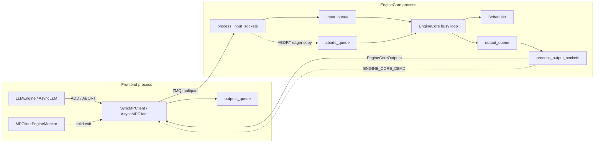
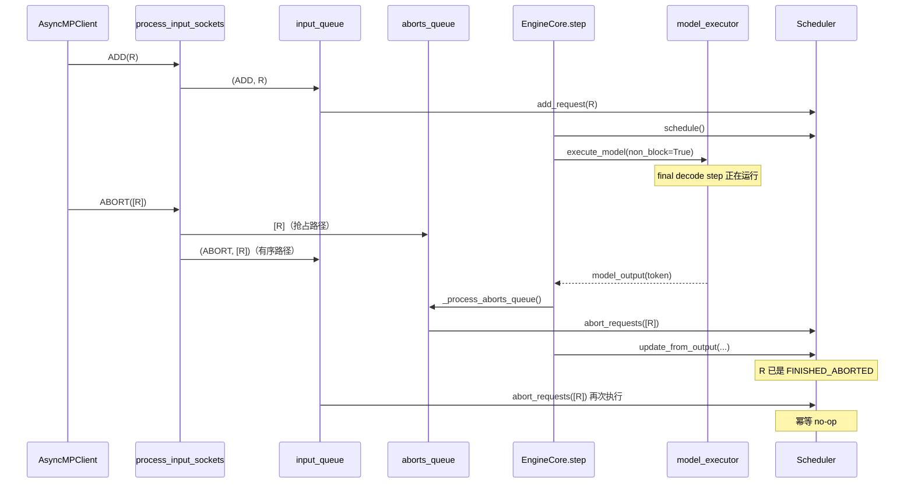

> 本文基于 `vllm-project/vllm` 默认分支提交 [`bd653607`](https://github.com/vllm-project/vllm/commit/bd6536071cec4dcd8cf91c0e2aa04aec83fc1c37)（2026-08-10，北京时间）。相对上一章的 `51562de5`，`core.py`、`core_client.py`、`test_abort_final_step.py` 和 `test_serial_utils.py` 未变化；`network_utils.py` 的新增内容与 ROCm/AITER rendezvous 有关，本文分析的 `make_zmq_socket()` 未漂移。本文没有执行 GPU 压测；“代码事实”“仓库测试事实”和“容量推断”会分开陈述。

## 1. 本篇在课程路线中的位置

今天前两章先把一条请求送到了 EngineCore 边界：第一章完成 `LLM.generate → Renderer → InputProcessor → EngineCoreRequest` 的语义冻结，第二章完成 `SyncMPClient → msgpack/ZMQ → EngineCoreProc.input_queue` 的跨进程追踪。第三章不急着进入 Scheduler，而是先审计这个协议边界最容易在生产中出问题的三件事：

1. `ADD` 与 `ABORT` 并发到达时，为什么 `ABORT` 要写入两个队列？
2. 输出端复用 `bytearray` 是否会污染仍在发送的消息，慢消费者又会把压力积在哪里？
3. EngineCore 崩溃后，前端如何从“仍在等输出”转为确定的 `EngineDeadError`？

这三个问题共同回答一个维护判断：跨进程协议不仅要能 encode/decode，还必须定义顺序、所有权、流控和失败语义。

## 2. 前置知识：两条线程和两个身份

Frontend process 中的 `SyncMPClient`/`AsyncMPClient` 负责发送请求、接收 `EngineCoreOutputs`；EngineCore process 中，input IO thread 解码网络帧并写 `input_queue`，busy loop 才真正修改 Scheduler。输出方向相反：busy loop 写 `output_queue`，output IO thread 序列化并发送。

`request_id` 是调度对象身份，`client_index` 是输出路由身份。取消操作只携带 `request_id` 列表；普通输出则以 `(client_index, EngineCoreOutputs)` 在 EngineCore 内部流转。这也是为什么顺序错误可能造成“请求泄漏”，输出错误则可能投递给错误客户端。

## 3. 全局位置：控制流、数据流与故障流

这里有三层队列，而且当前都没有应用层容量上限：EngineCore 的 `input_queue/output_queue`、Frontend 的 `outputs_queue`。ZMQ 又把相关 socket 的 high-water mark 设为 0。它偏向吞吐和低抖动，但不会把过载自动变成清晰的拒绝信号。

## 4. 完整调用链：最终一步执行期间发生 ABORT

以一个 `max_tokens=1` 的请求 `R` 为例。它已经进入 Scheduler，当前 GPU step 会采出唯一也是最后一个 token：

关键代码在 [`process_input_sockets`](https://github.com/vllm-project/vllm/blob/bd6536071cec4dcd8cf91c0e2aa04aec83fc1c37/vllm/v1/engine/core.py#L1705-L1735)：收到 `ABORT` 后先写 `aborts_queue`，随后所有消息都写 `input_queue`。随后 [`EngineCore.step`](https://github.com/vllm-project/vllm/blob/bd6536071cec4dcd8cf91c0e2aa04aec83fc1c37/vllm/v1/engine/core.py#L581-L611) 在 `future.result()` 之后、`scheduler.update_from_output()` 之前调用 `_process_aborts_queue()`；batch queue 版本也保持相同顺序。

这不是重复工作造成的偶然实现，而是同时满足两个互相拉扯的约束。

### 4.1 只使用 input_queue 为什么不够？

它能完整保留同一 ZMQ input thread 观察到的 `ADD → ABORT` 顺序，却可能让取消一直等到一次长 prefill/decode 返回后，甚至先让 `update_from_output()` 把最终 step 标记为正常结束。对于普通流式输出，前端往往已经不再消费它；但 KV connector 会看到 `FINISHED_LENGTH_CAPPED`，而不是 `FINISHED_ABORTED`，远端 KV block 可能继续 pin 到超时。

### 4.2 只使用 aborts_queue 为什么不够？

如果 busy loop 先从抢占队列处理 `ABORT(R)`，而有序的 `ADD(R)` 尚未进入 Scheduler，abort 会成为 no-op；之后再处理 ADD，R 就泄漏成无人接收的活请求。因此必须保留 input queue 中的 ABORT 副本。

### 4.3 当前方案依赖的隐藏 contract

双写成立的必要条件是 `Scheduler.abort_requests()` 对不存在或已结束请求幂等。EngineCore 空闲等待且 `input_queue` 暂时为空时，[`_process_input_queue`](https://github.com/vllm-project/vllm/blob/bd6536071cec4dcd8cf91c0e2aa04aec83fc1c37/vllm/v1/engine/core.py#L1395-L1428) 会直接清空 `aborts_queue`，因为这些取消仍会按序从 `input_queue` 处理；有计算在途时，抢占副本才在模型返回后立即生效。

因此 maintainer 修改 abort 实现时必须保持：

- `ABORT` 同时进入 eager queue 和 ordered queue；
- eager abort 必须先于 `update_from_output`；
- 重复 abort 必须幂等；
- 清空 eager queue 只能发生在不存在 EngineCore work、且 ordered copy 仍在 input queue 的条件下。

## 5. 关键状态生命周期：从请求状态到 KV finish status

`ABORT([R])` 在前端是一个 msgpack list；input IO thread 解码后，两个 Python queue 分别持有对该 list 的引用。`_process_aborts_queue()` 将当前积累的多个 list/string 摊平为一个 `request_ids`，批量调用 `abort_requests`。Scheduler 是请求状态的 owner：它把 R 标记结束、形成 abort 类型的 finished request，并触发相应 KV connector 清理元数据。之后 `update_from_output()` 再看到同一个 Scheduler step 的模型结果时，不能把 R 从 aborted 覆盖回正常 stop。

仓库中的 [`test_abort_during_final_step`](https://github.com/vllm-project/vllm/blob/bd6536071cec4dcd8cf91c0e2aa04aec83fc1c37/tests/v1/engine/test_abort_final_step.py#L146-L327) 专门固定了这个生命周期。测试 monkey-patch `Worker.execute_model`，让目标请求的最终 step 阻塞；在阻塞窗口发送 abort，再释放模型执行。断言包含三层：最终前端输出 `finish_reason == "abort"`、KV connector 捕获 `FINISHED_ABORTED`、`output_processor` 不再有 unfinished request。该测试同时覆盖 `async_scheduling=False/True`。

这是仓库测试事实，不是本文复现实验。历史原因由已合入的 [PR #29987](https://github.com/vllm-project/vllm/pull/29987) 记录：disaggregated prefill 中，错误的正常完成状态会使 KV blocks 保持 pinned，直到 fallback timeout。

## 6. 输出 Buffer：何时可以安全复用？

[`process_output_sockets`](https://github.com/vllm-project/vllm/blob/bd6536071cec4dcd8cf91c0e2aa04aec83fc1c37/vllm/v1/engine/core.py#L1737-L1819) 维护两组对象：

- `reuse_buffers: list[bytearray]`：ZMQ 已完成发送，可以交给下一次 `MsgpackEncoder.encode_into()`；
- `pending: deque[(MessageTracker, bytearray)]`：首帧还可能被 ZMQ 引用，绝不能改写。

每次发送前先回收 `tracker.done` 的 pending buffer；没有可复用对象时才新建 `bytearray`。[`_send_msg_tracking_payload`](https://github.com/vllm-project/vllm/blob/bd6536071cec4dcd8cf91c0e2aa04aec83fc1c37/vllm/v1/engine/core.py#L1807-L1823) 没直接调用 `send_multipart(track=True)`，而是单独跟踪第一帧：第一帧正是会被复用的 msgpack payload；其余 tensor/ndarray auxiliary frame 由 ZMQ 自身持有 Python backing object 的引用。

这里必须保持的不变量是：

> 只有代表 payload 首帧的 `MessageTracker.done == True`，对应 `bytearray` 才能重新交给 encoder。

`max_reuse_bufs = len(sockets) + 1` 只限制“空闲复用池”，避免在稳定状态永久保留过多大 buffer；它**不限制** `pending`。如果接收端很慢，每次发送的 tracker 都未完成，output thread 会持续分配新 buffer，并把旧 buffer 留在 pending。

仓库测试 [`test_payload_buffer_reuse_does_not_corrupt_in_flight_messages`](https://github.com/vllm-project/vllm/blob/bd6536071cec4dcd8cf91c0e2aa04aec83fc1c37/tests/v1/test_serial_utils.py#L455-L512) 构造 100 个大于 `zmq.COPY_THRESHOLD` 的 logprobs payload，并混入 zero-copy tensor frames，逐条接收后验证 request ID、tensor shape 和 token IDs。它证明“tracker 门控复用不会串包”，但不证明慢消费者下内存有上界。

## 7. 背压 contract：HWM=0 不等于无限容量

[`make_zmq_socket`](https://github.com/vllm-project/vllm/blob/bd6536071cec4dcd8cf91c0e2aa04aec83fc1c37/vllm/utils/network_utils.py#L297-L357) 对 `PULL/DEALER/ROUTER` 设置 `RCVHWM=0`，对 `PUSH/DEALER/ROUTER` 设置 `SNDHWM=0`。在 ZMQ 中 0 表示不以“消息数 high-water mark”触发限流，而不是消息不占内存。大内存机器还会把 OS `RCVBUF/SNDBUF` 目标设为 0.5 GiB；小机器使用系统默认。

与此同时，EngineCore `input_queue/output_queue`、Sync frontend `queue.Queue` 和 Async frontend `asyncio.Queue` 都是无界队列。因此当前协议的过载形态更接近“吸收 backlog，最终表现为内存上涨或尾延迟恶化”，而不是“生产者尽快收到 capacity error”。

举一个只用于容量直觉的推算：若慢客户端令 1000 条平均 64 KiB 的 payload 同时处于 pending，单 msgpack payload backing buffer 约占 62.5 MiB，尚未计 auxiliary frame、Python/ZMQ 对象、上下游 queue 与 allocator fragmentation。这不是实测值，也不能直接当成 RSS 增量；它说明 `max_reuse_bufs` 不是流控上限。

替代设计是 bounded application queue 或 credit-based flow control。bounded queue 实现简单，却可能让 output thread 阻塞，间接拖住 EngineCore 的统计/故障消息；credit 协议可以按客户端隔离额度，但要新增 ack、超时、断连回收与跨 Python/Rust 协议版本。当前实现选择低复杂度和吞吐优先，维护者应把“慢/失联 consumer 的内存增长”视为已知架构债，而不是 buffer reuse bug。

## 8. EngineCore death：in-band sentinel 与 out-of-band monitor

正常捕获到 EngineCore 致命异常时，[`_send_engine_dead`](https://github.com/vllm-project/vllm/blob/bd6536071cec4dcd8cf91c0e2aa04aec83fc1c37/vllm/v1/engine/core.py#L1599-L1614) 把单帧 `b"ENGINE_CORE_DEAD"` 放入 output queue，并等待 output thread 最多 5 秒。输出 PUSH socket 配置 `linger=4000`，尽量在 socket 关闭前发送该 sentinel。前端 [`BackgroundResources.validate_alive`](https://github.com/vllm-project/vllm/blob/bd6536071cec4dcd8cf91c0e2aa04aec83fc1c37/vllm/v1/engine/core_client.py#L490-L494) 在 decode 之前识别单帧，置 `engine_dead=True` 并抛 `EngineDeadError`；Sync/Async output loop 再把异常放入各自 `outputs_queue`，最终由 `get_output()`/`get_output_async()` 在调用链上抛出。

但进程被 `SIGKILL` 时无法发送 sentinel，所以 [`start_engine_core_monitor`](https://github.com/vllm-project/vllm/blob/bd6536071cec4dcd8cf91c0e2aa04aec83fc1c37/vllm/v1/engine/core_client.py#L711-L739) 另起 daemon thread 等待 engine manager 的 liveness 结果。发现非预期退出后，它设置相同的 `engine_dead` latch 并启动清理。此后任何 `_send_input` 都先经过 `ensure_alive()`，不会继续向死进程堆消息。

所以故障 contract 是“尽最大努力的 in-band 通知 + 本地进程场景的 out-of-band 监控”，不是 exactly-once death delivery。sentinel 还面临 5 秒 join/4 秒 linger 的时序边界；外部/远端 EngineCore 的故障探测能力则取决于对应 manager，而不能从本地 monitor 自动类推。

## 9. Python/Rust 协议漂移风险

Python output 是 msgpack 主帧加可选 auxiliary frames；Rust client 在 [`protocol/output.rs`](https://github.com/vllm-project/vllm/blob/bd6536071cec4dcd8cf91c0e2aa04aec83fc1c37/rust/src/engine-core-client/src/protocol/output.rs) 中先反序列化 wire struct，再解析 auxiliary-frame index；请求侧在 [`protocol/request.rs`](https://github.com/vllm-project/vllm/blob/bd6536071cec4dcd8cf91c0e2aa04aec83fc1c37/rust/src/engine-core-client/src/protocol/request.rs) 中提取大 tensor 为有序 frames。Rust 的单元测试覆盖自身 serde 默认值和 frame extraction，但从当前检索到的测试看，没有一组由真实 Python encoder 生成、由 Rust decoder 消费，反向亦然的版本化 golden fixtures；`ENGINE_CORE_DEAD`、ADD/ABORT 顺序和慢 consumer 也未形成跨语言端到端 contract test。

这是基于代码与测试检索的结论，不等同于证明仓库外不存在兼容测试。维护上最危险的变更包括：修改 array-like struct 字段顺序、改变 aux frame 的 one-based index、把 sentinel 混入普通 msgpack envelope、改变 enum byte tag、为 output 增加 Rust 未设默认值的必填字段。

## 10. 性能、并发、正确性和边界条件

- **延迟**：eager abort 仍要等当前 `execute_model` future 返回，不会抢占 GPU kernel；它缩短的是“模型返回到状态提交”的竞态窗口。
- **吞吐**：批量摊平 abort IDs，避免逐请求进入 Scheduler；payload `bytearray` 复用降低 allocator 压力。
- **并发**：ZMQ socket 由各自 IO thread/task 独占；Scheduler 状态只由 EngineCore busy loop 修改。两个 Python queue 是跨线程交接点。
- **正确性**：abort-before-update 是状态优先级；MessageTracker-before-reuse 是 buffer 所有权；`engine_dead` 是单向 latch。
- **内存**：无界 Python queue、HWM=0 和无界 pending tracker 共同决定慢消费者风险。单独给 reuse pool 加 cap 不能解决它。
- **关停**：`ENGINE_CORE_DEAD` 是异常通知；正常 shutdown、drain/abort shutdown 与进程硬死不能混为一种协议状态。

## 11. 测试证据与最小 CI 保护

当前最强的两条直接证据分别是 final-step abort 集成测试和 zero-copy payload 复用测试。仍有四个明显缺口：

1. 没有精确固定 `ADD(R) → ABORT(R)` 在双队列交错下既不泄漏又只终结一次的纯 CPU 并发测试；
2. 没有慢/不读 output socket 时对 pending bytes、queue depth 或拒绝策略的容量测试；
3. 启动阶段有 `SIGKILL` 失败测试，但缺少服务运行期间杀死 EngineCore、断言在途 `get_output` 和后续 `add_request` 都确定变成 `EngineDeadError` 的端到端测试；
4. 缺少 Python↔Rust 的版本化 wire fixture，覆盖 ADD、ABORT、logprobs aux frames、utility output 和 death sentinel。

最小 CI guard 可以先不引入 GPU：用 fake Scheduler 驱动双队列交错；用 inproc PUSH/PULL 故意暂停 receiver，验证 buffer 未被提前复用并记录 pending 高水位；用 Python 生成固定 msgpack/aux frame fixture，再在 Rust 测试中 decode。容量策略尚未定义前，不应编造一个“正确 RSS 上限”断言。

## 12. 修改该区域时的影响面检查表

- 是否同时审计 Sync、Async、DP/coordinator 和 Rust client？
- 是否保持 `EngineCoreRequestType` byte tag、msgspec 字段顺序与 aux frame index？
- 是否仍保证 abort 在 `update_from_output` 前生效，并保持 Scheduler abort 幂等？
- 是否把“复用池上限”误当成“发送中内存上限”？
- bounded queue 满时，谁可以阻塞，谁必须得到显式 overload error？
- EngineCore 硬死、output thread 死、frontend task cancel 是否都能唤醒在途 waiter？
- `linger/join` 调整是否会丢 death sentinel 或延长进程退出？
- 新字段是否同时更新 Python serializer、Rust serde model、golden fixtures 和兼容说明？

## 13. 今日三章拼图与结论

今天已经把一条 offline 请求从用户 prompt 追到 EngineCore 内部队列，并补齐协议的四个维护契约：

1. InputProcessor 冻结语义，但不做物理 batch；
2. msgpack 主帧承载控制面，大 tensor 可走 auxiliary frame/可选 `torch_shm`；
3. 双队列用“eager + ordered”解决最终 step 取消竞态，其正确性依赖幂等；
4. MessageTracker 管 buffer 所有权，death sentinel/monitor 管故障传播，但当前没有有界应用层背压。

最高风险不是序列化速度，而是三处隐式 contract：双队列不可被“简化”为单队列；`pending` 不受 `max_reuse_bufs` 限制；Python/Rust wire schema 仍缺强制的双向 golden gate。

### 理解检查

1. 为什么只把 ABORT 放进 eager queue 会在 `ABORT` 先于 `ADD` 被 busy loop 看见时泄漏请求？
2. 为什么跟踪 multipart 最后一帧，不能证明 msgpack 首帧的 `bytearray` 已可安全复用？
3. `SNDHWM=0` 与无界 `output_queue` 同时存在时，慢客户端造成的压力会依次停留在哪些层？

### 下一章

明天进入新的主线：`EngineCore.add_request → Request.from_engine_core_request → Scheduler.add_request`。重点回答 `EngineCoreRequest` 哪些字段进入 Scheduler-owned `Request`、waiting 状态何时建立、KV/structured-output/LoRA 等附属状态由谁拥有，以及 admission 失败如何回滚。

