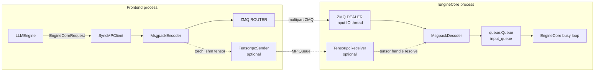

> 本文基于 `vllm-project/vllm` 默认分支提交 [`51562de5`](https://github.com/vllm-project/vllm/commit/51562de5ab16bacd821d7130187b6bebdd293f93)（2026-08-10 18:04，北京时间）。上午第一章基于 `751f2ccd`；两者之间本文涉及的 `core_client.py/core.py/serial_utils.py/tensor_ipc.py` 没有代码差异。本文没有运行 GPU 实验；当前环境缺少 `pytest`，因此下文会严格区分代码事实、仓库测试事实和已合入 PR 中报告的实验结果。

## 1. 本篇在课程路线中的位置

上一章停在 `LLMEngine.add_request()`：Renderer 和 InputProcessor 已把 raw prompt 冻结为 `EngineCoreRequest`，并确认“前端不形成 GPU batch，也不分配 KV block”。本章继续追踪同一个对象，但只走到 EngineCore 的内部 `input_queue`：

> `SyncMPClient.add_request → MsgpackEncoder → ZMQ ROUTER/DEALER → EngineCoreProc.process_input_sockets → Request.from_engine_core_request → input_queue`

下一章再分析跨进程协议的性能、失败/abort 顺序、Rust client 兼容和升级风险；`Scheduler.add_request` 留到明天的新主线。本章的边界很重要：网络帧已经结束，但请求尚未进入调度决策。

## 2. 核心问题：vLLM 到底有没有使用共享内存 IPC？

答案不是简单的“有”或“没有”，而是当前实现有三条 tensor 编码路径：

| 路径 | 触发条件 | wire 内容 | 是否共享内存 |
| --- | --- | --- | --- |
| inline msgpack | CPU tensor `< VLLM_MSGPACK_ZERO_COPY_THRESHOLD`，默认 256 B | tensor bytes 放在主 payload | 否；接收端 clone 成 PyTorch-owned memory |
| ZMQ auxiliary frame | 默认 `mm_tensor_ipc=direct_rpc` 下的大 tensor；或共享内存发送失败后的 fallback | 主 payload 保存 frame index，tensor bytes 是独立 multipart frame | `send_multipart(copy=False)` 避免 Python/msgpack 侧再拼大 buffer，但不是跨进程端到端零拷贝 |
| `torch_shm` OOB | 多模态配置显式选择 `mm_tensor_ipc=torch_shm` | 主 payload 保存 `{sender_id,message_id,tensor_id}`，tensor 走 `torch.multiprocessing.Queue` | 是；CPU shared storage 或 CUDA IPC handle |

因此“vLLM 的 Serving→EngineCore 完全不使用共享内存”已经不符合当前 `main`；但“普通文本请求默认走共享内存”同样不对。文本请求主体很小，默认只需一个 msgpack payload；共享内存路径主要为大 multimodal tensor 服务。

## 3. 组件位置和线程/进程边界



[`EngineCoreClient.make_client`](https://github.com/vllm-project/vllm/blob/51562de5ab16bacd821d7130187b6bebdd293f93/vllm/v1/engine/core_client.py#L89-L139) 选择三种 owner 模型：`InprocClient` 直接调用 `EngineCore`；offline `LLM` 的 multiprocess 路径使用 `SyncMPClient`；在线 `AsyncLLM` 使用 `AsyncMPClient` 或其 DP 派生类。只有后两者经过本章 wire protocol。

`MPClient` 在前端创建 ZMQ `ROUTER`，EngineCore 的输入 IO thread 创建带两字节 rank identity 的 `DEALER`。EngineCore 必须先发送 `EngineCoreReadyResponse`，ROUTER 才知道向哪个 identity 路由。这个 ready payload 还把实际 `block_size/max_model_len/num_gpu_blocks` 等初始化结果同步回前端，所以它不只是“进程已启动”的布尔握手。

## 4. 完整调用链：一条 ADD 消息如何落入 input_queue

### 4.1 前端发送

[`SyncMPClient.add_request`](https://github.com/vllm-project/vllm/blob/51562de5ab16bacd821d7130187b6bebdd293f93/vllm/v1/engine/core_client.py#L887-L914) 调用 `_send_input(EngineCoreRequestType.ADD, request)`。`ADD` 的稳定 wire tag 是单字节 `b"\x00"`，定义在 [`EngineCoreRequestType`](https://github.com/vllm-project/vllm/blob/51562de5ab16bacd821d7130187b6bebdd293f93/vllm/v1/engine/__init__.py#L263-L276)。前端实际发送：

```text
[engine_identity][0x00][msgpack payload][optional aux frame 0]...
```

`engine_identity` 只供 ROUTER 选路；DEALER 收到后看到的是 `[0x00][payload][aux...]`。`send_multipart(copy=False)` 让 pyzmq 持有 `memoryview → tensor storage` 的引用直到发送完成，因此 `_send_input` 返回后调用方无需手工保活 tensor。这是 Python 进程内的 buffer ownership 保证，不意味着 IPC transport 不发生任何内存复制。

### 4.2 MsgpackEncoder：控制面与数据面拆开

[`MsgpackEncoder.encode`](https://github.com/vllm-project/vllm/blob/51562de5ab16bacd821d7130187b6bebdd293f93/vllm/v1/serial_utils.py#L136-L189) 先建立 `bufs=[main_payload]`。当 enc hook 遇到 tensor 时，[`_encode_tensor`](https://github.com/vllm-project/vllm/blob/51562de5ab16bacd821d7130187b6bebdd293f93/vllm/v1/serial_utils.py#L257-L273) 按顺序选择：

```text
small CPU tensor (<256B) → inline RAW_VIEW
else if OOB consumer accepts → metadata handle dict
else → aux_buffers.append(tensor_data(tensor)); payload 写 frame index
```

边界是严格 `< 256`，恰好 256 B 已进入 auxiliary/OOB 路径。默认 direct RPC 下，[`tensor_data`](https://github.com/vllm-project/vllm/blob/51562de5ab16bacd821d7130187b6bebdd293f93/vllm/v1/utils.py#L777-L787) 执行 `tensor.flatten().cpu().contiguous()`；因此 CUDA tensor 会先做 GPU→CPU copy。所谓 ZMQ zero-copy 只消除了“再把这块 CPU bytes 拼进大型 msgpack”的额外复制。

### 4.3 EngineCore 输入线程接收和预处理

[`EngineCoreProc.process_input_sockets`](https://github.com/vllm-project/vllm/blob/51562de5ab16bacd821d7130187b6bebdd293f93/vllm/v1/engine/core.py#L1639-L1735) 在专用 IO thread 中 poll DEALER/协调器 socket，`recv_multipart(copy=False)` 后先解析 type frame。ADD 使用强类型 `MsgpackDecoder(EngineCoreRequest)`，其他 utility/abort 使用 generic decoder。

解码完成后，输入线程立即调用 [`preprocess_add_request`](https://github.com/vllm-project/vllm/blob/51562de5ab16bacd821d7130187b6bebdd293f93/vllm/v1/engine/core.py#L965-L987)：更新 multimodal receiver cache、通过 [`Request.from_engine_core_request`](https://github.com/vllm-project/vllm/blob/51562de5ab16bacd821d7130187b6bebdd293f93/vllm/v1/request.py#L224-L250) 构造真正的 Scheduler `Request`、异步初始化 structured-output grammar，最后返回 `(Request,current_wave)`。这一步放在 IO thread，是为了让 request initialization 与模型 forward 并行。

随后 `(ADD,(Request,wave))` 被放入线程安全的 `input_queue`。EngineCore busy loop 在 [`_process_input_queue`](https://github.com/vllm-project/vllm/blob/51562de5ab16bacd821d7130187b6bebdd293f93/vllm/v1/engine/core.py#L1398-L1427) 消费并调用 `_handle_client_request`。至此 wire object 的使命结束；Scheduler admission 是下一阶段。

## 5. 关键对象生命周期：32 MiB prompt_embeds

取一个 `prompt_embeds`：shape `[4096,4096]`、BF16、32 MiB。其他请求字段很小。

### 5.1 默认 `direct_rpc`

1. `EngineCoreRequest` 在前端持有原 tensor。
2. Encoder 主 payload 只记录 `(dtype="bfloat16", shape=(4096,4096), data=1)`；32 MiB memoryview 成为第 1 个 auxiliary frame。
3. 若输入在 GPU，`tensor_data()` 先生成 CPU contiguous storage；若已是 contiguous CPU tensor，通常可共享其 backing storage。
4. pyzmq 保持 memoryview 引用直到发送完成。
5. 接收端 [`MsgpackDecoder._decode_tensor`](https://github.com/vllm-project/vllm/blob/51562de5ab16bacd821d7130187b6bebdd293f93/vllm/v1/serial_utils.py#L389-L425) 对 aux frame 使用 `torch.frombuffer`，默认 `share_mem=True` 时不 clone；`Request.prompt_embeds` 因而间接保活接收 frame。
6. `Request` 结束并释放最后引用后，这块接收 buffer 才可回收。

### 5.2 `torch_shm`

[`TensorIpcSender`](https://github.com/vllm-project/vllm/blob/51562de5ab16bacd821d7130187b6bebdd293f93/vllm/v1/engine/tensor_ipc.py#L45-L105) 为每条消息递增 `message_id`，tensor 从 0 编号；必要时调用 `share_memory_()`，把 `TensorIpcData(sender_id,message_id,tensor_id,tensor)` 放进 MP queue。msgpack payload 不含 32 MiB bytes，只含 handle dict。

EngineCore 的 [`TensorIpcReceiver`](https://github.com/vllm-project/vllm/blob/51562de5ab16bacd821d7130187b6bebdd293f93/vllm/v1/engine/tensor_ipc.py#L114-L178) 按三元 handle 查找；由于多个 sender 的 queue item 可能交错，它采用 drain-and-buffer：遇到的非目标 tensor 先缓存在 `_tensor_buffers[sender].tensors[message][tensor]`。目标被 pop 后直接进入解码对象，再由 `Request` 持有。

```mermaid
sequenceDiagram
    participant FE as Frontend / SyncMPClient
    participant MQ as Tensor MP Queue
    participant Z as ZMQ ROUTER→DEALER
    participant IO as EngineCore input thread
    participant EQ as input_queue

    FE->>FE: encoder.new_message(); tensor_id=0
    FE->>MQ: TensorIpcData(shared tensor)
    FE->>Z: [ADD][payload with handle]
    Z->>IO: recv_multipart(copy=False)
    IO->>MQ: resolve(sender,message,tensor)
    MQ-->>IO: torch.Tensor
    IO->>IO: EngineCoreRequest → Request
    IO->>EQ: (ADD, (Request, wave))
```

这条路径有明确前置条件：必须使用 `spawn`；当前配置拒绝 `DP>1/TP>1/PP>1`，因为只有一条面向 rank 0 的 queue，前端无法在内部负载均衡前确定目标 EngineCore，也没有实现 TP ranks 间广播。发送 queue 超时或共享失败时，encoder 会 warning 并回退到 auxiliary frame，保证正确性但可能静默失去性能。

## 6. 同步、异步与并发契约

- `MsgpackEncoder` 文档明确声明 tensor/ndarray 编码通常不线程安全，因为 `aux_buffers` 是实例临时状态。`SyncMPClient` 假设调用方不并发跨线程调用同一个 client。
- `AsyncMPClient._send_input` 在第一次 `await` 之前同步完成 encode；同一 event loop 上 coroutine 不会在这段代码中切换，因此共享 encoder 可用。但从其他线程直接调用内部方法仍不在 contract 内。
- EngineCore 的 socket IO thread既负责 decode，也做 `Request` 构造和 grammar init。优点是与 GPU forward 重叠；风险是某个昂贵/阻塞的 decode 或 OOB queue `get(timeout=10)` 会产生入站 head-of-line blocking。
- ZMQ 保证同一连接的消息顺序，EngineCore 又用单 input queue 将 wire 顺序交给 busy loop。多 API server/多 engine 时，只有各连接内顺序天然成立，跨 producer 的全序由接收和 queue 到达次序决定。

## 7. 为什么不是“所有请求统一上共享内存”

普通文本 `EngineCoreRequest` 主要是 token ID、params 和少量 metadata。为它建立共享内存 allocator、引用计数和 crash cleanup，固定成本可能高于直接 msgpack。当前 hybrid 设计让小控制消息保持简单，让大 tensor 选择 aux frame，并为本机重多模态数据提供显式 `torch_shm` 快路。

替代设计一是所有 payload 放共享 ring buffer，只用 ZMQ 传 offset。它能减少本机大消息复制，但要解决 backpressure、wrap-around、进程异常后的 slot 回收、多 producer 隔离和远程 TCP fallback。替代设计二是 protobuf/gRPC；schema 更显式，却仍需自定义 tensor side channel 才能避免大 bytes copy，而且会扩大 Python/Rust 双实现的维护面。当前 msgspec array-like struct + multipart frames 更贴近数据形态，但协议演进必须有跨语言测试保护。

## 8. 测试如何证明这些结论

### 仓库测试事实

1. [`test_serial_utils.py::test_encode_decode`](https://github.com/vllm-project/vllm/blob/51562de5ab16bacd821d7130187b6bebdd293f93/tests/v1/test_serial_utils.py#L45-L98) 混合大小 tensor、非连续 tensor、BF16、numpy 与空 tensor，并断言 1 个主 frame 加 7 个辅助 frame及完整 round-trip。
2. [`test_zero_copy_frames_survive_without_caller_side_references`](https://github.com/vllm-project/vllm/blob/51562de5ab16bacd821d7130187b6bebdd293f93/tests/v1/test_serial_utils.py#L512-L560) 发送后删除 request/buffers、触发 GC 并 churn allocator，证明 ZMQ 持有的 memoryview 引用链足以保护源 storage。
3. [`test_tensor_ipc_queue.py`](https://github.com/vllm-project/vllm/blob/51562de5ab16bacd821d7130187b6bebdd293f93/tests/v1/test_tensor_ipc_queue.py) 覆盖 CPU/CUDA IPC、禁用 fallback、乱序 buffer；`test_concurrent_senders_single_receiver` 使用 4 个 sender × 3 条消息 × 每消息 2 个 tensor，逐个验证 shape/value/归属。
4. [`test_engine_core_client`](https://github.com/vllm-project/vllm/blob/51562de5ab16bacd821d7130187b6bebdd293f93/tests/v1/engine/test_engine_core_client.py#L600-L688) 分别跑 inproc 和 multiprocess client，加入 10 个请求、收满 20 token，并验证交替 abort 和 utility RPC。

### 已合入 PR 的实验事实

- [`PR #32104`](https://github.com/vllm-project/vllm/pull/32104) 引入 multimodal tensor IPC；其 H100/Cosmos 视频 serving benchmark 报告开启前后整体吞吐基本落在噪声内。因此“少复制”不能自动推出“端到端更快”，调度、预处理和模型执行仍可能主导。
- [`PR #49341`](https://github.com/vllm-project/vllm/pull/49341) 让 Rust frontend 也产生兼容的 auxiliary frames；PR 中独立 encoding benchmark 报告 32 MiB 单 tensor 从 32.3 ms 降到 11.1 ms、峰值 RSS 从 96.6 MiB 降到 64.6 MiB。这是 PR 作者环境的 microbenchmark，不是本文复现结果。

本次环境没有 `pytest`，上述测试未在本章重跑。最小 CI 缺口是：Python `EngineCoreRequest` 与 Rust client 的同一 fixture 做双向 byte/frame compatibility；`torch_shm` queue 已成功而 ZMQ payload 发送失败时的 orphan cleanup；threshold 恰好 255/256/257 B；以及 EngineCore input thread 在 OOB timeout 下的错误隔离。

## 9. 性能、正确性和维护影响面

- **性能**：文本请求主要花在主 payload encode/decode；大 CPU tensor 可避免 msgpack 大 buffer copy；大 GPU tensor 只有 `torch_shm` 才避免默认 `tensor_data().cpu()`。
- **内存**：aux tensor 与整个 received multipart message 的生命周期耦合。Request 长期持有其中一个 view，可能让同消息其他 frame 也更晚释放；需要按实际 `zmq.Frame` ownership 做内存 profile。
- **正确性**：`EngineCoreRequest` 是 `array_like=True`；字段排序、tensor tuple `(dtype,shape,data)`、256 B threshold、request type byte 都是 wire ABI。Python 内“仅重排字段”的重构也可能破坏 Rust client。
- **安全**：默认不接受未知对象；只有显式 `VLLM_ALLOW_INSECURE_SERIALIZATION=1` 才 fallback pickle/cloudpickle。生产环境不能为方便 utility RPC 随意开启。
- **可用性**：`torch_shm` 的 10 秒 queue timeout 会回退发送端，但接收端 handle resolution timeout是 request preprocessing failure；两者应在 metrics 中可观察，否则只看到 TTFT 尖峰。

修改本区域时至少检查：sync/async client 对称性、ROUTER identity、request type byte、msgspec字段顺序、threshold 边界、memoryview 保活、CPU/GPU tensor fallback、spawn 与并行限制、multi-sender buffering、preprocessing error response、Rust auxiliary-frame compatibility。

## 10. 本篇结论、知识债与下一章

本章补齐了三个不变量：

1. `SyncMPClient` 的 ADD 是 `[identity][type][payload][aux...]`；EngineCore input thread在进入 busy loop 前完成强类型 decode 和 `Request` 构造。
2. 默认 ZMQ auxiliary frame 是 Python/msgpack 侧 zero-copy，不等于跨进程共享内存；`torch_shm` 才是显式 tensor IPC，而且当前仅支持单 EngineCore/rank 0 场景。
3. tensor ownership 从 frontend request，经 memoryview/ZMQ frame 或 MP queue，转交到 decoded `Request`；任何性能优化都不能破坏这条保活链。

仍欠缺：ADD/ABORT 竞争和双队列设计、input/output backpressure、高水位与故障语义、Rust/Python wire 兼容 guard、DP client 选择 identity，以及输出方向的 reusable payload buffer。

理解检查：

1. 为什么 `send_multipart(copy=False)` 不能直接称为“跨进程端到端 zero-copy”？
2. 32 MiB CUDA `prompt_embeds` 在 `direct_rpc` 与 `torch_shm` 下分别经过哪些 storage？
3. 为什么 `preprocess_add_request` 放在 socket IO thread，而不是 busy loop；它可能带来什么 head-of-line 风险？

下一章将收束同一天主线：分析 ADD/ABORT 顺序、ZMQ multipart 与 output buffer reuse、backpressure、EngineCore death、Python/Rust compatibility tests，并给出跨进程协议的 maintainer 检查表。
