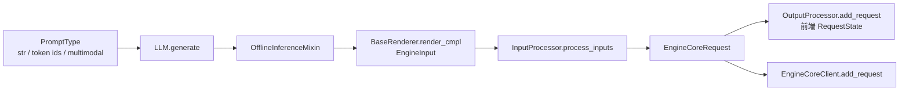
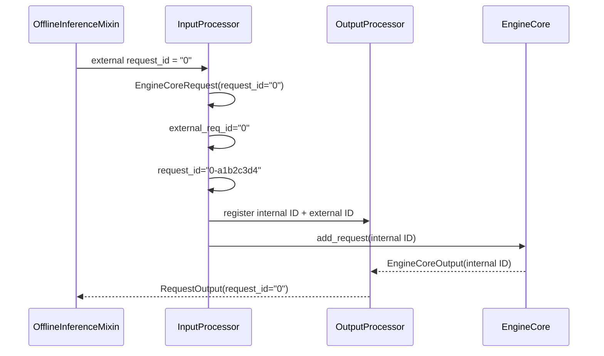

> 本文基于 `vllm-project/vllm` 默认分支提交 [`751f2ccd`](https://github.com/vllm-project/vllm/commit/751f2ccdd3b7ed2ba65dcb04dbd93187edc25b2d)（2026-08-10 获取）。已有博客文章分析过 v0.22.1 的 [EngineCore 基类]({{ '/articles/vllm-enginecore-source-walkthrough/' | relative_url }})和[进程派生类]({{ '/articles/vllm-enginecore-subclasses-source-walkthrough/' | relative_url }})；本课程从上游入口重新建立当前 `main` 的调用链。本文未运行 GPU 实验，“代码事实”“测试事实”和“尚未合入的 PR 计划”会分别标注。

## 1. 本篇在课程路线中的位置

长期路线从 API、Processor 一直下沉到 Scheduler、KV Cache、Worker、Attention 与图模式。第一章只回答一个问题：

> 用户传给 `LLM.generate()` 的字符串，在哪一刻不再是“前端输入”，而成为 EngineCore 可以接收的协议对象？

答案不是一次转换，而是两层边界：`Renderer` 负责把用户表达转换成模型可消费的 `EngineInput`；`InputProcessor` 负责校验运行约束并冻结为 `EngineCoreRequest`。前者拥有 tokenization/chat/multimodal 语义，后者拥有 EngineCore 入站契约。

## 2. 组件在全局架构中的位置



这里有一个容易混淆的 owner 边界：`LLMEngine` 是协调者，不负责 tokenization，也不拥有调度算法。它让同一个 `EngineCoreRequest` 同时进入 `OutputProcessor` 和 `EngineCoreClient`：前者保存 detokenization/返回结果所需的前端状态，后者把计算请求送往 EngineCore。

## 3. 完整调用链

以 `llm.generate(["PTO is", "vLLM is"], SamplingParams(max_tokens=3))` 为例，真实链路是：

1. [`LLM.generate()`](https://github.com/vllm-project/vllm/blob/751f2ccdd3b7ed2ba65dcb04dbd93187edc25b2d/vllm/entrypoints/llm.py#L414-L474) 检查 `runner_type == "generate"`，补默认 `SamplingParams`，然后进入 `_run_completion()`。
2. [`_add_completion_requests()`](https://github.com/vllm-project/vllm/blob/751f2ccdd3b7ed2ba65dcb04dbd93187edc25b2d/vllm/entrypoints/offline_utils.py#L290-L329) 把单值/序列形式的 prompt、params、LoRA、priority 归一为等长序列；长度不一致在这里失败。
3. 每个 prompt 经 `_preprocess_cmpl_one()` 调用 [`BaseRenderer.render_cmpl()`](https://github.com/vllm-project/vllm/blob/751f2ccdd3b7ed2ba65dcb04dbd93187edc25b2d/vllm/renderers/base.py#L985-L1008)：`render_prompts → tokenize_prompts → process_for_engine`，产物是带共同 `arrival_time` 的 `EngineInput`。
4. [`_render_and_add_requests()`](https://github.com/vllm-project/vllm/blob/751f2ccdd3b7ed2ba65dcb04dbd93187edc25b2d/vllm/entrypoints/offline_utils.py#L523-L550) 逐个生成外部 ID `"0"`、`"1"`。若第 2 个请求加入失败，已加入的第 1 个会通过 `abort_request(..., internal=True)` 回滚，避免半批次泄漏。
5. [`LLMEngine.add_request()`](https://github.com/vllm-project/vllm/blob/751f2ccdd3b7ed2ba65dcb04dbd93187edc25b2d/vllm/v1/engine/llm_engine.py#L218-L296) 调用 `InputProcessor.process_inputs()`，随后 `assign_request_id()`；再把请求分别登记到 `OutputProcessor` 和 `EngineCoreClient`。
6. `_run_engine()` 循环 `LLMEngine.step()`，只收集 finished output，最后按外部数字 ID 排序。调度完成顺序可以改变，API 返回顺序不能改变。

注意当前迁移方向：`LLMEngine.add_request()` 仍兼容 raw prompt 和直接传 `EngineCoreRequest`，但两条路径都已标记将在 v0.18 移除；推荐边界是先通过 `Renderer.render_cmpl/render_chat` 得到 `EngineInput`。这是当前代码事实，不是本文建议。

## 4. `EngineInput` 到 `EngineCoreRequest`：字段怎样被冻结

[`InputProcessor.process_inputs()`](https://github.com/vllm-project/vllm/blob/751f2ccdd3b7ed2ba65dcb04dbd93187edc25b2d/vllm/v1/engine/input_processor.py#L244-L389) 依次执行：

```text
params/LoRA/DP rank 校验
  → raw prompt 兼容预处理（EngineInput 则跳过）
  → platform.validate_request
  → split_enc_dec_input
  → prompt 长度、词表、multimodal budget 校验
  → clone SamplingParams/PoolingParams
  → 补 max_tokens、generation_config、EOS/tokenizer 字段
  → 整理 MultiModalFeatureSpec
  → 构造 EngineCoreRequest
```

关键点是 `params.clone()`：调用方传入的 `SamplingParams` 不应被本请求的默认值补全过程污染。若 `max_tokens=None`，请求内副本被改为 `max_model_len - prompt_len`；再叠加模型 generation config、EOS 和 tokenizer 规则。因此 Scheduler 看到的是已经冻结的执行参数，不应重新解释前端默认值。

[`EngineCoreRequest`](https://github.com/vllm-project/vllm/blob/751f2ccdd3b7ed2ba65dcb04dbd93187edc25b2d/vllm/v1/engine/__init__.py#L97-L158) 是 `msgspec.Struct(array_like=True, omit_defaults=True, gc=False)`。文本生成的核心字段为：

| 字段 | 语义与生命周期 |
| --- | --- |
| `request_id` | EngineCore 内部唯一 ID；发送前会追加 8 位随机串 |
| `external_req_id` | 用户/前端 ID；用于输出和 external abort |
| `prompt_token_ids` | 普通文本 token 序列；纯 embeds 请求可为 `None` |
| `prompt_embeds` / `prompt_is_token_ids` | 纯 embedding 或 token/embedding 混合输入 |
| `sampling_params` | 已 clone、验证并补全的本请求配置 |
| `mm_features` | 按输入序列位置排序后的 multimodal 特征描述 |
| `arrival_time` / `priority` | 排队与指标语义；不是 GPU timestamp |
| `data_parallel_rank` | 可选的 DP 定向；越界在前端拒绝 |

`array_like=True` 意味着跨语言/跨进程序列化依赖字段顺序；新增或移动字段不是普通 dataclass 重构，而是协议兼容性变更。

## 5. request ID 的完整生命周期



[`assign_request_id()`](https://github.com/vllm-project/vllm/blob/751f2ccdd3b7ed2ba65dcb04dbd93187edc25b2d/vllm/v1/engine/input_processor.py#L225-L242) 先拒绝调用方预填 `external_req_id`，再复制外部 ID，并随机化内部 ID。这解决多个 client 或同一进程重复使用 `"0"` 时的内部冲突。关闭随机化的环境变量仍存在，但代码明确警告会移除，并指出重复 ID 可能造成“subtle correctness errors”。替代方案是由单一全局 ID allocator 发号；它能减少双 ID，但会把多前端协调、故障恢复和可读性成本推到基础设施层。

## 6. 两请求示例：状态与边界演算

假设 tokenizer 得到：

```text
"PTO is"  → [31, 902], prompt_len=2
"vLLM is" → [77, 812, 902], prompt_len=3
max_model_len=16, max_tokens=None
```

Renderer 生成两个 `EngineInput`，共享本轮 render 的 `arrival_time`。InputProcessor 分别 clone 参数，并得到 `max_tokens=14`、`13`。随后外部 ID `0/1` 变为类似 `0-a1b2c3d4`、`1-e5f6a7b8`。这两个对象独立进入 EngineCore；它们并未在入口形成一个固定 tensor batch。真正的 batch 要等 Scheduler 根据 token budget、KV capacity 和运行状态动态形成——这是下一阶段内容。

若 prompt 长度等于 16，生成模型即使 `max_tokens` 未显式设置也会被拒绝，因为至少还需一个输出 token；若长度大于 16，同样在 EngineCore 前失败。这样 Scheduler 不必处理“永远无法分配第一个 decode token”的非法请求。

## 7. 性能、并发与正确性边界

- **离线同步路径是串行 render。** `LLM.__init__` 明确警告：`renderer_num_workers>1` 对离线 `LLM` 无效；因此大量图片的 CPU preprocessing 可在 EngineCore 入队前形成头阻塞。
- **AsyncLLM 不同。** 已合入的 [PR #49608](https://github.com/vllm-project/vllm/pull/49608) 增加 `process_inputs_async`，把直接传 raw prompt 的阻塞 preprocessing 放到 renderer executor；已经 render 的 `EngineInput` 仍走同步快路径。
- **共享 multimodal cache 有并发风险。** [PR #50896](https://github.com/vllm-project/vllm/pull/50896) 提议拒绝 generation model 上 `renderer_num_workers>1 + mm cache` 的组合。本文检查时它尚未合入，所以它只能证明风险和拟议修复，不能当作当前保证。
- **失败回滚只覆盖已加入 ID。** 这是批量入口的一致性保证，但不是事务隔离：请求 0 可能已被 EngineCore 观察到，因此 abort 路径必须始终可用且幂等。
- **输入协议避免携带 GPU KV 状态。** `EngineCoreRequest` 只描述 prompt、参数和路由；KV block 分配属于 Scheduler/KV Cache Manager。把 block table 提前放到前端会让并发调度和抢占无法自治。

## 8. 测试怎样支撑这些结论

[`tests/entrypoints/llm/test_generate.py`](https://github.com/vllm-project/vllm/blob/751f2ccdd3b7ed2ba65dcb04dbd93187edc25b2d/tests/entrypoints/llm/test_generate.py) 提供了入口级证据：

- `test_multiple_sampling_params` 用 4 个 prompt 验证一对一参数映射、长度不一致报错，以及单个参数广播；
- `test_multiple_priority` 验证 `None`、等长 priority、过短和空列表，保护归一化边界；
- `test_max_model_len` 请求超过长度上限的输出，断言最终 `prompt + generated <= max_model_len`。

缺口同样明确：这些 GPU 测试没有直接冻结 `EngineCoreRequest` 的字段顺序、`external_req_id → internal ID` 映射、第二个请求失败时第一个请求的 abort，亦未覆盖 mixed token/embed 与 multimodal 排序。最小新增 guard 应是无模型的 InputProcessor contract tests，加一项 msgspec round-trip；否则协议漂移可能到跨进程或 Rust client 才暴露。

## 9. 设计判断与前后章节连接

把 Renderer 和 InputProcessor 分开，比“一个 Processor 做完所有事”多了一层，但收益是：OpenAI server、offline LLM、AsyncLLM 可以共享模型输入语义，而 EngineCore 只接受已验证的稳定对象。代价是迁移期存在 raw prompt、`EngineInput`、直接 `EngineCoreRequest` 三条入口，deprecation 与线程池行为更难评审。

对 maintainer 而言，本区域修改必须检查：Renderer 的同步/异步对称性、参数是否 clone、ID 映射、msgspec 字段顺序、Rust 协议兼容、失败 abort、multimodal cache 线程安全，以及 offline 返回排序。

## 10. 本篇结论、知识债与理解检查

本章建立了三个不变量：

1. EngineCore 只接收已经 tokenized/validated、参数已冻结的 `EngineCoreRequest`；
2. 外部 ID 用于 API，随机化内部 ID 用于引擎唯一性，两者不能混用；
3. 前端不决定物理 batch 或 KV block，只提交可调度请求。

仍欠缺：`EngineCoreClient` 的 msgpack/OOB tensor 编码、ZMQ request type、EngineCoreProc 解码，以及 `EngineCoreRequest → Request → Scheduler.waiting` 的转换。

理解检查：

1. 为什么 `SamplingParams` 必须 clone 后再补 `max_tokens`？
2. 为什么 `request_id` 随机化后还必须保留 `external_req_id`？
3. 为什么两个 prompt 同时传给 `generate()`，并不等于形成一个固定 GPU batch？

下一章将沿同一主线追踪 `EngineCoreRequest` 的跨进程 wire protocol：`SyncMPClient.add_request → MsgpackEncoder → ZMQ → EngineCoreProc.process_input_sockets`。
