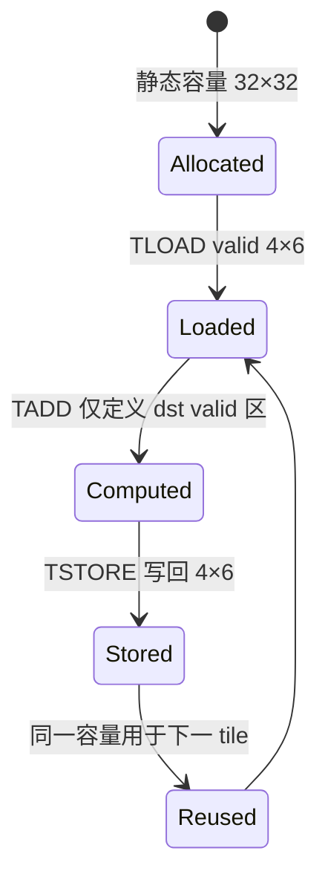

> 本章基于 `pto-isa@67e230d`。事实来源于 Tile 规范、公共类型实现和 ISA 文档；具体物理 SRAM 划分与代际微架构若没有公开代码证据，本文只按“逻辑存储类”描述，不作硬件臆测。

## 1. 本章在课程中的位置

课程 01 从真实 DeepSeek-V4 KV 路径看到了 `TLOAD`，但留下了一个更基础的问题：`TLOAD` 的目标为什么不是普通二维数组，而必须是一个带十余个模板参数的 `pto::Tile`？

核心答案是：

> Tile 同时承担“编译期资源契约”和“运行期有效数据窗口”。它的静态容量用于分配、布局选择和指令特化；valid region 只描述本次真正有意义的连续前缀。

若混淆二者，就会出现两类错误：把动态尾块误当成动态分配；或者以为 valid 区之外会自动清零。

## 2. Tile 在 PTO 全栈中的位置


相关证据：

- [Tile 编程模型](https://github.com/hw-native-sys/pto-isa/blob/67e230d5e92fe351303a8b5b7cc16809e4a0532e/docs/coding/Tile_zh.md)
- [公共 `pto::Tile` 实现](https://github.com/hw-native-sys/pto-isa/blob/67e230d5e92fe351303a8b5b7cc16809e4a0532e/include/pto/common/pto_tile.hpp)
- [ISA 通用约定](https://github.com/hw-native-sys/pto-isa/blob/67e230d5e92fe351303a8b5b7cc16809e4a0532e/docs/isa/conventions_zh.md)

## 3. 一个 Tile 的五个维度

简化后的类型是：

```cpp
Tile<
    Loc, Element, Rows, Cols,
    BLayout,
    RowValid, ColValid,
    SLayout, SFractalSize,
    PadValue
>
```

### 3.1 Location：谁能消费它

`TileType` 不是注释，而会参与重载与编译期校验：

| Location | 程序员视角 | 常见消费者 |
| --- | --- | --- |
| `Vec` | 向量 Tile | `TADD`、reduce、elementwise |
| `Mat` | Matrix L1 类 Tile | 数据暂存、向矩阵操作数转换 |
| `Left/Right` | 矩阵乘左右操作数 | `TMATMUL` |
| `Acc` | 矩阵乘累加结果 | 后处理或 `TSTORE` |
| `Bias/Scaling` | 辅助 Tile | bias、量化/缩放路径 |

因此同样是 `fp16[64,64]`，`Vec` 与 `Left` 不是可以随意互换的对象。shape 相同不代表指令 contract 相同。

### 3.2 Capacity shape：编译期“盒子”

`Rows × Cols` 是静态容量。它影响：

- Tile 需要多少片上容量；
- 编译器能否选定具体实现；
- 对齐和分形布局是否合法；
- 下游指令的静态 type 是否稳定。

例如：

```cpp
using T = Tile<TileType::Vec, half, 128, 256>;
```

容量固定为 32768 个 half，即 64 KiB。是否适合目标硬件还要看具体指令和代际约束；CPU-SIM 能构造成功不等于真机一定可放置。

### 3.3 Valid region：运行期“本次有多少数据”

有效区域是左上角连续矩形：

```text
0 <= row < valid_row
0 <= col < valid_col
```

它不是任意 mask，也不能表示“第 2、5、9 行有效”。后者需要 gather、select 或显式索引语义。

当 `RowValid == DYNAMIC` 时，运行期值存入对象，通过 `GetValidRow()` 读取。关键不变量：

```text
0 < valid_row <= Rows
0 < valid_col <= Cols
```

有效区外通常是 **unspecified**。除非某条指令明确承诺 padding，否则不能假设它是零或保留旧值。

## 4. Layout 为什么不只是转置

PTO 用两层布局：

- `BLayout`：外层 row-major / col-major；
- `SLayout`：是否盒化，以及盒内 row-major / col-major；
- `SFractalSize`：基块字节数，常见 A/B 为 512 B，Acc 为 1024 B。

未盒化 ND 可近似理解为普通二维连续数组；NZ/ZN 则把矩阵切成固定基块，再决定块间与块内次序。公共实现中的 `GetTileOffset(row,col)` 会按 Nz、Zn、Zz 分别计算物理 offset。

以 fp16、512 B 基块为例：

```text
512 B / 2 B = 256 elements = 16 × 16
```

一个 `32×32` fp16 Tile 会形成 4 个 `16×16` 基块。逻辑坐标仍是二维矩阵，但 backing storage 的相邻关系由盒化布局决定。这样做是为了让矩阵引擎偏好的数据格式成为类型的一部分，而不是运行时临时猜测。

## 5. 对齐约束：为什么 `16×15 fp16` 可能非法

对未盒化 row-major Tile，规范要求：

```text
Cols × sizeof(Element) 是 32 B 的整数倍
```

所以：

- `16×16 fp16`：每行 32 B，满足；
- `16×15 fp16`：每行 30 B，不满足；
- 可以把容量设为 `16×16`，再令 `valid_col=15`。

这正体现 static box 与 valid region 的分工：容量负责合法、可优化的物理形状；valid region 负责尾块语义。

## 6. 具体演算：100×70 的尾块如何放入 32×32 Tile

假设用 `32×32 fp16 Vec Tile` 切分矩阵。行方向有 4 块，列方向有 3 块。最后一个块覆盖逻辑范围：

```text
rows [96,100) → valid_row = 4
cols [64,70)  → valid_col = 6
capacity       = 32×32
```

Tile 生命周期：



若计算后直接把 32×32 全部写回，既可能越过 GM 边界，也会把未指定尾部写入结果。正确做法是让 load、compute destination 与 store 对 valid region 保持一致。

## 7. `TADD` 暴露出的调用方责任

[`TADD` 文档](https://github.com/hw-native-sys/pto-isa/blob/67e230d5e92fe351303a8b5b7cc16809e4a0532e/docs/isa/TADD_zh.md) 以 `dst.GetValidRow/Col` 定义迭代域，但不对 `src0/src1` 做完整运行时兼容检查。

因此调用者必须保证：

- 三个 Tile 的 dtype 与布局满足目标后端；
- 两个输入至少覆盖 destination 的有效区域；
- destination 的 valid region 正确；
- 有效区外不会被下游错误消费。

这是 PTO 保留性能控制的体现：类型系统拦住大量明显错误，但不会为每次 elementwise 指令插入昂贵的动态 shape 检查。

## 8. 替代设计与取舍

### 动态分配精确尾块

每个尾块都创建 `4×6` Tile，看似省容量，却会导致 type/布局/代码路径随输入变化，破坏静态特化和程序复用。

### 固定容量 + valid region

可能保留少量无效容量，但编译产物、地址规划和指令选择稳定。尾块只改变实际计算/搬运范围，是 PTO 采用的核心方式。

### 任意布尔 mask

表达力更强，但每条指令都要处理离散 mask，难以映射成连续 DMA 和高效向量指令。PTO 把连续尾块交给 valid region，把真正离散访问交给 gather/scatter。

## 9. 测试证据与缺口

仓库同时提供 CPU-SIM 与 NPU ST。CPU-SIM 适合验证 logical offset、valid 区和数学结果；真机测试才能覆盖真实对齐、容量与流水线限制。应重点构造：

1. `valid=(Rows,Cols)` 的完整块；
2. `valid=(1,1)` 的最小尾块；
3. `valid=(4,6)` 等二维尾块；
4. 用 sentinel 填充无效区，确认下游没有消费；
5. 非法 30 B 行宽应在编译期失败。

公开材料足以证明类型和语义 contract，但“某个 Tile 最终放入哪一块物理 SRAM、占用多少 bank”依赖后端与设备代际，本文不作无证据推断。

## 10. 本章结论

- Tile 不是“小 Tensor”，而是带存储类、静态容量、布局和有效域的 ISA 操作数。
- capacity shape 决定资源与 type；valid region 决定本次语义域。
- valid region 是连续前缀，不是任意 mask。
- layout 决定逻辑坐标如何落到 backing storage。
- 有效区之外默认未指定，调用者必须阻止其进入后续计算。

理解检查：

1. 为什么 `16×15 fp16` 可以用 `16×16 capacity + valid_col=15` 表达？
2. 为什么 `src0/src1` 的 valid 区兼容性不能完全依赖 `TADD` 自动检查？
3. NZ 与 ND 的逻辑 shape 相同，为什么仍不能直接互换？

下一章进入事件与流水线：当 `TLOAD → TADD → TSTORE` 写在三行相邻 C++ 中时，为什么设备仍可能需要显式 event？
