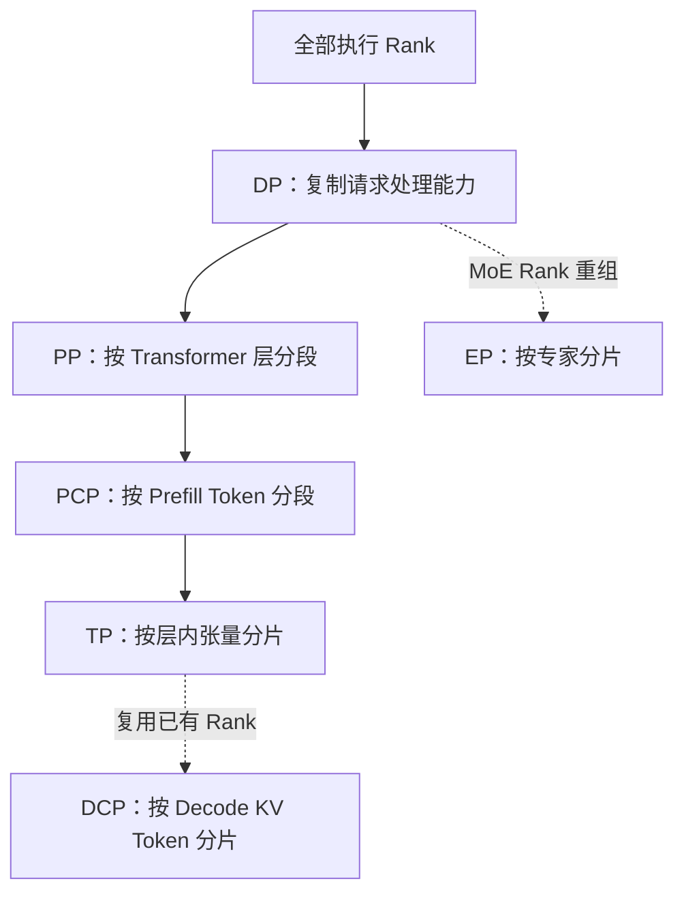
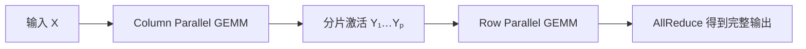
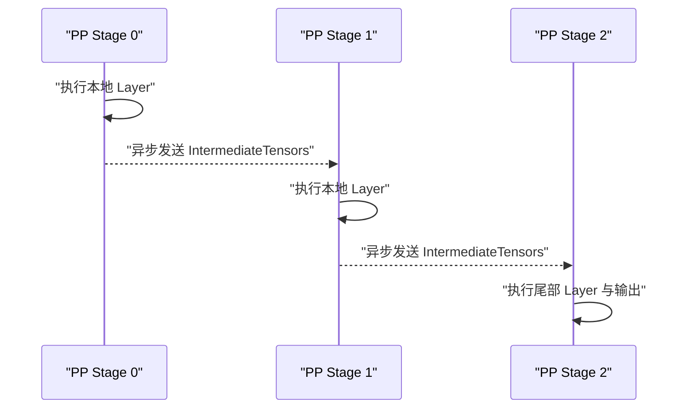
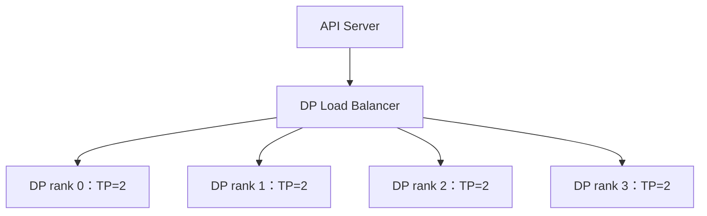
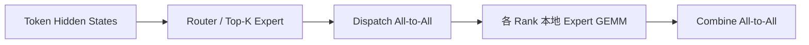
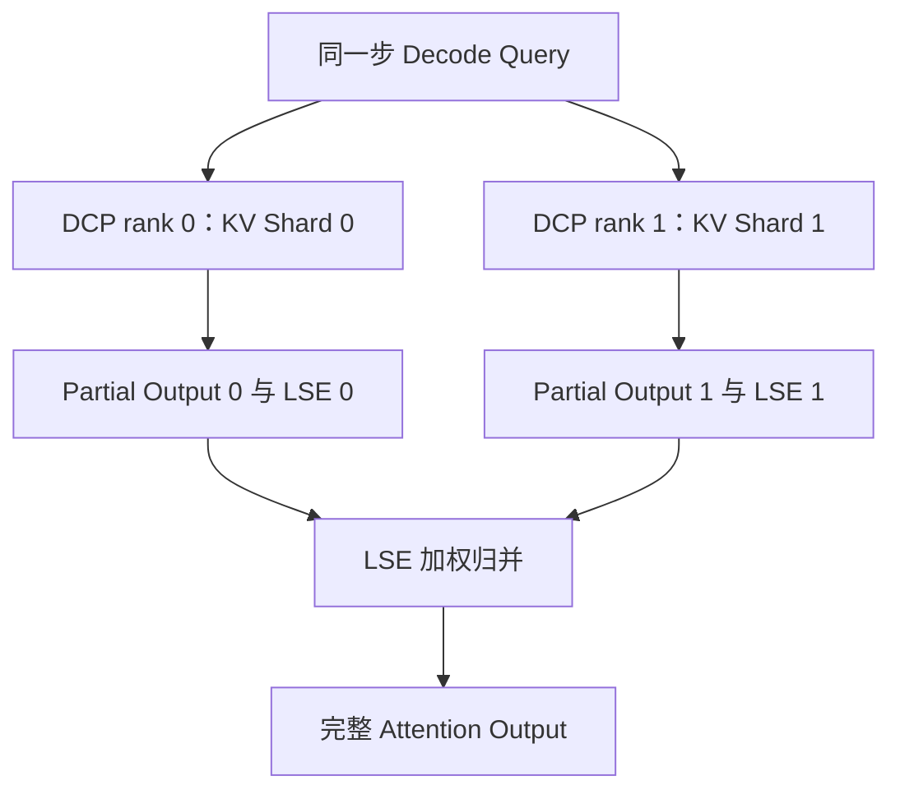
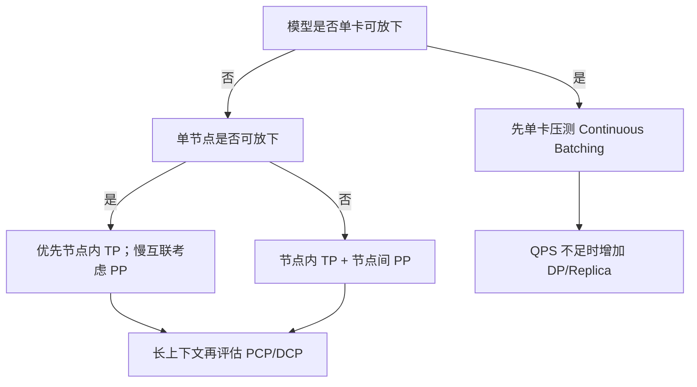

> 本文基于 [`vllm-project/vllm`](https://github.com/vllm-project/vllm) 2026-08-10 的默认分支快照，固定分析提交为 [`bd653607`](https://github.com/vllm-project/vllm/tree/bd6536071cec4dcd8cf91c0e2aa04aec83fc1c37)。重点不是罗列命令行参数，而是从权重、激活、请求、KV Cache 和 MoE Token Routing 五种数据对象出发，解释 vLLM 为什么需要不同并行维度、它们如何组合，以及每种组合真正换来了什么。

## 目录

1. [核心结论](#1-核心结论)
2. [先建立统一坐标系](#2-先建立统一坐标系)
3. [vLLM 如何建立并行进程组](#3-vllm-如何建立并行进程组)
4. [Tensor Parallel：切分层内矩阵](#4-tensor-parallel切分层内矩阵)
5. [Pipeline Parallel：切分 Transformer 层](#5-pipeline-parallel切分-transformer-层)
6. [Data Parallel：复制模型执行能力](#6-data-parallel复制模型执行能力)
7. [Expert Parallel：重组 MoE 稀疏计算](#7-expert-parallel重组-moe-稀疏计算)
8. [Prefill Context Parallel：切分长 Prompt](#8-prefill-context-parallel切分长-prompt)
9. [Decode Context Parallel：切分历史 KV](#9-decode-context-parallel切分历史-kv)
10. [Sequence Parallel 与 AsyncTP](#10-sequence-parallel-与-asynctp)
11. [Dual Batch Overlap](#11-dual-batch-overlap)
12. [Prefill-Decode 分离](#12-prefill-decode-分离)
13. [Continuous Batching、MP 与 Ray 的定位](#13-continuous-batchingmp-与-ray-的定位)
14. [六个典型部署案例](#14-六个典型部署案例)
15. [如何选择并行组合](#15-如何选择并行组合)
16. [常见误区](#16-常见误区)
17. [源码阅读地图](#17-源码阅读地图)
18. [总结](#18-总结)

---

## 1. 核心结论

先给出最重要的结论。

1. vLLM 的并行策略不是一组互斥选项，而是围绕不同数据对象建立的多个可组合维度。
2. `TP` 切权重和层内计算，主要解决单模型显存与单请求计算规模问题。
3. `PP` 切 Transformer 层，主要解决跨节点模型放置、非均匀切分和慢互联问题。
4. `DP` 复制模型执行副本，主要解决总 QPS；它不是把一次 Forward 切给更多 GPU。
5. `EP` 只针对 MoE 专家层，通过 All-to-All 把 Token 发送到专家所在 GPU；Attention 层仍使用 DP 或 TP。
6. `PCP` 切 Prefill 新输入 Token，主要降低超长 Prompt 的 TTFT，并且会增加执行进程数。
7. `DCP` 切 Decode 历史 KV 的时间维，主要消除 TP 超过 KV Head 数后的 KV 重复；它复用已有 TP/PCP rank，不额外增加 GPU。
8. `SP/AsyncTP` 是 TP 内部的编译期图重写和通信计算重叠，不是新的部署维度。
9. `DBO` 是 DP+EP 场景的双 Microbatch 执行重叠，目标是隐藏稀疏 All-to-All，而不是减少模型显存。
10. P/D 分离把 Prefill 和 Decode 放到不同实例，主要用于独立控制 TTFT 与 ITL；vLLM 文档明确说明它本身不保证提升吞吐。

可以把选择原则压缩成一句话：

> 先确定瓶颈属于模型权重、单次计算、请求吞吐、专家路由、Prefill 长度还是 Decode KV 容量，再选择对应并行轴；不要从“有多少张 GPU”反推一个统一的 Parallel Size。

---

## 2. 先建立统一坐标系

### 2.1 五类需要被分配的数据

理解分布式推理时，最容易犯的错误是只看 GPU 数，不看究竟在切什么。

| 数据对象 | 典型形态 | 对应策略 | 是否持久占显存 |
| --- | --- | --- | --- |
| 模型权重 | Linear、Embedding、Attention Projection | TP、PP、EP | 是 |
| 中间激活 | Hidden States、Q/K/V、MoE Token Buffer | TP、PP、PCP、SP | 否，随 Forward 生命周期变化 |
| 请求 | Request、Sequence、Sampling State | DP、Continuous Batching | Scheduler 生命周期 |
| KV Cache | 按 Layer、Block、KV Head、Token 组织 | TP、DCP、P/D Transfer | 是，随请求增长 |
| MoE Token | Router 选中的 Token 与 Expert ID | EP、DBO | 短暂存在 |

同样是“8 卡并行”，可能有完全不同的含义：

- TP=8：一条请求的每一层由 8 卡共同计算；
- DP=8：8 套模型副本分别处理不同请求；
- PP=8：模型层被切成 8 段；
- DCP=8：一条请求的历史 KV 按 Token 分到 8 个已有 rank；
- EP=8：不同专家被放到 8 个 rank，Token 按路由结果移动。

### 2.2 基础规模公式

当前 `ParallelConfig.__post_init__()` 中，单个 DP Replica 内的执行规模为：

$$
W_{\text{replica}} = PP \times PCP \times TP
$$

跨 DP 的总执行规模为：

$$
W_{\text{total}} = DP \times PP \times PCP \times TP
$$

源码位置：[`vllm/config/parallel.py`](https://github.com/vllm-project/vllm/blob/bd6536071cec4dcd8cf91c0e2aa04aec83fc1c37/vllm/config/parallel.py)。

这里没有乘 `DCP`，因为 DCP 重新组织已有 TP/PCP rank，不扩张 Process World。

EP 也不是再乘一个独立维度。当前代码在同一个 PP Stage 内，把 DP、PCP、TP 三个轴折叠成 EP Group：

$$
EP_{\text{size}} = DP \times PCP \times TP
$$

常见 `PCP=1` 部署下，就退化为文档中更熟悉的：

$$
EP_{\text{size}} = DP \times TP
$$

### 2.3 并行轴之间的关系



图中的顺序用于表达 rank 组织，不代表 Forward 一定按这个顺序发生。

---

## 3. vLLM 如何建立并行进程组

### 3.1 Rank 张量

`initialize_model_parallel()` 首先把所有 rank reshape 成一个五维张量：

```python
all_ranks = torch.arange(world_size).reshape(
    -1,
    data_parallel_size,
    pipeline_model_parallel_size,
    prefill_context_model_parallel_size,
    tensor_model_parallel_size,
)
```

逻辑维度可以理解为：

```text
[outer, DP, PP, PCP, TP]
```

随后把需要形成 ProcessGroup 的维度交换到最后一维，再 reshape 为二维并逐组创建通信组。

| ProcessGroup | Rank 组织方式 | 主要通信 |
| --- | --- | --- |
| TP Group | 固定 DP/PP/PCP，变化 TP | AllReduce、AllGather、ReduceScatter |
| PP Group | 固定 DP/PCP/TP，变化 PP | Stage 间 Send/Recv |
| DP Group | 固定 PP/PCP/TP，变化 DP | MoE DP 同步、状态同步 |
| PCP Group | 固定 DP/PP/TP，变化 PCP | Prefill 激活 Gather/Attention 通信 |
| DCP Group | 在 PCP/TP 轴上重新分组 | Partial Attention 合并 |
| EP Group | 折叠 DP×PCP×TP | Token Dispatch/Combine All-to-All |

源码：[`vllm/distributed/parallel_state.py`](https://github.com/vllm-project/vllm/blob/bd6536071cec4dcd8cf91c0e2aa04aec83fc1c37/vllm/distributed/parallel_state.py)。

### 3.2 为什么需要独立 ProcessGroup

不同通信拥有不同的参与者、顺序和语义。如果所有操作都放在一个全局 NCCL Group：

- TP AllReduce 可能错误等待另一个 DP Replica；
- PP Stage 只需要相邻 rank，却被迫让所有 GPU 参与；
- EP All-to-All 与 EPLB 权重迁移可能发生通信顺序冲突；
- 某个 DP rank 没有请求时，其他 EP rank 可能因 collective 不匹配而死锁。

因此 EPLB 甚至会建立一个与 EP rank 集合相同、但通信上下文独立的 EPLB Group，避免专家权重迁移和 Forward All-to-All 互相干扰。

---

## 4. Tensor Parallel：切分层内矩阵

TP 采用 Megatron-LM 风格的 Column Parallel 和 Row Parallel。

### 4.1 Column Parallel Linear

对线性层：

$$
Y = XA + b
$$

沿权重输出维切分：

$$
A = [A_1, A_2, \ldots, A_p]
$$

每个 TP rank 计算：

$$
Y_i = XA_i
$$

如果下一算子能够继续消费分片输出，就保留 $Y_i$；只有需要完整 $Y$ 时才执行 AllGather。

### 4.2 Row Parallel Linear

沿输入维切分：

$$
A =
\begin{bmatrix}
A_1 \\
A_2 \\
\vdots \\
A_p
\end{bmatrix},
\qquad
X = [X_1, X_2, \ldots, X_p]
$$

每个 rank 得到局部贡献：

$$
Y_i = X_iA_i
$$

最终：

$$
Y = \sum_{i=1}^{p} Y_i
$$

因此 Row Parallel 的典型收尾操作是 AllReduce。



源码：[`ColumnParallelLinear` 与 `RowParallelLinear`](https://github.com/vllm-project/vllm/blob/bd6536071cec4dcd8cf91c0e2aa04aec83fc1c37/vllm/model_executor/layers/linear.py)。

### 4.3 Attention 和 KV Cache 如何随 TP 切分

Attention 的 Q Head、KV Head 和 Projection 权重也会随 TP 分片。如果 KV Head 数足够多，每个 TP rank 可以保存不同 KV Head 对应的 Cache。

但当：

$$
TP > H_{KV}
$$

KV Head 已经没有更多空间可切。继续增大 TP 时，不同 rank 会保存重复的 KV 数据。这正是 DCP 出现的原因，后文会展开。

### 4.4 TP 为什么有用

- 将单卡放不下的权重分摊到多卡；
- 多卡同时完成同一层计算，可能降低单请求延迟；
- QKV、MLP Intermediate Dimension 等大矩阵天然适合按维度切分；
- 与量化权重分片、Vocab Parallel Embedding 等机制兼容。

### 4.5 TP 的代价

- Transformer 几乎每层都有 collective；
- Decode 每步 Token 很少，小 GEMM 下通信占比更高；
- TP Size 必须满足 Attention Head、Hidden Size、量化 Group 等整除约束；
- 跨节点 TP 对 InfiniBand、GPUDirect RDMA 和拓扑感知要求很高；
- 增大 TP 可能减少每卡 GEMM 尺寸，降低 Tensor Core 利用率。

所以 TP 的第一目标是“让一个 Replica 合理执行”，不是“无限提升总吞吐”。

---

## 5. Pipeline Parallel：切分 Transformer 层

PP 把连续 Transformer Layer 分给不同 Stage。

假设 80 层、PP=2：

```text
PP rank 0：Embedding + Layer 0–39
PP rank 1：Layer 40–79 + Final Norm + LM Head
```

### 5.1 vLLM 的层切分

`make_layers()` 调用 `get_pp_indices()` 确定当前 rank 的 `[start_layer, end_layer)`，只构造本 rank 真正拥有的层；其他层位置使用 `PPMissingLayer` 占位。

当层数不能整除 PP Size 时，vLLM 不只是简单地把余数都给前几个 Stage：

- 最后 Stage 通常还承担 Final Norm 和 LM Head；
- 第一 Stage 可能承担 Embedding；
- 因此余数会尽量分配给中间 Stage，降低最大显存与计算不均衡；
- 也可用 `VLLM_PP_LAYER_PARTITION` 显式指定每个 Stage 的层数。

源码：[`get_pp_indices()`](https://github.com/vllm-project/vllm/blob/bd6536071cec4dcd8cf91c0e2aa04aec83fc1c37/vllm/distributed/utils.py) 与 [`make_layers()`](https://github.com/vllm-project/vllm/blob/bd6536071cec4dcd8cf91c0e2aa04aec83fc1c37/vllm/model_executor/models/utils.py)。

### 5.2 运行时数据流



非第一 Stage 通过 `irecv_tensor_dict()` 异步接收 Intermediate Tensors；非最后 Stage 通过 `isend_tensor_dict()` 异步发送。只有最后 Stage 返回可进入采样的模型输出。

源码：[`GPUWorker.execute_model()`](https://github.com/vllm-project/vllm/blob/bd6536071cec4dcd8cf91c0e2aa04aec83fc1c37/vllm/v1/worker/gpu_worker.py)。

### 5.3 为什么跨节点常用“节点内 TP、节点间 PP”

TP collective 会在大量 Transformer Layer 中反复发生。如果 TP Group 横跨节点，每一层都可能把通信放到 IB/RDMA 链路上。

PP 的跨节点数据主要是 Stage 边界的 Hidden States，通信次数远低于跨节点 TP。因此两节点、每节点 8 卡时，常见配置是：

```bash
vllm serve $MODEL \
  --tensor-parallel-size 8 \
  --pipeline-parallel-size 2
```

而不是直接 `TP=16`。

### 5.4 PP 的代价

- 后一个 Stage 必须等待前一个 Stage 产生激活；
- Decode 每步 Token 少时更容易出现 Pipeline Bubble；
- Stage 计算量、参数量和 KV Cache 分布可能不均匀；
- 部分 Speculative Decode 或模型特性不能与 PP 组合；
- PP 更擅长解决放置和通信拓扑问题，不一定降低单请求延迟。

vLLM 官方部署建议还指出：在 L40S 等没有 NVLink 的单节点上，PP 有时会比高频 TP collective 获得更好的吞吐与延迟。

---

## 6. Data Parallel：复制模型执行能力

DP 不切一次 Forward，而是复制完整的模型执行副本，让不同副本处理不同请求。

例如：

```bash
vllm serve $MODEL \
  --data-parallel-size 4 \
  --tensor-parallel-size 2
```

总共使用 8 张 GPU，形成 4 个 DP Engine，每个 Engine 内部是 TP=2。



### 6.1 每个 DP Rank 独立拥有什么

对普通 Dense 模型，可以把每个 DP Rank 看成独立 vLLM Replica：

- 独立 EngineCore；
- 独立 Scheduler；
- 独立 Running/Waiting Queue；
- 独立 Paged KV Cache；
- 独立 Prefix Cache；
- 一套完整模型，或一套 TP/PP/PCP 组合后的完整 Replica。

### 6.2 Internal、Hybrid 与 External Load Balancing

vLLM 在线 DP 支持三类路由。

| 模式 | 请求入口 | 路由范围 | 适用场景 |
| --- | --- | --- | --- |
| Internal LB | 单个 API 入口 | API Server 在全部 DP Rank 中选择 | 中小规模、一体化部署 |
| Hybrid LB | 每节点一个入口 | 外部 LB 选节点，vLLM 选本地 Rank | 多节点大规模，降低跨节点控制流量 |
| External LB | 每 Rank 独立入口 | 外部系统完整负责路由 | Kubernetes、全局弹性和定制路由 |

源码入口：[`EngineCoreClient.make_async_mp_client()`](https://github.com/vllm-project/vllm/blob/bd6536071cec4dcd8cf91c0e2aa04aec83fc1c37/vllm/v1/engine/core_client.py)，部署说明：[`Data Parallel Deployment`](https://github.com/vllm-project/vllm/blob/bd6536071cec4dcd8cf91c0e2aa04aec83fc1c37/docs/serving/data_parallel_deployment.md)。

### 6.3 DP 为什么提高 QPS

假设模型用 TP=2 已经能够高效执行。剩余 6 张 GPU 有两种用法：

```text
方案 A：TP=8，DP=1
方案 B：TP=2，DP=4
```

方案 A 让单请求使用更多 GPU，但会增加每层 collective，且每卡 GEMM 变小。

方案 B 保持每个 Replica 的高效执行粒度，同时并行服务四组请求。只要流量足够，方案 B 通常有更高的总 QPS。

### 6.4 KV Cache 和 Prefix Cache 路由

DP Rank 之间不共享 Paged KV Cache。因此：

- 一个多轮会话应尽量保持 Rank Affinity；
- 相同公共前缀的请求最好路由到已有 Prefix Cache 的 Rank；
- 只根据 Waiting Queue 长度路由，可能破坏 Prefix Cache 命中率；
- `--max-num-seqs` 是每个 DP Rank 的限制，不是全局限制。

### 6.5 MoE 下的 DP 不完全独立

DP 与 EP 组合后，专家层跨 DP Rank 形成 collective。只要任一 Rank 有 Forward，其他空闲 Rank 也必须进入匹配的 Dummy Forward，否则 All-to-All/Collective 顺序不一致会死锁。

这就是为什么 vLLM 有专门的 DP Coordinator 和跨 Rank unfinished-state 同步。Dense DP 可以独立前进，Wide EP 下的 DP 则必须按 Forward Wave 对齐。

---

## 7. Expert Parallel：重组 MoE 稀疏计算

MoE 模型的参数量很大，但每个 Token 只激活少量专家。EP 的目标是让专家权重和稀疏计算保持局部性。

### 7.1 执行流程



典型过程为：

1. Router 为每个 Token 选择 Top-K Expert；
2. 根据 Expert→Rank 映射整理 Token；
3. Dispatch All-to-All 把 Token 发往专家所在 Rank；
4. 每个 Rank 执行本地专家 GEMM；
5. Combine All-to-All 把结果发回原 Token 所在位置；
6. 根据 Router Weight 汇总专家结果。

### 7.2 TP=2、DP=4 的层级差异

开启 EP 后，8 张 GPU 的行为不是所有层都相同。

| 层类型 | 并行行为 |
| --- | --- |
| Attention | 每个 DP Replica 内 TP=2，共有 4 组 Attention Replica |
| Dense MLP/Shared Expert | 依模型实现继续使用 TP 或复制 |
| Routed Expert | 形成 EP=TP×DP=8 的专家分片 |

这说明 EP 不是整模型的统一切分策略，而是针对 MoE Layer 替换原有专家层 TP 行为。

### 7.3 EP 的收益

- 每个 Rank 只加载部分专家权重；
- Token 在专家所在 GPU 完成本地 GEMM；
- 能够部署参数量远大于实际激活量的 MoE 模型；
- 可以把 Attention 的 DP 扩展能力与专家层的全局分片结合；
- `--enable-ep-weight-filter` 还可在加载阶段跳过非本地专家权重，减少存储 I/O。

### 7.4 EP 的代价：All-to-All 与长尾专家

EP 性能取决于最慢的 Expert Rank。即使平均 Token 数相同，只要某张 GPU 上的热门专家收到更多 Token，整层 Combine 都要等待它完成。

影响因素包括：

- Prompt 分布导致的 Expert 热点；
- Expert Placement 是否把相关热门专家集中到同一 Rank；
- 跨节点 All-to-All 带宽；
- Dispatch/Combine Layout；
- Prefill 和 Decode 对 Throughput/Latency Backend 的不同偏好。

vLLM 提供 `allgather_reducescatter`、DeepEP High Throughput、DeepEP Low Latency、MoRI、NIXL-EP、FlashInfer NVLink 等 backend。Prefill 通常偏向大吞吐连续布局，Decode 更关心低延迟与 CUDA Graph 兼容。

### 7.5 EPLB：动态专家负载均衡

EPLB 会记录一段窗口内的 Expert Load，并周期性调整 Expert→Physical Rank 映射。还可以增加 Redundant Expert，让热门逻辑专家同时存在于多个 Rank。

若总逻辑专家数为 $E$、冗余专家数为 $R$、EP Size 为 $P$，每个 Rank 需要持有的专家数近似为：

$$
E_{\text{rank}} = \frac{E + R}{P}
$$

冗余可以降低热点长尾，但会侵占 KV Cache 显存。vLLM 文档给出的 DeepSeek-V3 量级估算是：每个 EP Rank 增加一个冗余专家，大约增加 2.4 GB 权重显存。

源码与配置：[`ParallelConfig`/`EPLBConfig`](https://github.com/vllm-project/vllm/blob/bd6536071cec4dcd8cf91c0e2aa04aec83fc1c37/vllm/config/parallel.py)，部署说明：[`Expert Parallel Deployment`](https://github.com/vllm-project/vllm/blob/bd6536071cec4dcd8cf91c0e2aa04aec83fc1c37/docs/serving/expert_parallel_deployment.md)。

---

## 8. Prefill Context Parallel：切分长 Prompt

Prefill 和 Decode 的计算形态差异很大。

Prefill 对长度为 $T$ 的新输入 Token，需要计算整段 Q/K/V 和 Attention，计算量随 Prompt 长度快速增长。PCP 把新 Token 分到多个 Rank：

$$
\{0,1,\ldots,T-1\}
=
S_0 \cup S_1 \cup \cdots \cup S_{N-1}
$$

每个 PCP Rank 计算自己的 Token Segment。

### 8.1 当前 PCPManager 的数据组织

当前 ModelRunner V2 路径中，`PCPManager` 保留全局 Scheduled Batch，同时构建 Rank-Local Batch。

以 PCP=2 为例：

```text
Global Batch：       [A B C D E F G]
Rank 0 / Rank 1：    [A B G] / [C D E F]
Padded Gathered：    [A B G _ | C D E F]
```

它同时构建：

- `hidden_restore_idx`：AllGather 后恢复全局 Token 顺序；
- `padded_gather_idx`：从全局 Batch 构造对齐后的 Gather Layout；
- `gathered_kv_write_mask`：防止 Padding 或重复 Decode Token 错写 KV Cache；
- Rank-Local Block Table 和 Slot Mapping。

Forward 结束后：

```python
gathered = get_pcp_group().all_gather(hidden_states, dim=0)
hidden_states = gathered[hidden_restore_idx]
```

再恢复全局 Batch 进入采样。

源码：[`vllm/v1/worker/gpu/pcp_manager.py`](https://github.com/vllm-project/vllm/blob/bd6536071cec4dcd8cf91c0e2aa04aec83fc1c37/vllm/v1/worker/gpu/pcp_manager.py)。

### 8.2 PCP 为什么降低 TTFT

一条 128K Prompt 如果只由一个 TP Replica 完成 Prefill，所有 Token 计算都落在同一套 TP Rank 上。PCP=4 后，新 Token 计算能够分摊到四个 PCP Rank 组，目标是缩短产生第一个 Token 前的 Prefill 时间。

PCP 的主要收益是计算分摊，不应简单理解为 KV Cache 容量扩大。`ParallelConfig` 明确说明 PCP 会扩张 Process World，但不增加 KV Cache Shard Count。

### 8.3 两类 Context Attention 方法

长 Prefill 通常有两类思路。

1. Partial Query、Full K/V：各 Rank 只负责部分 Query，但 Gather 完整 K/V 后计算对应 Attention。实现简单，适合仍能容纳完整 K/V 的中长 Prompt。
2. Partial Query、Partial K/V：每个 Rank 只持有局部 Q/K/V，通过 Ring Attention 等方法分块交换 K/V。更节省峰值显存，但通信与实现更复杂。

### 8.4 当前组合约束

当前提交中：

- PCP 暂不支持与 DP 同时启用；
- MRV2 PCP 暂不支持 Speculative Decode；
- PCP 开启时，DCP 只能为 `1`、`PCP` 或 `TP×PCP`；
- PCP 需要对 Batch Layout、Block Table、Slot Mapping、Sampling Restore 做成套处理。

因此 PCP 仍属于需要针对模型、Attention Backend 和工作负载认真验证的高级功能。

---

## 9. Decode Context Parallel：切分历史 KV

Decode 每步通常只有很少 Query Token，却需要读取不断增长的历史 KV Cache。

对 KV Head 数为 $H$、上下文长度为 $T$ 的模型，单层 KV 数据规模与以下量近似成正比：

$$
H \times T \times D_{head}
$$

### 9.1 为什么 TP 之后仍需要 DCP

TP 首先沿 KV Head 维切分。当 $TP \le H$ 时，可以让不同 Rank 保存不同 KV Head。

当 $TP > H$ 时，KV Head 已经切完，继续增加 TP 会产生重复：

$$
R_{KV} \approx \frac{TP}{H}
$$

DCP 进一步沿 Token/时间维 $T$ 切分历史 KV，从而减少重复。

### 9.2 DCP 的 Partial Attention



每个 Rank 对本地 KV Shard 得到局部 Attention Output $O_i$ 和 Log-Sum-Exp $L_i$。全局结果不能简单相加，而需要用全局 LSE 进行数值稳定的加权：

$$
L = \log\sum_i e^{L_i}
$$

$$
O = \sum_i e^{L_i-L} O_i
$$

当前 DCP 默认支持 AllGather+ReduceScatter，也提供 A2A Backend。A2A 路径把 Partial Output 和 FP32 LSE 打包到单个 Payload，执行 All-to-All 后用 Triton Kernel 解包并归并，减少每层 NCCL 调用数量。

源码：[`dcp_alltoall.py`](https://github.com/vllm-project/vllm/blob/bd6536071cec4dcd8cf91c0e2aa04aec83fc1c37/vllm/v1/attention/ops/dcp_alltoall.py)。

### 9.3 KV Token 如何分布

DCP 使用 Interleaving Strategy。令 DCP Size 为 $N$、Interleave Size 为 $I$，一段连续的 $I$ 个 Token 写入一个 DCP Rank，下一段写入下一个 Rank。

当 $I=1$ 时：

$$
rank(t) = t \bmod N
$$

当 $I=block\_size$ 时，则更接近按 Paged KV Block 分配。

Interleave 必须和 Block Size 满足整除关系，否则 Slot Mapping 与本地 Sequence Length 很难保持一致。

### 9.4 三个典型案例

| 模型 | KV Head | TP | 原始 KV 重复 | 合理 DCP |
| --- | ---: | ---: | ---: | ---: |
| DeepSeek-R1 MLA | 1 | 8 | 约 8× | 8 |
| Kimi-K2 MLA | 1 | 16 | 约 16× | 8 或 16 |
| Qwen3-235B-A22B GQA | 4 | 8 | 约 2× | 2 |

DeepSeek-R1 示例：

```bash
vllm serve deepseek-ai/DeepSeek-R1 \
  --tensor-parallel-size 8 \
  --decode-context-parallel-size 8
```

### 9.5 DCP 的收益与代价

收益：

- 降低每卡 KV Cache 占用；
- 支持更长单请求上下文；
- 同样显存容纳更多并发请求；
- 对 MLA 单 KV Head 模型尤其重要。

代价：

- 每层 Attention 增加跨 Rank 归并；
- DCP 越大，KV 越省，但通信越多；
- 它可能提升容量和总吞吐，却不一定降低单 Token Latency；
- DCP 不增加 GPU，必须复用已有 TP/PCP Rank。

配置约束和案例见 [`Context Parallel Deployment`](https://github.com/vllm-project/vllm/blob/bd6536071cec4dcd8cf91c0e2aa04aec83fc1c37/docs/serving/context_parallel_deployment.md)。

---

## 10. Sequence Parallel 与 AsyncTP

vLLM 的 SP 是 `torch.compile`/Inductor Pass 对 TP Graph 的重写，不是新的部署 ProcessGroup。

### 10.1 基础变换

原始模式：

```text
TP GEMM → AllReduce → RMSNorm → 下一层
```

SP 变换后：

```text
TP GEMM → ReduceScatter → Local RMSNorm → AllGather → 下一层
```

Sequence/Token 维在 ReduceScatter 后暂时分散到 TP Rank，每个 Rank 只对本地 Token 做 RMSNorm，再在下一层需要完整输入前 AllGather。

### 10.2 SP 本身为什么不一定更快

单纯把一个 AllReduce 改成 ReduceScatter+AllGather，通信总量未必明显下降。它的主要价值是暴露可重叠区间，让 AsyncTP 进一步融合：

- `GEMM → ReduceScatter`；
- `AllGather → GEMM`。

使用 Symmetric Memory Primitive 后，通信可以和 GEMM 的部分计算交叠，从而减少关键路径上的裸露通信时间。

### 10.3 适用边界

当前自动策略主要面向：

- H100/Blackwell；
- TP>1；
- Hidden Size 至少约 8192；
- Token 数量较大的 Prefill 或大 Batch；
- Fullgraph/Inductor Partition 能看到完整融合模式。

小 Decode Batch 中 Token 太少，Scatter/Gather 和编译调度成本可能超过收益。

设计说明：[`Fusion Details — Sequence Parallelism`](https://github.com/vllm-project/vllm/blob/bd6536071cec4dcd8cf91c0e2aa04aec83fc1c37/docs/design/fusions.md)，实现：[`sequence_parallelism.py`](https://github.com/vllm-project/vllm/blob/bd6536071cec4dcd8cf91c0e2aa04aec83fc1c37/vllm/compilation/passes/fusion/sequence_parallelism.py)。

---

## 11. Dual Batch Overlap

DBO 主要面向 DP+EP 场景，用两个 Microbatch 隐藏 MoE All-to-All。

### 11.1 为什么 EP 需要执行重叠

MoE Layer 的典型时间线是：

```text
Router → Dispatch Send/Recv → Expert GEMM → Combine Send/Recv
```

当一个 Batch 等待 Dispatch 或 Combine 时，GPU 上可执行的本地计算不足，通信延迟直接暴露到 Forward Critical Path。

DBO 将 Batch 拆成两个 UBatch，并用两个 Worker Thread 交错推进：

```text
UBatch 0：本地 Attention / MLP 计算
UBatch 1：等待 Dispatch / Combine 通信
随后二者交换角色
```

### 11.2 使用条件

```bash
vllm serve deepseek-ai/DeepSeek-V2-Lite \
  --data-parallel-size 2 \
  --enable-expert-parallel \
  --enable-dbo \
  --all2all-backend deepep_low_latency
```

当前主要要求：

- DP Size 大于 1；
- 开启 EP；
- 使用 DeepEP Backend；
- Decode/Prefill Token 数达到对应 Threshold 才拆 Microbatch。

DBO 的代价是更复杂的线程、Stream、CUDA Graph 和 Buffer 生命周期，并且 Microbatch 过小会降低 GEMM 效率。

设计文档：[`docs/design/dbo.md`](https://github.com/vllm-project/vllm/blob/bd6536071cec4dcd8cf91c0e2aa04aec83fc1c37/docs/design/dbo.md)。

---

## 12. Prefill-Decode 分离

P/D 分离不是同一个 Process World 内的 Parallel Group，而是服务实例级分工。


### 12.1 为什么拆分

Prefill 和 Decode 的 SLO、算力与通信特征不同。

| 阶段 | 主要特征 | 常见目标 |
| --- | --- | --- |
| Prefill | 大 Token GEMM、计算密集 | 降低 TTFT、提高吞吐 |
| Decode | 小 Token GEMM、KV 读取、延迟敏感 | 降低 ITL、控制 P99 |

统一实例中，长 Prefill 插入正在运行的 Decode Batch，可能显著抬高尾部 ITL。Chunked Prefill 可以缓解，但 Chunk Size 很难对所有流量分布都合适。

P/D 分离允许：

- Prefill Pool 使用更大的 TP/PP/PCP；
- Decode Pool 使用 DCP 和低延迟 EP Backend；
- 两个 Pool 独立扩缩容；
- TTFT 与 ITL 分别调优；
- Prefill 不再直接扰动 Decode 尾延迟。

### 12.2 KV Transfer 数据流

Prefill 实例完成 Prompt Forward 后，通过 KV Connector 把 KV Block 和必要元数据交给 Decode 实例。vLLM 支持 NIXL、Mooncake、LMCache、Offloading、FlexKV 等 Connector。

Scheduler 侧 Connector 负责安排传输，Worker 侧 Connector 在 Layer/KV Cache 路径执行实际 Store/Load。

### 12.3 为什么文档说“不提升吞吐”

P/D 分离增加了：

- KV Cache 跨实例传输；
- 请求在两个服务之间的路由和握手；
- Decode 侧 KV Block 预留；
- 更多部署和故障处理逻辑。

它的核心价值是 SLO 隔离与独立扩缩容，而不是凭空减少总计算量。因此是否提高集群吞吐取决于调度、资源配比和网络，不能把拆分本身视为吞吐优化。

设计说明：[`Disaggregated Prefilling`](https://github.com/vllm-project/vllm/blob/bd6536071cec4dcd8cf91c0e2aa04aec83fc1c37/docs/features/disagg_prefill.md)。

---

## 13. Continuous Batching、MP 与 Ray 的定位

### 13.1 Continuous Batching 不是分布式并行轴

Continuous Batching 在同一个 Model Replica 内，把不同请求本轮要执行的 Token 动态组成 Batch。

它解决的是：

- 请求到达和结束时间不同；
- Decode 每个请求每步 Token 少；
- 固定 Batch 会因短请求结束产生空洞；
- Prefill 与 Decode 需要共享 Token Budget。

因此它属于请求级并发与调度，而不是 TP/PP/DP 意义上的设备切分。但它通常是 vLLM 吞吐的第一来源：在考虑增加 DP 前，应先确认单 Replica 的 Continuous Batching、KV 容量和 Token Budget 已经利用合理。

### 13.2 Multiprocessing 与 Ray 不是数学并行策略

`--distributed-executor-backend mp|ray` 决定的是 Worker 如何被创建、放置和管理。

| Backend | 主要用途 | 不改变什么 |
| --- | --- | --- |
| `mp` | 本地或显式多节点进程管理，简单直接 | 不改变 TP/PP/DP 的数学语义 |
| `ray` | 多节点资源发现、Placement Group、Actor 生命周期 | 不自动选择最佳并行切分 |
| `external_launcher` | 由外部系统注入 Rank/World | 不替代模型分片设计 |
| `uni` | 单 Worker/平台统一执行路径 | 不等于 DP=1 的所有部署语义 |

vLLM 默认倾向单节点使用 Multiprocessing；多节点可显式使用 Ray，也支持带 `--nnodes`、`--node-rank` 的 MultiProcessing 启动。

Ray 解决“Rank 在哪里运行、如何启动和管理”，TP/PP/DP 解决“Rank 之间如何协作计算”。二者不能混为一谈。

---

## 14. 六个典型部署案例

### 14.1 案例一：Dense 模型单卡可放下，高 QPS

硬件：8×GPU。模型单卡能够放下且单卡执行效率良好。

推荐：8 个独立 Replica，或 DP=8。

```text
TP=1, PP=1, DP=8
```

原因：继续增加 TP 会引入每层通信；复制 Replica 能直接并行处理更多请求。

适合：高并发在线服务、短上下文、模型相对较小。

### 14.2 案例二：Dense 模型单卡放不下，但单节点可放下

硬件：8×H100 NVLink/NVSwitch。

```bash
vllm serve $MODEL --tensor-parallel-size 8
```

原因：节点内高速互联适合频繁 TP Collective；模型权重和大矩阵被均匀分片。

验证重点：Head/Quant Group 整除、AllReduce 占比、单卡 KV Cache 容量。

### 14.3 案例三：两节点、每节点 8 GPU 的超大 Dense 模型

```text
TP=8, PP=2, DP=1
```

```bash
vllm serve $MODEL \
  --tensor-parallel-size 8 \
  --pipeline-parallel-size 2 \
  --distributed-executor-backend ray
```

原因：节点内使用 NVLink TP；节点间用 PP，避免每个 Transformer Layer 都做跨节点 TP Collective。

验证重点：Stage Balance、Pipeline Bubble、IB/RDMA、跨 Stage 激活大小。

### 14.4 案例四：8 GPU 上的 DeepSeek-V3 类 MoE

```text
Attention：TP=1, DP=8
Expert：EP=8
```

```bash
vllm serve deepseek-ai/DeepSeek-V3-0324 \
  --tensor-parallel-size 1 \
  --data-parallel-size 8 \
  --enable-expert-parallel
```

原因：Attention 权重复制后并行服务请求；海量专家权重分到 8 张 GPU；Token 根据 Router 做 All-to-All。

验证重点：Expert Load、All-to-All Backend、Dummy Forward、EPLB 冗余显存。

### 14.5 案例五：DeepSeek-R1 MLA 长上下文 Decode

```text
TP=8, DCP=8
```

```bash
vllm serve deepseek-ai/DeepSeek-R1 \
  --tensor-parallel-size 8 \
  --decode-context-parallel-size 8
```

原因：MLA 只有一个 KV Head，TP=8 会产生高 KV 重复；DCP 沿 Token 维分片，显著释放 KV 容量。

验证重点：最大并发、每层 DCP Collective、ITL 是否因通信上升。

### 14.6 案例六：超长 Prompt 且 TTFT/ITL 都有严格要求

```text
Prefill Pool：较大 TP/PCP，High-Throughput EP Backend
Decode Pool：合理 TP/DCP，Low-Latency EP Backend
中间：NIXL 或其他 KV Connector
```

原因：PCP 分摊长 Prompt，DCP 降低历史 KV 重复，P/D 分离避免长 Prefill 干扰 Decode P99。

验证重点：KV Transfer 带宽、Block Ownership、两侧资源比例、失败恢复与请求路由。

---

## 15. 如何选择并行组合

### 15.1 决策顺序



### 15.2 按瓶颈选择

| 观察到的瓶颈 | 首选方向 | 不应先做什么 |
| --- | --- | --- |
| 模型权重 OOM | TP、PP、EP | 直接增加 DP |
| 单请求算力不足 | 节点内 TP、PCP | 只增加 Replica |
| 总 QPS 不足 | DP/独立 Replica | 盲目增大 TP |
| 跨节点 TP 通信过高 | 节点内 TP + 节点间 PP | 继续扩大跨节点 TP |
| MoE Expert 显存过大 | EP | 用普通 DP 完整复制专家 |
| MoE 某些 Rank 长尾 | EPLB、Placement、Backend | 只看平均 Token 数 |
| 长 Prompt TTFT 过高 | PCP、P/D 分离 | 仅靠 DCP |
| Decode KV OOM | DCP、更多 Decode Replica | 仅增加 PCP |
| TP 大 Batch 通信暴露 | SP/AsyncTP | 在小 Decode Batch 强开 SP |
| Prefill 干扰 Decode P99 | Chunked Prefill 或 P/D 分离 | 把拆分默认当吞吐优化 |

### 15.3 评估指标

每次调整 Parallel Size，都应同时观察：

- 模型权重显存；
- GPU KV Cache Token Capacity；
- 最大并发估计；
- TTFT；
- 平均和 P99 ITL；
- Request Throughput 与 Token Throughput；
- NCCL/All-to-All 时间占比；
- 单卡 GEMM 尺寸和利用率；
- Prefix Cache 命中率；
- MoE Expert Balancedness；
- 跨节点链路是否实际使用 IB/GDRDMA。

不存在脱离模型、量化格式、Prompt/Output Length 和网络拓扑的“最佳并行配置”。

---

## 16. 常见误区

### 16.1 GPU 越多，TP 越大越快

错误。TP 增大后，每卡 GEMM 变小、collective 变多。模型已经能高效运行时，额外 GPU 更可能适合建立 DP Replica。

### 16.2 DP Rank 永远完全独立

只对普通 Dense DP 近似成立。DP+EP 下，专家层跨 DP Rank 形成 collective，空闲 Rank 也需要 Dummy Forward 保持通信波次一致。

### 16.3 DCP=8 就需要额外 8 张 GPU

错误。DCP 复用已有 TP/PCP Rank，不扩张 World Size。没有足够已有 Rank 时，不能凭空开启更大的 DCP。

### 16.4 PCP 和 DCP 都是“把 Sequence 切开”，所以等价

错误。

- PCP 切本轮 Prefill 新 Token 计算，扩张 Process World，目标是 TTFT；
- DCP 切 Decode 历史 KV 所有权，复用 Rank，目标是 KV 容量。

### 16.5 EP 只是把专家权重平均分配

权重平均不等于计算平均。Token Router 的实际分布决定每个 Rank 的工作量，热门 Expert 会产生尾部瓶颈，因此需要 Placement、EPLB、冗余专家和 Backend 共同优化。

### 16.6 Ray 会自动给出最佳并行方案

Ray 管理资源和 Actor，不替代 TP/PP/DP/EP 的拓扑设计。错误的 Parallel Size 在 Ray 上仍然是错误配置。

### 16.7 P/D 分离一定提升吞吐

错误。它主要隔离 TTFT 和 ITL，并增加 KV Transfer。只有当资源配比和路由更合理时，集群吞吐才可能随之改善。

### 16.8 Sequence Parallel 就是 Context Parallel

错误。SP 是 TP Graph 中围绕 AllReduce/RMSNorm 的 Token 激活重写；PCP/DCP 则改变 Prefill 计算或 Decode KV 的跨 Rank 所有权。

---

## 17. 源码阅读地图

建议按下面顺序阅读。

### 17.1 配置与拓扑

- [`vllm/config/parallel.py`](https://github.com/vllm-project/vllm/blob/bd6536071cec4dcd8cf91c0e2aa04aec83fc1c37/vllm/config/parallel.py)：ParallelConfig、EPLBConfig、World Size 与组合约束。
- [`vllm/distributed/parallel_state.py`](https://github.com/vllm-project/vllm/blob/bd6536071cec4dcd8cf91c0e2aa04aec83fc1c37/vllm/distributed/parallel_state.py)：TP/PP/DP/PCP/DCP/EP ProcessGroup。
- [`vllm/engine/arg_utils.py`](https://github.com/vllm-project/vllm/blob/bd6536071cec4dcd8cf91c0e2aa04aec83fc1c37/vllm/engine/arg_utils.py)：CLI 参数到 ParallelConfig 的映射。

### 17.2 TP 与 PP

- [`vllm/model_executor/layers/linear.py`](https://github.com/vllm-project/vllm/blob/bd6536071cec4dcd8cf91c0e2aa04aec83fc1c37/vllm/model_executor/layers/linear.py)：Column/Row/QKV Parallel Linear。
- [`vllm/model_executor/models/utils.py`](https://github.com/vllm-project/vllm/blob/bd6536071cec4dcd8cf91c0e2aa04aec83fc1c37/vllm/model_executor/models/utils.py)：PP Missing Layer 和 Layer Construction。
- [`vllm/distributed/utils.py`](https://github.com/vllm-project/vllm/blob/bd6536071cec4dcd8cf91c0e2aa04aec83fc1c37/vllm/distributed/utils.py)：PP Layer Partition。
- [`vllm/v1/worker/gpu_worker.py`](https://github.com/vllm-project/vllm/blob/bd6536071cec4dcd8cf91c0e2aa04aec83fc1c37/vllm/v1/worker/gpu_worker.py)：PP IntermediateTensors Send/Recv。

### 17.3 DP 与 EP

- [`docs/serving/data_parallel_deployment.md`](https://github.com/vllm-project/vllm/blob/bd6536071cec4dcd8cf91c0e2aa04aec83fc1c37/docs/serving/data_parallel_deployment.md)：Internal/Hybrid/External LB。
- [`vllm/v1/engine/core_client.py`](https://github.com/vllm-project/vllm/blob/bd6536071cec4dcd8cf91c0e2aa04aec83fc1c37/vllm/v1/engine/core_client.py)：DP Engine Client 选择。
- [`docs/serving/expert_parallel_deployment.md`](https://github.com/vllm-project/vllm/blob/bd6536071cec4dcd8cf91c0e2aa04aec83fc1c37/docs/serving/expert_parallel_deployment.md)：EP Backend、EPLB 与部署案例。
- [`vllm/model_executor/layers/fused_moe/`](https://github.com/vllm-project/vllm/tree/bd6536071cec4dcd8cf91c0e2aa04aec83fc1c37/vllm/model_executor/layers/fused_moe)：MoE Dispatch、Expert Kernel 与 Combine。

### 17.4 Context Parallel 与通信重叠

- [`docs/serving/context_parallel_deployment.md`](https://github.com/vllm-project/vllm/blob/bd6536071cec4dcd8cf91c0e2aa04aec83fc1c37/docs/serving/context_parallel_deployment.md)：PCP/DCP 目标与案例。
- [`vllm/v1/worker/gpu/pcp_manager.py`](https://github.com/vllm-project/vllm/blob/bd6536071cec4dcd8cf91c0e2aa04aec83fc1c37/vllm/v1/worker/gpu/pcp_manager.py)：PCP Batch Layout 和 Hidden Restore。
- [`vllm/v1/attention/ops/dcp_alltoall.py`](https://github.com/vllm-project/vllm/blob/bd6536071cec4dcd8cf91c0e2aa04aec83fc1c37/vllm/v1/attention/ops/dcp_alltoall.py)：DCP Partial Attention A2A/LSE Combine。
- [`vllm/compilation/passes/fusion/sequence_parallelism.py`](https://github.com/vllm-project/vllm/blob/bd6536071cec4dcd8cf91c0e2aa04aec83fc1c37/vllm/compilation/passes/fusion/sequence_parallelism.py)：SP Graph Rewrite。
- [`docs/design/dbo.md`](https://github.com/vllm-project/vllm/blob/bd6536071cec4dcd8cf91c0e2aa04aec83fc1c37/docs/design/dbo.md)：双 Microbatch Overlap。

### 17.5 P/D 分离

- [`docs/features/disagg_prefill.md`](https://github.com/vllm-project/vllm/blob/bd6536071cec4dcd8cf91c0e2aa04aec83fc1c37/docs/features/disagg_prefill.md)：设计、Connector 与数据流。
- [`vllm/distributed/kv_transfer/`](https://github.com/vllm-project/vllm/tree/bd6536071cec4dcd8cf91c0e2aa04aec83fc1c37/vllm/distributed/kv_transfer)：Scheduler/Worker Connector 实现。

---

## 18. 总结

vLLM 的并行体系可以从三个层次理解。

第一层是模型内并行：

- TP 切层内矩阵；
- PP 切 Transformer 层；
- EP 切 MoE 专家；
- PCP 切 Prefill Token；
- DCP 切 Decode 历史 KV。

第二层是模型副本和请求并发：

- DP 复制 Replica；
- Continuous Batching 在 Replica 内动态拼接请求；
- Internal/Hybrid/External LB 决定请求落到哪个 EngineCore。

第三层是执行和服务流水：

- SP/AsyncTP 隐藏 TP 通信；
- DBO 隐藏 EP All-to-All；
- P/D 分离隔离 TTFT 与 ITL；
- MP/Ray/External Launcher 管理 Rank 生命周期和放置。

真正合理的配置通常是组合，而不是单个参数。例如：

```text
节点内 TP + 节点间 PP
Attention DP + Expert EP
TP + DCP 解决 MLA 长上下文
Prefill PCP + Decode DCP + P/D 分离
DP + EP + DBO 隐藏 All-to-All
```

最终应回到一个工程问题：当前系统最昂贵、最稀缺的资源是什么？是权重显存、KV 显存、节点内互联、跨节点网络、单请求延迟、总 QPS、TTFT、ITL，还是 MoE Expert 长尾？只有先回答这个问题，并行策略才有明确含义。
