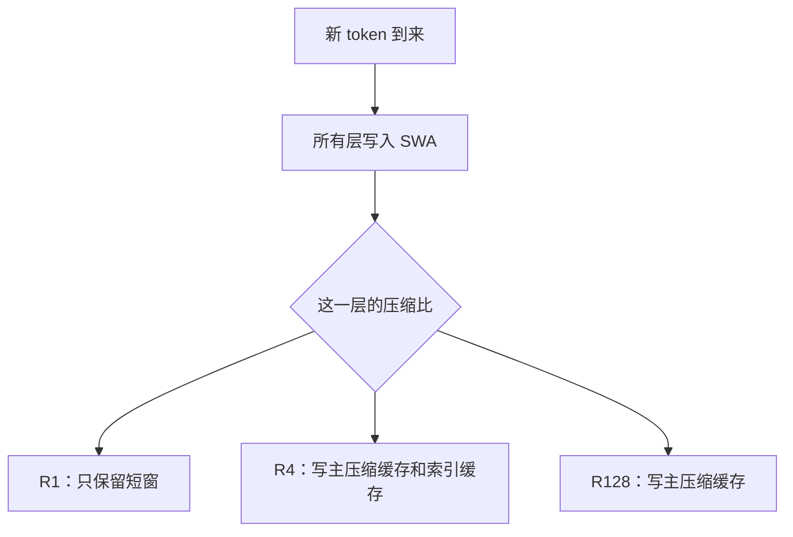
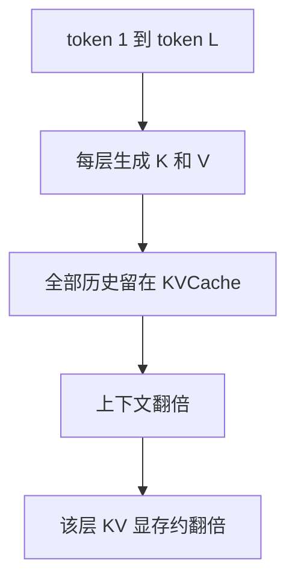
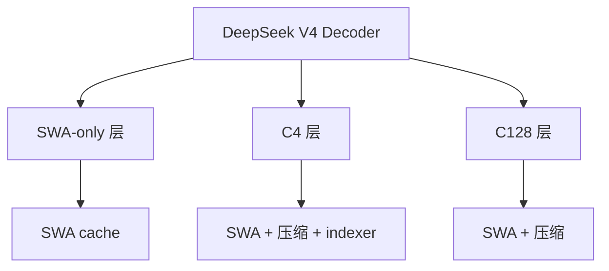
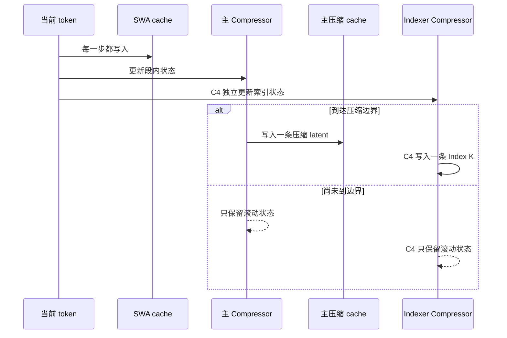
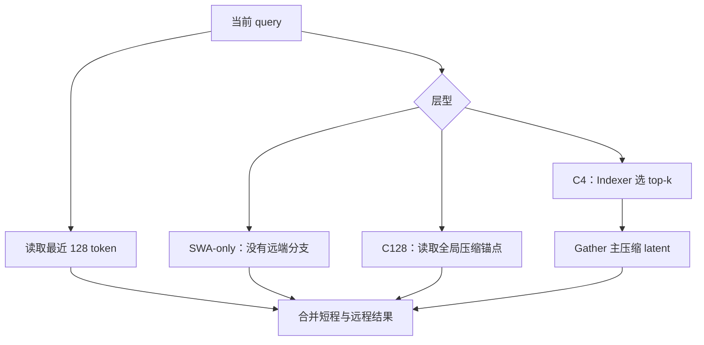
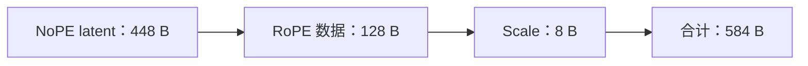
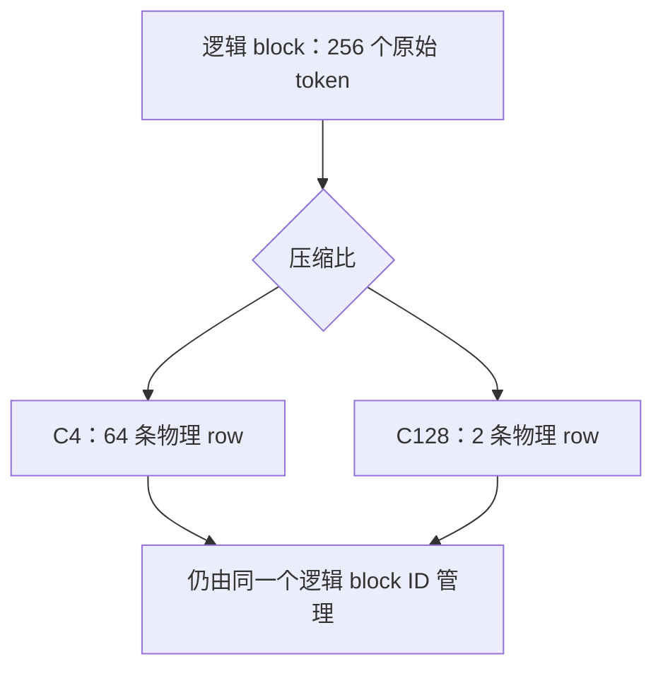
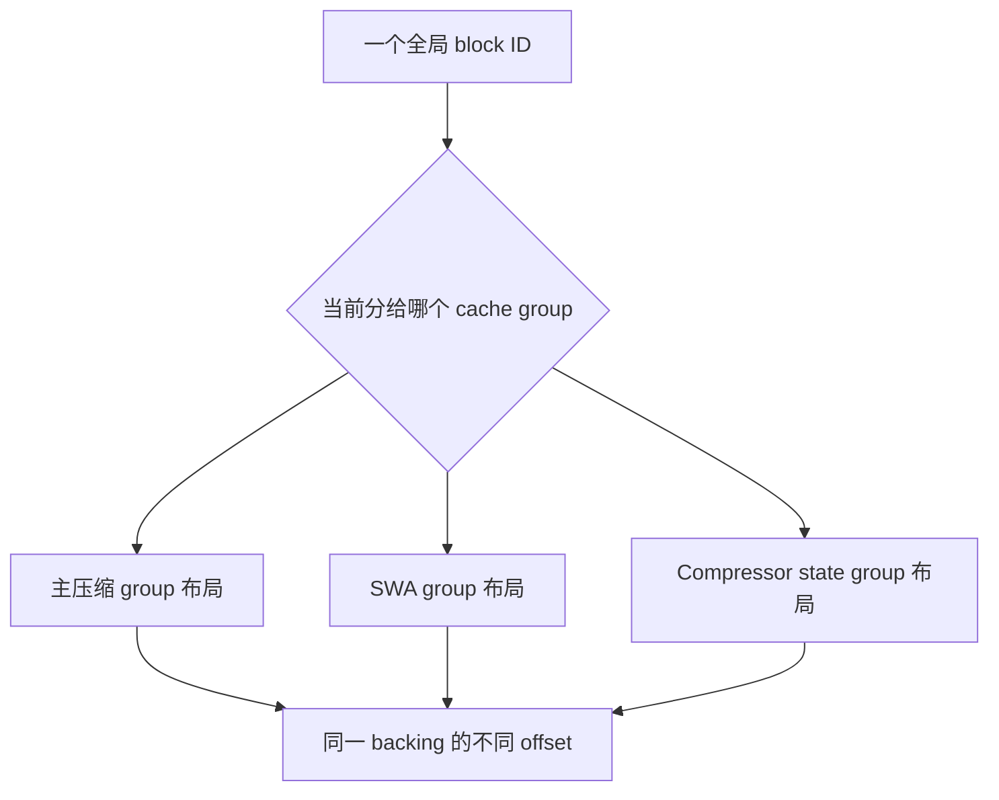
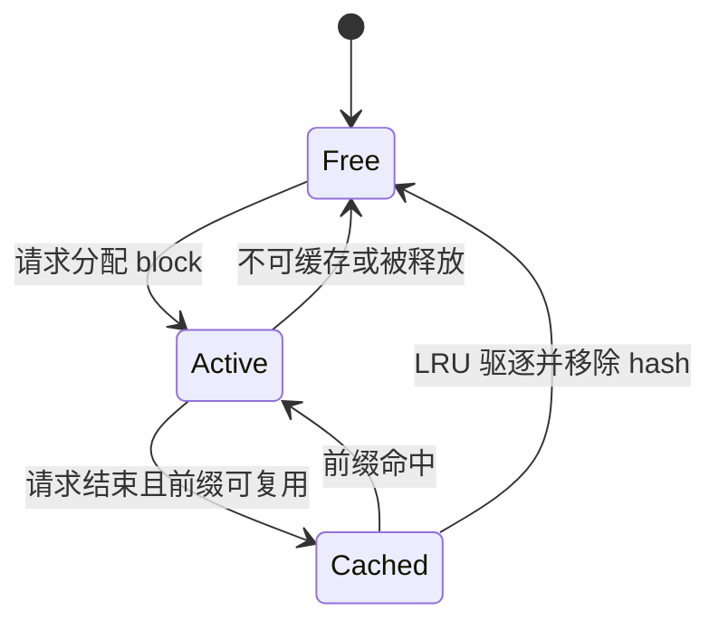
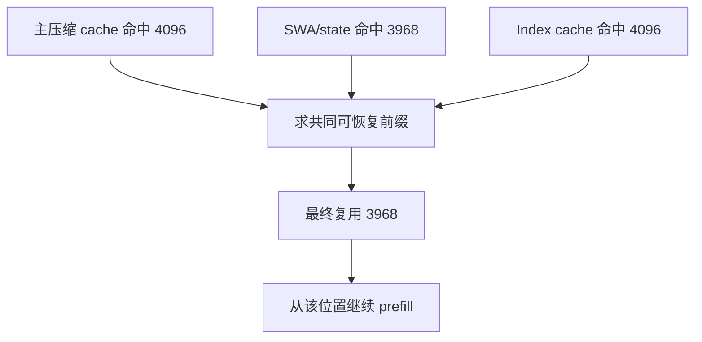

> 本文面向第一次接触 KVCache、Paged Attention 和 DeepSeek V4 的读者。我们不从 kernel 名字出发，而是先回答三个直观问题：**模型到底记住了什么、这些内容怎样放进显存、请求结束后又怎样复用或释放**。
>
> 本文基于 vLLM [`main@6accb779`](https://github.com/vllm-project/vllm/commit/6accb779a361c723cded3f9422b48d3fe4da0901) 分析。Kimi K3 的对应设计见姐妹篇：[《从零看懂 vLLM 中的 Kimi K3 KVCache》](/articles/kimi-k3-kvcache-vllm-beginner-guide/)。如果想先了解 DeepSeek V4 的 SWA page 读取 kernel，可继续阅读[这篇算子分析](/articles/pto-deepseek-v4-swa-page-run-tload/)。

## 先看模型结构：KVCache 发生在哪里？

*结构图可点击打开原尺寸 SVG；在手机上建议横屏查看。*

可以先沿左侧从上往下读：token 经过 Embedding 后，在第一个 Decoder Layer 内被 mHC 展开成 4 条 residual streams；主干串行经过 Flash 的 43 层或 Pro 的 61 层 Decoder，再由 mHC Head 收拢、RMSNorm，最后进入 LM Head。右侧则放大了一个 Decoder Layer：**SWA-only、C4、C128 改变的是 Sparse MLA 的远近记忆方式，mHC 与 MoE 骨架不变。**

这里有两个容易画错的边界。第一，mHC 的 4 条流不是 TP=4，也不是 4 个并行模型，而是层间持续混合的 4 条 hidden residual streams；它不能简化成普通 Transformer 的单个 residual Add。第二，MTP 是投机推理时可选的 draft sidecar，不属于 43/61 个 target 主干层。对应实现可对照 [`DeepseekV4DecoderLayer` 与主干 forward](https://github.com/vllm-project/vllm/blob/6accb779a361c723cded3f9422b48d3fe4da0901/vllm/models/deepseek_v4/nvidia/model.py#L817-L1214)，以及[单独的 MTP 模块](https://github.com/vllm-project/vllm/blob/6accb779a361c723cded3f9422b48d3fe4da0901/vllm/models/deepseek_v4/nvidia/mtp.py#L80-L279)。

## 再看缓存全景

## 阅读路线

1. [先建立普通 KVCache 与 MLA 的直觉](#1-为什么传统-kvcache-会越来越大)
2. [认识 SWA-only、C4、C128 三类层](#2-deepseek-v4-的三类层)
3. [逐一拆开一层内部的 cache](#3-一层内部究竟有哪些-cache)
4. [跟踪一个 token 的写入与读取](#4-一个-token-是怎样写入这些-cache-的)
5. [看懂 584 B row、物理 page 与 packed slab](#6-从一条-row-到一张物理-page)
6. [理解 BlockPool、Prefix Cache 与显存增长](#8-blockpool-怎样管理请求生命周期)

## 先看结论

传统 Transformer 往往让每个注意力层保存从第一个 token 到当前 token 的完整 K 和 V。DeepSeek V4 改成了三层记忆：

1. **所有层都有 SWA**：精确保留最近 128 个 token；
2. **C4 层每 4 个 token 产生一条压缩历史**，并用 indexer 为当前 query 选出最值得读取的远端历史；
3. **C128 层每 128 个 token 产生一条更稀疏的全局锚点**。

这不是简单的“每隔 4/128 个 token 抽样一次”。压缩器会持续维护 FP32 状态，到了边界才把最近一段历史融合成一条新的 latent。vLLM 还必须同时管理短窗页、压缩页、索引页和压缩器状态页，因此 DeepSeek V4 的难点不只是 Attention 算法，更是**多种 page 几何如何共用一个显存池**。

---

## 1. 为什么传统 KVCache 会越来越大？

自回归生成一次只增加一个 token。为了生成第 1001 个 token，模型仍需让当前 query 读取前 1000 个 token 的 K/V。如果每次都重新计算前缀，代价非常高，于是推理框架把历史 K/V 留在显存中，这就是 KVCache。

对一个普通注意力层，可先用下面的直觉公式理解显存：

$$
M_{KV}=L\times 2\times H_{KV}\times D\times S
$$

- $L$：已经缓存的 token 数；
- $2$：K 和 V 两份数据；
- $H_{KV}$：KV head 数；
- $D$：每个 head 的维度；
- $S$：每个元素的字节数，例如 BF16 为 2。

模型层数多、上下文长时，这个线性增长非常昂贵。DeepSeek V4 的思路是：**近处保真，远处压缩，而且让不同层采用不同时间分辨率。**

### 先补一个概念：MLA 为什么不保存两份完整 K/V？

DeepSeek V4 使用 MLA（Multi-head Latent Attention）。可以先把它理解成：模型不再把许多 KV heads 的完整 K、V 都原样存下来，而是把它们压进一份共享 latent，需要计算 Attention 时再通过投影恢复所需信息。

在本文分析的 DeepSeek V4 路径中，这份 latent 的逻辑 head size 是 512，并另外处理 RoPE 信息。因此后文看到的“512 维 latent row”已经不是传统公式里的“两份完整 K/V”。DeepSeek V4 随后还会沿时间维把这些 latent 进一步压缩成 C4/C128 历史——这是第二层压缩。

## 2. DeepSeek V4 的三类层

vLLM 从模型配置的 `compress_ratios` 读取每层压缩比，并通过 `max(1, ratio)` 把配置中的 0 解释为 ratio 1；MTP 层也走 ratio 1。只有 ratio 大于 1 时才创建主压缩 cache，只有 C4 层才额外创建 indexer。对应初始化代码见 [`DeepseekV4Attention`](https://github.com/vllm-project/vllm/blob/6accb779a361c723cded3f9422b48d3fe4da0901/vllm/models/deepseek_v4/attention.py#L198-L348)。

| 层型 | 最近 128 token | 远端历史 | 远端选择方式 |
|---|---|---|---|
| SWA-only，也可写作 R1 | 精确保留 | 不保存主压缩历史 | 无 |
| C4 | 精确保留 | 每 4 token 一条压缩 latent | Lightning Indexer 做 query-dependent top-k |
| C128 | 精确保留 | 每 128 token 一条压缩 latent | 读取稀疏的全局锚点集合 |

当前官方配置对应的主干层数如下。最后一项 MTP ratio 不计入主干层数：

| Checkpoint | 主干层 | SWA-only | C4 | C128 | Index top-k |
|---|---:|---:|---:|---:|---:|
| DeepSeek V4 Flash | 43 | 2 | 21 | 20 | 512 |
| DeepSeek V4 Pro | 61 | 0 | 30 | 31 | 1024 |

配置来源：[DeepSeek V4 Flash](https://huggingface.co/deepseek-ai/DeepSeek-V4-Flash/blob/main/config.json) 和 [DeepSeek V4 Pro](https://huggingface.co/deepseek-ai/DeepSeek-V4-Pro/blob/main/config.json)。

这里最容易产生一个误解：C4 并不是“只看第 4、8、12 个原始 token”。它看见的是压缩器对每一段历史形成的表示；压缩器在段内每一步都更新状态，只是在压缩边界才输出一条长期记录。

## 3. 一层内部究竟有哪些 cache？

### 3.1 每层都有 SWA cache

SWA 是 Sliding Window Attention，即滑动窗口注意力。DeepSeek V4 的窗口是 128；vLLM 为它固定使用 64-token 的物理 block，因此稳定状态下最近窗口大致覆盖两个 block，边界时可能暂时涉及额外 block。

它保存的仍是当前 token 的 512 维 latent 表示，只是只保留最近一小段。相关定义见 [`DeepseekV4SWACache`](https://github.com/vllm-project/vllm/blob/6accb779a361c723cded3f9422b48d3fe4da0901/vllm/v1/attention/backends/mla/sparse_swa.py#L56-L108)。

### 3.2 C4/C128 有主 compressor state

压缩不能凭空完成。每个 C4/C128 层还有一个 `CompressorStateCache`，用于累计尚未输出的局部历史：

- C4 使用 8-token 的状态窗口、4-token block；
- C128 使用 128-token 的状态窗口、8-token block；
- 状态用 FP32 保存，避免递归累计时精度过快损失；
- 状态是 KV manager 管理的滚动页，不是用完即丢的临时 workspace。

状态形状和窗口配置在 [`CompressorStateCache`](https://github.com/vllm-project/vllm/blob/6accb779a361c723cded3f9422b48d3fe4da0901/vllm/models/deepseek_v4/compressor.py#L150-L208) 中定义。

### 3.3 C4 还有一套 indexer cache

C4 的历史条目约有 $L/4$ 条。上下文达到百万 token 时，仍然可能有二十多万条，不能每次全读。于是 C4 层加入 Lightning Indexer：

- 保存一份更小的 K-only 索引 cache；
- 当前 query 先与索引 key 计算相关度；
- 选出 top-k 压缩位置；
- 主注意力再读取这些位置对应的压缩 latent。

Indexer 自己也要压缩，所以 C4 实际上还有一份 indexer compressor state。其 cache spec 和 FP8/MXFP4 格式可见 [indexer 实现](https://github.com/vllm-project/vllm/blob/6accb779a361c723cded3f9422b48d3fe4da0901/vllm/models/deepseek_v4/attention.py#L666-L865)。

| 层型 | SWA | 主 compressor state | 主压缩 cache | Indexer state | Index K cache |
|---|:---:|:---:|:---:|:---:|:---:|
| SWA-only | ✓ |  |  |  |  |
| C4 | ✓ | ✓ | ✓ | ✓ | ✓ |
| C128 | ✓ | ✓ | ✓ |  |  |

## 4. 一个 token 是怎样写入这些 cache 的？

下面的时间线同时适用于 prefill 和 decode；区别只是一次处理多少 token。vLLM 先计算 query、RoPE 和当前 latent，然后让 SWA 写入与压缩路径并行推进。核心 forward 组织见 [`DeepseekV4Attention.forward`](https://github.com/vllm-project/vllm/blob/6accb779a361c723cded3f9422b48d3fe4da0901/vllm/models/deepseek_v4/attention.py#L355-L530)。

压缩位置的映射规则非常直接：

$$
\text{is\_valid}=((position+1)\bmod R=0)
$$

$$
\text{compressed\_position}=\left\lfloor\frac{position}{R}\right\rfloor
$$

也就是说，R4 在原始位置 3、7、11、……完成一次写入，R128 在位置 127、255、……完成一次写入。实际 slot 还要经 block table 转换为物理 block 与 block 内 offset；该映射由 [`get_compressed_slot_mapping`](https://github.com/vllm-project/vllm/blob/6accb779a361c723cded3f9422b48d3fe4da0901/vllm/v1/attention/backends/mla/compressor_utils.py) 生成。

当前 token 写 SWA 时，则直接使用普通 `slot_mapping`。FP8 packed、普通 FP8 和 BF16 三种写入视图可见 [fused cache insert](https://github.com/vllm-project/vllm/blob/6accb779a361c723cded3f9422b48d3fe4da0901/vllm/models/deepseek_v4/attention.py#L531-L643)。

## 5. 计算 Attention 时读哪些内容？

写入和读取要分开理解。C4 indexer 的 top-k 是**本次 query 的读取计划**，不是 cache 淘汰策略。没被本次 query 选中的压缩历史依然留在 cache 中，因为后面的 query 可能需要它。

三种层因此承担不同职责：

- SWA-only 强化局部连续性；
- C4 用较高时间分辨率保存远端信息，再按 query 稀疏选择；
- C128 以极低成本建立覆盖整段上下文的粗粒度骨架。

这也是为什么只说“DeepSeek V4 把 KV 压缩 4 倍或 128 倍”并不准确：同一层还同时保留 SWA，而且 C4 另有索引与状态成本。

## 6. 从一条 row 到一张物理 page

以下数字针对 NVIDIA 路径常见的 `fp8_ds_mla` packed layout。其他 backend 也可能使用 BF16 或 plain FP8，后文会单独说明。

### 6.1 一条压缩 latent 为什么是 584 B？

逻辑 head size 是 512，但 packed row 不等于简单的 512 个 FP8 字节。vLLM 的 DeepSeek V4 特殊布局由 NoPE、RoPE 数据和 scale 组成：

这里的 576 B 是数据 stride/页对齐单位，**不是一条完整 row 的字节数**。`MLAAttentionSpec` 对 DeepSeek V4 明确按 584 B 计算真实 page，再向 alignment 取整；见 [`MLAAttentionSpec.real_page_size_bytes`](https://github.com/vllm-project/vllm/blob/6accb779a361c723cded3f9422b48d3fe4da0901/vllm/v1/kv_cache_interface.py#L403-L442)。

### 6.2 逻辑 block 和 storage block 不是一回事

在当前 NVIDIA FlashMLA sparse backend 中，主 sparse MLA 使用 256 个原始 token 作为一个逻辑 block。压缩后，实际只需存：

$$
B_{storage}=\frac{256}{R}
$$

在 `fp8_ds_mla` 下，主要 page 大小如下：

| Cache page | 原始内容 | 576 B 对齐后 |
|---|---:|---:|
| SWA，64 rows | $64\times584=37,376$ B | 37,440 B |
| C4 主压缩，64 rows | $64\times584=37,376$ B | 37,440 B |
| C128 主压缩，2 rows | $2\times584=1,168$ B | 1,728 B |
| C4 主 state，4 × 2048 FP32 | 32,768 B | 32,832 B |
| C128 主 state，8 × 1024 FP32 | 32,768 B | 32,832 B |
| C4 indexer state，4 × 512 FP32 | 8,192 B | 8,640 B |
| C4 index K，默认 FP8 | 8,448 B | 8,640 B |

这张表揭示了一个反直觉点：C128 主压缩页原始数据只有 1,168 B，但按页对齐后是 1,728 B。压缩越激进，固定的 page alignment 在比例上越明显。因此评估显存不能只算 $584/128$。

DeepSeek V4 sparse backend 的物理 shape 与约束可见 [`sparse_mla.py`](https://github.com/vllm-project/vllm/blob/6accb779a361c723cded3f9422b48d3fe4da0901/vllm/models/deepseek_v4/sparse_mla.py)，SWA backend 对 packed row 使用 `(num_blocks, block_size, 584)`，见 [`sparse_swa.py`](https://github.com/vllm-project/vllm/blob/6accb779a361c723cded3f9422b48d3fe4da0901/vllm/v1/attention/backends/mla/sparse_swa.py#L139-L151)。

### 6.3 不同 cache dtype 会改变数字

vLLM 的 DeepSeek V4 attention 能解析三类 cache 表示：

| 表示 | 单主 latent row 的直觉大小 | 特点 |
|---|---:|---|
| BF16 | $512\times2=1024$ B | 精度直观，显存更大 |
| plain FP8 | 512 B | 普通逐 row FP8 表示 |
| `fp8_ds_mla` | 584 B | DeepSeek MLA 专用 packed 数据与 scale |

所以 584 B 不是模型架构永远不变的常数，而是特定 backend/cache layout 的物理事实。格式选择逻辑见 [`_resolve_dsv4_kv_cache_dtype`](https://github.com/vllm-project/vllm/blob/6accb779a361c723cded3f9422b48d3fe4da0901/vllm/models/deepseek_v4/attention.py#L90-L120)。

## 7. 为什么 vLLM 要为 DeepSeek V4 做 packed slab？

现在问题出现了：同一个请求同时需要 37,440 B 的 SWA/C4 页、1,728 B 的 C128 页、32,832 B 的 state 页和 8,640 B 的 index 页。若每种类型单独预留一整片显存，会产生许多碎片；若统一按最大 page 处理，小 page 又会大量浪费。

vLLM 当前 main 为 DeepSeek V4 做了专用分组和 packed layout：

1. 主压缩 MLA/index cache 形成 full-cache group；
2. 滚动 cache 按 `(block_size, sliding_window)` 分组，例如主 SWA、C4 状态、C128 状态；
3. 同一 group 内，不同层的 page 在一个 slab 中按 offset 顺序排放；
4. 不同 group 可以复用同一 block ID 对应的地址范围，因为一个 block ID 在同一时刻只属于一个 group；
5. slab 的 `block_stride` 取各 group 所需 page 总和的最大值，而不是全部相加。

可以把它想象成一套可重复使用的抽屉：抽屉宽度按最宽的一类物品设计，但某一时刻整个抽屉只服务一种摆放模板。模板内部再把不同层的 page 紧密排列。它们只是**别名 view 共用 backing storage**，绝不是不同层共享同一份 KV 数值。

特殊分组逻辑位于 [`group_and_unify_kv_cache_specs`](https://github.com/vllm-project/vllm/blob/6accb779a361c723cded3f9422b48d3fe4da0901/vllm/v1/core/kv_cache_utils.py#L1542-L1706)，packed offset、stride 和 layer tuple 的构造见 [`_get_packed_kv_cache_layout`](https://github.com/vllm-project/vllm/blob/6accb779a361c723cded3f9422b48d3fe4da0901/vllm/v1/core/kv_cache_utils.py#L1249-L1410)。

## 8. BlockPool 怎样管理请求生命周期？

Paged KVCache 的关键并不是“每次请求都 `cudaMalloc`”。启动时，worker 根据 profiling 结果预先创建 backing storage；运行时 scheduler 分配和回收的是 block ID。

完整流程可以这样理解：

1. `KVCacheManager` 统计该请求在所有 cache groups 中还需要多少 block；
2. SWA/state manager 先移除已经滑出窗口的旧 block；
3. 只有当全局 `BlockPool` 能同时满足所有 group 时，才进行整次分配；
4. 请求结束后 block 的引用计数归零；
5. 有 prefix hash 的 block 可继续留在 free/LRU 队列，下一请求命中时重新激活；
6. 内存紧张时，从 LRU 尾部驱逐可缓存 block。

分配入口见 [`KVCacheManager.allocate_slots`](https://github.com/vllm-project/vllm/blob/6accb779a361c723cded3f9422b48d3fe4da0901/vllm/v1/core/kv_cache_manager.py#L345-L567)，引用计数和 LRU free queue 见 [`BlockPool`](https://github.com/vllm-project/vllm/blob/6accb779a361c723cded3f9422b48d3fe4da0901/vllm/v1/core/block_pool.py#L647-L807)。

### Prefix cache 为什么必须让多个 group 一致？

假设一个请求的主压缩 cache 命中了 4096 token，但 compressor state 只能恢复到 3968；框架不能直接从 4096 继续，因为下一条压缩 latent 会从错误状态出发。SWA、主压缩 cache、index cache 与 state cache 必须找到一个共同可恢复的边界。

数字只是示意，核心规则是：**Hybrid prefix hit 不能由命中最长的那个 group 决定，而要由所有必要状态共同决定。** 对应协调逻辑见 [`kv_cache_coordinator.py`](https://github.com/vllm-project/vllm/blob/6accb779a361c723cded3f9422b48d3fe4da0901/vllm/v1/core/kv_cache_coordinator.py#L601-L818)。

## 9. 怎样建立正确的显存直觉？

把显存分成两类最容易理解。

### 9.1 有界部分

- 每层的 128-token SWA；
- C4/C128 compressor state；
- C4 indexer compressor state；
- kernel 的固定 metadata/workspace。

它们会随并发请求数增加，但不会随单请求上下文无限增长。注意“有界”不代表小：C128 的 FP32 state 窗口仍可能占据可观容量。

### 9.2 随上下文增长的部分

- C4 主压缩 cache：约每 4 token 增长一条；
- C4 index K cache：约每 4 token 增长一条；
- C128 主压缩 cache：约每 128 token 增长一条。

下面只做**条件化的增长率推导**：假设使用 `fp8_ds_mla` 主 cache、默认 FP8 index cache，并由当前 worker/rank 持有表中全部主干层；同时忽略 page/block 取整。若使用 PP，本 rank 只应计入本地层；backend、layout 或 index dtype 改变时也必须重算。

在这些条件下，仅用 packed row payload 粗算，C4 每个原始 token、每层的长期增量为：

$$
\frac{584+132}{4}=179\ \text{B/token/layer}
$$

C128 为：

$$
\frac{584}{128}=4.5625\ \text{B/token/layer}
$$

因此每份 KV 存储视图的长期 payload 增速约为：

| 模型 | 粗略长期增速 |
|---|---:|
| V4 Flash | $21\times179+20\times4.5625\approx3.76$ KiB/token |
| V4 Pro | $30\times179+31\times4.5625\approx5.38$ KiB/token |

这不是 `gpu_memory_utilization` 的直接换算值。真实 capacity 还要加入：

- 每个请求的有界 SWA/state；
- 物理 block 取整；
- 576 B page alignment；
- packed group 的最大 stride 与 layer tuple；
- prefix cache 中暂未驱逐的 block；
- pipeline/tensor/data-context parallel 的实际切分；
- backend 与 cache dtype 差异。

正确做法是把上面的公式当作“增长方向”，再以 vLLM profiling 后生成的实际 KV cache config 为容量依据。

## 10. 七个常见误区

### 误区一：C4 就是每隔 4 个 token 抽一条原始 KV

不是。压缩器持续更新状态，边界处输出融合后的 latent。

### 误区二：所有层都保存 C4/C128 历史

不是。SWA-only 层只有短窗；C4 有主压缩和 indexer；C128 没有 C4 indexer。

### 误区三：top-k 之外的压缩 KV 会被删掉

不会。top-k 是当前 query 的读取索引，未来 query 可以选择另一组位置。

### 误区四：Compressor state 只是 kernel workspace

不是。它有自己的 cache spec、block table 和滑动窗口生命周期，属于统一 KV 管理的一部分。

### 误区五：`fp8_ds_mla` 每 token 是 576 B

不是。当前特殊布局的完整逻辑 row 是 584 B；576 B 同时出现在数据 stride/page alignment 语义中，不能混为一谈。

### 误区六：压缩 128 倍，物理 page 就恰好缩小 128 倍

不是。storage rows 确实变为 $256/128=2$，但 page 仍要满足 alignment，因此 1,168 B 会向上对齐到 1,728 B。

### 误区七：packed backing 意味着多层读取同一份 KV

不是。不同层、不同 group 获得不同 offset/stride view；复用的是物理地址空间模板，不是 KV 内容。

## 11. 源码阅读地图

建议按“逻辑层 → cache spec → scheduler → worker/backend”的顺序阅读：

| 想回答的问题 | 入口文件 |
|---|---|
| 一层何时创建 SWA、compressor、indexer？ | [`vllm/models/deepseek_v4/attention.py`](https://github.com/vllm-project/vllm/blob/6accb779a361c723cded3f9422b48d3fe4da0901/vllm/models/deepseek_v4/attention.py) |
| 压缩器状态长什么样？ | [`vllm/models/deepseek_v4/compressor.py`](https://github.com/vllm-project/vllm/blob/6accb779a361c723cded3f9422b48d3fe4da0901/vllm/models/deepseek_v4/compressor.py) |
| 压缩 token 如何映射到物理 slot？ | [`compressor_utils.py`](https://github.com/vllm-project/vllm/blob/6accb779a361c723cded3f9422b48d3fe4da0901/vllm/v1/attention/backends/mla/compressor_utils.py) |
| SWA page 和 backend metadata 如何组织？ | [`sparse_swa.py`](https://github.com/vllm-project/vllm/blob/6accb779a361c723cded3f9422b48d3fe4da0901/vllm/v1/attention/backends/mla/sparse_swa.py) |
| 584 B、compress ratio 和 page size 从哪里来？ | [`kv_cache_interface.py`](https://github.com/vllm-project/vllm/blob/6accb779a361c723cded3f9422b48d3fe4da0901/vllm/v1/kv_cache_interface.py) |
| DeepSeek V4 cache groups 怎样形成 packed slab？ | [`kv_cache_utils.py`](https://github.com/vllm-project/vllm/blob/6accb779a361c723cded3f9422b48d3fe4da0901/vllm/v1/core/kv_cache_utils.py) |
| 请求怎样申请和释放 block？ | [`kv_cache_manager.py`](https://github.com/vllm-project/vllm/blob/6accb779a361c723cded3f9422b48d3fe4da0901/vllm/v1/core/kv_cache_manager.py) |
| 空闲 block 怎样缓存、复用和 LRU 驱逐？ | [`block_pool.py`](https://github.com/vllm-project/vllm/blob/6accb779a361c723cded3f9422b48d3fe4da0901/vllm/v1/core/block_pool.py) |

## 12. 最后用一句话串起来

DeepSeek V4 的 KVCache 可以理解为：**用 SWA 精确保留近处，用 C4 构建可检索的中高分辨率远端记忆，用 C128 构建极稀疏的全局骨架，再由 vLLM 把这些形状完全不同的页打包进统一 BlockPool。**

如果继续追问性能问题，下一步应同时观察三件事：

1. 长上下文增长时，C4 主 cache 和 index cache 消耗了多少 block；
2. 高并发时，SWA 与 FP32 compressor state 占用了多少固定容量；
3. 实际 backend/cache dtype 下，packed stride 和 page padding 造成了多少额外容量。

下一篇将用同一套视角分析 Kimi K3：它不再采用 C4/C128，而是让 24 层 MLA 保存 token 级 latent，同时让 69 层 KDA 只维护固定大小的卷积与递归状态：[阅读姐妹篇](/articles/kimi-k3-kvcache-vllm-beginner-guide/)。
