> 本文面向第一次接触推理系统的读者。你不需要预先了解 MLA、线性注意力或 PagedAttention；我们会先从传统 KVCache 开始，再一步步解释 Kimi K3 为什么同时存在两种完全不同的缓存。
>
> 源码基线固定为 vLLM [`main@6accb779`](https://github.com/vllm-project/vllm/commit/6accb779a361c723cded3f9422b48d3fe4da0901)。这样即使未来 `main` 继续变化，本文的代码链接和计算仍然可以复现。模型结构取自 [Kimi K3 官方配置](https://huggingface.co/moonshotai/Kimi-K3/blob/main/config.json)。

如果你更关心“短窗 + 分层压缩”的另一条路线，可以继续阅读姐妹篇：[DeepSeek V4 的 KVCache 组织与管理](/articles/deepseek-v4-kvcache-vllm-beginner-guide/)。


## 阅读路线

1. [从普通 KVCache 建立直觉](#1-传统-kvcache-到底缓存什么)
2. [认识 Kimi K3 的 69 层 KDA 与 24 层 MLA](#2-93-层为什么分成-69-层-kda-和-24-层-mla)
3. [拆开 MLA latent 与 KDA 两份状态](#3-24-层-mla每个-token-只存一个-576-维-latent)
4. [看懂两种 page 如何自动对齐](#5-两种-page-大小悬殊vllm-怎么统一)
5. [理解四个 cache groups 与 BlockPool](#6-为什么最后是四个-cache-groups)
6. [理解 align、null、CoW 与显存预算](#7-align-prefix-cache为什么-block-table-很长resident-state-却很少)

## 先记住三个结论

1. Kimi K3 的 93 层并不都保存传统 KV：其中 **24 层 MLA 保存每个 token 的 latent cache，69 层 KDA 只保存递归状态**。
2. MLA cache 随上下文长度增长；KDA state 基本不随上下文增长，却会随并发请求数增长，而且其 FP32 recurrent matrix 很大。
3. vLLM 不为两类缓存建立两套互不相干的调度器。它先把 MLA page 与 KDA state page 对齐，再通过四个 cache groups 和一个全局 `BlockPool` 统一分配、复用和回收。

## 1. 传统 KVCache 到底缓存什么

自回归模型一次只生成一个新 token。第 1001 个 token 的注意力需要读取前 1000 个 token 的 Key 和 Value。如果每次都重新计算旧 token，会产生大量重复工作，因此推理框架会把每层已经算出的 K、V 保留下来。

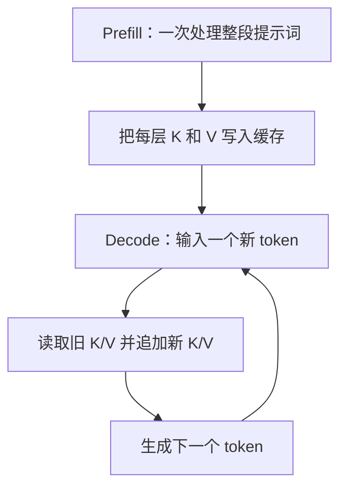

如果某一层有 $H_{KV}$ 个 KV heads，每个 head 的维度是 $D$，数据类型占 $s$ bytes，那么传统缓存每增加一个 token，大约增加：

$$
M_{\text{token, layer}} = 2 \times H_{KV} \times D \times s
$$

前面的 2 分别代表 K 和 V。因此，传统 KVCache 同时随“层数、序列长度、并发请求数”线性增长。

PagedAttention 只是把连续的大缓存切成固定 page/block：逻辑序列通过 block table 指向不连续的物理块。它改善分配、共享和碎片问题，但并没有改变“每个 token 都保存 K/V”这一基本事实。

Kimi K3 改变的正是这个基本事实。

## 2. 93 层为什么分成 69 层 KDA 和 24 层 MLA

Kimi K3 的文本主干共有 93 层。官方配置中的 `full_attn_layers` 是第 4、8、12、……、92、93 层，共 24 层；剩余 69 层走 KDA。vLLM 在构造每一层时通过 `config.is_kda_layer(layer_idx)` 选择实现：[层选择源码](https://github.com/vllm-project/vllm/blob/6accb779a361c723cded3f9422b48d3fe4da0901/vllm/models/kimi_k3/nvidia/model.py#L763-L840)。

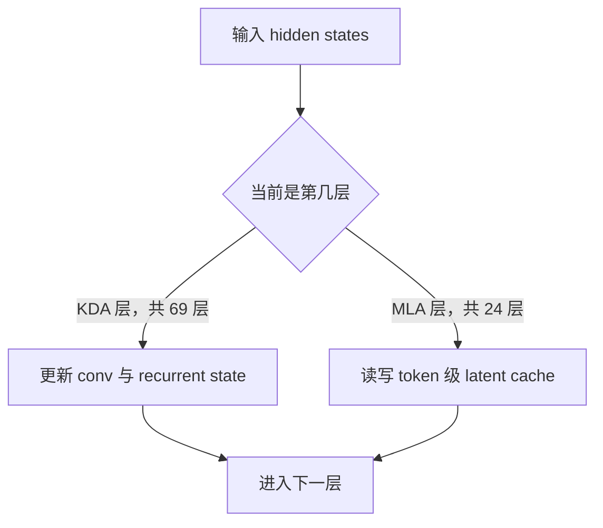

大部分位置接近“3 层 KDA + 1 层 MLA”的节奏，最后再补一个 MLA 层。可以把两者理解为互补分工：

| 层型 | 保存什么 | 能否直接按 token 回看历史 | 随序列长度增长 |
|---|---|---:|---:|
| MLA | 每个 token 的压缩 latent | 可以 | 是，$O(L)$ |
| KDA | 当前 causal-conv 状态与递归矩阵 | 不可以随机 gather 旧 token | 基本否，$O(1)$ |

这里最容易误解的一点是：**KDA state 在 vLLM 的统一接口中也叫 KV cache，但它并不是一排排历史 K/V。**它是线性注意力计算到当前位置后的“运行状态”。

另外，本文所说的 93 层特指 Kimi K3 的 `language_model`。多模态 wrapper 还包含视觉编码路径，但视觉中间表示属于 encoder/multimodal 输入管理，不是下面讨论的自回归 decoder KV cache。

## 3. 24 层 MLA：每个 token 只存一个 576 维 latent

MLA 是 Multi-head Latent Attention。普通多头注意力会为多个 KV heads 物化完整 K/V；Kimi K3 先把它们压缩到共享 latent，再在需要计算时通过投影权重完成 query 吸收和 value 上投影。

在当前配置中：

- `kv_lora_rank = 512`；
- 额外 key/PE 分量为 64 维；
- cache 对注意力 backend 呈现的 `head_size = 512 + 64 = 576`；
- `num_kv_heads = 1`，表示一份共享 latent cache，而不是模型只有一个 query head。

这个 576 维定义可以直接在 [Kimi MLA 初始化](https://github.com/vllm-project/vllm/blob/6accb779a361c723cded3f9422b48d3fe4da0901/vllm/models/kimi_k3/nvidia/mla.py#L107-L154) 和 [MLA cache spec](https://github.com/vllm-project/vllm/blob/6accb779a361c723cded3f9422b48d3fe4da0901/vllm/models/kimi_k3/nvidia/mla.py#L360-L383) 中看到。

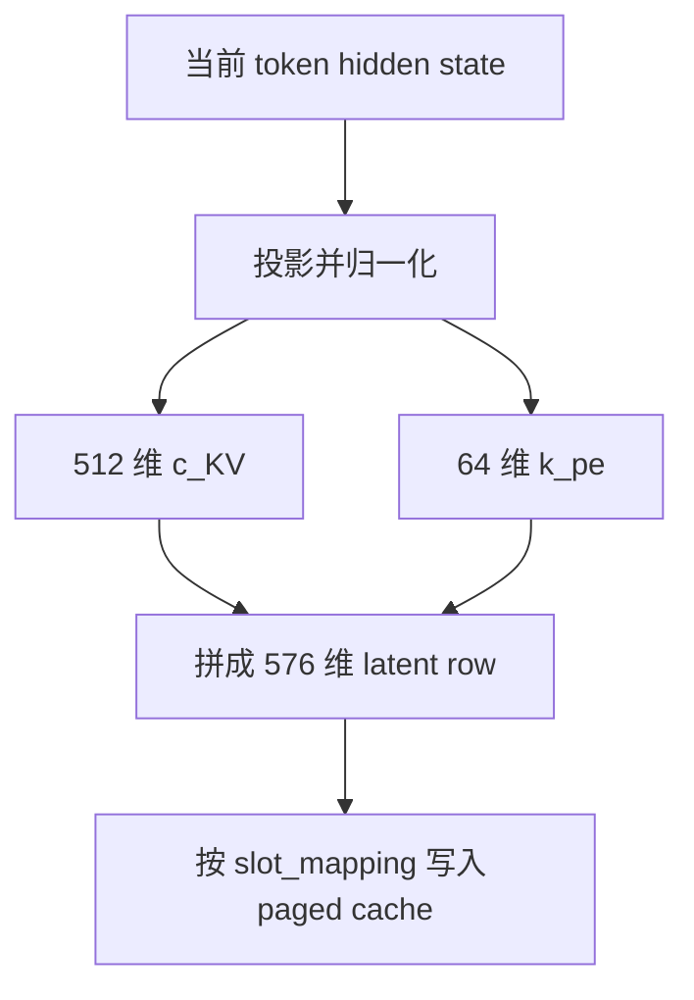

### 3.1 Decode 为什么不恢复完整 K/V

Decode 时，vLLM 预先把 `kv_b_proj` 拆成 `W_UK_T` 与 `W_UV`：

1. 用 `W_UK_T` 把 query 的 NoPE 部分吸收到 512 维 latent 空间；
2. 在 576 维 paged latent cache 上执行 multi-query attention；
3. 用 `W_UV` 把 latent attention 输出投影回 value 维度。

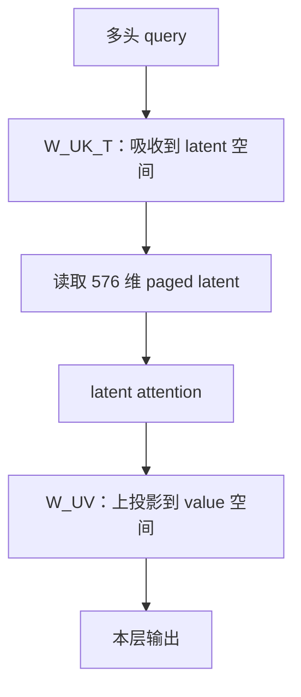

这意味着“低维存储”并不会在 decode 前重新展开成一份巨大的完整 K/V。对应代码在 [权重吸收](https://github.com/vllm-project/vllm/blob/6accb779a361c723cded3f9422b48d3fe4da0901/vllm/models/kimi_k3/nvidia/mla.py#L383-L430) 和 [decode latent MQA](https://github.com/vllm-project/vllm/blob/6accb779a361c723cded3f9422b48d3fe4da0901/vllm/models/kimi_k3/nvidia/mla.py#L542-L676)。Prefill 与 decode 的 fused epilogue 都会自己完成 cache insert，因此热路径中没有额外的独立 `do_kv_cache_update` kernel。

### 3.2 一条 latent 到底占多少显存

逻辑向量都是 576 维，但物理字节数取决于 cache dtype 和 backend layout：

| cache dtype/layout | 每 token、每 MLA 层 | 说明 |
|---|---:|---|
| BF16 | 1152 B | $576\times2$ |
| plain FP8 | 576 B | 每元素 1 byte |
| `fp8_ds_mla` | 656 B | backend 的自缩放 packed layout，包含 scale/layout 开销 |

`cache_dtype=auto` 会跟随模型 dtype；官方 Kimi K3 checkpoint 是 BF16，因此“BF16 1152 B”是后文条件示例采用的值。`fp8_ds_mla` 的 656 B 是物理布局，不能错误地按 576 B 计算。[通用 MLA page 公式](https://github.com/vllm-project/vllm/blob/6accb779a361c723cded3f9422b48d3fe4da0901/vllm/v1/kv_cache_interface.py#L403-L442) 与 [Kimi fused prefill 的布局说明](https://github.com/vllm-project/vllm/blob/6accb779a361c723cded3f9422b48d3fe4da0901/vllm/models/kimi_k3/nvidia/mla.py#L714-L790) 给出了这一差别。

如果忽略 block 向上取整，24 个 MLA 层的 BF16 cache 密度为：

$$
24\times576\times2=27{,}648\ \text{B/token/rank}
$$

注意这里的共享 latent 不会像 KDA heads 那样简单除以 TP；每个 TP rank 都需要服务自己本地 query heads 所访问的 latent。

## 4. 69 层 KDA：缓存的是两个运行状态

KDA 可以把过去的计算递归到固定形状的 state 中。每来一个 token，它读取旧 state、产生当前输出，再原地更新 state。它不能像传统 attention 那样用 block table 随机取回“第 137 个 token 的 K/V”。

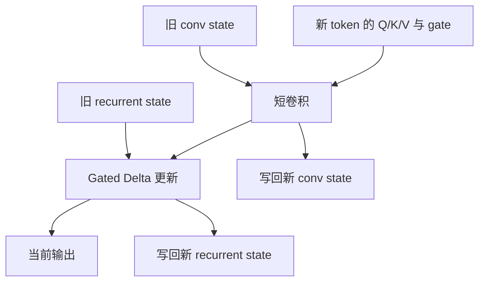

在 vLLM 中，KDA 层的 `self.kv_cache` 实际是一个二元组：

```text
(conv_state, recurrent_state)
```

decode 的 fused kernel 会按请求对应的 `state_indices` 原地更新它们；prefill 在完成一个 chunk 后写入该请求的最终状态。可以在 [KDA state 接口](https://github.com/vllm-project/vllm/blob/6accb779a361c723cded3f9422b48d3fe4da0901/vllm/models/kimi_k3/nvidia/kda.py#L286-L326) 和 [KDA forward 读取 state](https://github.com/vllm-project/vllm/blob/6accb779a361c723cded3f9422b48d3fe4da0901/vllm/models/kimi_k3/nvidia/kda.py#L520-L590) 中对应起来。

### 4.1 State shape 从哪里来

Kimi K3 的 KDA 配置为：

- heads $H=96$；
- head dimension $D=128$；
- short-conv kernel width $K=4$；
- TP size 记为 $t$；
- speculative token 数记为 $s$。

Q、K、V 各需要一份短卷积历史，因此：

$$
\text{conv shape}=
\left(\frac{3HD}{t},\ K-1+s\right)
=\left(\frac{36{,}864}{t},\ 3+s\right)
$$

递归状态则是每个本地 head 一张 $D\times D$ 矩阵：

$$
\text{recurrent shape}=
\left(\frac{H}{t},\ D,\ D\right)
=\left(\frac{96}{t},128,128\right)
$$

vLLM 默认让 conv state 跟随模型/cache dtype，而 KDA recurrent state 固定使用 FP32。相关公式来自 [KDA dtype calculator](https://github.com/vllm-project/vllm/blob/6accb779a361c723cded3f9422b48d3fe4da0901/vllm/model_executor/layers/mamba/mamba_utils.py#L120-L138) 和 [KDA shape calculator](https://github.com/vllm-project/vllm/blob/6accb779a361c723cded3f9422b48d3fe4da0901/vllm/model_executor/layers/mamba/mamba_utils.py#L271-L294)。

在“BF16 conv、无 speculative decoding”条件下，一层 KDA 的原始状态大小为：

$$
\begin{aligned}
M_{\text{conv}}(t)
&=\frac{36{,}864}{t}\times3\times2 \\
&=\frac{221{,}184}{t}\ \text{B} \\
M_{\text{rec}}(t)
&=\frac{96}{t}\times128\times128\times4 \\
&=\frac{6{,}291{,}456}{t}\ \text{B} \\
M_{\text{KDA}}(t)
&=\frac{6{,}512{,}640}{t}\ \text{B}
\end{aligned}
$$

可以看到，显存主要消耗在 FP32 recurrent matrix，而不是宽度只有 3 的 conv history。

### 4.2 TP=8 的条件示例

当 $t=8$：

- conv state：27,648 B；
- recurrent state：786,432 B；
- 合计：814,080 B，即 795 KiB/层/状态快照；
- 69 层合计约 53.57 MiB/状态快照，尚未计算 page padding。

这个数字基本不随 prompt 从 1K 增长到 100K 而变化，但每多一个并发请求，就需要另一份独立运行状态。

## 5. 两种 page 大小悬殊，vLLM 怎么统一

现在矛盾出现了：BF16 MLA 每 token 只有 1152 B，而 TP=8 时一个 KDA state page 原始大小为 814,080 B。如果保持普通的 16-token attention block，一个 MLA page 只有 18 KiB，完全无法与 KDA page 放进统一的物理 block 几何。

vLLM 的处理办法是自动放大 MLA block size，并把 KDA page padding 到同样大小。简化后的约束是：

$$
B_{\text{MLA}}\times b_{\text{MLA}}\ge M_{\text{KDA}}
$$

同时 backend 要求 MLA block size 按 128 token 对齐，所以：

$$
B_{\text{MLA}}
=128\left\lceil
\frac{M_{\text{KDA}}}{128\times b_{\text{MLA}}}
\right\rceil
$$

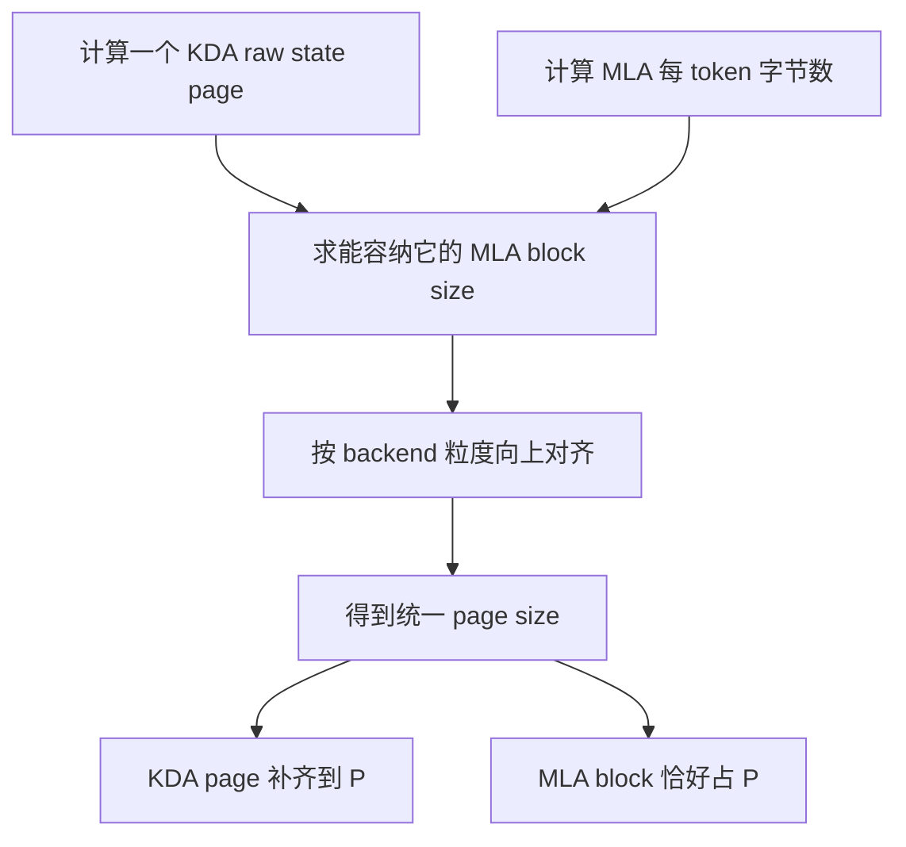

### TP=8、BF16 的条件推导

以下数字明确限定为：**TP=8、BF16 MLA/KDA conv、无 speculative decoding、不额外考虑 PP/CP、backend 对齐粒度 128**。

$$
B=128\left\lceil\frac{814{,}080}{128\times1{,}152}\right\rceil
=768\ \text{tokens}
$$

$$
P=768\times1{,}152=884{,}736\ \text{B}=0.84375\ \text{MiB}
$$

于是 KDA raw state 从 814,080 B padding 到 884,736 B：相对 raw state 增加约 8.68%，统一 page 中约 7.99% 是 padding。换成 FP8 cache、不同 TP、开启 speculative decoding 或使用其他 backend，$B$ 和 $P$ 都会重新计算，不能照抄 768。实现见 [hybrid block/page 自动对齐](https://github.com/vllm-project/vllm/blob/6accb779a361c723cded3f9422b48d3fe4da0901/vllm/platforms/interface.py#L765-L940)。

## 6. 为什么最后是四个 cache groups

vLLM 先按 cache spec 把同类层放进 bucket，再把不同类型切成相同的 group size。当前通用算法先取较小层数作为候选：

$$
\text{group size}=\min(24,69)=24
$$

69 层明显大于 $1.5\times24$，所以不会改用 69。于是，在全模型逻辑视角、暂不展开 PP 切分时：

- 24 个 MLA 层组成 1 个 group；
- 69 个 KDA 层切成 3 个 group，每组 23 层；
- 每个 KDA group 留 1 个空的 padding layer slot。

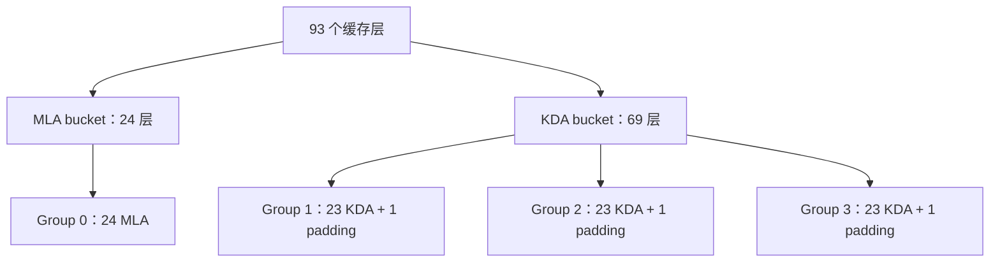

对应的分组与 `layers[i::num_groups]` 交错切分逻辑位于 [KV cache group 构造](https://github.com/vllm-project/vllm/blob/6accb779a361c723cded3f9422b48d3fe4da0901/vllm/v1/core/kv_cache_utils.py#L1106-L1246)。交错切分是为了在 Pipeline Parallel 场景尽量让各 stage 的 padding 均衡。

### 6.1 共享 backing 不等于共享数据

worker 为 group size 对应的 24 个 layer slots 建立等大的 backing。不同 group 中相同 slot 的层可以引用同一份物理 buffer 布局，因为一个 block ID 在同一时刻只归某一个 cache group 所有。

这不表示 MLA 和 KDA 读取彼此的数据。可以把它想成同一排 24 个仓库：今天某个编号的货位租给 MLA group，就不能同时租给 KDA group。

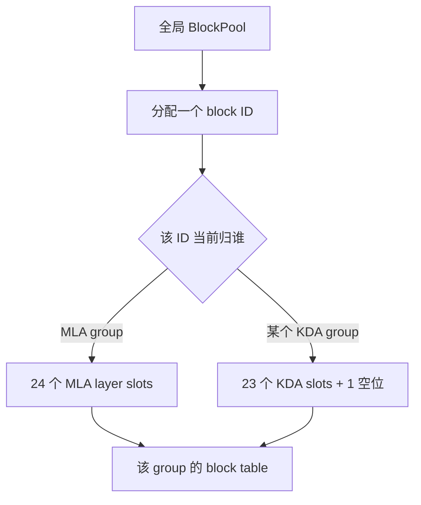

在上面的 TP=8 条件例中，一个 block ID 对应的 pool capacity 为：

$$
24P=24\times0.84375=20.25\ \text{MiB}
$$

这里说的是预分配池中的“容量消耗单位”，不是每处理一次请求就调用一次 `cudaMalloc`。worker 会先建立 raw backing，再把同一份 backing 绑定成各层需要的 attention 或 Mamba views：[GPU worker 的 cache 分配与 reshape](https://github.com/vllm-project/vllm/blob/6accb779a361c723cded3f9422b48d3fe4da0901/vllm/v1/worker/gpu/attn_utils.py#L150-L225)。

## 7. `align` prefix cache：为什么 block table 很长，resident state 却很少

### 7.1 默认为什么进入 `align`

当前 vLLM 的 `enable_prefix_caching` 默认为 `True`。对 Kimi K3 这类 hybrid Mamba/KDA 模型，如果 `mamba_cache_mode` 仍是 `none`，配置阶段会自动改成 `align`，并要求开启 chunked prefill。[默认 cache 配置](https://github.com/vllm-project/vllm/blob/6accb779a361c723cded3f9422b48d3fe4da0901/vllm/config/cache.py#L46-L124) 与 [Mamba hybrid 配置修正](https://github.com/vllm-project/vllm/blob/6accb779a361c723cded3f9422b48d3fe4da0901/vllm/model_executor/models/config.py#L582-L630) 说明了这一行为。

`align` 的目标不是保存每个历史边界的 KDA state，而是：

- block table 仍按完整序列位置索引，便于和 MLA 对齐；
- 旧的 KDA state slot 大多替换为同一个 null block；
- 通常只让“可复用的对齐边界状态”和“当前运行状态”常驻；
- 无 speculative decoding 时，每个 KDA 层最多按 2 个 state pages 预算。

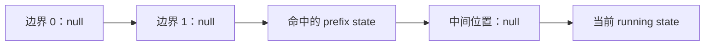

上图看起来有五个 block-table 位置，但只有 prefix state 与 running state 占真实数据页；所有 `null` 位置复用哨兵块。`MambaSpec` 明确规定 `align` 模式最大常驻量为 `(2 + num_speculative_blocks) × page_size`，同时 block-table 行仍覆盖最大序列长度：[MambaSpec 内存语义](https://github.com/vllm-project/vllm/blob/6accb779a361c723cded3f9422b48d3fe4da0901/vllm/v1/kv_cache_interface.py#L724-L783)。旧 state 的释放和 null 替换在 [Mamba state manager](https://github.com/vllm-project/vllm/blob/6accb779a361c723cded3f9422b48d3fe4da0901/vllm/v1/core/single_type_kv_cache_manager.py#L1400-L1515)。

### 7.2 Prefix hit 为什么需要 Copy-on-Write

假设请求 B 命中了请求 A 留下的 KDA 边界状态。这个状态现在属于 prefix cache，未来还可能被请求 C 复用；但 B 继续 decode 时又必须更新自己的运行状态。若直接原地覆盖，缓存中的公共前缀就被污染。

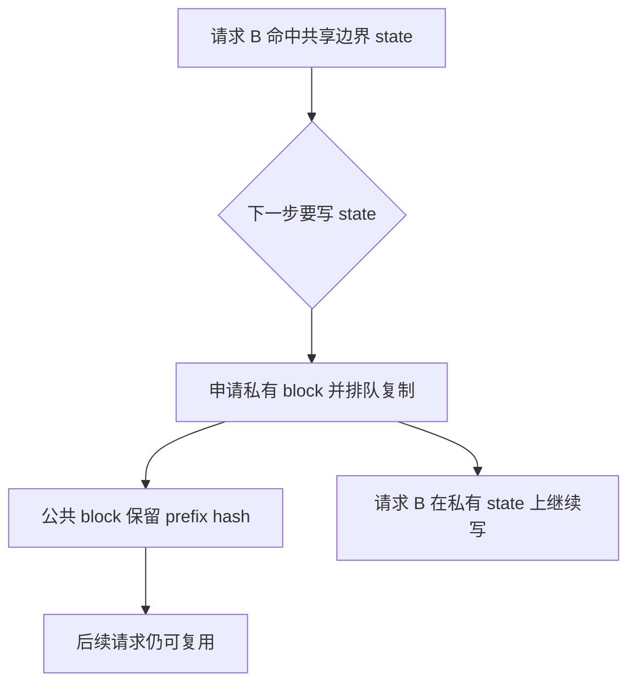

这就是 Copy-on-Write。具体方向会根据“运行请求继续持有哪个 block”调整：代码可以让 writer 留在 source block，同时把 prefix hash 和旧内容迁到 CoW block；关键不变量是“公共前缀内容不能被后续写覆盖”。当前实现见 [partial-hit CoW 分配与拷贝](https://github.com/vllm-project/vllm/blob/6accb779a361c723cded3f9422b48d3fe4da0901/vllm/v1/core/single_type_kv_cache_manager.py#L1516-L1645) 和 [BlockPool hash 迁移](https://github.com/vllm-project/vllm/blob/6accb779a361c723cded3f9422b48d3fe4da0901/vllm/v1/core/block_pool.py#L647-L704)。

### 7.3 MLA 命中不代表整个 Kimi K3 命中

Hybrid coordinator 会在全部 cache groups 之间反复收缩候选长度，直到得到共同可恢复的最长前缀。因此：

- 只有 MLA token pages 命中、没有对应 KDA boundary states：不能把整段都算作命中；
- 某个 KDA group 的边界更短：最终 hit length 会被缩到该边界；
- block hash 包含 group ID，不同缓存类型不会因为 token 内容相同而误用彼此的块。

共同命中的 fixed-point 过程见 [HybridKVCacheCoordinator](https://github.com/vllm-project/vllm/blob/6accb779a361c723cded3f9422b48d3fe4da0901/vllm/v1/core/kv_cache_coordinator.py#L601-L818)。

## 8. 一次请求到底消耗多少 cache capacity

继续沿用 TP=8、BF16、无 speculative decoding、统一 page $P=0.84375$ MiB、block size 768 的条件例。

### MLA 部分

长度为 $L$ 的请求需要：

$$
N_{\text{MLA blocks}}=\left\lceil\frac{L}{768}\right\rceil
$$

每个 MLA block ID 覆盖 24 层，消耗 20.25 MiB pool capacity。

### KDA 部分

`align` 模式无 speculative decoding时，每个 KDA group 最多保留 2 个 resident state blocks。3 个 KDA groups 合计最多 6 个 block IDs：

$$
M_{\text{KDA,pool cap}}=6\times20.25=121.5\ \text{MiB/request}
$$

其中包含 3 个 KDA groups、每组每份状态各一个 padding layer slot。若只按真实 69 层计算、每层预算两个对齐后的状态快照，则约为 116.44 MiB；其余约 5.06 MiB 来自三个 KDA groups 中每组一个空 slot，并且每个空 slot 同样按两个 resident pages 计入 pool capacity。

于是该条件下，每个 active request 的上界近似为：

$$
M_{\text{request}}
\approx
\left(
\left\lceil\frac{L}{768}\right\rceil+6
\right)\times20.25\ \text{MiB}
$$

> 这是用于理解 pool capacity 的条件推导，不是通用显存公式。权重、激活、CUDA Graph、workspace、allocator 余量均不在其中；短请求在调度瞬间也未必已经达到两个 resident KDA states。

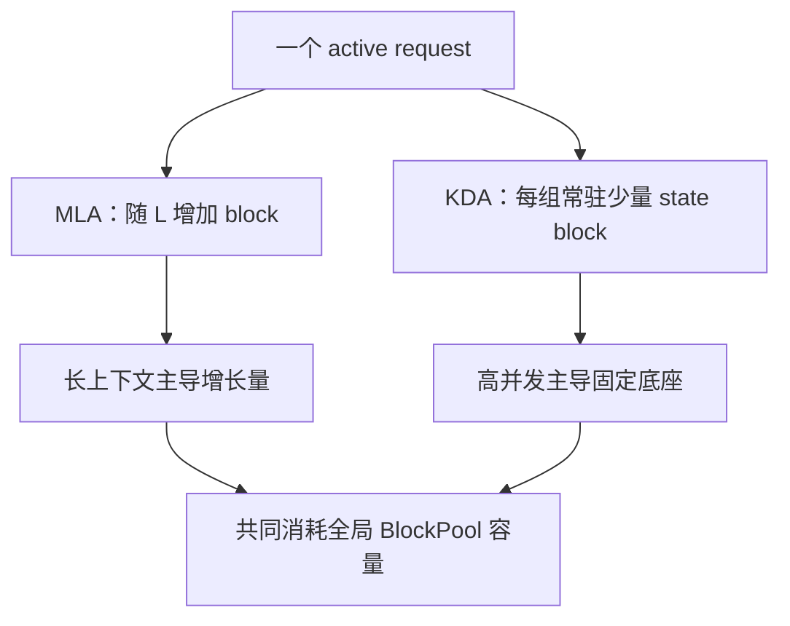

这给出了容量规划的直觉：

| 工作负载 | 更值得先关注 |
|---|---|
| 短 prompt、高并发 | KDA state 的固定底座与 page padding |
| 超长 prompt、并发较低 | 24 层 MLA 的 token 级增长 |
| 很短请求 | 768-token block 的尾部内部碎片 |
| 大 TP | KDA raw state 下降，但自动对齐后的离散台阶仍要实算 |

## 9. BlockPool 如何完成申请、复用与释放

四个 group 各有自己的逻辑 block table，但它们共享一个全局 `BlockPool`。scheduler 在一次调度中先汇总所有 group 的新增需求；只有总空闲块足够时才整体分配，避免 MLA 已经拿到块、KDA 却没有状态页的半完成状态。

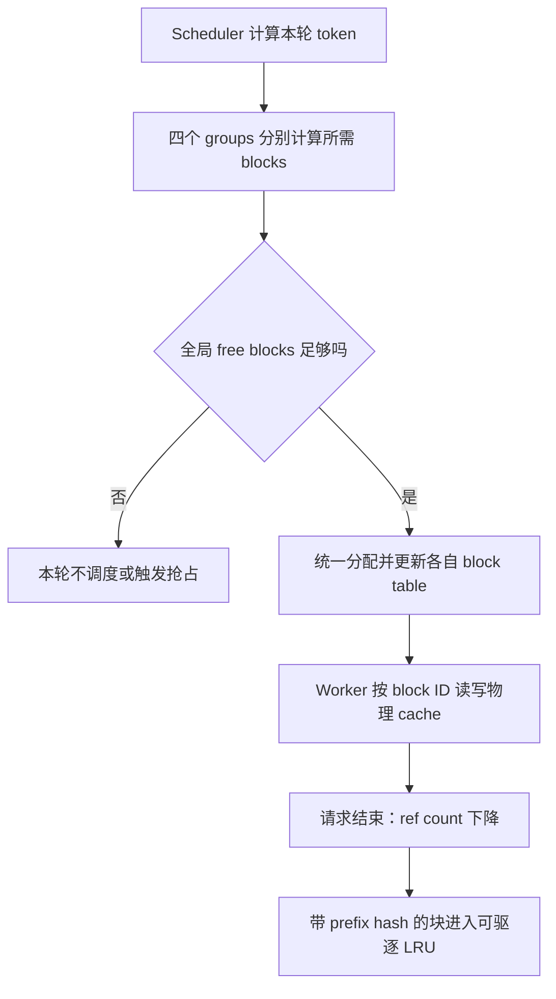

当请求结束时，“释放”也不一定等于立刻清空：

- 无 prefix hash 的 block 优先回到 free queue；
- 有 prefix hash 的 block 在 `ref_cnt=0` 后仍可作为 prefix cache 命中；
- 当新分配需要该块时，LRU 条目才被驱逐并清除 hash；
- null block 是统一管理的哨兵，不随普通请求释放。

参见 [KVCacheManager 的统一分配](https://github.com/vllm-project/vllm/blob/6accb779a361c723cded3f9422b48d3fe4da0901/vllm/v1/core/kv_cache_manager.py#L345-L567) 与 [BlockPool 分配、引用计数和 LRU](https://github.com/vllm-project/vllm/blob/6accb779a361c723cded3f9422b48d3fe4da0901/vllm/v1/core/block_pool.py#L677-L807)。

## 10. 六个常见误区

### 误区一：Kimi K3 有 93 层，所以 93 层都保存 token KV

错误。24 层保存 token 级 MLA latent；69 层保存 KDA state。

### 误区二：KDA 是 `O(1)`，所以它几乎不占显存

错误。它对序列长度近似 `O(1)`，但 FP32 recurrent matrix 很大，而且每个 active request 都需要独立状态。

### 误区三：576 维 latent 就一定是 576 bytes

错误。BF16 是 1152 B；plain FP8 才是 576 B；`fp8_ds_mla` packed layout 是 656 B。

### 误区四：TP=8 时 block size 永远是 768

错误。768 只属于本文明确给出的 BF16、无 speculative decoding等条件。dtype、TP、backend 和配置变化都会触发重新对齐。

### 误区五：KDA block table 覆盖一百万 token，就保存了一百万 token 的 state

错误。`align` 的表是位置索引；绝大多数历史位置是 null，只常驻少量可用状态页。

### 误区六：MLA prefix 命中后可以直接跳过整段 prefill

错误。vLLM 必须同时找到所有 KDA groups 可恢复的对齐边界，最终命中长度由最短的共同有效前缀决定。

## 11. 源码阅读地图

建议按“模型结构 → 单层缓存 → page spec → group → manager”的顺序阅读：

| 想解决的问题 | 入口 |
|---|---|
| 当前层为什么是 KDA 或 MLA | [`vllm/models/kimi_k3/nvidia/model.py`](https://github.com/vllm-project/vllm/blob/6accb779a361c723cded3f9422b48d3fe4da0901/vllm/models/kimi_k3/nvidia/model.py#L763-L840) |
| MLA 为什么是 576 维、如何写 cache | [`vllm/models/kimi_k3/nvidia/mla.py`](https://github.com/vllm-project/vllm/blob/6accb779a361c723cded3f9422b48d3fe4da0901/vllm/models/kimi_k3/nvidia/mla.py#L107-L154) |
| KDA 如何获得并更新两个 state | [`vllm/models/kimi_k3/nvidia/kda.py`](https://github.com/vllm-project/vllm/blob/6accb779a361c723cded3f9422b48d3fe4da0901/vllm/models/kimi_k3/nvidia/kda.py#L286-L326) |
| KDA shape/dtype 如何计算 | [`mamba_utils.py`](https://github.com/vllm-project/vllm/blob/6accb779a361c723cded3f9422b48d3fe4da0901/vllm/model_executor/layers/mamba/mamba_utils.py#L120-L138) |
| MLA/Mamba page 如何计字节 | [`kv_cache_interface.py`](https://github.com/vllm-project/vllm/blob/6accb779a361c723cded3f9422b48d3fe4da0901/vllm/v1/kv_cache_interface.py#L403-L442) |
| 两种 page 如何自动对齐 | [`platforms/interface.py`](https://github.com/vllm-project/vllm/blob/6accb779a361c723cded3f9422b48d3fe4da0901/vllm/platforms/interface.py#L765-L940) |
| 24/69 层如何切成 groups | [`kv_cache_utils.py`](https://github.com/vllm-project/vllm/blob/6accb779a361c723cded3f9422b48d3fe4da0901/vllm/v1/core/kv_cache_utils.py#L1106-L1246) |
| `align`、null 与 CoW | [`single_type_kv_cache_manager.py`](https://github.com/vllm-project/vllm/blob/6accb779a361c723cded3f9422b48d3fe4da0901/vllm/v1/core/single_type_kv_cache_manager.py#L1400-L1645) |
| 多 group prefix hit 如何取交集 | [`kv_cache_coordinator.py`](https://github.com/vllm-project/vllm/blob/6accb779a361c723cded3f9422b48d3fe4da0901/vllm/v1/core/kv_cache_coordinator.py#L601-L818) |
| 物理 block 如何分配和回收 | [`block_pool.py`](https://github.com/vllm-project/vllm/blob/6accb779a361c723cded3f9422b48d3fe4da0901/vllm/v1/core/block_pool.py#L647-L807) |

## 12. 最后总结

Kimi K3 的 KVCache 设计不是简单地把传统 KV 量化或分页，而是让两种层承担不同角色：

- 24 层 MLA 用 576 维 latent 保留可按 token 访问的历史，显存随上下文增长；
- 69 层 KDA 把前缀递归进 conv 与 FP32 matrix state，显存主要随并发增长；
- vLLM 自动放大 MLA block、padding KDA state page，把二者变成统一的分配单位；
- 24 MLA 与 69 KDA 被组织成 `1 × 24 MLA + 3 × 23 KDA` 四个逻辑 groups；
- `align` 模式用 null entries、少量 resident states 和 CoW，在有限显存下同时支持统一调度与 prefix reuse；
- 所有 groups 最终由一个 `BlockPool` 做容量准入、引用计数、LRU 复用和驱逐。

真正做显存预算时，不能只问“每 token 多少 bytes”，还必须同时问：**TP 是多少、KDA state page 多大、MLA block 被对齐到多少、每个请求有几个 resident state blocks、并发数是多少，以及 page/group padding 浪费多少。**

继续阅读：[DeepSeek V4 的 KVCache 组织与管理](/articles/deepseek-v4-kvcache-vllm-beginner-guide/)。
