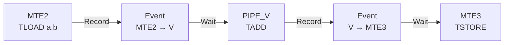
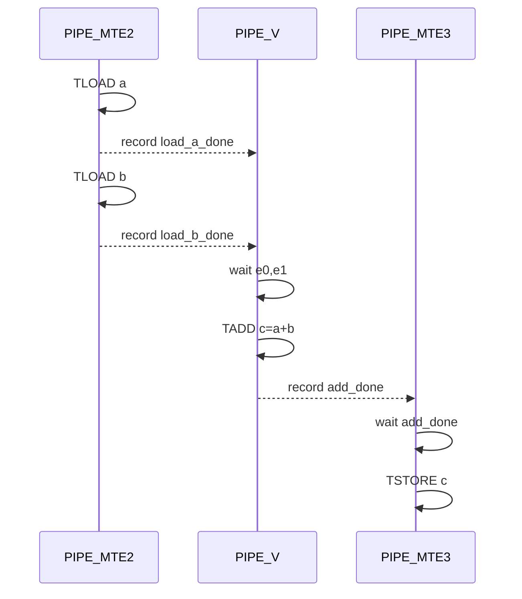
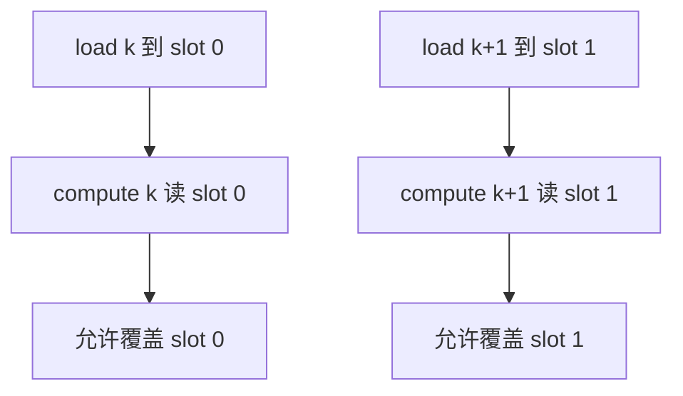

> 本章基于 `pto-isa@67e230d`。事件 API、opcode 到 pipe 的映射来自公共头文件；CPU-SIM 对设备时序的覆盖有限，因此本文把“数学结果验证”和“真实流水线同步验证”严格区分。

## 1. 核心问题

下面的代码具有 C++ 程序顺序：

```cpp
TLOAD(a, ga);
TLOAD(b, gb);
TADD(c, a, b);
TSTORE(gc, c);
```

但 PTO 指令可能由不同硬件流水线执行：

- `TLOAD`：`PIPE_MTE2`
- `TADD`：`PIPE_V`
- Vec `TSTORE`：`PIPE_MTE3`

“Host 依次发出”不自动等于“后一个 pipeline 已看到前一个 pipeline 的完成”。所以真正的依赖是：

```text
两个 load 完成 → vector add 才能读 a/b
vector add 完成 → store 才能读 c
```

## 2. Event 在 PTO ISA 中的位置



证据入口：

- [事件与同步规范](https://github.com/hw-native-sys/pto-isa/blob/67e230d5e92fe351303a8b5b7cc16809e4a0532e/docs/coding/Event_zh.md)
- [`event.hpp` 的 opcode、pipe 与 token 实现](https://github.com/hw-native-sys/pto-isa/blob/67e230d5e92fe351303a8b5b7cc16809e4a0532e/include/pto/common/event.hpp)
- [`TLOAD`](https://github.com/hw-native-sys/pto-isa/blob/67e230d5e92fe351303a8b5b7cc16809e4a0532e/docs/isa/TLOAD_zh.md)、[`TADD`](https://github.com/hw-native-sys/pto-isa/blob/67e230d5e92fe351303a8b5b7cc16809e4a0532e/docs/isa/TADD_zh.md)、[`TSTORE`](https://github.com/hw-native-sys/pto-isa/blob/67e230d5e92fe351303a8b5b7cc16809e4a0532e/docs/isa/TSTORE_zh.md)

## 3. 三个核心类型

### 3.1 `Op`：逻辑指令到 pipeline 的映射键

`event.hpp` 为 opcode 定义 pipe：

```cpp
TLOAD       -> PIPE_MTE2
TADD        -> PIPE_V
TSTORE_VEC  -> PIPE_MTE3
TMATMUL     -> PIPE_M
```

Event 用 `SrcOp/DstOp` 推导 producer 和 consumer pipeline，因此模板参数写错不是文档错误，而可能生成错误的 set/wait 关系。

### 3.2 `RecordEvent`：一条指令“可被记录”的返回值

多数 PTO builtin 返回 `RecordEvent`。它不携带计算数据，只是让下面的赋值语法成立：

```cpp
e0 = TLOAD(a, ga);
```

赋值会在 producer pipe 上记录 token。

### 3.3 `Event<SrcOp,DstOp>`：依赖边

逻辑接口包含：

```cpp
Wait();
Record();
operator=(RecordEvent);
```

- `Record`：producer 完成后设置 token；
- `Wait`：consumer 在使用输入前等待；
- event 作为后续指令的可变参数传入，builtin 内部统一执行 wait。

它更像数据流图中的一条边，而不是全设备 barrier。

## 4. 完整 16×16 fp32 加法

```cpp
using TileT = Tile<TileType::Vec, float, 16, 16>;

Event<Op::TLOAD, Op::TADD> load_a_done;
Event<Op::TLOAD, Op::TADD> load_b_done;
Event<Op::TADD, Op::TSTORE_VEC> add_done;

load_a_done = TLOAD(a, ga);
load_b_done = TLOAD(b, gb);
add_done = TADD(c, a, b, load_a_done, load_b_done);
TSTORE(gc, c, add_done);
```

shape 演算：

- 每个 Tile：`16×16 fp32 = 1024 B`；
- 两次 GM→Vec load；
- `TADD` 对 destination 的 `16×16` valid region 做 256 次加法；
- 一次 Vec→GM store。

状态变化：



## 5. 为什么不是一个全局同步

若在每条指令后插全局 barrier：

1. 独立的两次 load 无法并行或排队；
2. 其他没有数据冲突的 Tile 也被阻塞；
3. 双缓冲难以形成 load(k+1) 与 compute(k) 重叠；
4. 同步成本与程序规模一起放大。

Event 只表达必要依赖。两条 `TLOAD` 彼此没有依赖，可以先后发射；`TADD` 同时等待二者。

## 6. Event ID 为什么是有限资源

公共实现定义 `EVENT_ID_MAX=8`，并按 pipe pair 轮转分配 event ID。CPU-SIM/CostModel 还维护 occupied mask：若 ID 尚未被 `Wait()` 释放就被复用，会报告“likely missing Wait”。

这暴露了重要生命周期：

```text
构造 Event → 分配 token ID → producer Record
→ consumer Wait → token 可复用
```

因此 Event 不是可以无限创建而不消费的普通 C++ 对象。长循环中若持续 Record 却缺少匹配 Wait，最终会造成 token 复用冲突；真机表现可能是错误、等待异常或资源问题。

## 7. Auto 与 Manual 的边界

[`add` Auto demo](https://github.com/hw-native-sys/pto-isa/blob/67e230d5e92fe351303a8b5b7cc16809e4a0532e/demos/auto_mode/baseline/add/README_zh.md) 明确说明 Auto 模式由编译器处理 `TASSIGN` 和同步，需使用 `--cce-pto-enable --cce-pto-auto-enable -O2`。当前示例也明确不建议在尚未完全支持时贸然使用双缓冲。

所以：

| 模式 | Tile 放置 | 同步 | 适用目标 |
| --- | --- | --- | --- |
| Auto | 编译器负责 | 编译器插入/处理 | 先建立正确实现、减少手工资源管理 |
| Manual | 开发者显式控制 | Event/TSYNC 明确表达 | 精细流水、双缓冲和性能优化 |

不能把 Auto 下“代码没写 event 也能工作”误读成 ISA 不需要依赖。那只是依赖发现和同步插入的 owner 迁移到了编译器。

## 8. 双缓冲为什么需要更精细的生命周期

对第 k 块：

```text
load(k) → compute(k) → store(k)
```

双缓冲希望重叠：

```text
load(k+1) || compute(k) || store(k-1)
```

至少需要两套 Tile slot。slot 0 在 compute(k) 尚未读完前，不能被 load(k+2) 覆盖；slot 1 在 store(k+1) 尚未读完前，也不能被下一轮复用。



只有 producer→consumer event 还不够时，还要建立“consumer 完成→下一 producer 可覆盖”的反向复用依赖。课程后续分析 TPipe/RingBuffer 时会继续展开这一点。

## 9. 常见错误

### 只看源码顺序

C++ 行顺序描述发射顺序，不足以证明跨 pipeline 数据可见性。

### Event 的 `SrcOp/DstOp` 写错

例如把 `TLOAD→TADD` 写成 `TADD→TSTORE`，会选择错误 pipe pair。

### Record 后没有 Wait

token 生命周期没有闭合，有限 ID 最终被占满或错误复用。

### 复用 Tile 时只等待 producer

必须确认上一个 consumer 已经不再读取该 slot，否则新 load 会覆盖在途数据。

### 用 CPU-SIM 证明真机同步正确

CPU-SIM 主要以单线程程序顺序验证数学语义；规范指出部分同步在模拟路径是 no-op。它不能单独证明设备 pipeline event 完整。

## 10. 测试应怎样覆盖

最低测试矩阵：

1. CPU-SIM：验证 `TLOAD→TADD→TSTORE` 数学结果；
2. NPU ST：验证真实跨 pipe event；
3. 循环次数超过 8：暴露 event ID 未释放；
4. 两个 Tile slot 交替复用：验证覆盖依赖；
5. sentinel：输入/输出周围填充哨兵，检测提前 store 或错误覆盖；
6. Auto 与 Manual 对同一输入比较结果。

性能测试还要区分：同步正确但过度串行，与同步缺失导致偶发错数，是两类完全不同的问题。

## 11. 设计取舍

- **全局 barrier**：简单但破坏并行。
- **隐式 hazard tracking**：用户简单，但编译器/运行时必须准确识别 alias 与资源复用。
- **显式 Event**：代码更复杂，却能把跨 pipe 依赖精确暴露给后端。
- **Auto + Manual 双路径**：先用 Auto 获得正确性，再把热点迁到 Manual；代价是两条路径需要一致的测试与语义 contract。

## 12. 本章结论

- Event 表达的是跨 pipeline 的必要依赖边，不是全局屏障。
- `RecordEvent` 连接指令返回值与 token record；`Event<SrcOp,DstOp>` 决定 pipe pair。
- `TLOAD→TADD→TSTORE` 至少需要 MTE2→V 与 V→MTE3 两组依赖。
- token ID 有限，Record/Wait 生命周期必须闭合。
- CPU-SIM 的正确结果不能替代真机同步测试。
- 双缓冲还需要约束 Tile slot 的安全复用。

理解检查：

1. 两次独立 `TLOAD` 为什么不需要互相等待，却都必须被 `TADD` 等待？
2. 为什么循环只跑一次的测试可能发现不了缺失的反向复用依赖？
3. Auto 模式不显式写 Event，为什么仍不能说明硬件没有同步需求？

下一章将把静态 Tile 与 Event 合在一起，进入一个真实 GEMM/Flash Attention kernel，观察 load、layout conversion、compute、store 如何形成多级 pipeline。
