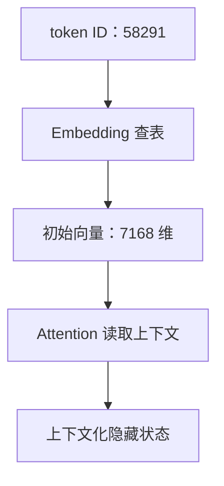
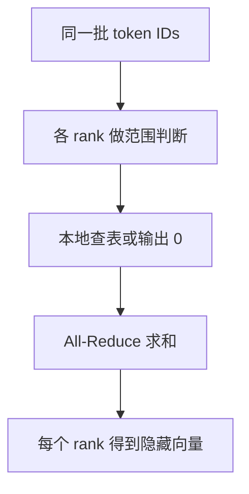

[系列总览](/articles/deepseek-v4-model-architecture-learning-series/) · 下一篇：[02｜LM Head](/articles/deepseek-v4-02-lm-head/)

Embedding 做的事情可以压缩成一句话：**把离散 token ID 变成模型能计算的连续向量**。

它不理解语法，也不做 Attention。它只是用 token ID 选择参数矩阵中的一行。但这一步确定了后面所有模块使用的隐藏维度，也是理解 LM Head、权重绑定和词表并行的起点。

## 1. Tokenizer 的输出不是“词向量”

假设文本被 tokenizer 切成：

```text
"好兄弟" -> [token_好, token_兄弟] -> [3102, 58291]
```

`3102` 和 `58291` 只是词表中的行号。ID 的数值大小没有语义：ID 58291 并不比 ID 3102 “更大”或“更重要”。

如果 batch 中有 $B$ 个序列，每个序列有 $S$ 个 token，那么输入 ID 形状是：

$$
\text{input\_ids}\in\mathbb{N}^{B\times S}
$$

DeepSeek-V4-Pro 的词表大小与隐藏维度为：

$$
V=129{,}280,\qquad H=7{,}168
$$

Embedding 参数矩阵是：

$$
E\in\mathbb{R}^{V\times H}
$$

第 $t$ 个 token 的 ID 为 $i_t$，输出就是第 $i_t$ 行：

$$
x_t=E[i_t]\in\mathbb{R}^{H}
$$

所以整体形状变化是：

$$
[B,S]\longrightarrow[B,S,7168]
$$

## 2. “查表”为什么等价于矩阵乘法

把 ID $i$ 写成长度为 $V$ 的 one-hot 行向量 $e_i$：只有第 $i$ 位为 1，其他位置为 0。那么：

$$
e_iE=E[i]
$$

这说明 Embedding 在数学上等价于 one-hot 乘矩阵，工程上却绝不会真的构造一个 129,280 维、几乎全是 0 的向量。直接按行寻址更省计算和内存。

看一个缩小版：

$$
E=
\begin{bmatrix}
1&0&1\\
0&2&1\\
3&1&0\\
2&2&2
\end{bmatrix}
$$

token ID 为 2 时：

$$
e_2=[0,0,1,0],\qquad e_2E=[3,1,0]
$$

真实实现直接执行 `embedding(2, E)`，结果相同。

## 3. 一个 7168 维向量表示了什么

不要把每个维度机械理解成一个人类可命名的属性。模型学到的是一个分布式表示：语义、语法、格式、上下文倾向等信息散布在许多方向上，单个维度通常没有稳定的自然语言标签。

Embedding 还只是**上下文无关的初始向量**。同一个 token ID 每次查到同一行；它在不同句子里的不同含义，要等 Attention 读取上下文后才逐层形成。



## 4. 参数量和内存

Embedding 的参数量为：

$$
V\times H=129{,}280\times7{,}168=926{,}679{,}040
$$

约 9.27 亿个参数。如果按 BF16、每个元素 2 字节估算：

$$
926{,}679{,}040\times2\approx1.73\ \text{GiB}
$$

这是全局矩阵的逻辑大小。实际部署会把它分到多张 GPU 上。

## 5. DeepSeek 参考实现里的词表并行

官方 `ParallelEmbedding` 沿词表维度切分矩阵。假设有 4 个 tensor-parallel rank：

| Rank | 持有的词表行范围 |
|---:|---:|
| 0 | $[0,32320)$ |
| 1 | $[32320,64640)$ |
| 2 | $[64640,96960)$ |
| 3 | $[96960,129280)$ |

每张卡只保存：

$$
E_r\in\mathbb{R}^{(V/4)\times H}
$$

假设 token ID 是 58,291，只有 rank 1 的分片拥有那一行。参考实现的做法是：

1. 每个 rank 判断 ID 是否落在自己的区间；
2. 不属于自己的位置先产生零向量；
3. 属于自己的 rank 查本地行；
4. 对各 rank 的结果做 `all_reduce(sum)`。

因为同一 ID 只有一个 rank 贡献非零向量，求和后就得到完整 Embedding。



这里分片的是**参数行**，不是把一个 7168 维向量切成四段。最终隐藏向量仍是完整的 $H$ 维，方便后续层继续计算。

## 6. 为什么这里看不到位置编码

Embedding 只回答“这是哪个 token”，不能回答“它在第几个位置”。DeepSeek V4 没有在输入处加一张传统的 learned positional embedding 表；位置信息稍后通过 RoPE 进入 Attention 的 Query 和共享 KV 的旋转子空间。

因此要分开：

| 信息 | 在哪里进入 |
|---|---|
| token 身份 | Embedding 查表 |
| token 的上下文意义 | 多层 Attention / MoE |
| token 位置 | Attention 中的 RoPE |

如果你在 Embedding 源码里找不到位置向量，不代表模型没有位置信息，而是位置机制放在了 Attention 内部。

## 7. 为什么 Embedding 后会出现 4 条流

普通 Transformer 把 $[B,S,H]$ 直接送进第一个 Block。DeepSeek V4 使用 $M=4$ 的 mHC 残差流，所以初始向量会沿一个新维度复制：

$$
X_{embed}\in\mathbb{R}^{B\times S\times H}
\longrightarrow
X_0\in\mathbb{R}^{B\times S\times4\times H}
$$

初始时四条流的数值相同，但进入各子层后，`post` 和 `comb` 会让它们逐步承担不同的残差路径。

复制不等于把隐藏维度扩大为一个普通的 $4H$ 向量。虽然 `hc_pre` 为了计算路由会临时 flatten 成 $4H$，语义上它仍是四条可以独立读写和重组的流。

## 8. Embedding 与 LM Head 是不是同一张矩阵

有些语言模型会做 weight tying：

$$
W_{lm}=E
$$

更严格地说，前向时 LM Head 使用 $E^T$ 把隐藏状态投回词表。这样能减少参数，并让输入输出共享一个词汇空间。

DeepSeek-V4-Pro 配置中：

```json
"tie_word_embeddings": false
```

所以 Embedding 与 LM Head 是两套独立学习的权重。它们形状同为 $[129280,7168]$，用途和数值却不同：

| 矩阵 | 方向 | 问题 |
|---|---|---|
| Embedding $E$ | ID $\to$ hidden | “这个 token 从什么初始向量出发？” |
| LM Head $W_{lm}$ | hidden $\to$ logits | “当前状态对每个 token 打多少分？” |

若两者都按 BF16 粗略估算，合计约 3.45 GiB；这还没算模型中间的 61 个 Block。

## 9. 概念代码

```python
def embedding_forward(input_ids, local_weight, vocab_start, vocab_end):
    # input_ids: [B, S]
    owned = (input_ids >= vocab_start) & (input_ids < vocab_end)

    local_ids = input_ids - vocab_start
    local_ids = where(owned, local_ids, 0)

    x = embedding_lookup(local_weight, local_ids)  # [B, S, H]
    x = where(owned[..., None], x, 0)
    x = all_reduce_sum(x)

    streams = x[:, :, None, :].repeat(1, 1, 4, 1)
    return streams  # [B, S, 4, H]
```

这段代码只表达数据流。vLLM 可能采用不同的分片原语、packed token 布局和融合方式，但必须保持同一个数学结果。

## 10. 常见误区

**误区一：token ID 本身带语义距离。**

没有。ID 只是行号，距离来自查出的向量和后续网络。

**误区二：Embedding 已经包含当前句子的语境。**

没有。相同 ID 查到相同初始行；上下文由 Block 建立。

**误区三：四条 mHC 流意味着词表查四次。**

不需要。先查出一个 $H$ 维向量，再复制到流维度。

**误区四：Embedding 和 LM Head 形状相同，所以一定共享。**

DeepSeek-V4-Pro 明确不共享；形状相同不等于参数相同。

## 11. 自测

1. 输入 ID 形状为 $[2,128]$，Embedding 后是什么形状？
2. 展开 mHC 四流后是什么形状？
3. 8 张卡按词表维切分时，每卡保存多少行？
4. 为什么非所属 rank 输出零向量后做求和是正确的？
5. 为什么不能从 ID 100 和 ID 101 很接近，推断它们语义接近？

答案：$[2,128,7168]$；$[2,128,4,7168]$；每卡 16,160 行；同一 token 只有唯一分片贡献非零行；ID 只是词表索引。

## 源码锚点

- [DeepSeek V4 `ParallelEmbedding`](https://huggingface.co/deepseek-ai/DeepSeek-V4-Pro/blob/main/inference/model.py)
- [DeepSeek-V4-Pro `config.json`](https://huggingface.co/deepseek-ai/DeepSeek-V4-Pro/blob/main/config.json)

[系列总览](/articles/deepseek-v4-model-architecture-learning-series/) · 下一篇：[02｜LM Head：隐藏向量如何变成下一个 token](/articles/deepseek-v4-02-lm-head/)
