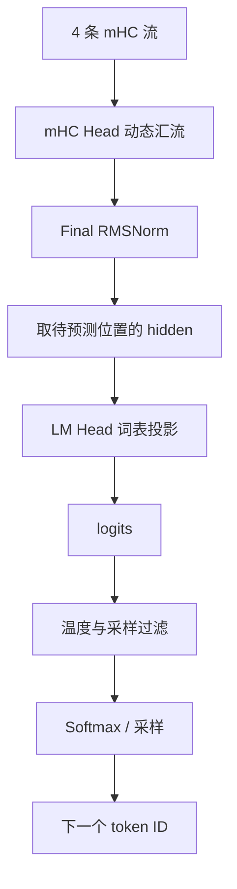

上一篇：[01｜Embedding](/articles/deepseek-v4-01-embedding/) · [系列总览](/articles/deepseek-v4-model-architecture-learning-series/) · 下一篇：[03｜mHC](/articles/deepseek-v4-03-mhc/)

LM Head 是模型内部隐藏空间与外部词表之间的最后一座桥。它接收一个 $7168$ 维隐藏向量，对词表中的 129,280 个 token 各打一个分数，然后采样器从这些分数中选择下一个 token。

最重要的边界是：**LM Head 产生 logits；Softmax 把 logits 变成概率；采样策略才做选择。** 三者经常连着执行，但不是同一个运算。

## 1. DeepSeek V4 输出端的完整顺序

经过 61 个 Block 后，残差状态仍有四条 mHC 流：

$$
X\in\mathbb{R}^{B\times S\times4\times7168}
$$

输出端依次做：



官方参考实现的推理路径只取 `x[:, -1]` 计算 logits，因为常规自回归生成只需要序列最后一个位置预测下一 token。训练时则通常对多个位置同时计算 logits 和 next-token loss。

## 2. 先把四条流汇成一条

最终 mHC Head 会根据四条流的联合状态，为当前 token 生成 4 个正权重 `pre`：

$$
h=\sum_{i=1}^{4}p_iX_i
$$

这里的 $p_i$ 是运行时动态激活，不是四个固定常数。它们由一个持久参数矩阵从展平的 $4H$ 状态中计算出来，再经过 sigmoid 和一个很小的 $\epsilon$。

与 Block 内的 `hc_pre` 不同，最终 Head 只需要“读出”一条流，不再进入后续模块并写回四条流，所以不需要 `post` 和 `comb`。

形状变化：

$$
[B,S,4,H]\longrightarrow[B,S,H]
$$

## 3. Final RMSNorm 做什么

对隐藏向量 $h\in\mathbb{R}^{H}$，RMSNorm 的核心是：

$$
\operatorname{RMS}(h)=
\sqrt{\frac{1}{H}\sum_{j=1}^{H}h_j^2+\epsilon}
$$

$$
\operatorname{RMSNorm}(h)=
g\odot\frac{h}{\operatorname{RMS}(h)}
$$

$g\in\mathbb{R}^{H}$ 是学习到的逐维缩放参数。RMSNorm 不减均值；它主要控制向量整体尺度，使 LM Head 接收到更稳定的输入。

归一化前后维度不变：

$$
[B,S,7168]\longrightarrow[B,S,7168]
$$

## 4. LM Head 就是一个大线性层

DeepSeek-V4-Pro 的 LM Head 权重为：

$$
W_{lm}\in\mathbb{R}^{V\times H}
=\mathbb{R}^{129280\times7168}
$$

对某一位置的隐藏状态 $h\in\mathbb{R}^{H}$：

$$
z=W_{lm}h
$$

或按常见 batch 行向量写法：

$$
Z=HW_{lm}^{T}
$$

输出：

$$
z\in\mathbb{R}^{129280}
$$

其中 $z_i$ 是第 $i$ 个 token 的 logit。它可以为任意实数，不要求大于 0，也不要求和为 1。

## 5. 用一个 4-token 小词表手算

把真实尺寸缩成 $H=3,V=4$：

$$
h=[1,2,-1]
$$

$$
W_{lm}=
\begin{bmatrix}
1&0&1\\
0&1&1\\
2&-1&0\\
-1&1&2
\end{bmatrix}
$$

四个 logit 分别是：

$$
\begin{aligned}
z_0&=1\cdot1+0\cdot2+1\cdot(-1)=0\\
z_1&=0\cdot1+1\cdot2+1\cdot(-1)=1\\
z_2&=2\cdot1-1\cdot2+0\cdot(-1)=0\\
z_3&=-1\cdot1+1\cdot2+2\cdot(-1)=-1
\end{aligned}
$$

所以：

$$
z=[0,1,0,-1]
$$

模型此时只完成了“打分”。logit 最大的是 token 1，但最终是否一定选择它，取决于采样策略。

## 6. Softmax 只负责归一化

概率为：

$$
p_i=\frac{\exp(z_i/T)}{\sum_j\exp(z_j/T)}
$$

$T$ 是 temperature：

- $T<1$：拉大相对差距，分布更尖锐；
- $T>1$：压小相对差距，分布更平；
- 贪心解码通常直接取 `argmax`，无需真的生成完整概率向量。

为了数值稳定，实际计算会先减去最大 logit：

$$
p_i=\frac{\exp((z_i-m)/T)}{\sum_j\exp((z_j-m)/T)},
\qquad m=\max_jz_j
$$

所有 logit 同减一个常数不会改变 Softmax 结果，却能避免指数溢出。

对刚才的 $z=[0,1,0,-1]$，取 $T=1$，概率约为：

$$
p\approx[0.197,0.534,0.197,0.072]
$$

## 7. Top-k、Top-p 和 Softmax 的先后关系

实现可以做等价变换，但概念上最容易理解的顺序是：

1. logits processor 根据规则屏蔽非法 token；
2. 除以 temperature；
3. Top-k 只保留分数最高的 $k$ 个候选，或 Top-p 保留累计概率达到阈值的最小候选集；
4. 对保留项归一化；
5. 随机抽样或取最大项。

Top-k 的对象是**候选 token**，不是 Transformer 隐藏维度；它也与 Attention Indexer 的历史位置 Top-k、MoE 的专家 Top-k 完全不同。

## 8. 为什么这个“普通线性层”仍然很贵

单个 token 的矩阵向量乘法大约需要：

$$
2VH=2\times129{,}280\times7{,}168
\approx1.85\times10^9\ \text{FLOPs}
$$

其中乘和加各算一次操作。BF16 权重逻辑大小约 1.73 GiB。Decode 时每个请求只产生少量行，计算常常更像大规模权重读取，容易受显存带宽影响。

更隐蔽的问题是 logits 本身也很宽。若一次为 512 个位置或候选计算 FP32 logits：

$$
512\times129{,}280\times4\ \text{bytes}
=252.5\ \text{MiB}
$$

如果下游只需要 Top-k 候选，把完整 logits 写入显存、再启动另一个 kernel 读取并筛选会产生可观的带宽和 launch 开销。因此生产引擎会考虑分片计算、局部 Top-k、跨 rank 合并以及算子融合；具体是否启用某种 fused head 取决于引擎版本和采样配置。

## 9. 词表并行的 LM Head

它与词表并行 Embedding 使用相同的切分方向，但通信结果不同。

假设有 $P$ 个 rank，每个 rank 保存：

$$
W_{lm}^{(r)}\in\mathbb{R}^{(V/P)\times H}
$$

每个 rank 用同一个隐藏向量算本地 logits：

$$
z^{(r)}=W_{lm}^{(r)}h
$$

官方参考实现随后用 `all_gather` 沿词表维拼接：

$$
z=\operatorname{concat}\left(z^{(0)},\ldots,z^{(P-1)}\right)
$$

对比 Embedding：

| 模块 | 每 rank 先得到什么 | 参考实现通信 |
|---|---|---|
| Embedding | 一个完整形状但多数为零的 hidden | `all_reduce(sum)` |
| LM Head | 自己那段词表 logits | `all_gather` 后拼接 |

生产采样器不一定非要把全部 logits 汇聚到每张卡。可以先在各分片求局部候选，再合并全局候选；这属于等价的系统优化，不改变 $z=W_{lm}h$ 的模型语义。

## 10. 为什么只取最后一个位置

给定 token 序列 $[t_0,t_1,t_2]$：

- 位置 0 的 hidden 预测 $t_1$；
- 位置 1 的 hidden 预测 $t_2$；
- 位置 2 的 hidden 预测尚未出现的 $t_3$。

训练需要多个位置的监督，所以会形成 $[B,S,V]$ 的 logits。在线生成已经知道 prompt 里的历史 token，只需要最后位置来决定新 token，算成 $[B,V]$ 即可。

如果是 speculative decoding、MTP 验证或一次验证多个草稿 token，运行时可能同时处理多个待验证位置；这也是 LM Head 行数突然增大的来源之一。

## 11. Embedding 与 LM Head 不共享意味着什么

DeepSeek-V4-Pro 的 `tie_word_embeddings=false`。因此：

$$
E\neq W_{lm}
$$

输入侧可以学习“怎样把 token 放进隐藏空间”，输出侧可以独立学习“怎样从隐藏状态给 token 打分”。代价是多一份约 9.27 亿参数的矩阵。

不要把转置关系误读成参数共享：线性层计算里出现 $W_{lm}^{T}$，只是因为框架把权重存为 `[out_features, in_features]`；它不代表与 Embedding 的 $E$ 是同一个对象。

## 12. 概念代码

```python
def output_forward(streams, hc_head, final_norm, lm_weight):
    # streams: [B, S, 4, H]
    hidden = hc_head(streams)       # [B, S, H]
    hidden = final_norm(hidden)     # [B, S, H]

    last = hidden[:, -1].float()    # [B, H]
    local_logits = linear(last, lm_weight)  # [B, V/P]
    logits = all_gather_vocab(local_logits) # [B, V]
    return logits

def choose_next_token(logits, temperature, top_k):
    filtered = apply_sampling_rules(logits / temperature, top_k)
    probs = stable_softmax(filtered)
    return multinomial(probs)
```

第一段属于模型前向，第二段属于解码策略。更高性能的实现可能把边界融合，但理解时应先分开。

## 13. 常见误区

**误区一：LM Head 输出 token ID。**

它输出词表分数；采样器才输出 ID。

**误区二：Softmax 是 LM Head 的学习参数。**

Softmax 没有参数，只做确定性归一化。

**误区三：logit 为负就不可能被选择。**

错误。概率取决于相对大小；所有 logits 都可为负。

**误区四：只要 argmax，LM Head 就不用计算整个词表。**

普通稠密投影仍需给大量词表行打分；系统可分片或融合筛选，但要保证没有漏掉真正的全局最大值。

**误区五：`x[:, -1]` 代表模型只处理了 prompt 最后一个 token。**

不是。前面的 Block 已处理 prompt 并建立上下文；这里只是最后不再为无须输出的位置做词表投影。

## 14. 自测

1. 单请求 Decode 时，LM Head 输入和输出形状分别是什么？
2. 为什么 logits 不需要和为 1？
3. 对所有 logits 同加 100，Softmax 是否变化？
4. 为什么 LM Head 与 Embedding 的全局权重形状相同，却不能断言共享？
5. 词表并行时，为什么 LM Head 常用拼接而 Embedding 常用求和？

核心答案：$[1,7168]\to[1,129280]$；logits 是未归一化分数；Softmax 不变；配置明确不绑定；前者各 rank 拥有不同输出列区间，后者同一 ID 只有一个 rank 贡献非零 hidden。

## 源码锚点

- [DeepSeek V4 `ParallelHead`](https://huggingface.co/deepseek-ai/DeepSeek-V4-Pro/blob/main/inference/model.py)
- [DeepSeek-V4-Pro `tie_word_embeddings`](https://huggingface.co/deepseek-ai/DeepSeek-V4-Pro/blob/main/config.json)

上一篇：[01｜Embedding](/articles/deepseek-v4-01-embedding/) · [系列总览](/articles/deepseek-v4-model-architecture-learning-series/) · 下一篇：[03｜mHC：四条残差流和 24 个动态路由量](/articles/deepseek-v4-03-mhc/)
