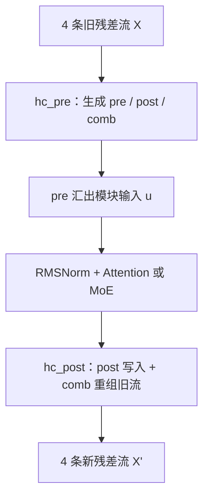

上一篇：[02｜LM Head](/articles/deepseek-v4-02-lm-head/) · [系列总览](/articles/deepseek-v4-model-architecture-learning-series/) · 下一篇：[04｜普通 Attention](/articles/deepseek-v4-04-standard-attention/)

先直接回答最容易卡住的那行代码：

```python
u, post, comb = hc_pre(X)
u = rms_norm(u)
a = attention_or_moe(u)
X_new = hc_post(a, X, post, comb)
```

`hc_pre` 之所以同时生成 `post` 和 `comb`，是因为它并不只是“计算模块输入”，而是在模块执行前，**一次性制定本子层完整的读写路由计划**：

- `pre`：模块从 4 条旧流里怎样读；
- `post`：模块结果怎样写到 4 条新流；
- `comb`：4 条旧流在写回时怎样互相重组。

函数名强调它在模块之前调用，不代表它只负责“前半段”。更准确的心智模型是：`hc_pre = plan_route_and_read()`。



## 1. 从普通残差连接开始

标准 pre-norm Transformer 子层常写成：

$$
x'=x+F(\operatorname{Norm}(x))
$$

这里只有一条残差高速公路：

- 模块 $F$ 从 $x$ 读取；
- 模块结果固定以系数 1 写回；
- 旧状态固定以系数 1 保留。

它简单稳定，但“读哪里、写哪里、旧状态怎样流动”全部写死了。

mHC 把单条残差流扩成 $M=4$ 条：

$$
X=[X_1,X_2,X_3,X_4]
\in\mathbb{R}^{B\times S\times4\times H}
$$

每个子层不再执行固定的 `x + F(x)`，而是学习一张随 token 改变的软路由图。

## 2. 一条公式看完整结构

对某个 token，先用 `pre` 汇成模块输入：

$$
u=\sum_{i=1}^{4}p_iX_i
$$

模块计算：

$$
a=F(\operatorname{RMSNorm}(u))
$$

对每条输出流 $j$：

$$
X'_j=q_j a+\sum_{i=1}^{4}C_{ij}X_i
$$

其中：

- $p\in\mathbb{R}^{4}$ 是 `pre`；
- $q\in\mathbb{R}^{4}$ 是 `post`；
- $C\in\mathbb{R}^{4\times4}$ 是 `comb`。

这就是全部核心。复杂之处来自这些系数不是固定参数，而是每个 token、每个子层根据当前四流状态动态生成。

## 3. 24 个量从哪里来

四流状态先展平：

$$
[B,S,4,H]\longrightarrow[B,S,4H]
$$

对 DeepSeek-V4-Pro：

$$
4H=4\times7168=28{,}672
$$

路由投影输出维度为：

$$
(2+M)M=(2+4)\times4=24
$$

分段解释：

| 输出区间 | 个数 | 运行时含义 | 何时使用 |
|---|---:|---|---|
| `[0:4]` | 4 | `pre`：四条流的读取权重 | `hc_pre` 内立即使用 |
| `[4:8]` | 4 | `post`：模块结果向四条流的写入权重 | 模块执行后的 `hc_post` |
| `[8:24]` | 16 | `comb`：$4\times4$ 旧流混合矩阵 | 模块执行后的 `hc_post` |

所以你的理解可以修正为：**前 4 个用于前面的读，接着 4 个和最后 16 个留给后面的写回；最后 16 个更新的是残差状态，不是模型参数。**

## 4. 持久参数与动态激活要严格分开

对 Attention 子层，官方参考实现保存：

$$
W_{route}\in\mathbb{R}^{24\times(4H)}
$$

以及：

$$
b_{route}\in\mathbb{R}^{24},\qquad s\in\mathbb{R}^{3}
$$

它们分别对应代码中的 `hc_attn_fn`、`hc_attn_base`、`hc_attn_scale`，是 checkpoint 参数。

对每个输入 token，前向临时得到：

$$
m=W_{route}\,\widehat X
$$

再把 $m$ 切成 4、4、16，经过不同变换得到 `pre/post/comb`。这 24 个数属于激活。

| 名称 | 会写入 checkpoint | 换 token 是否改变 | 推理时优化器更新 |
|---|:---:|:---:|:---:|
| `hc_fn` / $W_{route}$ | 是 | 否 | 否 |
| `hc_base`、`hc_scale` | 是 | 否 | 否 |
| `pre`、`post`、`comb` | 否 | 是 | 否 |
| `X_new` | 否 | 是 | 否 |

推理时的“更新”指计算新的隐藏状态，不是梯度下降改权重。

## 5. `hc_pre` 逐行拆解

把官方逻辑改写成易读伪代码：

```python
def hc_pre(X, hc_fn, hc_scale, hc_base):
    # X: [B, S, 4, H]
    original_shape = X.shape
    flat = X.flatten(start_dim=2).float()  # [B, S, 4H]

    inv_rms = rsqrt(mean(flat * flat, dim=-1, keepdim=True) + eps)
    raw = linear(flat, hc_fn) * inv_rms    # [B, S, 24]

    pre, post, comb = split_and_sinkhorn(
        raw, hc_scale, hc_base
    )

    streams = flat.view(original_shape)
    u = sum(pre[..., None] * streams, dim=2)  # [B, S, H]
    return u, post, comb
```

这里的 `inv_rms` 只用于稳定路由投影输入尺度；后面还有一次真正送入 Attention/MoE 前的子层 RMSNorm，两者用途不同。

张量形状：

| 张量 | 形状 |
|---|---|
| `X` | `[B,S,4,7168]` |
| `flat` | `[B,S,28672]` |
| `raw` | `[B,S,24]` |
| `pre` | `[B,S,4]` |
| `post` | `[B,S,4]` |
| `comb` | `[B,S,4,4]` |
| `u` | `[B,S,7168]` |

## 6. 为什么先算后半段参数

有三个直接原因。

### 原因一：读与写应由同一份上下文共同决定

`pre`、`post`、`comb` 都描述“当前四流状态如何经过这个子层”。一次投影让它们依赖同一个路由决策源，语义更完整。

### 原因二：模块只接收一条流

Attention 或 MoE 输入 $u$ 是 $[B,S,H]$，模块输出 $a$ 也只有 $H$ 维。模块执行后已经看不到原始四流的联合 $4H$ 状态。如果到那时才决定 `comb`，就要重新保存、展平、投影，或改变接口。

### 原因三：避免重复的大投影

路由矩阵输入宽度是 28,672。一次产生 24 个量，比模块前后各做一遍路由投影更自然，也有利于融合实现。

因此 `post`、`comb` 被提前生成，随调用栈暂存几步，在 `hc_post` 立刻消费。它们不是跨层 KV Cache，也不会跨生成轮长期保存。

## 7. 三段为什么用不同约束

官方 kernel 对三段做：

$$
p_i=\sigma(s_0m_i+b_i)+\epsilon
$$

$$
q_j=2\sigma(s_1m_j+b_j)
$$

$$
C=\operatorname{Sinkhorn}(s_2M+B)
$$

### `pre`：正的读取门

sigmoid 把权重限制为正数，加 $\epsilon$ 避免完全关闭。注意它没有在四条流间做 sum-to-one 归一化，所以：

$$
\sum_i p_i\neq1\quad\text{通常成立}
$$

不要把它误称为概率分布。

### `post`：允许更强的写入幅度

$2\sigma(\cdot)$ 把范围扩到 $(0,2)$。模块结果可以弱写入，也可以比单位残差更强地注入某些流；它同样不是概率。

### `comb`：近似双随机的流量重组

Sinkhorn 反复做行归一化和列归一化，使 $C$ 的行和、列和都接近 1：

$$
\sum_jC_{ij}\approx1,
\qquad
\sum_iC_{ij}\approx1
$$

直觉上：

- 每条旧流输出的总“流量”受控；
- 每条新流接收的旧状态总量也受控；
- 矩阵仍可学习接近置换、平均或更柔和的重排。

这就是 manifold-constrained 的关键：允许动态混合，又把混合矩阵约束在稳定的几何集合附近，避免深层网络任意放大或耗散残差信号。

## 8. Sinkhorn 的微型例子

假设只有两条流，原始正矩阵为：

$$
A=
\begin{bmatrix}
4&1\\
2&3
\end{bmatrix}
$$

先按行归一化：

$$
A_r=
\begin{bmatrix}
0.8&0.2\\
0.4&0.6
\end{bmatrix}
$$

此时列和为 $[1.2,0.8]$。再按列归一化：

$$
A_c\approx
\begin{bmatrix}
0.667&0.25\\
0.333&0.75
\end{bmatrix}
$$

列和变成 1，但行和暂时不是 1；继续交替归一化，会逐渐逼近行列和都为 1 的矩阵。DeepSeek-V4-Pro 配置使用 20 次迭代。

Sinkhorn 不是把 16 个值简单做一次 Softmax：一次行 Softmax只能约束行，不能同时约束列。

## 9. `hc_post` 的索引方向

参考实现可读成：

```python
def hc_post(a, residual, post, comb):
    module_write = post[..., None] * a[..., None, :]
    old_stream_mix = sum(
        comb[..., None] * residual[..., None, :, :],
        dim=old_stream_axis,
    )
    return module_write + old_stream_mix
```

对输出流 $j$：

$$
X'_j=q_ja+\sum_iC_{ij}X_i
$$

这里 `comb[i,j]` 表示旧流 $i$ 对新流 $j$ 的贡献。读源码时最容易被 broadcast 维度绕晕，最稳的方法不是记 `unsqueeze(-2)`，而是每次写出“谁被求和、谁保留下来”。旧流索引 $i$ 被求和，输出流索引 $j$ 保留。

## 10. 四流手算一遍

为了只看路由，把每条流缩成一个标量：

$$
X=[1,2,3,4]
$$

假设：

$$
p=[0.5,0.2,0.2,0.1]
$$

则模块输入：

$$
u=0.5\times1+0.2\times2+0.2\times3+0.1\times4=1.9
$$

假设模块输出 $a=10$，写入权重：

$$
q=[1,0.5,0,1.5]
$$

再假设 `comb` 恰好是循环置换：

$$
C=
\begin{bmatrix}
0&1&0&0\\
0&0&1&0\\
0&0&0&1\\
1&0&0&0
\end{bmatrix}
$$

按 $X'_j=q_ja+\sum_iC_{ij}X_i$：

$$
X'=[14,11,2,18]
$$

解释：旧流被循环重排，同时模块结果按 `[1,0.5,0,1.5]` 注入新流。即使第三条流没有直接写入模块结果，它仍通过 `comb` 保留旧状态。

## 11. 一个 Block 为什么有两套 mHC 参数

Block 有 Attention 子层和 MoE 子层：

```python
residual = X
u, post, comb = hc_pre(X, hc_attn_fn, ...)
a = attention(rms_norm(u))
X = hc_post(a, residual, post, comb)

residual = X
u, post, comb = hc_pre(X, hc_ffn_fn, ...)
m = moe(rms_norm(u))
X = hc_post(m, residual, post, comb)
```

它们面对的变换性质不同，因此各自有独立的 `hc_fn/base/scale`。对 $M=4$，每套的持久参数数量约为：

$$
24\times28672+24+3=688{,}155
$$

每个 Block 两套约 137.6 万；61 个 Block 约 8395 万。这些是 mHC 路由器的参数，不包括最终 mHC Head。

## 12. 它与 Attention/MoE 路由有什么区别

| 机制 | 路由对象 | 被选择/混合的东西 | 是否有长期 cache |
|---|---|---|---|
| mHC | 4 条残差流 | 隐藏状态通道 | 否 |
| Attention | 历史 token 位置 | value / shared-KV 内容 | 有 KV Cache |
| Indexer | 压缩历史位置 | 主 Attention 候选位置 | 索引本身按 query 临时产生 |
| MoE | 专家 | FFN 计算路径 | 无 KV Cache |

mHC 不负责长上下文检索，也不选择专家。它包在子层外部，控制子层如何接入残差网络。

## 13. 生产实现为什么看起来不一样

vLLM 可能把：

- 上一次 `hc_post`；
- 下一次 `hc_pre`；
- RMSNorm；

融合成更少的 GPU kernel，以减少中间张量写回 HBM 和 kernel launch。源码表面上可能看不到清晰的四行伪代码，但数学不变量仍是：

1. 四条残差流存在；
2. 模块每次接收一条 $H$ 维工作流；
3. 读权重、写权重和旧流混合由当前 token 动态生成；
4. `comb` 受 Sinkhorn 约束。

理解融合 kernel 时先把它“反融合”回这四步，就不会迷路。

## 14. 常见误区

**误区一：24 个是模型刚学到的新参数。**

它们是本次前向的动态路由量；真正参数是生成它们的矩阵、bias 和 scale。

**误区二：最后 16 个用于更新权重矩阵。**

它们组成 `comb`，更新的是四条残差隐藏状态。推理不会在线训练模型权重。

**误区三：`pre`、`post` 都是四分类概率。**

它们不做 sum-to-one；`pre` 为正，`post` 范围约为 0 到 2。

**误区四：`comb` 是 Attention matrix。**

它是 4 条残差流之间的 $4\times4$ 混合矩阵，与序列长度无关。

**误区五：`post` 和 `comb` 会像 KV Cache 一样跨 token 保存。**

它们只跨过当前子层的模块调用，随后立即用于写回。

**误区六：四条流意味着 Attention 做四遍。**

`pre` 先汇成一条 $H$ 维工作流，Attention/MoE 主模块通常只执行一次，再通过 `post` 写向四流。

## 15. 自测

1. $M=4$ 时为什么是 24 个动态量？
2. `pre` 为什么在 `hc_pre` 内消费，`post/comb` 为什么稍后消费？
3. `comb` 的行列和被约束，主要想保护什么？
4. 改变输入 token 后，`hc_fn` 和 `comb` 哪个通常会变？
5. 为什么最终 mHC Head 只需要 4 个读取权重？

核心答案：$4+4+4^2=24$；模块先要一条输入、结果出来后才写回；防止深层残差信号任意膨胀或消失；`comb` 会变而参数 `hc_fn` 不变；最终只需从四流读出，不再写回四流。

## 源码与论文锚点

- [DeepSeek V4 `Block.hc_pre/hc_post`](https://huggingface.co/deepseek-ai/DeepSeek-V4-Pro/blob/main/inference/model.py)
- [DeepSeek V4 `hc_split_sinkhorn` kernel](https://huggingface.co/deepseek-ai/DeepSeek-V4-Pro/blob/main/inference/kernel.py)
- [mHC 论文](https://arxiv.org/abs/2512.24880)

上一篇：[02｜LM Head](/articles/deepseek-v4-02-lm-head/) · [系列总览](/articles/deepseek-v4-model-architecture-learning-series/) · 下一篇：[04｜普通 Attention：先把 Q/K/V 走通](/articles/deepseek-v4-04-standard-attention/)
