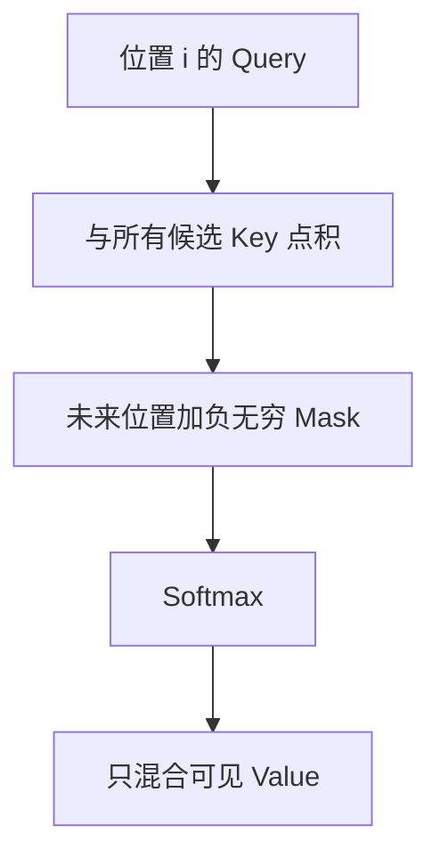

上一篇：[03｜mHC](/articles/deepseek-v4-03-mhc/) · [系列总览](/articles/deepseek-v4-model-architecture-learning-series/) · 下一篇：[05｜KV Cache](/articles/deepseek-v4-05-kv-cache/)

DeepSeek V4 的 Attention 很复杂，但它没有推翻 Attention 的核心：**当前 token 用 Query 提问，用 Key 判断历史位置是否相关，再用同一组权重从 Value 读取内容。**

先把标准版本走通，后面所有 V4 结构都只是回答三个工程问题：历史太长怎么存、怎么快速找、怎样保留近处的精确信息。

## 1. Q、K、V 的角色

对输入隐藏状态：

$$
X\in\mathbb{R}^{B\times S\times H}
$$

标准单头 Attention 使用三个学习矩阵：

$$
Q=XW_Q,\qquad K=XW_K,\qquad V=XW_V
$$

可以用检索系统来理解：

| 张量 | 直觉 | 参与什么计算 |
|---|---|---|
| Query | 当前 token 想找什么 | 与所有可见 Key 点积 |
| Key | 每个历史 token 提供的检索标签 | 决定相关性分数 |
| Value | 每个历史 token 真正携带的内容 | 按 Attention 权重加权求和 |

Key 不等于“关键词”，Value 也不等于原始 token。它们都是从隐藏状态学习投影出的连续向量。

## 2. 缩放点积 Attention

对查询位置 $i$ 和历史位置 $j$：

$$
s_{ij}=\frac{q_i^Tk_j}{\sqrt{D}}+M_{ij}
$$

$D$ 是单个头的维度，$M$ 是 mask。对 $j$ 维做 Softmax：

$$
\alpha_{ij}
=\frac{\exp(s_{ij})}{\sum_r\exp(s_{ir})}
$$

最后读取 Value：

$$
o_i=\sum_j\alpha_{ij}v_j
$$

矩阵形式：

$$
\operatorname{Attention}(Q,K,V)
=\operatorname{Softmax}\left(\frac{QK^T}{\sqrt D}+M\right)V
$$

Softmax 在这里的轴是“可读取的历史位置”，不是隐藏维，也不是词表。

## 3. 为什么要除以 $\sqrt D$

若 $q$ 和 $k$ 各维近似零均值、单位方差，点积：

$$
q^Tk=\sum_{d=1}^{D}q_dk_d
$$

其方差会随 $D$ 增长，典型幅度约为 $\sqrt D$。维度越大，未经缩放的 logits 越容易绝对值很大，Softmax 过早饱和成接近 one-hot，梯度和数值都不稳定。

除以 $\sqrt D$ 把分数拉回相对稳定的尺度。它不是为了让点积落在 $[-1,1]$，也不是余弦相似度；若没有额外归一化，向量范数仍会影响分数。

## 4. 三 token、二维手算

考虑当前要计算位置 2 的输出，令：

$$
q_2=[1,0]
$$

两个可见历史 Key：

$$
k_1=[1,0],\qquad k_2=[0,1]
$$

对应 Value：

$$
v_1=[2,0],\qquad v_2=[0,3]
$$

因为 $D=2$：

$$
s_{21}=\frac{[1,0]\cdot[1,0]}{\sqrt2}
=\frac1{\sqrt2}\approx0.707
$$

$$
s_{22}=\frac{[1,0]\cdot[0,1]}{\sqrt2}=0
$$

Softmax 后约为：

$$
[\alpha_{21},\alpha_{22}]\approx[0.67,0.33]
$$

最终输出：

$$
o_2=0.67[2,0]+0.33[0,3]
\approx[1.34,0.99]
$$

这里的关键不是精确小数，而是操作顺序：

1. Query 与各 Key 打分；
2. 在位置轴上归一化；
3. 用得到的权重混合 Value。

## 5. 因果 Mask 如何阻止偷看未来

自回归模型在位置 $i$ 只能读取 $j\le i$。因果 mask 定义为：

$$
M_{ij}=
\begin{cases}
0,&j\le i\\
-\infty,&j>i
\end{cases}
$$

对长度为 3 的序列：

$$
M=
\begin{bmatrix}
0&-\infty&-\infty\\
0&0&-\infty\\
0&0&0
\end{bmatrix}
$$

因为 $\exp(-\infty)=0$，未来位置的 Softmax 权重严格为 0。



Mask 必须在 Softmax 之前进入 logits。若先 Softmax 再把未来权重设 0，剩余权重之和不再为 1，除非重新归一化。

## 6. 全序列的形状

先看单头：

| 张量 | 形状 |
|---|---|
| $X$ | `[B,S,H]` |
| $Q,K,V$ | `[B,S,D]` |
| $QK^T$ | `[B,S,S]` |
| $\alpha$ | `[B,S,S]` |
| $O$ | `[B,S,D]` |

矩阵 $[S,S]$ 是普通全 Attention 在长上下文下昂贵的根源：训练或 Prefill 的注意力计算随 $S^2$ 增长。

## 7. 多头 Attention 为什么不是“重复算一样的东西”

多头版本把投影结果拆成 $N_q$ 个 Query heads：

$$
Q\in\mathbb{R}^{B\times N_q\times S\times D}
$$

标准 MHA 中：

$$
K,V\in\mathbb{R}^{B\times N_q\times S\times D}
$$

每个头有不同投影参数，可以学习不同的匹配关系。各头独立算 Attention，随后拼接并做输出投影：

$$
O_{cat}\in\mathbb{R}^{B\times S\times(N_qD)}
$$

$$
Y=O_{cat}W_O\in\mathbb{R}^{B\times S\times H}
$$

多头并不要求某个头永久对应“语法”、另一个永久对应“实体”；这是可观察到的可能行为，不是架构硬编码。

## 8. MHA、GQA 与 MQA

为减少 KV Cache，现代模型常让多个 Query heads 共享较少的 K/V heads：

| 类型 | Query heads | KV heads | K 与 V 是否同一个向量 |
|---|---:|---:|:---:|
| MHA | $N_q$ | $N_q$ | 否 |
| GQA | $N_q$ | $1<N_{kv}<N_q$ | 否 |
| MQA | $N_q$ | 1 | 否 |
| DeepSeek V4 shared-KV | 128 | 1 份 512D shared vector | **是** |

最后一行要特别注意：普通 MQA 是“所有 Query 头共享一份 K 和一份 V”，但 K 与 V 仍是两个不同向量。DeepSeek V4 更进一步，同一个 512 维向量同时作为 K 和 V；这会引出第 06 章的 inverse RoPE。

## 9. 没有位置，Attention 会怎样

单纯的点积只看内容。若把两个相同 token 的位置交换，而不注入位置信息，Attention 很难知道谁在前、谁在后；因果 mask 只告诉模型“能否看见”，并没有充分表达相对距离。

RoPE 将向量的二维分量对按位置旋转。对位置 $i$：

$$
q'_i=R(i)q_i,\qquad k'_j=R(j)k_j
$$

点积变成：

$$
{q'_i}^Tk'_j
=q_i^TR(i)^TR(j)k_j
=q_i^TR(j-i)k_j
$$

因此分数自然包含相对位置 $j-i$。

RoPE 通常作用在 Q/K 上，不作用于普通 V。它也不是把一个“位置向量”直接加到 hidden 上，而是在 Attention 内旋转部分或全部 Q/K 维度。

## 10. RoPE 的二维直觉

二维旋转矩阵：

$$
R(\theta)=
\begin{bmatrix}
\cos\theta&-\sin\theta\\
\sin\theta&\cos\theta
\end{bmatrix}
$$

同一个内容向量在不同位置被转到不同角度。两个旋转后向量的点积，只依赖角度差。高维 RoPE 把维度分成多个二维对，每对使用不同频率，从而同时表达短距离和长距离关系。

DeepSeek-V4-Pro 的 Attention head 是 512 维，但只有最后 64 维是 RoPE 子空间，前 448 维是 NoPE 内容子空间：

$$
512=448_{NoPE}+64_{RoPE}
$$

这条 V4 特有的形状先记住，第 06 章会继续使用。

## 11. Attention 输出到底“属于哪个位置”

$o_i$ 是**查询位置 $i$ 的新表示**，即使它混合了很多历史 Value。Attention 不会把结果写回被读取的历史 token；历史缓存也不会因为被关注而被修改。

在自回归 Decode 中：

- 当前 token 生成一个 Query；
- Query 从历史 K/V 读取；
- 输出属于当前 token；
- 当前 token 的新 K/V 被追加，供未来 token 使用。

这个方向性是理解 KV Cache 的关键。

## 12. Attention 里的 Softmax 与 LM Head Softmax

| Softmax | 归一化轴 | 得到什么 |
|---|---|---|
| Attention Softmax | 历史位置 | 当前 Query 应从每个 Value 读多少 |
| LM Head Softmax | 词表 token | 下一 token 的概率分布 |

两者数学形式相同，但语义、张量大小和发生位置完全不同。

MoE 路由也会出现归一化，但它的轴是专家。遇到 Softmax，首先问“在哪个维度归一化”，比只记函数名更重要。

## 13. 从公式到概念代码

```python
def causal_attention(x):
    # x: [B, S, H]
    q = project_q(x).view(B, S, n_q_heads, head_dim)
    k = project_k(x).view(B, S, n_kv_heads, head_dim)
    v = project_v(x).view(B, S, n_kv_heads, head_dim)

    q = apply_rope(q, positions)
    k = apply_rope(k, positions)

    q = q.transpose(1, 2)  # [B, heads, S, D]
    k = expand_kv_heads(k).transpose(1, 2)
    v = expand_kv_heads(v).transpose(1, 2)

    scores = q @ k.transpose(-1, -2) / sqrt(head_dim)
    scores = scores + causal_mask(S)
    probs = softmax(scores, dim=-1)
    out = probs @ v
    return output_projection(join_heads(out))
```

高性能 kernel 不会真的把整个 $[B,N_q,S,S]$ 分数矩阵写回显存。FlashAttention 使用分块与在线 Softmax，在数学等价的前提下减少 HBM 流量。优化改变的是执行计划，不是公式。

## 14. 常见误区

**误区一：Query 是当前自然语言问题，Key 是关键词。**

这只是类比。每个 token、每层、每头都有连续 Q/K/V。

**误区二：Attention 权重直接乘 Key。**

标准 Attention 用 Q/K 决定权重，用权重混合 V。

**误区三：Softmax 对所有 heads 和所有 batch 一起做。**

每个 batch、每个头、每个 Query 位置独立地在可见 Key 位置轴归一化。

**误区四：因果 mask 等于只保留最近若干 token。**

因果 mask 禁止未来；滑动窗口才限制最多读取多远的过去。

**误区五：RoPE 作用于 token ID 或完整 hidden。**

它在 Attention 内作用于 Q/K 的旋转维度。

**误区六：多头一定会让 KV Cache 增长 128 倍。**

取决于 KV head 数；GQA/MQA 可让多个 Q heads 共享 K/V。

## 15. 自测

1. Attention 的 Softmax 沿哪个维度做？
2. 为什么先用 Q/K 打分，却用权重混合 V？
3. 因果 mask 为什么要在 Softmax 前加入？
4. MQA 中 K 和 V 是否是同一个向量？
5. RoPE 后 $q_i^Tk_j$ 为什么能感知相对位置？

若这些问题能不看公式回答，下一章就可以把同一套计算拆成 Prefill 与 Decode，并看清 KV Cache 为什么存在。

## 一手资料

- [Attention Is All You Need](https://arxiv.org/abs/1706.03762)
- [RoFormer / RoPE](https://arxiv.org/abs/2104.09864)
- [DeepSeek V4 官方参考 Attention](https://huggingface.co/deepseek-ai/DeepSeek-V4-Pro/blob/main/inference/model.py)

上一篇：[03｜mHC](/articles/deepseek-v4-03-mhc/) · [系列总览](/articles/deepseek-v4-model-architecture-learning-series/) · 下一篇：[05｜KV Cache：为什么缓存 K/V，不缓存 Q](/articles/deepseek-v4-05-kv-cache/)
