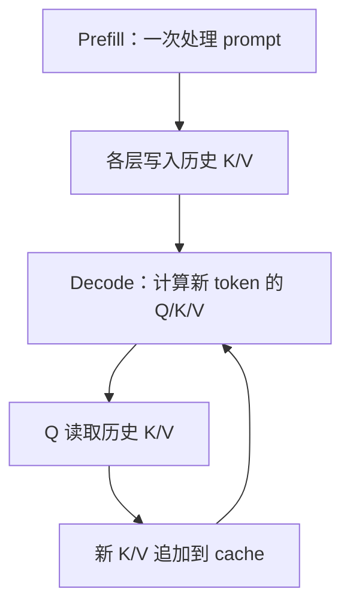

上一篇：[04｜普通 Attention](/articles/deepseek-v4-04-standard-attention/) · [系列总览](/articles/deepseek-v4-model-architecture-learning-series/) · 下一篇：[06｜V4 混合压缩注意力](/articles/deepseek-v4-06-hybrid-compressed-attention/)

KV Cache 不是模型训练出来的新模块，而是自回归推理对 Attention 的**等价增量执行**：历史 token 的 Key 和 Value 一旦算好，未来不会改变，因此把它们保存起来，下一步只计算新 token 的 Q/K/V。

一句话记忆：**历史 Q 已完成提问，可以丢；历史 K/V 还要回答未来的 Query，必须留。**

## 1. 不使用缓存会重复什么

prompt 为：

```text
t1 t2 t3
```

模型先预测出 `t4`。下一轮为了预测 `t5`，若把 `[t1,t2,t3,t4]` 整段重新送入每一层，就会再次计算：

- `t1,t2,t3` 的 K/V；
- 它们经过前面所有层的隐藏状态；
- 大量已经在上一轮得到、且数值完全相同的结果。

KV Cache 保存每层已经产生的历史 K/V，使下一轮只推进新 token。



图中的循环每次代表一个新 token。真实服务会在 batch 中同时推进许多请求。

## 2. 为什么过去的 K/V 不会变化

因果模型中，位置 $j$ 的隐藏状态只能依赖 $0\ldots j$。以后生成的 token 位于 $j$ 之后，因果 mask 禁止它们反向影响位置 $j$。

因此对已经完成的历史位置：

$$
k_j^{(l)},v_j^{(l)}
$$

在层 $l$ 中是确定的。后续 token 到来不会改写它们。这个**因果不变量**是 KV Cache 正确性的根基；若是双向 Attention 或允许后文修改前文表示的架构，就不能直接套用同一逻辑。

## 3. 为什么不缓存历史 Q

位置 $i$ 的 Query 只用于计算位置 $i$ 的输出：

$$
o_i=\operatorname{Attention}(q_i,K_{\le i},V_{\le i})
$$

未来位置 $t>i$ 会生成自己的 $q_t$，它不会拿 $q_i$ 来查询：

$$
o_t=\operatorname{Attention}(q_t,K_{\le t},V_{\le t})
$$

所以生命周期是：

| 张量 | 生成时机 | 将来是否复用 | 处理 |
|---|---|:---:|---|
| 当前 $q_t$ | 当前层、当前 token | 否 | 用完释放 |
| 当前 $k_t$ | 当前层、当前 token | 是 | 写入 cache |
| 当前 $v_t$ | 当前层、当前 token | 是 | 写入 cache |
| Attention 输出 $o_t$ | 当前层、当前 token | 仅继续向后传 | 不是 KV Cache |

“不缓存 Q”不是说运行时完全不保存它几条指令；kernel 内当然要暂存当前 Q。意思是它不需要作为跨 Decode step 的长期序列状态。

## 4. Prefill 与 Decode

### Prefill

输入整个 prompt，假设长度为 $S$：

$$
X\in\mathbb{R}^{B\times S\times H}
$$

每一层为所有 prompt token 计算 Q/K/V，并把 K/V 写入 cache。Attention 需要处理大量 query 与 key，工作规模通常接近 $S^2$，但矩阵大、并行度高，GPU 更容易吃满。

### Decode

每个活跃请求通常只推进 1 个 token：

$$
x_t\in\mathbb{R}^{B\times1\times H}
$$

每层只新算 $q_t,k_t,v_t$，但 $q_t$ 要读取长度约为 $t$ 的历史 cache。计算量从“重复整个前缀”降为“一个 Query 扫历史”，同时 Decode 更容易受显存带宽和小 kernel 启动开销影响。

| 特性 | Prefill | Decode |
|---|---|---|
| 本轮 token 数 | 多 | 每请求通常 1 |
| 主要操作形态 | 大矩阵 | 矩阵向量 / 小矩阵 + 长 cache 读取 |
| 新增 cache 条目 | prompt 全部 | 每步 1 条或压缩边界条目 |
| 常见瓶颈 | Attention 计算、算力 | HBM 带宽、通信、launch |

## 5. 三 token 时间线

Prefill 处理 `[t0,t1,t2]`：

```text
Q0 Q1 Q2：各自算出该位置输出，用完
K0 K1 K2：写入每层 KV Cache
V0 V1 V2：写入每层 KV Cache
```

预测并选出 `t3` 后，Decode：

```text
计算 q3, k3, v3
q3 与 [k0,k1,k2,k3] 打分
权重混合 [v0,v1,v2,v3]
把 k3,v3 追加进 Cache
q3 用完
```

下一轮 `t4` 重复相同模式。每层都有自己的 K/V，因为第 $l$ 层与第 $l+1$ 层看到的隐藏状态不同；不能用一层的 K/V 代替另一层。

## 6. 标准 KV Cache 的形状与显存

设层数 $L$、KV heads 数 $N_{kv}$、单头 K/V 维度 $D$、上下文长度 $S$，每元素 $b$ 字节。标准等维 K/V cache 约为：

$$
M=L\times S\times N_{kv}\times( D_K+D_V)\times b
$$

若 $D_K=D_V=D$：

$$
M=2LSN_{kv}Db
$$

这个式子揭示四个线性关系：序列越长、层越多、KV heads 越多、精度字节越大，cache 越大。

例如一个假想的 32 层 MHA，32 个 KV heads、head dim 128、BF16、上下文 32K：

$$
2\times32\times32768\times32\times128\times2
=16\ \text{GiB/sequence}
$$

这只是 KV Cache，不含模型权重和运行时 workspace。它说明为什么 GQA、MQA、量化和压缩缓存对长上下文服务如此重要。

## 7. 缓存的是 RoPE 前还是 RoPE 后的 K

标准实现通常把已经应用位置编码、可直接参与 Attention 的 K 存进 cache：

$$
k'_j=R(j)k_j
$$

未来 Query $q'_t$ 可以直接与 $k'_j$ 点积，不必每轮给所有历史 K 重做旋转。V 通常不做 RoPE，直接缓存投影后的 V。

但这不是所有架构都必须遵守的唯一物理布局。某些 latent attention、分解投影或融合 kernel 会缓存可重建 K/V 的潜变量。判断时要看该模型的 Attention 方程与 kernel 接口，不能只凭变量名 `kv_cache` 推断。

DeepSeek V4 更特殊：同一个 512 维向量既作 K 又作 V，最后 64 维带 RoPE，并在输出端做 inverse RoPE；第 06 章单独推导。

## 8. Cache 不等于一个无限增长的连续数组

概念代码很容易写成：

```python
k_cache = concat([k_cache, k_new], dim=sequence)
v_cache = concat([v_cache, v_new], dim=sequence)
```

在线服务若每生成一个 token 都重新分配并复制整段数组，代价无法接受。真实引擎会预分配或按固定大小的物理 block/page 管理空间。

逻辑上，一个请求的 token 是连续的：

```text
0 1 2 3 4 5 6 7 ...
```

物理上，它们可以分散在不同页。block table 保存映射：

| 逻辑块 | 物理块 |
|---:|---:|
| 0 | 37 |
| 1 | 5 |
| 2 | 91 |

Attention kernel 根据 block table 找到历史条目。这就是 PagedAttention / paged KV 的核心思路：避免每个请求必须占一段按最大长度预留的连续显存，并让增长、回收和共享更灵活。

## 9. vLLM 为什么需要 block table

在线 batch 是动态的：

- 请求到达时间不同；
- prompt 长度不同；
- 有的很快遇到 EOS；
- 有的继续生成很久；
- prefix cache 还可能让多个请求共享相同前缀页。

如果每个请求都预留最大 1M token 的连续区间，绝大多数空间会浪费。分页后，调度器按实际增长分配物理块；请求结束时归还块；相同的只读前缀还可由引用计数共享。

这里要分清两个“位置”：

- **逻辑位置**：模型语义中的 token index，用于 RoPE 和因果关系；
- **物理 slot**：该条 cache 实际存在哪个 GPU page 中。

分页只能改变物理地址，不能改变逻辑位置，否则 RoPE 与 causal mask 会出错。

## 10. Prefix Cache 复用的是什么

如果两个请求具有完全相同的 token 前缀、模型和相关执行条件，前缀经过每层产生的 KV 状态也相同。引擎可以让第二个请求复用已存在的 cache blocks，而不是再次 Prefill。

复用不是“语义相似即可”，而需要可验证的精确 cache key。prompt 模板、tokenizer 结果、LoRA adapter、模型版本等差异都可能使状态不同。

当最后一个共享 block 仍会被某请求继续写入时，需要 copy-on-write 或等价保护，避免修改另一个请求仍在引用的数据。

## 11. Continuous Batching 下的形状

概念教程常写 $[B,1,H]$。vLLM 会把当前调度轮中不同请求的 token 打平：

$$
X\in\mathbb{R}^{T\times H}
$$

$T$ 可能包含：

- 多个请求各 1 个 Decode token；
- 某些请求的一段 chunked prefill token；
- speculative decoding 的多个候选位置。

配套元数据告诉 Attention：每一行属于哪个请求、逻辑位置是多少、应读取哪张 block table。packed 布局去掉 padding，但模型数学仍可逐请求理解。

## 12. KV Cache 节省了什么，没有节省什么

### 节省

- 不再为历史 token 重算各层隐藏状态；
- 不再重算历史 K/V 投影；
- Decode 只推进新 token。

### 没有自动节省

- 当前 Query 仍需读取历史 cache；
- 标准 Attention 每步的历史读取仍随上下文增长；
- cache 显存本身线性增长；
- 当前 token 的所有 61 层 Attention、MoE、mHC、LM Head 仍要执行；
- MoE 没有因 KV Cache 而跳过路由或专家计算。

KV Cache 解决“重复计算历史”，但没有彻底解决“历史太长”。这正是 DeepSeek V4 引入压缩和稀疏检索的原因。

## 13. 从普通 cache 过渡到 V4

对百万上下文，V4 做了三层改造：

1. **共享 K/V**：同一个 512D 向量同时承担 Key 与 Value；
2. **时间压缩**：C4A 约每 4 个原始位置形成一个压缩槽，C128A 每 128 个形成一个；
3. **限制读取工作集**：始终保留最近 128 个原始 token，C4A 用 Indexer 从远端压缩槽选候选，C128A 读取最多约 8192 个压缩锚点。

因此“V4 的 KV Cache”不再只是 K 数组加 V 数组。一层 C4A 最多会涉及：SWA shared-KV、主压缩器 state、主 compressed KV、Indexer 压缩器 state、Index K 五类状态。

## 14. Cache state、临时激活与模型参数

| 类型 | 例子 | 跨 Decode step | 写入 checkpoint |
|---|---|:---:|:---:|
| 模型参数 | $W_Q,W_K,W_V$、压缩器权重 | 是 | 是 |
| 请求级 cache state | 历史 K/V、压缩器未完成窗口 | 是 | 否 |
| 当前步激活 | $q_t$、Attention 权重、Top-k 索引 | 否 | 否 |
| 服务元数据 | block table、slot mapping | 是 | 否 |

压缩器 state 虽然不是传统 K/V，却必须跨步保存；否则跨越多次 Decode 才完成的 128-token 压缩窗口会丢失前面贡献。是否“需要长期保存”取决于未来计算是否还要读取它，而不取决于名字里有没有 `cache`。

## 15. 常见误区

**误区一：KV Cache 缓存整个 Transformer 输出，所以后续层不用算。**

它按层缓存 Attention 所需历史状态；新 token 仍要穿过所有层。

**误区二：历史 Q 以后还能复用，最好一起缓存。**

未来 token 使用自己的 Query；历史 Q 没有跨步消费者。

**误区三：有 KV Cache 后每步 Attention 是常数复杂度。**

标准全 Attention 的单个新 Query 仍读取长度 $t$ 的历史，约为 $O(t)$。

**误区四：物理 page 顺序就是逻辑 token 顺序。**

逻辑连续可以映射到不连续物理页，block table 负责寻址。

**误区五：KV Cache 属于模型 checkpoint。**

它属于具体请求的运行时状态，请求结束即可回收。

**误区六：Prefix Cache 可以复用“意思差不多”的 prompt。**

必须满足引擎定义的精确前缀匹配与执行条件。

## 16. 自测

1. 预测第 $t$ 个 token 时，过去的 $q_{t-1}$ 为什么没有用途？
2. 每层为什么必须有自己的 cache？
3. Prefill 与 Decode 谁的单次矩阵更大，谁更容易受 HBM 带宽影响？
4. 逻辑 token 位置与物理 slot 分别影响什么？
5. KV Cache 已避免历史投影重算，为什么 V4 还要压缩？

最后一问的答案就是下一章起点：百万上下文下，线性增长的显存与全历史读取依然太贵。

## 深挖与一手资料

- [本站：DeepSeek V4 KV Cache 与 vLLM 初学者指南](/articles/deepseek-v4-kvcache-vllm-beginner-guide/)
- [vLLM PagedAttention 论文](https://arxiv.org/abs/2309.06180)
- [vLLM DeepSeek V4 官方文章](https://blog.vllm.ai/2026/04/24/deepseek-v4.html)

上一篇：[04｜普通 Attention](/articles/deepseek-v4-04-standard-attention/) · [系列总览](/articles/deepseek-v4-model-architecture-learning-series/) · 下一篇：[06｜V4 混合压缩注意力：SWA、C4A、C128A、Indexer](/articles/deepseek-v4-06-hybrid-compressed-attention/)
