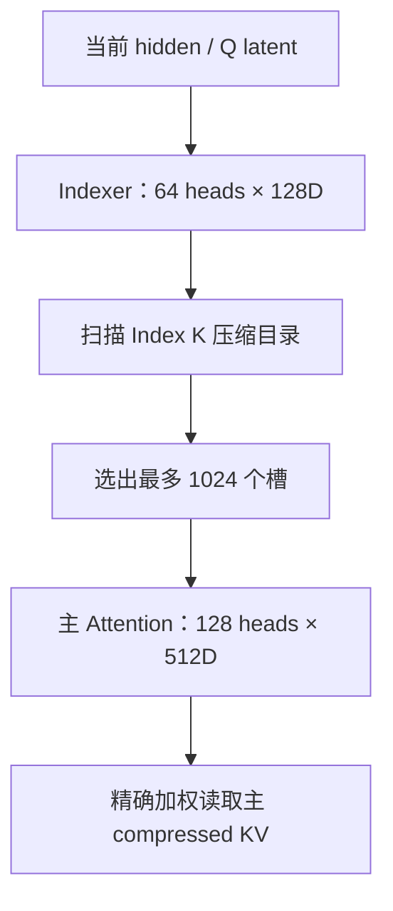

上一篇：[05｜KV Cache](/articles/deepseek-v4-05-kv-cache/) · [系列总览](/articles/deepseek-v4-model-architecture-learning-series/) · 下一篇：[07｜DeepSeek MoE](/articles/deepseek-v4-07-moe/)

DeepSeek V4 的注意力看起来像很多模块叠在一起，根本原因却只有两个：

1. 百万 token 的历史状态存不下；
2. 当前 Query 也不能每步都用昂贵的 512 维主 Attention 扫完整历史。

它按层叠加四个策略：

- 同一个 512 维向量同时作为 K 和 V，先少存一份；
- 最近 128 个 token 的 shared-KV 不做跨 token 的时间池化，用 SWA 保持 token 级时间分辨率；
- 远端历史沿时间压缩成 C4A 或 C128A 槽；
- C4A 候选仍太多，再用便宜的 Indexer 先筛出最多 1024 个压缩槽。

先分开理解，再把它们合成一次 forward。

## 1. DeepSeek-V4-Pro 单层形状总表

输入是 mHC 汇出的工作流：

$$
x\in\mathbb{R}^{B\times S\times7168}
$$

当前配置的核心数字：

| 参数 | 数值 | 含义 |
|---|---:|---|
| Query heads | 128 | 主 Attention 有 128 个查询视角 |
| head dim | 512 | 每个 Query head 的维度 |
| NoPE dim | 448 | 不旋转的内容子空间 |
| RoPE dim | 64 | 施加位置旋转的子空间 |
| Q LoRA rank | 1536 | Q 的共享低秩中间表示 |
| output groups | 16 | 输出投影分成 16 组 |
| output LoRA rank | 1024 | 每组输出低秩维度 |
| SWA window | 128 | 精确局部历史长度 |
| Indexer heads | 64 | C4 检索头数 |
| Indexer head dim | 128 | 便宜检索向量维度 |
| Pro C4 top-k | 1024 | 每个 Query 的远端压缩候选上限 |

表中 128 heads、16 groups 是全模型逻辑形状；Tensor Parallel 后，每个 rank 只持有自己的主 Q heads 与输出 groups。Indexer 的具体并行布局应按实现路径单独确认，不能从主 Q 的切分直接类推。

主 Query 路径：

$$
[B,S,7168]
\xrightarrow{W_{q,a}}
[B,S,1536]
\xrightarrow{\operatorname{RMSNorm}}
[B,S,1536]
\xrightarrow{W_{q,b}}
[B,S,128,512]
$$

`wq_b` 之后，每个 512D Query head 还会做一次不带可学习缩放参数的 RMS 归一化：

$$
q_h\leftarrow q_h\left(\operatorname{mean}(q_h^2)+\epsilon\right)^{-1/2}
$$

随后才对每个 head 的最后 64 维施加 RoPE。前面的 `q_norm` 归一化 1536D 低秩 latent；这里归一化展开后的每个 512D head，两次归一化不能合并成同一步。

共享 KV 路径：

$$
[B,S,7168]
\xrightarrow{W_{kv}}
[B,S,512]
$$

注意这里没有 128 份 K 和 128 份 V；128 个 Query heads 都读取同一组 512D 历史向量。

## 2. 共享 KV 比普通 MQA 更进一步

普通 MQA：

$$
K_j\in\mathbb{R}^{D},\qquad V_j\in\mathbb{R}^{D},\qquad K_j\ne V_j
$$

多个 Query heads 共用一份 K 和一份 V，但仍需缓存两个向量。

DeepSeek V4：

$$
K_j=V_j=c_j\in\mathbb{R}^{512}
$$

对第 $h$ 个 Query head：

$$
s_{ihj}=\frac{q_{ih}^Tc_j}{\sqrt{512}}
$$

$$
\bar o_{ih}=\sum_j\alpha_{ihj}c_j
$$

同一个 $c_j$ 既用于相关性打分，也作为被读取内容。逻辑缓存条目从“两份 512D”降到“一份 512D”。

但这马上制造一个位置编码问题。

## 3. 为什么 K=V 后必须 inverse RoPE

普通 Attention 对 Q、K 做 RoPE，对 V 不做。令：

$$
q'_i=R(i)q_i,\qquad k'_j=R(j)k_j
$$

打分只依赖相对位置：

$$
{q'_i}^Tk'_j
=q_i^TR(i)^TR(j)k_j
=q_i^TR(j-i)k_j
$$

普通 V 不旋转，所以输出没有直接携带 $R(j)$。

现在 K 和 V 是同一个旋转后向量，未经修正的输出为：

$$
\bar o_i=\sum_j\alpha_{ij}R(j)k_j
$$

它把各 Key 的绝对旋转坐标混进输出。V4 按当前 Query 位置做一次逆旋转：

$$
R(-i)\bar o_i
=\sum_j\alpha_{ij}R(-i)R(j)k_j
=\sum_j\alpha_{ij}R(j-i)k_j
$$

输出重新变成相对当前 Query 的表示。

三个细节不能丢：

1. inverse RoPE 只作用于 Attention 输出的最后 64 个 RoPE 维度，前 448 维不旋转；
2. 它按 Query 位置 $i$ 做一次，不是逐个撤销每个 Key 的旋转；
3. 结果不是普通的 $\sum_j\alpha_{ij}k_j$，而是带相对旋转 $R(j-i)$ 的混合。

例如 Query 在位置 10、压缩锚点在位置 7，该槽在逆旋转后的贡献处于 $R(-3)$ 坐标，而不是保留绝对的 $R(7)$。

## 4. SWA：为什么压缩之外还要保留最近 128 个 token

压缩窗口尚未收齐时，因果 Query 不能读取它，否则会偷看到窗口末尾的未来 token。

例如 C128A 的第一个压缩槽覆盖位置 0 到 127。位置 100 的 Query 若读取这个完成态槽，就间接读取了 101 到 127，破坏因果性。它此时又没有任何已完成的 C128 槽可用。

所以每个 C4A/C128A 主干层还保留一个 128-token 的未压缩滑动窗口：

$$
\mathcal L_i=[\max(0,i-127),i]
$$

SWA 负责：

- 当前未完成压缩段；
- 邻近细节、精确 token 级关系；
- 压缩边界附近不丢信息。

“层里有 SWA 分支”不等于“SWA-only 层”。DeepSeek-V4-Pro 的 61 个主干层都是 C4A 或 C128A，但每层都同时读取局部 SWA。

## 5. 时间压缩不是抽样，也不是平均

不要把 C4A 理解成“每 4 个 token 留第 4 个”。压缩器对每个 token 先产生候选特征和逐维 gate。下面先用槽相关记号 $z_{j,t},\ell_{j,t}$ 表示“位置 $t$ 在槽 $j$ 中承担某个窗口角色时”的投影：

$$
z_{j,t}=W_{c}^{(j,t)}x_t
$$

$$
\ell_{j,t}=W_{g}^{(j,t)}x_t+\operatorname{APE}_{j,t}
$$

对压缩窗口 $\mathcal W_j$，简化表达为：

$$
c_j=\operatorname{RMSNorm}\left(
\sum_{t\in\mathcal W_j}
\operatorname{Softmax}_{t}(\ell_{j,t})\odot z_{j,t}
\right)
$$

C4 的具体实现把 `wkv/wgate` 输出拆成左右两组 512D：前四个位置使用左半投影，后四个位置使用右半投影；这就是上式中 $W^{(j,t)}$ 随窗口角色变化的含义。C128 没有左右重叠，`coff=1`，每个 token 只产生一组 512D 候选与 gate。

| Compressor | `wkv/wgate` 每 token 输出 | 池化角色 |
|---|---:|---|
| C4 | $2\times512$ | 上一组的左半 + 当前组的右半组成 8-token 窗口 |
| C128 | $512$ | 当前连续 128-token 段 |

随后才在 $c_j$ 的最后 64 维按 anchor 位置施加 RoPE。

这与简单平均有四个区别：

- 融合的是学习投影后的 $z_t$，不是原始 token ID；
- gate 是向量，不同输出维可以关注窗口内不同 token；
- APE 给窗口内相对位置加可学习偏置；
- 池化完成后只对压缩结果做一次 anchor RoPE。

## 6. C4A：8-token 感受野，stride 为 4

第 $j$ 个 C4 压缩槽覆盖：

$$
\mathcal W_j=[4j-4,\ 4j+3]
$$

anchor 位置：

$$
a_j=4j
$$

负位置按零处理，因此开头的窗口是：

| 压缩槽 | 覆盖原始位置 | anchor |
|---:|---|---:|
| $c_0$ | padding + `[0,1,2,3]` | 0 |
| $c_1$ | `[0,1,2,3,4,5,6,7]` | 4 |
| $c_2$ | `[4,5,6,7,8,9,10,11]` | 8 |

相邻窗口重叠 4 个 token。它的长期条目数量约为原始长度的 $1/4$，所以叫 C4；但单槽感受野是 8，不是 4。

因果可见条件是窗口全部完成：

$$
i\ge4j+3
$$

位置 6 还不能读取 $c_1$，因为它包含位置 7；位置 7 才能读。

## 7. C128A：128-token 非重叠锚点

第 $j$ 个 C128 压缩槽覆盖：

$$
\mathcal W_j=[128j,\ 128j+127]
$$

anchor：

$$
a_j=128j
$$

它不重叠，每 128 个原始 token 产生一条长期压缩记录。因果条件：

$$
i\ge128j+127
$$

在最大上下文 1,048,576 下，压缩槽最多：

$$
1{,}048{,}576/128=8192
$$

C128A 没有学习式 Indexer；主 Attention 读取全部因果可见压缩锚点。实现仍可把这些位置组织为 sparse kernel 的索引列表，并把上限描述为 8192，但它不是从更多候选里学习选出的 Top-8192。

## 8. C4A 为什么还需要 Indexer

百万上下文的 C4 压缩槽数量约为：

$$
1{,}048{,}576/4=262{,}144
$$

即使比原始 token 少 4 倍，让 128 个 512D Query heads 每步扫描 26 万候选仍然昂贵。于是 C4A 先运行一个便宜检索器：



可以把 Index K 想成目录、主 compressed KV 想成正文：目录告诉主 Attention 本次翻哪几页，但目录分数不等于正文阅读权重。

## 9. Indexer 自己怎么算

它复用主 Q 路径的 1536 维 normalized latent：

$$
q_r\in\mathbb{R}^{B\times S\times1536}
$$

再投影为：

$$
q^I\in\mathbb{R}^{B\times S\times64\times128}
$$

Indexer 有自己独立的 128D C4 Compressor，生成：

$$
k^I_j\in\mathbb{R}^{128}
$$

每头先做位置处理和点积、截掉负相关，再用当前 token 生成的 head coefficients 聚合。参考路径对 Indexer Q/K 的最后 64 维施加 RoPE，随后做 Hadamard rotation 与量化。令：

$$
g_{ih}=\frac{(W_{weight}x_i)_h}{\sqrt{128}\sqrt{64}}
$$

$g_{ih}$ 不是 Softmax 概率，不要求非负，也不在 64 个 heads 上归一化。近似评分式为：

$$
r_{ij}=\sum_{h=1}^{64}g_{ih}
\operatorname{ReLU}\left({q^I_{ih}}^Tk^I_j\right)
$$

然后：

$$
I_i=\operatorname{TopK}(r_i,1024)
$$

当前 Pro 配置的 `index_topk=1024`；Flash checkpoint 是 512。Top-k 是 checkpoint-specific 配置，不能把某篇早期文章中的 512 无条件套到 Pro。

还要分清两种评分：

| 分数 | 作用 | 维度/成本 |
|---|---|---|
| Indexer score $r_{ij}$ | 选择去哪些压缩槽读取 | 64 heads × 128D，较便宜 |
| 主 Attention score | 对选中槽计算最终权重 | 128 heads × 512D，较贵 |

Indexer 未选中的槽没有被删除；它们仍在 cache 中，未来 Query 可以重新选中。

## 10. 为什么 Indexer 不能复用主 Compressor

二者目标不同：

- 主 Compressor 产生 512D 内容，既用于打分也用于最终加权读取；
- Indexer Compressor 产生 128D 检索键，优化目标是快速排序候选。

所以 C4A 有两套独立参数与状态：

1. 主 `Compressor` + 主 compressed KV；
2. Indexer `Compressor` + Index K。

它们碰巧都以 ratio 4 推进，不代表输出相同。生产运行时也必须分别保存两套未完成窗口的 state。

## 11. C4A 的五类缓存

“五类缓存”是 C4A 层的最大集合，不是每一层都有五份：

| 状态 | 用途 | C4A | C128A |
|---|---|:---:|:---:|
| SWA shared-KV cache | 最近 128 个原始 token 的 token 级 shared KV | ✓ | ✓ |
| 主 compressor state | 主压缩窗口尚未完成的候选与 gate 状态 | ✓ | ✓ |
| 主 compressed KV cache | 已完成的长期 512D 压缩历史 | ✓ | ✓ |
| Indexer compressor state | Index K 尚未完成的窗口状态 | ✓ |  |
| Index K cache | 供 Indexer 扫描的 128D 压缩目录 | ✓ |  |

生命周期：

- SWA：每个 token 写，读取最近最多 128 条；它保持 token 级时间位置，但 512D shared-KV 本身仍是 latent，物理缓存也可能量化；
- compressor state：每步更新，固定保留 8-token 或 128-token 窗口所需状态；
- compressed cache：只在压缩边界完成时追加；
- Index K：C4 边界完成时追加；
- Top-k 索引：每个 Query 的索引值没有跨 Decode step 的语义消费者；底层可预分配固定地址的 buffer，在后续层或步骤覆盖复用。

## 12. Decode 的位置 6 到 7，到底更新什么

以 C4A 为例：

### 位置 6

1. 当前 512D shared KV 写入 SWA 环形窗口；
2. 主 Compressor 收到位置 6 的候选与 gate；
3. Indexer Compressor 同样收到位置 6；
4. 当前 8-token 压缩窗口还缺位置 7，不产生新长期槽；
5. Indexer 根据已有完成槽为 Query 6 选候选；
6. 主 Attention 读取 SWA + 已完成的远端槽。

### 位置 7

1. SWA 写入位置 7；
2. 两个 Compressor 补齐当前窗口；
3. 主 compressed KV 追加一条 512D 槽；
4. Index K 追加一条 128D 槽；
5. 新槽从满足因果条件的 Query 开始可见；
6. 两套 C4 state 向下一个重叠窗口滚动。

这解释了为什么 compressor state 不能只是一次 kernel 的临时 workspace：一个压缩槽跨多个 Decode step 才完成，未完成贡献必须跟请求一起存活。

## 13. DeepSeek-V4-Pro 的层型分布

Pro 有 61 个主干 Block：

| 层型 | 数量 | 是否有局部 SWA | 是否有 Indexer |
|---|---:|:---:|:---:|
| C128A | 31 | ✓ |  |
| C4A | 30 | ✓ | ✓ |
| SWA-only | 0 | — | — |

配置中的 `compress_ratios` 还为独立 MTP 层包含一个末尾 ratio 0。不能把最后的 0 当作第 61 个主干层并得出“Pro 有一层纯 SWA”。Flash 的层型分布不同，确实包含 2 个 SWA-only 主干层。

## 14. 把一次主 Attention forward 合起来

```python
def v4_attention(x, layer_cache, position):
    # 1) Query：7168 -> 1536 -> 128 x 512
    q_latent = q_norm(wq_a(x))
    q = wq_b(q_latent).view(128, 512)
    q = q * rsqrt(mean(q * q, dim=-1, keepdim=True) + eps)
    q[..., -64:] = rope(q[..., -64:], position)

    # 2) 当前未压缩 shared KV：同一向量既作 K 又作 V
    kv = kv_norm(wkv(x))                 # [512]
    kv[-64:] = rope(kv[-64:], position)
    layer_cache.swa.write(position, kv)

    # 3) 更新长期主压缩路径
    compressed = main_compressor.step(x, position)
    if compressed is not None:
        layer_cache.main_compressed.append(compressed)

    # 4) 构造远端候选
    if layer_type == "c4a":
        index_k = index_compressor.step(x, position)
        if index_k is not None:
            layer_cache.index_k.append(index_k)
        remote_ids = indexer.topk(q_latent, layer_cache.index_k, k=1024)
    else:  # c128a
        remote_ids = all_causally_ready_c128_slots(position)

    # 5) 主 Attention 读局部 + 远端
    ids = concat(swa_ids(position, 128), remote_ids)
    o = sparse_shared_kv_attention(
        q, layer_cache, ids, attn_sink=attn_sink
    )

    # 6) 修正 shared K=V 带来的坐标问题
    o[..., -64:] = inverse_rope(o[..., -64:], position)
    return grouped_low_rank_output_projection(o)
```

实际 kernel 会融合、并行和量化多个步骤，但这个执行顺序保留了模型语义。

## 15. Attention sink 是什么

每个主 Query head 还有一个学习到的 `attn_sink` logit。稀疏 Attention 的在线 Softmax 分母除了真实候选外，还加上：

$$
\exp(sink_h)
$$

但 sink 没有对应的非零 Value，因此它像一个“本次不从任何候选读取”的空槽：可以吸收部分概率质量，让输出幅度降低。

它不是 KV Cache 中的固定 token，也不占一个历史位置。把它写成模型额外读取某个 BOS token 会误导；更准确的是带零 value 的学习式归一化槽。

## 16. 输出投影也不是一个简单大矩阵

Attention 输出形状：

$$
o\in\mathbb{R}^{B\times S\times128\times512}
$$

128 个 heads 分成 16 组，每组 8 heads：

$$
8\times512=4096
$$

每组通过自己的低秩投影：

$$
4096\longrightarrow1024
$$

16 组结果拼接：

$$
16\times1024=16384
$$

再通过 `wo_b`：

$$
16384\longrightarrow7168
$$

这是一种 grouped low-rank output projection。它与 Q 的 `7168→1536→128×512` 低秩路径相呼应，但参数不共享。

## 17. 每种层到底读多少历史

设当前上下文长度为 $L$：

| 路径 | 候选规模 | 主 512D Attention 实际读取 |
|---|---:|---:|
| SWA | 最多 128 | 最多 128 |
| C4A 远端 | 约 $L/4$ 个 Index 候选 | 最多 1024 个主压缩槽 |
| C128A 远端 | 约 $L/128$ | 读取所有因果可见槽，1M 时最多 8192 |

不能笼统声称“整个 V4 Attention 是 $O(1)$”：

- C4 的昂贵主 Attention 工作集有固定 Top-k，但 128D Indexer 仍扫描约 $L/4$ 个候选；
- C128 读取约 $L/128$，只是在模型 1M 上下文上限内数值最多 8192；
- SWA 固定为 128。

更准确的结论是：**V4 对最昂贵的主 Attention 工作集施加了明确约束，并用更便宜的检索或更强的压缩承担长距离覆盖。**

## 18. vLLM 如何把异构状态装进物理页

下面的实现数字固定参考 vLLM commit [`6accb779`](https://github.com/vllm-project/vllm/commit/6accb779a361c723cded3f9422b48d3fe4da0901) 中 NVIDIA FlashMLA / `fp8_ds_mla` 路径及同期官方博客。模型数学稳定，但其他 backend、cache dtype 或后续版本可能采用不同 entry 与页布局，不能把这些数字泛化为所有 vLLM 部署。

在上述固定路径中，vLLM 给 compressed layer 统一使用代表 256 个**原始 token 位置**的逻辑 block：

| 层型 | 一个逻辑 block 覆盖原始位置 | 实际长期压缩条目 |
|---|---:|---:|
| C4A | 256 | $256/4=64$ |
| C128A | 256 | $256/128=2$ |

调度器、prefix cache 和 slot mapping 都可以按同一个 256 原始位置单位推理，而不用为每种压缩率发明一套逻辑坐标。

压缩器 state 也按滑动窗口型 cache 管理：C4 需要 8-token 状态，C128 需要 128-token 状态。这让 prefix caching、分离式 Prefill/Decode 传输和 CUDA Graph 可以复用已有 cache 生命周期抽象。

五种逻辑状态的每页字节大小仍不同。vLLM 通过选择 block size、压缩率和物理 entry 格式，把它们归并到 3 个 page-size bucket，共享 block pool，减少跨池碎片：

- 大 bucket：C4 主 KV、SWA KV、C4/C128 主 compressor state；
- 中 bucket：C4 Index K 与 Indexer compressor state；
- 小 bucket：C128 主 KV。

若要继续追物理 entry、Packed Slab、BlockPool 与 prefix hit 的具体映射，参见本站 [DeepSeek V4 KV Cache 与 vLLM 初学者指南](/articles/deepseek-v4-kvcache-vllm-beginner-guide/)。

## 19. 内核为什么要融合和多流并发

该 NVIDIA 路径的 C4 Decode 在主 Attention 前有三个近似独立分支：

1. Indexer 检索；
2. 主 KV 压缩；
3. SWA 当前 token 插入。

如果每个小步骤单独启动 kernel、写回 HBM，再由下一 kernel 读取，Decode 的小 batch 会被 launch 和内存往返拖慢。vLLM 的实现会：

- 融合 Compressor + RMSNorm + RoPE + cache insertion；
- 融合 inverse RoPE + 后续量化；
- 融合 Query norm、SWA KV RoPE 和插入中的元素级工作；
- 在不同 CUDA streams 上重叠 Indexer 与主压缩/SWA 分支。

融合改变的是中间张量是否落地，并发改变的是时间安排；它们都不能改变压缩边界、因果可见性或最终候选集合。

## 20. 常见误区

**误区一：V4 就是 `num_key_value_heads=1` 的普通 MQA。**

不够准确。V4 同一个 512D 向量同时作 K 和 V，并因此需要 inverse RoPE。

**误区二：C4 每 4 个 token 抽一个，窗口长度也是 4。**

它是学习式 gated pooling；典型窗口覆盖 8 个位置、stride 为 4。

**误区三：压缩时先对每个 token 做 RoPE 再平均。**

参考实现先池化，再按压缩 anchor 对结果的最后 64 维做一次 RoPE。

**误区四：C128 也有 Indexer。**

没有。它读取所有因果可见的 C128 锚点。

**误区五：C4 Indexer 选的是原始 token。**

选的是压缩槽索引；主 Attention 再读取对应的 512D 主压缩内容。

**误区六：五类 cache 每层都存在。**

C128A 没有 Indexer 的两类状态；五类是 C4A 最大集合。

**误区七：Top-k 没选中的槽会从 cache 淘汰。**

不会。Top-k 是当前 Query 的临时读取计划。

**误区八：Pro 有一个主干 SWA-only 层。**

没有；末尾 ratio 0 属于独立 MTP 配置。

**误区九：inverse RoPE 恢复了普通未旋转 V。**

它把输出变到 Query-relative 坐标，仍保留 $R(j-i)$。

**误区十：V4 的全部检索链都是常数复杂度。**

C4 Indexer 和 C128 锚点数仍随长度增长，只是维度与压缩率显著降低，且主 C4 Attention 被 Top-k 限制。

## 21. 自测

1. 为什么 shared K/V 会把绝对 RoPE 坐标带进 Value 输出？
2. C4 的“4”和“8”分别表示什么？
3. 位置 6 为什么不能读取覆盖 `[0..7]` 的压缩槽？
4. Indexer score 与主 Attention score 各决定什么？
5. C4A 为什么有两套 Compressor state？
6. Pro 的 61 个主干层怎样分布？
7. 为什么 C128 在位置 100 仍需要 SWA？

若你能画出“当前 token → SWA 写入 → 两套 C4 state → Index Top-k → 主 compressed KV → inverse RoPE → 分组输出投影”，这章就真正打通了。

## 一手源码与资料

- [DeepSeek-V4-Pro 配置](https://huggingface.co/deepseek-ai/DeepSeek-V4-Pro/blob/main/config.json)
- [DeepSeek 官方 `Compressor`、`Indexer`、`Attention`](https://huggingface.co/deepseek-ai/DeepSeek-V4-Pro/blob/main/inference/model.py)
- [DeepSeek 官方 sparse Attention kernel](https://huggingface.co/deepseek-ai/DeepSeek-V4-Pro/blob/main/inference/kernel.py)
- [vLLM 官方 DeepSeek V4 长上下文文章](https://blog.vllm.ai/2026/04/24/deepseek-v4.html)
- [vLLM 固定版本 Attention](https://github.com/vllm-project/vllm/blob/6accb779a361c723cded3f9422b48d3fe4da0901/vllm/models/deepseek_v4/attention.py)
- [vLLM 固定版本 Compressor](https://github.com/vllm-project/vllm/blob/6accb779a361c723cded3f9422b48d3fe4da0901/vllm/models/deepseek_v4/compressor.py)
- [DeepSeek Sparse Attention](https://arxiv.org/abs/2512.02556)

上一篇：[05｜KV Cache](/articles/deepseek-v4-05-kv-cache/) · [系列总览](/articles/deepseek-v4-model-architecture-learning-series/) · 下一篇：[07｜DeepSeek MoE：384 个专家如何只激活 6 个](/articles/deepseek-v4-07-moe/)
