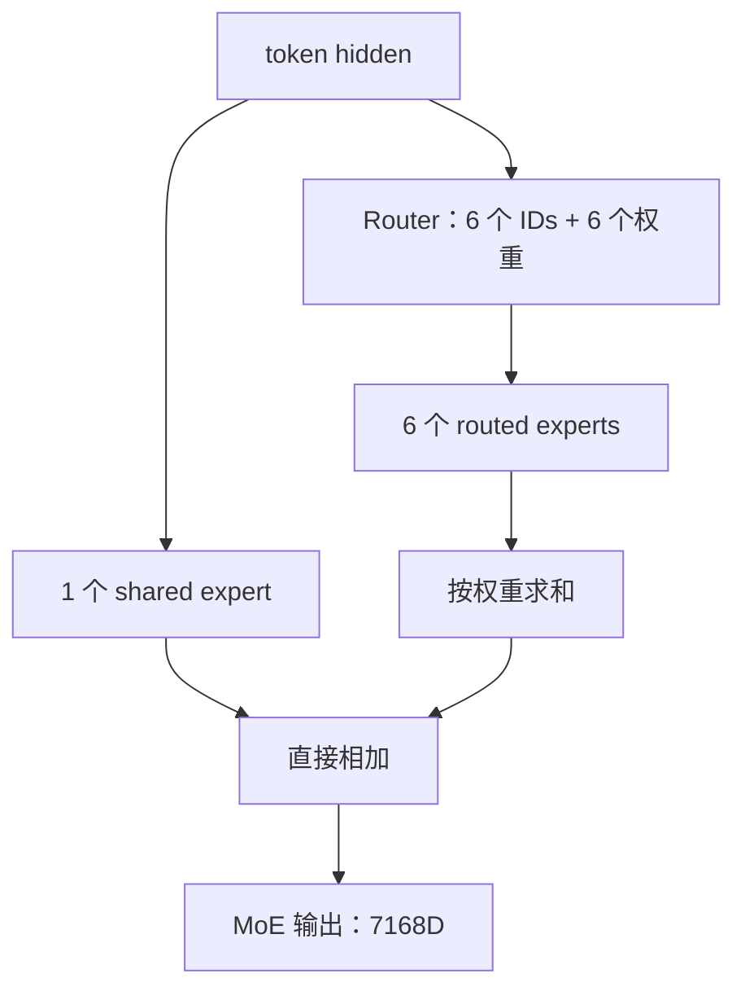
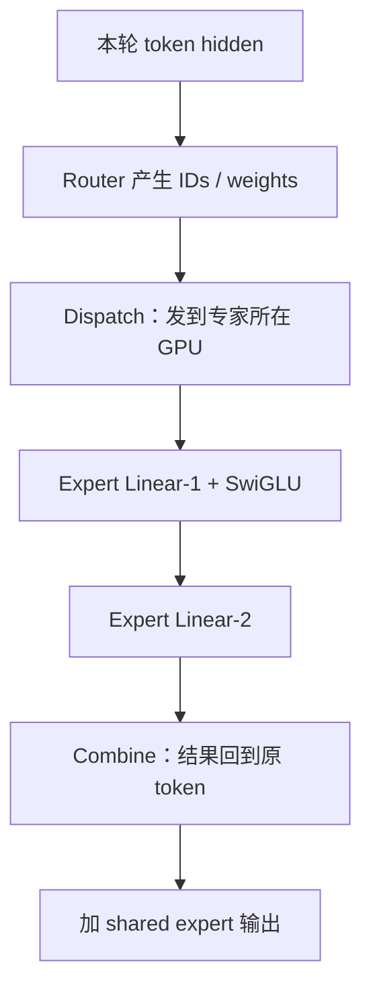

上一篇：[06｜V4 混合压缩注意力](/articles/deepseek-v4-06-hybrid-compressed-attention/) · [系列总览](/articles/deepseek-v4-model-architecture-learning-series/) · 下一篇：[08｜完整推理链](/articles/deepseek-v4-08-end-to-end-inference/)

Attention 负责在 token 之间交换信息，FFN 负责对每个 token 做非线性变换。稠密 Transformer 让所有 token 经过同一套大 FFN；MoE 准备许多套 FFN 专家，再让每个 token 只走少数几套。

DeepSeek-V4-Pro 每层有：

- 384 个 routed experts；
- 每个 token 选择 6 个；
- 另有 1 个永远执行的 shared expert；
- 前 3 层使用 Hash routing 决定专家身份；
- routed expert 权重使用 FP4。

模型可以拥有约 1.6T 总参数，但一个 token 不会读取全部专家参数，这就是稀疏 MoE 的核心经济性。

## 1. MoE 在 Block 的哪个位置

每个主干 Block 有 Attention 子层和 MoE 子层，二者都被各自的 mHC 路由包裹：

```python
u, post, comb = hc_pre(X, attn_router)
a = attention(rms_norm(u))
X = hc_post(a, X, post, comb)

u, post, comb = hc_pre(X, ffn_router)
m = moe(rms_norm(u), input_ids)
X = hc_post(m, X, post, comb)
```

MoE 接收到的是一条 $H=7168$ 维工作流，不是四条流分别执行 4 次。输出仍是 7168 维，再由 `hc_post` 写回四流。

## 2. 先看路由器的输入输出

把当前调度轮所有 token 展平成 $T$ 行：

$$
x\in\mathbb{R}^{T\times7168}
$$

路由矩阵：

$$
W_g\in\mathbb{R}^{384\times7168}
$$

先计算 384 个 raw logits：

$$
z=xW_g^T\in\mathbb{R}^{T\times384}
$$

对每个专家的 affinity 使用：

$$
s_e=\sqrt{\operatorname{softplus}(z_e)}
=\sqrt{\log(1+e^{z_e})}
$$

因此 $s_e>0$。它不是在 384 个专家上做 Softmax；专家间的归一化发生在选出 6 个以后。

## 3. 普通层怎样选择 Top-6

非 Hash 层还有 correction bias：

$$
b\in\mathbb{R}^{384}
$$

专家索引由：

$$
I=\operatorname{Top6}(s+b)
$$

决定。但最终混合权重从**未加 bias 的原始 affinity** 中取：

$$
\widetilde w_e=\frac{s_e}{\sum_{j\in I}s_j},\qquad e\in I
$$

随后乘 routed scaling factor 2.5：

$$
w_e=2.5\widetilde w_e
$$

所以：

$$
\sum_{e\in I}w_e=2.5
$$

不是 1。

这套“选择分数”和“混合权重”分离很重要：correction bias 可以调整哪些专家更容易被选中、改善流量平衡，却不直接改写选中专家之间的内容混合比例。

### 一个 4 专家缩小例子

假设只选 Top-2：

$$
s=[0.8,0.7,0.4,0.2]
$$

$$
b=[0,0,0.5,0]
$$

用于选择的：

$$
s+b=[0.8,0.7,0.9,0.2]
$$

因此选专家 2 和 0。但权重不是按 `[0.9,0.8]` 算，而按原始 `[0.4,0.8]`：

$$
w_2=2.5\times\frac{0.4}{1.2}\approx0.833
$$

$$
w_0=2.5\times\frac{0.8}{1.2}\approx1.667
$$

## 4. 前三层 Hash routing 到底固定了什么

DeepSeek-V4-Pro 的 layer 0、1、2 不用 `Top6(s+b)` 决定专家 ID，而是从 checkpoint 中保存的表查：

$$
I=H_l[\text{token\_id}]
$$

每层的表形状：

$$
H_l\in\mathbb{Z}^{129280\times6}
$$

它不是运行时调用语言自带的 `hash()`，而是一张针对 token ID 的确定性 `tid2eid` 映射。每个 Hash 层有自己的表，所以同一 token ID 在 layer 0 与 layer 1 不一定去同一组专家。

但 Hash routing **只固定专家身份，不固定混合权重**。参考实现仍计算当前 hidden 的 384 个 affinity，再取被映射到的 6 项并归一化。

假设某个缩小版 Hash 层把 token ID 42 固定映射到专家 `{1,6}`：

| 上下文 | 当前 affinity $(s_1,s_6)$ | 缩放后权重 |
|---|---|---|
| A | $(2,3)$ | $(1.0,1.5)$ |
| B | $(4,1)$ | $(2.0,0.5)$ |

同一 token ID、同一层，专家集合相同；但上下文改变 hidden，混合比例仍会改变。

准确概括是：**前三层由 token ID 决定去哪些专家，由当前 hidden state 决定每个专家占多少权重。**

## 5. 一个专家内部就是 SwiGLU FFN

每个专家的中间维度 $I=3072$：

$$
W_1,W_3\in\mathbb{R}^{3072\times7168}
$$

$$
W_2\in\mathbb{R}^{7168\times3072}
$$

计算：

$$
g=xW_1^T,\qquad u=xW_3^T
$$

V4 对数值做 clamp：

$$
g\leftarrow\min(g,10)
$$

$$
u\leftarrow\operatorname{clip}(u,-10,10)
$$

SwiGLU 激活：

$$
h=\operatorname{SiLU}(g)\odot u
$$

下投影：

$$
E_e(x)=hW_2^T\in\mathbb{R}^{7168}
$$

三个矩阵的逻辑参数量：

$$
3\times7168\times3072=66{,}060{,}288
$$

即每个专家约 6606 万参数。

## 6. Routed expert 与 shared expert 怎样合并

选中的 routed experts 加权求和：

$$
y_{routed}=\sum_{e\in I}w_eE_e(x)
$$

shared expert 不参加 Top-6，始终执行：

$$
y=y_{routed}+E_{shared}(x)
$$



从 DeepSeekMoE 的设计意图看，shared expert 提供所有 token 都可使用的公共计算路径，从而给 routed experts 留出更强的分工空间；具体学到了哪些能力不能仅从结构直接断言。它是额外的第 7 条 FFN 计算路径，不是 Top-6 中预留的一个名额。

## 7. 1.6T 总参数为什么不等于每 token 计算 1.6T 参数

单层 384 个 routed expert 参数池：

$$
384\times66{,}060{,}288
\approx25.37\ \text{B parameters}
$$

61 层 routed expert 参数池合计约：

$$
25.37\text{B}\times61\approx1.547\ \text{T}
$$

但每 token、每层只访问 6 个 routed + 1 个 shared：

$$
7\times66{,}060{,}288
\approx462.42\ \text{M parameters/layer}
$$

61 层专家路径累计约 28.2B 个参数访问，再加 Attention、mHC、Embedding/LM Head 等，才形成模型公布的 activated-parameter 量级。

“激活参数”描述本次计算访问的路径规模，不代表 GPU 上只需保存这些权重。服务仍需让全部专家权重可被路由到，通常把它们分布在多张 GPU 上。

## 8. FP4、FP8 与 BF16 的边界

配置中的：

```json
"expert_dtype": "fp4"
```

针对的是 routed expert 矩阵权重。不能概括成“整个模型、所有激活、所有计算都是 FP4”。更准确地说：

- routed expert 权重以 FP4 表示并带缩放信息；
- shared expert 没有被参考实现显式设为 routed FP4 路径；
- 其他大量线性权重主要遵循模型 FP8 量化配置，某些层保留 BF16/FP32；
- hidden 在模块边界通常以 BF16 语义存在；
- kernel 内会把激活量化到适合 FP8×FP4 或 FP8×FP8 GEMM 的格式；
- 累加、激活函数和缩放常使用更高精度以保持稳定。

“权重存储精度”“乘法输入精度”“累加精度”“模块输出精度”是四件事。阅读量化 kernel 时必须分别标注。

## 9. 路由后的 token 怎样送到专家 GPU

若 384 个专家分在多张 GPU 上，当前 rank 上的 token 常会选中远端专家。生产 Expert Parallel 通常经历：



假设本轮有 $T$ 个 token，共有 $6T$ 个 routed assignments。运行时先按 expert ID 对 token 重排，让同一专家收到的多行合成 GEMM；计算后再按原 token 索引反向散射并加权。

通信与计算的典型重叠方式是分 wave：

- 当前 wave 执行专家 GEMM；
- 下一 wave 的 token 同时发往专家；
- 上一 wave 的结果同时返回原 rank。

目标不是消灭通信，而是让网络传输被专家计算尽量遮住。

## 10. 参考实现与 vLLM 生产实现为什么不同

Hugging Face 官方参考实现强调易读：

1. 每个 rank 只实例化自己负责的专家；
2. 本地遍历有 token 的专家；
3. 把本地结果累加到相应 token 行；
4. 最后 `all_reduce(y)`，让各 rank 获得完整结果。

这忠实表达数学结果，却不是大规模服务唯一或最高效的通信方案。

vLLM 会使用 FusedMoE / MegaMoE、Expert Parallel dispatch、物理专家布局和负载均衡机制。源码可能把路由、排序、量化 GEMM、combine 融进少数 kernel。判断实现是否正确时看不变量：每个 token 的 6 个目标专家、对应原始 affinity 权重、shared expert 和最终相加是否保留。

## 11. 负载均衡为什么是 MoE 的系统难点

理论上每 token 只算 6 个专家；若大量 token 同时选择同一个专家：

- 该专家 GPU 排队，其他 GPU 空闲；
- token dispatch 出现热点；
- 批量 GEMM 的形状极不均匀；
- 整层延迟由最慢 rank 决定。

V4 的 `noaux_tc` 不应被解释为“训练中完全没有任何平衡机制”。官方报告更准确的描述是：主要采用 auxiliary-loss-free 的 correction-bias 方式维持全局平衡，同时保留轻量的 sequence-wise balance 约束，避免单序列内部极端失衡。

推理时 correction bias 已经是 checkpoint 固定参数，只参与 Top-6 选择；服务引擎还可通过 expert placement、冗余专家和运行时统计改善物理负载，但不能随意改变模型规定的路由语义。

## 12. Hash routing 的确定性与边界

前三层的专家 ID 只依赖 token ID，因此在给定层内具有确定性，也可以提前计算路由索引。公开报告没有进一步说明采用 Hash routing 的全部动机；实际 token dispatch 仍需等待该层 hidden activation 就绪。它的直接效果是专家集合不随当前 hidden 波动，而混合权重仍保持上下文相关。

但不要过度推论：

- 路由器仍算 affinity 来决定混合权重；
- 同一个 token 在不同 Hash 层有不同表；
- 同一个 token 在 batch 中出现多次，会去同一组专家但权重可不同；
- 第 3 层之后恢复基于 hidden score + bias 的 Top-6。

## 13. MoE 没有 KV Cache

专家 FFN 对当前 token 的输入做无状态映射：

$$
y_t=\operatorname{MoE}(x_t)
$$

未来 token 不会再次读取 $t$ 的专家中间激活，所以不需要像 Attention 那样保留 K/V。每个新 token、每一层都会重新计算 router 分数、专家 IDs、权重和专家输出。

可以缓存的是专家权重本身或 kernel 运行计划，但那属于模型常驻参数和系统优化，不是请求级序列状态。

## 14. 一次 MoE forward 的概念代码

```python
def gate(x, input_ids, layer_id):
    raw = linear(x.float(), gate_weight.float())  # [T, 384]
    affinity = sqrt(softplus(raw))

    if layer_id < 3:
        expert_ids = tid2eid[layer_id][input_ids] # [T, 6]
    else:
        expert_ids = topk(affinity + correction_bias, k=6)

    selected = gather(affinity, expert_ids)       # 不含 bias
    weights = selected / selected.sum(-1, keepdim=True)
    weights = weights * 2.5
    return expert_ids, weights

def moe(x, input_ids, layer_id):
    ids, weights = gate(x, input_ids, layer_id)
    routed = dispatch_compute_combine(x, ids, weights)
    shared = shared_expert(x)
    return routed + shared
```

若 kernel 把路由权重乘在 $W_2$ 之前的中间激活上，只要专家线性层无 bias，与最后乘专家输出在代数上等价。

## 15. 常见误区

**误区一：384 个专家每个 token 都计算。**

每层只算 6 个 routed，再加 1 个 shared。

**误区二：Top-6 权重之和为 1。**

归一化后还乘 2.5，最终和为 2.5。

**误区三：correction bias 直接参与最终加权。**

它只影响非 Hash 层选择；权重从未加 bias 的 affinity 中 gather。

**误区四：Hash 层不需要 gate。**

专家 ID 查表，但混合权重仍由当前 hidden 的 affinity 决定。

**误区五：shared expert 是 Top-6 中一个。**

它在 Top-6 之外始终执行。

**误区六：整个 MoE 都用 FP4 计算。**

明确使用 FP4 的是 routed expert 权重；激活、累加、shared expert 和其他模块有各自精度。

**误区七：MoE 也需要缓存历史 token。**

它是当前 token 的前馈映射，没有 Attention 式请求级 KV Cache。

**误区八：参考实现的 `all_reduce` 就是所有生产 MoE 的唯一通信方式。**

生产引擎通常做真实 dispatch/combine 与融合专家计算；参考实现主要表达语义。

## 16. 自测

1. 为什么 `s+b` 选专家，而权重使用原始 $s$？
2. `norm_topk_prob=true` 后，最终权重和为什么仍是 2.5？
3. 前三层同一 token ID 的专家身份和专家权重，哪些固定、哪些随上下文变？
4. 为什么总参数巨大，但单 token 只访问较小部分？
5. Expert Parallel 的 dispatch 与 combine 分别在移动什么？
6. MoE 为什么不需要请求级历史 cache？

## 一手资料与源码

- [DeepSeek-V4 技术报告](https://arxiv.org/html/2606.19348)
- [DeepSeek-V4-Pro 配置](https://huggingface.co/deepseek-ai/DeepSeek-V4-Pro/blob/main/config.json)
- [DeepSeek 官方 `Gate`、`Expert`、`MoE`](https://huggingface.co/deepseek-ai/DeepSeek-V4-Pro/blob/main/inference/model.py)
- [vLLM 固定版本 DeepSeek V4 NVIDIA 实现](https://github.com/vllm-project/vllm/blob/6accb779a361c723cded3f9422b48d3fe4da0901/vllm/models/deepseek_v4/nvidia/model.py)
- [vLLM Top-k bias router](https://github.com/vllm-project/vllm/blob/6accb779a361c723cded3f9422b48d3fe4da0901/vllm/model_executor/layers/fused_moe/router/fused_topk_bias_router.py)

上一篇：[06｜V4 混合压缩注意力](/articles/deepseek-v4-06-hybrid-compressed-attention/) · [系列总览](/articles/deepseek-v4-model-architecture-learning-series/) · 下一篇：[08｜完整推理链：从 Prefill 到逐 token Decode](/articles/deepseek-v4-08-end-to-end-inference/)
