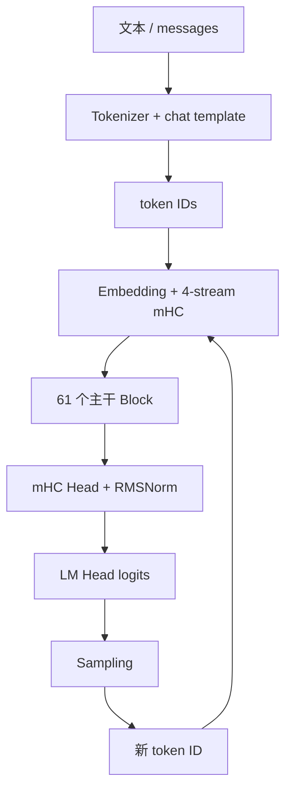
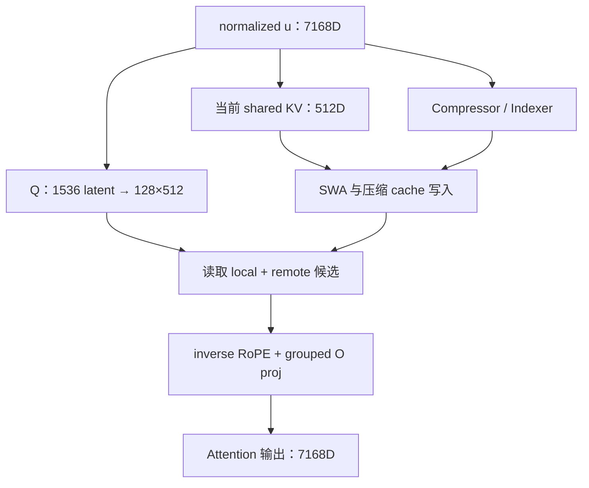

上一篇：[07｜DeepSeek MoE](/articles/deepseek-v4-07-moe/) · [系列总览](/articles/deepseek-v4-model-architecture-learning-series/)

前七章分别拆开了零件。这一章只做一件事：让一个请求从文本进入模型，走完 61 层，生成一个 token，再把新 token 接回下一轮。

读完整链路时始终区分三种东西：

- **模型参数**：所有请求共享，加载后常驻；
- **请求状态**：Attention cache 与压缩器 state，跨 Decode step 存活；
- **本轮激活**：mHC 路由、Query、Attention 权重、MoE Top-6、logits，用完即可释放。

## 1. 端到端总图



循环回去时不会把完整历史文本重新算一遍。新 token 只走一次 61 层，各层从请求自己的 cache 读取历史。

## 2. 两套形状记法

概念模型常用规则 batch：

$$
[B,S,H]
$$

vLLM 为避免 padding，会把本调度轮来自不同请求的 token 打平：

$$
[T,H]
$$

其中 $T$ 是本轮实际计算的 token 行数，不等于请求数。它可能包含一段 Prefill、多个请求的单 token Decode，或 speculative verification 的多行候选。

| 阶段 | 规则 batch | packed batch |
|---|---|---|
| IDs | `[B,S]` | `[T]` |
| Embedding | `[B,S,7168]` | `[T,7168]` |
| mHC residual | `[B,S,4,7168]` | `[T,4,7168]` |
| 子层工作流 | `[B,S,7168]` | `[T,7168]` |
| MoE scores | `[B,S,384]` | `[T,384]` |
| 最终 hidden | `[B,S,7168]` | `[T,7168]` |
| 待采样 hidden | `[B,7168]` | `[N_{sample},7168]` |
| logits | `[B,129280]` | `[N_{sample},129280]` |

数学上逐请求成立的因果与位置关系，由 packed metadata、query offsets、sequence lengths、block tables 和 slot mapping 在物理布局中恢复。

## 3. 请求进入模型之前

服务先把 messages 应用 chat template，再 tokenizer 编码为 token IDs。此处已经决定：

- BOS/EOS 与角色标记；
- tool-call / reasoning 等特殊 token；
- prompt 的精确 token 序列；
- Prefix Cache key 中的 token 内容。

两个文本看起来近似，不代表 token 前缀相同；模型只接收 ID，不接收原始字符串。是否实际命中 Prefix Cache，还取决于对应 cache block 是否仍存在、块边界、cache salt 与模型/cache 配置等条件。

调度器随后决定本轮处理多少 prompt token。长 prompt 可以一次 Prefill，也可拆成 chunked prefill，以便与其他 Decode 请求共享 GPU 时间。

## 4. Embedding 与初始四流

词表并行 Embedding：

$$
\text{IDs}\ [T]
\longrightarrow
x\ [T,7168]
$$

逻辑上复制到四条 mHC 流：

$$
X_{t,i,:}=x_{t,:},\qquad i=1,\ldots,4
$$

初始四条流内容相同。概念代码是 `X = x[:, None, :].expand(-1, 4, -1)`。实现可以用 stride-0 view、广播或与首个 mHC kernel 融合，未必真的写四份相同数据到 HBM；但首个 Block 看到的数学状态等价于四流展开。

## 5. 一个主干 Block 的精确骨架

61 层都遵循：

```python
residual = X
u, post, comb = hc_pre(X, hc_attn_params)
u = attn_norm(u)
a = hybrid_attention(u, request_cache, positions)
X = hc_post(a, residual, post, comb)

residual = X
u, post, comb = hc_pre(X, hc_ffn_params)
u = ffn_norm(u)
m = deepseek_moe(u, current_token_ids, layer_id)
X = hc_post(m, residual, post, comb)
```

每层有两次动态 mHC 路由：一次包 Attention，一次包 MoE。每次都针对每个 token 生成：

$$
4\ \text{个 pre}+4\ \text{个 post}+16\ \text{个 comb}=24
$$

这些路由激活只在当前子层存活；Attention cache 才是跨生成轮的长期状态。

## 6. Attention 子层的一次数据流

对当前工作流 $u\in\mathbb{R}^{T\times7168}$：



每个 Query：

1. `7168→1536→128×512` 形成主 Q；1536D latent 先经过带权 RMSNorm，展开后的每个 512D Query head 再做一次无可学习权重的 RMS 归一化，最后只旋转 64 维；
2. `7168→512` 形成 shared KV，同一向量既作 K 又作 V；
3. 当前 shared KV 写入最近 128-token 的 SWA 区；
4. 当前 hidden 更新主 Compressor，C4 层还更新 Indexer Compressor；
5. C4 用 Indexer 选远端槽，C128 枚举因果可见锚点；
6. 主 Attention 读取局部与远端 shared KV；
7. 输出最后 64 维按 Query 位置 inverse RoPE；
8. 128 heads 经 16 组低秩输出投影回 7168 维。

## 7. Prefill 时 Attention 做什么

假设 prompt 有 $S$ 个 token。单层 Prefill 需要：

- 为所有 token 生成 Q 和未压缩 shared KV；
- 按因果规则构造每个 Query 的局部/压缩候选；
- 批量产生已经完成的 C4/C128 压缩槽；
- 保存继续增量压缩所需的滚动 state：C4 包括上一组 4-token overlap 与当前未完成组，C128 保存当前未完成的 128-token 段；
- 写入 SWA 尾部、主 compressed KV，以及 C4 的 Index K。

对于 C4，压缩槽 $j$ 覆盖 $[4j-4,4j+3]$，只有 Query $i\ge4j+3$ 才可读。批量计算也不能因为所有 prompt token 一次都在 GPU 上，就让早期 Query 看到后面的压缩信息。

Prefill 结束后的请求状态，在模型语义上应与这些 token 逐个增量进入时一致。不同 kernel 的归约顺序可能带来微小浮点差异，因此测试应按执行模式检查 bitwise equality 或规定的数值容差。

## 8. Decode 时 Attention 做什么

对每个活跃请求的新 token：

1. 通过 block table 找到该请求每层的 cache pages；
2. 计算当前 Query 和 shared KV；
3. 把 shared KV 写到 SWA 当前物理 slot；
4. 更新压缩器滚动 state；
5. 若正好到压缩边界，追加长期 compressed row / Index K；
6. 生成当前 Query 的候选索引；
7. 读取 cache，算输出；
8. 当前 Query 与本轮 Top-k 索引值在逻辑上失效，底层工作 buffer 可以覆盖复用；cache 状态继续保留。

Decode 不会为旧 token 重新运行 MoE、mHC 或 LM Head。过去 token 对未来 Attention 的影响已经浓缩在各层 cache 中。

## 9. MoE 子层的一次数据流

Attention 写回四流后，第二套 `hc_pre` 汇出 MoE 输入。对 $T$ 个 token：

$$
[T,7168]\xrightarrow{W_g}[T,384]
$$

前 3 层由 `tid2eid[current_token_id]` 给出 6 个专家 ID，其余层由 `Top6(s+b)` 选择。所有层都用当前 hidden 产生的原始 affinity 形成 6 个权重：

$$
[T,6],\qquad \sum_{e=1}^{6}w_e=2.5
$$

随后：

- 在 Expert Parallel 部署中，token dispatch 到 6 个 routed experts 的拥有设备；单设备实现只需本地分组计算；
- routed FP4 专家执行 SwiGLU FFN；
- 结果返回并按权重 combine；
- 本地或并行执行的 shared expert 结果额外相加；
- 得到 `[T,7168]`，由 `hc_post` 写回四流。

Prefill 和 Decode 的 MoE 数学完全相同，但硬件形态不同：Prefill 的 $T$ 大，同一专家更容易聚集成大 GEMM；Decode 的 $T$ 小，路由通信、负载不均和 kernel launch 更显眼。

## 10. 61 层结束后的输出端

最终状态：

$$
X\in\mathbb{R}^{T\times4\times7168}
$$

mHC Head 为每行动态生成 4 个读取权重并汇流：

$$
h_t=\sum_{i=1}^{4}p_{t,i}X_{t,i}
$$

Final RMSNorm 后，推理引擎只选择需要产出 logits 的行。例如普通请求只取每个序列最后一行：

$$
h_{sample}\in\mathbb{R}^{N_{sample}\times7168}
$$

LM Head：

$$
Z=h_{sample}W_{lm}^{T}
\in\mathbb{R}^{N_{sample}\times129280}
$$

`N_sample` 不一定等于 $T$：Prefill 中大多数中间 token 只为建立上下文与 cache，无需做昂贵词表投影。

## 11. 采样与下一轮

采样器按请求配置与具体后端，对 logits 应用适用的规则：

- 禁止项、重复惩罚或结构化输出约束；
- temperature；
- Top-k / Top-p 等候选过滤；
- greedy 或随机采样。

选出：

$$
\text{next\_id}\in[0,129280)
$$

若是 EOS 或达到停止条件，请求结束并释放它对 cache blocks 的所有权与引用；启用 Prefix Cache 时，部分页面仍可作为可复用前缀保留，直到被淘汰或覆盖。否则：

1. token ID 被返回给 detokenizer，可能产生一段文本；
2. 同一个 ID 作为下一轮 Embedding 输入；
3. 请求逻辑位置加 1；
4. 调度器把它与其他活跃请求重新组成 packed batch；
5. 再走 61 层。

模型不会把 Softmax 概率向量直接送回 Embedding；送回的是被选中的离散 ID。

## 12. 一个四 token 请求的时间线

prompt 为 `[t0,t1,t2]`。

### Prefill

```text
Tokenizer: 产生 3 个 IDs
Embedding: 3×7168
61 层: 处理 3 行，并建立每层 cache
Head: 只取 t2 对应最终 hidden
LM Head + Sampling: 选出 t3
```

### 第一次 Decode

```text
Embedding: 只查 t3
每层 Attention: q3 读取请求的历史 cache，写入 t3 的状态
每层 MoE: 为 t3 重新选择/查表 6 个专家，加 shared expert
Head: t3 hidden → logits
Sampling: 选出 t4
```

### 第二次 Decode

同样只处理 `t4`。`t0..t3` 不再穿过 Block，它们的可复用 Attention 状态已在 cache 中。

## 13. 哪些状态跨轮保存

| 状态 | 生命周期 | 原因 |
|---|---|---|
| 模型权重 | 服务进程生命周期 | 所有请求共享 |
| 各层 SWA shared-KV | 请求生命周期/滑窗范围 | 未来 Query 继续读取 |
| 主 compressed KV | 请求生命周期 | 长距离历史 |
| 主 compressor state | 请求期间以固定大小滚动、覆盖 | C4 保留 overlap/当前组，C128 保留当前未完成段 |
| C4 Index K | 请求生命周期 | 未来 Indexer 检索 |
| C4 Indexer compressor state | 请求期间以固定大小滚动、覆盖 | 继续形成下一条 Index K |
| block table / lengths | 请求生命周期 | 逻辑到物理寻址 |
| 四条 mHC residual | 主干 forward 内跨层存活 | 标准自回归在 `hc_head` 后释放；启用 MTP 时最终四流会临时另存为 draft 输入，但不是 Attention cache |
| `pre/post/comb` | 当前子层 | `hc_post` 后即可释放 |
| Query / Attention 权重的在线状态 | 当前 Attention 调用 | 无未来消费者；完整概率矩阵通常不物化 |
| MoE IDs / weights | 当前层 MoE 调用 | 下层重新路由 |
| logits | 当前采样 | 选出 ID 后通常释放 |

表中描述的是请求语义生命周期；物理 page 或工作 buffer 可以被 Prefix Cache、CUDA Graph 和内存池延长并复用，不代表旧逻辑值仍然有效。

这张表是排查显存泄漏或错误缓存设计最有效的工具：先问“未来哪个计算会读取它”，再决定生命周期。

## 14. 跨卡通信出现在什么地方

实际拓扑依赖 vLLM 配置与硬件，但几个边界稳定存在：

| 模块 | 为什么可能通信 | 官方参考实现的直观方式 |
|---|---|---|
| Vocab-parallel Embedding | token 行分在不同 rank | 非所属输出 0，再 `all_reduce` |
| Tensor-parallel Attention | Q heads / 输出投影分片 | 列/行并行线性层配套 collective |
| Expert Parallel MoE | token 选中远端专家 | 参考版本地专家后 `all_reduce`；生产版 dispatch/combine |
| Vocab-parallel LM Head | logits 分在词表分片 | `all_gather` 或分布式候选合并 |

Decode 的每层计算行数少，collective latency 很容易暴露。高性能实现会做 kernel fusion、多 stream、communication-compute overlap 和 CUDA Graph，尽量减少同步空隙。

## 15. Prefill 与 Decode 的瓶颈地图

| 模块 | Prefill 倾向 | Decode 倾向 |
|---|---|---|
| Attention | 大批量、因果计算多 | 读长历史 cache，带宽敏感 |
| Compressor | 可批量形成许多槽 | 小步更新 state，边界条件多 |
| Indexer | 多 Query 可并行 | 每 Query 扫长 Index K |
| MoE | token 多，专家 GEMM 较大 | token 少，dispatch/负载/launch 显著 |
| mHC | 大矩阵路由投影 | 许多小融合操作 |
| LM Head | 只选采样行可控制 | 大词表权重读取固定存在 |

因此“模型参数相同”不代表两阶段应使用相同 kernel。推理引擎常分别优化 Prefill 与 Decode 路径，同时用等价性测试保证结果一致。

## 16. 一个可对照源码的完整伪代码

```python
def target_model_forward(input_ids, positions, request_state):
    # vLLM 中通常是 packed [T, ...]
    x = parallel_embedding(input_ids)             # [T, 7168]
    X = expand_mhc(x, streams=4)                  # [T, 4, 7168]

    for layer_id in range(61):
        # Attention sublayer
        residual = X
        u, post, comb = hc_pre(X, layer_id, kind="attn")
        u = attn_rms_norm(u)
        a = v4_hybrid_attention(
            u,
            positions=positions,
            cache=request_state.layers[layer_id],
        )
        X = hc_post(a, residual, post, comb)

        # MoE sublayer
        residual = X
        u, post, comb = hc_pre(X, layer_id, kind="ffn")
        u = ffn_rms_norm(u)
        m = deepseek_moe(u, input_ids, layer_id)
        X = hc_post(m, residual, post, comb)

    h = final_hc_head(X)                           # [T, 7168]
    h = final_rms_norm(h)
    sample_h = select_sampling_rows(h, request_state)
    return vocab_parallel_lm_head(sample_h)        # [N_sample, V]
```

`v4_hybrid_attention` 内部的主 Q 还包含两次不同粒度的归一化：`wq_a` 后对 1536D latent 做带权 RMSNorm，`wq_b` 展开后再对每个 512D Query head 做无可学习权重的 RMS 归一化，随后才对最后 64 维施加 RoPE。伪代码把这些细节封装在 Attention 函数里，并不代表可以省略。

生产源码若把 `hc_post + hc_pre + RMSNorm` 合成一个 kernel，或让 C4 的 Indexer 与主 Compressor 在两条 CUDA stream 并发，不代表执行图失去上述阶段；只是中间值不再逐项落地。

## 17. MTP 放在哪里

Pro 配置包含 1 个 Multi-Token Prediction（MTP）辅助层，即 MTP depth 为 1。它不是第 62 个普通主干 Block，也不表示系统一次最多只能草拟 1 个 token；运行时可以在多个 speculative step 中重复使用它。

- target model 仍是 61 层；
- MTP 是可选的 draft/speculative 路径；
- target 在最后一个主干 Block 的 `mhc_post` 之后、最终 `hc_head` 之前，保存四流残差 $X_{target}\in\mathbb{R}^{T\times4\times7168}$；vLLM 可把它扁平保存为 `[T,28672]`；
- MTP 分别归一化并投影四流状态与当前 draft-step token Embedding，再相加形成辅助 Block 的输入；
- 经过一个 V4 decoder block 后，MTP 自己的 `hc_head` 汇成单流，再复用 final norm / LM Head 产生 draft logits；
- MTP Block 的逻辑层号在 61 之后，高于 3 个 Hash 层范围，因此它的 MoE 不是 Hash routing；
- 草稿 token 仍需 target model 验证，不能直接当作最终答案。

标准自回归闭环不依赖 MTP。先把主链学透，再研究 draft 生成、验证接受率与一次多 token verification，认知负担会小很多。

## 18. 从源码定位问题的顺序

看到某个 kernel 或 shape 报错时，建议按以下层级定位：

1. **模型语义**：这一步是 mHC、Attention、MoE 还是 Head？
2. **逻辑形状**：应是 `[T,H]`、`[T,4,H]`、heads 还是 vocab？
3. **请求边界**：每行属于哪个 sequence、position？
4. **缓存语义**：读写 SWA、主压缩、Indexer，还是仅临时 Top-k？
5. **物理布局**：block table、slot、page bucket、量化 entry 如何映射？
6. **并行布局**：TP/EP/DP 哪个维度被切分，哪次 collective 恢复完整语义？
7. **融合边界**：是不是多个逻辑算子被合成，导致中间张量不可见？

直接从一段上千行融合 kernel 猜模型含义，通常比先恢复这七层坐标更慢。

## 19. 最终检查：你是否已经能独立读 V4

尝试不看前文回答：

1. Embedding 为什么输出 7168 维，随后为什么出现流维 4？
2. `hc_pre` 为什么提前返回 `post/comb`？
3. Attention 为什么缓存历史 shared KV，却不缓存历史 Q？
4. C4 的主 Compressor 和 Indexer Compressor 为什么不能合并？
5. shared K=V 为什么需要 inverse RoPE？
6. C128 为什么没有 Indexer，却仍有 SWA？
7. MoE 的 correction bias 为什么不进入最终权重？
8. 前三层 Hash routing 固定了什么，没有固定什么？
9. Head 为什么通常只为少量位置计算词表 logits？
10. 哪些状态会跨下一轮 Decode，哪些只活一个子层？

能用形状、公式和生命周期回答这十问，就不再只是“知道模块名”，而是已经建立了一套能继续下钻 vLLM kernel、量化和并行实现的结构模型。

## 继续深入

- [系列总览：DeepSeek V4 模型结构学习路线](/articles/deepseek-v4-model-architecture-learning-series/)
- [DeepSeek V4 KV Cache 与 vLLM 初学者指南](/articles/deepseek-v4-kvcache-vllm-beginner-guide/)
- [vLLM 固定分析版本 `6accb779`](https://github.com/vllm-project/vllm/commit/6accb779a361c723cded3f9422b48d3fe4da0901)
- [vLLM DeepSeek V4 MTP 实现](https://github.com/vllm-project/vllm/blob/6accb779a361c723cded3f9422b48d3fe4da0901/vllm/models/deepseek_v4/nvidia/mtp.py)

上一篇：[07｜DeepSeek MoE](/articles/deepseek-v4-07-moe/) · [系列总览](/articles/deepseek-v4-model-architecture-learning-series/)
