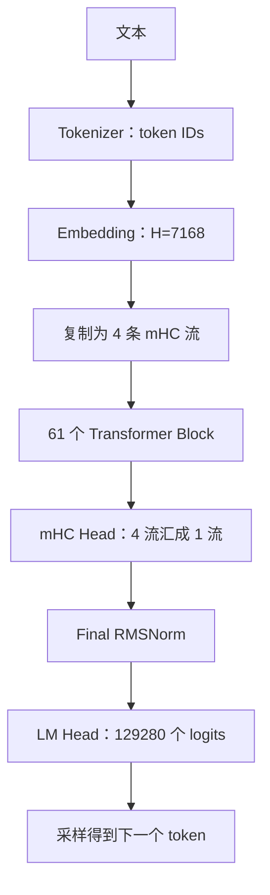
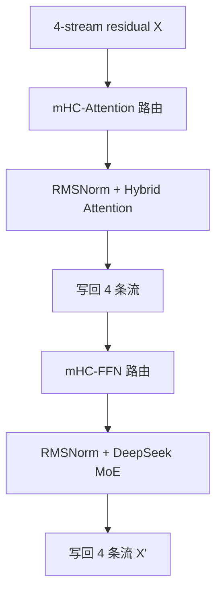

这是一套按**数据流**组织的 DeepSeek V4 模型结构教程。目标不是背类名，而是让你看到任意一行实现时，都能回答四个问题：

1. 输入和输出的张量形状是什么？
2. 这一层在改变“内容”、改变“路由”，还是只改变“表示方式”？
3. 哪些量是模型参数，哪些量是本次前向临时算出来的激活？
4. 训练时的数学结构，到了 vLLM 推理时变成了哪些缓存、通信和 kernel？

系列从已经熟悉的 Embedding、LM Head 和 mHC 开始，随后进入普通 Attention、KV Cache、V4 混合压缩注意力、DeepSeek MoE，最后把一次请求从 token 走到下一个 token。

> **版本基线**：模型数值以 [DeepSeek-V4-Pro `config.json`](https://huggingface.co/deepseek-ai/DeepSeek-V4-Pro/blob/main/config.json) 和官方 [参考实现 `inference/model.py`](https://huggingface.co/deepseek-ai/DeepSeek-V4-Pro/blob/main/inference/model.py) 为准；生产实现以 vLLM 的 DeepSeek V4 代码与官方技术文章为参照。配置和内核仍会演进，所以文章会把“结构事实”和“实现选择”分开说明。

## 先看完整地图

每个主干 Block 又包含两个子层：

注意，图里的“mHC 路由”不是一个普通加法残差。它会针对每个 token 动态生成 `pre`、`post`、`comb`，决定模块从哪几条残差流读取、向哪几条流写入，以及旧流之间怎样重组。

## 这套系列的阅读顺序

| 章 | 主题 | 学完后应能回答 |
|---|---|---|
| 01 | [Embedding：token ID 如何变成隐藏向量](/articles/deepseek-v4-01-embedding/) | lookup 为什么等价于 one-hot 乘矩阵？词表并行怎样工作？ |
| 02 | [LM Head：隐藏向量如何变成下一个 token](/articles/deepseek-v4-02-lm-head/) | logits、Softmax、采样分别做什么？为什么输出层很贵？ |
| 03 | [mHC：四条残差流和 24 个动态路由量](/articles/deepseek-v4-03-mhc/) | `hc_pre` 为什么同时返回 `post` 和 `comb`？Sinkhorn 约束什么？ |
| 04 | [普通 Attention：先把 Q/K/V 走通](/articles/deepseek-v4-04-standard-attention/) | Q、K、V 各自负责什么？因果 mask 和 RoPE 放在哪里？ |
| 05 | [KV Cache：为什么缓存 K/V，不缓存 Q](/articles/deepseek-v4-05-kv-cache/) | Prefill 与 Decode 有何不同？分页缓存解决了什么？ |
| 06 | [V4 混合压缩注意力：SWA、C4A、C128A、Indexer](/articles/deepseek-v4-06-hybrid-compressed-attention/) | 五类缓存状态如何协同？共享 KV 为什么需要逆 RoPE？ |
| 07 | [DeepSeek MoE：384 个专家如何只激活 6 个](/articles/deepseek-v4-07-moe/) | 路由分数、Top-6、共享专家、Hash 路由怎样组合？ |
| 08 | [完整推理链：从 Prefill 到逐 token Decode](/articles/deepseek-v4-08-end-to-end-inference/) | 一个请求在 61 层里读写什么？通信和瓶颈出现在哪里？ |

如果你更关心 vLLM 的物理内存管理，可以在第 05、06 章后继续看已有的 [DeepSeek V4 KV Cache 与 vLLM 初学者指南](/articles/deepseek-v4-kvcache-vllm-beginner-guide/)。

## 先固定 DeepSeek-V4-Pro 的坐标系

下面这些数值会在全系列反复出现：

| 名称 | 记号 | DeepSeek-V4-Pro |
|---|---:|---:|
| 总参数量 |  | 约 1.6T |
| 每 token 激活参数量 |  | 约 49B |
| 词表大小 | $V$ | 129,280 |
| 隐藏维度 | $H$ | 7,168 |
| 主干层数 | $L$ | 61 |
| mHC 流数 | $M$ | 4 |
| Query 头数 | $N_q$ | 128 |
| Attention 头维度 | $D$ | 512 |
| RoPE 子维度 | $D_r$ | 64 |
| Q 低秩维度 | $R_q$ | 1,536 |
| 局部窗口 | $W$ | 128 |
| 路由专家数 | $E$ | 384 |
| 每 token 激活专家 | $K_e$ | 6 |
| 共享专家数 |  | 1 |
| MoE 中间维度 | $I$ | 3,072 |
| 最大位置数 |  | 1,048,576 |

形状统一采用：

- $B$：batch size；
- $S$：本次 forward 的 token 数；
- $T$：推理引擎把多个请求打平后的 token 总数；
- $H$：模型隐藏维度；
- $M=4$：mHC 残差流数。

因此，普通隐藏状态常写成 $[B,S,H]$，mHC 残差状态写成 $[B,S,M,H]$。在 vLLM 的 packed batch 里，前两维经常被压成 $[T,H]$ 或 $[T,M,H]$；数学并没有变，只是调度器把不同请求的 token 排在同一块连续工作区里。

## 一次 token 生成，到底发生了什么

假设 prompt 已经处理完，当前要生成一个新 token。逻辑上会经历：

1. 上一步 LM Head 产生词表 logits，采样器选中 token ID。
2. Embedding 用 ID 查出一个 $7168$ 维向量。
3. 这个向量被复制成 4 条初始 mHC 残差流。
4. 第 1 个 Block 的 `hc_pre` 从 4 条流读出一条工作流，同时生成稍后写回所需的路由计划。
5. Attention 为当前 token 生成 Query；读取局部和压缩的历史 KV 状态；再写入当前 token 对缓存与压缩器状态的贡献。
6. `hc_post` 把 Attention 结果写回四条残差流。
7. 第二套 mHC 路由把四条流送入 MoE；路由器选择 6 个 routed experts，同时计算 1 个 shared expert。
8. 重复 61 层。
9. mHC Head 把最终 4 条流汇成一条，RMSNorm 后由 LM Head 投影成 129,280 个 logits。
10. 采样下一个 ID，进入下一轮 Decode。

这条链里有三种完全不同的“路由”，不要混淆：

| 路由 | 选择对象 | 输出性质 |
|---|---|---|
| mHC 路由 | 4 条残差流 | 连续权重；读、写、重组隐藏状态 |
| Attention / Indexer | 历史 token 位置 | 连续注意力权重，Indexer 先做离散 Top-k 候选选择 |
| MoE 路由 | 384 个专家 | 离散 Top-6 专家索引 + 连续组合权重 |

## 贯穿全系列的四个不变量

### 1. 参数不是激活

`W_embedding`、`W_lm`、`hc_fn` 和专家权重属于 checkpoint 中长期保存的参数。`logits`、Attention 权重、mHC 的 24 个路由量、MoE 的 Top-6 索引则是针对当前输入临时计算的激活。

判断方法很朴素：换一段输入，checkpoint 不加载新权重，但这些量会跟着 token 改变，它们就是运行时状态。

### 2. 模型数学不等于推理物理布局

数学会说“读取历史 KV”；vLLM 真正做的是通过 block table 把逻辑 token 位置映射到 GPU 上的物理页。前者决定答案是否正确，后者决定显存是否放得下、吞吐是否足够高。

### 3. Prefill 和 Decode 是同一模型的两种工作形态

Prefill 一次处理 prompt 中许多 token，矩阵通常大、并行性高；Decode 每个请求通常一次只推进一个 token，却要读很长的缓存，更容易受显存带宽、kernel launch 和跨卡通信影响。

### 4. logits 不是概率

LM Head 只产生未归一化分数。Softmax、temperature、Top-k、Top-p 和随机采样属于选择阶段；它们不会把隐藏状态再送回 Transformer，选中的 token ID 才会进入下一轮。

## 如何判断自己真的学会了

每一章结束都安排三种检查：

- **形状检查**：不看代码，写出输入输出维度；
- **手算检查**：用极小矩阵走一遍；
- **实现检查**：能把概念映射到官方 `model.py` 或 vLLM 模块。

真正的掌握不是能复述“C4A 是四倍压缩”，而是能解释：为什么它使用 8-token 重叠窗口、为什么压缩完成前还要留 state、为什么 Indexer 自己也需要一套压缩 K，以及查询位置怎样避开未来信息。

## 一手资料

- [DeepSeek-V4-Pro 模型页](https://huggingface.co/deepseek-ai/DeepSeek-V4-Pro)
- [DeepSeek-V4-Pro 配置](https://huggingface.co/deepseek-ai/DeepSeek-V4-Pro/blob/main/config.json)
- [DeepSeek V4 官方参考模型](https://huggingface.co/deepseek-ai/DeepSeek-V4-Pro/blob/main/inference/model.py)
- [DeepSeek V4 官方参考 kernel](https://huggingface.co/deepseek-ai/DeepSeek-V4-Pro/blob/main/inference/kernel.py)
- [mHC 论文](https://arxiv.org/abs/2512.24880)
- [vLLM：DeepSeek V4 Efficient Long-context Attention](https://blog.vllm.ai/2026/04/24/deepseek-v4.html)

下一篇：[01｜Embedding：token ID 如何变成隐藏向量](/articles/deepseek-v4-01-embedding/)
