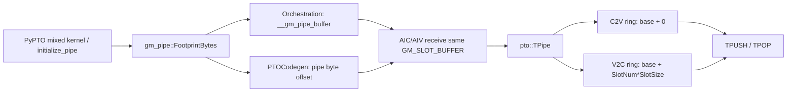
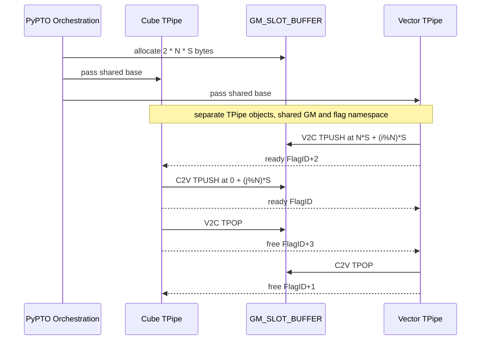

> 本章基于 `pto-isa@67e230d` 与 `pypto@7102058`。`DIR_BOTH` 修复分别进入 [pto-isa commit d2b30a8](https://github.com/hw-native-sys/pto-isa/commit/d2b30a8401a60dfdb58858fe5a012b322a98a10e) 和 [pypto commit d26e0f6](https://github.com/hw-native-sys/pypto/commit/d26e0f6cebabe61e1bbfc7bb58a8e7f3f79dcdac)。本文把代码/规范事实、测试事实与硬件推断分开。

## 本篇在 PTO 课程路线中的位置

前三章建立了 Tile 的静态 capacity、动态 valid region，以及 `TLOAD → compute → TSTORE` 的 Event 依赖。本章继续追问更难的一层：当 Cube 与 Vector 不在同一条本地 pipeline 上，Tile 如何跨核传递？

答案不是“再加一个 Event”。A2/A3 的 `TPipe` 同时包含：

1. GM 中承载 Tile payload 的 ring buffer；
2. producer/consumer 各自的 `tileIndex`；
3. ready/free 两类跨核 flag；
4. GM slot 与消费者本地 Tile 的搬运；
5. 上层必须按同一公式分配的 workspace。

今天只讲两个紧密相连的问题：`DIR_BOTH` 为什么必须是两条物理 ring，以及 `pypto` 为什么必须先于 ISA 地址修复扩容。

## 前置知识

- `Tile` 的 capacity 决定一次最多承载多少数据；valid region 决定本次哪些元素有效。
- Event 解决同一核内不同执行 pipe 的先后关系；`TPipe` 还要解决 Cube/Vector 之间的数据可见性和容量回收。
- “逻辑上有两条 FIFO”不自动推出“物理地址已经分离”。这正是本次缺陷的根源。

## 今日核心问题

1. `TPUSH` 和 `TPOP` 如何共同维护一个 bounded FIFO 的 slot ownership？
2. 为什么 C2V、V2C 已使用四组独立 flag，数据仍会互相覆盖？
3. 为什么正确修复必须同时修改 ISA 地址公式与 `pypto` workspace 大小，而且合入顺序不能反？

## PTO 全栈中的位置



这里的边界很清楚：`pypto` 决定“分多少内存、每个 frontend pipe 从哪里开始”；`pto-isa` 决定“方向内第 i 个 Tile 访问哪个 slot、何时可写/可读/可复用”。两边任何一处公式漂移，结果都可能不是显式越界，而是静默错数。

## 概念与精确语义

### 1. `RingFIFO` 是静态资源描述，不是运行时队列容器

[`include/pto/common/fifo.hpp`](https://github.com/hw-native-sys/pto-isa/blob/67e230d5e92fe351303a8b5b7cc16809e4a0532e/include/pto/common/fifo.hpp#L38-L52) 中的 `RingFIFO<SlotSize, SlotNum, LocalSlotNum>` 只保存三个基址和编译期常量：`GM_SLOT_BUFFER`、C2V consumer buffer、V2C consumer buffer，以及 `SLOT_SIZE/SLOT_NUM/LOCAL_SLOT_NUM`。真正的游标在 `TPipe::Producer::tileIndex` 和 `Consumer::tileIndex` 中。

对 A2/A3 的 GM 传输路径，方向 d、Tile 序号 i 的物理地址应为：

`addr(d,i) = GM_base + ringBase(d) + (i % SlotNum) * SlotSize + subOffset`

其中：

- C2V：`ringBase = 0`；
- V2C 且 `DIR_BOTH`：`ringBase = SlotNum × SlotSize`；
- `subOffset` 只描述双 AIV 的上下/左右分片，不能代替方向偏移。

规范的 [TPUSH/TPOP 设计说明](https://github.com/hw-native-sys/pto-isa/blob/67e230d5e92fe351303a8b5b7cc16809e4a0532e/docs/HL_ptoisa_newfeature20260306_TPUSH_TPOP.md#L130-L330) 明确画出了这两段连续 GM：总容量为 `2 × SlotNum × SlotSize`。

### 2. `TPUSH` 是 allocate → store → record

[`TPUSH_IMPL`](https://github.com/hw-native-sys/pto-isa/blob/67e230d5e92fe351303a8b5b7cc16809e4a0532e/include/pto/npu/a2a3/TPush.hpp#L491-L523) 的 contract：

- 输入：`TileProd` 必须位于 `Acc/Vec/Ctrl` 中与方向匹配的位置；valid rows/cols 决定实际 payload 视图。
- 前置条件：即将使用的 ring slot 已 free；若调用者关闭 `isAllocate`，这个责任转给调用者。
- 动作：必要时等待 free credit，把 Tile 经 `TSTORE` 写入 GM slot，递增 producer `tileIndex`，最后发 ready signal。
- 后置条件：消费者看到 ready 后才能读取；producer 不再拥有该 slot，直到收到 free credit。

### 3. `TPOP` 是 wait → load → free

[`TPOP_IMPL`](https://github.com/hw-native-sys/pto-isa/blob/67e230d5e92fe351303a8b5b7cc16809e4a0532e/include/pto/npu/a2a3/TPop.hpp#L19-L58) 对称地等待 ready，将 GM slot `TLOAD` 到 `Vec` 或 `Mat` Tile，按周期返还 free credit，再递增 consumer `tileIndex`。关闭 `isWait` 或 `isFree` 同样会把正确性责任转给调用者。

`DIR_BOTH` 的两条控制平面彼此独立：

| 方向 | ready | free | producer → consumer |
| --- | --- | --- | --- |
| C2V | `FlagID` | `FlagID+1` | Cube → Vector |
| V2C | `FlagID+2` | `FlagID+3` | Vector → Cube |

因此 `FlagID+3` 必须落在硬件可用范围。更重要的是：独立 flag 只保证两条逻辑队列各自有序，并不保证它们的 payload 地址互斥。

## 对象与 Buffer 生命周期



`TPipe` 在 AIC 与 AIV kernel 中分别构造；它们不是共享 C++ 对象，但共享 GM 基址和 flag ID 约定。最新 [`TPipe` 构造函数](https://github.com/hw-native-sys/pto-isa/blob/67e230d5e92fe351303a8b5b7cc16809e4a0532e/include/pto/npu/a2a3/TPush.hpp#L459-L488) 在 `is_both` 时只给 V2C 一侧设置 `V2C_ENTRY_OFFSET = SlotNum * SlotSize`：AIV producer 与 AIC consumer 必须得到完全相同的偏移；C2V 两侧保留 0。

slot 复用不是每个 Tile 都发一次 free。`SyncPeriod = SlotNum <= 2 ? SlotNum : SlotNum/2`：消费者每累计一个周期才通知，producer 在初始 `SlotNum` 个免等待 credit 用完后按相同周期等待。这减少同步消息，但让回压粒度更粗。它是性能策略；“同一 slot 未被消费者释放前不能重写”才是不可违反的不变量。

## 真实指令链：并发双向 Tile 如何暴露覆盖

回归 kernel 位于 [`tpushpop_dir_both_concurrent_kernel.cpp`](https://github.com/hw-native-sys/pto-isa/blob/67e230d5e92fe351303a8b5b7cc16809e4a0532e/tests/npu/a2a3/src/st/testcase/tpushpop_dir_both_concurrent/tpushpop_dir_both_concurrent_kernel.cpp)。它特意移除旧用例中的串行依赖：

```text
Vector: TLOAD A,B → TADD C=A+B → TPUSH V2C(C)
Cube:   TLOAD A,D → TMATMUL E=A@D → TPUSH C2V(E) → TPOP V2C(C)
Vector: TPOP C2V(E) → TSUB G=E-F → TSTORE G
Cube:   TMATMUL H=C@D → TSTORE H
```

关键不是算子复杂，而是 Cube 先推 C2V、后取 V2C；于是两个 `tileIndex=0` 可以同时在途。旧实现的两边地址都是 `GM_base + 0`。ready/free flag 全部合法，程序不 hang，却可能让两个消费者读到混合 payload——同步协议“正确”，存储所有权却错误。

## 具体 shape、Tile 与地址演算

仓库用例取 `M=128, K=64, N=128, dtype=float32, FIFO_DEPTH=2`：

- C2V 的 `E=A@D` 为 `[128,128]`，占 `128×128×4 = 65536 B = 64 KiB`；
- V2C 的 `C=A+B` 为 `[128,64]`，占 `32 KiB`；
- `SLOT_SIZE` 按较大的 C2V Tile 取 `64 KiB`；
- 每条 ring 两个 slot，占 `128 KiB`；两条 ring 合计 `256 KiB`。

| 区域 | 地址范围 | slot 0 | slot 1 |
| --- | --- | --- | --- |
| C2V | `[base, base+128KiB)` | `base` | `base+64KiB` |
| V2C | `[base+128KiB, base+256KiB)` | `base+128KiB` | `base+192KiB` |

旧实现把 V2C slot 0 也放在 `base`。由于 V2C payload 只有半个 slot，后写者只覆盖另一方向的前 32 KiB；只检查单边输出甚至可能侥幸通过。新测试同时验证 `A@D-F` 与 `(A+B)@D`，把两边读错都变成可观察结果。其 [`gen_data.py`](https://github.com/hw-native-sys/pto-isa/blob/67e230d5e92fe351303a8b5b7cc16809e4a0532e/tests/npu/a2a3/src/st/testcase/tpushpop_dir_both_concurrent/gen_data.py#L19-L52) 使用 NumPy golden；[`main.cpp`](https://github.com/hw-native-sys/pto-isa/blob/67e230d5e92fe351303a8b5b7cc16809e4a0532e/tests/npu/a2a3/src/st/testcase/tpushpop_dir_both_concurrent/main.cpp#L47-L73) 明确分配 `4*M*N*sizeof(T)`，即两条 ring。

## 为什么这样设计，以及替代方案

### 当前方案：同一 workspace 内两条独立 ring

它同时满足三个基本约束：双向可以并行；每个方向独立回压；地址计算只增加编译期常量偏移。修复 commit 的实验记录显示，偏移项是常量，没有新增运行时地址算术成本。

代价是 bidirectional workspace 相比单向更大，并且 `pypto`/PTO codegen/ISA 三层必须共享布局 ABI。

### 替代方案 A：一条共享 half-duplex ring

内存可减半，但必须新增跨方向仲裁：谁获得下一个 slot、如何防止一边饿死、ready/free 如何携带方向。它会把本来独立的 C2V/V2C 串行化，引入 head-of-line blocking，也使 flag 状态机更复杂。除非 GM 容量实测成为主瓶颈且双向并发收益很小，否则复杂度没有被证据证明合理。

### 替代方案 B：两个完全独立的 GM 参数

语义最清楚，天然不重叠；代价是 orchestration 参数、分配和 ABI 增加。当前“一块 allocation + 两段布局”保留独立所有权，同时减少外部参数，是更小的接口面。

A5 不能直接套用该结论：设计说明表明其普通路径把 ring 放在 consumer SRAM，producer 需要对端本地基址。本文关于共享 GM 的地址公式限定为 A2/A3；A5 的实际 DMA/同步行为需单独验证。

## `pypto`：为什么上层必须先扩容

[`gm_pipe_layout.h`](https://github.com/hw-native-sys/pypto/blob/71020585278b68f56c72c40d5570f07dbb20bc8b/include/pypto/codegen/gm_pipe_layout.h) 现在集中定义：

```text
FootprintBytes = RingCount(dir_mask) * EffectiveSlotCount * slot_size
DIR_BOTH: RingCount=2, default slots=4
single direction: RingCount=1, default slots=8
```

同一个 helper 被两处消费：[`ComputeGMPipeWorkspaceElements`](https://github.com/hw-native-sys/pypto/blob/71020585278b68f56c72c40d5570f07dbb20bc8b/src/codegen/orchestration/orchestration_analysis.cpp#L84-L171) 决定 orchestration 的实际分配；[`PTOCodegen::PrepareGMSlotBufferLayout`](https://github.com/hw-native-sys/pypto/blob/71020585278b68f56c72c40d5570f07dbb20bc8b/src/codegen/pto/pto_codegen.cpp#L630-L696) 决定多个 frontend pipe 在 workspace 内的 byte offset。集中公式避免“总大小对了、pipe 间偏移仍重叠”的半修复。

发布顺序也是 contract：若先让 ISA 把 V2C 指到第二段，而 `pypto` 仍只分配一条 ring，V2C 会直接落到 allocation 之外；先扩容则只是暂时多分一半内存，旧 ISA 仍访问第一段，不会新增越界。因此 `pypto d26e0f6` 必须先于 `pto-isa d2b30a8` 进入配套环境。

## 访存、并行与硬件约束

- **访存事实**：A2/A3 路径把 producer Tile 写 GM，再由 consumer `TLOAD` 到本地 Tile；每个 payload 至少产生一次 GM write 与一次 GM read。
- **并行事实**：两方向使用不同 ready/free flags，可以同时有 Tile 在途；两段 ring 是实现这种并行的物理前提。
- **容量事实**：`SlotSize` 必须容纳两个方向中较大的 payload；`pypto` 已取 observed max。小 payload 会产生 slot 内部空洞，这是固定 slot 换简单寻址的成本。
- **同步策略**：`SyncPeriod` 批量返还 credit，减少跨核同步次数，但可能延迟空闲容量对 producer 可见。
- **硬件推断**：在 payload 大、双向持续流动时，更可能受 GM 带宽或搬运 pipeline 限制；仅凭源码不能判断瓶颈，需用 device trace 分开统计 GM DMA、Cube/Vector 计算和 flag wait 时间。

## 测试证据与未覆盖风险

**已验证事实：**

- pto-isa 新增两个 split 方向的并发用例，构造双向同时在途并检查两侧 golden。
- 修复提交记录的 Atlas A2/A3 实验：最小复现由 12/21 错误变为 21/21 正确；GLA/ZeCO 组合在给定矩阵上变为 24/24 通过。
- pypto 单测把 `dir_mask=3, slot_size=512` 的默认 workspace 固定为 `2×4×512B=4096B=1024 float`，并验证显式 `slot_num=16` 会覆盖默认深度。

**覆盖缺口：**

1. 仓内并发设备用例使用 `FIFO_DEPTH=2`；提交说明还测过默认深度 4，但这个矩阵未完整固化在当前 ST。
2. CPU simulator 明确不支持 TPUSH/TPOP，普通 CPU CI 无法证明真实跨核 flag 和 DMA 正确。
3. [`TPOP_IMPL(Pipe&, GlobalData&)`](https://github.com/hw-native-sys/pto-isa/blob/67e230d5e92fe351303a8b5b7cc16809e4a0532e/include/pto/npu/a2a3/TPop.hpp#L77-L108) 自己计算 `entryBase`；`DIR_BOTH` 的 Cube 分支目前只加 `slotOffset`，没有显式使用 `cons.entryOffset`。这是一条代码事实和高优先级疑点，但本文没有找到直接调用测试，暂不能断言为已复现缺陷。
4. `TPUSH.md` 的存储路径表将 A2/A3 普通方向描述为 local UB/MAT FIFO，而设计说明和当前 A2/A3 实现展示的是 GM ring 加 consumer-local load；文档层次需要澄清。

最小 CI guard 应新增：`DIR_BOTH + GlobalTensor TPOP overload + Cube consumer` 的地址断言/设备结果测试；再加 `SlotNum=4` 且 `i>=SlotNum` 的 wrap-around 用例，并让 PyPTO 生成的 workspace 贯穿一次真实 A2/A3 kernel，而不只比较生成代码字符串。

## 与前后章节的连接

上一章的 Event 保证“某个 Tile 的本地 load/compute/store 不乱序”；本章的 TPipe 保证“跨核 payload 的 ready/free 与 slot ownership 不乱序”。两者缺一不可：Event 全对但 ring 重叠会错数；ring 分离但本地 `TLOAD/TMATMUL/TSTORE` event ledger 不闭合也会读早或死锁。

下一章回到 GM 地址语义，系统拆解 `GlobalTensor` 的五维 shape/stride/partition 如何映射到二维 Tile，以及 `subOffset` 为什么只能描述 AIV 分片而不能承担 ring ownership。

## 本篇结论

最重要的不变量不是“用了 ring buffer”，而是：

> 每一个仍在途的逻辑 payload，必须在其完整生命周期内拥有不与任何其他在途 payload 重叠的物理字节区间。

`DIR_BOTH` 有两套独立 credit 状态机，所以必须有两套独立 slot 地址。`entryOffset` 修复的是设备侧 ownership；`FootprintBytes` 修复的是上层 capacity。二者构成一个跨仓 ABI，且发布顺序本身就是正确性的一部分。

## 知识债

- 验证 `GlobalTensor` TPOP 重载在 `DIR_BOTH`/Cube 路径是否遗漏 V2C base。
- 补齐默认 `SlotNum=4` 下 credit batching、wrap-around 与析构 drain 的完整状态机。
- 区分 A2/A3 GM ring 与 A5 consumer SRAM 两套实现，不把接口同名误认为物理路径相同。
- 量化 GM 双搬运、slot padding 与 `SyncPeriod` 对吞吐/等待时间的实际影响。

## 三个理解检查问题

1. 为什么四个互不冲突的 flag 仍不能阻止 C2V/V2C 数据覆盖？
2. 对 `SlotNum=4, SlotSize=16KiB` 的双向 pipe，V2C 第 6 个 Tile 的地址是多少？总 workspace 至少多大？
3. 为什么“先合入 pto-isa 偏移、以后再扩 pypto allocation”比反向顺序危险？

## 课程账本增量

- 新覆盖：`RingFIFO`、A2/A3 `TPipe`、`TPUSH_IMPL`、`TPOP_IMPL`、`DIR_BOTH` 四 flag、V2C `entryOffset`、PyPTO `FootprintBytes`。
- 新不变量：双向 pipe 的物理 footprint 为 `2×SlotNum×SlotSize`；方向两端必须使用相同 ring base；capacity 变更先于地址启用发布。
- 新测试认知：并发错误必须让两个方向同时在途并同时检查结果；单次 round trip 或单边 golden 会隐藏 aliasing。
- 下一章：`GlobalTensor` 五维 shape/stride/partition 到 Tile 视图的地址映射。
