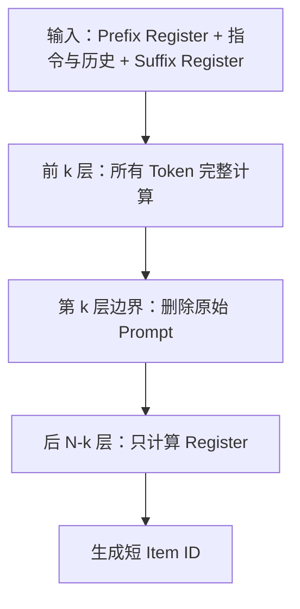
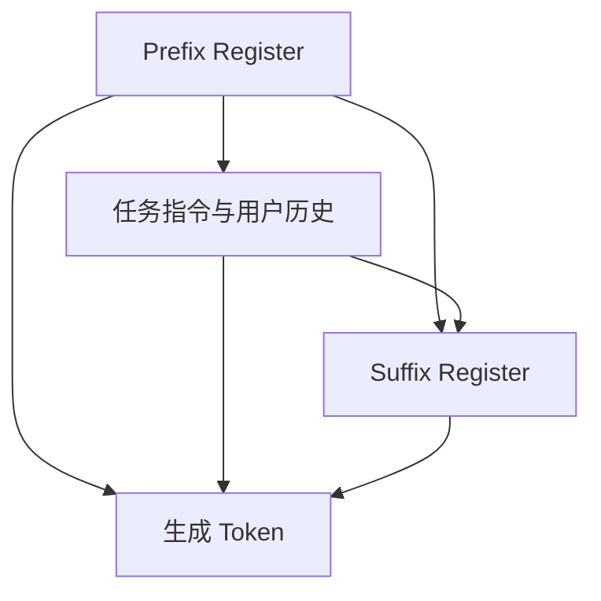
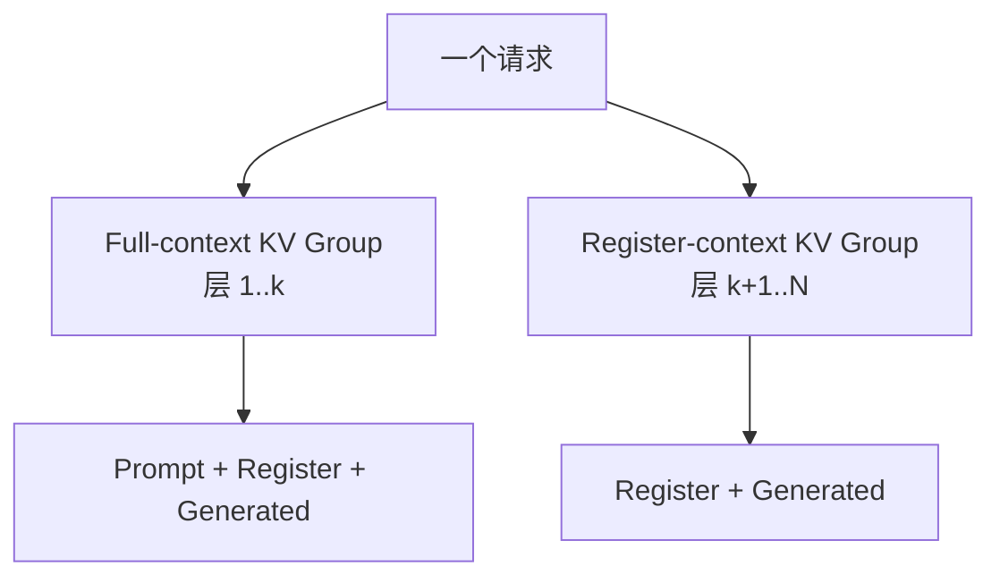

> **论文信息**  
> Jiayu Bao et al., *RIAC: A Register-based LLMRec Inference Acceleration Framework*, IEEE Transactions on Artificial Intelligence, 2026. DOI: [10.1109/TAI.2026.3710871](https://doi.org/10.1109/TAI.2026.3710871)。
>
> **阅读说明**  
> 本文不是逐句转载，也不能替代论文原文。它按照原论文的章节顺序，对问题、方法、公式、实验和结论做结构化中文精译，并删去重复背景；随后把“论文明确给出的事实”“根据 Transformer 推导出的工程含义”和“尚未被论文证明的主张”分开讨论。

## 1. 最短答案

RIAC 面向一种非常特殊的生成式推荐负载：**输入是很长的用户行为历史，输出却只是 4 个左右的 Item ID token**。

它不在进入模型前粗暴压缩 Prompt，也不等到短暂的 Decode 阶段再动态淘汰 KV，而是在模型内部建立一个可训练的信息瓶颈：

前 $k$ 层负责读取完整用户历史，并把有用信息压缩进少量可学习 Register Token；后 $N-k$ 层不再计算、缓存或读取原始 Prompt。

因此，RIAC 同时减少：

- 后半段 Prefill 中 Prompt token 的 Attention、Projection 和 MLP；
- 后 $N-k$ 层的 Prompt KV Cache；
- Decode 时后 $N-k$ 层对长 Prompt KV 的反复读取。

但它**不会**减少模型权重、生成 token 的完整层数、LM Head、Beam Top-k 或生成阶段的 BeamKV。

还要特别澄清：论文中的 Register 是可学习的虚拟 token，不是 CPU/GPU 的硬件寄存器。

---

## 2. 摘要精译

大语言模型已经被用于生成式推荐，但其推理需要保存大量 KV Cache，并带来较高延迟，这限制了模型在资源有限、延迟敏感环境中的部署。

RIAC 从 LLMRec 不同层和不同 token 位置的 Attention 行为出发，引入可学习的 Prefix Register 与 Suffix Register：前者提供任务相关先验，后者汇总用户历史。在推理过程中，模型先让完整 Prompt 经过前若干层；随后移除任务指令与用户历史 token，只让 Register 和生成 token 继续通过剩余层。

作者声称，这种分层计算裁剪能够减小 KV Cache、降低内存密集型 Attention，并在三个数据集、两种生成式推荐框架上维持或改善推荐效果。

这段摘要真正值得记住的不是“KV Cache 压缩”几个字，而是：

> **RIAC 把在线 KV 淘汰问题，改写成了一个训练期学习的层间语义压缩问题。**

---

## 3. 为什么普通 KV 压缩不适合 LLMRec

### 3.1 LLMRec 的输入与输出不对称

论文把用户按时间排序的交互历史表示为：

$$
H=(i_1,i_2,\ldots,i_T),
$$

目标是预测下一项：

$$
f(H)=P(i_{T+1}\mid i_1,\ldots,i_T).
$$

在 LC-Rec、TIGER 这类生成式推荐中，任务指令和历史交互被组织成长 Prompt，模型自回归生成 Item ID。论文实验把目标 Item ID 固定为 4 个 token，并使用 beam size 20。

这意味着：

- Prompt 可能很长；
- Prefill 很重；
- Decode 只有少数几步；
- Beam 会放大每一步 Decode Attention 和后处理成本。

### 3.2 两类传统方法的错位

| 方法 | 压缩发生在哪里 | 对 LLMRec 的问题 |
| --- | --- | --- |
| Prompt Compression | 模型读取之前 | 模型还没融合历史，就可能删除关键偏好 |
| KV Cache Compression | Decode 过程中 | Item ID 只有少数 token，优化窗口太短 |
| RIAC | 完整 Prompt 通过前 $k$ 层之后 | 需要重新训练，但能同时裁掉深层 Prompt 计算与 KV |

Prompt Compression 试图预先判断哪些行为不重要，但推荐场景中一次看似普通的交互也可能决定用户的下一次选择。动态 KV 淘汰则通常需要先观察 Attention，再决定保留哪些 KV；对于 4-token 输出，淘汰策略还未积累足够收益，生成就已经结束。

RIAC 的选择是延迟压缩：**先理解，再压缩。**

### 3.3 相关工作精译

论文把 LLM 推荐工作分成两条路线：

1. **把 LLM 作为推荐核心。**任务指令和用户历史直接进入 LLM，由模型生成 Item ID。这条路线能够统一偏好建模与候选生成，但在线推理代价高。
2. **把 LLM 作为特征增强器。**LLM 离线生成用户、Item 或知识特征，再交给传统推荐模型使用。这能绕开在线大模型延迟，却不属于本文关注的端到端生成式推荐。

在大模型压缩方面，早期工作主要处理模型权重和激活，例如量化、蒸馏与低秩近似。随着上下文增长，KV Cache 才成为独立优化目标：FastGen、H2O 一类方法依据 Attention 或预设规则保留部分 KV，但任何错误淘汰都可能损伤推荐效果。

RIAC 的定位不是替代权重量化，而是处理另一条正交维度：**减少需要在多少层中持续存在的 Prompt token。**它可以在原则上与权重量化、Kernel 优化和 Beam 后处理融合叠加。

### 3.4 推理准备：Prefill 与 Decode

论文用标准 Attention 公式回顾 KV Cache 的来源。对输入 hidden states $X\in\mathbb{R}^{n\times d}$：

$$
Q=XW_Q,\qquad K=XW_K,\qquad V=XW_V,
$$

$$
O=\operatorname{Softmax}\left(\frac{QK^T}{\sqrt{d}}\right)V.
$$

在 Prefill 中，$Q,K,V$ 都是矩阵；长 Prompt 的 Projection、Attention 与 MLP 通常具有较高并行度。所有层还要为后续生成保存 K/V。

在第 $t$ 个 Decode step，只计算当前 token 的 $Q_t,K_t,V_t$，再把新 K/V 追加到缓存：

$$
K_{1:t}=\operatorname{Concat}(K_{1:t-1},K_t),
\qquad
V_{1:t}=\operatorname{Concat}(V_{1:t-1},V_t).
$$

此时 Query 很少，却要读取不断增长的历史 K/V，因此长上下文 Decode Attention 更容易受到 HBM 带宽影响。RIAC 分别作用于两阶段：Prefill 中直接删除深层 Prompt 计算；Decode 中减少后层必须读取的历史 KV。

---

## 4. 动机实验：作者看到了什么

论文从两个维度分析 Attention：层深度和 token 位置。

### 4.1 层间 Attention 稀疏性反转

作者定义了一个阈值统计量：

$$
sp=\frac{1}{n}\sum_{i=1}^{n}\mathbb{I}(p_i>\epsilon).
$$

Table I 给出的平均结果为：

| 模型 | $sp_{early}$ | $sp_{later}$ |
| --- | ---: | ---: |
| Llama | 0.025 | 0.048 |
| Qwen | 0.047 | 0.059 |

作者的解释是：LLMRec 的早期层 Attention 更稠密，后期层更稀疏；早期层需要读取更完整的历史，后期层则存在更多冗余。

不过这里存在一个不能忽略的定义问题：公式统计的是“高于阈值的元素比例”，通常更接近 density；数值越大反而意味着更多元素超过阈值。论文却把更大的 later 值解释成更稀疏。此外，附件没有给出 $\epsilon$、early/later 的层区间，以及跨 head、样本和任务的聚合方法。

因此，合理的阅读方式是：

- “后层可能存在更多可裁剪冗余”是一个有价值的假设；
- Table I 还不足以独立证明这个假设；
- 最终应由裁剪深度消融和真实端到端实验验证。

### 4.2 头尾双 Attention Sink

论文还统计了序列头部和尾部的 Attention 总量：

$$
sink_{head}=\sum_{i=1}^{T_h}s_i,
\qquad
sink_{tail}=\sum_{i=T_t}^{n}s_i.
$$

Table I 报告：

| 模型 | $sink_{head}$ | $sink_{tail}$ |
| --- | ---: | ---: |
| Llama | 0.56 | 0.09 |
| Qwen | 0.30 | 0.24 |

作者由此认为，序列开头和结尾都适合放置 Register：

- 开头 Register 承载任务和全局先验；
- 结尾 Register 已经与前文交互，可以汇总用户历史。

这个直觉要结合 Decoder-only 的因果掩码来理解。

---

## 5. Prefix 与 Suffix Register 的真实分工

输入被组织为：

$$
X=[R_{pre};\mathrm{Prompt};R_{suf}].
$$

在标准 causal attention 中：

Prefix 位于 Prompt 之前，不能反向读取后面的任务指令与用户历史；它只能作为所有请求共享的可学习软提示，影响后续 token 的表示。

Suffix 位于 Prompt 之后，能够看到完整历史。因此它才是请求相关的语义摘要。

| 组件 | 能否看到当前 Prompt | 更准确的作用 |
| --- | --- | --- |
| Prefix Register | 不能 | 全局软提示、任务先验 |
| Suffix Register | 能 | 当前用户历史的压缩表示 |

论文把 Prefix 描述为“编码任务指令”，这一表述只有在使用非标准双向 mask 时才严格成立，但论文没有说明修改过 causal mask。更稳妥的理解是：Prefix 提供任务先验，Suffix 汇总当前请求。

---

## 6. 训练过程精译

训练目标仍然是标准 next-token prediction：

$$
Y=[i_{T+1}],
$$

$$
\mathcal{L}=-\sum_{j=1}^{|Y|}\log P(Y_j\mid X,Y_{<j}).
$$

Prefix/Suffix Register 是随机初始化的 learnable embedding，并与模型一起进行全量微调。论文没有增加摘要重构、对比学习或蒸馏损失。

真正改变模型能力的是：训练期间同样执行分层裁剪。

$$
H^{(\ell)}=
\begin{cases}
\operatorname{Block}_{\ell}
([R_{pre},P_1,\ldots,P_L,R_{suf},Y]), & \ell\le k,\\
\operatorname{Block}_{\ell}
([R_{pre},R_{suf},Y]), & \ell>k.
\end{cases}
$$

后半段模型无法直接访问历史，所以目标 Item ID 的梯度会迫使 Suffix Register 在前 $k$ 层吸收足够信息。

这带来一个重要工程结论：

> RIAC 不是可以套在任意现有 checkpoint 上的无损推理插件。模型必须在同样的裁剪结构、mask 和 position 规则下重新训练或微调。

---

## 7. 推理数据流精译

### 7.1 Prefill

对一个 $N$ 层模型：

1. 前 $k$ 层处理任务指令、完整历史和两个 Register；
2. 第 $k$ 层结束后，删除普通 Prompt hidden states；
3. 后 $N-k$ 层只处理 Prefix 与 Suffix Register；
4. 最后用 Suffix 侧输出生成第一个 Item ID token。

| 层范围 | Prefill 输入 | Prompt KV 是否存在 |
| --- | --- | --- |
| $1\ldots k$ | Prompt + Register | 是 |
| $k+1\ldots N$ | Register | 否 |

这里被删除的不是单个 K/V 向量里的部分元素，而是整批 Prompt token 在深层的 hidden state、计算和 KV。

### 7.2 Decode

第 $t$ 个生成 token 仍然经过全部 $N$ 层：

| 层范围 | 当前 Query 数 | 可读取的上下文 |
| --- | ---: | --- |
| $1\ldots k$ | 当前生成 token | Prompt + Register + Generated |
| $k+1\ldots N$ | 当前生成 token | Register + Generated |

因此 RIAC 只裁剪“原 Prompt 在深层造成的可变开销”，不会裁剪每个生成 token 的固定 dense forward。

---

## 8. 复杂度公式：论文想表达什么

论文首先写出标准 Transformer 的近似 FLOPs：

$$
\mathrm{FLOPs}_{base}
=4NL\left[n_hd_a(2d_h+L)+d_hd_f\right].
$$

其中线性项主要来自 QKV/O Projection 与 FFN，二次项主要来自 Attention。令长度为 $s$ 时单层开销为 $F(s)$，那么更直观的表达是：

$$
C_{base}=NF(L),
$$

$$
C_{RIAC}=kF(L+r)+(N-k)F(r).
$$

当 $r\ll L$，并且可变 Prompt 计算占主导时：

$$
\frac{C_{RIAC}}{C_{base}}\approx\frac{k}{N},
\qquad
S_{ideal}\approx\frac{N}{k}.
$$

这只是渐近上界，而不是端到端延迟保证。后半层虽然只有少量 Register token，但依旧要读取模型权重；极小矩阵还可能从 compute-bound 变成 weight-bandwidth-bound 或 launch-bound。

对 Decode，一个更接近系统行为的模型是：

$$
T_{base}=N[D+A(L+t)],
$$

$$
T_{RIAC}=ND+kA(L+r+t)+(N-k)A(r+t),
$$

其中：

- $D$ 是每层不随上下文增长的 Projection、MLP、Norm 等开销；
- $A(S)$ 是上下文长度为 $S$ 的 Attention 开销。

若 $D$ 主导，速度提升会接近 1；只有长上下文 Attention 主导时，才可能逐渐接近 $N/k$。

---

## 9. KV Cache 的正确容量推导

设每个 token、每层 KV 占用：

$$
C_{KV}=2n_{kv\_head}d_{head}s,
$$

其中 2 对应 K 与 V，$s$ 是元素字节数。

在已经生成 $G$ 个 token 时，普通模型为：

$$
M_{base}=C_{KV}N(L+G).
$$

RIAC 为：

$$
M_{RIAC}=C_{KV}\left[kL+N(r+G)\right].
$$

所以：

$$
\Gamma_{KV}
=\frac{kL+N(r+G)}{N(L+G)}.
$$

当 $L\gg r+G$：

$$
\Gamma_{KV}\approx\frac{k}{N},
\qquad
\mathrm{saving}\approx1-\frac{k}{N}.
$$

### 9.1 一个具体例子

假设：

- Llama-7B 有 $N=32$ 层；
- 裁剪深度 $k=8$；
- Prompt 长度 $L=1000$；
- Prefix/Suffix 各一个，$r=2$；
- Item ID 长度 $G=4$。

普通 KV token-layer 数：

$$
32(1000+4)=32128.
$$

RIAC：

$$
8\times1000+32(2+4)=8192.
$$

对应节省：

$$
1-\frac{8192}{32128}\approx74.5\%.
$$

这说明当 $N=32,k=8$ 时，长 Prompt 极限更接近 75% 节省。论文报告约 80%，需要不同的 $k$、内存统计口径或其他配置才能解释，但附件没有给出这些信息。

---

## 10. 实验设置精译

论文使用三个真实推荐数据集：

| 数据集 | 用户数 | Item 数 | 交互数 | 稀疏度 |
| --- | ---: | ---: | ---: | ---: |
| Games | 38,808 | 13,379 | 352,136 | 99.93% |
| MovieLens-1M | 6,040 | 3,706 | 1,000,209 | 95.53% |
| Beauty | 1,210,271 | 249,274 | 2,023,070 | 99.99% |

数据按全局时间排序，并以 8:1:1 划分训练、验证和测试集。主结果使用 Llama-7B，分别接入 LC-Rec 与 TIGER；生成 Item ID 长度为 4，推理 beam size 为 20。

训练采用 full fine-tuning、AdamW、effective batch size 128、初始学习率 0.001、cosine scheduler 与 0.02 warmup ratio。

论文列出的基线混合了多类方案：跳层、量化、投机解码、Attention/KV 压缩、in-flash、PIM 和推荐表示学习。不过附件没有交代如何在同一硬件、同一精度和相同压缩预算下复现这些方法。

---

## 11. 主实验结果精译

### 11.1 推荐效果

在 LC-Rec 上，作者报告 RIAC 的 12 项 NDCG/Recall 指标全部高于普通 Finetune。相对提升大约为 2.5% 到 29.3%。

在 TIGER 上，结论没有正文描述得那么统一：12 项指标中有 8 项提高，4 项低于 Finetune，包括 Games NDCG@20、MovieLens NDCG@10、Beauty Recall@10 和 Recall@20。原表仍把 RIAC 的全部单元格加粗为最佳，属于表格标记错误。

此外，论文没有报告多随机种子、标准差或显著性检验。小幅提升可能来自 Register 瓶颈带来的正则化，也可能落在训练波动范围内。

### 11.2 空间与时间效率

作者报告：

- KV Cache 节省约 77.4% 到 81.2%；
- 端到端速度提升约 2.88x 到 3.81x；
- 序列从 1K 增长到 20K 时，相对加速接近 7x；
- 基线 batch size 超过 4 后 OOM，RIAC 可扩展到 20。

但是附件没有定义 Table V/VI 中的 $\sigma,\gamma,\tau,\omega$，也没有给单位。根据数值方向推测：

- $\sigma$ 应是 KV memory；
- $\gamma$ 应是 KV reduction；
- $\tau$ 应是 throughput；
- $\omega$ 应是 wall-clock speedup。

其中还存在无法由表内数字复核的结果。例如 LC-Rec/MovieLens：

$$
\frac{846.7}{704.5}\approx1.20,
$$

但表中速度写成 3.22x。

若 Llama-7B 为 32 层且默认 $k=8$，论文自身近似给出的长序列理想上限是 $N/k=4$，而 Figure 3 报告接近 7x。除非该图使用了更小的 $k$ 或不同 speed 定义，否则两者并不自洽。

---

## 12. 消融与超参数精译

### 12.1 哪个 Register 最重要

Table VII 的结果非常清楚：

| 变体 | 12 项指标平均变化 | 含义 |
| --- | ---: | --- |
| 去掉 Prefix | 约 -4.6% | Prefix 是辅助软提示 |
| 去掉 Suffix | 约 -74.5% | Suffix 是主要历史摘要 |
| 两者都去掉 | 约 -79.0% | Prompt 被裁后几乎没有有效信息通道 |

这与 causal attention 的推导一致：Suffix 能看到完整 Prompt，Prefix 不能。

不过论文缺少两个关键对照：

- 加 Register 但不裁 Prompt；
- 裁 Prompt，但保留普通末尾 token 而不是 learnable Register。

因此目前不能完全区分“Register 带来的训练正则化”和“分层裁剪机制”分别贡献了多少准确率与效率。

### 12.2 Register 数量

论文测试每侧 1、2、3 个 Register。数量增加没有带来更高准确率，尤其多个 Suffix Register 会明显降低效果；速度变化则很小。作者最终选择每侧 1 个。

一个可能解释是：单个 Suffix 建立了明确的信息汇聚点；增加多个 token 后，模型需要自己学习如何分配与读取摘要，优化反而更困难。但论文没有进一步验证这个机制。

### 12.3 裁剪深度 $k$

论文测试 $k=2,4,6,8,10$：

- $k$ 越小，越早删除 Prompt，理论速度越高；
- $k$ 越大，历史融合越充分，推荐效果越好；
- 从 2 增长到 4 时准确率提升最明显；
- 8 之后趋于饱和。

作者选择 $k=8$ 作为效率与效果折中点。

### 12.4 Prompt 长度

在 50-100、100-150、150-200 token 的不同区间内，每侧一个 Register 仍然表现最好，多个 Suffix 的退化最明显。

但论文的 Figure 编号与正文引用有混乱：讨论 Register 数量时误指 Figure 5，而 Figure 5 实际展示 $k$；部分坐标轴和 legend 也存在 NDCG/Recall 标注错误。

---

## 13. 论文结论精译

论文最终认为，LLMRec 早期层包含更丰富的用户历史信息，而中后层存在可以删除的 Prompt 冗余。Prefix/Suffix Register 为完整 Prompt 建立了少量信息出口，使模型能在不保留深层 Prompt KV 的情况下继续完成短 Item ID 生成。

作者把未来工作放在：

- 自适应 Register 数量；
- 更灵活的逐层裁剪策略；
- 更大模型；
- 更多真实边缘设备。

方向上这很合理，但当前论文并没有真正完成“edge deployment”验证：附件缺少硬件、软件栈、精度、TTFT、TPOT、P99、能耗以及端侧设备实验。

---

## 14. 一个重要的公开来源对照：RIAC 与 EARN

在评估 RIAC 的创新性和实验可信度时，不能忽略 2025 年 KDD 论文 [EARN: Efficient Inference Acceleration for LLM-based Generative Recommendation by Register Tokens](https://dl.acm.org/doi/10.1145/3711896.3736919)。其 [arXiv 版本](https://arxiv.org/abs/2507.00715) 和 [开源代码](https://github.com/transcend-0/EARN) 均可公开访问。

EARN 与 RIAC 具有相同的核心结构：

- 同样针对长 Prompt、短 Item ID；
- 同样提出层间 Attention 稀疏性反转；
- 同样提出头尾双 Attention Sink；
- 同样使用 Prefix/Suffix Register；
- 同样在前 $k$ 层压缩历史、后层仅保留 Register；
- 同样使用 LC-Rec、TIGER、Games、MovieLens 和 Beauty；
- 同样报告约 3.79x 加速与约 80.8% KV 节省。

更值得注意的是，RIAC Table V 中多行效率数值与 EARN 原表几乎逐项一致，但方法名称被替换成了另一组算法。以 LC-Rec/Games 为例：

| RIAC 方法 | RIAC $\tau/\sigma$ | EARN 原方法 | EARN $\tau/\sigma$ |
| --- | ---: | --- | ---: |
| ABQ-LLM | 623.1 / 65.72 | POD | 623.3 / 65.69 |
| CTC-drafter | 1205.7 / 21.47 | 500xCompressor | 1205.3 / 21.45 |
| Squeezed Attention | 702.8 / 3.11 | StreamingLLM | 702.5 / 3.13 |
| AiF | 688.3 / 5.05 | SnapKV | 688.5 / 5.04 |
| PipeInfer | 640.1 / 63.98 | Gist | 639.9 / 64.00 |
| RIAC | 1930.5 / 15.03 | EARN | 1930.6 / 14.98 |

RIAC 附件的参考文献没有引用 EARN。仅凭公开文档不能对作者意图或学术行为作正式定性，但在来源、代码和实验数据得到解释之前，更稳妥的技术判断是：

> **Register 分层裁剪方法应优先回溯和引用 EARN；RIAC 的独立创新与实验数字不应被直接用于工程决策。**

---

## 15. 对 vLLM 与 Beam Search 的工程含义

RIAC/EARN 不是只改模型 forward 就能完整落地。它要求推理引擎支持**按层变化的逻辑序列长度**。

### 15.1 两类 KV Group

| KV Group | 层 | 物理内容 |
| --- | --- | --- |
| Full-context | $1\ldots k$ | Prompt + Register + Generated |
| Register-context | $k+1\ldots N$ | Register + Generated |

如果引擎仍按统一序列长度给所有层分配 block，只能获得部分计算收益，无法获得论文声称的物理 KV 容量收益。

Scheduler 的 admission 也不能只使用一个 `num_tokens`，而应按两组 block 共同计费：

$$
k\left\lceil\frac{L+r+G}{P}\right\rceil
+(N-k)\left\lceil\frac{r+G}{P}\right\rceil,
$$

其中 $P$ 是 KV block size。Register 只有两个 token 时，后层仍至少占用一个物理 block，因此短 Prompt 下的真实节省会低于连续 token 公式。

### 15.2 大 Beam 下的容量变化

若 Prompt KV 在 Beam 间共享，而每个 Beam 的生成 KV 独立，设 Beam Width 为 $W$：

$$
M_{base}\propto N(L+WG),
$$

$$
M_{RIAC}\propto kL+Nr+NWG.
$$

仍取 $N=32,k=8,r=2,G=5$：

| Prompt | Beam Width | RIAC 总 KV 理论节省 |
| ---: | ---: | ---: |
| 1K | 512 | 约 21% |
| 10K | 512 | 约 60% |

因此，大 Beam 会让生成阶段的 BeamKV 成为重要容量项，论文的“约 80%”不能直接外推到 Beam Width 64-512 的 GR 场景。

但另一个维度仍然有收益：即使 Prompt KV 在物理上被 Beam 共享，每个 Beam Query 仍要做 Attention。RIAC 会让后 $N-k$ 层不再对长 Prompt 执行这部分读取与计算。

### 15.3 RIAC 不替代 BeamKV 算子

它不会消除：

- 新生成 K/V 的写入；
- Beam parent select；
- `cache_unshared_kv`；
- `select_unshared_kv`；
- LM Head、Top-k 和 final select。

当长 Prompt Attention 被压缩后，这些组件反而更可能成为新的性能瓶颈。

### 15.4 Graph、Chunked Prefill 与 Continuous Batching

Decode 相对容易成图：$k$、Register 数、Beam Width 和最大 step 固定后，两组 KV metadata 都可以放在固定地址 device buffer 中。

Prefill 更困难。第 $k$ 层前后 token 数会从：

$$
B(L+r)\longrightarrow Br,
$$

需要层边界 gather/compaction。若要 capture 后半段，可把 Register gather 写入固定大小 $B_{max}r$ buffer，并使用 valid mask。

Chunked Prefill 则存在更深的执行顺序冲突：Suffix 必须先在前 $k$ 层看到完整历史，才有资格进入后层。标准“一个 chunk 依次走完全部层”的执行方式会提前计算本应被删除的深层 Prompt，需要拆成 early-stage 与 register-stage 两个执行阶段。

Continuous Batching 还要处理同一轮中 Prefill row、Decode query 和 Register row 的混合 compaction。这些都是论文没有覆盖、但系统实现必须解决的问题。

---

## 16. 第一性原理评价

### 可以相信的部分

- 长 Prompt、短 Decode 的 LLMRec 确实不适合只优化 Decode KV eviction；
- 让完整 Prompt 先通过若干层，再建立可训练摘要，是合理的信息流设计；
- Suffix Register 是主要历史信息通道，消融结果与 causal attention 一致；
- 后层 Prompt token 被删除后，理论 FLOPs 和 KV 均会下降。

### 仍需验证的部分

- Attention 稀疏指标的定义与因果解释；
- Prefix Register 是否真的编码任务指令；
- Prompt 删除后的 RoPE/position ID 规则；
- 两组 layer-dependent KV 的真实 allocator 与 block table；
- 约 80% KV 和 3x/7x 加速的测量口径；
- 大 Beam 下 PromptKV、RegisterKV 与 BeamKV 的峰值占比；
- TTFT、TPOT、P99、能耗和真实 edge 部署。

### 最小可行验证路径

1. 使用 EARN 开源实现复现训练语义，冻结 mask、position、Register 数和 $k$；
2. 在 PyTorch/Transformers 中验证裁剪前后 logits 与推荐指标；
3. 在推理引擎中实现 early/late 两组 KV，先关闭 Chunked Prefill 与 Prefix Cache；
4. 分别测量 Prefill、Decode Attention、dense forward、LM Head 与 Beam 后处理；
5. 统计包含 BeamKV、block 对齐和 Graph pool 的峰值显存；
6. 最后再做固定 Beam Width、固定 step 的 Decode Full Graph。

---

## 17. 总结

RIAC 所描述的方法可以浓缩为一句话：

> **让前几层完整理解长用户历史，把信息压入 Suffix Register，然后让后续层彻底忘掉原始 Prompt。**

它最有价值的地方不是又提出了一种 KV 淘汰规则，而是改变了优化问题：从“推理时猜哪些 KV 可以删除”，变成“训练时学习一个能够承担删除后信息责任的层间瓶颈”。

对长 Prompt、短 Item ID 的生成式推荐，这个方向值得继续研究；对 vLLM-GR 的大 Beam 场景，也可能显著降低深层 Prompt Attention。但总 KV 节省会受到 BeamKV、block 对齐和分层 allocator 的共同制约，不能直接套用论文的 80%。

最后，考虑到 RIAC 与 EARN 的方法和实验高度重合，学习与实现时应优先阅读、引用并复现 EARN 的公开论文与代码；RIAC 附件中的绝对性能数字，应等待作者代码和统一硬件复测后再采用。

## 参考资料

- [RIAC DOI: 10.1109/TAI.2026.3710871](https://doi.org/10.1109/TAI.2026.3710871)
- [EARN, KDD 2025](https://dl.acm.org/doi/10.1145/3711896.3736919)
- [EARN arXiv](https://arxiv.org/abs/2507.00715)
- [EARN GitHub](https://github.com/transcend-0/EARN)
