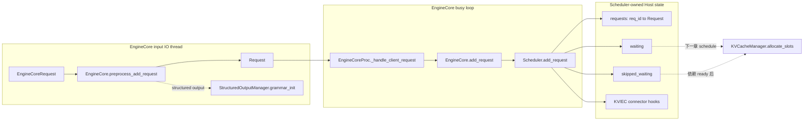
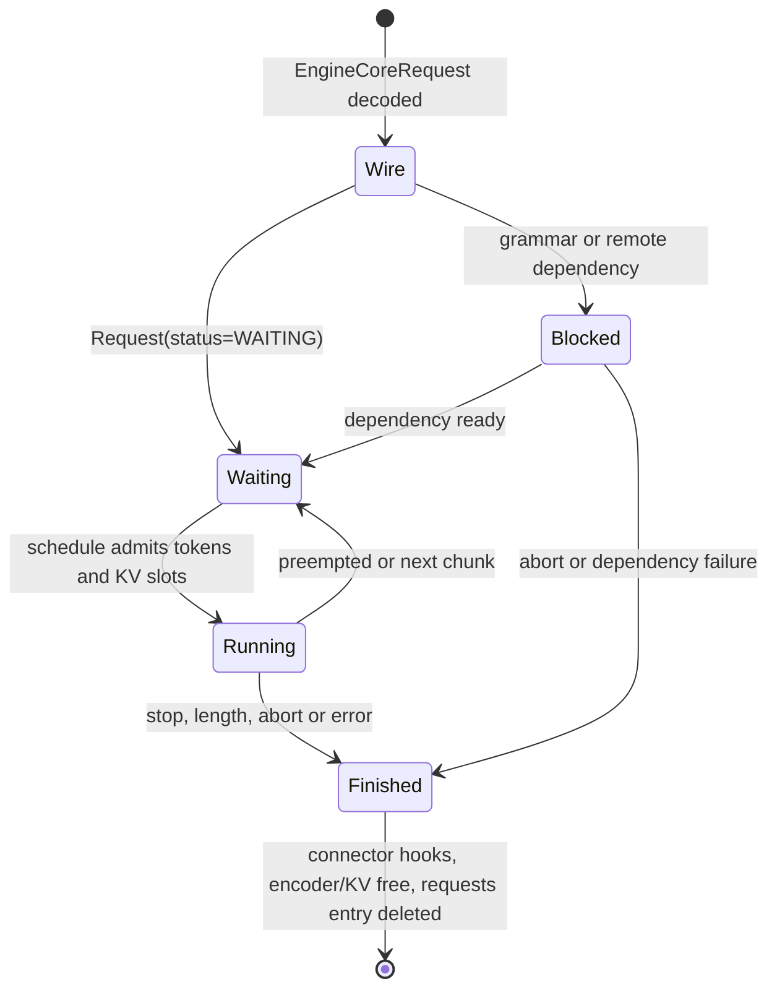

> 本文基于 `vllm-project/vllm` 默认分支提交 [`98f86b9c`](https://github.com/vllm-project/vllm/commit/98f86b9c02329200a0390aecfe598e27928cbf40)（2026-08-13）。本篇只分析“请求进入 Scheduler”这一小段，不展开下一步的 token budget、KV block 分配和 preemption。本文结论来自当前源码与仓库测试的静态核对；没有执行 GPU 实验。

## 1. 本篇在课程路线中的位置

前三章把请求送过了前端语义边界和跨进程协议：`LLM.generate` 产生 `EngineCoreRequest`，MP client 通过 msgpack/ZMQ 发送，EngineCore input thread 解码并恢复 auxiliary tensor。现在请求已经抵达 EngineCore process，但还没有成为 Scheduler 真正管理的对象。

本篇只回答一个问题：

> `EngineCoreRequest` 什么时候变成 `Request`，Scheduler 接管它时建立了哪些状态，又有没有为它预留 GPU/KV 资源？

结论先行：`Scheduler.add_request()` 是**逻辑 admission**，不是**物理容量 admission**。它建立身份、队列和生命周期 hook，但不会分配 KV block，也不会保证请求下一轮一定运行。

## 2. 前置知识回顾

`EngineCoreRequest` 是跨进程 wire object，字段顺序属于协议；`request_id` 是 EngineCore 内部身份，`client_index` 决定输出路由。EngineCore process 内又有两类线程：input IO thread 可以与模型 forward 并行做请求预处理；busy loop 串行修改 Scheduler。

这使得请求进入 Scheduler 被拆成两段：

1. input IO thread：恢复 multimodal feature、构造 `Request`、启动 grammar 编译；
2. busy loop：校验 EngineCore 层条件并调用 `Scheduler.add_request()`。

## 3. 组件在全局架构中的位置



最重要的边界在图的最后：`add_request` 到 `allocate_slots` 之间存在明确间隔。排入等待队列只是获得未来竞争计算资源的资格。

## 4. 完整调用链

### 4.1 `preprocess_add_request()`：wire object 变成运行时状态

[`EngineCore.preprocess_add_request`](https://github.com/vllm-project/vllm/blob/98f86b9c02329200a0390aecfe598e27928cbf40/vllm/v1/engine/core.py) 先用 `mm_receiver_cache` 恢复 multimodal feature，然后调用 [`Request.from_engine_core_request`](https://github.com/vllm-project/vllm/blob/98f86b9c02329200a0390aecfe598e27928cbf40/vllm/v1/request.py)。

`from_engine_core_request()` 本身只是字段映射，真正的状态初始化发生在 `Request.__init__()`：

- `status` 初始为 `WAITING`；structured output 请求改为 `WAITING_FOR_STRUCTURED_OUTPUT_GRAMMAR`；
- `num_prompt_tokens` 由 token IDs 或 prompt embeddings 推导；
- `_output_token_ids=[]`，`num_computed_tokens=0`；
- `_all_token_ids` 对 token prompt 做一次 list copy，后续 prompt/output token 统一维护；
- 创建只读 `ConstantList` view，阻止调用者绕过同步更新；
- 计算当前完整 block 的 `block_hashes`，但**没有分配 block**；
- 保存 multimodal feature、LoRA、priority、trace、streaming/session 等 Host metadata。

如果使用 structured output，`grammar_init(req)` 在 input IO thread 启动异步 grammar 编译。Scheduler 无须阻塞 busy loop 等编译完成，只需先把该请求放入不可运行的等待状态。

### 4.2 `_handle_client_request()`：线程边界

预处理后的 `(Request, current_wave)` 被放进 `input_queue`。busy loop 在 [`_process_input_queue`](https://github.com/vllm-project/vllm/blob/98f86b9c02329200a0390aecfe598e27928cbf40/vllm/v1/engine/core.py) 中取出消息，再由 `_handle_client_request(ADD, ...)` 调用 `EngineCore.add_request()`。

因此 Scheduler 的 `requests`、`waiting` 和 `running` 不由 input IO thread直接修改。这个单 owner 假设避免了队列、字典和 connector 状态之间需要细粒度锁。

### 4.3 `EngineCore.add_request()`：EngineCore 层校验

[`EngineCore.add_request`](https://github.com/vllm-project/vllm/blob/98f86b9c02329200a0390aecfe598e27928cbf40/vllm/v1/engine/core.py) 做的事情很少但边界清楚：

1. `request_id` 必须是 `str`；
2. pooling task 必须在 executor 的 supported tasks 中；
3. 请求携带 KV/EC transfer 参数但未配置 connector 时记录 warning；
4. 调用 `scheduler.add_request(request)`；
5. 若 `abort_immediately=True`，立即走 abort，使 connector 的 `request_finished` hook 得以释放 pre-admission 资源。

这里仍然没有检查“prompt 需要多少 KV block”。设备容量是 Scheduler 下一阶段结合 prefix hit、token budget、lookahead 和当时空闲 block 才能回答的问题。

### 4.4 `Scheduler.add_request()`：身份注册和排队

对新的 `request_id`，[`Scheduler.add_request`](https://github.com/vllm-project/vllm/blob/98f86b9c02329200a0390aecfe598e27928cbf40/vllm/v1/core/sched/scheduler.py) 按以下顺序操作：

```text
如果 resumable：创建 streaming_queue
根据 Request.status 进入 waiting 或 skipped_waiting
requests[request_id] = request
connector.on_new_request(request)
记录 QUEUED event
```

`requests` 是 canonical registry；`waiting`、`skipped_waiting`、`running` 只是同一个 `Request` 对象在不同调度阶段的索引。普通 `WAITING` 进入 `waiting`；以下阻塞状态进入 `skipped_waiting`：

- `WAITING_FOR_STRUCTURED_OUTPUT_GRAMMAR`；
- `WAITING_FOR_REMOTE_KVS`；
- `WAITING_FOR_STREAMING_REQ`。

拆成两个队列的目的不是改变策略，而是避免未满足异步依赖的请求反复阻塞可运行请求。FCFS/PRIORITY 仍需在两类队列之间保持既定顺序语义。

## 5. 关键对象与状态生命周期



### Host 数据 contract

- `prompt_token_ids`：`list[int] | None`，Host 对象；元素是 token ID。
- `prompt_embeds`：`torch.Tensor | None`；admission 保持传入 tensor/device，不在这里搬运或改 shape。
- `block_hashes`：Host 侧 `list[BlockHash]`，表达可参与 prefix lookup 的完整块身份。
- `status/num_computed_tokens/max_tokens`：Scheduler 直接修改的 Host 状态。
- `Request` 所有权：`Scheduler.requests` 保持 canonical 引用，等待/运行队列持有同一对象引用。

### 释放 contract

结束时 `finish_requests()` 先从 `waiting/skipped_waiting/running` 移除，再设 finished status，依次触发 KV connector、EC connector、encoder cache 和 KV block 释放，最后删除 `requests[request_id]`。

有远端 KV transfer 时，finished Request 可能暂时留在 `requests`：它已经不能调度，但 connector 尚未完成，Scheduler 必须保持 busy loop 活跃直至资源安全释放。由此可见，`requests` 的存在不等于请求仍可运行。

## 6. 具体示例：排队不等于预留显存

假设 block size 为 16，`max_num_seqs=1`，当前加入两个请求：

- `R1`：96 个 prompt token，普通生成；
- `R2`：24 个 prompt token，使用尚未编译完成的 JSON grammar。

完成 `add_request()` 后：

| 状态 | R1 | R2 |
| --- | --- | --- |
| `num_prompt_tokens` | 96 | 24 |
| 初始 `num_computed_tokens` | 0 | 0 |
| `block_hashes` | 最多 6 个完整块 hash | 最多 1 个完整块 hash |
| `status` | `WAITING` | `WAITING_FOR_STRUCTURED_OUTPUT_GRAMMAR` |
| 所在队列 | `waiting` | `skipped_waiting` |
| 已分配 KV block | 0 | 0 |

即使从几何上估算 R1 最少涉及 6 个 prompt blocks，admission 也不会先占住这 6 个物理块。下一次 `schedule()` 才会结合 prefix-cache hit、chunked prefill、token budget 和实时空闲容量调用 `KVCacheManager.allocate_slots()`。

这种设计允许大量请求低成本排队，但也意味着：如果入口持续快于执行速度，Host waiting queue 和每请求 metadata 可以继续增长。设备侧安全由延迟分配保证，服务端过载却不会因此自动得到有界拒绝。

## 7. 为什么这样设计，以及替代方案

### 当前设计：逻辑 admission 与物理 allocation 分离

优点：

- Scheduler 可以在真正调度时利用最新 prefix hit 和空闲 block；
- chunked prefill 不需要为整个 prompt 一次性保留容量；
- waiting request 不占 KV 显存，提高复用和吞吐；
- grammar、remote KV 等异步依赖可以与 GPU 工作重叠。

代价：

- 排队成功不承诺何时运行；
- Host backlog 缺少天然上限；
- admission 失败和 connector hook 的回滚责任更复杂；
- 延迟在入口阶段看似很小，却可能转化为不可控 `T_queue`。

### 替代方案：加入时预留完整 KV 容量

这能给调用方更强的“已接受即可运行”承诺，但必须按最坏生成长度预留，容易浪费大量显存，破坏 prefix reuse、chunked prefill 和 continuous batching。对生成长度不确定的 workload，它通常过于保守。

更合理的服务层增强不是提前占满 KV，而是增加独立的有界 admission policy：按 waiting 数、Host metadata、估算 token work 和 SLA 排队预算决定接受或拒绝，同时仍由 Scheduler 在执行时动态分配 KV。具体容量策略需要真实到达率和 P99 数据，本篇不凭空设阈值。

## 8. 性能、并发、正确性与边界条件

- **并发**：预处理可与 model forward 并行；Scheduler 状态只能由 busy loop 修改。
- **延迟**：grammar 编译和 remote KV 等阻塞请求进入 `skipped_waiting`，避免每轮反复挡住 ready request。
- **吞吐**：延迟 KV 分配保留 continuous batching 的灵活性。
- **graphability**：admission 是动态 Python/Host 控制流，不属于 CUDA Graph；它只准备后续 runner 所需 metadata。
- **重复 ID**：相同 ID 不是普通重复请求语义，而是 streaming session update。非 resumable 请求在原请求仍活跃时重复 ID 会触发 `duplicate request id` assertion；原请求结束并从 registry 删除后可复用 ID。
- **失败原子性**：源码按“入队、注册 dict、调用 connector hook”执行。若自定义 `connector.on_new_request()` 抛异常，函数内看不到显式回滚；这是基于代码顺序的风险推断，现有相关测试未证明 hook 异常后队列与 registry 会恢复。

## 9. 测试证据与未覆盖风险

当前仓库测试提供了几层证据：

1. [`tests/v1/engine/test_engine_core.py`](https://github.com/vllm-project/vllm/blob/98f86b9c02329200a0390aecfe598e27928cbf40/tests/v1/engine/test_engine_core.py) 真实构造 tiny Llama EngineCore，确认 add 后 `waiting=1/running=0`，step 后转为 `waiting=0/running=1`；连续加入多个请求不会被前端预先合成 batch。
2. [`tests/v1/core/test_scheduler.py`](https://github.com/vllm-project/vllm/blob/98f86b9c02329200a0390aecfe598e27928cbf40/tests/v1/core/test_scheduler.py) 的 `test_add_requests` 验证每个新 ID 同时进入 `requests` registry 和 waiting queue。
3. structured-output 测试验证 grammar 未 ready 时请求位于 `skipped_waiting`，不会产生 `scheduled_new_reqs`；grammar 编译失败只把对应请求标为 `FINISHED_ERROR`，健康请求仍可继续调度。
4. [`test_scheduler_streaming.py`](https://github.com/vllm-project/vllm/blob/98f86b9c02329200a0390aecfe598e27928cbf40/tests/v1/streaming_input/test_scheduler_streaming.py) 验证同 ID resumable request 是 session continuation，而不是第二个独立 Request。
5. memory-leak 测试在正常完整执行后检查 Scheduler/KV block 状态清空。

仍缺少的最小保护：

- `connector.on_new_request()` 抛异常后的 queue/dict 回滚测试；
- 大量 waiting request 下 Host 内存、排队延迟和拒绝行为测试；
- add 与 shutdown/pause 边界的真实跨进程竞态测试；
- prompt embeddings、multimodal feature 在长时间 waiting 时的内存保留曲线；
- 同 ID 非 streaming 请求重叠时，将 assertion 转为 request-scoped error 的契约测试。

## 10. 与前后章节的连接

上一章解释 ADD/ABORT 为什么需要有序路径和抢占路径；本章看到 ordered ADD 最终如何在 busy loop 中建立 Scheduler 状态。现在 `Request` 已经进入 waiting，但仍没有任何 token 被选中、没有 KV block 被分配。

下一章将从 `Scheduler.schedule()` 的 waiting loop 开始，回答：R1 的 96 个 token 一次调多少、prefix hit 如何减少计算、`max_num_batched_tokens/max_num_seqs` 如何形成物理 batch，以及 `allocate_slots()` 失败时为什么可能暂缓或抢占其他请求。

## 11. 本篇结论

从第一性原理看，Scheduler admission 必须完成的是“建立一个可被一致管理和最终释放的逻辑实体”，而不是提前猜测并独占它未来所有设备资源。当前实现因此选择 Host 建档、异步依赖分流和延迟 KV allocation。

必须牢记四条不变量：

1. `Scheduler.requests` 是 Request 的 canonical registry；队列引用必须与它一致。
2. blocked waiting request 仍是活请求，只是当前不可运行。
3. add 成功不代表 KV block 已分配，也不代表下一轮一定进入 batch。
4. request 结束必须经过 connector/cache hooks 后才能完全从 registry 删除。

### 知识债

- waiting backlog 的容量和服务层拒绝策略；
- connector admission hook 的异常原子性；
- priority/FCFS 在 `waiting + skipped_waiting` 两队列间的完整顺序证明；
- streaming session 的同 ID 更新与普通请求 API 的隔离边界。

### 三个理解检查问题

1. 为什么 `block_hashes` 已经计算完成，仍不能说明 KV block 已经分配？
2. structured-output 请求为什么要进入 `skipped_waiting`，而不是留在普通 waiting 队首？
3. 如果要求 admission 后立即预留 `max_tokens` 对应的全部 KV，continuous batching 会失去哪些能力？

### 下一章

`Scheduler.schedule()` 的 waiting admission：token budget、prefix hit、`max_num_seqs` 与 `KVCacheManager.allocate_slots()` 如何共同形成第一个物理 batch。

## 12. 课程账本增量

- 阶段：从 EngineCore 跨进程边界进入 Scheduler。
- 新增覆盖：`Request.__init__`、`Request.from_engine_core_request`、`RequestStatus`、`EngineCore.preprocess_add_request`、`EngineCore.add_request`、`Scheduler.add_request`、`_enqueue_waiting_request`、`finish_requests`、`_free_request`。
- 新增不变量：逻辑 admission 不分配 KV；`requests` 是 canonical registry；阻塞依赖进入 `skipped_waiting`；释放可能因 connector 延迟。
- 下一章：Scheduler waiting loop 和物理 batch 形成。
