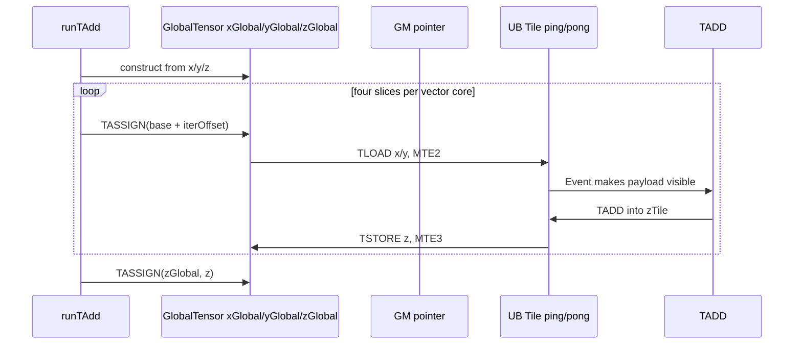

> 本章基于 [`pto-isa@25292e9`](https://github.com/hw-native-sys/pto-isa/commit/25292e99909a1fc46aaa1313c5c6b628b943ca6a)。代码与规范给出的结论标为“事实”；CPU-SIM/测试能证明的结论标为“测试事实”；涉及真实 DMA 微架构而公开材料没有说明的部分标为“推断”。

## 本篇在 PTO 课程路线中的位置

前四章已经回答：Tile 的 capacity/valid region 如何划分“资源盒子”和“本次有效数据”，Event 与双向 `TPipe` 又如何约束 Tile 的生产、消费和复用。本章补上数据进入 Tile 之前最关键的一层：**一个二维 Tile 元素，究竟对应 GM 中哪一个地址？**

这是 ISA 基础阶段的地址语义章。只选择 `pto-isa`，因为从 descriptor、CPU 语义模型、A2/A3 实现到设备测试的证据链已经在同一仓内闭合；此时引入上层 DSL 反而会混淆“视图语义”和“lowering 策略”。

## 前置知识

- `Tile<..., Rows, Cols, ..., validRows, validCols>`：`Rows/Cols` 是容量，valid region 是本次参与语义的左上角连续矩形。
- `TLOAD(dst, src)`：把 `GlobalTensor` 描述的 GM 数据搬到 Tile；不是把任意五维张量自动 reshape 成任意二维矩阵。
- 上一章的 `subOffset` 是 ring slot 内的额外字节偏移；它不等同于五维 tensor partition，也不能替代 stride。

## 今日核心问题

1. `GlobalTensor` 为什么必须同时携带 pointer、五维 `Shape`、五维 `Stride` 和 `Layout`？
2. ND/DN 如何把 Tile 的 `(row, col)` 还原为 `(i0…i4)`，再计算 GM 地址？
3. `TASSIGN(base + offset)`、IR `partition_view` 与上一章 ring `subOffset` 的职责边界在哪里？
4. 数学上合法的 stride，为什么未必能走 A2/A3 的高效 `TLOAD` 路径？

## PTO 全栈中的位置

```mermaid
flowchart LR
    A["GM allocation / kernel pointer"] --> B["GlobalTensor<T, Shape5D, Stride5D, Layout>"]
    B --> C["TASSIGN: rebase pointer to a subwindow"]
    C --> D["TLOAD(dstTile, srcGlobal)"]
    D --> E["Layout maps Tile (r,c) to 5D indices"]
    E --> F["elementOffset = Σ ik * stridek"]
    F --> G["A2/A3 DMA burst + gap"]
    G --> H["Tile capacity buffer"]
    H --> I["validRows × validCols is semantic payload"]
```



上游必须给出正确的 descriptor；ISA backend 负责验证可实现的组合并生成搬运。下游计算只看到 Tile，不应再猜测 GM 的原始五维分区。

## 概念与精确语义

### 1. `GlobalTensor` 是视图描述符，不拥有 GM

[`GlobalTensor.md`](https://github.com/hw-native-sys/pto-isa/blob/25292e99909a1fc46aaa1313c5c6b628b943ca6a/docs/coding/GlobalTensor.md) 与 [`pto_tile.hpp`](https://github.com/hw-native-sys/pto-isa/blob/25292e99909a1fc46aaa1313c5c6b628b943ca6a/include/pto/common/pto_tile.hpp#L273-L421) 的代码事实是：

- `data()`/pointer 指向视图基址，descriptor 不分配、不释放 GM；
- `Shape<s0…s4>` 定义合法坐标域；
- `Stride<t0…t4>` 的单位是**元素**，不是字节；
- 静态维度存在类型参数里，只有 `DYNAMIC` 维度需要在实例中保存运行时值；
- `Layout` 提供 ND、DN、NZ 等解释/特化信息，但 layout 不是实际地址。真正地址仍由 pointer 与 stride 决定。

由此得到必须保持的第一性原理不变量：

`byteAddress(i0…i4) = byte(base) + sizeof(T) × Σ(ik × stridek)`

shape 回答“哪些坐标存在”，stride 回答“相邻坐标在物理空间相隔多远”。只保留 shape，无法表达 padding、切片或非紧凑视图；只保留 stride，又无法证明访问范围和 DMA 合法性。

### 2. 二维 Tile 与五维坐标之间需要 layout 映射

CPU 语义模型 [`MapTileIndicesToGlobalOffset`](https://github.com/hw-native-sys/pto-isa/blob/25292e99909a1fc46aaa1313c5c6b628b943ca6a/include/pto/cpu/tile_offsets.hpp) 给出了最清楚的 oracle。

对 ND：Tile 的列直接对应 `i4`，Tile 的行按 `shape3 → shape2 → shape1 → shape0` 展开：

```text
i4 = col
i3 = row % shape3
i2 = (row / shape3) % shape2
i1 = (row / (shape3*shape2)) % shape1
i0 = row / (shape1*shape2*shape3)
```

因此 ND 的二维有效尺寸必须是：

`validRows = shape0×shape1×shape2×shape3`，`validCols = shape4`。

DN 则让 `i3 = row`，列方向折叠 `shape4、shape2、shape1、shape0`；所以 `validRows = shape3`，`validCols = shape0×shape1×shape2×shape4`。NZ 还有以 `C0 = 32B / sizeof(T)` 为内层盒的独立映射，不能用 ND 公式硬解释。

这揭示一个容易踩坑的边界：`Layout::ND` 与 Tile 的 `BLayout::RowMajor` 处在不同层次。前者决定 GlobalTensor 五维坐标如何折叠；后者决定 Tile capacity 内的二维物理排布。两者名字相似，不代表可以互换。

## 真实类型、函数与设备实现

### `Shape`、`Stride`、`GlobalTensor`

[`pto_tile.hpp`](https://github.com/hw-native-sys/pto-isa/blob/25292e99909a1fc46aaa1313c5c6b628b943ca6a/include/pto/common/pto_tile.hpp#L31-L420) 中，`Shape`/`Stride` 都允许静态值与 `DYNAMIC` 混合。`GetShape<i>()`、`GetStride<i>()` 统一读取静态/动态值；CPU `GetElement`/`SetElement` 则直接使用五项 dot product。这使同一套 C++ 类型同时承担三种职责：编译期特化、运行时动态尺寸，以及 CPU-SIM 的可执行语义。

代价也很明确：如果调用方把 stride 单位误传成字节，编译器通常无法从类型上阻止；错误会按 `sizeof(T)` 再乘一次，表现为错址而非友好的类型错误。

### A2/A3 的 ND `TLOAD`

[`TLoadGm2L1Nd2nd`](https://github.com/hw-native-sys/pto-isa/blob/25292e99909a1fc46aaa1313c5c6b628b943ca6a/include/pto/npu/a2a3/TLoad.hpp#L106-L150) 并不是逐元素执行 dot product，而是把同一语义压缩成 DMA 参数：

- `shape4 × sizeof(T)` 必须是 32 B 对齐；
- `validCol == shape4`，`validRow == shape0×shape1×shape2×shape3`；
- `shape3 < 4096`，因为它直接成为 `nBurst`；
- `lenBurst = validCol×sizeof(T)/32B`；
- `gmGap = (stride3-shape4)×sizeof(T)/32B`；
- 外层 `shape0/1/2` 用 `stride0/1/2` 调整每组 DMA 的源地址。

DN 路径 [`TLoadGm2L1Dn2dn`](https://github.com/hw-native-sys/pto-isa/blob/25292e99909a1fc46aaa1313c5c6b628b943ca6a/include/pto/npu/a2a3/TLoad.hpp#L152-L195) 对称地要求 `shape3` 行宽 32 B 对齐，以 `shape4` 为 `nBurst`，并从 `stride4-shape3` 得到 burst 间 gap。

**代码事实**：这些是当前 A2/A3 GM→L1 plain ND/DN 路径的硬前置条件。**硬件映射推断**：32 B、burst 和 gap 参数说明实现利用块粒度 DMA，而不是五重标量循环；但公开代码不足以推出 DMA 队列深度、bank 冲突或实际带宽，必须靠 device trace 测量。

## GlobalTensor 生命周期与地址链

真实 add kernel [`add_custom.cpp`](https://github.com/hw-native-sys/pto-isa/blob/25292e99909a1fc46aaa1313c5c6b628b943ca6a/demos/baseline/add/csrc/kernel/add_custom.cpp#L29-L117) 展示了完整生命周期：



该 kernel 使用 `GlobalTensor<half, Shape<1,1,1,1,512>, Stride<1,1,1,2048,1>>`。20 个 vector core 各负责 2048 个元素，再分成 4 个 512-element slice；每次 `TASSIGN` 只重绑 descriptor 的基址，Tile ping/pong buffer 被循环复用。这里前三个 stride 值为 1 是因为对应 shape 都为 1、不会参与非零索引；不能把它抄成一般五维连续 stride。

对象 ownership 也很清楚：GM allocation 属于 kernel 调用方；`GlobalTensor` 只借用 pointer；Tile buffer 地址由 `TASSIGN(Tile, UB_offset)` 绑定；Event 决定何时可覆盖 ping/pong；离开 kernel 后 descriptor 失效，但 GM 的释放不由它负责。

## 具体 shape、Tile 与状态演算

考虑 `half` ND tensor：

```text
shape  = [2, 2, 2, 4, 8]
stride = [128, 64, 32, 8, 1]
Tile valid = [32, 8]
```

Tile 元素 `(row=23, col=5)` 映射为：

```text
i4=5, i3=23%4=3, i2=(23/4)%2=1,
i1=(23/8)%2=0, i0=23/16=1
elementOffset = 1×128 + 0×64 + 1×32 + 3×8 + 5 = 189
byteOffset = 189×2 = 378 B
```

因为这是紧凑 ND，二维线性式 `23×8+5` 也得到 189。这个相等不是 layout 的魔法，而是 stride 恰好满足连续存储。

再看有行 padding 的 `float` 视图：`shape=[1,1,1,4,8]`，`stride=[48,48,48,12,1]`。逻辑上仍是 4×8，但每行后有 4 个 padding 元素。`(2,7)` 的 offset 是 `2×12+7=31`，而不是紧凑矩阵的 23。A2/A3 ND 路径可把 8 个 float 组成 32 B burst，以 `(12-8)×4/32=0.5` block 的 gap 表达却不是整数；当前右移计算会截断，因此“数学视图合法”并不足以证明设备路径合法。维护者应额外要求 gap 的字节数也是 32 B 整数倍，例如把 stride3 设为 16，gap 才是 1 block。

这正是 verifier/CI 应守住而当前局部代码未显式 assert 的边界。

## `TASSIGN`、`partition_view` 与 `subOffset`

- C++ `TASSIGN(global, base + elementOffset)`：直接重绑 pointer，后续 stride 从新基址计算。
- [`pto.partition_view`](https://github.com/hw-native-sys/pto-isa/blob/25292e99909a1fc46aaa1313c5c6b628b943ca6a/docs/isa/tile/ops/view-and-tile-buf/partition-view.md)：IR 中的纯逻辑子窗口，保存 parent、offsets、sizes；不分配、不搬运。越界行为由 target 定义，因此上层 verifier 不能假设自动截断。
- TPipe `subOffset`：上一章 ring slot 内的附加字节位移；先选方向 ring 与 slot，再加 `subOffset`。

三者可以组合，但单位和 owner 不同。推荐的心智模型是：`effective address = allocation base + partition/rebase element offset × sizeof(T) + ring byte offset`。若跨层把 element offset 当 byte offset，或者把 ring offset塞进 shape，错误会穿过类型系统。

## 为什么这样设计，以及替代方案

当前设计把 shape/stride/layout 保留为 descriptor，再由 backend 选择 burst，优点是零拷贝视图、静态特化与动态 shape 可以共存；连续与带 padding 的数据可用同一接口表达。代价是 contract 分散：数学合法性在 common/CPU 层，DMA 对齐与 burst 上限在 backend，IR partition 的边界又在上层。

替代方案一是只允许 contiguous 2D tensor。接口和验证简单，DMA 更容易稳定满带宽，但 transpose、padding、batch/head flatten 都要提前 materialize，增加 GM 流量和临时内存。

替代方案二是在 IR 中把所有视图规范化为显式 `baseOffset + 2D rowStride/colStride`。它能简化某些 backend，却会丢失 5D 结构信息，影响 NZ/5HD 等 layout lowering，并把复杂度推给 canonicalization。更合理的方向不是删掉 5D descriptor，而是增加一个跨 backend 共用的 legality verifier，把整除、范围、乘法溢出和 layout/valid-shape 关系一次性检查。

## 访存、并行、流水与硬件约束

- **访存量**：理想 ND load 是 `validRows×validCols×sizeof(T)`；padding 只增加地址跨度，不应被搬进 valid payload。但不对齐 gap 可能迫使 fallback 或直接落入未定义组合。
- **并行度**：A2/A3 用 `shape3/shape4` 形成 burst 数，外三维用循环分组；极小 burst 会增加指令开销，过大又受 `<4096` 限制。
- **流水**：descriptor 重绑不等于 DMA 完成；仍需上一章 Event/slot ownership 保证 Tile buffer 不被提前复用。
- **正确性**：shape 乘积和 offset 计算使用不同宽度的整数路径；超大动态 shape 的乘法溢出需要单独防护。
- **可移植性**：CPU-SIM 的逐元素映射是语义 oracle，不代表 A2/A3、A5 都接受同一组对齐与 burst 参数。

## 测试证据与未覆盖风险

[`A2/A3 TLOAD device test`](https://github.com/hw-native-sys/pto-isa/blob/25292e99909a1fc46aaa1313c5c6b628b943ca6a/tests/npu/a2a3/src/st/testcase/tload/tload_kernel.cpp) 覆盖：`[1,1,1,128,128]`、`[2,2,2,256,64]`、高阶 `[1,1,32,64,128]`，以及 127/60/62/125 列尾部 padding；golden 用真实五重索引构造输入，并把目标行补齐到 32 B。动态与静态 shape 的 case 6/7 使用相同 golden，验证两种 descriptor 表达的结果一致。

[`CPU tile_offsets.hpp`](https://github.com/hw-native-sys/pto-isa/blob/25292e99909a1fc46aaa1313c5c6b628b943ca6a/include/pto/cpu/tile_offsets.hpp) 是地址语义的直接可执行证据；历史提交 [`1a32f61`](https://github.com/hw-native-sys/pto-isa/commit/1a32f6197499425cab3b40518d15f192f69e2477) 专门修复 partial tile、非连续 stride 与 assigned Tile view 的 CPU-SIM 行为。DN flatten 支持的合入历史可见 [`5efa68f`](https://github.com/hw-native-sys/pto-isa/commit/5efa68fbcd4890d3fa5b694f2efb94014b1004b3)。

仍缺的最小 CI guard：

1. 对小型随机 5D shape/stride 做 property test，逐坐标比较 `MapTileIndicesToGlobalOffset` 与 dot-product golden；
2. 增加“gap 字节不是 32 B 整数倍”的明确 rejection test，防止右移静默截断；
3. 从 `partition_view` 经过 lowering 到 ND/DN `TLOAD` 的跨层 test，同时覆盖 dynamic/static 和 OOB rejection；
4. CPU-SIM 与 A2/A3/A5 对同一非紧凑视图做差分测试。当前材料没有证明这四层完全一致。

## 与前后章节的连接

向前看，上一章的 ring 地址先定位 transport slot，本章的 GlobalTensor stride 再定位 slot/GM view 中的元素；两者都属于地址 ABI，但生命周期 owner 不同。向后看，下一章进入真实 GEMM：A/B GlobalTensor 将分别加载为 `Left/Right` Tile，layout 与 stride 不只是正确性信息，还决定是否需要 `TMOV`/fractal conversion，以及 Cube 能否吃到连续高效的数据。

## 本篇结论

1. `GlobalTensor` 是零拷贝 GM 视图：pointer 定基址，shape 定坐标域，stride 定物理距离，layout 定 2D↔5D 的解释与 backend 特化。
2. ND/DN 的二维 Tile 不是随意 reshape；valid shape 必须等于对应五维折叠结果。
3. CPU dot-product 公式定义数学语义，设备 backend 用 burst/gap 实现同一语义；数学合法不等于 DMA 组合合法。
4. `TASSIGN`、IR `partition_view`、ring `subOffset` 分属 pointer、逻辑视图和 transport slot 三层，单位与 owner 必须显式区分。

### 知识债

- NZ/5HD 的 C0 盒化地址映射尚未逐项演算；
- `partition_view` 到具体 backend descriptor 的 lowering 尚未跨仓追踪；
- A2/A3 plain ND/DN gap 整除约束是否由更上层 verifier 保证，尚未确认；
- 动态 shape/stride 的溢出与 OOB 策略缺少统一 contract。

### 三个理解检查问题

1. 为什么 `shape=[1,1,1,4,8]` 不能单独判断 `(2,7)` 的物理 offset？
2. ND 的 `validRows` 为什么必须折叠前四维，而 DN 的 `validCols` 会折叠多个维度？
3. 若 `TASSIGN` 已把 pointer 移到子块首地址，后续 offset 计算应保留哪些 stride，哪些 shape 必须更新？

### 下一章

用仓内真实 GEMM kernel 串起 `GlobalTensor → TLOAD → Left/Right Tile → TMATMUL → Acc Tile → TSTORE`，重点解释 fractal layout、Cube operand contract 与一次 K-tile 的生命周期。

## 课程账本增量

- 章节：05 / ISA 基础与地址语义
- 新覆盖：`Shape`、`Stride`、`GlobalTensor`、`MapTileIndicesToGlobalOffset`、`TLoadGm2L1Nd2nd`、`TLoadGm2L1Dn2dn`、`TASSIGN(GlobalTensor)`
- 新不变量：地址是 element-stride dot product；ND/DN valid shape 与五维折叠必须一致；A2/A3 burst/gap 必须满足块粒度约束
- 已闭合知识债：GlobalTensor 五维 shape/stride 到二维 Tile 的基础映射
- 新增知识债：NZ/5HD、partition lowering、gap 整除 verifier、跨 backend differential test

