> 本文以 vLLM `main` 的 [`827a2af8`](https://github.com/vllm-project/vllm/commit/827a2af806c4e4ea7bcc280f57f793e6a5fcc676) 为准。源码事实、测试事实和维护判断会分开说明。

## 本篇在课程路线中的位置

上一章停在 `Scheduler.add_request()`：`Request` 已进入 `requests` registry 与 `waiting` queue，但还没有 GPU KV block，也没有成为一次 forward 的成员。本章只回答一个问题：**一个逻辑上已接收的 waiting Request，何时才算被物理调度？**

答案不是“做过 prefix lookup”，也不是“token budget 还有余额”，而是：`KVCacheManager.allocate_slots()` 成功，Request 被移入 `running`，并进入 `SchedulerOutput`。这是请求 admission 的第二道、也是资源意义上的门。

## 前置知识回顾

此前已确认三个前提：

1. `Scheduler.requests`、`waiting`、`running` 持有同一个 `Request` 对象；queue 不是对象副本。
2. `Scheduler.add_request()` 只计算 block hash、建立 Host 状态，不占用设备 KV cache。
3. `Request.num_computed_tokens` 表示 Scheduler 已认可的计算进度；`request.num_tokens` 是当前必须追上的 token 边界，既能覆盖首轮 prompt，也能覆盖 preempt 后带 output token 的 resume。

## 本篇要回答的核心问题

- `max_num_seqs`、token budget 和 KV capacity 分别约束什么？
- prefix cache hit 为什么仍可能无法入场？
- waiting Request 的状态与 block 所有权在哪一行真正改变？
- 调度结果跨到 Worker 时，传递的是 Python `Request` 还是稳定的 Host 数据快照？

## 组件在全局架构中的位置

```mermaid
flowchart LR
    A[EngineCore.add_request] --> B[Scheduler.add_request]
    B --> C[waiting / skipped_waiting]
    C --> D[Scheduler.schedule]
    D --> E[KVCacheManager.get_computed_blocks]
    E --> F[KVCacheManager.allocate_slots]
    F -->|None| C
    F -->|KVCacheBlocks| G[running + RequestStatus.RUNNING]
    G --> H[NewRequestData / SchedulerOutput]
    H --> I[Executor / Worker / ModelRunner]
```



Owner 边界很清楚：`Scheduler` 拥有 Host 侧 Request 状态机、每步预算和队列；`KVCacheManager` 拥有 request-id 到物理 block 的映射及 block pool；`SchedulerOutput` 是交给执行侧的计划快照。Worker 并不接管 Scheduler 的 `Request` 对象。

## 完整调用链

入口是 [`Scheduler.schedule()`](https://github.com/vllm-project/vllm/blob/827a2af806c4e4ea7bcc280f57f793e6a5fcc676/vllm/v1/core/sched/scheduler.py#L426-L1129)。它先调度已有 `running` 请求，再处理 waiting 流；如果当前 step 发生 preemption，或 Scheduler 被 pause，就不会继续接纳新 waiting 请求。

waiting loop 的主干可压缩成下面的伪代码：

```python
while waiting_exists and token_budget > 0:
    if input_budget <= draft_slots: break
    if len(running) + paused_streaming >= max_num_seqs: break

    req = selected_queue.peek()
    cached_blocks, cached_tokens = prefix_lookup(req)
    new_tokens = clamp(req.num_tokens - cached_tokens, budgets)
    new_blocks = kv_manager.allocate_slots(req, new_tokens, cached_blocks)
    if new_blocks is None: break

    queue.pop()
    running.append(req)
    req.status = RUNNING
    record budgets, block ids and SchedulerOutput fields
```

真实实现还插入 LoRA 数量、grammar/remote-KV 状态、multimodal encoder budget、Mamba alignment、speculative lookahead 等 gate；但这些都是在同一条“探测 → 计算需求 → 尝试分配 → 提交”链上加约束，并没有改变提交点。

## 关键类型、字段和状态生命周期

### `Request`

初态为 `WAITING`，由 Scheduler registry 持有。首次调度时，只有 `request.num_computed_tokens == 0` 才执行本地 prefix lookup。命中量先放在局部变量 `num_new_local_computed_tokens`；在分配成功以前，代码不会把 Request 提交到 `running`。

成功后发生四个关键变化：queue `pop_request()`；`self.running.append(request)`；`request.status = RUNNING`；`request.num_computed_tokens = num_computed_tokens`。注意它写入的是 cache 已覆盖的进度，不是本 step 即将计算完成的进度；后者只有收到 `ModelRunnerOutput` 后才能兑现。

### `KVCacheBlocks`

[`KVCacheBlocks`](https://github.com/vllm-project/vllm/blob/827a2af806c4e4ea7bcc280f57f793e6a5fcc676/vllm/v1/core/kv_cache_manager.py#L47-L107) 是按 KV cache group 分组的 Host 侧 block handle 容器，内部元素最终可投影为 `tuple[list[int], ...]`。prefix lookup 返回可复用的 blocks；`allocate_slots()` 把它们纳入 request 映射，再为未计算 token 和 lookahead 分配新 blocks。设备上的 K/V tensor 不在这里搬运；本层处理 block 身份与所有权。

### `SchedulerOutput`

新请求经 [`NewRequestData.from_request()`](https://github.com/vllm-project/vllm/blob/827a2af806c4e4ea7bcc280f57f793e6a5fcc676/vllm/v1/core/sched/output.py#L32-L70) 变成 Host 数据：`prompt_token_ids: list[int]`、`block_ids: tuple[list[int], ...]`、`num_computed_tokens: int` 等。`SchedulerOutput.num_scheduled_tokens: dict[str, int]` 再声明每个 request 本 step 要计算多少 token。此处无固定 tensor shape/dtype/device；真正生成 `input_ids`、`positions`、slot mapping 和设备 buffer 是后续 ModelRunner 章节的边界。

```mermaid
sequenceDiagram
    participant S as Scheduler
    participant R as Request
    participant K as KVCacheManager
    participant P as BlockPool
    participant O as SchedulerOutput

    S->>K: get_computed_blocks(R)
    K-->>S: cached blocks + cached token count
    S->>K: allocate_slots(R, new_tokens, cached blocks)
    K->>P: free skipped / check free blocks
    alt capacity insufficient
        P-->>K: insufficient
        K-->>S: None
        Note over R: remain WAITING; no budget committed
    else capacity sufficient
        P-->>K: physical block handles
        K-->>S: KVCacheBlocks
        S->>R: status=RUNNING; set cached progress
        S->>O: block_ids + num_scheduled_tokens
    end
```

## 逐函数源码解读

### 1. 三类预算不是同一件事

初始化时，`max_num_running_reqs = scheduler_config.max_num_seqs`；计算 token 上限优先取 `max_num_scheduled_tokens`，未设置时回退到 `max_num_batched_tokens`。waiting loop 还维护 `input_budget = max_num_batched_tokens`，并为 speculative draft slots 预留空间。

因此：sequence budget 控制同时活跃的 model-runner request 数；token budget 控制本 step 的计算工作量；KV block capacity 控制状态能否落地。前两者满足不推导出第三者满足。

### 2. prefix lookup 是探测，不是提交

[`get_computed_blocks()`](https://github.com/vllm-project/vllm/blob/827a2af806c4e4ea7bcc280f57f793e6a5fcc676/vllm/v1/core/kv_cache_manager.py#L233-L294) 查找最长 cache hit，但把最大命中长度限制为 `request.num_tokens - 1`：即便全 prompt 命中，也必须重算最后一个 token 来得到 logits。返回的 blocks 只是候选引用；请求仍可能因为 token gate、encoder gate 或物理容量失败。

### 3. `allocate_slots()` 才执行容量事务

[`allocate_slots()`](https://github.com/vllm-project/vllm/blob/827a2af806c4e4ea7bcc280f57f793e6a5fcc676/vllm/v1/core/kv_cache_manager.py#L351-L569) 的 contract 是：输入 Request、待计算 token 数、prefix blocks、外部命中与 lookahead；输出新分配的 `KVCacheBlocks`，容量不足返回 `None`。

它先计算 `total_computed_tokens`，清理 sliding-window 等已不再需要的 blocks，再计算 `num_tokens_need_slot = min(total_computed + new + lookahead, max_model_len)`。只有 `required_blocks <= free_blocks - reserved_blocks` 才会把 cached blocks 接入 request、分配新 blocks并 cache 可提交 token。waiting admission 还可应用 watermark；`scheduler_reserve_full_isl` 开启时会要求整个当前序列都能放下，而非只检查首个 prefill chunk。

失败的后置条件很重要：返回 `None`，request 没有从 queue 弹出，token/input budget 也没有扣减。主 waiting flow 随即 `break`，保留 FCFS 头部，避免后面的短请求绕过这个资源受阻请求。

### 4. 提交与输出

成功后才记录 prefix cache stats。当前代码中的注释直接说明：在 admission 点记录，以免未调度 lookup 被计数。随后 Request 进入 `running`，预算递减，block IDs 与 token 数被装进 `SchedulerOutput`。函数末尾还断言总 token 不越界、budget 非负、`len(running) <= max_num_running_reqs`，这些是维护该循环时不能破坏的局部证明。

## 具体示例与 shape/状态演算

设单一 full-attention KV group，`block_size=16`，`max_num_seqs=2`，本 step 的 token/input budget 都为 32；队列是 R1、R2：

- R1：prompt 40 tokens，prefix 命中 16 tokens；
- R2：prompt 20 tokens，无命中；
- 当前没有 running request，chunked prefill 开启。

R1 的 `num_computed_tokens` 仍为 0。lookup 返回 1 个 cached block 与 16 tokens；`num_new_tokens=min(40-16, 32)=24`。`allocate_slots()` 需要覆盖 40 个主模型 token，即 3 个 16-token blocks；其中一个复用，另外两个来自 pool。成功后 R1 进入 `running`，本 step 记录 24 tokens，剩余 token budget 为 8。

轮到 R2：`num_new_tokens=min(20, 8)=8`，若 chunked prefill 开启且 pool 还有容量，它获得首块并入场；最终 batch 的 Host 计划为 `{R1: 24, R2: 8}`。如果此时 pool 无法满足 R2，`allocate_slots()` 返回 `None`，R2 留在 waiting；本 step 仍只运行 R1，而不是撤销已提交的 R1。

这里的 block 数是管理层离散容量；K/V tensor 的实际 shape 取决于层数、KV heads、head size、dtype 和具体 KV cache spec，本章不能从 `block_size=16` 推导字节数。

## 为什么这样设计及替代方案

第一性约束是：请求队列可以很深，但设备状态容量有限且会随 prefix reuse、sliding window、spec lookahead 改变。把分配推迟到每个 scheduling step，才能用最新的 cache hit 和 free-block 状态做决定。

替代方案是在 `add_request()` 时预留整段 KV。它让 admission 更早确定，却会为尚未运行的长 prompt 占住显存，削弱 continuous batching 与 prefix reuse，并使排队时间直接转化为设备内存占用。当前的 just-in-time 方案吞吐和利用率更好，代价是 Scheduler 路径复杂、同一个请求可能反复 lookup/重试，因此提交点和指标统计必须严格一致。

## 性能、并发、正确性与边界条件

- **延迟/吞吐**：prefix hit 同时减少本 step token 工作量与新 block 数；chunked prefill 允许长请求吃掉剩余预算而不是整步阻塞。
- **公平性**：waiting 头部因容量失败会 `break`，体现 FCFS；但 blocked grammar/remote-KV/LoRA 请求会移入本 step 的 skipped queue，让可运行请求继续，严格 FCFS 被有意识放宽。
- **并发**：Scheduler 是 EngineCore busy loop 的 Host-side owner；Worker 只消费不可变式 step plan。异步 KV load 还会用 `reserved_blocks` 保护在途 prefill，说明“free blocks”并非都可被新请求占用。
- **graphability**：Scheduler 自身不被 CUDA Graph capture；它决定 batch/token/block metadata。稳定 batch shape 的需求通过 spec padding 等策略影响 `num_new_tokens`，图捕获发生在下游。
- **正确性**：lookup 与 allocation 不是原子的一步。当前实现依靠 block pool 引用与 coordinator 的分配流程维持候选 cached blocks；任何修改 prefix eviction 或跨 connector 行为，都必须重查“lookup 后、allocate 前”的 TOCTOU 边界。

## 测试证据与未覆盖风险

[`test_schedule`](https://github.com/vllm-project/vllm/blob/827a2af806c4e4ea7bcc280f57f793e6a5fcc676/tests/v1/core/test_scheduler.py#L155-L178) 构造 10 个请求，断言首次 `schedule()` 后全部从 waiting 移到 running，并且每个请求调度的 token 数等于 prompt 长度，覆盖正常提交路径。

[`test_schedule_order`](https://github.com/vllm-project/vllm/blob/827a2af806c4e4ea7bcc280f57f793e6a5fcc676/tests/v1/core/test_scheduler.py#L995-L1019) 用两个 800-token 长请求和两个 10-token 短请求验证：chunked prefill 关闭时不会让后续短请求绕过队首长请求，覆盖 token budget 与 FCFS 的交互。

[`test_kv_connector_unable_to_allocate`](https://github.com/vllm-project/vllm/blob/827a2af806c4e4ea7bcc280f57f793e6a5fcc676/tests/v1/core/test_scheduler.py#L2124-L2197) 把 block pool 缩到只能容纳一个请求，验证第二个请求保持 waiting；第一个完成释放后，第二个才能进入 running。它证明逻辑 admission 不等于物理 admission。

近期合入的 [`#48860`](https://github.com/vllm-project/vllm/pull/48860) / [`8950394e`](https://github.com/vllm-project/vllm/commit/8950394e0a40a781c61a9ef1f099ef847af03891) 把 prefix-cache 统计移动到成功 allocation 之后；[`test_prefix_cache_stats_counted_once_for_retried_then_scheduled_request`](https://github.com/vllm-project/vllm/blob/827a2af806c4e4ea7bcc280f57f793e6a5fcc676/tests/v1/core/test_scheduler.py#L1159-L1229) 注入第一次 `allocate_slots=None`，断言失败重试不计数、第二次成功只计一次。这是“提交点必须唯一”的直接回归证据。

仍缺一个足够小的参数化单测，把 `max_num_seqs`、token budget、prefix hit 与 KV capacity 四个 gate 放在同一 truth table 中，并逐项断言 queue、status、budget、block refcount 都无泄漏。现有测试多为分别覆盖，组合边界更容易在未来重构中漂移。

## 与前后章节的连接

本章补齐了 `add_request()` 到第一个 `SchedulerOutput` 的空白：请求从“系统承诺处理”变成“本 step 有资源执行”。下一章继续同一个 Request，研究已有 `running` 请求如何追加 slots；当 KV 不够时，Scheduler 如何选择 preemption victim、释放 blocks，并把 Request 变回 `PREEMPTED` 等待恢复。

## 本篇结论、知识债与理解检查

结论：**物理 batch 的提交点是 KV allocation 成功后的 queue/status/budget/output 联合更新。** prefix hit 只是降低需求，token/sequence gate 只是上限，二者都不能替代物理容量检查。

新增知识债：hybrid KV group 下每组 block 数与统一 `num_computed_tokens` 的对齐；watermark 与 `scheduler_reserve_full_isl` 的配置选择；async KV connector 在 lookup/transfer/allocation 三阶段的 block pinning；`SchedulerOutput` 如何被 ModelRunner 转成设备 slot mapping。

三个检查问题：

1. 为什么 prefix 命中整个 prompt 时仍要至少重算最后一个 token？
2. 若 `allocate_slots()` 失败后提前扣掉 token budget，会破坏哪些不变量？
3. 为什么 waiting 头部的 KV 容量失败采用 `break`，而 grammar/remote-KV 未就绪通常采用 skip？

**下一章：** running request 的 slot 追加、preemption victim 选择与 `PREEMPTED → waiting → resumed` 状态闭环。

## 课程账本增量

- 路线阶段：Scheduler 物理 batch 形成。
- 新覆盖：`Scheduler.schedule()` waiting loop、`KVCacheManager.get_computed_blocks()`、`KVCacheManager.allocate_slots()`、`KVCacheBlocks`、`NewRequestData`、`SchedulerOutput`。
- 新不变量：prefix stats 仅在成功 admission 后记录；失败 allocation 不弹 queue、不扣预算；首次进入 running 时 cached progress 与本 step scheduled work 分离。
- 基于 commit：[`827a2af8`](https://github.com/vllm-project/vllm/commit/827a2af806c4e4ea7bcc280f57f793e6a5fcc676)。

