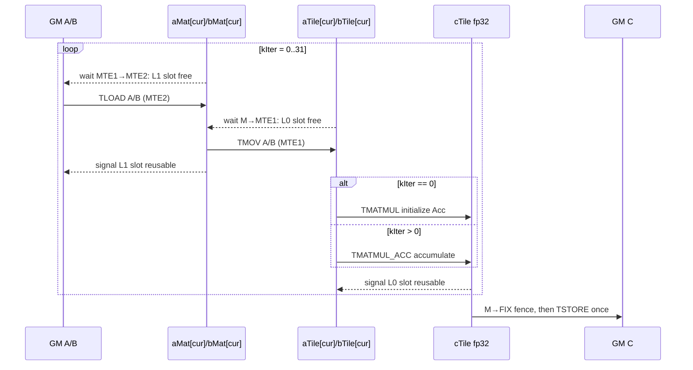

> 本章基于 [`pto-isa@f51c92f6`](https://github.com/hw-native-sys/pto-isa/commit/f51c92f610827daad0ddfb383072e03d514b4ae9)。规范与当前代码能直接证明的内容标为“事实”；仓库测试表达的内容标为“测试事实”；涉及真实硬件带宽、指令并发度或下层 verifier 的部分标为“推断/待确认”。本次未在 Ascend 设备上复现实验。

## 本篇在 PTO 课程路线中的位置

前五章已经建立 Tile capacity/valid region、Event、`TPipe` 与 `GlobalTensor` 地址语义。本章第一次把这些零件放进一个真实计算密集 kernel：固定形状的 `gemm_basic_custom`。

今天只选择 `pto-isa`。原因不是上层仓库不重要，而是当前要先钉死 ISA 层最小闭环：

`GM descriptor → L1 Mat Tile → L0 Left/Right Tile → fp32 Acc Tile → GM output`

这条链解释清楚后，后续再看 PyPTO/PTOAS 生成 GEMM，才能判断上层 IR 是否保持了真实设备 contract，而不只是“最后出现了一个 `TMATMUL`”。

## 前置知识

- `GlobalTensor` 只描述 GM 视图，地址由 base、shape、element-stride 与 layout 共同决定。
- Tile 的 capacity 是静态资源盒子，valid region 是本轮计算域；二者都不能被 `TMATMUL` 自动修复。
- Event 表达跨 pipe 的 producer/consumer 依赖。程序顺序不等于设备完成顺序。
- `TileType::Mat`、`Left`、`Right`、`Acc` 是不同存储位置/角色，不是同一二维数组的四个名字。

## 今日两个紧密相连的核心问题

1. `TMATMUL` 对 Left、Right、Acc 的 shape、dtype、layout、location 和累加行为究竟承诺什么？
2. 一个 `512×2048 @ 2048×1536` GEMM，如何被 24 个 core 与 32 个 K-slice 分解，并用双缓冲把 `TLOAD → TMOV → TMATMUL → TSTORE` 串起来？

## PTO 全栈中的位置

```mermaid
flowchart LR
    PY["test.py: torch.ops.npu.pto_gemm_basic"] --> HOST["run_gemm_basic_custom: validate + launch 24 cores"]
    HOST --> GM["A ND [512,2048] / B DN [1536,2048]"]
    GM -->|"TLOAD · PIPE_MTE2"| MAT["L1 Mat A/B · ping-pong"]
    MAT -->|"TMOV · PIPE_MTE1"| L0["L0A Left / L0B Right · ping-pong"]
    L0 -->|"TMATMUL then 31×TMATMUL_ACC · PIPE_M"| ACC["L0C Acc fp32 [128,256]"]
    ACC -->|"TSTORE · PIPE_FIX"| OUT["C ND fp32 [512,1536]"]
    OUT --> GOLD["torch.matmul(a.float(), b.float())"]
```



上游 Host 负责 tensor ABI 与 core 数；kernel 负责 core/tile 映射和事件；`TMATMUL` 只消费已正确放入 L0A/L0B 的 Tile；测试负责结果 oracle。任何一层都不能用“矩阵维度看起来对”替代下一层的 layout/location 约束。

## 概念和精确语义

### `TMATMUL` 计算什么

规范 [`TMATMUL.md`](https://github.com/hw-native-sys/pto-isa/blob/f51c92f610827daad0ddfb383072e03d514b4ae9/docs/isa/TMATMUL.md) 定义：

\[
C_{i,j}=\sum_{k=0}^{K-1}A_{i,k}B_{k,j},
\quad M=A.validRows,\ K=A.validCols,\ N=B.validCols
\]

输入输出 contract 为：

| 对象 | 本例类型与 shape | 位置/布局职责 | 生命周期 |
| --- | --- | --- | --- |
| `aTile` | `half [128,64]` | `TileType::Left`，L0A | 两槽交替，MMAD 完成后复用 |
| `bTile` | `half [64,256]` | `TileType::Right`，L0B | 两槽交替，MMAD 完成后复用 |
| `cTile` | `float [128,256]` | `TileType::Acc`，L0C | 一个 core 的 32 个 K-slice 全程持有 |
| result | `float [128,256]` | Acc 经 FIX pipe 转为 ND GM | K 循环结束后一次写回 |

A2/A3 当前支持 `(int8,int8→int32)`、`(half,half→float)`、`(bf16,bf16→float)`、`(float,float→float)`；运行时 `M/K/N` 必须在 `[1,4095]`。不允许隐式 broadcast、reshape，也不允许 A 的 K 与 B 的 K 不一致后“取较小值”。

这里需要把四种常被混用的属性拆开：logical shape 决定矩阵数学；valid shape 决定本次 MMAD 的 `M/K/N`；capacity shape 决定 Tile 能否容纳该区域；location/layout 决定元素在 CA/CB/CC 中怎样寻址。只有前两项相等仍不够。例如一个普通 `TileType::Mat [128,64]` 即使数值与 A 完全一致，也不能直接冒充 `TileLeft [128,64]`，因为 `mad` 最终取得的是 `__ca__` pointer；同理 fp32 `[128,256]` 的 Vec Tile 不能当 Acc，因为 FIX pipe 与 CC 的读写规则不同。

本例的 L1 A Mat 使用 `BLayout::ColMajor + SLayout::RowMajor`，L1 B Mat 使用 `BLayout::RowMajor + SLayout::ColMajor`。名字看似交叉，实际描述不同层级的盒化顺序；随后 `TMOV` 把它们搬入 `TileLeft` 和 `TileRight` 的目标 fractal。课程当前只确认这条类型链是 kernel 的代码事实，尚未在本章展开每个 C0 小块的 offset 公式。维护时不能为了“统一模板”随意交换 A/B 的 BLayout 或 SLayout，即使 CPU 上的二维打印结果仍然相同。

### `TMATMUL` 与 `TMATMUL_ACC` 不是同义词

当前 A2/A3 实现 [`TMatmul.hpp`](https://github.com/hw-native-sys/pto-isa/blob/f51c92f610827daad0ddfb383072e03d514b4ae9/include/pto/npu/a2a3/TMatmul.hpp#L157-L187) 最终调用 `mad`。`TMATMUL` 传入 `cmatrixInitVal=true`，为本次输出建立初始 Acc；`TMATMUL_ACC` 传入 `cmatrixInitVal=false`，把旧 Acc 作为输入继续累加。

因此真实 K 分块必须写成：

```cpp
if (kIter == 0)
    TMATMUL(cTile, aTile[cur], bTile[cur]);
else
    TMATMUL_ACC(cTile, cTile, aTile[cur], bTile[cur]);
```

如果 32 轮都使用 `TMATMUL`，最终只剩最后 64 个 K 元素的部分积；如果第一轮错误使用 `_ACC`，结果会依赖未初始化 L0C。这里的“首轮初始化、后续累加”是 correctness invariant，而不是性能提示。

把接口写成可审查的 contract：输入 Left/Right Tile 只读，输出 Acc Tile 可写；三者必须在同一 AICore 的相应本地 memory space 内有效。调用前，MTE1 已经完成从 L1 到 L0A/L0B 的转换，且上一次使用同一 ping-pong slot 的 MMAD 已结束。调用后，只能认为 Acc 的有效区域更新完成；与本次无关的 Tile 流量不会被隐式 fence。`TMATMUL_ACC(cOut,cIn,a,b)` 还要求 `cIn` 在整个调用期间可读，in-place 便利重载只是把二者绑定到同一 Tile。失败方式分成编译期不支持的 dtype/location、运行时超出 `[1,4095]` 的 assertion，以及目前尚不明确由哪层拒绝的 shape/layout mismatch。

它也有固定地址含义：手工模式下 `TASSIGN` 绑定的 L0A/L0B/L0C 地址在 MMAD 完成前不能被别的对象覆盖。代码的 C++ 生命周期并不能保护设备生命周期——局部对象仍然存在，不代表异步 pipe 已读完它的 backing storage。正因为如此，反向 `PIPE_M→PIPE_MTE1` event 是所有权归还信号，而不是多余的性能同步。

## 真实文件、类型和 API 逐段解读

### Host ABI：逻辑 B 与物理 B 不能混淆

[`run_gemm_basic_custom`](https://github.com/hw-native-sys/pto-isa/blob/f51c92f610827daad0ddfb383072e03d514b4ae9/demos/baseline/gemm_basic/csrc/host/my_gemm_basic.cpp#L25-L47) 要求：

- `a`: NPU、contiguous、fp16、shape `[512,2048]`；
- `b_dn`: NPU、contiguous、fp16、shape `[1536,2048]`；
- 输出：fp32 `[512,1536]`；
- `blockDim=24`。

逻辑 B 是 `[K,N]=[2048,1536]`，但调用方先执行 `b.t().contiguous()`，把物理存储变成 `[N,K]`。kernel 再用 `Layout::DN` 的 `GlobalTensor` 把该存储解释回 `K×N` 计算域。这不是普通 PyTorch transpose view：host 明确要求 contiguous，从而把 B 的 K 方向做成物理连续输入。

### core 映射：24 个 core 正好覆盖 4×6 输出网格

[`runGEMMBASIC`](https://github.com/hw-native-sys/pto-isa/blob/f51c92f610827daad0ddfb383072e03d514b4ae9/demos/baseline/gemm_basic/csrc/kernel/gemm_basic_custom.cpp#L77-L135) 使用：

```text
mIter = 512/128 = 4
nIter = 1536/256 = 6
mTileIndex = blockIdx % 4
nTileIndex = blockIdx / 4
```

所以 block 0–3 覆盖第一个 N tile 的四个 M tile，block 4–7 覆盖第二个 N tile，直到 block 23。每个 core 独占一个 `C[128,256]` 区域，没有跨 core reduction，也无需对 C 做原子写。

以 `blockIdx=9` 为例，三个基址偏移能直接由代码验算：A 偏移是 `1×128×2048=262144` 个 half，即 512 KiB；B 偏移是 `2×2048×256=1048576` 个 half，即 2 MiB；C 偏移是 `1×128×1536+2×256=197120` 个 float，即 788480 B。之后每个 `kIter` 都在 A/B descriptor 的当前 base 上增加 64 个元素。对 A，这表示向该行块的 K 方向移动；对 DN B，64 也是转置存储中连续的 K-slice 起点。若 host 只传 transpose view 而没有 contiguous，`+64` 就不再代表 kernel 假设的下一段连续物理数据。

这种映射还解释了为什么本 basic kernel 没有任务队列：全局输出网格恰好是 24 个 tile，等于 launch 的 24 个 core，每个 core 只做一个 tile 就退出。对更大矩阵，若仍固定 24 core，就需要 core 循环领取多个输出 tile；PR #132 的 persistent scheduler 正是在上层补上这一层，而不是改变 `TMATMUL` 的单 Tile 语义。

### 为什么先到 Mat，再到 Left/Right

[`ProcessKIteration`](https://github.com/hw-native-sys/pto-isa/blob/f51c92f610827daad0ddfb383072e03d514b4ae9/demos/baseline/gemm_basic/csrc/kernel/gemm_basic_custom.cpp#L32-L73) 没有直接 `TLOAD(aTile, gmA)`。GM 数据先进入 L1 `TileType::Mat`，再通过 `TMOV` 进入 L0A `Left` 与 L0B `Right`。这是两级存储与格式转换边界：

```text
GM ND/DN --TLOAD--> L1 Mat layout --TMOV--> L0A/L0B fractal --mad--> L0C
```

把 Mat、Left、Right 合并成一个抽象虽然代码更短，却会掩盖 L1 容量、MTE1 转换和 Cube operand layout，导致无法表达双缓冲与反向复用依赖。

## Tile/Buffer 生命周期



L1 和 L0A/L0B 都是 ping-pong；`cur=kIter%2`。正向依赖保证 load 完成后才能 move、move 完成后才能 mad；反向依赖保证 mad 读完 L0 slot、move 读完 L1 slot后，下一轮才能覆盖。循环结束还有四个 wait drain 两套 buffer，再以 `PIPE_M→PIPE_FIX` 保证 Acc 完成后写回。

数值地址可以重叠，因为 L1、L0A、L0B、L0C 是不同 memory space。L1 内部实际占用：

- 两个 A Mat：`2×128×64×2B = 32 KiB`；
- 两个 B Mat：`2×64×256×2B = 64 KiB`；
- 合计 `96 KiB`。

L0A 两槽为 32 KiB，L0B 两槽为 64 KiB；单个 fp32 Acc 为 `128×256×4B = 128 KiB`。这些是代码 shape 推导出的逻辑 footprint；公开代码不足以证明实际物理 bank 分配和可用容量余量。

用前三轮可以看清双缓冲为何同时需要两组方向相反的 event。初始化时，代码先向 MTE2 声明 L1 slot 0/1 可写，也向 MTE1 声明 L0 slot 0/1 可写。`k=0` 使用 slot 0：load 填 L1[0]，move 填 L0[0]，MMAD 读 L0[0] 并初始化 Acc。`k=1` 转到 slot 1，理论上可与 slot 0 的后半段重叠。`k=2` 再回 slot 0 前，必须等到上一轮 move 已读完 L1[0]，也必须等 MMAD 已读完 L0[0]；缺少任意一条反向边都会把尚在途的数据覆盖掉。

循环末尾的 drain 同样属于 correctness：最后两个 slot 不会再有下一轮顺便等待它们。如果直接进入 `TSTORE`，FIX pipe 可能在最后一次 MMAD 尚未完成时读取 Acc。四个 slot wait 加一条 `M→FIX` fence，分别关闭 buffer 复用生命周期与最终结果生命周期，不能用一个笼统的全局 barrier 描述它们。

## 具体 shape、Tile 和状态演算

全局 GEMM 为：

```text
A: [512,2048] fp16 ND
B logical: [2048,1536] fp16
B storage: [1536,2048] fp16 DN
C: [512,1536] fp32 ND
```

取 `blockIdx=9`：

```text
mTileIndex = 9 % 4 = 1  → M range [128,256)
nTileIndex = 9 / 4 = 2  → N range [512,768)
```

该 core 固定拥有 `C[128:256,512:768]`。K 方向 `2048/64=32` 轮：第 0 轮读取 `A[:,0:64]` 与 `B[0:64,:]`，生成 fp32 Acc；第 1 轮读取 `[64:128]` 并累加，直到第 31 轮 `[1984:2048]`。最终一次 `TSTORE` 写出完整 `128×256`。

从一个输出元素看，`C[130,520]` 归 block 9，落在 local Acc 坐标 `(2,8)`。第 r 轮只贡献：

\[
partial_r=\sum_{q=0}^{63}A[130,64r+q]B[64r+q,520]
\]

最终 `cTile[2,8]=partial_0+…+partial_{31}`。A/B ping-pong Tile 每轮失效并复用，Acc 坐标 `(2,8)` 却跨 32 轮保持同一逻辑值。这是本章最关键的对象生命周期：输入 Tile 是流式窗口，Acc 是跨窗口状态。

从释放时机看，A/B 的某个 slot 在对应 MMAD 发出并完成读取后即可归还给 MTE1；L1 slot 在对应 `TMOV` 完成读取后即可归还给 MTE2。Acc 则直到全部 32 轮和最终 FIX store 完成后才可复用。三类 Tile 的“最后消费者”不同，因此不能用统一的循环迭代结束作为释放条件。这个 owner/consumer 关系正是后续自动调度器生成 event 时必须恢复的信息。

单轮搬运有效载荷是 A 16 KiB、B 32 KiB，计算量为 `2×128×64×256=4,194,304 FLOPs`；32 轮每 core 为约 134.2 MFLOPs，全 kernel 为约 3.22 GFLOPs。若暂不计 cache reuse，24 个 core 合计请求 A/B/C 约 39 MiB，算术强度约 79 FLOP/byte。**这是静态流量上界模型，不是设备实测**；L2 命中、DMA 对齐开销和实际 pipe overlap 需要 profiler 才能确认。

## 为什么这样设计及替代方案

第一性原理约束有三个：L0 容不下完整 K=2048 的 A/B operand；每个输出元素必须累加全部 K；GM、L1、L0A/B/C 的可访问格式不同。由此最小可行设计自然是 K 分块、Acc 常驻、两级搬运。

`baseK=64` 同时影响容量、同步次数和 Cube 利用率：把它减半会让 32 轮变 64 轮，A/B 单槽变小但 event、descriptor 与指令发射翻倍；把它增至 128 会把 A/B 双缓冲扩大到 192 KiB，并要求底层矩阵指令/对齐仍合法。哪个更快不能只由 FLOPs 推出，必须结合 L1/L0 容量、MTE 带宽和 MMAD pipeline 测量。本文保留仓库固定值，不虚构一个“最优 baseK”。

同理，24-core 的 M/N 切分不是普适答案。固定 C tile 为 128×256 时，它只是恰好覆盖 512×1536；如果 N 很小，沿 N 切六份可能不存在，如果 M/N 不整除还需要 tail valid region。硬约束是输出 tile 互斥和资源可容纳，`4×6` 只是本 shape 的策略。

替代一：每个 K-slice 都把部分 C 写回 GM，再下一轮读回。它减少 L0C 长生命周期，却增加 32 次 C 读写和 fp32 reduction traffic，也使同步更复杂。替代二：增大 `baseK`，减少循环与 event；但会线性增加 A/B buffer footprint，可能破坏双缓冲或降低可并发资源。替代三：运行时转置 B；调用更方便，却在热路径增加搬运/转换。本例选择 host 预先提供 DN contiguous B，把转换成本移出 Cube 内循环。

后续合入的 [PTO-DSL GEMM PR #132](https://github.com/hw-native-sys/pto-isa/pull/132) 延续相同的 `128×64×256` 基础块，并加入 persistent scheduler、K panel 和 L2 swizzle。它能证明这套 ISA 分层可被上层生成，但其输出 dtype、调度与 benchmark kernel 不等于本章的 `gemm_basic_custom`，不能直接拿 PR 中的 TFLOPS 当作本 demo 的实测成绩。

## 访存、计算、流水、并行和硬件约束

- 并行：M/N 网格提供 24 个互不写冲突的 output tile；K 不跨 core 分解，避免跨核 reduction。
- 数据复用：A tile 理论上可跨同一 M 的 6 个 N tile 复用，B 可跨 4 个 M tile 复用；本 basic kernel 依赖 cache/调度自然命中，没有显式 L2 swizzle。
- 数值：fp16 输入在 fp32 Acc 中累加，最终保存 fp32，避免每个 K-slice 降回 fp16。
- 流水：双缓冲的价值取决于 MTE2、MTE1、M 的实际重叠；只看到两个数组不能证明 overlap，需要 timeline。
- 边界：固定 shape 全部整除，没有 M/N/K tail；`M/K/N≤4095` 是单条 MMAD valid size，不代表全局矩阵尺寸只能到 4095。
- 特例：A2/A3 wrapper 对非 GEMV 的 `m==1` 会把传给 `mad` 的 M 改成 16；本例 M=128 不受影响，小 M 语义需要独立验证。

## 测试证据与未覆盖风险

[`test.py`](https://github.com/hw-native-sys/pto-isa/blob/f51c92f610827daad0ddfb383072e03d514b4ae9/demos/baseline/gemm_basic/test/test.py#L22-L33) 生成 CPU fp16 随机 A/B，把 `b.t().contiguous()` 送入 NPU，reference 为 `torch.matmul(a.float(), b.float())`，并用 `assertRtolEqual` 比较。这证明测试意图覆盖 DN ABI、fp32 accumulation/output 和完整 24-core 结果；容差没有在本文件中显式写出，而是继承 `torch_npu.testing.TestCase` 默认值。

未覆盖风险：只有一个固定整除 shape；没有 identity/one-hot pattern 定位转置或 tile-offset 错误；没有不同随机 seed 的最大/均方误差记录；没有 host negative tests；没有重复运行验证 event/race；没有 tail valid region；也没有单独验证第一轮 `_ACC` 或后续非 `_ACC` 会失败。

随机 dense input 对整体数值回归有价值，却不善于定位地址错误：A/B 的一块错位仍可能得到“看起来像随机矩阵”的输出，只能看到误差很大。补一个 A 为按行编码、B 为 identity/block-diagonal 的结构化 case，可以让每个 output tile 的来源肉眼可追踪；再在不同 `blockIdx` 边界检查首尾元素，能直接保护 M/N base offset 与 DN K-slice offset。重复 dispatch 则针对 event 未 drain 导致的跨 kernel stale 状态，它与单次 golden 是不同故障模型。

还有一处证据漂移：文档声明静态 shape 必须满足 `A.Rows=C.Rows`、`A.Cols=B.Rows`、`B.Cols=C.Cols`，CPU simulator 的 `CheckMadValid` 有对应 `static_assert`；但当前 A2/A3 `CheckStaticMad` 可见代码只检查 dtype 与 `Left/Right/Acc` location，运行时又只从 A 取 M/K、从 B 取 N。是否由更下层编译器/verifier统一拒绝 shape 不一致，当前公开证据没有闭合。应增加一个 compile-fail 或 verifier test，而不是假设 `mad` 会安全处理。

最小 CI guard 应包含：结构化 A/B pattern 的地址映射测试；多 seed 数值误差统计；重复 dispatch 检查 pipeline 稳定性；非法 role/dtype/shape 的编译失败；以及至少一个非整除 tail kernel，明确 valid region 是 padding 还是 masked compute。

维护这个区域时，改动影响面不能只看 `TMATMUL` 那一行。修改 `baseM/baseK/baseN` 必须同步检查 GlobalTensor valid shape、GM pointer 步长、L1/L0 `TASSIGN` offset、静态容量和 K-loop；修改输入 dtype 会改变每个 slot 的字节数、支持的 accumulator triple、对齐与 golden 容差；修改 output dtype 会影响 L0C、FIX store 和 Host 分配。若把固定 shape 改为动态，还要重新定义 block 数、M/N 尾块 owner、K 尾块的 padding/valid semantics，以及 24 core 不满载时的退出规则。

特别需要避免“只让 CPU-SIM 通过”的修复。CPU 实现以 `GetElement(i,k)` 做数学循环，能够发现 shape 和数值错误，却不模拟 L1/L0 容量、fractal、event hazard 或 `mad` 的 M=1 特例。反过来，设备随机 golden 通过也不能证明非法类型在编译期被拒绝。最低可信证据应同时包含 compile-fail contract、CPU 数学 oracle、设备结构化地址 case 和重复 dispatch pipeline case。

如果后续由 PyPTO/PTOAS 生成同一 kernel，还应把本文数字做成跨层 golden：生成 IR 中的 `baseM/K/N`、buffer offset、32 次 accumulation 和 output tile owner 都要能回溯到上层 schedule。否则代码生成器可能输出数学等价但超过本地容量、缺少反向 event 或误把 DN B 当 ND 的程序。

## 与前后章节的连接

本章把上一章的 ND/DN `GlobalTensor` 真正送进了 Cube，并把第三章 Event 的正反依赖放进双缓冲。下一章会专门拆 `TMOV`：L1 Mat 为什么必须变成 Left/Right fractal、ND/DN/NZ/ZN 转换的合法矩阵和成本在哪里。之后再从 PyPTO/PTOAS 追踪同一 GEMM 如何被 IR 自动生成。

## 本篇结论、知识债与理解检查

核心结论：`TMATMUL` 不是“任意两个二维 Tile 相乘”。它要求已位于 L0A/L0B、角色与格式合法的 Left/Right operand；K 分块时，首轮建立 Acc、后续轮显式累加；Acc 在全部 K-slice 完成前不能释放或写回。

新增知识债：A2/A3 shape equality 的 verifier 证据；`m==1→16` 的真实有效区；L1 Mat→L0 fractal 的精确 offset；basic kernel 的真实 pipe overlap 和 L2 reuse。

三个检查问题：

1. 为什么 `b.t()` 还不够，host 必须要求 `b.t().contiguous()`？
2. 如果把第 0 轮也改为 `TMATMUL_ACC`，错误为什么可能表现为非确定性而非固定偏差？
3. L1 与 L0 Tile 的地址都从 `0x0` 开始，为什么不会覆盖彼此？

## 课程账本增量

- 完成：A2/A3 `TMATMUL/TMATMUL_ACC`、Left/Right/Acc contract、真实 GEMM 的 24-core M/N 网格与 32 轮 K 累加。
- 新不变量：首 K-slice 初始化 Acc、后续 slice 累加；B 的 DN 物理 ABI 由 host 与 kernel共同维护；L1/L0 ping-pong 必须同时具备正向数据依赖与反向复用依赖。
- 下一章：`TMOV` 与 Mat→Left/Right fractal/layout conversion。
