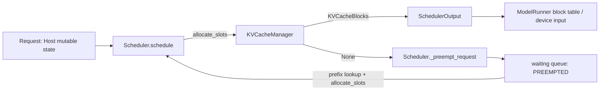
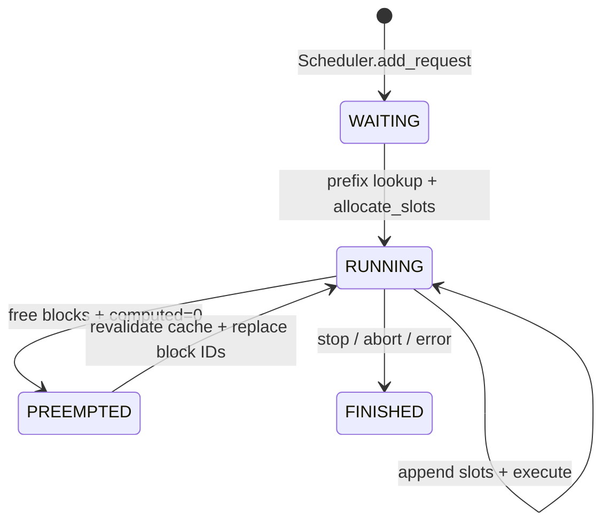

> 本文基于 vLLM `main` 的 [`615d4cfa`](https://github.com/vllm-project/vllm/commit/615d4cfadeb3d5ea1df248eb59aa128af5dbd441)。源码事实均固定到该 commit；性能取舍中未被测试直接验证的部分会标为“推断”。

## 本篇在课程路线中的位置

前两篇已经把 `Request` 从逻辑 admission 追到第一次物理 batch：waiting 请求只有在 `KVCacheManager.allocate_slots()` 成功后才进入 `running`。本篇继续同一条线，只回答一个问题：**running 请求跨过新的 block 边界、申请不到 KV slot 时，Scheduler 如何保证系统继续前进？**

这正是 Scheduler 与 KV Cache Manager 的交界面。我们会追踪 `RUNNING → PREEMPTED → waiting → RUNNING`，直到恢复请求被编码进 `SchedulerOutput`；设备 block table 如何真正替换，留到下一篇 ModelRunner 边界。

## 前置知识回顾

`Request.num_computed_tokens` 表示 Scheduler 认为已经有有效 KV 的连续 token 前缀；`request.num_tokens_with_spec + num_output_placeholders - num_computed_tokens` 是本轮待计算量。KV block 是离散资源，请求即使只 decode 一个 token，也可能因跨过 block 边界而需要一整块新容量。

## 本篇要回答的核心问题

1. allocation 失败时，为何不能简单跳过当前请求？
2. FCFS 与 PRIORITY 分别牺牲谁？本轮已经排进 batch 的 victim 如何回滚？
3. preemption 为什么清零 `num_computed_tokens`，却不删除 token 历史？
4. 恢复时为什么必须告诉 ModelRunner“替换旧 block IDs”，而不是追加？

## 组件在全局架构中的位置



这里没有新的 CUDA tensor。`Request`、`KVCacheBlocks`、block ID 列表、budget 都是 EngineCore 进程内的 Host 状态；`SchedulerOutput` 是传给 Worker/ModelRunner 的执行计划。Scheduler 拥有队列与请求状态，KVCacheManager 拥有 block 引用关系，ModelRunner 拥有设备侧 block table 镜像。

## 完整调用链

在 [`Scheduler.schedule()` running loop](https://github.com/vllm-project/vllm/blob/615d4cfadeb3d5ea1df248eb59aa128af5dbd441/vllm/v1/core/sched/scheduler.py#L520-L695) 中：

```text
running request
  → 计算 num_new_tokens
  → KVCacheManager.allocate_slots(request, num_new_tokens, lookahead)
  → 成功：记入 scheduled_running_reqs / req_to_new_blocks / budget
  → 失败：从 running 选择 victim
       → 若 victim 已在本轮排入 batch，撤销 token/input/encoder/spec/block 计划
       → _preempt_request(victim)
       → 再次尝试 allocate_slots
  → 生成 SchedulerOutput
  → _update_after_schedule() 乐观推进 computed/in-flight 计数
```

失败循环不是“驱逐一次就一定成功”：一个请求可能需要释放多个 victim 才能满足；如果最终牺牲者就是当前请求，代码立即停止，因为 running 中已没有更合适的容量来源。

同一 step 一旦发生 preemption，Scheduler 不再从 waiting 接纳新请求。这是一个重要的稳定性边界：先让已经获得 slot 的 running 工作推进，避免刚释放的 block 又被新 admission 抢走，形成同 step 抖动。

## 关键类型、字段和状态生命周期

[`Request`](https://github.com/vllm-project/vllm/blob/615d4cfadeb3d5ea1df248eb59aa128af5dbd441/vllm/v1/request.py#L48-L150) 始终是同一个 Host 对象。preemption 不重建请求，也不改变 `request_id`：

| 状态 | 保留/改变的字段 | 含义 |
| --- | --- | --- |
| `RUNNING` | `all_token_ids`、当前 blocks、`num_computed_tokens > 0` | token 历史与 KV 前缀一致 |
| `_preempt_request` | free blocks；`status=PREEMPTED`；`num_computed_tokens=0`；清 `spec_token_ids` | 旧 block 映射不再可信 |
| `PREEMPTED` in waiting | token 历史、sampling 状态、priority、计数保留 | 可以重新做 prefix lookup |
| resumed `RUNNING` | 重新设置 cache-hit 进度与 block IDs | 从可证实的有效前缀继续 |

异步调度多一层 fence：`num_in_flight_tokens` 可能仍有尚未回来的输出。[`_preempt_request()`](https://github.com/vllm-project/vllm/blob/615d4cfadeb3d5ea1df248eb59aa128af5dbd441/vllm/v1/core/sched/scheduler.py#L1332-L1374) 把它们记入 `num_stale_output_tokens`，清空 placeholders，并根据 KV delivery 场景设置 `drop_stale_output`。因此 preemption 不是纯队列操作，它还规定了“旧 forward 迟到时能否修改新一轮计数”。



状态与所有权必须分开理解。`PREEMPTED` 是请求的调度状态，不代表请求已结束；`RequestStatus.is_finished()` 不把它视为 terminal。prompt、已确认的 output token、采样参数和请求级统计继续由 `Request` 持有。相反，KV block 的有效性由 coordinator 的引用与 cache hash 共同证明：引用已释放后，即使显存地址里的字节暂时没被覆盖，也不能作为该请求的可读历史。只有重新查 hash、重新取得引用并建立 block mapping 后，那段 KV 才再次进入 contract。

这个区分也解释了为何不能创建一个新 `Request` 代替恢复：新对象会切断 output token、停止条件、优先级、事件统计以及前端 request identity 的连续性。当前实现选择复用请求对象、重建物理执行状态，恰好把“语义身份”和“可回收设备资源”分离开。

## 逐函数源码解读

### 1. `allocate_slots()`：物理容量裁决

[`KVCacheManager.allocate_slots()`](https://github.com/vllm-project/vllm/blob/615d4cfadeb3d5ea1df248eb59aa128af5dbd441/vllm/v1/core/kv_cache_manager.py#L343-L568) 的核心 contract 是：

- 输入：Host `Request`、正整数 `num_new_tokens`、lookahead token 数等；无 tensor shape/dtype/device。
- 前置条件：没有 external computed token 时，`num_new_tokens` 必须大于 0；请求现有 block 关系必须由 coordinator 管理。
- 输出：成功返回按 KV cache group 分组的 `KVCacheBlocks`；容量不足返回 `None`，而非部分成功。
- 后置条件：成功才增加引用并分配新 blocks；失败前允许释放 sliding-window 已跳过的旧 blocks。
- 并发假设：由 EngineCore busy loop 串行修改；不能把返回的 block handles 当设备内容本身。

它先算 `num_tokens_need_slot = min(computed + new + lookahead, max_model_len)`，再比较 `required_blocks` 与 `free_blocks - reserved_blocks`。对 running 请求，waiting/preempted admission 使用的 watermark 不生效；这里解决的是已运行序列的继续前进。

### 2. victim selection：策略优先，不是重算成本最小

FCFS 直接 `self.running.pop()`，即移除 running 顺序尾部。PRIORITY 则取：

```python
max(self.running, key=lambda r: (r.priority, r.arrival_time))
```

vLLM 的数值越小优先级越高，所以 `max` 选择最低优先级；同优先级选更晚到达者。这个规则维护调度语义，却没有考虑 prompt 长度、已算 token 数或实际重算 FLOPs。

更微妙的是，victim 可能已在本轮前半段成功获得新 blocks。PRIORITY 分支必须撤回 `num_scheduled_tokens`、token/input budget、`req_to_new_blocks`、spec token 和 encoder budget。这里具有“Host 侧小事务”性质：如果只移出 running 而不回滚，本轮 `SchedulerOutput` 会同时宣称 victim 被执行和被重置。

为什么 FCFS 分支看起来没有同样长的显式回滚？其 running 顺序与遍历顺序使 `pop()` 通常从尚未在本轮处理的队尾选 victim；PRIORITY 则可以选中遍历光标之前、已经成功调度的任意低优先级请求，因此必须处理撤销。维护者不能把这段差异机械合并成共同 helper，除非 helper 同时知道 victim 是否存在于 `scheduled_running_reqs`、是否消耗 encoder budget，以及删除位置是否位于 `req_index` 之前。否则常见故障不是立刻崩溃，而是下一请求被跳过、预算被重复扣减或 block refcount 到 step 末才泄漏。

这里还有一个明确的后置条件：preemption 循环退出时，只有 `new_blocks is not None` 的当前请求才能进入 `scheduled_running_reqs`。所有 victim 必须已从 `running` 移除并位于 waiting；同一请求不能同时出现在执行计划和重置集合。这个集合互斥关系比队列长度更值得写进测试，因为 async 模式下旧 model output 仍可能包含 victim 的 ID。

### 3. `_preempt_request()`：释放所有权，重置可证明进度

函数依次释放 KV 与 encoder cache、移出 inflight prefill 集合、置 `PREEMPTED`、清零 `num_computed_tokens` 和 speculative tokens，最后 prepend 到 waiting。关键不是“设备字节立刻抹掉”，而是**该请求不再拥有旧 block 引用，Scheduler 不能继续声称这些 KV 有效**。

如果启用 prefix cache，free 后的完整 blocks 仍可能以零引用缓存留在池中，直到被复用/驱逐。恢复阶段再次执行 [prefix lookup](https://github.com/vllm-project/vllm/blob/615d4cfadeb3d5ea1df248eb59aa128af5dbd441/vllm/v1/core/sched/scheduler.py#L802-L878)：命中多少，就重新把 `num_computed_tokens` 建立到多少。因此“recompute preemption”是最坏情况下从 0 重算，不等于每次必然丢失所有历史 KV。

### 4. resume output：替换旧映射

恢复请求仍是同一个 `request_id`，Worker 可能保留它以前的设备元数据。[`CachedRequestData`](https://github.com/vllm-project/vllm/blob/615d4cfadeb3d5ea1df248eb59aa128af5dbd441/vllm/v1/core/sched/output.py#L105-L139) 用 `resumed_req_ids` 明确 contract：普通请求的 `new_block_ids` 是 append；恢复请求的 block IDs 必须 replace。ModelRunner v2 当前把 resumed request 作为完整 `NewRequestData` 下发，v1 则通过 `CachedRequestData` 表达替换语义。二者 wire shape 不同，但不变量相同：旧 block table 不可继续引用。

## 具体示例与 block 状态演算

采用源码测试中的 priority 场景：`block_size=16`，总 block 数 6，其中 1 个是 null block，因此只有 5 个可用。`lo1` 优先级 5，`hi1` 优先级 0；两者 prompt 都是 32 tokens。

| 阶段 | lo1 | hi1 | 已用/可用 | 事件 |
| --- | --- | --- | --- | --- |
| 1 | 32 tokens，2 blocks | 未到达 | 2/5 | lo1 首次运行 |
| 2 | decode 后需要第 3 block | 32 tokens，2 blocks | 5/5 | 两者进入 running |
| 3 | 34 tokens，3 blocks | 33 tokens，下一轮需第 3 block | 5/5 | hi1 allocation 失败 |
| preempt | blocks 被 free，computed=0 | 获得第 3 block | 3/5 | PRIORITY 牺牲 lo1 |
| resume | prefix lookup 后重新分配 | 继续/完成 | 取决于命中 | lo1 从 waiting 恢复 |

注意 victim 不是“当前申请失败的 hi1”，而是优先级更低的 lo1。测试 [`test_priority_scheduling_preemption`](https://github.com/vllm-project/vllm/blob/615d4cfadeb3d5ea1df248eb59aa128af5dbd441/tests/v1/core/test_scheduler.py#L2770-L2866) 正是按这组数字验证状态。

## 为什么这样设计及替代方案

从约束出发：一次 forward 若没有完整 slot 映射就不能执行；当所有 running 序列都卡在 block 边界时，单纯“本轮跳过”可能让无人前进到完成并释放内存。系统必须让出容量。

当前方案释放 victim 的 KV 引用并允许重算，优点是容量回收立即、没有 CPU swap 协议和 D2H/H2D 带宽、Host/Device 状态较少；代价是被驱逐长 prompt 的算力和尾延迟。prefix cache 能降低代价，但命中不是保证。

替代方案一是 KV swap 到 CPU：保留计算成果，却增加 host memory、传输排队、异步完成/取消协议和图模式同步点。替代方案二是只驱逐尾块：普通 causal attention 后续仍需要历史 K/V，除 sliding-window 已明确越界的 blocks 外，任意局部驱逐都无法保持语义；hybrid KV groups 还要求各组的有效前缀一致。替代方案三是按 `num_computed_tokens × layer/head cost` 选择最便宜 victim，可能减少浪费，但会破坏简单公平性，增加策略计算和饥饿风险。

**基于代码的推断**：FCFS/PRIORITY 当前优化的是调度策略一致性与实现可维护性，而不是最少重算 FLOPs。在长短 prompt 高度混合的服务中，`num_preemptions` 与被驱逐 computed tokens 应成为调优指标；本篇没有 GPU 实验数据，不能声称哪种 policy 的实际吞吐更高。

可以用四个维度比较这些设计。重算的 Host 状态最少、容量回收最快，但增加设备计算；swap 保存计算，却把瓶颈移到 PCIe/内存并扩大取消协议；局部驱逐资源回收最细，却受 attention 语义与 hybrid group 一致性约束；成本感知 victim 可降低平均浪费，却可能让大请求反复成为“太贵而不能驱逐”的特权序列。一个可维护的演进路径应先补可观测性——记录 victim 已计算 token、释放 block、恢复 cache hit 和等待时长——再用真实负载判断策略，而不是先引入复杂打分公式。

正确性触发器也很清楚：如果未来引入 swap 或 partial eviction，`num_computed_tokens=0` 这一重置规则必须同步改变，并给 `SchedulerOutput` 增加能区分“重新采用缓存”“从 host 回迁”“旧 block table 局部保留”的协议。只改 KVCacheManager 而不改 Request 状态和 ModelRunner replace contract，会产生静默读取错误，而不是一个容易定位的 allocation exception。

## 性能、并发、正确性与边界条件

- 性能：一次 preemption 释放 victim 的全部请求级 KV 所有权；浪费上界与 victim 已计算上下文相关，prefix cache 命中可回收一部分。
- 并发：Scheduler 队列由 busy loop 串行修改，但 async ModelRunner 输出可晚到；stale-output 计数是跨 step 正确性协议。
- speculative decode：`spec_token_ids` 被清空，因为这些 token 尚未最终验证，不能跨重置继续消费。
- connector：pending KV hand-off 下旧 blocks 被 free 后不再有效，`drop_stale_output` 防止迟到输出污染恢复状态。
- graphability：选择与回滚发生在 Host 调度阶段，不进入 CUDA Graph；但 batch/blocks 改变会影响下游可复用的图 bucket。
- 失败方式：若当前请求成为最后 victim，`new_blocks` 仍为 `None`，本轮停止；调用方必须接受它仍在 waiting，而不能假定 running 请求每轮必被调度。

## 测试证据与未覆盖风险

[`test_kv_connector_handles_preemption`](https://github.com/vllm-project/vllm/blob/615d4cfadeb3d5ea1df248eb59aa128af5dbd441/tests/v1/core/test_scheduler.py#L2206-L2368) 用 6 个可用 blocks、两个请求和 block size 2 触发第三次 decode 的新 block 分配；它断言一 running/一 waiting，survivor 结束后内存全部释放，victim 以 local+remote cache hit 恢复，并同时覆盖 sync/async、ModelRunner v1/v2、encoder connector 开关。v2 恢复走 `scheduled_new_reqs`，v1 走 `scheduled_cached_reqs`。

[`test_priority_scheduling_preemption`](https://github.com/vllm-project/vllm/blob/615d4cfadeb3d5ea1df248eb59aa128af5dbd441/tests/v1/core/test_scheduler.py#L2770-L2866) 验证低优先级 victim；相关修复 commit [`17b72fd1`](https://github.com/vllm-project/vllm/commit/17b72fd1) 恢复了该回归保护。异步调度与 preemption 的历史修复 [`949cb017`](https://github.com/vllm-project/vllm/commit/949cb017) 说明 stale output/恢复 token 并非理论边角。

这些是“测试代码事实”，本次没有在 GPU 上复现实验。仍缺最小 CI guard：同 step 已调度 victim 的 encoder/spec/token budget 全量回滚；同优先级 arrival-time victim；连续多 victim 后无 block/refcount 泄漏；prefix cache 被竞争驱逐时从零恢复的端到端输出等价性；async + PP + preemption 的迟到输出乱序。

最小的回归断言不应只检查 `len(running)`。至少应在 preemption step 同时断言：victim 不在 `num_scheduled_tokens`，survivor 的 budget 与 block IDs 正确，victim 的 `status/num_computed_tokens/spec_token_ids` 已重置，waiting 与 running 集合不相交；在所有请求完成后，coordinator 的 request→block 映射为空且除 null block 外全部可用。这样才能分别保护“计划原子性”和“最终无泄漏”两个不变量。

## 与前后章节的连接

上一章证明 waiting admission 的成功边界；本章证明 running continuation 同样受 `allocate_slots()` 约束，并补齐资源不足时的状态闭环。下一章将沿 `SchedulerOutput.scheduled_cached_reqs / scheduled_new_reqs` 进入 ModelRunner，观察 `resumed_req_ids` 如何替换 block table、构造 slot mapping 并写入设备 input buffer。

## 本篇结论、知识债与理解检查

核心不变量只有一句：**preempt 后 token 历史仍属于请求，但旧 KV block 映射不再属于请求；恢复进度只能由重新确认的 local/external cache hit 建立。**

新增知识债：victim 策略没有重算成本模型；async stale-output 与 PP/MTP 组合边界仍需端到端验证；ModelRunner v1/v2 对 resumed request 的设备状态清理尚未下钻。

三个检查问题：

1. 为什么把 `num_computed_tokens` 保持为旧值、只换 block IDs 会破坏正确性？
2. PRIORITY 分支为何必须回滚一个“本轮已调度”的 victim 的预算和 spec/encoder 元数据？
3. prefix cache 命中时，为什么仍然称这种机制为 recompute preemption，而不是 swap？

## 课程账本增量

- 完成：`Scheduler.schedule` running loop、`allocate_slots(None)`、FCFS/PRIORITY victim、`_preempt_request`、resume output contract。
- 新不变量：preemption 释放 KV 所有权但保留 token 历史；恢复请求必须替换旧 block IDs；发生 preemption 的 step 不再 admission waiting 请求。
- 下一章：`SchedulerOutput → ModelRunner` 的 block table、slot mapping 与设备 input buffer 生命周期。
