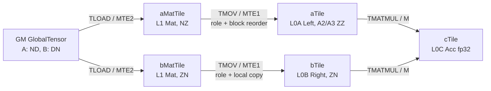
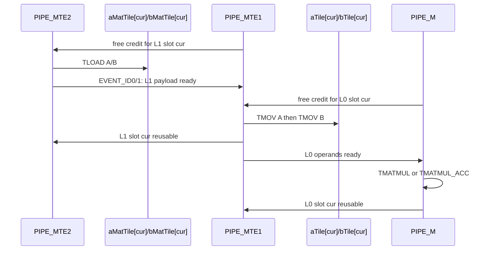

> 本章基于 [`pto-isa@f51c92f6`](https://github.com/hw-native-sys/pto-isa/commit/f51c92f610827daad0ddfb383072e03d514b4ae9)。代码与规范直接证明的内容标为“事实”，仓库测试表达的内容标为“测试事实”，真实设备吞吐和下层微架构行为标为“推断/待测”。本次未在 Ascend 设备上复现实验。

## 本篇在 PTO 课程路线中的位置

上一章已经沿真实 [`gemm_basic_custom.cpp`](https://github.com/hw-native-sys/pto-isa/blob/f51c92f610827daad0ddfb383072e03d514b4ae9/demos/baseline/gemm_basic/csrc/kernel/gemm_basic_custom.cpp) 走完 `GM → L1 Mat → L0 Left/Right → Acc → GM`，但把中间的两次 `TMOV` 当作一个黑盒。今天只研究 `pto-isa`，补上这个黑盒：为什么 `TLOAD` 已把数据送到 L1，Cube 仍不能直接计算？

本章位于 ISA 第一阶段的“layout、memory location 与硬件映射”。它连接上一章的 `TLOAD` 和 `TMATMUL`，也为下一章的非整除 tail/compact 搬运建立基础。

## 前置知识

- `Tile` 的 `Rows/Cols` 是静态 capacity，`GetValidRow/Col()` 是本次语义域。
- `BLayout` 控制 fractal 外层块顺序，`SLayout` 控制 fractal 内顺序；相同逻辑矩阵可有不同物理 offset。
- A2/A3 的 Cube 输入不是 L1 `Mat`，而是 L0A `Left` 与 L0B `Right`。
- `Event` 表示具体 pipeline 间的 producer/consumer 依赖，不是全核 barrier。

## 今日核心问题

1. `TMOV(Mat→Left/Right)` 究竟保持了什么，又改变了什么？
2. 默认路径和 `TileLeftCompact/TileRightCompact` 对 dynamic valid region 的处理为何不同？

## PTO 全栈中的位置



从第一性原理看，`TMOV` 的工作不是“让数学值变化”，而是满足三个不可省略的物理约束：数据必须进入 Cube 可寻址的 L0A/L0B；地址顺序必须匹配各 operand role；MTE2、MTE1、M 三条 pipeline 的所有权交接必须闭合。若只写 `dst[i,j]=src[i,j]`，只描述了数学不变量，没有描述设备 contract。

## 概念和精确语义

公共入口 [`pto_instr.hpp#L1393-L1399`](https://github.com/hw-native-sys/pto-isa/blob/f51c92f610827daad0ddfb383072e03d514b4ae9/include/pto/common/pto_instr.hpp#L1393-L1399) 先 `TSYNC(events...)`，再分派 `TMOV_IMPL(dst, src)`，最后返回一个 `RecordEvent`。因此传入 event 是前置依赖，返回 event 是后续 consumer 可等待的完成凭据。

对 A2/A3，两参数路径最终进入 [`TMOV_TILE_IMPL`](https://github.com/hw-native-sys/pto-isa/blob/f51c92f610827daad0ddfb383072e03d514b4ae9/include/pto/npu/a2a3/TMov.hpp#L156-L168)。代码事实是：

- source/destination 的静态 `Rows`、`Cols` 必须完全相等；
- 合法 location pair 限于 `Mat→Left/Right/Bias/Scaling`、`Vec→Vec`、`Acc→Mat`；
- `Mat→Left` 分派 `TMovToLeft`，`Mat→Right` 分派 `TMovToRight`；
- 对 Left/Right 路径，代码根据 `SFractal` 是否相同选择所谓 `Transpose` 分支，而不是简单比较 `BLayout`。

最后一点最容易误读：这里的 `Transpose` 是“fractal 内方向是否需要转换”，不是数学上的 `Aᵀ` 或 `Bᵀ`。外层 block 次序仍可由 role-specific MTE1 primitive 改写。

### 接口 contract：调用者真正承诺了什么

| 维度 | A2/A3 `Mat→Left/Right` contract |
| --- | --- |
| 输入 | `src` 是 L1 `Mat` Tile；静态 `Rows/Cols`、dtype、`BLayout/SLayout` 在类型中编码，运行期携带 valid row/col 与已绑定的 L1 地址 |
| 输出 | `dst` 是 L0A `Left` 或 L0B `Right` Tile；有效域内逻辑元素与 source 对应元素相同，物理排列满足目标 role |
| 前置条件 | 静态 source/destination shape 相等；location pair 合法；capacity 与 index 满足 16/C0/fractal 对齐；source 的待消费区域已经由 MTE2 生产完成 |
| 后置条件 | 返回的 `RecordEvent` 代表 MTE1 producer；调用方必须在 `TMATMUL` 前建立 MTE1→M 可见性，并在复用 L0 slot 前等待 M consumer 完成 |
| 所有权 | `TMOV` 不创建或释放 allocation；Tile descriptor/地址由 caller 持有，指令只在绑定的 L1/L0 memory space 间传输 |
| 失败方式 | 静态 shape、location、部分 alignment 违规在编译期 `static_assert`；运行期 index alignment 用 `PTO_ASSERT`；遗漏 event 通常不是友好异常，而是数据竞争或静默错误 |

接口没有承诺两件事。第一，它不保证 invalid 区被清零；非 compact 路径可能搬运整个 capacity，invalid 区内容仍无数学意义。第二，它不保证 source 与 destination 的 runtime valid 自动取交集；这与 `Vec→Vec` 分支显式取两者最小值不同。维护者若把两类分支统一重构，不能把这个差异当成无关细节。

### 哪些组合看似合理、实际非法

- `Mat[128,64] → Left[64,128]` 即使元素总数相同也非法，因为 contract 比较两个静态维度，不做 reshape。
- 把 `Vec` 直接送入 A2/A3 `Left` 不属于 `TMOV_TILE_IMPL` 允许的 location pair；Vec 侧的 ND→NZ 规则属于目标相关的另一条实现语境，不能据文档总标题外推到所有后端。
- half 非 transpose Left 路径若列数不是 16 的倍数，或行数不是 16 的倍数，会触发对齐约束；仅把 valid col 改小不能使不合法 capacity 合法。
- `src.GetValidRow/Col()` 小于 destination valid 时，当前 Left/Right 分支不会替调用方裁剪；即使没有越过 allocation，也可能把未初始化 padding 交给后续 Cube。
- source/destination 数值地址都为 `0x0` 并不代表内存别名：L1、L0A、L0B 是不同地址域。相反，同一 memory space 的同地址 layout-changing move 才需要上层 allocator 明确禁止或证明为 identity。

### A2/A3 的 Left/Right 类型不是同一种布局

[`TileLeft`/`TileRight` alias](https://github.com/hw-native-sys/pto-isa/blob/f51c92f610827daad0ddfb383072e03d514b4ae9/include/pto/common/pto_tile.hpp#L1713-L1745) 给出目标物理类型：

| Tile | location | BLayout | SLayout | half 内层 fractal |
| --- | --- | --- | --- | --- |
| A 的 L1 `Mat` | Mat | ColMajor | RowMajor | 16×16 |
| A 的 L0 `Left`（A2/A3） | Left | RowMajor | RowMajor | 16×16 |
| B 的 L1 `Mat` | Mat | RowMajor | ColMajor | 16×16 |
| B 的 L0 `Right` | Right | RowMajor | ColMajor | 16×16 |

A 的数学坐标不变，但外层 fractal 从 NZ 变为 A2/A3 `Left` 所需的 ZZ；B 的 source/destination 布局相同，但仍跨越 L1→L0B memory space。于是 `TMOV(aTile,aMatTile)` 是“搬运+外层块重排”，`TMOV(bTile,bMatTile)` 更接近“保布局搬运”。两者都不是可删的同地址 copy。

## 真实文件与函数逐段解读

### 1. `TMovToLeft` / `TMovToRight`

[`tmov_common.hpp`](https://github.com/hw-native-sys/pto-isa/blob/f51c92f610827daad0ddfb383072e03d514b4ae9/include/pto/common/arch/memory/tmov_common.hpp#L31-L77) 的决策树有两个维度：

```text
SFractal 相同？  ── 是 → 非 transpose 提取
                  └─ 否 → transpose 提取
Compact == Normal？── 是 → 用 runtime valid/aligned extent
                    └─ 否 → 用静态 Rows/Cols extent
```

普通 `TileLeft` 的 `CompactMode` 是 `Null`，所以进入 [`TExtractToA`](https://github.com/hw-native-sys/pto-isa/blob/f51c92f610827daad0ddfb383072e03d514b4ae9/include/pto/common/arch/memory/textract_common.hpp#L63-L97)；`TileLeftCompact` 才进入 `TExtractToACompact`。Right 对应 `TExtractToB`/`TExtractToBCompact`。

这意味着：默认非 compact 版本的 MTE1 transfer geometry 由静态 capacity 实例化；dynamic valid 只约束后续数学语义，并不会自动让本次搬运缩短。compact 版本才把 `dst.GetValidRow/Col()` 传入底层，按对齐后的有效范围搬运。

“compact”在这里不是把 Tile 变成任意紧凑数组。它仍必须按 Cube 的最小 block 对齐，只是把 transfer geometry 从完整 capacity 缩到由 runtime valid 推导的对齐包络。例如 capacity 为 `128×64`、valid 为 `113×48` 的 half Left Tile，语义域只有 5424 个元素；普通路径仍按 `128×64` 的静态盒子组织 MTE1，而 compact 路径把有效边界传给 `TExtractToACompact`，再由 `GetKAligned()` 等约束形成硬件可搬运的矩形。具体会减少多少指令和字节，必须看底层对齐后的 extent，不能简单按 `113×48×2B` 计算。

### 2. 合法性与对齐

half 的 `C0=32B/2B=16`。非 transpose `TExtractToA` 要求 source/destination 行数是 16 的倍数、列数是 C0 的倍数；`TExtractToB` 则要求行数是 C0 的倍数、列数是 16 的倍数。transpose 分支对 half 要求两个维度都按 16 对齐；int8 的对应 fractal size 是 32。

注意当前 `TMOV_TILE_IMPL` 只比较静态 shape；Left/Right 分支直接采用 destination valid extent，未显式断言 source valid 至少覆盖 destination valid。因此“source 对应区域已初始化”是调用方必须保持的不变量，而不是该 API 自动修复的后置条件。

## Tile 生命周期与真实指令链



真实 [`ProcessKIteration`](https://github.com/hw-native-sys/pto-isa/blob/f51c92f610827daad0ddfb383072e03d514b4ae9/demos/baseline/gemm_basic/csrc/kernel/gemm_basic_custom.cpp#L31-L73) 使用两组 L1 和两组 L0 ping-pong slot。对象由 `runGEMMBASIC` 创建并绑定地址；本轮 `TLOAD` 成为 L1 producer，`TMOV` 消费 L1、生产 L0；`TMATMUL` 消费 L0。反向 event 只有在 consumer 完成后才允许 producer 覆盖旧 slot。函数退出前 drain 四个反向 event，随后才让 `TSTORE` 消费常驻 L0C 的 `cTile`。

## 具体 shape、fractal 与 offset 演算

真实 kernel 使用 `baseM=128`、`baseK=64`、`baseN=256`、dtype=`half`。

- 每个 fractal：`16×16×2B=512B`。
- A Tile：`128×64`，共 `8×4=32` 个 fractal，16 KiB。
- B Tile：`64×256`，共 `4×16=64` 个 fractal，32 KiB。
- `kLoop=2048/64=32`，每个输出 core 的 TMOV payload 为 `32×(16+32) KiB=1.5 MiB`。
- 输出网格为 `(512/128)×(1536/256)=24` 个 core；忽略缓存复用，仅按指令 payload 计，整个 kernel 的 L1→L0 搬运量是 36 MiB。这是代码可推导的请求量，不是实测带宽。

取 A 的逻辑元素 `(r=17,c=18)`。[`GetTileElementOffsetSubfractals`](https://github.com/hw-native-sys/pto-isa/blob/f51c92f610827daad0ddfb383072e03d514b4ae9/include/pto/cpu/tile_offsets.hpp#L29-L50) 给出可检查的布局公式：

- L1 A 是 NZ：`offset = blockC×Rows×16 + blockR×256 + innerR×16 + innerC = 2322`；
- A2/A3 L0A Left 是 ZZ：`offset = blockR×Cols×16 + blockC×256 + innerR×16 + innerC = 1298`。

逻辑值未变，物理 element offset 已变。B 的 L1 Mat 与 L0B Right 都是 ZN，同一坐标 `(17,18)` 的 offset 都为 4385；它需要跨 memory space 搬运，但不需要改变 layout。

再把 A 的 32 个 fractal 编号展开，就能看到“外层重排”的本质。L1 NZ 先走 `blockC`，一个 K 方向 block 跨越全部 8 个 M blocks；L0A ZZ 先走 `blockR`，一个 M block 内连续放置 4 个 K blocks。于是 source 的 fractal 序号可写成 `src_f = blockC×8 + blockR`，destination 是 `dst_f = blockR×4 + blockC`。对 `(17,18)`，`blockR=1, blockC=1`，source fractal 号为 9，destination fractal 号为 5；fractal 内 `(1,2)` 不变。这也解释了为什么代码只用 `SFractal` 决定是否需要 inner transpose：此例内层都是 RowMajor，变化发生在 role-specific 的外层 block routing。

以一次 `kIter` 为单位，状态变化可以写成：

1. `aMatTile[cur]`、`bMatTile[cur]` 在等待反向 free credit 后被 MTE2 覆盖，所有权从“可写空槽”转为“L1 payload in flight”。
2. 两个 MTE2 event 分别完成后，MTE1 才可读取对应 Tile。A、B 的 event 分开，避免慢的一侧阻塞另一侧的准备，但同一 MTE1 最终仍顺序发射两次 `TMOV`。
3. 两个目标 L0 slot 必须先收到来自 M pipeline 的复用许可，否则新一轮 `TMOV` 会覆盖上一轮仍在计算的 operand。
4. `TMOV` 完成后，L1 slot 可归还 MTE2；L0 payload 则进入“只读、等待 M 消费”状态。
5. `TMATMUL(_ACC)` 完成后才归还 L0 slot。`cTile` 不随每轮释放，而是跨 32 个 K slices 保持 Acc ownership。

这个生命周期比“先 load，再 copy，再 matmul”更重要：任何将两次 `TMOV` 合并、换序或异步化的优化，都必须重新证明四条 ownership 边，而不是只比较最终数值。

## 为什么这样设计，以及替代方案

当前分层让 GM/L1 loading、L1/L0 adaptation、Cube compute 分属 MTE2、MTE1、M，可以用 ping-pong 隐藏不同阶段的服务时间；同一 L1 Tile 也可作为更通用的 staging 表示。

替代方案一是让 `TLOAD` 直接产出 Left/Right。它可减少显式中间状态，但前提是硬件存在 GM→L0 的等价路径；同时会把 GM stride/layout、L0 role 与 load 指令耦合，削弱 L1 复用和三段流水。当前代码没有这样的 A2/A3 GEMM 路径证据。

替代方案二是 GM 永久保存成与 L0 完全一致的 fractal。它可能减少部分重排，却把模型权重格式绑定到代际和 operand role；A 作为 Left 与作为其他消费者时需要多份副本或额外转换。是否值得，必须比较“减少的 MTE1 时间”与“新增 GM 容量、格式转换、可移植性成本”，不能仅凭少一条 API 判定。

## 性能、流水与硬件约束

- A/B 两次 `TMOV` 共用 MTE1，彼此串行；它们可与别的 ping-pong slot 上的 MTE2/M 工作重叠。
- 默认非 compact 路径按 capacity 搬运。tail 很小时，固定搬运量会放大；compact 路径以更多控制和对齐计算换取更少 payload。
- `TMOV` 的 source/destination 地址必须属于不同 memory spaces；数值上都可为 `0x0`，不能据此认为别名。
- `TSYNC(events...)` 会在发射前消费依赖；遗漏 MTE2→MTE1 是读未完成 L1，遗漏 M→MTE1 是覆盖仍被 Cube 使用的 L0。
- 上述 36 MiB 只说明流量预算。真实瓶颈是否为 MTE1，需设备 trace 同时比较 MTE1 busy、M stall、MTE2 overlap 与 kernel wall time。

### 什么时候值得切换 compact 或改写 pipeline

判断依据应从端到端约束反推，而不是规定一个固定 tail 比例。设非 compact 每轮请求字节为 `Bcap`，compact 对齐后为 `Bvalid`，底层多出的控制/发射成本为 `Tctl`，MTE1 有效带宽为 `BWmte1`。只有当 `(Bcap-Bvalid)/BWmte1` 大于 `Tctl`，并且这段节省没有被 M pipeline 完全隐藏时，compact 才可能降低 kernel wall time。若 MTE1 已被 TMATMUL 覆盖，局部搬运更少也可能没有端到端收益；若 tail 导致 M 等待 MTE1，则收益会直接反映在 stall 上。

最小验证应选同一 capacity、同一数学 valid 的普通/compact 两个 kernel，保持 core 数、K-loop、GM 输入和 event 图一致，记录 MTE1 请求量、M 等待时间、总时延与输出误差。再跨三个边界点：恰好整 fractal、只多一个元素、接近下一对齐边界。这样可以区分“节省 payload”“改变发射次数”和“等待关系变化”。如果测试只比较平均吞吐，可能被 core 间负载或 cache 热度掩盖；应同时保留单 core trace。

对重构还有一个明确的回看触发器：一旦 Tile alias、`CompactMode` 默认值、MTE1 intrinsic 或 `TMATMUL` 的 operand layout contract 改变，就必须重新审计本文结论。特别是 A5 与 A2/A3 的 `TileLeft` alias 不同，不能把某一代的优选 layout 抽成无条件公共常量。

从容量预算看也不能只计算 `Rows×Cols×sizeof(T)`。ping-pong 同时保留两份 L1 A、两份 L1 B、两份 L0A、两份 L0B，再叠加常驻 L0C；优化若把 compact tail 换成更多特化 Tile，可能降低单轮搬运，却增加代码版本、编译时间和调度选择成本。正确决策是先确认目标 workload 的 tail 分布，再用同一组 shape bucket 比较可节省的 MTE1 时间与新增特化成本。没有 workload 证据时，保持 full-tile 主路径简单、为明确 tail 提供独立 compact 路径，比让一个模板隐式猜测更容易验证和维护。

此外，性能回归门槛应绑定到调用链而不是单条指令：同一数学 GEMM 必须同时报告端到端时延、有效 FLOPS、各 pipeline stall 和峰值片上占用。只有 MTE1 节省能穿透 overlap 并改善目标指标时，才说明修改真正有价值；否则它只是局部计数更好看。

## 测试证据与未覆盖风险

A2/A3 [`tmov` device ST kernel](https://github.com/hw-native-sys/pto-isa/blob/f51c92f610827daad0ddfb383072e03d514b4ae9/tests/npu/a2a3/src/st/testcase/tmov/tmov_kernel.cpp#L80-L156) 确实执行 `TLOAD A/B → TMOV Left/Right → TMATMUL_BIAS → TSTORE`。例如 case 1 使用 half A/B、`M=64,N=32,K=80`、B transposed storage；host test 将输出与 NumPy matmul+bias golden 以 `0.001` 阈值比较。这证明整条设备链对这些 shape 的最终数学结果成立。

CPU-SIM [`TMOV` test](https://github.com/hw-native-sys/pto-isa/blob/f51c92f610827daad0ddfb383072e03d514b4ae9/tests/cpu/st/testcase/tmov/main.cpp) 覆盖多种 layout 和 partial valid region，并做 exact compare。但 [`cpu/TMov.hpp`](https://github.com/hw-native-sys/pto-isa/blob/f51c92f610827daad0ddfb383072e03d514b4ae9/include/pto/cpu/TMov.hpp#L20-L34) 是逐逻辑元素 `GetElement/SetElement`；而 CPU-SIM 下 `TileLeft` alias 采用 ColMajor 外层布局，与 A2/A3 设备 alias 不同。因此 CPU-SIM 是数学语义证据，不是 MTE1 block order、对齐或性能证据。

最小 CI guard 应新增一个 A2/A3 isolated layout test：用唯一递增值填充 L1 `Mat`，分别 `TMOV` 到 Left/Right，再按目标物理 offset 导出或由最小 Cube probe 消费；覆盖 full capacity、dynamic tail、compact/non-compact，并用 poison 填充 invalid 区。现有端到端 matmul 可能把两个相互抵消的 layout 错误一起放过，也无法断言默认路径是否意外读取了越界 allocation。

证据等级也要分清：规范与模板分派能证明“应当走哪条路径”；CPU-SIM 能证明逻辑坐标保持；device ST 能证明若干组合的端到端结果；但三者都没有给出 MTE1 字节级 trace，也没有测 compact 对 tail 的真实吞吐收益。本文的流量计算是静态请求量，不能替代 profiler。近期 [`5e98634a`](https://github.com/hw-native-sys/pto-isa/commit/5e98634aadfef35468b9bf8ae96fe8e2d531973c) 为 A5 增加 ND→ZN SIMD 支持，说明 `TMOV` 的合法矩阵仍在按架构演进；这项 A5 变更不能反向证明 A2/A3 具有相同路径。

维护这一区域时，建议按以下顺序检查影响面：

1. 修改 Tile alias：核对 `BLayout/SLayout/SFractalSize/CompactMode`，并重新计算 L1/L0 footprint。
2. 修改分派条件：同时审查 A、B、transpose、1-byte dtype 与 compact 分支，避免只修一个 GEMM 朝向。
3. 修改 valid 传播：确认 source initialized region、destination semantic region、底层 aligned transfer extent 三者的包含关系。
4. 修改 event：画出正向 ready 和反向 free 两类边，检查 loop warm-up、steady state 与最终 drain。
5. 修改测试：至少保留一个 isolated physical-layout oracle 和一个真实 `TMATMUL` consumer；CPU-only 通过不能作为设备放行条件。

## 与前后章节的连接

上一章说明 `TMATMUL` 的数学累加和 L0C ownership；本章证明它收到的不是“二维数组”，而是 role-specific L0 物理表示。下一章将研究非整除 `M/N/K`：capacity、valid、C0/16 对齐、padding 与 `TileLeftCompact/RightCompact` 如何共同决定 tail 的正确性和额外流量。

## 本篇结论

`TMOV(Mat→Left/Right)` 的稳定抽象是：保持有效区内的逻辑矩阵值，改变 memory location，并在需要时改变 Cube operand 的物理 block layout。它是 L1 ownership 向 L0 ownership 的提交点，也是 MTE1 pipeline 的真实工作，不可按“同 shape copy”随意删除。

当前最高风险不在 full-tile GEMM，而在 dynamic tail：静态 shape equality 并不等于 valid region 相容，默认非 compact 路径也不会自动缩短搬运。优化或重构时必须同时审查 Tile alias、layout、compact mode、event 边和设备测试。

### 三个理解检查问题

1. 为什么 A 的 `SLayout` 前后相同，`TMOV` 仍可能改变物理 offset？
2. `TileLeft` 与 `TileLeftCompact` 在 dynamic valid 情况下最关键的流量差异是什么？
3. 为什么 CPU-SIM exact compare 仍不能证明 A2/A3 的 MTE1 block order 正确？

## 第七篇知识图谱回顾

七章已经形成第一条可执行主链：`GlobalTensor address → TLOAD/MTE2 → L1 Tile → TMOV/MTE1 → Left/Right → TMATMUL/M → Acc → TSTORE/FIX`；Event 和 ping-pong ownership 贯穿其中，TPipe 章节则把同一所有权思想扩展到跨核 GM ring。当前断点集中在 tail/compact、reduce 和 IR lowering，而不是基础对象命名。

## 课程账本增量

- 新覆盖：`TMOV` 公共入口、A2/A3 `TMOV_TILE_IMPL`、`TMovToLeft/Right`、`TExtractToA/B`、`TileLeft/Right` alias、CPU logical simulator 与 device ST。
- 新不变量：Mat→Left/Right 静态 capacity 必须相同；目标 role/layout 与 memory location 均不可丢；destination valid 不得超过 source 已初始化语义域；MTE2→MTE1、MTE1→M 与反向复用 event 必须闭合。
- 新风险：默认非 compact 路径按静态 extent 搬运；CPU-SIM 不复现 A2/A3 Left 物理 alias；现有测试缺少 isolated intermediate-layout oracle。
- 下一章：非整除 GEMM tail——`TileLeftCompact/TileRightCompact`、valid 对齐、padding ownership 与额外 MTE1 流量。
