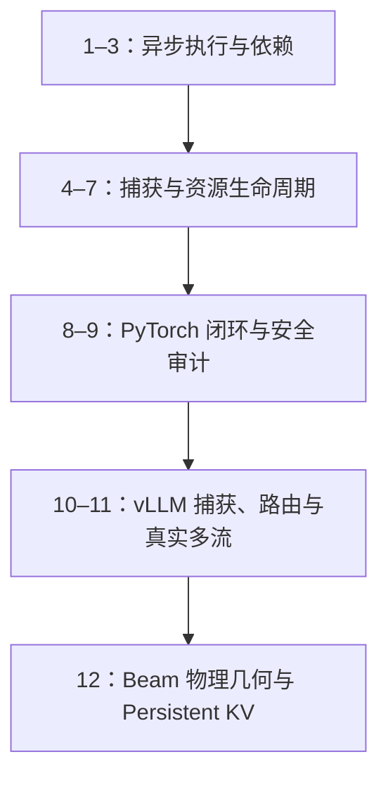

这不是一篇“记住几个 CUDA API”的教程。课程要建立的是一条可以迁移到真实推理系统的判断链：先从 **同流 FIFO** 和 **跨流 happens-before** 出发，再把多流 DAG 捕获成 CUDA Graph，最后进入 vLLM 的 `Dispatcher → BatchDescriptor → CUDAGraphWrapper → replay`。

前 11 课已经整理为独立页面。它们不会同时挤进博客首页，但可以从本页顺序阅读；第 12 课会在这条基础上进入 `Physical Beam Geometry` 与 `Persistent Suffix KV`。

## 冻结基线

源码课程以 [vLLM `v0.22.1` / `0decac0d`](https://github.com/vllm-project/vllm/commit/0decac0d96c42b49572498019f0a0e3600f50398) 为主基线。CUDA Runtime、PyTorch 和 NCCL 的行为以各自官方契约为准。必须始终分开四层概念：

| 层 | 本课程中的对象 | 不能混淆成 |
| --- | --- | --- |
| CUDA 执行层 | Stream、Event、Graph、GraphExec | vLLM 调度策略 |
| PyTorch 层 | static tensor、graph-private pool、RNG state | 原生 Graph 的全部能力 |
| vLLM 策略层 | `CUDAGraphMode`、Dispatcher、`BatchDescriptor` | 某次 forward 的业务语义 |
| 模型运行时层 | attention metadata、KV、LoRA、offload、collective | 仅由 token 数决定的静态 shape |

“Full Graph”在本系列中指 **vLLM model backbone forward 的全图捕获边界**，不是把 Scheduler、采样、BeamSearch 状态机或整个服务循环一起塞进图里。

## 课程地图



1. [Stream 是有序提交序列，不是并行开关](/courses/cuda-graph/01-stream-fifo/)
2. [Event 建立跨 Stream happens-before](/courses/cuda-graph/02-event-happens-before/)
3. [默认 Stream、Async Copy 与隐式同步](/courses/cuda-graph/03-default-stream-async-copy/)
4. [多流 Capture 的 fork/join](/courses/cuda-graph/04-multistream-capture-fork-join/)
5. [Definition、Instantiation 与 Launch](/courses/cuda-graph/05-graph-lifecycle/)
6. [Capture 禁止项、Update、分桶与重录](/courses/cuda-graph/06-capture-update-recapture/)
7. [Allocator、Graph Pool、Workspace 与 Output Lifetime](/courses/cuda-graph/07-memory-pool-workspace-lifetime/)
8. [PyTorch CUDAGraph 最小闭环](/courses/cuda-graph/08-pytorch-cudagraph/)
9. [建立通用 Graph-Safety Harness](/courses/cuda-graph/09-graph-safety-harness/)
10. [只追踪一张真实 FULL Graph](/courses/cuda-graph/10-vllm-full-graph-trace/)
11. [Dispatcher、BatchDescriptor、Padding 与真实多流](/courses/cuda-graph/11-dispatcher-padding-multistream/)

## 统一学习法

每一课都按同一闭环推进：

```text
先预测 → 看最小代码 → 故意破坏 → 用结果验证
       → 映射真实源码 → 回答验收题
```

判断一段代码是否 graph-safe 时，不先问“能不能 capture”，而依次检查：

1. 这轮执行的拓扑是否固定？
2. 节点参数、地址、shape、stride、dtype、layout 是否满足复用契约？
3. metadata、workspace、KV、副作用和 RNG 的所有权是否稳定？
4. 多 Stream 是否具有完整 fork/join？
5. collective 是否在所有 rank 上保持相同顺序？
6. 签名不匹配时是否 fail closed，落到另一张图或 eager？

旧文 [《vLLM CUDA Graph 与 Ascend ACLGraph 全景解析》](/articles/vllm-cuda-graph-and-ascend-aclgraph/) 适合作为平台横向对照；本系列则固定到 vLLM `v0.22.1`，沿实际源码调用链逐步推导。

从[第 1 课](/courses/cuda-graph/01-stream-fifo/)开始。
