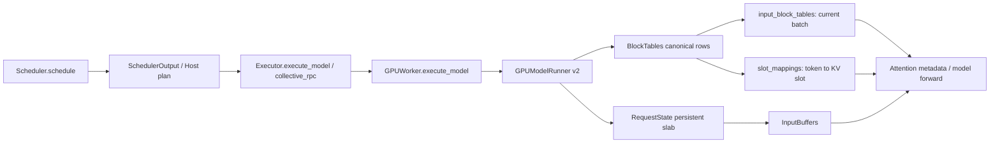
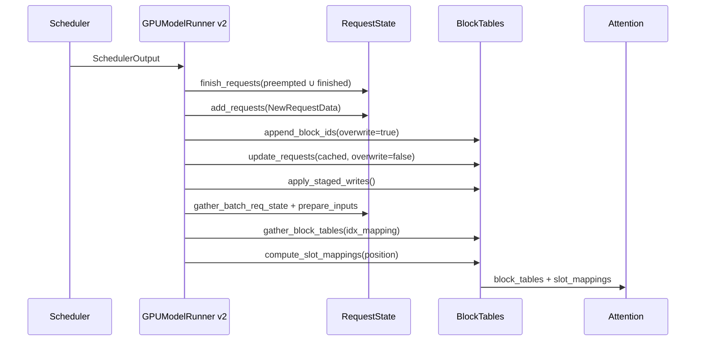

> 本文基于 vLLM `main` 的 [`fa9d67f7`](https://github.com/vllm-project/vllm/commit/fa9d67f7828e9bc105912ddf41dc384105732b1e)。源码事实均固定到该 commit；本文没有运行 GPU 实验，性能判断会明确标为推断。ModelRunner v2 是主线，v1 只用于解释协议差异。

## 本篇在课程路线中的位置

课程前六篇已经把请求从 API、跨进程协议、Scheduler admission 一直追到 KV 不足时的 preemption。上一章留下的边界是：Scheduler 已经决定“哪些 token 用哪些物理 block”，但 Attention kernel 不能读取 Python `dict[str, list[int]]`。本篇只回答一个问题：**`SchedulerOutput` 如何变成固定地址的设备输入，并保证恢复请求不会继续引用旧 KV？**

这一步是 Scheduler/KV Cache Manager 与 Worker/ModelRunner 的真正交接点。它不执行 Transformer，却决定下一次 forward 读写哪一页显存；因此错误往往不是立即报错，而是静默读错 KV。

## 前置知识回顾

`SchedulerOutput` 是 Host 执行计划：`scheduled_new_reqs` 携带完整请求数据，`scheduled_cached_reqs` 携带增量，`num_scheduled_tokens` 给出本 step 的 token 数。Scheduler v2 会把 resumed request 合并进 `scheduled_new_reqs`，同时通过 `preempted_req_ids` 告诉 Worker 清理旧 slot；v1 则用 `CachedRequestData.resumed_req_ids` 表示“block IDs 要 replace 而非 append”。源码见 [`Scheduler.schedule()` 输出构造](https://github.com/vllm-project/vllm/blob/fa9d67f7828e9bc105912ddf41dc384105732b1e/vllm/v1/core/sched/scheduler.py#L1193-L1220) 与 [`CachedRequestData`](https://github.com/vllm-project/vllm/blob/fa9d67f7828e9bc105912ddf41dc384105732b1e/vllm/v1/core/sched/output.py#L104-L139)。

## 本篇要回答的核心问题

1. Worker 为什么还需要一份 request state，不能每 step 直接消费 SchedulerOutput？
2. resumed request 为什么必须执行“先删旧 slot，再完整重建”，而不是覆盖几个字段？
3. request 的 block table 与当前 batch 的 block table 有何区别？
4. `slot_mapping` 如何从 token position 算出 KV cache 的线性写入位置？

## 组件在全局架构中的位置



[`EngineCore.step()`](https://github.com/vllm-project/vllm/blob/fa9d67f7828e9bc105912ddf41dc384105732b1e/vllm/v1/engine/core.py#L583-L613) 先 schedule，再异步调用 `model_executor.execute_model()`；[`Executor.execute_model()`](https://github.com/vllm-project/vllm/blob/fa9d67f7828e9bc105912ddf41dc384105732b1e/vllm/v1/executor/abstract.py#L211-L229) 通过 `collective_rpc("execute_model")` 把同一计划送到各 Worker。具体是否跨进程以及如何序列化取决于 executor backend；不能把单进程调用栈误认为所有部署都共享 Python 对象。

## 关键类型、字段和状态生命周期

### 1. `SchedulerOutput`：一次性的 Host 计划

[`NewRequestData`](https://github.com/vllm-project/vllm/blob/fa9d67f7828e9bc105912ddf41dc384105732b1e/vllm/v1/core/sched/output.py#L27-L65) 中 `block_ids` 的类型是 `tuple[list[int], ...]`：tuple 维度对应 KV cache group，每个 list 是该 group 的物理 block ID。它不是 tensor，没有 dtype/device。`num_computed_tokens` 是 Worker 重建 sequence state 的起点，而不是本轮结束后的值。

### 2. `RequestState`：按 slot 索引的持久 slab

ModelRunner v2 在初始化时分配 [`RequestState`](https://github.com/vllm-project/vllm/blob/fa9d67f7828e9bc105912ddf41dc384105732b1e/vllm/v1/worker/gpu/states.py#L9-L85)：

| 字段 | shape / dtype / location | 作用 |
| --- | --- | --- |
| `all_token_ids` | `[max_num_reqs, max_model_len]`, `int32`, UVA-backed | 保存完整 token 历史，避免占用同规模 GPU 显存 |
| `prompt_len/prefill_len` | `[max_num_reqs]`, `int32`, UVA-backed | 区分用户 prompt 与恢复后更长的 prefill |
| `num_computed_tokens` | `[max_num_reqs]`, `int32`, staged CPU→GPU | Attention position 的基准 |
| `last_sampled_tokens` | `[max_num_reqs, 1]`, `int64`, GPU | decode 输入来源 |
| `draft_tokens` | `[max_num_reqs, num_speculative_steps]`, `int64`, GPU | speculative decode 状态 |

`req_id_to_index` 把稳定的业务 request ID 映射到一个可复用整数 slot。slot 从请求进入 `scheduled_new_reqs` 时占用，到它出现在 `finished_req_ids` 或 `preempted_req_ids` 时释放；`free_indices` 耗尽会触发明确的 `No free indices` assertion。这说明 `max_num_seqs` 不只是 Scheduler 队列限制，也是 Worker 持久状态的物理容量。

### 3. `BlockTables`：三层表示，不是一张表

[`BlockTables`](https://github.com/vllm-project/vllm/blob/fa9d67f7828e9bc105912ddf41dc384105732b1e/vllm/v1/worker/gpu/block_table.py#L17-L78) 同时维护：

- `block_tables[group]`：`[max_num_reqs, max_num_blocks]` 的 `int32` 持久 canonical table，以 request slot 为行；
- `input_block_tables[group]`：为当前 batch gather 后的持久设备表，以 batch row 为行；
- `slot_mappings`：`[num_kv_cache_groups, max_num_batched_tokens]` 的 `int64` 持久设备 buffer。

区分前两者很关键：request slot 顺序可以是稀疏的 `[7, 2, 11]`，当前 batch row 必须紧凑为 `[0, 1, 2]`。`idx_mapping` 正是 `batch_idx → req_state_idx` 的桥。

## 完整调用链与逐函数解读



[`GPUModelRunner.execute_model()`](https://github.com/vllm-project/vllm/blob/fa9d67f7828e9bc105912ddf41dc384105732b1e/vllm/v1/worker/gpu/model_runner.py#L1406-L1479) 的顺序本身就是 contract：

1. `finish_requests()` 先删除 finished 与 preempted slot；
2. `add_requests()` 为新请求和 resumed request 完整建档；
3. `update_requests()` 更新已缓存请求的 computed count，并追加新 blocks；
4. `block_tables.apply_staged_writes()` 一次性把 staged delta 提交到设备；
5. `prepare_inputs()` 构造 token、position、seq length；
6. `prepare_attn()` gather 当前 batch block rows 并计算 slot mapping。

同 step preempt-and-resume 能成立，正因为 purge 在 re-add 之前。`add_requests()` 还会防御性 `_remove_request(req_id)`，随后 `append_block_ids(..., overwrite=True)`；普通 cached request 则走 `overwrite=False`。若把顺序改为 add 后 finish，同 ID 的新状态会被误删；若 resumed 走 append，旧物理 block ID 会残留在表头。

[`RequestState.add_request()`](https://github.com/vllm-project/vllm/blob/fa9d67f7828e9bc105912ddf41dc384105732b1e/vllm/v1/worker/gpu/states.py#L91-L124) 先 stage 多个字段，之后 `apply_staged_writes()` 才统一提交。BlockTables 同样先 stage；单 KV group 调现有 writer，多 group 使用 fused writer。已合入的 [PR #44944](https://github.com/vllm-project/vllm/pull/44944) 把 multi-group 的逐表 kernel 合成一次提交；这是性能意图，本文没有复现实验，不能把 PR 图表当成本环境的确定收益。

### 状态更新是一笔分层事务

这里可以用“prepare—commit—materialize—consume”四阶段理解，而不是把十几个 tensor update 看成散乱赋值。

**prepare** 阶段，`add_requests()` 与 `update_requests()` 只改变 request-slot 语义和 staged delta。此时 Scheduler 已经承诺 block ownership，但 Attention 还不能使用新映射。**commit** 阶段，`RequestState.apply_staged_writes()` 与 `BlockTables.apply_staged_writes()` 把 Host/UVA 镜像提交到设备 canonical state。**materialize** 阶段，`idx_mapping` 从全部活跃 slot 中选择本轮请求，`gather_block_tables()` 生成紧凑执行表，`compute_slot_mappings()` 再展开到每个 token。最后 **consume** 阶段，Attention metadata 和 KV update 才读取这些 buffer。

这四阶段的原子性不是数据库意义上的自动 rollback。若中途 Python exception，ModelRunner 可能已经删除旧 request slot，却尚未把新表提交完整；当前调用链依靠 execute step 失败后整体进入错误处理，而不是逐字段恢复。因此维护者若在 `add_requests()` 与 `apply_staged_writes()` 之间加入可能失败的 connector、LoRA 或动态分配逻辑，必须重新评估“半提交”状态能否被下一 step 安全覆盖。最小防线是让可能失败的 Host 校验发生在任何持久状态变更之前，让提交后的设备操作只接受已经验证的 shape 和范围。

还有一个经常被忽略的双镜像问题：`num_computed_tokens_np` 是 CPU 的 optimistic mirror，而 `num_computed_tokens.gpu` 是设备执行状态。前者用于本 step 的上界和 batch 组织，后者会在采样后由 `post_update` 修正。它们不要求每个瞬间相等，但必须在约定的同步点代表同一请求代际。preempt 后若只清 CPU mirror、不 purge GPU slot，旧 position 仍可能被下一个 batch 消费；反过来只清 GPU 而保留 CPU 上界，会让 batch shape 与实际 sequence state 分叉。

### `prepare_inputs()` 把“每请求 token 数”变成扁平张量

[`prepare_inputs()`](https://github.com/vllm-project/vllm/blob/fa9d67f7828e9bc105912ddf41dc384105732b1e/vllm/v1/worker/gpu/model_runner.py#L1101-L1300) 接收三个层次不同的输入：Scheduler 的 `num_scheduled_tokens`，Worker 的 request-slot state，以及 `BatchExecutionDescriptor` 给出的 graph padding capacity。其输出不是一个新拥有所有存储的对象；`InputBatch` 大量字段只是对持久 `InputBuffers` 的 slice/view。

首先，`gather_batch_req_state()` 根据 request 类型排序并生成 `idx_mapping_np`。排序后的 batch row 不保证等于 Scheduler queue 顺序，因此任何按两个容器隐式 zip 的代码都很危险，必须通过 request ID 或 mapping 对齐。随后 `query_start_loc` 对每请求 token 数做 prefix sum。例如 `[2,2]` 产生 `[0,2,4]`，既界定每个请求在扁平 token 数组中的区间，也作为 slot kernel 的循环边界。

然后 `prepare_pos_seq_lens()` 根据每个 slot 的 `num_computed_tokens` 写出 positions 和新的 sequence length；prefill token 由 `all_token_ids` 取出，decode token 则可能来自 `last_sampled_tokens`，speculative 路径还会合入 draft token。也就是说，`SchedulerOutput` 只说“算几个”，真正“算哪些 token ID、它们位于哪个 position”由 Worker 的持久状态补齐。这正是 Worker cache 能减少跨 step 通信的收益，也是 Scheduler/Worker 状态一旦漂移就会产生静默错误的原因。

最后，`BatchExecutionDescriptor` 可把 `num_tokens` 扩大到 `num_tokens_after_padding`。真实 token 的 `input_ids/positions` 占前缀，padding row 由相应 mask、zero block row 和 `PAD_SLOT_ID` 隔离。固定 shape 服务 CUDA Graph，mask 保持语义；二者缺一不可。只补齐 shape 而不覆盖旧 metadata，相当于让 graph replay 继续携带上一 batch 的物理地址。

### ModelRunner v1 与 v2：相同不变量，不同协议面

v1 把请求对象缓存和当前 batch 管理集中在旧 `gpu_model_runner.py`，恢复语义通过 `CachedRequestData.resumed_req_ids` 进入 `_update_states()`：命中的 request 要用 `new_block_ids` 替换旧表。v2 则把 resumed request 提升为完整 `NewRequestData`，用 `preempted_req_ids` 显式释放固定 slab slot，再重新执行所有组件的 `add_request()`。

v2 的优点是恢复路径与首次建档共用一套完整初始化，较少出现“新增一个 per-request buffer 却忘记在 resume 分支重置”的问题；代价是完整 token/request metadata 会再次下发，并且所有子组件必须支持 remove-then-add 的同 ID 生命周期。v1 增量更小，却要求每个缓存组件正确解释 `resumed_req_ids`。因此上游新增 request-scoped 状态时，维护检查不能只搜 `NewRequestData`：必须同时检查 v1 `_update_states()` 的 replace 分支、v2 `_remove_request/add_requests()`、finished/preempted cleanup 和对应测试。课程后续以 v2 为主，但在 v1 尚可被配置选择期间，协议兼容仍是现实维护成本。

## 具体示例与 shape/状态演算

设一组 KV cache，`block_size=16`，当前 step 两个请求，各调度 2 tokens。为便于演算，假设 batch 顺序为 A、B：

- A 是 cached request，Worker slot 2，旧 blocks `[4, 9]`，本轮追加 block `13`，`num_computed_tokens=31`；
- B 刚被 preempt 后恢复，旧 blocks `[1, 2]` 已失效，新 blocks `[7, 11]`，`num_computed_tokens=16`。

Worker 先删除 B 的旧 slot，再以 `overwrite=True` 写入 `[7,11]`。A 用 append 得到 `[4,9,13]`。若 `idx_mapping=[2,b_slot]`，gather 后：

```text
input_block_tables = [[4, 9, 13],
                      [7, 11,  0]]
query_start_loc    = [0, 2, 4]
positions          = [31, 32, 16, 17]
```

在 `CP_SIZE=1` 时，[slot kernel](https://github.com/vllm-project/vllm/blob/fa9d67f7828e9bc105912ddf41dc384105732b1e/vllm/v1/worker/gpu/block_table.py#L261-L323) 使用：

```text
block_index = position // block_size
block_offset = position % block_size
slot_id = block_number * block_size + block_offset
```

因此 A 的 position 31、32 对应 `9×16+15=159`、`13×16=208`；B 的 position 16、17 对应 `11×16=176`、`177`。最终 `slot_mapping=[159,208,176,177]`。这四个整数才是 KV update kernel 的线性写入地址语义。

启用 DCP 后公式会加入 `CP_SIZE/CP_INTERLEAVE/cp_rank`：非本 rank 的 token 写 `PAD_SLOT_ID`；这已不是简单的 `block×size+offset`。

## 接口契约与必须保持的不变量

- 输入：`SchedulerOutput` 为 Host dataclass；每个 scheduled req 必须能在“new/resumed 完整数据”或“cached 已有 slot”两条路径之一被解析。
- 输出：`InputBatch.input_ids[int32]`、`positions[int64]`、`query_start_loc[int32]`、`seq_lens[int32]`、`block_tables[int32]`、`slot_mappings[int64]` 均在设备侧。
- 所有权：Scheduler 拥有逻辑请求与物理 block 分配；ModelRunner 只缓存其设备执行镜像，不能自行决定 block ownership。
- 生命周期：persistent buffers 在 ModelRunner 初始化时分配并复用；每 step 改内容而非重建地址，这是 CUDA Graph 可复用的必要条件。
- 并发：每个 Worker 内由 execute 顺序更新；多 Worker 各持有镜像，SchedulerOutput 必须在所有 rank 上保持一致。
- 失败方式：cached request 没有 slot 会在 `req_id_to_index` 查找时失败；Worker slot 超量会 assertion；错误 block ID/position 更危险，可能静默读写其他请求 KV。
- padding：slot kernel 从真实 token 尾部到 padded capacity 写 `PAD_SLOT_ID`，防止上一 batch 的有效 slot 泄漏到当前 CUDA Graph replay。

## 为什么这样设计及替代方案

最小正确需求只有三项：保存跨 step 状态、把 request ID 变成紧凑 batch、把逻辑 position 变成物理 KV slot。最简单替代是每 step 在 CPU 重建完整 dense block table，再整表 H2D；实现直观，却把传输量从“变化的 block 数”放大为 `max_num_reqs × max_num_blocks`，也不利于固定地址 replay。

另一种方案是让 Attention kernel 直接追逐 request ID 与变长 block list，省掉 gather，却把哈希/指针间接访问、变长控制流和多 KV group 逻辑塞进热 kernel，增加 graph、跨 backend 与维护成本。当前“持久 canonical state + staged delta + 紧凑 gather”把控制复杂度留在 forward 前，Attention 获得规则 tensor 输入，是更稳妥的职责分层。

代价也真实存在：小 decode batch 中，staged write、gather、slot mapping 都可能是额外 kernel launch。**基于代码的推断**：这些 metadata kernel 是否值得进一步融合，必须用 `T_prepare + T_transfer + T_forward` 分段 trace 判断；不能因为它们在 profiler 中出现就断言是端到端瓶颈。`prepare_attn()` 位于 model forward 之前，也不应未经 trace 就声称已被 full CUDA Graph 覆盖。

## 性能、并发、正确性与边界条件

- 显存：`all_token_ids` 用 UVA 避免 `[max_reqs,max_model_len]` 常驻 GPU，但访问模式和 page fault/带宽仍需实测。
- launch：multi-group staged writes 已融合为一次 kernel；gather 与 slot mapping 仍是独立准备工作。
- graphability：`InputBuffers`、`input_block_tables`、`slot_mappings` 是持久地址；graph key 仍需容纳 padded token/request shape。
- 正确性：preemption 释放的是所有权，不保证旧显存字节清零；所以 replace contract 比“清内存”更根本。
- hybrid groups：一个 scheduler block 可能展开成多个 kernel block ID，`blocks_per_kv_block` 必须一致参与 block table 与 slot mapping。
- DCP：非本地 token 必须映射为 PAD；改变 interleave 规则会同时影响物理 slot 与 attention metadata。

## 测试证据与未覆盖风险

[`test_worker_slot_overflow.py`](https://github.com/vllm-project/vllm/blob/fa9d67f7828e9bc105912ddf41dc384105732b1e/tests/v1/core/test_worker_slot_overflow.py) 用 CPU 上的 faithful `WorkerSlots` 模型验证三条不变量：暂停的 streaming session 仍占 Worker slot；out-of-band preemption 必须在下一 `SchedulerOutput.preempted_req_ids` 中上报；同 step preempt+resume 必须先 purge 再 re-add。

[`test_gpu_block_table.py`](https://github.com/vllm-project/vllm/blob/fa9d67f7828e9bc105912ddf41dc384105732b1e/tests/v1/worker/test_gpu_block_table.py) 在 CUDA 上验证 single/multi-group staged write、append、hybrid block expansion、`num_blocks` CPU/GPU 同步，以及 dummy block table 在保持 `data_ptr()` 不变时清零旧 row。

当前直接缺口是 `_compute_slot_mappings_kernel` 的边界单测：至少应覆盖 position 15→16 的跨 block、resumed replace 后不引用旧 ID、actual token 尾部到 graph padding 全部为 `PAD_SLOT_ID`、DCP interleave 的 local/non-local 分支，以及多 group 不同 kernel block size。还应有一个真实 v2 ModelRunner 测试，而不只用 `WorkerSlots` 模型，断言 same-step preempt+resume 后 `RequestState`、canonical block table、gathered table 和 slot mapping 四层一致。

维护这一段代码时，影响面检查至少应覆盖以下顺序，而不能只跑一个最终文本生成测试：

1. 若修改 `SchedulerOutput` 字段，检查 uniproc、multiproc、Ray、PP batch queue 以及 v1/v2 两个接收端；字段的默认值不能掩盖旧 Worker 未处理新语义。
2. 若修改 request slot 释放时机，检查 finished、abort、preempt、streaming pause、同 step resume 和异常退出；“不在 running”不等于 Worker 已释放 slot。
3. 若修改 block table layout，检查 scheduler block 与 kernel block 的展开倍数、hybrid KV groups、cross-attention 最大长度、DCP 分片和 connector copy/offload 元数据。
4. 若修改 padding 或 graph bucket，检查上一 batch 较大、下一 batch 较小的回放序列；单次干净启动无法暴露 stale row/slot。
5. 若融合 metadata kernel，除 isolated kernel latency 外，还要核对 device address、stream ordering、CUDA Graph capture/replay、GPU/NPU backend 可移植性以及错误定位成本。

最危险的回归形态是“输出大多数时候正确”：错误 slot 可能仍指向尚未覆写的同内容 cache block，在低并发测试中被偶然遮蔽，直到 block 被另一请求复用才暴露。因此最小 CI 应主动安排 block ID 重用和 batch 缩容，而不是依赖随机请求自然触发。

## 与前后章节的连接

上一章结束在“恢复请求必须替换 block IDs”；本章证明了 replace 在 v2 中是 `preempted_req_ids → finish_requests → NewRequestData → overwrite=True` 的完整事务。下一章沿返回路径追踪 `ModelRunnerOutput → Scheduler.update_from_output`：哪些 token 被真正提交，speculative progress 如何修正，finished request 又如何同时释放 Scheduler 与 Worker 状态。

## 本篇结论、知识债与理解检查

核心结论：**SchedulerOutput 不是 Attention 的直接输入，而是设备状态更新日志；只有在 request slot、canonical block table、current-batch table 和 slot mapping 四层一致后，forward 才拥有正确的 KV 地址语义。**

新增知识债：v2 slot-mapping 边界测试不足；metadata preparation 的实际 GPU 时间与 graph 边界未量化；UVA token table 在长上下文、高并发下的访问代价未测；multi-rank 接收 SchedulerOutput 的一致性与故障恢复尚未下钻。

三个检查问题：

1. 为什么 resumed request 即使 `request_id` 不变，也不能作为 cached request append 新 blocks？
2. canonical block table 和 `input_block_tables` 为什么必须同时存在？
3. position 32、block size 16、物理 block ID 13 时，slot ID 是多少；若该 token 不属于当前 DCP rank，又应写什么？

## 第七篇知识图谱回顾

七篇已经拼出第一条完整主链：

```text
LLM.generate
→ Renderer/InputProcessor
→ EngineCoreRequest wire protocol
→ EngineCore ADD/ABORT/backpressure
→ Scheduler logical admission
→ KV physical admission
→ preemption/recompute/resume
→ Worker persistent state + physical slot mapping
```

已闭合的边界是“用户请求如何变成一次可执行的 KV 地址计划”；最大的盲区已经从 admission 转到提交：当前还没有解释 ModelRunner 输出何时成为 Scheduler 的可信 token、finish 如何贯穿前端与所有 Worker、async/speculative 输出怎样避免重复提交。下一组章节将先补返回事务，再进入 Attention metadata 与真实 KV cache tensor。

## 课程账本增量

- 完成：`EngineCore.step → Executor.execute_model → GPUWorker.execute_model → GPUModelRunner v2`；`RequestState`、`BlockTables`、`InputBuffers`、`slot_mapping` 生命周期。
- 新不变量：v2 preempt/resume 必须先 purge 后 re-add；new/resumed overwrite，cached append；padding slot 必须清为 `PAD_SLOT_ID`；固定地址 buffer 与动态内容分离。
- 下一章：`ModelRunnerOutput → Scheduler.update_from_output` 的 token/spec progress 提交与 finished cleanup。
