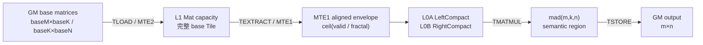
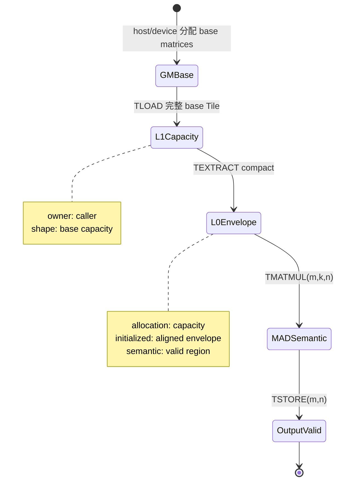
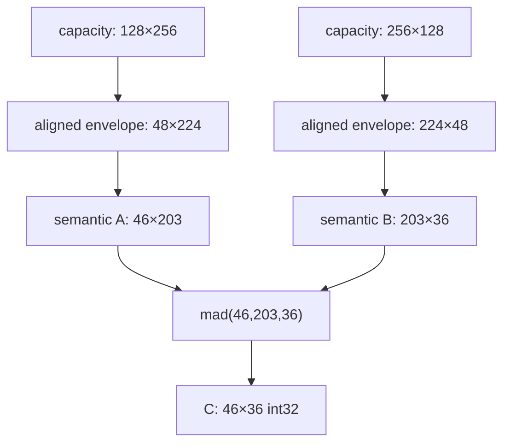

> 本章基于 [`pto-isa@f51c92f6`](https://github.com/hw-native-sys/pto-isa/commit/f51c92f610827daad0ddfb383072e03d514b4ae9)。规范和当前代码直接证明的内容标为“代码事实”，仓库 device ST 的结果标为“测试事实”，访存量是按指令参数推导的请求包络，并非设备 profiler 实测。本次没有在 Ascend 设备上重新运行测试。

## 本篇在 PTO 课程路线中的位置

前七章已经走通 `GlobalTensor → TLOAD/MTE2 → L1 Mat → TMOV/MTE1 → L0A/L0B → TMATMUL/M → Acc → TSTORE/FIX`。上一章留下的关键问题是：当 `M/N/K` 不是 16、32 或 C0 的整数倍时，静态 Tile 必须对齐，但真正参与计算的元素又不能被 padding 污染。

今天仍只研究 `pto-isa`，聚焦两个紧密相连的问题：

1. `TileLeftCompact/TileRightCompact` 到底压缩了什么；
2. padding 由谁产生、谁可以读取、谁保证它不进入最终数学结果。

这不是“尾块补零”的同义改写。当前实现把一个 tail 拆成三层：编译期 capacity、MTE1 可搬运的 aligned envelope、`mad(m,k,n)` 的 semantic region。维护代码时，任何一层都不能被另一层替代。

## 前置知识

- `Rows/Cols` 是 Tile 类型中的静态 capacity；它决定地址空间、fractal 合法性和代码特化。
- `GetValidRow/Col()` 是本次操作的数学有效区，只描述左上角连续矩形。
- A2/A3 half/bf16 的常见 Cube fractal 是 16×16；int8 的 K/C0 对齐通常是 32 个元素。
- `TMOV(Mat→Left/Right)` 是 MTE1 上的 role-specific 搬运，不是逻辑矩阵 memcpy。

## PTO 全栈中的位置



上游输入是一个已经按 base shape 分配的 GM 矩阵；下游消费者是 `TMATMUL`。Compact 只改变中间的 L1→L0 搬运几何，不缩小 Tile 类型的 allocation，也不改变最终 `M×K @ K×N` 的数学定义。

## 概念与精确语义

[`TileLeftCompact` 与 `TileRightCompact`](https://github.com/hw-native-sys/pto-isa/blob/f51c92f610827daad0ddfb383072e03d514b4ae9/include/pto/common/pto_tile.hpp#L1713-L1755) 和普通 alias 的主要类型差异是最后一个模板参数 `CompactMode::Normal`。静态 `Rows×Cols` 仍然存在，`TASSIGN` 仍绑定一块足以容纳 capacity 的 L0 地址；“Compact”不代表 allocation 自动变成 `validRows×validCols`。

它真正改变的是 [`TMovToLeft/Right`](https://github.com/hw-native-sys/pto-isa/blob/f51c92f610827daad0ddfb383072e03d514b4ae9/include/pto/common/arch/memory/tmov_common.hpp#L31-L77) 的编译期分派：

```text
CompactMode::Null   → TExtractToA/B，传输几何来自静态 Rows/Cols
CompactMode::Normal → TExtractToA/BCompact，传入 dst.GetValidRow/Col()
```

Compact 分支并不会按任意元素数搬运。[`TExtractToACompact`](https://github.com/hw-native-sys/pto-isa/blob/f51c92f610827daad0ddfb383072e03d514b4ae9/include/pto/common/arch/memory/textract_common.hpp#L268-L309) 和 [`TExtractToBCompact`](https://github.com/hw-native-sys/pto-isa/blob/f51c92f610827daad0ddfb383072e03d514b4ae9/include/pto/common/arch/memory/textract_common.hpp#L351-L397) 先把 valid shape 向硬件粒度取整。

对非 transpose 路径，可写成：

| 目标 | aligned rows | aligned cols |
| --- | --- | --- |
| Left | `ceil(validM / 16)×16` | `ceil(validK / C0)×C0` |
| Right | `ceil(validK / C0)×C0` | `ceil(validN / 16)×16` |

其中 `C0=32B/sizeof(dtype)`。对 int8，`C0=32`；对 half/bf16，`C0=16`；对 float，通常为 8，但 Left 还可能受手工 `KAligned` 模式影响而改按 16 对齐。

### 接口 contract

| 维度 | Compact Mat→Left/Right contract |
| --- | --- |
| 输入 | L1 `Mat`，静态 capacity 必须覆盖 `index + destination capacity`；目标有效矩形对应的 source 数据必须已初始化 |
| 输出 | L0A/L0B Tile allocation 不缩小；aligned envelope 内被 MTE1 重排/写入，semantic valid 保持原值 |
| 前置条件 | source/destination dtype 一致；location pair 合法；静态 shape/offset 满足 fractal、C0 和 index 对齐；valid 不超过 capacity |
| 后置条件 | `TMATMUL` 可按目标 Tile 的 valid `m/k/n` 消费；invalid capacity 不获得“为零”保证 |
| 所有权 | caller 拥有 L1/L0 allocation、valid shape、`KAligned` 与 event；TEXTRACT/TMOV 只执行传输 |
| 并发假设 | MTE2→MTE1 ready edge 和 M→MTE1 free edge必须闭合；Compact 不改变 slot 复用协议 |
| 失败方式 | 大部分 capacity/index 违规由 `static_assert`/`PTO_ASSERT` 拒绝；未初始化 padding、错误 valid 或错误 `KAligned` 可能成为静默数值问题 |

## 真实文件、类型和函数逐段解读

### 1. `Tile` 同时保存 capacity、valid 与 `isKAligned_`

[`Tile`](https://github.com/hw-native-sys/pto-isa/blob/f51c92f610827daad0ddfb383072e03d514b4ae9/include/pto/common/pto_tile.hpp#L1420-L1660) 在类型层保存 `Rows/Cols/ValidRow/ValidCol/Compact`，动态 valid 则进入 `RowMaskInternal/ColMaskInternal`。`SetValidShape()` 只允许修改声明为 `DYNAMIC` 的维度，并断言不超过 capacity。

另一个容易漏掉的状态是 `isKAligned_`。Compact Left 的 float 路径会读取 `dst.GetKAligned()`；`TMATMUL` 的 [`GetKDirectionAlign`](https://github.com/hw-native-sys/pto-isa/blob/f51c92f610827daad0ddfb383072e03d514b4ae9/include/pto/npu/a2a3/TMatmul.hpp#L21-L36) 也会读取 Left/Right 的该字段。历史修复 [`dceeb16d`](https://github.com/hw-native-sys/pto-isa/commit/dceeb16dd8e27c2e60895d0563a395bb4943b68c) 明确把 A3 b32 compact 的 K alignment 改为调用方手工设置。

代码事实是：当前构造函数没有为 `isKAligned_` 提供显式默认值；直接相关 compact ST 显式设置了 `aTile.SetKAligned(isKAlign)`，却没有对 `bTile` 做同样初始化。这尚不是已复现缺陷，但它是当前区域最高优先级的契约风险：当 Left 为 `false` 时，float `a.GetKAligned() || b.GetKAligned()` 可能继续读取 Right 的未初始化字段。最小修复思路应先通过测试证明期望默认语义，再决定在字段处默认 `false`，还是要求所有构造点显式设置；本文不修改上游代码。

### 2. Compact 只把 valid 变成 aligned envelope

`TExtractToACompact` 对 Left 的 non-transpose 路径使用 `dstValidRow/Col` 计算对齐值，再把这两个值传入 `img2colv2_cbuf_to_ca`。Right 路径同理，通过 `dstRowNum/dstColNum` 控制 `pto_load_cbuf_to_cb` 的循环边界。

因此请求包络满足：

$$B_{MTE1} \approx \hat M\hat K\cdot sizeof(A)+\hat K\hat N\cdot sizeof(B)$$

其中 `hat` 表示按 Left/Right 规则对齐后的维度。这个式子描述指令希望覆盖的元素矩形；总线事务、bank 冲突和实际周期仍需 device trace。

### 3. `TMATMUL` 重新收紧数学边界

[`TMATMUL_IMPL`](https://github.com/hw-native-sys/pto-isa/blob/f51c92f610827daad0ddfb383072e03d514b4ae9/include/pto/npu/a2a3/TMatmul.hpp#L130-L149) 不使用静态 capacity 作为计算尺寸，而是取：

```text
m = aMatrix.GetValidRow()
k = aMatrix.GetValidCol()
n = bMatrix.GetValidCol()
mad(..., m, k, n, ...)
```

这就是 padding 不进入数学结果的核心机制。Compact 允许 MTE1 为了硬件粒度多搬一些元素；`mad` 的动态长度重新声明只有 `m×k` 和 `k×n` 有语义。一个例外是 A3 为避免 GEMV mode，把非 GEMV 的 `m==1` 改成 16；额外 15 行虽然不会被最终 `1×n` store 返回，但这条特殊路径需要独立测试证明不会影响有效行。

## 对象与 Buffer 生命周期



真实 [`runTEXTRACT_COMPACT`](https://github.com/hw-native-sys/pto-isa/blob/f51c92f610827daad0ddfb383072e03d514b4ae9/tests/npu/a2a3/src/st/testcase/textract/textract_kernel.cpp#L394-L480) 先把 `baseM×baseK`、`baseK×baseN` 的 GM 矩阵完整载入 L1 Mat。随后创建 capacity 为 `base-index`、valid 为 `M-index` 的 Compact Left/Right，执行 `TEXTRACT → TMATMUL → TSTORE`。

注意收益边界：Compact 只减少 MTE1 的 L1→L0 工作，不减少这个测试中的 GM→L1 TLOAD，因为 source GlobalTensor 仍是完整 base shape。若系统瓶颈在 HBM/MTE2 而不是 MTE1，单独切换 Compact 不一定改善端到端时间。

## 具体实例：int8 的 46×203 @ 203×36

仓库 [`TEXTRACT_Compact_Test.case12`](https://github.com/hw-native-sys/pto-isa/blob/f51c92f610827daad0ddfb383072e03d514b4ae9/tests/npu/a2a3/src/st/testcase/textract/main.cpp#L331-L340) 使用：

- dtype：A/B=`int8`，Acc/输出=`int32`；
- semantic shape：`M=46, K=203, N=36`；
- base capacity：`baseM=128, baseK=256, baseN=128`；
- `indexM=indexK=indexN=0`；A 不转置，B 使用 DN/transpose storage。

逐层演算：

| 状态 | A/Left | B/Right | C/Acc |
| --- | ---: | ---: | ---: |
| 静态 capacity | 128×256 | 256×128 | 128×128 |
| semantic valid | 46×203 | 203×36 | 46×36 |
| Compact aligned envelope | 48×224 | 224×48 | 由 MAD/TSTORE valid 控制 |
| envelope bytes | 10,752 B | 10,752 B | 输出 6,624 B |

如果走普通非 compact TMOV，两侧静态请求矩形合计约 `128×256 + 256×128 = 65,536 B`；Compact 的两侧 aligned envelope 合计约 21,504 B，静态请求包络减少约 67.2%。但数学输入只有 `46×203 + 203×36 = 16,646 B`，所以对齐本身仍带来 4,858 B 额外元素，约为 semantic operand bytes 的 29.2%。



这个例子还说明 Compact 不等于“自动补零”。aliases 使用 `PadValue::Null`；aligned envelope 中超出 valid 的值没有零值承诺。正确性依赖 `mad(46,203,36)` 不把这些 lane 纳入有效点积，以及 `TSTORE` 只写 `46×36`。若调用者只为 semantic shape 分配 source，却仍让 TEXTRACT 读取 aligned envelope，现有 base-matrix 测试不能证明安全。

## 为什么这样设计，以及替代方案

当前设计把物理约束和数学约束分开：大 capacity 支持 shape bucket 与代码复用；Compact 减少 L0 传输；动态 `m/k/n` 保持精确语义。这对同一 kernel 服务多个 tail shape 有价值。

替代方案一是为每个 tail 生成恰好对齐的静态 Tile。它可获得与 Compact 相近的 MTE1 包络，并减少动态字段，但会增加模板实例、编译时间和 dispatch 分支。若 shape 集合很少且固定，这个方案可能更简单；若 runtime shape 多，代码膨胀会成为真实成本。

替代方案二是普通 Tile 全量搬运，再显式 `TFILLPAD(0)`。它的正确性边界直观，尤其适合不信任 consumer masking 的算子，但会增加 MTE1/填充工作。对 GEMM 而言，只有当设备实测表明 MAD 会消费 padding，或者同一 L0 Tile 还被无法 mask 的消费者复用时，清零才是必要复杂度。

从第一性原理看，是否使用 Compact 的判据不是“存在 tail”，而是：

$$\frac{B_{capacity}-B_{envelope}}{BW_{MTE1}} > T_{compact\ control}$$

并且节省的 MTE1 时间必须没有被 M pipeline 完全隐藏。若 base capacity 本来就是 valid 的最小对齐包络，Compact 几乎没有流量收益；如果一个 128/256 bucket 承载很小的 runtime shape，收益才可能显著。

## 访存、计算、流水与硬件约束

- Compact 不改变 L1/L0 allocation 上限，不能据此减小 `TASSIGN` 地址间隔。
- source capacity、destination capacity 和 `index` 必须共同保证 aligned envelope 不越界。
- int8 non-transpose Left/Right 的 K 维按 32 元素对齐；M/N 按 16 对齐。
- float Left 的 K alignment 可能由 `SetKAligned()` 改写，属于 caller-visible ABI，而不是实现细节。
- MTE2→MTE1 与 MTE1→M 的 event 图不因 Compact 而改变；缩短 payload 只可能改变各阶段等待比例。
- `mad` 接收精确 `m/k/n`，但 `m==1→16` 是显式的硬件规避分支，必须把 output valid 与内部读取分开审计。

## 测试证据与未覆盖风险

当前 A2/A3 [`TEXTRACT_Compact_Test`](https://github.com/hw-native-sys/pto-isa/blob/f51c92f610827daad0ddfb383072e03d514b4ae9/tests/npu/a2a3/src/st/testcase/textract/main.cpp#L266-L374) 覆盖 float、int8、bf16，包含四种 A/B transpose 组合和非零 `indexM/N/K`。Host 为完整 base matrices 分配 GM，device 执行 `TLOAD → TEXTRACT Compact → TMATMUL → TSTORE`，最后以阈值 `0.001` 对比 NumPy golden。测试事实是这些 case 的端到端数值预期成立。

它没有证明：

1. Compact 的真实 MTE1 bytes、周期或 wall time 优于普通路径；
2. invalid envelope 被 poison 时仍不会污染有效输出；
3. source 仅按 semantic shape 分配时的边界安全；
4. `valid=1`、对齐边界±1、`m==1` 特例的完整组合；
5. `isKAligned_` 在所有 Left/Right 构造路径中都已初始化。

最小 CI guard 应增加两组。一组让相同 base/valid 分别走 compact 与 non-compact，比较 golden 并在 device trace 中记录 MTE1 请求；另一组把 base-valid 之外填成 NaN/极值或随机 poison，覆盖 `M/N/K=1`、`15/16/17`、`31/32/33`。对于 float，还应把 Left/Right 的 `KAligned=false/true` 都显式初始化，并断言生成的 aligned K 与 MAD mode 一致。

## 与前后章节的连接

上一章解决“L1 Mat 如何变成 L0 operand”；本章解决“tail 时到底搬多少、算多少”。下一章将沿另一个尚未闭合的接口，追踪 PyPTO/PTOAS 的 `partition_view` 如何 lowering 成 `GlobalTensor` pointer/shape/stride 与 `TLOAD`，开始从手写 ISA 向上接编译链。

## 本篇结论

`Compact` 的稳定含义是“按 valid 推导硬件可搬运的最小对齐包络”，不是缩小 allocation，也不是自动零填充。tail 正确性来自四个连续承诺：source base allocation 覆盖 envelope、TEXTRACT 不越界、`mad(m,k,n)` 只承认 semantic region、TSTORE 只导出有效输出。

当前最高风险是 `KAligned` 状态的显式所有权：历史提交要求 caller 手工设置，但 `Tile` 字段没有可见默认初始化，直接测试只初始化 Left。这个问题需要以最小 device/compile guard 确认，不能用“现有 golden 通过”替代生命周期审计。

### 三个理解检查问题

1. 为什么 `TileLeftCompact<128,256>` 仍需要按 128×256 预留地址，却只可能搬 48×224？
2. padding 没有清零时，`mad(46,203,36)` 为什么仍能定义正确结果？哪些消费者会让这个假设失效？
3. 当 base capacity 已等于 valid 的最小对齐包络时，Compact 还剩下什么收益？

## 课程账本增量

- 新覆盖：`TileLeftCompact/TileRightCompact/TileAccCompact`、`TExtractToA/BCompact`、`SetKAligned/GetKDirectionAlign`、A2/A3 `TEXTRACT_Compact_Test`。
- 新不变量：capacity ≥ aligned envelope ≥ semantic valid；Compact 不改变 allocation；padding 无零值保证；MAD/TSTORE 必须重新收紧语义域。
- 新证据：真实 int8 case `46×203 @ 203×36` 在 `128×256/256×128` base 上完成 compact TEXTRACT、MAD 与 golden compare。
- 新风险：Compact 只优化 MTE1，不能推出 GM/MTE2 改善；`isKAligned_` 初始化和 `m==1→16` 缺少强边界 guard。
- 下一章：`partition_view → GlobalTensor descriptor → TLOAD` 的 PyPTO/PTOAS 跨仓 lowering contract。
