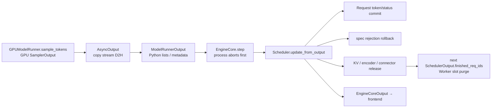
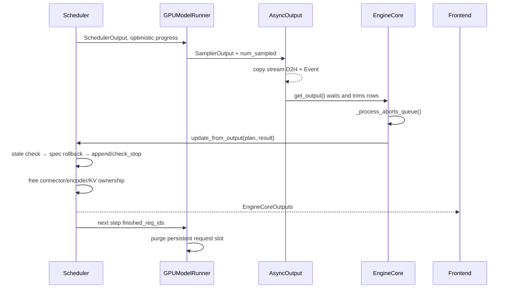
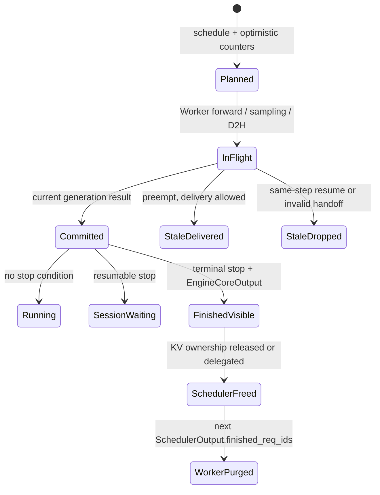

> 本文基于 vLLM `main` 的 [`dc9ae4b8`](https://github.com/vllm-project/vllm/commit/dc9ae4b8ac2331991ad7091812ef82ece4f8fdc2)。源码事实固定到该 commit；本文未运行 GPU 实验。合入 PR 中报告的复现实验会单独标为“PR 实验事实”，不把它当成本环境实测。

## 本篇在课程路线中的位置

前七篇已经把一次请求追到设备侧 `input_ids/positions/block_tables/slot_mapping`。但“GPU 已执行”还不等于“请求已经提交”：Scheduler 在 `schedule()` 结束时已经乐观推进 `num_computed_tokens`，设备可能只接受部分 speculative tokens，请求也可能在执行期间被 abort 或 preempt。

本篇只回答一个维护问题：**`ModelRunnerOutput` 返回后，vLLM 怎样把设备结果提交成唯一可信的 Request 状态，同时安全结束 KV、connector 和 Worker slot 的生命周期？**

## 前置知识回顾

上一章确认了两个边界：Scheduler 拥有逻辑请求和 KV block ownership；ModelRunner 维护设备执行镜像。`SchedulerOutput` 是执行计划，不是完成凭证。尤其 [`Scheduler._update_after_schedule()`](https://github.com/vllm-project/vllm/blob/dc9ae4b8ac2331991ad7091812ef82ece4f8fdc2/vllm/v1/core/sched/scheduler.py#L1379-L1427) 会立即执行：

```text
num_computed_tokens += num_scheduled_tokens
num_in_flight_tokens += num_scheduled_tokens
```

这是为了 async scheduling、pipeline parallel 和连续 chunked prefill 能在旧输出返回前继续排下一步。代价是 Scheduler 状态从此包含“已确认进度 + 在途乐观进度”，返回路径必须能够纠错。

## 组件在全局架构中的位置



owner map 很清楚：

- `GPUModelRunner` 拥有 device output 和 request-slot 镜像，但不决定请求是否 finished；
- `AsyncOutput` 拥有在 copy stream 上仍在搬运的 tensor 引用与完成 Event；
- `Scheduler` 是 token history、status、spec rollback 和 KV ownership 的 canonical owner；
- `EngineCoreOutput` 只承载本次对前端可见的增量，不反向拥有 Request；
- connector 的异步工作必须拥有独立于 Request 的资源引用，不能借用可能结束的 request lifetime。

## 完整调用链

[`GPUModelRunner.sample_tokens()`](https://github.com/vllm-project/vllm/blob/dc9ae4b8ac2331991ad7091812ef82ece4f8fdc2/vllm/v1/worker/gpu/model_runner.py#L1707-L1849) 在 last PP rank 上运行 sampler，构造只含 request identity 的 `ModelRunnerOutput`，再创建 `AsyncOutput`。随后它可以继续做 `postprocess_sampled()` 和 draft proposal；D2H 不必阻塞 main stream。

[`AsyncOutput`](https://github.com/vllm-project/vllm/blob/dc9ae4b8ac2331991ad7091812ef82ece4f8fdc2/vllm/v1/worker/gpu/async_utils.py#L115-L206) 让 copy stream 等待 main stream，把 `sampled_token_ids`、每请求 `num_sampled_tokens`、logprobs 等 non-blocking 拷到 CPU，并记录 `copy_event`。`get_output()` 才同步 Event，把 padded 二维数组按每请求真实数量裁剪为 `list[list[int]]`。

EngineCore 的同步 [`step()`](https://github.com/vllm-project/vllm/blob/dc9ae4b8ac2331991ad7091812ef82ece4f8fdc2/vllm/v1/engine/core.py#L583-L622) 和 batch-queue [`step_with_batch_queue()`](https://github.com/vllm-project/vllm/blob/dc9ae4b8ac2331991ad7091812ef82ece4f8fdc2/vllm/v1/engine/core.py#L624-L738) 都在调用 `scheduler.update_from_output()` 前处理执行期间到达的 abort。因此一个请求即使仍出现在旧 `ModelRunnerOutput` 中，也可能已经从 Scheduler registry 删除；返回路径必须把它当 stale/no-op，而不是“复活”请求。



## 关键类型、字段和状态生命周期

[`ModelRunnerOutput`](https://github.com/vllm-project/vllm/blob/dc9ae4b8ac2331991ad7091812ef82ece4f8fdc2/vllm/v1/outputs.py#L307-L399) 是 Scheduler 进程可消费的 Host dataclass：

| 字段 | shape / dtype / location | contract |
| --- | --- | --- |
| `req_ids` | `[num_reqs]`, `list[str]`, Host | ModelRunner 的 batch 顺序 |
| `req_id_to_index` | `req_id → row`, Host dict | 禁止按 Scheduler dict 顺序隐式 zip |
| `sampled_token_ids` | 每请求变长 `list[list[int]]`, Host | 已按 `num_sampled_tokens` 去掉 padding |
| `logprobs` | 每请求变长 Host lists，可空 | 必须按最终保留 token 数切片 |
| `kv_connector_output` | Host metadata，可空 | 完成/失败的异步 KV 工作 |
| `routed_experts` | step token rows 的 Host ndarray/list，可空 | offset 必须按 `req_ids` 构造 |

设备侧 `SamplerOutput.sampled_token_ids` 是二维 GPU tensor；普通采样初始形状为 `[num_requests, 1]`，spec/jump decoding 可让每请求有效长度不同。`AsyncOutput` 在 copy 完成前必须保留 GPU tensor 引用，否则 copy stream 可能读取已释放或复用的 storage。这是所有权契约，不只是 Python GC 细节。

Request 侧四个计数不能混用：

- `num_tokens`：prompt 加已提交 output token 的逻辑序列长度；
- `num_computed_tokens`：Scheduler 乐观认为已执行的 token 位置；
- `num_in_flight_tokens`：已调度但结果尚未归还的 token 数；
- `num_output_placeholders`：async 模式中尚未被真实返回 token/rejection 消解的输出占位。

## `update_from_output()`：返回事务逐段解读

[`Scheduler.update_from_output()`](https://github.com/vllm-project/vllm/blob/dc9ae4b8ac2331991ad7091812ef82ece4f8fdc2/vllm/v1/core/sched/scheduler.py#L1733-L2136) 的顺序不能随意交换。

第一步是识别请求代际。函数先按原 `SchedulerOutput.num_scheduled_tokens` 遍历，将 `num_in_flight_tokens` 减回；若请求已被 preempt，则同步消耗 `num_stale_output_tokens`。请求已 abort/finished 时直接跳过。普通 preemption 的旧输出仍可交付 token，但不得修改已经清零的 computed/placeholder 计数；`reset_prefix_cache` 或 connector handoff 使用 `drop_stale_output=True` 时，旧输出连 token 都必须丢弃，因为相同 position 已被新代际重算。

第二步是 speculative rollback。若本轮调度了 `D` 个 draft，而设备返回 `len(generated_token_ids)` 个 token，普通自回归 bonus 数为 `1`，则：

```text
accepted = max(len(generated_token_ids) - 1, 0)
rejected = D - accepted
num_computed_tokens -= rejected
```

async 模式还要同步回滚 `num_output_placeholders`。这里回滚的不是 token history，而是调度阶段提前声明的执行进度；stale output 的 rejection 属于旧代际，不能再次作用到重置后的计数。

第三步才是 token commit。[`_update_request_with_output()`](https://github.com/vllm-project/vllm/blob/dc9ae4b8ac2331991ad7091812ef82ece4f8fdc2/vllm/v1/core/sched/scheduler.py#L2182-L2199) 逐 token 调用 `append_output_token_ids()`，更新 all/output token lists 与 block hashes，并在每个 token 后运行 [`check_stop()`](https://github.com/vllm-project/vllm/blob/dc9ae4b8ac2331991ad7091812ef82ece4f8fdc2/vllm/v1/core/sched/utils.py#L77-L107)。若一个 spec batch 的中间 token 命中 EOS/stop/max length，后续返回 token 被裁掉；logprobs 和 sampling mask 也必须按裁剪后的长度切片。

第四步是 finish 与资源转移。非 resumable 请求进入 [`_free_request()`](https://github.com/vllm-project/vllm/blob/dc9ae4b8ac2331991ad7091812ef82ece4f8fdc2/vllm/v1/core/sched/scheduler.py#L2388-L2420)：先通知 KV/EC connector，再释放 encoder cache，登记 `finished_req_ids`，最后释放 KV blocks 并从 `requests` registry 删除。循环结束后才批量从 `running/waiting` queue 移除，避免边遍历边破坏容器。

注意 Worker slot 不在这一调用栈同步释放。`finished_req_ids` 被带入下一份 `SchedulerOutput`，ModelRunner 下一 step 先 purge request slot。故而“前端收到 finish_reason”“Scheduler 不再拥有 KV”“所有 Worker 已删除 slot”是三个相邻但不同的时间点。

## 接口契约与必须保持的不变量

`update_from_output(scheduler_output, model_runner_output)` 的两个参数是同一执行 step 的 plan/result 对，调用方不能把不同 step 的对象重新配对。`scheduler_output.num_scheduled_tokens` 决定应清偿多少 `num_in_flight_tokens`，也决定 routed-expert row 的切分；`model_runner_output.req_id_to_index` 决定每个请求读取哪一行采样结果。前者是 Scheduler 顺序，后者是 ModelRunner batch 顺序，两者只允许通过 `req_id` join。

前置条件包括：每个非 stale scheduled request 必须能在 `req_id_to_index` 中定位；每请求返回 token 数不得超过 sampler/verification 允许的上限；draft acceptance 必须是已调度 draft 的前缀；`num_stale_output_tokens` 与 `num_in_flight_tokens` 不能减成负数。后置条件是：本 step 的在途债务已清偿；未拒绝的执行进度保留；可交付 token 恰好追加一次；finished request 不再可调度；所有对外输出都来自提交后的 Request 状态。

并发假设是“Scheduler 状态单线程串行提交，设备执行与 D2H 可以并行”。`EngineCore` 在进入提交函数前建立 abort fence，函数内部没有为 Request 字段设置锁。因而不能从另一个线程直接修改 `requests/running/waiting`，也不能把 per-request commit loop 拆成无序并行任务。多 Worker/PP rank 可以各自持有设备镜像，但返回到 Scheduler 的 request identity、sample 数和 connector metadata 必须先按 executor 协议聚合一致。

失败方式分两类。显式失败包括缺失 `req_id_to_index`、计数下溢和多 rank connector completion 超额，这些会触发 KeyError/assertion。更危险的是静默失败：错误但合法的 request row、重复应用旧 generation rejection、过早归还仍被 DMA 读取的 block，可能暂时产生看似合理的 token，直到显存被另一请求复用才暴露。因此维护测试必须主动制造 request ID 复用、block reuse 和乱序返回，而不能只跑单请求顺序生成。

### 状态机：完成不是一个布尔瞬间



这张图解释了为什么不能用一个 `finished=True` 代替整套协议：token visibility、调度资格、物理 block 引用和 Worker mirror 的释放分别由不同组件观察。正确性要求的是状态单向推进以及每条资源边恰好释放一次，而不是所有动作同时发生。

## 具体例子：3 个 draft 接受 2 个

设请求 B 当前：

```text
num_tokens = 2001
num_computed_tokens = 2000
spec_token_ids = [41, 42, 43]
```

本轮需要验证一个正常位置和三个 draft，`num_scheduled_tokens=4`。调度后乐观状态为：

```text
num_computed_tokens = 2004
num_in_flight_tokens += 4
async num_output_placeholders += 4
```

ModelRunner 返回 `[41, 42, 900]`，表示接受前两个 draft，再产生一个 bonus token。于是：

```text
accepted = 3 - 1 = 2
rejected = 3 - 2 = 1
num_computed_tokens: 2004 → 2003
append 3 tokens 后 num_tokens: 2001 → 2004
```

最后一个 token `900` 尚未经过下一轮 forward，所以稳定 decode 边界恢复为 `num_computed_tokens = num_tokens - 1 = 2003`。async placeholders 先因 rejection 从 `4→3`，再因三个真实 token 从 `3→0`。如果该返回属于 preemption 前的 stale generation，token可否交付取决于 `drop_stale_output`，但绝不能把 rejection 再减到已清零的新 generation 上。

## 为什么这样设计及替代方案

最简单的替代是“结果回来后才推进 computed progress”。它减少 rollback 状态，却让 async scheduler 和 PP 无法在上一输出 D2H/Host commit 期间继续排同一请求，吞吐与流水深度都会退化。当前方案用乐观状态换并发，再用 `in_flight/stale/placeholders` 明确记录债务；这是合理交换，但维护成本是真实的。

另一个替代是给每个 step/request 建完整不可变 transaction object，回包按 generation ID 原子 commit。它比当前分散计数更容易形式化，也能天然拒绝 ABA stale output；代价是协议字段、Host metadata、跨进程序列化和多 backend 改造都更大。当前实现已经用 `num_stale_output_tokens` 近似 generation fence，但 connector 后台 job 仍需独立 identity。

最新合入的 [PR #52372](https://github.com/vllm-project/vllm/pull/52372) 正是反例：Mooncake store 异步读取 GPU blocks，旧实现按 `req_id` 计数；preempt 后同一 `req_id` 恢复，旧 job 可误伤新 generation，且 block 可能已归还池并被其他请求覆写。修复为每个 store job 分配单调 `store_job_id`，每个 job 独立持有 block ref，所有 rank 报告完成后释放，并用 `has_pending_push_work()` 保持 Engine 继续 step。它证明：**资源消费者的生命周期超过 Request 时，资源所有权必须绑定工作单元，而不能绑定可复用的 request identity。**

从第一性原理看，系统必须同时满足三个不可约约束：已经送入 GPU 的工作不能假装不存在；已经 preempt 的物理 KV 不能继续作为新代际状态；已经生成但尚未提交的 token 只能由一个代际消费一次。乐观计数、stale fence 和 job-level ref 分别对应这三个约束。任何“简化”只有在取消 async run-ahead、禁止 request ID 复用或让后台 DMA 在 Request 结束前同步完成时才成立；否则只是把必要状态藏到未定义行为里。

## 性能、并发、正确性与边界条件

- D2H：copy stream 可与 Host 后处理、draft proposal 重叠，但 `get_output()` 最终仍有一次 Event 同步；真正收益取决于同步点是否位于 critical path。
- Host hot loop：源码明确指出 `num_scheduled_tokens` 可达 1K，`update_from_output()` 每请求循环中的 dict lookup、token append、grammar 与 logprob slicing 都可能形成 CPU 瓶颈。
- PP/async：先处理 abort，再提交旧输出是硬顺序；反过来会把客户端已经取消的 token暴露出去。
- graphability：Sampler/forward 可以在图内，变长 list、stop check、grammar advance 和资源释放仍是 Host control plane；不能因为 model forward 是 full graph 就声称端到端无 Host gap。
- KV 正确性：free 的关键不是清零显存，而是停止旧消费者访问并转移 block ownership；PR #52372 的 poisoned-key 问题正来自这一不变量被破坏。
- resumable session：stop 未必等于最终 finished；`_handle_stopped_request()` 可能转为 `WAITING_FOR_STREAMING_REQ`，因此不能在 `check_stop()` 后无条件释放资源。

## 测试证据与未覆盖风险

[`test_stop_via_update_from_output`](https://github.com/vllm-project/vllm/blob/dc9ae4b8ac2331991ad7091812ef82ece4f8fdc2/tests/v1/core/test_scheduler.py#L670-L717) 构造两个 request：一个返回 EOS，另一个返回两个 speculative 结果；它断言前者 finished 并进入 `finished_req_ids`，后者仍 running 且 token 顺序正确。

[`test_schedule_spec_decoding_stats`](https://github.com/vllm-project/vllm/blob/dc9ae4b8ac2331991ad7091812ef82ece4f8fdc2/tests/v1/core/test_scheduler.py#L1323-L1415) 参数化 draft/returned token 组合，验证 draft、accepted 数和逐位置统计；紧随其后的 empty-output 回归测试防止 `len([])-1` 产生负 accepted count。

[`test_preempt_during_execution`](https://github.com/vllm-project/vllm/blob/dc9ae4b8ac2331991ad7091812ef82ece4f8fdc2/tests/v1/core/test_scheduler.py#L1022-L1079) 验证普通 preemption 后迟到 token仍按序交付。更强的 [`test_async_scheduler.py`](https://github.com/vllm-project/vllm/blob/dc9ae4b8ac2331991ad7091812ef82ece4f8fdc2/tests/v1/core/test_async_scheduler.py#L511-L639) 用带 generation view 的 fake v2 runner 覆盖 KV pressure、不同 draft acceptance、same-step reset 与连续 stale share，断言没有重复或错位 token。

**PR 实验事实**：#52372 报告在 H20/TP2、96 请求的 cold-store 复现中，修复前有 588 次 fingerprint mismatch、8/96 请求读入错误 KV；修复后为 0，且仍发生 125 次 preemption。该结果支持 job-level ref 的必要性，但本文未独立复现。

最小新增 CI guard 应覆盖一笔跨层“finish transaction”：spec batch 中间 token 命中 EOS，同时发生 abort/preempt 和 connector async store；断言 EngineCore 只发一次终态、rejection 不重复回滚、Scheduler registry/KV ref/Worker slot 最终均归零。现有测试分别覆盖子协议，但组合故障仍可能藏在顺序交界处。

## 修改该区域时的影响面

1. 改 `ModelRunnerOutput`：检查 uniproc/multiproc、PP rank 聚合、async D2H、v1/v2 runner 和序列化成本。
2. 改 spec 计数：同时检查 Scheduler optimistic increment、Worker rejection、async placeholders、stale generation 和统计口径。
3. 改 stop 顺序：检查 EOS/stop token/max length/repetition、structured output、logprobs 裁剪与 resumable session。
4. 改 free 时机：检查 request registry、queue、KV block ref、encoder cache、KV/EC connector、Worker slot 和 next-step `finished_req_ids`。
5. 改异步 connector：必须给每个超出 Request lifetime 的 job 独立 identity、引用计数、所有 rank 完成条件与 Engine liveness hook。

## 与前后章节的连接

上一章解释了 Scheduler 计划如何 materialize 成设备地址；本章闭合了反向事务：设备结果如何成为 Scheduler 的可信 token，并把完成状态传播给前端和下一 step 的 Worker cleanup。至此，主链已经形成一次完整 request step 的闭环。

下一章进入 Attention metadata：`InputBatch/block_tables/slot_mapping/seq_lens` 如何被具体 backend 消费，并追踪一次 KV write 与一次 paged attention read。Sampling 已在本章触及返回边界，但其 logits processor、RNG 与 sampler kernel 留到后续独立章节。

## 本篇结论、知识债与理解检查

核心结论：**`update_from_output()` 是 optimistic execution 的 commit/rollback 边界，不是普通回调。逻辑 token、computed progress、在途 generation、KV ownership 和 Worker mirror 必须在不同时间点有序收敛。**

新增知识债：Host per-request commit loop 的实际 P99 成本未量化；真实 PP×async×spec×connector 组合缺少故障注入；除 Mooncake 外 connector 是否都拥有 generation-safe job identity 尚未系统审计；Worker slot 最终释放缺少与 Scheduler/KV ref 同时断言的跨层测试。

三个检查问题：

1. 为什么 `num_computed_tokens` 可以在结果回来前增加，而 `output_token_ids` 不可以？
2. 三个 draft 中接受两个并返回一个 bonus token时，为什么只回滚一个 computed token？
3. 请求已经向前端返回 `finish_reason` 后，为什么某些 connector block ref 或 Worker slot 仍可能暂时存在？

## 课程账本增量

- 完成：`GPUModelRunner.sample_tokens → AsyncOutput D2H → EngineCore abort fence → Scheduler.update_from_output → EngineCoreOutput`。
- 新不变量：spec rejection 只回滚乐观进度；stale generation 不得修改重置计数；finish 的前端可见、KV free 与 Worker purge 是三个有序边界；跨 Request lifetime 的异步 job 必须独立持有资源引用。
- 下一章：Attention metadata 如何消费 block table、slot mapping 和 seq lens，并实际读写 KV cache tensor。
