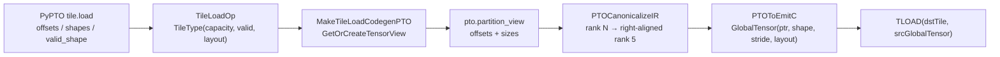
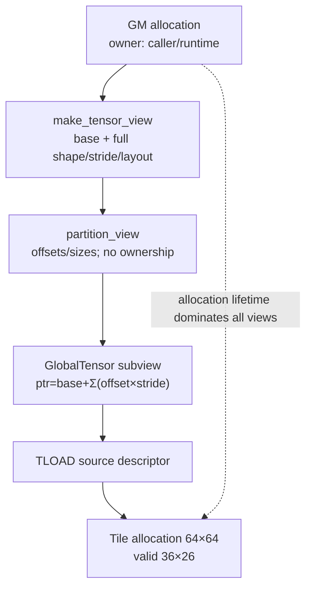

> 本章基于 [`pypto@ba15fd66`](https://github.com/hw-native-sys/pypto/commit/ba15fd66f929de7c03d04f4a4cae7f5751d56bc2) 与 [`PTOAS@fe5594af`](https://github.com/hw-native-sys/PTOAS/commit/fe5594af84793c48487d4309d8092c3b6b44a0e9)。PyPTO 当前工具链实际固定 [`PTOAS v0.57`](https://github.com/hw-native-sys/pypto/blob/ba15fd66f929de7c03d04f4a4cae7f5751d56bc2/toolchain/versions.env)，所以 PTOAS 主干只用于解释当前实现与潜在漂移，不能等同于 PyPTO CI 的已验证组合。本次没有运行 PTOAS、CPU-SIM 或 Ascend 真机；“测试事实”来自仓库回归测试，“硬件行为”只在公开代码能闭合时陈述。

## 本篇在 PTO 课程路线中的位置

前八章从 PTO ISA 向下建立了 `GlobalTensor → TLOAD → Tile` 的设备侧模型，并用 tail GEMM 确认 `capacity ≥ aligned envelope ≥ semantic valid`。今天第一次反向走到上层：PyPTO 的一个 `tile.load`，如何把逻辑窗口变成 PTOAS 能消费的 `partition_view`，又如何变成 pto-isa `TLOAD` 所信任的地址描述符。

只研究两个紧密因果点：

1. PyPTO 如何区分 `shapes` 与 `valid_shape` 并生成 `partition_view + alloc_tile + tload`；
2. PTOAS 如何把 partition 的多维坐标降成 `GlobalTensor(base + Σ offset×stride)`。

## 前置知识

- `GlobalTensor` 不拥有 GM allocation；pointer、element stride、shape、layout 共同定义视图。
- Tile 的静态 `shape` 是资源容量，`valid_shape` 是本次真实语义域。
- stride 的单位是**元素**，不是字节；pointer 加法最终由 C++ 元素类型换算字节。
- TLOAD 只应该搬运有效矩形，invalid 区域没有默认清零承诺。

## 今日核心维护问题

如果把这条链误解成“算一个 flat pointer 再 DMA”，会漏掉四个 contract：

- logical offsets 与物理 stride 的单位；
- 低 rank 到硬件五维描述符的 right-alignment；
- partition 的 shape 与目标 Tile capacity/valid 的区别；
- layout 与 stride 各自负责什么。

维护者应能回答：修改 `tile.load` 的 shape 推导、offset 类型或 layout 时，哪一层会改变地址，哪一层只改变描述，哪一层必须增加 verifier。

## PTO 全栈中的位置



PyPTO 是语义 owner：决定请求窗口、目标 Tile capacity 与有效域。PTO dialect 的 `partition_view` 是跨仓 ABI：保存“从哪个 TensorView、从哪里开始、视图多大”。PTOAS 是表示与地址 owner：规范 rank、构造 descriptor、生成 C++。pto-isa 的 `TLOAD` 是消费者，不再重算上层窗口。

## PyPTO：从 TileLoadOp 到 partition_view

### 1. 类型推导先确定语义，不先算地址

[`DeduceTileLoadType`](https://github.com/hw-native-sys/pypto/blob/ba15fd66f929de7c03d04f4a4cae7f5751d56bc2/src/ir/op/tile_ops/memory.cpp#L63-L170) 接收 `tensor, offsets, shapes, valid_shape`。它要求维数一致且非空；source 可以是 `TensorType` 或 `DistributedTensorType`。

这里最重要的分工是：

- `shapes`：结果 Tile 的物理 capacity，必须能静态进入 `TileType`；
- `valid_shape`：真正从 source 读取的矩形；缺省时回退为 `shapes`；
- 同 rank window 会把 requested valid 与 source 的 physical/effective valid 求交；
- source layout 还会影响结果 `TileView`，尤其 Mat 路径不能把 DN/NZ 当作普通二维 row-major。

因此 tail load 可以申请 `64×64` Tile，却只声明 `36×26` 有效；这与上一章的三层 tail contract 是同一条不变量在上层的表达。

### 2. codegen 创建两个相互约束的对象

[`MakeTileLoadCodegenPTO`](https://github.com/hw-native-sys/pypto/blob/ba15fd66f929de7c03d04f4a4cae7f5751d56bc2/src/backend/common/pto_ops_memory.cpp#L84-L157) 做三件事：

1. `GetOrCreateTensorView(tensor)` 把 Tensor 变成携带 base/shape/stride/layout 的 source view；
2. 用 offsets 与 **valid_shape** 生成 `pto.partition_view`；
3. 让该 view 作为 `pto.tload` 的 `ins`，让预先分配的 Tile buffer 作为 `outs`。

简化 IR 是：

```mlir
%src = pto.make_tensor_view %base, shape=[...], strides=[...]
%part = pto.partition_view %src,
          offsets=[%off0, %off1],
          sizes=[%valid0, %valid1]
%dst = pto.alloc_tile ... shape=[64,64], valid=[%valid0,%valid1]
pto.tload ins(%part) outs(%dst)
```

这里没有额外 `pto.set_validshape`。PyPTO 的动态 shape 测试明确检查 partition 的 sizes 与 alloc_tile 的 `v_row/v_col` 使用同一组 SSA 值：[`test_dynamic_shape.py#L185-L221`](https://github.com/hw-native-sys/pypto/blob/ba15fd66f929de7c03d04f4a4cae7f5751d56bc2/tests/ut/codegen/test_dynamic_shape.py#L185-L221)。这形成一个强不变量：**source view 的可读矩形与 destination Tile 的语义有效矩形必须一致**。

### 3. offset 的下界策略值得警惕

[`GetIndexOffsetCodes`](https://github.com/hw-native-sys/pypto/blob/ba15fd66f929de7c03d04f4a4cae7f5751d56bc2/src/backend/common/pto_ops_shared.cpp#L102-L138) 把 offset 统一转为 `index`。静态负数被改为 0；动态值通过 `arith.maxsi(offset, 0)` clamp。

这是代码事实，但不是“输入已验证合法”的证据。它避免负 pointer，却会把错误请求静默改成另一个合法位置。更根本的 contract 应是：

```text
0 <= offset[d]
offset[d] + size[d] <= source effective extent[d]
```

当前链路能看到下界 clamp，却没有看到对所有动态场景统一、可观测的上界失败路径。维护时不能把 clamp 当 verifier；至少应在 IR verifier 或运行时 guard 中明确错误策略。

## PTOAS：视图不是 copy，而是 descriptor rebase

### 1. rank N 先统一成 right-aligned rank 5

[`PTOCanonicalizeIR.cpp`](https://github.com/hw-native-sys/PTOAS/blob/fe5594af84793c48487d4309d8092c3b6b44a0e9/lib/PTO/Transforms/PTOCanonicalizeIR.cpp#L44-L260) 将低 rank `TensorView/PartitionTensorView` 统一成五维：

- shape 左侧补 1；
- offsets 左侧补 0；
- sizes 左侧补 1；
- 原始维保持在最右侧。

二维 `[R,C]` 因而成为 `[1,1,1,R,C]`。这是表示规范化，不是 transpose，也没有数据搬运。对二维地址，新增维的 offset 全为 0，所以真正参与定位的仍是最后两维。

### 2. make_tensor_view 建立 base descriptor

[`buildRuntimeGlobalTensor`](https://github.com/hw-native-sys/PTOAS/blob/fe5594af84793c48487d4309d8092c3b6b44a0e9/lib/PTO/Transforms/PTOToEmitC.cpp#L8007-L8069) 与 [`PTOMakeTensorViewToEmitC`](https://github.com/hw-native-sys/PTOAS/blob/fe5594af84793c48487d4309d8092c3b6b44a0e9/lib/PTO/Transforms/PTOToEmitC.cpp#L8125-L8151) 构造：

```text
GlobalTensor<Element, Shape5D, Stride5D, Layout>(
    base_pointer, runtime_shape, runtime_stride)
```

front padding 的 shape 是 1；缺省 leading stride 按累计乘积补出。layout 被保留在 descriptor 类型中。注意：layout 决定坐标如何解释和指令如何特化，stride 决定相邻坐标实际跨多少元素；二者不能互相替代。

### 3. partition_view 只改 pointer 与 view shape

动态和静态两条 lowering 分别位于 [`PTOToEmitC.cpp#L8216-L8293`](https://github.com/hw-native-sys/PTOAS/blob/fe5594af84793c48487d4309d8092c3b6b44a0e9/lib/PTO/Transforms/PTOToEmitC.cpp#L8216-L8293) 与 [`#L8296-L8415`](https://github.com/hw-native-sys/PTOAS/blob/fe5594af84793c48487d4309d8092c3b6b44a0e9/lib/PTO/Transforms/PTOToEmitC.cpp#L8296-L8415)。核心都可归约为：

```text
linear_offset = Σ(offset[d] * source_stride[d])
partition_ptr = source.data() + linear_offset
partition = GlobalTensor(
    partition_ptr,
    shape = partition_sizes,
    stride = source_stride,
    layout = source_layout)
```

因此 `partition_view`：

- 不分配、不复制、不拥有内存；
- pointer 向窗口起点 rebase；
- shape 收缩为 partition sizes；
- stride 与 layout 继承 source，因此仍能描述非连续 row；
- 生命周期不得超过 source allocation。



最后 [`PTOTLoadToTLOAD`](https://github.com/hw-native-sys/PTOAS/blob/fe5594af84793c48487d4309d8092c3b6b44a0e9/lib/PTO/Transforms/PTOToEmitC.cpp#L4801-L4823) 只生成 `TLOAD(dst, src)`。它不再检查 offset，也不重建 stride。地址正确性已被前面的 descriptor 链“提交”；任何 OOB 都必须更早阻断。

## 具体 shape、Tile 与地址演算

设 source `A`：

- dtype `fp32`；
- physical shape `[128,128]`；
- ND element stride `[128,1]`；
- effective valid `[100,90]`。

请求 tail：

- offsets `[64,64]`；
- Tile capacity `[64,64]`；
- requested valid `[36,26]`。

PyPTO 得到的 partition sizes 是 `[36,26]`，目标仍是 capacity `64×64`、valid `36×26`。PTOAS 计算：

```text
element_offset = 64×128 + 64×1 = 8256
byte_offset    = 8256×sizeof(fp32) = 33024
```

canonical partition shape 是 `[1,1,1,36,26]`；最后两维 stride 仍为 `[128,1]`。左补维的 offset 为 0，因此其补齐 stride 不改变本例地址。

TLOAD 的语义结果是：把 source 左上角位于 `A[64,64]`、大小 `36×26` 的有效矩形写入 `64×64` Tile。Tile 其余 `64×64−36×26=3160` 个位置不能假设为 0。后续算子必须继续尊重 valid，或在扩大读取域前显式初始化 padding。

PTOAS 的 [`issue995 回归`](https://github.com/hw-native-sys/PTOAS/blob/fe5594af84793c48487d4309d8092c3b6b44a0e9/test/lit/pto/issue995_cmo_partition_view_emitc.pto#L18-L74) 用 32×32 ND、offset `[1,2]` 检查非零 subview；其元素偏移是 `1×32+2=34`。这证明 partition 的 stride address 也被 CMO 等消费者复用，不是 TLOAD 私有逻辑。

## N-D Tile flatten 的一个例外

硬件 Tile 最终是二维，但 source Tensor 可高于二维。[`FlattenTileNDTo2D rewrite`](https://github.com/hw-native-sys/pypto/blob/ba15fd66f929de7c03d04f4a4cae7f5751d56bc2/src/ir/transforms/flatten_tile_nd_to_2d/rewrite.cpp#L641-L779) 对普通 Vec load 可保留 N-D source offsets/shapes，同时把结果 Tile flatten 为 2D。

自然 Mat load 需要 ND2NZ 时则更严格：它会先把 source window collapse 成真正的二维 TensorView，并要求 leading valid sub-box row-major contiguous。原因不是 API 偏好，而是 ND2NZ 的 GlobalTensor 输入边界不能任意接受 rank>2。若改这个 pass，必须同时审查 layout、contiguity proof 与 PTOAS operand verifier。

## 为什么保留 GlobalTensor descriptor

一个看似更简单的替代设计是：PyPTO 直接计算 raw pointer，另外传 sizes 给 TLOAD。它省掉 `partition_view`，但会失去：

- source stride/layout 的结构化信息；
- CMO、TSTORE、gather/scatter 对同一 view 的复用；
- 对动态、非连续视图做统一 verifier/canonicalization 的位置；
- provenance 与生命周期在 IR 中的可见性。

另一个替代是把子矩形先 copy 成 contiguous 临时 Tensor。它让 TLOAD 变简单，却增加 GM 流量、临时 allocation 与同步，并破坏 zero-copy subview。

当前 descriptor 方案更符合根本约束：地址计算集中一次，消费者共享同一视图。但代价是 PyPTO/PTOAS 形成跨仓 ABI，静态与动态 lowering 两条路径必须保持等价。

## 性能、正确性与硬件约束

- **性能**：partition 本身零拷贝；收益是避免 materialize。它不保证 DMA 连续，stride 过大仍可能形成多 burst/gap。
- **整数宽度**：[`issue157_64bit_view_offset_emitc.pto`](https://github.com/hw-native-sys/PTOAS/blob/fe5594af84793c48487d4309d8092c3b6b44a0e9/test/lit/pto/issue157_64bit_view_offset_emitc.pto#L12-L35) 明确要求动态 offset 在 EmitC 中为 signed `int64_t`，并禁止 unsigned 回归。这防止 32-bit 截断与负值无符号 wrap，但没有证明乘加永不溢出。
- **并发**：view 不拥有 allocation；异步 TLOAD 完成前，runtime 不能释放或复用 backing storage。
- **graphability**：动态 offsets/sizes 作为 SSA 与 runtime descriptor 字段传递，没有 host-side shape 分支，更利于图捕获；但地址/shape buffer 必须在 replay 时可更新且生命周期稳定。
- **正确性**：final TLOAD 只信任 descriptor。所有 rank、layout、bounds、dtype/location 错误都应在 IR/PTOAS verifier 或调用前 guard 暴露。

## 测试证据与未覆盖风险

已闭合的仓库测试：

1. PyPTO [`test_dynamic_shape.py`](https://github.com/hw-native-sys/pypto/blob/ba15fd66f929de7c03d04f4a4cae7f5751d56bc2/tests/ut/codegen/test_dynamic_shape.py#L185-L221) 验证动态 sizes 同时进入 partition 与 Tile valid，且不生成冗余 set-valid；
2. PTOAS issue157 验证动态 offset 的 signed 64-bit EmitC；
3. PTOAS issue995 验证 nonzero partition offset 进入具体 stride address；
4. [`tensor_view_layout_dn.py`](https://github.com/hw-native-sys/PTOAS/blob/fe5594af84793c48487d4309d8092c3b6b44a0e9/test/samples/Layout/tensor_view_layout_dn.py) 覆盖 DN layout 从 make-view 到 partition 再到 TLOAD/TSTORE 的保留。

仍缺最小 CI guard：

- 动态 `offset+size > source extent` 应失败而不是截断或继续生成；
- 动态负 offset 的 clamp 行为应有显式 API contract，最好同时测试 strict-error 模式；
- 64-bit `offset×stride` 靠近极值时应检测 overflow；
- static/dynamic partition 两条 lowering 对同一输入生成等价 pointer/shape/stride；
- rank>2 Mat collapse 的不连续 valid box 必须稳定拒绝；
- 用 poison 填充 invalid Tile 区，证明下游不越 valid 读取。

## 跨版本漂移与修改检查表

PyPTO 当前 [`versions.env`](https://github.com/hw-native-sys/pypto/blob/ba15fd66f929de7c03d04f4a4cae7f5751d56bc2/toolchain/versions.env) 固定 PTOAS v0.57；今天 PTOAS 主干不是该 release 的同义词。修改这一区域时必须检查：

- PyPTO `TileLoadOp`、flatten pass 与 codegen 是否仍输出 v0.57 接受的 dialect；
- `partition_view` parser/type/verifier 与 GlobalTensor template 形状是否漂移；
- static/dynamic descriptor lowering 是否同步修改；
- TLOAD、TSTORE、CMO、MGATHER/MSCATTER 等所有 partition consumer；
- Python unit、PTOAS lit、CPU-SIM、A2/A3/A5 CI；
- offset/sizes 的序列化类型和 signed width；
- pto-isa/runtime pin 是否与构建时 PTOAS 产物兼容。

[`PTOAS commit 305a206`](https://github.com/hw-native-sys/PTOAS/commit/305a2064c924e659e75f516700d54353b8f879a2) 曾修复 static/dynamic `GlobalTensor` 模板参数间非法 cast，正说明 descriptor 类型变化会波及非 TLOAD 消费者。

## 与前后章节的连接

本章把课程 05 的“五维 GlobalTensor 地址公式”和课程 08 的“capacity/valid ownership”接到生成链上：

```text
PyPTO logical window
→ PTO partition descriptor
→ PTOAS rank-5 canonical form
→ EmitC GlobalTensor pointer/shape/stride/layout
→ pto-isa TLOAD valid transfer
```

下一章回到尚未闭合的并发状态机：结合最新 TPipe pending-credit 修复，逐拍演算默认 depth 下的 ready/free credit、wrap-around、连续 dispatch 与析构 drain。

## 本篇结论

- `partition_view` 是零拷贝、无所有权的逻辑 subview，不是临时 Tensor。
- PyPTO 用 `shapes` 决定 Tile capacity，用 `valid_shape` 同时约束 partition sizes 与目标 Tile valid。
- PTOAS 把 rank N right-align 到 rank 5，再以 `Σ(offset×element_stride)` rebase pointer；shape 收缩，stride/layout 继承。
- `TLOAD(dst,src)` 不再重算地址，因此 bounds、整数宽度与 descriptor 一致性必须在更早层守住。
- 当前最高风险不是公式本身，而是动态 OOB 策略不闭合、static/dynamic lowering 重复、PyPTO 固定 v0.57 与 PTOAS 主干的跨版本漂移。

### 三个理解检查问题

1. 为什么 `partition_view sizes=[36,26]` 不等于目标 Tile capacity 也必须是 36×26？
2. right-align 到五维为什么不改变二维窗口的 base address？
3. 如果把 dynamic negative offset clamp 到 0，系统避免了什么，又隐藏了什么？

## 课程账本增量

- 阶段：从 PTO ISA 基础转入“ISA 如何由上层生成”的第一条跨仓 lowering。
- 新覆盖：PyPTO `DeduceTileLoadType`、`MakeTileLoadCodegenPTO`、`EmitPartitionViewPTO`、`FlattenTileNDTo2D`；PTOAS `PTOCanonicalizeIR`、`PTOMakeTensorViewToEmitC`、`PTOPartitionViewToEmitC`、`PTOTLoadToTLOAD`。
- 新不变量：partition offsets/strides 均以元素计；right-align 是表示变化而非 copy；partition 不拥有 allocation；partition sizes 与 Tile valid 共享语义域；final TLOAD 信任 descriptor。
- 新知识债：动态上界/OOB 失败策略、64-bit 乘加 overflow、static/dynamic lowering 等价性、v0.57 与主干 ABI drift。
- 下一章：TPipe pending-credit、wrap-around 与 drain 状态机。

