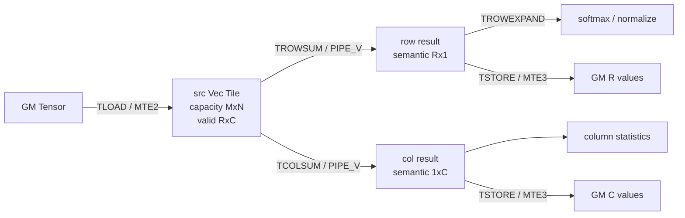
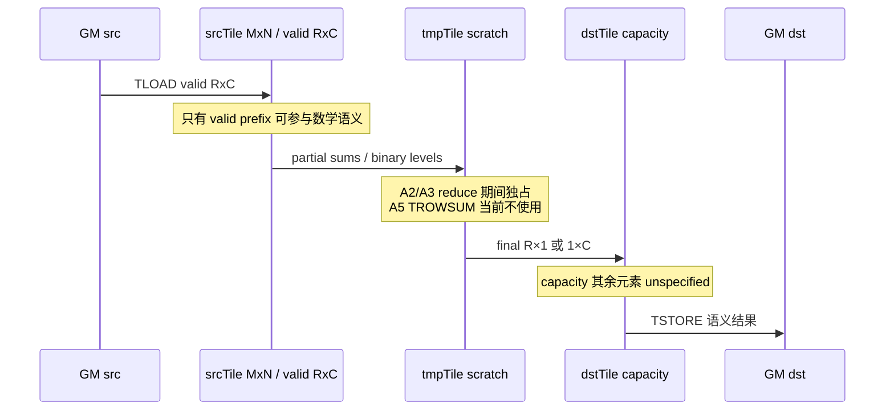

> 本章基于 [`pto-isa@f71e7dde`](https://github.com/hw-native-sys/pto-isa/commit/f71e7dde08e27719e35dd2648bb1b4ec0cdc928e)。代码、规范和测试均来自该提交；[`95f5fcd7`](https://github.com/hw-native-sys/pto-isa/commit/95f5fcd7b37e7db397257e8b83a2eb5b7b3bef04) 是直接相关的已合入测试修复。本次没有运行 A2/A3 或 A5 真机实验，性能结论只做机制分析，不把静态推导冒充设备测量。

## 本篇在 PTO 课程路线中的位置

前十章已经建立 Tile 的 capacity/valid 双层语义、GM→L1/L0 的搬运、Cube GEMM 和 TPipe 生命周期。今天回到 Vector pipe，只讲一组紧密关联的指令：`TROWSUM` 与 `TCOLSUM`。

这组指令是 elementwise 走向 softmax、normalization 和统计 kernel 的关键拐点：输入仍是二维 Vec Tile，但一个维度被消去；归约顺序开始影响浮点结果；临时 Tile 不再只是“放得下”，而是算法路径的一部分。

## 前置知识

- Tile 静态 `Rows×Cols` 是资源盒子；`GetValidRow()/GetValidCol()` 才是本次运行的语义域。
- valid region 是左上角连续前缀，不是任意 mask；区外值默认 unspecified。
- `TLOAD` 属于 MTE2，reduce 属于 Vector pipe，`TSTORE` 属于 MTE3；手写模式必须闭合跨 pipe Event。

## 今日两个核心问题

1. `TROWSUM` 与 `TCOLSUM` 到底消去哪一维，输出 Tile 的哪些元素才是有定义的？
2. sequential、binary-tree 与 backend-specific reduce 为什么数学上同为 sum，数值、scratch 和同步成本却不同？

## PTO 全栈中的位置



上游提供已经加载到 UB/Vec location 的 ND Tile；下游可以直接 store，也可以通过 expand 把归约结果广播回二维域。仓库的 [row-softmax 教程](https://github.com/hw-native-sys/pto-isa/blob/f71e7dde08e27719e35dd2648bb1b4ec0cdc928e/docs/coding/tutorials/row-softmax.md#L3-L35) 给出的真实组合正是 `TROWMAX → TROWEXPAND → TEXP → TROWSUM → TROWEXPAND → TDIV`。

## 概念与精确语义

设源 Tile 的 valid shape 为 `R×C`。

`TROWSUM` 对每一行跨列求和：

\[
dst[i,0]=\sum_{j=0}^{C-1}src[i,j],\quad 0\le i<R
\]

所以它保留 row、消去 column，语义输出是 `R×1`。规范同时要求源为 Vec/ND；目标可为 ND，也可为 `Cols==1` 的 DN，且 `src.validRow == dst.validRow`。完整约束见 [`TROWSUM.md`](https://github.com/hw-native-sys/pto-isa/blob/f71e7dde08e27719e35dd2648bb1b4ec0cdc928e/docs/isa/TROWSUM.md#L12-L73)。

`TCOLSUM` 对每一列跨行求和：

\[
dst[0,j]=\sum_{i=0}^{R-1}src[i,j],\quad 0\le j<C
\]

它保留 column、消去 row，语义输出是 `1×C`。A2/A3 路径要求 src/dst/tmp 都是 Vec、ND、同 dtype；`src.validCol == dst.validCol`。具体定义见 [`TCOLSUM.md`](https://github.com/hw-native-sys/pto-isa/blob/f71e7dde08e27719e35dd2648bb1b4ec0cdc928e/docs/isa/TCOLSUM.md#L12-L81)。

最容易误解的一点是：**静态 capacity 没被消去，只有语义域被降维。** `TROWSUM` 只定义目标第 0 列，`TCOLSUM` 只定义目标第 0 行；目标 allocation 中其余字节不能作为结果读取。规范没有承诺清零，也没有承诺保持旧值。

## 真实文件、类型与实现逐段解读

### 1. `TROWSUM`：连续列上的横向归约

A2/A3 的入口 [`TROWSUM_IMPL`](https://github.com/hw-native-sys/pto-isa/blob/f71e7dde08e27719e35dd2648bb1b4ec0cdc928e/include/pto/npu/a2a3/TRowSum.hpp#L156-L166) 读取 src valid shape，检查布局、dtype、非零维度和行数一致，再进入两类实现：

- `half/float`：使用 `vcadd/vcgadd` 与 `vadd` 分层缩减。小于等于一个 vector repeat 时直接 masked reduce；更宽的行先把 repeat 分组写入 `tmp`，再树形合并，最终缩成每行一个值。主状态机在 [`TRowReduceInstr`](https://github.com/hw-native-sys/pto-isa/blob/f71e7dde08e27719e35dd2648bb1b4ec0cdc928e/include/pto/npu/a2a3/TRowReduceOps.hpp#L272-L336)。
- `int16/int32`：每行复用一个 block 的 `tmp` accumulator，逐 block `vadd`，不足 block 的尾部用 mask；最后发生一次 V→S，同步后由 scalar 累加 block 内 lanes，再 S→V 返回。见 [`TRowSum.hpp`](https://github.com/hw-native-sys/pto-isa/blob/f71e7dde08e27719e35dd2648bb1b4ec0cdc928e/include/pto/npu/a2a3/TRowSum.hpp#L114-L154)。

A5 的 [`TROWSUM_IMPL`](https://github.com/hw-native-sys/pto-isa/blob/f71e7dde08e27719e35dd2648bb1b4ec0cdc928e/include/pto/npu/a5/TRowReduce.hpp#L457-L473) 使用 vector-register reduction；接口仍保留 `tmp` 以兼容 A2/A3，但当前 A5 路径不消费它。这是 ABI 一致、资源需求不一致的典型例子：调用方不能据 A5 的实现删除公共 `tmp` operand，否则会破坏跨代编译接口。

### 2. `TCOLSUM`：跨 row-stride 的纵向归约

A2/A3 提供两种策略：

- `SequentialSum`：先把 row 0 复制到 dst，再按行执行 `dst += src[row]`，依赖链深度约为 `R-1`。
- `BinarySum`：相邻行先写入 tmp，再不断两两合并；奇数行并入当前树，直到只剩一行。

两者分别位于 [`BinarySum/SequentialSum`](https://github.com/hw-native-sys/pto-isa/blob/f71e7dde08e27719e35dd2648bb1b4ec0cdc928e/include/pto/npu/a2a3/TColSum.hpp#L19-L49)，由 [`TCOLSUM_IMPL`](https://github.com/hw-native-sys/pto-isa/blob/f71e7dde08e27719e35dd2648bb1b4ec0cdc928e/include/pto/npu/a2a3/TColSum.hpp#L111-L148) 按 `isBinary` 选择。binary 路径要求 `tmp.RowStride >= validCol`，容量还必须容纳首轮 `ceil(R/2)` 行；sequential 两参数 overload 不需要 tmp。

A5 保留同一策略边界，但把运算放进 vector registers，并通过 UB tmp 保存树的中间层；实现见 [`TColSum_Binary`](https://github.com/hw-native-sys/pto-isa/blob/f71e7dde08e27719e35dd2648bb1b4ec0cdc928e/include/pto/npu/a5/TColSum.hpp#L33-L129) 与 [`TCOLSUM_IMPL`](https://github.com/hw-native-sys/pto-isa/blob/f71e7dde08e27719e35dd2648bb1b4ec0cdc928e/include/pto/npu/a5/TColSum.hpp#L131-L151)。

## Tile 与 scratch 生命周期



`srcTile` 从 `TLOAD` 完成后由 Vector pipe 只读消费；`tmpTile` 在 reduction 返回前由该指令独占，不能和活跃 src/dst 别名；`dstTile` 的结果只有在 Vector→MTE3 Event 之后才能 store。对 graph/capture 场景的直接推论是：A2/A3 scratch 地址和容量也属于固定资源契约；A5 当前不读 tmp，不代表跨平台 graph key 可以省略该 operand。

## 具体 shape 与状态演算

取 capacity `4×8`、valid `R=3,C=5` 的 fp32 src：

| valid row | c0 | c1 | c2 | c3 | c4 | c5..c7 |
| --- | ---: | ---: | ---: | ---: | ---: | --- |
| r0 | 1 | 2 | 3 | 4 | 5 | padding，禁止参与 |
| r1 | 6 | 7 | 8 | 9 | 10 | padding，禁止参与 |
| r2 | -1 | 0 | 1 | 0 | -1 | padding，禁止参与 |
| r3 | padding | padding | padding | padding | padding | padding |

`TROWSUM` 得到语义 `3×1`：`[15, 40, -1]^T`。目标若静态 capacity 是 `4×8`，也只有 `(0,0)、(1,0)、(2,0)` 被定义；其余 29 个位置不是零。

`TCOLSUM` 得到语义 `1×5`：`[6,9,12,13,14]`。binary 路径首轮可形成：

```text
tmp[0,:] = r0 + r1
odd r2    = tmp[0,:] + r2
dst[0,:] = tmp[0,:]
```

结果相同，但对浮点数，`(r0+r1)+r2` 与 sequential 的逐行累加只是实数代数等价，不保证 bitwise 相同。

## 为什么这样设计，以及替代方案

最小正确实现是 scalar 双循环，CPU simulator 就以这类语义作为 reference。设备实现增加 vector reduce、mask、tmp 和特殊 shape fast path，是因为真正瓶颈是 UB 向量吞吐和依赖深度，而不是源代码行数。

对 `TCOLSUM`，sequential 的优势是零 scratch、控制简单、UB traffic 少；代价是 `R-1` 条强依赖。binary tree 将依赖深度降到约 `ceil(log2 R)`，但需要 tmp、更多 UB 读写和 barrier。正确选择条件不是“binary 永远快”，而是：

```text
被缩短的依赖等待 > 新增 tmp traffic + barrier + setup
```

仓库当前没有给出覆盖真实 shape 的对照 trace，因此本文不替用户选择默认阈值。对于数值可复现性要求严格的 kernel，还必须把累加顺序视为 ABI，而不是只比较数学公式。

## 访存、计算、流水、并行与硬件约束

- 两条指令都至少读取 `R×C` 个元素，只写 `R` 或 `C` 个语义结果；算术量约 `R×(C-1)` 或 `C×(R-1)` 次加法。
- `TROWSUM` 的列方向在 ND 内连续，适合 `vcadd/vcgadd`；`TCOLSUM` 的行方向跨 `RowStride`，因此更依赖逐行向量 load/add 或 tmp tree。
- tail 由 valid row/col 和 mask 截断，padding 不能进入 sum；capacity 只负责保证指令可访问的资源包络。
- A2/A3 integer `TROWSUM` 还引入 V↔S 同步；它与纯 Vector fp 路径的延迟模型不同。
- 当前 A2/A3/A5 主路径通常要求输入输出同 dtype，意味着 fp16 sum 不自动获得 fp32 accumulator。CPU [`CheckRSValid`](https://github.com/hw-native-sys/pto-isa/blob/f71e7dde08e27719e35dd2648bb1b4ec0cdc928e/include/pto/cpu/TRowSum.hpp#L42-L57) 却允许 `half/bfloat16 → float`，这属于 simulator/device type matrix 的可见漂移，不能把 CPU 可运行等同于设备可编译。

## 测试证据与未覆盖风险

当前测试证据很具体：

- A2/A3 `TROWSUM` 覆盖 fp32/fp16/int32/int16、完整与 tail validCol，以及 `64×128、32×256、16×512、8×1024` DN-output fast paths，见 [kernel cases](https://github.com/hw-native-sys/pto-isa/blob/f71e7dde08e27719e35dd2648bb1b4ec0cdc928e/tests/npu/a2a3/src/st/testcase/trowsum/trowsum_kernel.cpp#L91-L160)。
- A2/A3 `TCOLSUM` 同时实例化 sequential/binary，覆盖 odd validRow=7/31、single row 与多种 width，见 [test kernel](https://github.com/hw-native-sys/pto-isa/blob/f71e7dde08e27719e35dd2648bb1b4ec0cdc928e/tests/npu/a2a3/src/st/testcase/tcolsum/tcolsum_kernel.cpp#L51-L101)。
- A5 `TMULS→TROWSUM` 测试构造 `64×64 fp32` 与 `16×256 fp16`，验证算术链而非孤立指令，见 [kernel](https://github.com/hw-native-sys/pto-isa/blob/f71e7dde08e27719e35dd2648bb1b4ec0cdc928e/tests/npu/a5/src/st/testcase/tmuls_trowsum/tmuls_trowsum_kernel.cpp#L29-L68)。
- 最新修复只是在 host 测试中对整块 `dstDevice` 执行 `aclrtMemset(0)`。这证明测试会比较包含非语义区的完整 allocation，而 reduce/TSTORE 不负责定义所有字节；它是 harness 初始化修复，不是 `TROWSUM` 算法改成了“清零 padding”。

仍有四个覆盖缺口：

1. golden 脚本先以 NumPy 默认高精度 accumulator 求和再 cast，不能证明设备 tree/sequential 的 bitwise 顺序或误差上界。
2. 输入值被刻意限制以避免整数 overflow，因此同 dtype 累加溢出语义未被测试。
3. 缺少 poison-padding 测试：给 capacity-invalid 区填 NaN/大数，直接断言它们不影响 valid output。
4. 缺少同一输入下 A2/A3 sequential 与 binary、A5 与 CPU 的误差 envelope/parity 测试。

## 与前后章节的连接

本章把“valid region 控制搬运范围”推进到“valid region 控制归约数学域”，并揭示 output capacity 的未定义区。下一章应沿真实 softmax 继续：`TROWMAX → TROWEXPAND → TEXP → TROWSUM → TDIV`，重点分析多 Tile 分块时 partial max/sum 如何合并，以及跨 Tile softmax 为什么不能把局部归约直接当全局归约。

## 本篇结论、知识债与理解检查

结论只有三条：

1. `TROWSUM` 定义 `R×1`，`TCOLSUM` 定义 `1×C`；静态 Tile 的其余 capacity 不是输出。
2. tmp 是算法状态而非装饰参数：A2/A3 row reduce 和 binary col reduce需要它，A5 row reduce 当前只为 ABI 保留它。
3. sum 的数学交换结合律不能替代数值契约；sequential/tree/backend 会改变依赖、流量和浮点顺序。

新增知识债：同 dtype 累加的 overflow/precision contract、CPU widening 与设备 type matrix 漂移、poison-padding guard，以及 binary/sequential 的真实设备 crossover。

理解检查：

1. capacity `16×256`、valid `15×255` 的 `TROWSUM`，目标 allocation 中哪些坐标有定义？
2. `TCOLSUM(isBinary=true)` 为什么至少需要 `ceil(R/2)` 行 tmp，而 sequential overload 可以没有 tmp？
3. 为什么 host 端先 memset 整个输出能修复测试，却不能写进 `TROWSUM` 的数学语义？

## 课程账本增量

- 新覆盖：`TROWSUM`、`TRowReduceInstr`、`TCOLSUM`、`BinarySum/SequentialSum`、A2/A3 与 A5 scratch 差异。
- 新不变量：reduce 只读 source valid prefix；只定义降维后的 semantic output；scratch 在指令完成前独占；累加顺序属于数值行为。
- 下一章：多 Tile Row Softmax 的 partial max/sum 合并与稳定归一化。
