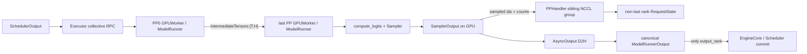
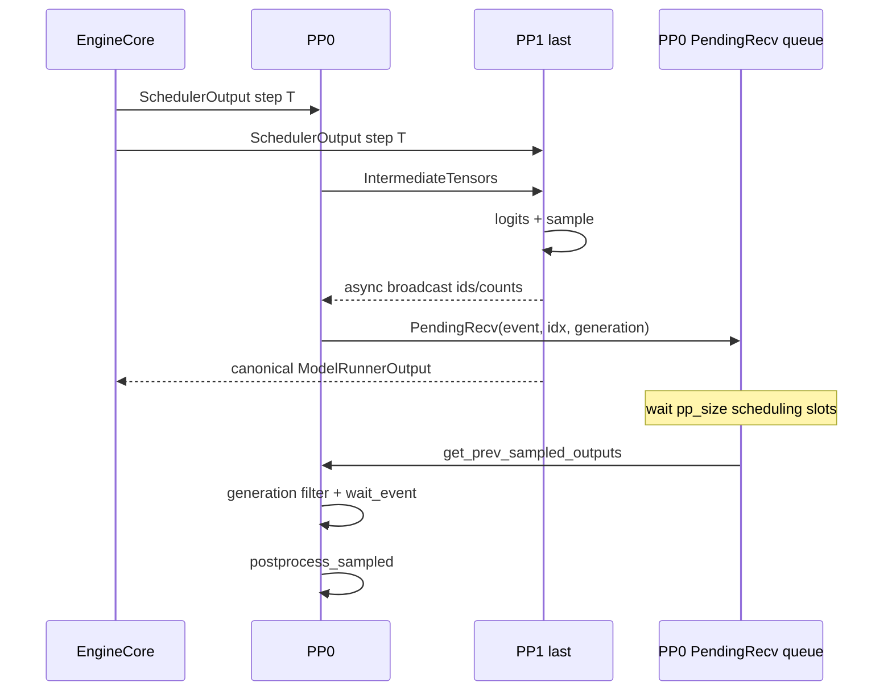

> 本文分析基于 vLLM `main` 的 [`bf2866f8`](https://github.com/vllm-project/vllm/commit/bf2866f8bf5bb20628e2b93835be3c281a9b4ca4)。链接均固定到该 commit；后文把当前代码、测试事实、未合入 PR 与推断分开陈述。

## 本篇在课程路线中的位置

前一章已经走到 `hidden_states → logits → Sampler → SamplerOutput → AsyncOutput`。单卡时，采出的 token 更新本地 request state，再经 D2H 返回 Scheduler，链路容易理解；当 `pipeline_parallel_size > 1` 时，问题变成：只有最后一个 PP stage 拥有最终 hidden states 和 LM Head，前面的 stage 却必须在后续 decode 中使用相同 token。谁采样、谁向 Scheduler 提交、其他 rank 如何追上，必须是三个不同问题。

本章位于 `Sampling → 分布式执行` 的边界，核心结论是：**vLLM 不广播整个 `SamplerOutput`；它让 last PP rank 成为采样 owner，只广播下一轮设备状态需要的最小 token 结果，而 EngineCore 只接受一个 canonical `ModelRunnerOutput`。**

## 前置知识回顾

第 09 章确认 `slot_mapping` 和 `block_table` 决定 KV 的物理地址；第 10 章确认 `SamplerOutput.sampled_token_ids` 尚是 GPU 上的候选结果，只有 D2H 并经 Scheduler commit 后才成为外部可见 token。本章再增加一条边界：非最后 PP rank 不能自己从局部 hidden states 采样，却要在正确的未来 step 更新自己的 `all_token_ids`、`last_sampled_tokens` 和计算进度。

## 本篇要回答的核心问题

1. 为什么只有 last PP rank 执行 LM Head 和 sampling？
2. 为什么既需要 `ModelRunnerOutput → EngineCore`，又需要一次 GPU 侧 sampled-token 广播？
3. 广播结果延迟若干 step 才被消费时，request slot 被 abort、free、reuse 怎么避免 ABA 污染？
4. PP collective 的 shape、顺序和 stream 契约在哪里可能失配？

## 组件在全局架构中的位置



这里存在两条并行但职责不同的返回路径：

- **控制面**：last-PP stage 的一个 TP worker返回 `ModelRunnerOutput`，由 Scheduler 决定 token 是否提交、停止以及释放资源。
- **设备状态面**：last PP rank 将 sampled token 和接受/拒绝数量直接广播给其他 PP rank，使其本地持久 request state 为以后 forward 做好准备。

如果只保留控制面，token 必须经历 GPU→Host→EngineCore→Worker→GPU 才能让早期 stage 更新；如果只保留设备广播，EngineCore 又失去唯一的请求状态提交点。

## 完整调用链

### 1. hidden states 逐 stage 前进

[`GPUWorker.execute_model`](https://github.com/vllm-project/vllm/blob/bf2866f8bf5bb20628e2b93835be3c281a9b4ca4/vllm/v1/worker/gpu_worker.py#L1046-L1139) 在非首 stage 先用 `irecv_tensor_dict()` 接收上一 stage 的 tensor，再调用 ModelRunner。若返回的是 `IntermediateTensors`，当前 worker 使用 `isend_tensor_dict()` 发给下一 stage，发送 handle 留到下一次执行前等待，避免过早复用源 buffer。

ModelRunner V2 的 [`execute_model`](https://github.com/vllm-project/vllm/blob/bf2866f8bf5bb20628e2b93835be3c281a9b4ca4/vllm/v1/worker/gpu/model_runner.py#L1410-L1708) 明确分流：

- 非首 rank 把收到的 tensor copy 到持久 `self.intermediate_tensors`；
- 非末 rank 要求模型返回 `IntermediateTensors`；
- 末 rank 才把模型输出解释为最终 `hidden_states`，并将它暂存在 `ExecuteModelState`，等待 `sample_tokens()`。

### 2. last PP rank 独占 sampling

[`GPUModelRunner.sample_tokens`](https://github.com/vllm-project/vllm/blob/bf2866f8bf5bb20628e2b93835be3c281a9b4ca4/vllm/v1/worker/gpu/model_runner.py#L1709-L1861) 在末 rank 执行：

```text
hidden_states[logits_indices]
  → model.compute_logits
  → grammar mask
  → Sampler / RejectionSampler
  → sampled_token_ids, num_sampled, num_rejected
```

非末 rank 的 `hidden_states` 为 `None`，不会执行 LM Head。它进入 `PPHandler.receive()`，为这一步投递异步 collective，然后只完成本地 KV connector 后处理。

### 3. 最小结果走 PPHandler 广播

[`PPHandler`](https://github.com/vllm-project/vllm/blob/bf2866f8bf5bb20628e2b93835be3c281a9b4ca4/vllm/v1/worker/gpu/pp_utils.py#L52-L196) 不传 logprobs、prompt logprobs 或完整 `ModelRunnerOutput`，只传：

| 字段 | shape / dtype / device | 消费者 |
| --- | --- | --- |
| `sampled_tokens` | `[num_reqs, max_sample_len]`, `int64`, device | `post_update` 写 token 历史和 last sampled state |
| `num_sampled` | `[num_reqs]`, `int32`, device | 决定每个请求本轮实际提交宽度 |
| `num_rejected` | `[num_reqs]`, `int32`, device | 修正 speculative optimistic progress |
| `idx_mapping` | `[num_reqs]`, device | 将紧凑 batch row 映射到持久 request slot |

它创建独立 `broadcast_stream` 和 PP `device_group` 的 sibling group。代码注释给出的目的，是避免 sampled-token broadcast 与 stage 间 hidden-state P2P 在同一通信序列上互相串行。广播 stream 等待 main stream 产出 sampling 结果；接收方记录 Event，真正消费前由 main stream `wait_event()`。

### 4. Executor 只接受一个 canonical output

[`MultiprocExecutor._get_output_rank`](https://github.com/vllm-project/vllm/blob/bf2866f8bf5bb20628e2b93835be3c281a9b4ca4/vllm/v1/executor/multiproc_executor.py#L540-L552) 选择最后一个 PP stage 的第一个 TP/PCP worker。`execute_model()` 和 `sample_tokens()` 的 collective RPC 都设置 `unique_reply_rank=self.output_rank`。所以其他 worker 返回的 connector-only output 不会变成多份 Scheduler token commit。

## 关键状态生命周期：PendingRecv 与 request-slot generation

PPHandler 的难点不是广播本身，而是广播结果并不立即应用。它在非末 rank 上维护 FIFO，初始填入 `pp_size` 个 `None`：step T 的 `receive()` 将 `PendingRecv` 放进队尾，直到 T+`pp_size` 才由 [`update_pp_decode_requests`](https://github.com/vllm-project/vllm/blob/bf2866f8bf5bb20628e2b93835be3c281a9b4ca4/vllm/v1/worker/gpu/model_runner.py#L947-L956) 取出并调用 `postprocess_sampled()`。



延迟期间 request 可能结束或被抢占，原 slot 又可能分配给新 request。仅保存 `idx_mapping=3` 不足以辨别“旧 request 的 slot 3”和“新 request 的 slot 3”。因此 `PPHandler` 为每个 request index 保存 generation counter：

1. `receive()` 快照 `gen_at_receive_np`；
2. `_remove_request()` 调用 `on_req_idx_freed()` 递增 generation；
3. 消费时比较当前 generation 与快照；
4. 不一致的 row 将 `idx_mapping` 改成 `-1`，`post_update` 跳过它。

这是典型的 slot ABA guard：地址相同不代表生命周期相同。

## 具体示例与 shape / 状态演算

设 `PP=2, TP=1`，hidden size `H=4096`，两个请求 A、B 各调度一个 decode token，无 speculative decoding：

1. PP0 输出 `IntermediateTensors.hidden_states`，shape 为 `[2,4096]`，若 BF16，单边界有效载荷约 16 KiB。
2. PP1 得到最终 `[2,4096]` hidden states，LM Head 生成 `[2,V]` logits；Sampler 产生 `sampled_token_ids.shape=[2,1]`。
3. PPHandler 广播 sampled IDs：`2×1×8=16 B`；再广播 `num_sampled/num_rejected` 合并 tensor：`2×2×4=16 B`。忽略 collective 元数据，总有效载荷只有 32 B，远小于广播 `[2,V]` logits。
4. 假设 A、B 的持久 slot 为 `[7,3]`，接收 generation 为 `[12,5]`。在结果消费前 B 被 abort，slot 3 generation 变成 6；消费时 mapping 变为 `[7,-1]`，只更新 A。
5. PP1 的 AsyncOutput 做 D2H，Executor 仅把这一份 token 结果交给 Scheduler；Scheduler 对 B 的终态仍是唯一真相。

## 为什么这样设计及替代方案

**替代一：所有 rank 独立 sampling。** 非末 stage 没有最终 hidden states 与 LM Head；复制 LM Head 或广播 logits 会增加权重、显存与 `O(BV)` 通信，而且要求多 rank RNG 完全一致。维护成本和出错面都更高。

**替代二：只经 Scheduler 回传 token。** 协议简单、Host 是唯一权威，但每轮多出 D2H、IPC、H2D，并让下一轮设备准备依赖 Host 延迟，破坏 PP overlap。

**当前方案：last-rank owner + GPU 最小广播 + Host 单点提交。** 通信量接近 `O(BK)`，可与 copy/后处理重叠；代价是必须维护 collective 次序、固定 shape、延迟槽位和 generation-safe 生命周期。

## 性能、并发、正确性与边界条件

- `compute_need_sampled_mask()` 跳过非最终 prefill chunk，以及已知下一 token 后必然结束的请求。所有 rank 必须从一致的 `InputBatch` 算出相同结论，否则一边进入 collective、一边跳过会形成死锁。
- broadcast 和 receive 的 tensor 元素数必须完全一致；NCCL collective 不替应用协议协商 shape。
- `record_stream()` 保证在 broadcast stream 完成前 allocator 不回收 tensor；Event 保证 main stream 消费前数据可见。两者分别解决 lifetime 与 ordering，不能互相替代。
- PP FIFO 将吞吐 overlap 换成延迟状态机。Scheduler 必须尊重同一请求再次 decode 的 cadence，尤其 speculative tokens 会乐观扩大进度时。
- Executor 的 `output_rank` 规则是控制面不变量；若多个 rank 的 `ModelRunnerOutput` 被聚合为 token 结果，同一 position 可能重复提交。

## 测试证据与未覆盖风险

**测试事实。** [`test_pp_dp_v2.py`](https://github.com/vllm-project/vllm/blob/bf2866f8bf5bb20628e2b93835be3c281a9b4ca4/tests/v1/distributed/test_pp_dp_v2.py) 用 4 GPU、`DP=2, PP=2, TP=1`，同时覆盖 sync/async scheduling、单请求、64 并发、decode 中途 abort 和 pause/resume；断言请求能产出指定 token 数且 engine 在 abort storm 后仍可服务。这证明了若干真实分布式组合能够闭环。

[`test_gpu_model_runner.py`](https://github.com/vllm-project/vllm/blob/bf2866f8bf5bb20628e2b93835be3c281a9b4ca4/tests/v1/worker/test_gpu_model_runner.py#L343-L394) 则确认 legacy runner 只在 async PP 非末 rank 接收 sampled IDs，并检查 sync/async 两 rank 的 token buffer 状态一致；但它使用 mock group，没有验证真实 NCCL shape 和 collective 顺序。

**当前缺口。** 主干没有 `tests/v1/worker/test_pp_utils.py`，现有 4-GPU E2E 主要验证长度和存活性，未逐项断言 `PendingRecv` 的 generation 过滤、每个 position 的 PP1→PP0 token 一致、spec 多 token shape 或 draft state 收敛。

**未合入计划/风险证据。** 开放 PR [#46994](https://github.com/vllm-project/vllm/pull/46994) 指出当前 `receive()` 固定申请 `[num_reqs,max_sample_len]`，而 `broadcast()` 直接发送 sampler 的自然宽度；PP+MTP 在宽度为 1 与 `K+1` 间变化时可能 count mismatch，并且 draft tokens 尚未同步给非末 rank。开放 PR [#52179](https://github.com/vllm-project/vllm/pull/52179) 还在修正 sync scheduling 下 speculative decode 早于 sampled-token relay 再次入场的问题。两者截至本文基线均未合入，因此是风险与拟议修复，不能写成当前已解决事实。

最小 CI guard 应直接构造 PPHandler 的 `K=3` 宽度变化、部分 request finish、slot free/reuse 和 collective skip 对称性；再用 PP=2 对 greedy token IDs 做 PP=1 parity，而不只比较输出长度。

## 与前后章节的连接

向前，本章解释了第 10 章 `SamplerOutput` 在分布式场景下的两个消费者：AsyncOutput 面向 Scheduler，PPHandler 面向其他 device rank。向后，下一章将沿 Executor 的 output rank 与 Ray/Multiproc DAG，分析 `TP × PP` 下 `SchedulerOutput` 如何复制到所有 worker、`IntermediateTensors` 如何沿 PP 边流动，以及部分 rank 失败为何不能当作普通空输出。

## 本篇结论、知识债与理解检查

结论：PP sampling 的正确性不是“各 rank 得到相同返回值”，而是两种收敛同时成立——EngineCore 只收到一次 canonical commit，所有设备 rank 在使用下一 token 前收敛到同一 request generation 的 token 状态。

新增知识债：

- PPHandler spec 宽度、draft token relay 与 sync cadence 的开放 PR 尚未落地；
- 缺少 generation filter 和 collective 对称性的直接单测；
- PP queue cadence 与 Scheduler `next_decode_eligible_step` 在 sync/async、preemption、spec rejection 组合下尚未形成一份统一协议；
- Ray compiled DAG、Multiproc collective RPC 与 external launcher 的 PP 返回边界仍需逐一对照。

理解检查：

1. 为什么已经有 `ModelRunnerOutput → SchedulerOutput` 回路，仍需 PPHandler 的 GPU 广播？
2. `idx_mapping` 为什么不足以保护延迟到达的 sampled token，generation counter 又保护了什么？
3. 如果某 rank 判断“无需广播”而另一个 rank 判断“需要接收”，最可能表现为数值错误、重复 token，还是 collective hang？

## 课程账本增量

- 新增符号：`GPUModelRunner.execute_model/sample_tokens`（V2）、`PPHandler`、`PendingRecv`、`compute_need_sampled_mask`、`update_pp_decode_requests`、`postprocess_sampled`、`MultiprocExecutor._get_output_rank`。
- 新增不变量：last PP rank 是 sampling owner；EngineCore 只接收 last-PP/TP0 canonical output；PP 设备状态广播必须满足 collective 对称、shape 一致和 generation-safe 延迟消费。
- 下一章：`TP × PP Executor DAG`——SchedulerOutput fan-out、IntermediateTensors stage chain、唯一返回 rank 与故障传播。
