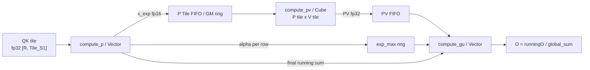
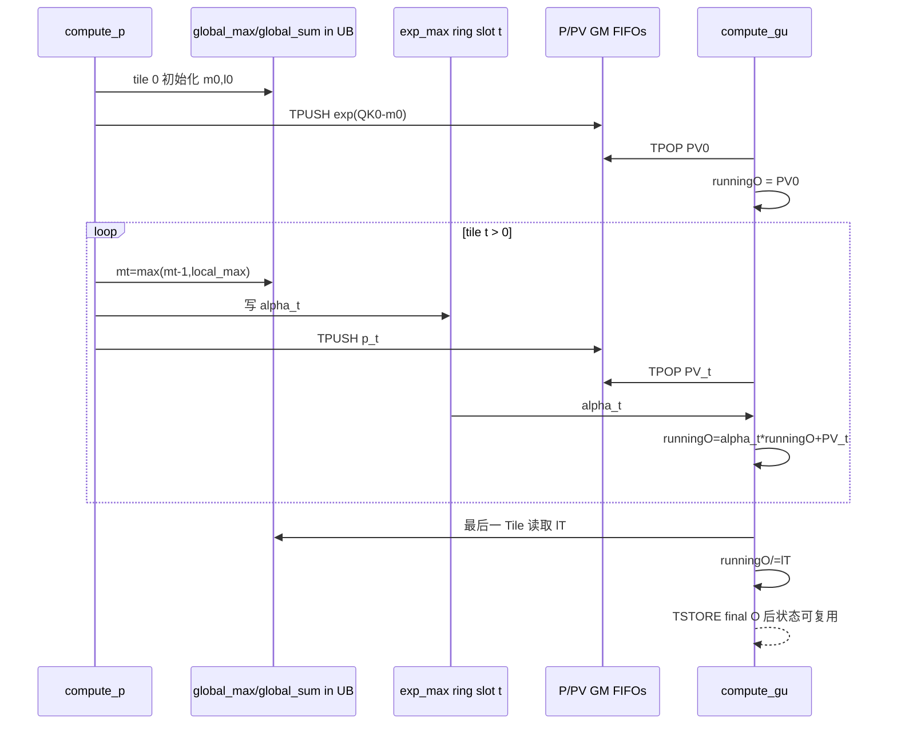

> 本章基于 [`pto-isa@ec75fcfd`](https://github.com/hw-native-sys/pto-isa/commit/ec75fcfd23c59b9dfb8f22e6531d9fa3dd8b5769)。当前代码事实来自该提交；性能数字只引用已合入 [PR #136](https://github.com/hw-native-sys/pto-isa/pull/136) 的作者测量，本次没有运行 A2/A3 真机或 CPU simulator，不把静态演算写成实验结论。

## 本篇在 PTO 课程路线中的位置

上一章确认了单个 Vec Tile 上 `TROWMAX/TROWSUM` 的 valid-prefix 和 scratch 契约。今天不再重复单 Tile softmax，而是回答一个更接近真实 attention 的问题：当一行 logits 宽到无法驻留一个 Tile 时，怎样逐 Tile 处理，却得到与整行稳定 softmax 相同的结果？

课程仍处于 ISA 第一阶段，但第一次把多个 reduce/elementwise 指令、TPipe transport 和一个跨循环状态机连成真实 FlashAttention building block。

## 前置知识

- `TROWMAX([R,C]) → [R,1]`、`TROWSUM([R,C]) → [R,1]` 只读取 source valid prefix。
- softmax 必须减去行最大值，否则 `exp` 容易溢出；只对每个 Tile 减自己的局部最大值，不能直接拼出全局结果。
- `Tile` capacity 是资源盒子，valid region 是数学域；Event/TPipe 决定生产结果何时可见以及 ring slot 何时可复用。

## 今日核心问题

1. 为什么局部 softmax 不能直接拼接？跨 Tile 最少必须保留哪些状态？
2. `m2_global_max`、`l2_global_sum`、`l1_exp_max_ififo` 和 `runningOTile` 分别由谁拥有、何时更新、何时失效？

## PTO 全栈中的位置



上游 `compute_qk` 产生 fp32 QK Tile；`compute_p` 维护 online softmax 状态并把未归一化指数转成 fp16 P Tile；`compute_pv` 做第二次 Cube matmul；`compute_gu` 用同一个重标定因子更新 fp32 输出分子。真实调用位置见 [`compute_p`](https://github.com/hw-native-sys/pto-isa/blob/ec75fcfd23c59b9dfb8f22e6531d9fa3dd8b5769/kernels/manual/common/flash_atten/fa_performance_kernel.cpp#L428-L550) 与 [`compute_gu`](https://github.com/hw-native-sys/pto-isa/blob/ec75fcfd23c59b9dfb8f22e6531d9fa3dd8b5769/kernels/manual/common/flash_atten/fa_performance_kernel.cpp#L556-L604)。

## 概念和精确语义

为简化公式，先把缩放后的 logits 记作 `z=x/sqrt(H)`。处理第 `t` 个列 Tile 时，每一行维护：

\[
m_t=\max(m_{t-1},\max z_t),\qquad
\alpha_t=\exp(m_{t-1}-m_t)
\]

\[
p_t=\exp(z_t-m_t),\qquad
l_t=\alpha_t l_{t-1}+\sum p_t
\]

若同时计算 attention 输出，还维护未归一化分子：

\[
o_t=\alpha_t o_{t-1}+p_tV_t,\qquad O=o_T/l_T
\]

`alpha` 是整条链的关键：新 Tile 出现更大最大值时，旧 denominator 和旧 output numerator 都必须按同一因子缩小。少缩一个，最终结果就不再等价于全局 softmax。

代码实际让 `m` 保持未缩放 QK max，再在差值和指数输入上乘 `scale=1/sqrt(HEAD_SIZE)`，数学上与上式等价。[`softmax_opt_fa_not_init_impl`](https://github.com/hw-native-sys/pto-isa/blob/ec75fcfd23c59b9dfb8f22e6531d9fa3dd8b5769/kernels/manual/common/flash_atten/pto_macro_fa_softmax.hpp#L79-L143) 的关键序列是：

```text
local_max = TROWMAX(x)
new_max   = TMAX(local_max, old_global_max)   // alias 写回 local_max
alpha     = exp((old_global_max - new_max) * scale)
p         = exp((x - new_max) * scale)
new_sum   = alpha * old_sum + TROWSUM(p)
```

注意 `TMAX` 把 `local_max` 原位改成 `new_max`；后续 `TROWEXPANDSUB` 减的是全局新最大值，而不是最初的局部最大值。

## 真实文件、类型、API 与指令逐段解读

### Tile 类型与 shape

性能 kernel 在 [`fa_performance_kernel.cpp`](https://github.com/hw-native-sys/pto-isa/blob/ec75fcfd23c59b9dfb8f22e6531d9fa3dd8b5769/kernels/manual/common/flash_atten/fa_performance_kernel.cpp#L691-L716) 定义：

- `qkVecTile`: fp32、RowMajor、`[Vec_S0, Tile_S1]`，承载当前 QK 与随后复用的 fp32 `p`；
- `x_expT`: fp16、同二维 shape，进入 P FIFO 和 PV matmul；
- `m1_local_max/m2_global_max/l1_local_sum/l2_global_sum`: fp32 ColMajor `[SubblockRows,1]`；
- `l1_exp_max_ififo[]`: 每个在途 Tile 一份 fp32 `[SubblockRows,1]` 的 `alpha`；
- `runningOTile`: fp32 `[VecGuRows,HEAD_SIZE]`，跨全部 S1 Tile 常驻。

`compute_p` 还把一个 `Tile_S1` 宽 Tile 分成 `kTileFactor=Tile_S1/Cube_S1` 个 slice，从 QK GM ring `TLOAD` 后以 `TASSIGN` 取得 reduce-state 的 row slice。其静态前置条件包括 `Tile_S1 % Cube_S1 == 0` 以及 `Cube_S0 % (VEC_CORES*kTileFactor) == 0`。

### 初始化 Tile 与后续 Tile

首 Tile 的 [`softmax_opt_fa_init_impl`](https://github.com/hw-native-sys/pto-isa/blob/ec75fcfd23c59b9dfb8f22e6531d9fa3dd8b5769/kernels/manual/common/flash_atten/pto_macro_fa_softmax.hpp#L43-L77) 直接建立 `global_max` 和 `global_sum`。后续 Tile 才产生 `exp_max=alpha`。首 Tile没有旧分子需要重标定，因此 GU 直接把首个 `PV` 加载进 `runningOTile`。

非首 Tile由 [`pto_macro_fa_gu`](https://github.com/hw-native-sys/pto-isa/blob/ec75fcfd23c59b9dfb8f22e6531d9fa3dd8b5769/kernels/manual/common/flash_atten/pto_macro_fa_gu.hpp#L31-L50) 执行 `TROWEXPANDMUL(oldO,alpha)` 再 `TADD(PV)`；最后一个 Tile追加 `TROWEXPANDDIV(global_sum)`。单 Tile causal 路径有独立 `pto_macro_fa_gu_single_and_last_tile`，避免跳过最终除法。

### 当前合法 shape 边界

主循环以 `num_tiles_s1=S1/Tile_S1` 计算 Tile 数，见 [循环入口](https://github.com/hw-native-sys/pto-isa/blob/ec75fcfd23c59b9dfb8f22e6531d9fa3dd8b5769/kernels/manual/common/flash_atten/fa_performance_kernel.cpp#L741-L760)。当前可见路径没有用 `ceil_div` 和最后一块 dynamic validCol 表达 S1 tail，所以 exact divisibility 是调用方 contract；不能把单指令支持 valid tail 自动外推为整个 FA kernel 支持非整除 S1。

## 对象、Tile、Buffer 生命周期



`m2_global_max` 与 `l2_global_sum` 由当前 Vector core 的 `compute_p` 连续更新，跨 Tile 活着但不跨 kernel invocation。`l1_exp_max_ififo[slot]` 的生命周期更微妙：P 阶段写入后，直到同 Tile 的 PV 到达并被 GU 消费前都不能覆盖；ring 下标与 P/PV pipeline 的 slot 顺序必须一致。`runningOTile` 则由 GU 从第一个 PV 起独占，到最后归一化并 `TSTORE` 后才能复用。

一个值得登记的 owner 注解债务是：公共 `pto_macro_fa_softmax` 形参把 `new_global_max` 标成 `__in__`，但 init/not-init 实现都会更新它。C++ 当前可以工作，不代表方向标注合理；若以后 annotation 参与 IR alias、依赖或自动 buffer 分配，这种 read-write 与 `__in__` 不一致会成为漂移风险。

## 端到端调用链与状态演算

真实链是：

```text
compute_qk
→ QK TPipe/GM ring
→ compute_p: TROWMAX → TMAX → TSUB/TMULS/TEXP → TROWSUM
→ fp16 P TPipe
→ compute_pv: P @ V
→ fp32 PV TPipe
→ compute_gu: alpha*runningO + PV → final / global_sum
```

用一行已经缩放后的 logits `z=[1,2 | 4,3]`，两块宽度均为 2；对应 V 标量为 `[10,20 | 30,40]`：

| 状态 | Tile 0 | Tile 1 |
| --- | ---: | ---: |
| `m` | 2 | 4 |
| `alpha` | 不需要 | `exp(2-4)=0.135335` |
| `p` | `[0.367879,1]` | `[1,0.367879]` |
| `l` | `1.367879` | `0.135335×1.367879+1.367879=1.553002` |
| `runningO` | `23.678794` | `0.135335×23.678794+44.715178=47.919754` |

最终 `O=47.919754/1.553002=30.856213`，与一次性计算全局稳定 softmax 完全一致。这个例子同时覆盖了“新 Tile 最大值变大，旧状态必须缩放”；还应增加一例新 Tile 最大值更小，使 `m` 不变但当前 `p` 按旧全局 max 缩小。

## 为什么这样设计及替代方案

**当前 online 方案**只需保留当前 QK/P Tile、每行 `m/l/alpha`、P/PV rings 与 `[R,H]` running output，避免物化 `[S0,S1]` 全矩阵。代价是每个 Tile 都要维护 recurrence，并让 softmax、PV 和 GU 三条流水共享严格相同的 Tile identity。

**替代一：物化完整 QK 后单次 softmax。** 语义最直观、测试简单，但 GM 容量和流量按 `S0×S1` 增长，破坏 FlashAttention 的核心收益。

**替代二：两遍 tiled softmax。** 第一遍求全局 max/sum，第二遍重读或重算 QK/PV。状态机更简单，却增加 QK 存储、重读或 matmul 重算；只有当 online 状态同步成本超过第二遍成本时才可能合理，仓库没有给出这种 crossover 证据。

## 访存、计算、流水、并行和硬件约束

- `global_max/global_sum` 为 fp32，每行每 Tile 更新；P 在 fp32 完成 `exp/sum` 后 cast 到 fp16 供 Cube PV，故 denominator 与 PV 数据精度路径不同。
- `alpha` 同时约束 denominator 和 numerator，不能只传给 GU 或只用于 sum。
- `qkVecTile` 被复用成 fp32 P scratch，可省一块 UB，但要求 QK 已不再被后续指令读取。
- P/PV 通过 TPipe/GM ring 在 Cube/Vector 间传递；ready/free credit 决定 slot 可见性和回收，`exp_max` side ring 必须与同一个 `tile_id` 对齐。
- 已合入 PR #136 报告：通过 256/512 Tile、preload/ring 调整和有依赖检查的 barrier 删除改善性能；这些是作者设备测量，不是本文复现实验。删 `PIPE_V` barrier 的必要条件是不存在直接 Tile RAW/WAW 依赖，不能按固定行号机械删除。

## 测试证据与未覆盖风险

[`gen_data.py`](https://github.com/hw-native-sys/pto-isa/blob/ec75fcfd23c59b9dfb8f22e6531d9fa3dd8b5769/tests/npu/a2a3/src/st/testcase/tfa/gen_data.py#L39-L134) 用 NumPy 明确模拟每 Tile 的 `global_max/global_sum/exp_max` 和 `runningO` recurrence。[`main.cpp`](https://github.com/hw-native-sys/pto-isa/blob/ec75fcfd23c59b9dfb8f22e6531d9fa3dd8b5769/tests/npu/a2a3/src/st/testcase/tfa/main.cpp#L223-L369) 不只比较最终 O，还比较 QK、fp16/fp32 P、每 Tile global sum、exp_max、PV 和 running-O snapshots，容差为 `0.001`。测试声明了 `S0=64/128、HEAD=128、S1=128/256/512/2048/8192` 等 case。

覆盖仍不闭合：

1. 这些 case 都是 128 的整倍数，未证明最后一个 S1 Tile 的 dynamic valid/padding 不会污染 max/sum；生产路径当前也没有显式 tail。
2. 数据生成器中的 8192 case 被注释，而 C++ 仍声明该测试；默认 CI 是否另有预生成 golden，公开证据不足。
3. 缺少刻意构造“连续最大值上升/下降、极大负值、整行 mask”的 recurrence adversarial case。
4. `__in__ new_global_max` 与实际写入不一致没有静态 direction/alias guard。
5. PR #136 的性能表覆盖完整 FA，并不能单独归因到 online softmax 或某条 barrier。

最小 CI guard 应用 3 个 Tile：第二块 local max 低于 running max、第三块高于 running max；对每块断言 `m/l/alpha/runningO`，最后与 fp64 reference 比较。同时加 non-divisible S1 的 fail-fast 或真正 tail-valid 测试，并对 ring slot wrap 后的 `alpha↔PV` identity 做 poison 检查。

## 与前后章节的连接

向前，本章把 `TROWMAX/TROWSUM` 从孤立指令提升为跨 Tile 状态机；向后，它暴露了 Cube↔Vector 四阶段 pipeline 的真正契约：QK、P、PV、alpha 必须共享 tile identity、credit 和 buffer lifetime。下一章将专门解剖 FlashAttention 的 `compute_qk → compute_p → compute_pv → compute_gu` TPipe pipeline、preload/ring sizing 与 UB 预算。

## 本篇结论、知识债、理解检查和下一章

结论：多 Tile softmax 的最小充分状态不是“各块 softmax 结果”，而是每行 `running max + running denominator`；若还要边流式乘 V，就再维护同一缩放域里的 `running numerator`。`alpha` 是 denominator、PV 累积与最终正确性之间不可拆分的协议字段。

新增知识债：S1 tail contract、全 mask 行的有限值策略、P fp16 与 sum fp32 的误差上界、state direction annotation，以及不同 Tile/preload 下 ring identity 的故障注入。

理解检查：

1. 新 Tile 的 local max 小于旧 global max 时，为什么 `alpha=1`，但新 Tile 的 `p` 仍会被缩小？
2. 为什么 `global_sum` 在 `compute_p`，而 `runningOTile` 在 `compute_gu`，两者仍必须使用同一个 `alpha`？
3. 单条 `TROWMAX` 支持 validCol tail，为什么不能据此断言整个 FA kernel 支持非整除 S1？

下一章：FlashAttention 四阶段 TPipe pipeline——`compute_qk → compute_p → compute_pv → compute_gu` 的 preload、ring credit、UB footprint 与 barrier 删除边界。

## 课程账本增量

- 新覆盖：`pto_macro_fa_softmax` init/not-init、`compute_p`、`compute_gu`、`pto_macro_fa_gu/_last`、`m2_global_max/l2_global_sum/l1_exp_max_ififo/runningOTile`。
- 新不变量：跨 Tile sum 与 output numerator 必须用同一 `alpha` 重标定；P/PV/alpha 必须保持 tile identity；running state 在最终归一化前不得复用；当前 S1 主循环要求整除 Tile。
- 下一章：四阶段 Cube/Vector pipeline 的 preload、TPipe ring 与 UB 预算。
