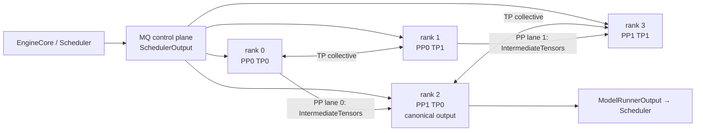
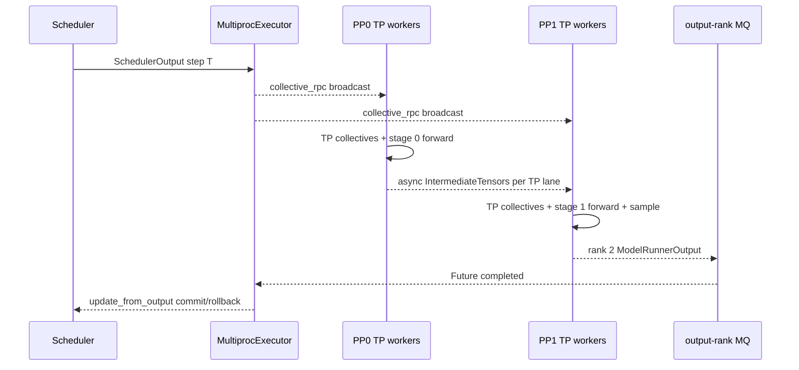

> 源码基线：[`vllm-project/vllm@d29f7f5c`](https://github.com/vllm-project/vllm/commit/d29f7f5c9294be8e489dac34d45a939b95a06336)。本文只把该提交已经合入的代码写作“当前事实”；测试能证明的范围单列，历史 PR 与架构判断不冒充运行事实。

## 本篇在课程路线中的位置

前两章已经确认：last PP stage 独占 LM Head/Sampling，`PPHandler` 把最小 sampled state 广播给较早 stage，而 EngineCore 只接收一份 canonical `ModelRunnerOutput`。本章向外再走一层，回答 Executor 如何把一个 Scheduler step 映射成 `TP × PP` 进程图。

课程位置是：`Sampling → 分布式执行`。边界止于 Executor/Worker、TP/PP 通信和故障返回；不提前展开 CUDA Graph。

## 前置知识回顾

- `SchedulerOutput` 是 Host 侧执行计划，携带 request 增删、每请求 token 数、block IDs、encoder/spec 等状态；它不是 device tensor batch。
- `IntermediateTensors` 是 PP stage 之间的设备侧中间结果。
- `ModelRunnerOutput` 回到 Scheduler 后，才会提交或回滚 token progress。
- PP sampled-token broadcast 解决“所有设备 rank 为下一步更新本地 request state”，canonical output 解决“Scheduler 只提交一次”。二者不能互相替代。

## 本篇要回答的核心问题

1. 同一份 `SchedulerOutput` 为什么必须到达每个 TP/PP worker？
2. 控制对象与 hidden-state 大 tensor 是否走同一条通信路径？
3. `TP=2, PP=2` 时，为什么 world rank 2 而不是 rank 3 返回结果？
4. 一个非输出 rank 抛异常或死亡时，错误如何传到 EngineCore？

## 组件在全局架构中的位置

当前 [`Executor.get_class`](https://github.com/vllm-project/vllm/blob/d29f7f5c9294be8e489dac34d45a939b95a06336/vllm/v1/executor/abstract.py#L40-L78) 可选择 `uni`、`mp`、Ray、external launcher 或自定义 Executor。本文以生产语义较清楚的 `MultiprocExecutor` 为主，再对照两条 Ray 路径：

- `MultiprocExecutor`：共享/跨节点 `MessageQueue` 承载控制面，torch distributed/NCCL 承载 TP collective 与 PP P2P。
- `RayExecutorV2`：[`继承 MultiprocExecutor`](https://github.com/vllm-project/vllm/blob/d29f7f5c9294be8e489dac34d45a939b95a06336/vllm/v1/executor/ray_executor_v2.py#L219-L230)，保留 MQ 控制面与 NCCL 数据面，只把 worker 进程换成 Ray actors。
- legacy `RayDistributedExecutor`：使用 Ray Compiled DAG，同时携带 `SchedulerOutput` 与 stage 输出。当前选择是否进入 V2 仍受 `VLLM_USE_RAY_V2_EXECUTOR_BACKEND` 控制，不能把两者混为同一实现。

## 完整调用链

[`EngineCore.step`](https://github.com/vllm-project/vllm/blob/d29f7f5c9294be8e489dac34d45a939b95a06336/vllm/v1/engine/core.py#L583-L613) 先 `scheduler.schedule()`，然后异步调用 `model_executor.execute_model(scheduler_output)`。Multiproc 覆盖基类实现，在 [`execute_model`](https://github.com/vllm-project/vllm/blob/d29f7f5c9294be8e489dac34d45a939b95a06336/vllm/v1/executor/multiproc_executor.py#L340-L364) 中指定 `unique_reply_rank=self.output_rank`。

[`collective_rpc`](https://github.com/vllm-project/vllm/blob/d29f7f5c9294be8e489dac34d45a939b95a06336/vllm/v1/executor/multiproc_executor.py#L375-L448) 将 `(method, args, kwargs, output_rank)` 写入 broadcast MQ。这里 `args` 就含完整 `SchedulerOutput`。每个 [`WorkerProc.worker_busy_loop`](https://github.com/vllm-project/vllm/blob/d29f7f5c9294be8e489dac34d45a939b95a06336/vllm/v1/executor/multiproc_executor.py#L1029-L1054) 按相同顺序 dequeue，并调用自己的 `GPUWorker.execute_model`。

[`GPUWorker.execute_model`](https://github.com/vllm-project/vllm/blob/d29f7f5c9294be8e489dac34d45a939b95a06336/vllm/v1/worker/gpu_worker.py#L1053-L1141) 形成数据面：

1. 非首 PP stage 先 `irecv_tensor_dict()`；
2. 每个 rank 使用同一逻辑计划更新本地 request/KV metadata 并运行本 stage；
3. 非末 stage 得到 `IntermediateTensors`，调用非阻塞 `isend_tensor_dict()`；
4. 末 stage 完成 final hidden state，随后 sampling；
5. 只有 canonical output rank 的响应进入 Executor Future；
6. `future.result()` 成功后，EngineCore 才执行 `scheduler.update_from_output()`。

## 关键类型、字段和状态生命周期

### SchedulerOutput：每个 rank 的控制契约

输入是 Python/Host 对象，没有固定 tensor shape，但其 `total_num_scheduled_tokens=T`、请求次序、block plan 与 finish/preempt 集合必须在所有 rank 一致。每个 stage 虽只持有部分模型层，仍需要它来维护本地 request slot、该 stage 自己的 KV pages、positions、sampling/connector side state。只把计划发给 PP0 会让 PP1 无法解释收到的 `[T,H]` hidden states 属于哪些请求和 KV 位置。

Multiproc 中每个 Worker 得到反序列化后的本地对象；Executor 不共享其可变所有权。所有 worker 必须按相同 RPC 次序消费，否则后续 TP collective 或 PP P2P 会失配。

### IntermediateTensors：stage 边界的设备状态

它是 `dict[str, torch.Tensor]`，dtype/device/shape 由模型与编译配置决定。以关闭 sequence parallel 的普通 decoder 为例，`T=3, H=4096, BF16` 时，每条 TP lane 的 `hidden_states` 可视为 `[3,4096]`，有效载荷 `3×4096×2=24 KiB`；residual 等附加 tensor 会增加真实负载。

接收端用 [`AsyncIntermediateTensors`](https://github.com/vllm-project/vllm/blob/d29f7f5c9294be8e489dac34d45a939b95a06336/vllm/v1/worker/gpu_worker.py#L110-L145) 延迟等待通信。发送端把 non-blocking handles 保存在 `_pp_send_work`，下一次 `execute_model()` 开头必须 `wait()`，之后才可复用源 buffer。这个等待是 buffer lifetime 边界，不只是性能同步点。

### ModelRunnerOutput：唯一模型提交，非唯一 sideband

[`_get_output_rank`](https://github.com/vllm-project/vllm/blob/d29f7f5c9294be8e489dac34d45a939b95a06336/vllm/v1/executor/multiproc_executor.py#L541-L555) 在 `PCP=1` 时计算 `world_size - TP`，即 last PP stage 的 TP0。`TP=2, PP=2` 时 ranks 为 `{0,1}|{2,3}`，所以返回 rank 2。

必须注意一个容易被“唯一返回”掩盖的例外：若启用 KV/EC connector aggregator，`collective_rpc` 会读取所有 rank 的 connector output，再把 sideband 合并到 canonical rank 的结果。唯一的是 Scheduler 的模型 token commit，不代表 Executor 永远只等一个 worker。

## 逐函数源码解读

### `FutureWrapper`：保持 Host 侧提交顺序

Multiproc 的 Future 进入 FIFO。读取较新的 Future 时会先 drain 排在前面的响应，避免 pipeline batch queue 以完成时间而不是调度顺序提交。PP 并行允许多个 batch 在 stage 上重叠，但 Scheduler 状态机不能随意乱序 commit。

### `worker_busy_loop`：广播调用与选择性响应

所有 worker 都执行函数，`output_rank` 只控制谁写 response MQ，并不控制谁做 forward。Python 异常会转为 `FAILURE`，但只有被选中的输出 rank（或收集所有 rank 的模式）会回传。因而非输出 rank 的异常通常要靠其参与的 collective 让 output rank 同步失败/超时，或者靠进程死亡监控暴露；它不是一条完备的逐-rank exception aggregation 协议。

### Ray 的两种图

legacy Ray 的 [`_compiled_ray_dag`](https://github.com/vllm-project/vllm/blob/d29f7f5c9294be8e489dac34d45a939b95a06336/vllm/v1/executor/ray_executor.py#L540-L633) 显式构造 `[PP][TP]` DAG：每个 TP lane 的上一 stage 输出绑定到下一 stage。其 [`execute_model_ray`](https://github.com/vllm-project/vllm/blob/d29f7f5c9294be8e489dac34d45a939b95a06336/vllm/v1/executor/ray_utils.py#L125-L177) 把 `SchedulerOutput`、`GrammarOutput` 与 `IntermediateTensors` 一起沿 DAG 传递。Ray V2 则复用 Multiproc 的 MQ/NCCL 分层。两者对连接器聚合、超时和失败可见性的维护面不同，不能只用“Ray backend”概括。

## 具体示例与 shape / 状态演算

设 `DP=1, TP=2, PP=2, PCP=1`，两个请求 A/B 本 step 分别调度 1、2 个 token，因此 `T=3`：

| rank | 逻辑位置 | 收到的控制计划 | 数据面输入 | 返回 Executor |
| --- | --- | --- | --- | --- |
| 0 | PP0/TP0 | A:1、B:2 与完整 block plan | input IDs/embeddings | 无 |
| 1 | PP0/TP1 | 同上 | 同一 batch 的 TP shard | 无 |
| 2 | PP1/TP0 | 同上 | rank0 的 `[3,4096]` BF16 stage output | canonical output |
| 3 | PP1/TP1 | 同上 | rank1 的 `[3,4096]` BF16 stage output | 无 |

PP0 两条 lane 各发送约 24 KiB hidden state；PP1 的各层 KV 只写入自己拥有的 layer cache。末 stage sampling 后，rank 2 返回按 A/B 切分的 token IDs；Scheduler 仍按最初 `SchedulerOutput` 做 progress commit/rollback。若 rank 1 在 TP all-reduce 前退出，rank 0/2/3 不能把这个 step 当作“缺一份但其余结果仍有效”：该 step 的分布式 forward 没有可提交的部分结果。

## 为什么这样设计及替代方案

**当前分层：小控制对象 fan-out，大 tensor 走设备数据面。** 它满足两个基本约束：所有 layer owner 必须看到同一请求计划；hidden states 不应绕行 EngineCore/Host。代价是存在两套通信序列，必须共同维护 batch identity、调用顺序和生命周期。

**替代一：只给 PP0 发 SchedulerOutput。** 控制流更少，但后续 stage 必须从 tensor payload 重建 request/KV metadata，等于发明第二套易漂移协议，且 finish/preempt/connector 状态难以表达。

**替代二：所有 rank 都把 ModelRunnerOutput 返回 Scheduler。** 故障可见性更直接，但 token/logprobs 会重复，Scheduler 还要验证多 rank 一致性。正常路径多付 IPC/序列化成本，却没有新增语义价值。

**legacy Ray 单 DAG。** 拓扑依赖显式、异常随 DAG ref 传播，但把控制对象沿 stage 复制，连接器聚合与零拷贝 transport 更复杂。Ray V2 回到 MQ 控制面 + NCCL 数据面，降低与 Multiproc 的语义分叉；历史提交 [#36836](https://github.com/vllm-project/vllm/commit/de5e6c44c6fb8aebcc67ff57e85693f6951c8795) 是该演进的直接证据。

## 性能、并发、正确性与边界条件

- `max_concurrent_batches>1` 用 batch queue 填 pipeline bubble，但提高了在途 `SchedulerOutput`、中间 buffer、AsyncOutput 与 KV progress 的峰值所有权；吞吐收益不能脱离内存峰值和 stale-output 协议评价。
- TP collective、PP P2P、PPHandler sampled broadcast 是不同 group/stream，但 rank 间调用序列必须对称。某 rank 提前返回可能表现为 hang，而非立即 Python traceback。
- `_pp_send_work` 在下一轮开头等待会形成 backpressure：消费者或网络慢时不能无限覆盖发送 buffer。
- `VLLM_EXECUTE_MODEL_TIMEOUT_SECONDS` 只是 fail-stop 边界，不提供 step 级回滚。超时后应视为 Executor/Engine 故障，不能重用未知完成度的 device/KV 状态。
- Worker 进程死亡由 [`start_worker_monitor`](https://github.com/vllm-project/vllm/blob/d29f7f5c9294be8e489dac34d45a939b95a06336/vllm/v1/executor/multiproc_executor.py#L298-L338) 设置 `is_failed`、shutdown 全体并触发 failure callback。当前没有“只替换一个 rank 并继续该 batch”的恢复协议。

## 测试证据与未覆盖风险

**测试事实。** [`test_multiproc_executor_pipeline_parallel`](https://github.com/vllm-project/vllm/blob/d29f7f5c9294be8e489dac34d45a939b95a06336/tests/distributed/test_multiproc_executor.py#L312-L342) 在 4 GPU 配置 `TP=2, PP=2`，断言 world size、output rank=2 与 concurrent-batch 配置。但它只初始化/关闭 Executor，没有执行真实 PP forward。

[`test_pp_dp_v2.py`](https://github.com/vllm-project/vllm/blob/d29f7f5c9294be8e489dac34d45a939b95a06336/tests/v1/distributed/test_pp_dp_v2.py#L1-L179) 用 `DP=2, PP=2, TP=1` 覆盖 sync/async、64 并发、decode 中途 abort、pause/resume，并断言 token 数和 abort storm 后仍可服务。这证明一组真实设备链能闭环，但没有覆盖 `TP>1 × PP>1` 的联合拓扑。

[`test_ray_v2_executor_e2e.py`](https://github.com/vllm-project/vllm/blob/d29f7f5c9294be8e489dac34d45a939b95a06336/tests/distributed/test_ray_v2_executor_e2e.py#L1-L107) 验证 Ray V2 `TP=2` 生成与环境传播，却未设置 PP。近期合入的 Ray V2 TCPStore 端口修复 [#45960](https://github.com/vllm-project/vllm/pull/45960) 也说明 orchestration failure 不只来自模型 collective，还来自 rendezvous 资源碰撞。

最小 CI guard 应增加 `TP=2, PP=2` 的小模型 parity：记录每 rank 所见 scheduler step ID、每条 PP lane tensor shape、唯一 token commit；随后分别在非输出 rank 的 Python 前处理、TP collective 前和 PP send 后注入故障，断言请求 fail closed、Executor callback 只触发一次、没有下一 step 继续消费未知 KV 状态。

## 与前后章节的连接

向前，本章把 last-PP sampling owner 放入完整 rank topology，解释 PPHandler 为什么必须与 canonical output 并存。向后，分布式 forward 的 shape、持久 buffer、stream/event 与 collective 顺序，正是 CUDA Graph/`torch.compile` 能否安全跨 rank replay 的前置契约。

## 本篇结论、知识债、理解检查和下一章

结论：`TP × PP Executor DAG` 不是“把一个函数复制到多张卡”。它是三条同时成立的协议：控制计划 fan-out、设备数据沿 stage/lane 前进、Host 只提交 canonical output。任何一条发生部分成功，都不能产生可提交的半个 step。

新增知识债：

- 非输出 rank Python 异常缺少直接、逐-rank、低延迟的 fail-closed aggregation 测试；
- `TP>1 × PP>1` 尚缺真实 forward、token parity 和故障注入组合；
- Multiproc、Ray V2、legacy Ray 对 connector sideband、timeout 与 actor/process death 的统一 contract 尚未形成；
- external launcher 的 output ownership 与错误传播仍未下钻。

理解检查：

1. 为什么每个 PP stage 都需要 `SchedulerOutput`，即使只有 PP0 接收 input IDs？
2. `unique_reply_rank` 为什么不等于“只有一个 rank 执行”，启用 connector aggregator 后又发生什么变化？
3. 为什么非输出 rank 在 PP send 之后失败，不能简单重试它一个 rank？

下一章进入 CUDA Graph/`torch.compile` 的分布式边界：哪些控制 metadata 必须固定地址，哪些 TP/PP collective 可以被 capture，如何保证所有 rank 选择同一 graph key 与 replay 次序。

## 课程账本增量

- 新增符号：`Executor.get_class/execute_model/collective_rpc`、`MultiprocExecutor.execute_model/_get_output_rank/collective_rpc`、`FutureWrapper`、`WorkerProc.worker_busy_loop/enqueue_output`、`GPUWorker.execute_model`、`AsyncIntermediateTensors`、`RayDistributedExecutor._compiled_ray_dag`、`RayWorkerWrapper.execute_model_ray`、`RayExecutorV2`。
- 新增不变量：所有 rank 以相同次序消费同一 SchedulerOutput；TP collective 与 PP lane P2P 共同构成不可拆分 step；PP send buffer 直到 handle 完成才能复用；canonical 模型输出唯一，但 connector sideband 可多 rank 聚合；部分 rank 失败不能提交部分结果。
- 下一章：分布式 CUDA Graph/`torch.compile` 的 shape、address、collective-order 与 graph-key contract。
