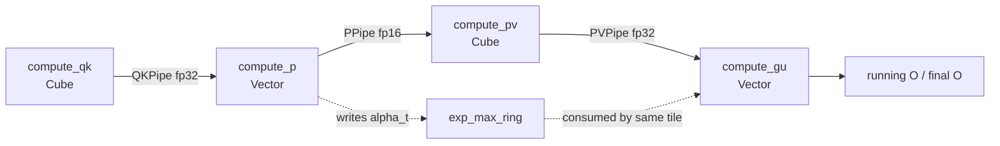

> 本文分析基于 `hw-native-sys/pto-isa` 默认分支 commit [`3186c381`](https://github.com/hw-native-sys/pto-isa/commit/3186c381bd49e1164092e67ff1b3564302754e76)。代码事实以该 commit 为准；性能数字来自仓库已合入 PR 的 A3 实测，硬件内部实现未公开处会明确标为推断。

## 本篇在 PTO 课程路线中的位置

上一章已经证明：分块 attention 不能把每块 softmax 直接拼起来，而要跨 Tile 保存 `running_max`、`running_sum`，并用 `alpha` 同步重标定旧分母和旧输出分子。本章继续回答一个更工程化的问题：这些数学状态如何在 Cube 与 Vector 两类执行资源之间流动，同时避免双方互相等待？

本篇仍处于第一阶段的“ISA 与真实 kernel 状态机”，只讲一个边界清晰的主题：`compute_qk → compute_p → compute_pv → compute_gu` 四阶段流水。Split-KV 的跨 work-unit 合并只标出接口，不展开；它属于后续章节。

## 前置知识

- `TPUSH/TPOP` 在 A2/A3 上不仅传控制信号，还以 GM ring 保存 payload；ready/free credit 决定 slot 何时可见、何时可复用。
- Online Softmax 对第 `t` 个 KV Tile 产生 `P_t`、`PV_t` 与重标定因子 `alpha_t`；三者必须保持同一 `tile_id`。
- Event 或 barrier 只证明先后关系，不证明两个对象指向同一个 Tile，也不替代 ring-slot ownership。

## 今日 1–2 个核心问题

1. Cube 上的 `QK`、`PV` 不能并发，Vector 上的 `P`、`GU` 也不能并发；为何交错调度仍能让 Cube 与 Vector 重叠？
2. 为什么当前 DSL 默认 `QK_PRELOAD=3`，并强制 `EXP_RING == QK_PRELOAD`？为什么 Vector steady state 必须先 `GU(current)`，再 `P(future)`？

## PTO 全栈中的位置



上游是 Q/K/V 的 `GlobalTensor` 与 runtime `S1`；下游是未归一化 `running O`，最后再除以 `running_sum` 并 `TSTORE`。核心实现位于 [`fa_builder.py`](https://github.com/hw-native-sys/pto-isa/blob/3186c381bd49e1164092e67ff1b3564302754e76/kernels/python/flash_atten/kernels/fa_builder.py)，它生成 PTO IR，再由 PTOAS 生成设备 C++。

## 概念和精确语义

四阶段并不是四条可任意并行的流水线。硬约束是：

| 资源域 | 阶段 | 同域关系 |
| --- | --- | --- |
| Cube | `QK = Q @ K^T`、`PV = P @ V` | 共用 Cube，必须串行或细粒度交错 |
| Vector | streaming softmax `P`、重标定累加 `GU` | 共用 Vector，必须按依赖串行 |
| 跨核 transport | QK C2V、P V2C、PV C2V | 三条独立 FIFO，各自维护 ready/free |

因此可利用的并行只有“Cube 当前做 QK/PV，同时 Vector 做另一 Tile 的 P/GU”。调度目标不是让所有阶段同时运行，而是尽量减少两个资源域的空洞。

在默认 `S1_TILE=256`、`S0=128`、`HEAD=128` 下，三类 GM slot 为：

- QK：`fp32[128,256]`，128 KiB；
- P：`fp16[128,256]`，64 KiB；
- PV：`fp32[128,128]`，64 KiB。

每条 pipe 有 `SLOT_NUM=8`，所以 transport ring 合计是每 block `8×(128+64+64) KiB = 2 MiB`。这是 GM transport footprint，不是 UB footprint，也不是同时活跃的数学状态数量。

## 真实文件、类型、API 或指令逐段解读

### 1. `emit_qk_pv_interleaved`：同一 Cube 上做细粒度交错

Cube prologue 先连续产生 `QK[0..preload-1]`。进入 steady state 后，代码先 `tpop` 当前 P，再按 `TILE_FACTOR` 子块交错执行：

```text
for sub in TILE_FACTOR:
    accumulate PV(current, sub)
    allocate QK(next) on first sub
    push PV(current) on last sub
    compute QK(next, sub)
    push QK(next) on last sub
```

对应源码是 [`emit_qk_pv_interleaved`](https://github.com/hw-native-sys/pto-isa/blob/3186c381bd49e1164092e67ff1b3564302754e76/kernels/python/flash_atten/kernels/fa_builder.py)。这里的交错不是让两个 Cube matmul 真正同时执行，而是缩短任一方向长期霸占 Cube 的区段，并让 QK/PV 两条 FIFO 更均匀地产生数据。

### 2. `vec_unit_body`：先 drain GU，再产生未来 P

Vector prologue 对预取的 QK 做 `QK_PRELOAD` 次 softmax。steady state 的顺序是：

```text
GU(tile_id)            # 先读 alpha[tile_id % EXP_RING]
P(tile_id + preload)   # 再写同一个环槽
```

这不是风格选择，而是防止生命周期重叠。若顺序反过来，`P(t+preload)` 会写入 `(t+preload) % EXP_RING`；当 `EXP_RING==preload` 时，这正是 `t % EXP_RING`，于是 `GU(t)` 读取的 `alpha_t` 已被覆盖。

### 3. `talloc/tpush/tpop_into/tfree`：slot 所有权协议

- producer 用 `talloc` 取得可写 slot，完成 store 后 `tpush` 发布；
- consumer 用 `tpop_into` 等待并绑定当前 slot，完成读取后 `tfree` 归还；
- FIFO 顺序让 payload 的逻辑 tile_id 随生产/消费次序隐式推进；`exp_max_ring` 则是 Vector 本地 sideband，必须用相同 tile_id 取模。

这也解释了为什么只看 ready/free signal 不足以证明正确：即便三个 FIFO 都没有越界，sideband `alpha` 取错一代仍会得到数值合理但数学错误的输出。

## 对象/Tile/Buffer/IR 生命周期

以逻辑 Tile `t` 为例：

1. Cube 从 GM 加载 Q 与 `K_t`，在 Acc 中形成 QK；写入 QK FIFO 后，Cube 的临时 Acc 可复用。
2. Vector `TPOP QK_t`，分 row slice 更新 `running_max/sum`，把 `alpha_t` 写入 `exp_max_ring[t % preload]`，将 fp16 `P_t` 推入 P FIFO；QK slot 随后归还。
3. Cube `TPOP P_t`，加载 `V_t`，累加 `PV_t` 并推入 PV FIFO；P slot 归还。
4. Vector `TPOP PV_t`，读取仍存活的 `alpha_t`，执行 `O ← alpha_t·O + PV_t`；PV slot归还。此后 `exp_max_ring[t % preload]` 才可被 `t+preload` 复用。
5. 所有 KV Tile 完成后，`O / running_sum` 写回 GM；`running_max/sum/O` 的生命周期才终止。

## 端到端调用链或指令链

```mermaid
sequenceDiagram
    participant C as Cube kernel
    participant QF as QK GM FIFO
    participant V as Vector kernel
    participant PF as P GM FIFO
    participant VF as PV GM FIFO

    C->>QF: prologue push QK0,QK1,QK2
    QF->>V: pop QK0..2; produce P0..2 + alpha0..2
    loop steady t=0..N-preload-1
        PF->>C: pop P(t)
        C->>VF: push PV(t)
        C->>QF: push QK(t+preload)
        VF->>V: pop PV(t); GU(t)
        QF->>V: pop QK(t+preload); P(t+preload)
    end
    C->>VF: epilogue push remaining PV
    VF->>V: epilogue GU remaining tiles
```

总计每个 Tile 恰好经历一次 QK、P、PV、GU。若总 Tile 数为 `N`，prologue 处理 `preload` 个 QK/P，steady 处理 `N-preload` 对“旧 GU + 新 P”，epilogue drain 最后 `preload` 个 PV/GU；三段之和不漏不重。

## 具体 shape、Tile 和状态演算

取 `S0=128`、`HEAD=128`、`S1=2048`、`S1_TILE=256`、`QK_PRELOAD=EXP_RING=3`：

- `N=S1/S1_TILE=8`，`steady_tiles=5`；
- `TILE_FACTOR=256/128=2`；
- 两个 Vector subblock 各处理 64 行；softmax 再切成两个 `[32,256]` row slice；
- 每个 fp32 working Tile 是 `32×256×4=32 KiB`，PV/O row-slice Tile 也是 `32×128×4=16 KiB`；仓库预算文档将 steady-state 主要 working sets 控制在 A3 的 192 KiB UB 内。

| 时段 | Cube | Vector | exp ring 写后状态 |
| --- | --- | --- | --- |
| prologue | QK0, QK1, QK2 | P0, P1, P2 | slot0=α0, slot1=α1, slot2=α2 |
| steady 0 | PV0 + QK3 | **GU0**，再 P3 | slot0 从 α0 复用为 α3 |
| steady 1 | PV1 + QK4 | **GU1**，再 P4 | slot1 从 α1 复用为 α4 |
| … | … | … | … |
| steady 4 | PV4 + QK7 | **GU4**，再 P7 | slot1 从 α4 复用为 α7 |
| epilogue | PV5, PV6, PV7 | GU5, GU6, GU7 | 状态完成后失效 |

关键不是“环有三个槽”，而是每个槽的 reuse distance 恰好为 3，且旧消费者先于新 producer。`EXP_RING<preload` 会提前覆盖；更大虽可正确，却增加 UB 状态并掩盖错误的调度距离。

## 为什么这样设计及替代方案

从第一性原理看，目标是在四条硬约束下缩短 wall time：Cube 与 Vector 各自串行、跨核数据必须可见、`alpha_t` 必须活到 GU、UB/GM 容量有限。

1. **逐 Tile 串行 QK→P→PV→GU**：最易证明，但 Cube 与 Vector轮流空闲，吞吐差。
2. **完整物化 QK/P/PV**：调度简单，却把近似 `O(S0×S1)` 的中间张量反复写读 GM，违背 FlashAttention 降低中间访存的目标。
3. **当前 bounded FIFO pipeline**：只保留有限在途窗口，以 preload 吸收阶段抖动；代价是三条 GM ring、credit、prologue/drain 与 ring identity 的维护复杂度。

因此 `preload=3` 不是 ISA 常数，而是当前 DSL 的调优策略。合入的 [PR #136](https://github.com/hw-native-sys/pto-isa/pull/136) 将默认值从手写路径对齐用的 4 调成 3，并配套缩短 exp ring；如果资源时延、Tile 大小或编译器调度发生变化，应重新 sweep，而不是把 3 当成永恒答案。

## 访存、计算、流水、并行和硬件约束

- **GM**：FIFO payload 经过 GM，因此 overlap 收益必须覆盖额外 transport 与同步成本；它不是“免费片上队列”。
- **UB**：`Vec_S0 = S0 / VEC_CORES / TILE_FACTOR`。`S1_TILE` 从 256 增至 512 时，row slice 从 32 行降到 16 行，使 `Vec_S0×S1_TILE×4` 仍为 32 KiB。这个公式是容量不变量，不代表 512 必然更快。
- **并行**：Q 常驻并跨多个 K Tile 复用；K/V 仍按 128 列子块加载。Cube 内的 QK/PV 是交错而非并行，Cube 与 Vector 才是真正可重叠的资源域。
- **同步**：当前生成代码仅默认删除 `GU` 链中的一种冗余 `PIPE_V` barrier，因为中间已有 `wait_flag(PIPE_MTE2, PIPE_V)` 固定顺序；softmax 的两类 barrier 删除默认关闭，必须经过直接 Tile 依赖检查。删除同步是证明题，不是文本替换题。
- **边界**：runtime 要求每个 KV chunk 的 Tile 数至少为 `QK_PRELOAD`，且 `S1` 可整除 `S1_TILE`；当前 DSL 还是 non-causal，不能从单指令 valid-tail 能力推导整个 kernel 支持任意 S1。

## 测试证据与未覆盖风险

**当前测试/实验事实：**

- [`run.py`](https://github.com/hw-native-sys/pto-isa/blob/3186c381bd49e1164092e67ff1b3564302754e76/kernels/python/flash_atten/run.py) 的默认矩阵覆盖 `S0=S1=1024..131072`；小中型 shape 对 host fp32 reference 使用 `rtol=atol=1e-3`，过大 QK 不再在 host 物化，改与 fused NPU reference 以 `5e-3` 比较。
- 已合入 [PR #169](https://github.com/hw-native-sys/pto-isa/pull/169) 报告 A3、24 Cube cores 上 case1..case8 全部通过；kernel error 位于约 `9e-6..4.5e-5`。这是特定软硬件组合的实验结果，不是 ISA 保证。
- 传统 [`tfa/main.cpp`](https://github.com/hw-native-sys/pto-isa/blob/3186c381bd49e1164092e67ff1b3564302754e76/tests/npu/a2a3/src/st/testcase/tfa/main.cpp) 还会在 debug case 对 QK、fp16/fp32 P、PV、running sum、exp factor、running O 和最终 O 做 `0.001` 阈值的中间态比较，验证的是数学 recurrence 与 Tile identity。

**仍未覆盖的风险：**

- 缺少专门 poison `exp_max_ring`、强制延迟某一阶段并验证 wrap-around 的故障注入；最终 O 正确并不能定位偶发的 ABA 式 sideband 错配。
- `QK_PRELOAD=3/4 × S1_TILE=256/512 × KV_SPLIT` 的全组合并非每次 CI 都覆盖。
- early-exit、producer/consumer 数量不匹配时，TPipe destructor drain 仍不是 cancellation protocol。
- barrier patch 依赖 PTOAS 生成代码形状；上游 emitter 变化后必须对生成 C++ diff 和 device trace 重新验证。

## 与前后章节的连接

前一章给出 Online Softmax 的数学不变量，本章给出它在跨核 transport 上的时间与所有权不变量。后续要继续下钻：`PIPE_V` barrier 删除究竟需要什么充分证据，以及 generated PTOAS C++ 中的 event/wait 如何对应 Tile data dependency。

## 本篇结论、知识债、三个理解检查问题和下一章

结论：四阶段流水的本质是“两个串行资源域 + 三条有界 FIFO + 一个与 preload 同深度的 sideband ring”。正确性依赖的不只是 stage DAG，还包括每个 Tile 的 payload ownership、`alpha` reuse distance，以及 prologue/steady/epilogue 的精确计数。

知识债：需要补 ring wrap 故障注入、preload/tile/split-KV 组合 CI、真实 Cube/Vector stall trace，以及 generated C++ barrier dependency 的逐项证明。

理解检查：

1. 若 `EXP_RING=2`、`QK_PRELOAD=3`，第一个必然被覆盖的 `alpha` 是哪一个？发生在哪次 P 生产之前？
2. 为什么把 steady state 改成“先 P(next)，后 GU(current)”即使三个 TPipe 都不越界也会错误？
3. `S1_TILE` 翻倍后 working Tile 仍为 32 KiB，为什么不能据此断言端到端性能一定提高？

下一章：**PIPE_V barrier 删除的证明边界**——从 PTOAS 生成的 op pattern、直接 Tile dependency 与 MTE wait 出发，判断哪些同步可删、哪些只是看起来冗余。

## 课程账本增量

- 新增 ISA 节点：Four-stage FA pipeline、QK/P/PV 三 FIFO、preload/exp-ring reuse distance。
- 新增不变量：`EXP_RING == QK_PRELOAD`；steady state 必须 `GU(t)` 先于 `P(t+preload)`；每个 Tile 四阶段各执行一次。
- 新增资源边界：默认 256 Tile 时每 block 三条 8-slot GM ring 共 2 MiB；Vector working Tile 通过 row slicing 固定在 32 KiB 量级。
- 新增知识债：ring ABA 注入、组合 CI、early-exit cancellation 与 barrier proof。
