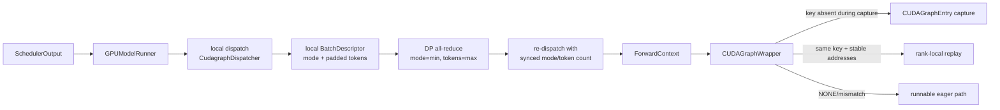
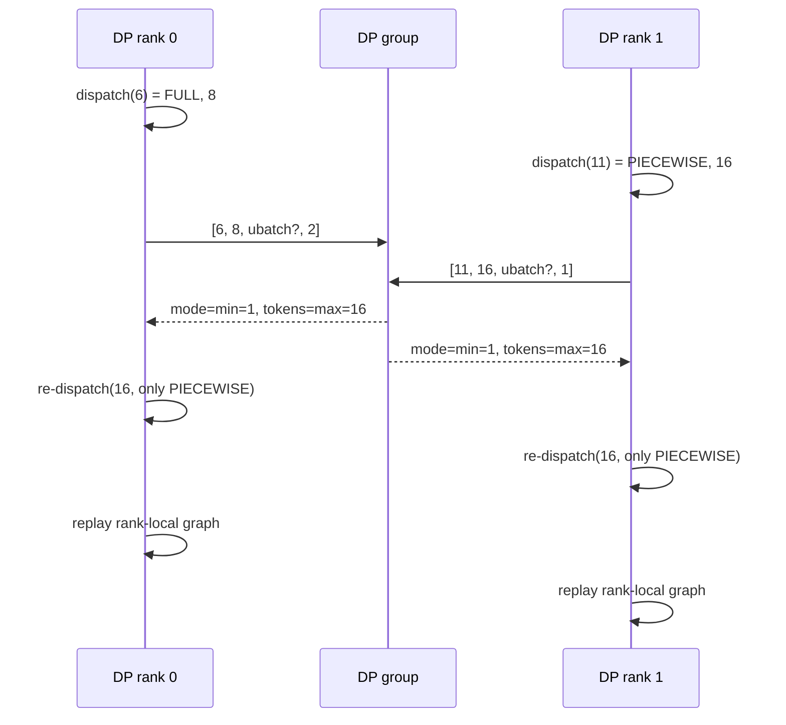

> 源码基线：[`vllm-project/vllm@8bdc70ec`](https://github.com/vllm-project/vllm/commit/8bdc70ec7b379279ec0152343239c2d50aced687)。本文把该提交已经合入的代码称为“当前事实”；测试结论、历史 PR 与架构推断分别标注，不把计划当实现。

## 本篇在课程路线中的位置

上一章把一次 step 画成 `TP × PP` Executor DAG：所有 rank 接收同一控制计划，TP collective 与 PP P2P 形成不可拆分的数据面。今天进入下一阶段：`分布式执行 → CUDA Graph/torch.compile`。

本篇只回答一个边界清晰的问题：**动态 batch 如何被压缩成可安全 replay 的 graph key，并在 DP ranks 间达成兼容共识？** `torch.compile` 怎样切图留到下一章。

## 前置知识回顾

- `SchedulerOutput` 决定逻辑 token 工作量；ModelRunner 把它物化为持久 `input_ids`、`positions`、block table、slot mapping 等 device buffers。
- CUDA Graph 记录的是一串已经实例化的 GPU 操作。重放不会重新执行 Python 调度，也不会自动适应任意 shape、地址或 collective 顺序。
- 第 7 章已经确认：vLLM 的关键输入 buffer 预分配后只更新内容，不改变地址。这是 graph reuse 的必要条件。

## 本篇要回答的核心问题

1. `BatchDescriptor` 为什么不只是 batch size？
2. 两个 DP rank 本地分别能跑 `FULL` 与 `PIECEWISE` 时，为什么必须统一到后者？
3. `6` 与 `11` 个 token 如何落到同一个 `16-token` 执行包络？
4. graph entry 从创建、capture 到 replay 由谁持有，何时失效或回退 eager？

## 组件在全局架构中的位置

从第一性原理看，CUDA Graph 只有四个不可妥协的物理契约：命令序列固定、tensor 地址稳定、shape 落在已 capture 的包络内、分布式 collective 的参与者与顺序一致。capture sizes 和 `FULL`/`PIECEWISE` 优先级是策略；这四项是正确性边界。

这里的“分布式 graph”不是一张跨 GPU 的共享对象。每个 rank 都有自己的 `CUDAGraphEntry`；需要全局一致的是能影响 collective trace 的执行包络与 mode。

## 完整调用链

ModelRunner 在 [`_prepare_inputs`](https://github.com/vllm-project/vllm/blob/8bdc70ec7b379279ec0152343239c2d50aced687/vllm/v1/worker/gpu_model_runner.py) 计算本地 `num_tokens`、是否 uniform decode、是否有 encoder output、active LoRA 数量，再调用 [`CudagraphDispatcher.dispatch`](https://github.com/vllm-project/vllm/blob/8bdc70ec7b379279ec0152343239c2d50aced687/vllm/v1/cudagraph_dispatcher.py)。dispatcher 先把 token 数向上映射到配置的 capture size，再依次尝试 FULL、PIECEWISE，找不到合法 key 就返回 `NONE`。

当 `data_parallel_size > 1`，本地结果还不能执行。[`coordinate_batch_across_dp`](https://github.com/vllm-project/vllm/blob/8bdc70ec7b379279ec0152343239c2d50aced687/vllm/v1/worker/dp_utils.py) 将每个 rank 的四个 int32 状态放入 `4 × dp_size` tensor：原始 token 数、已 padding token 数、是否尝试 ubatching、`cudagraph_mode`。一次 all-reduce 后：

1. mode 取各 rank 最小值：`NONE=0 < PIECEWISE=1 < FULL=2`；
2. 若同步后的 mode 非 `NONE`，所有 rank 的 token 包络取最大 padded 值；
3. ModelRunner 用该 rank 得到的共识 token 数和唯一允许的共识 mode **重新 dispatch**；
4. 断言新 `BatchDescriptor.num_tokens` 与 DP 共识一致。

随后 [`set_forward_context`](https://github.com/vllm-project/vllm/blob/8bdc70ec7b379279ec0152343239c2d50aced687/vllm/forward_context.py) 把 `cudagraph_runtime_mode` 与 `batch_descriptor` 放入动态上下文。编译后的模型经过 [`CUDAGraphWrapper.__call__`](https://github.com/vllm-project/vllm/blob/8bdc70ec7b379279ec0152343239c2d50aced687/vllm/compilation/cuda_graph.py)：mode 不匹配或为 `NONE` 时调用普通 `runnable`；匹配时按 descriptor 找 `CUDAGraphEntry`，capture 阶段首次创建，此后调用 `graph.replay()`。

## 关键类型、字段和状态生命周期

[`BatchDescriptor`](https://github.com/vllm-project/vllm/blob/8bdc70ec7b379279ec0152343239c2d50aced687/vllm/forward_context.py) 是 frozen dataclass，当前字段为：

| 字段 | 输入语义 | 为什么进入 key |
| --- | --- | --- |
| `num_tokens` | padding 后执行 token 数 | 决定主 tensor shape 与 kernel grid |
| `num_reqs` | 请求行数，可为 `None` | FULL 下 attention metadata 可能依赖精确 request 数 |
| `uniform` | 是否统一 query length | decode 专用 FULL key 与 mixed batch 路径不同 |
| `has_lora` | 是否存在 LoRA | adapter 分支可能改变图 |
| `num_active_loras` | active adapter 数 | specialize LoRA 时影响 capture case |

PIECEWISE key 会放宽 `num_reqs=None, uniform=False`，因为图边界较小；FULL 要描述更多动态控制已被冻结后的差异。key 必须“最小但完备”：少一个影响命令序列的字段会错误复用，多一个无关字段会制造 graph 数量和显存膨胀。

`CUDAGraphWrapper` 持有 `dict[BatchDescriptor, CUDAGraphEntry]`。entry 包含 CUDA graph、输出弱引用，以及 debug 模式下记录的输入 `data_ptr()`。第一次匹配调用在 capture context 中录图；以后同 key replay。持久输入 buffer 不归 wrapper 分配，ModelRunner 必须事先保证相同地址，并在每步覆盖有效区和 padding 区。capture 完成后，ModelRunner 还会 `lock_workspace()`，避免运行期 workspace 扩容改变地址。

生命周期结束并不是每个 request finish 时删除 graph；entry 与 ModelRunner/编译模块同寿命并跨 batch 复用。模型卸载、runner 销毁或进程结束才整体释放。运行期遇到未 capture shape，不允许偷偷新录：capture 已关闭时请求未知 key 会报错，正常 dispatcher 则提前降为 eager。

## 逐函数源码解读

### 1. `CudagraphDispatcher.initialize_cudagraph_keys`

它在 attention backend 能力解析后初始化 FULL/PIECEWISE 两套合法 key，capture size 是离散集合。LoRA specialization 会再乘上 active-LoRA case。dispatcher 因而既是 runtime 路由器，也是“哪些图允许存在”的唯一清单。

### 2. `dispatch`

输入是原始 token 数、uniform/LoRA 状态和允许/禁止 mode；输出是 `(CUDAGraphMode, BatchDescriptor)`。超过最大 capture size、被 `force_eager` 禁止、FULL 因 cascade attention 或 encoder output 失效，都会回退 PIECEWISE 或 NONE。后置条件是：非 NONE 返回的 key 必须已存在于合法 key 集合。

### 3. `_post_process_cudagraph_mode`

实现只有“取最小值”，但它表达 fail-closed 策略：只要一个 DP rank 无法 replay，全部退 eager；FULL 与 PIECEWISE 混合时，全部采用 PIECEWISE。否则某些 rank 会进入整图 replay，另一些 rank 进入含 Python/子图边界的路径，collective 调用次序可能不再对称。

### 4. `CUDAGraphWrapper.__call__`

wrapper 不复制动态输入，也不修复地址；它只验证当前上下文的 mode/key，选择 capture、replay 或 bypass。地址一致性断言当前只在 `CompilationConfig.debug_dump_path` 对应的 DEBUG 路径开启，因此生产环境错误地址更可能表现为静默读旧 buffer 或非法访问，而不是友好异常。

## 具体示例与 shape/状态演算

设 `DP=2`，capture sizes 为 `[8, 16]`，无 LoRA，统一 decode query length 为 1。

| 阶段 | DP rank 0 | DP rank 1 |
| --- | --- | --- |
| 实际 token | 6 | 11 |
| 本地 capture envelope | 8 | 16 |
| 本地可用 mode | FULL（2） | PIECEWISE（1） |
| all-reduce 后 mode | PIECEWISE（1） | PIECEWISE（1） |
| all-reduce 后 token envelope | 16 | 16 |
| 重新 dispatch key | `BD(16, None, False)` | `BD(16, None, False)` |

rank 0 需要写入 10 个 padding token，rank 1 写入 5 个。它们不是有效请求 token：slot mapping/attention mask 等 metadata 必须把 padding 变成无副作用区域。两个 rank 各自 replay 自己的 16-token PIECEWISE graph，但 collective 的 shape 与调用骨架一致。

若 rank 1 返回 `NONE=0`，共识 mode 为 NONE；代码不再仅因 CUDA Graph 要求把所有 DP rank pad 到最大值。历史合入的 [PR #26375](https://github.com/vllm-project/vllm/pull/26375) 正是为了避免 eager prefill 的无意义 DP padding；当前实现已经把判断推进到“本 step 同步后的 runtime mode”。

## 为什么这样设计及替代方案

**替代一：每个 rank 独立选图。** 单卡看似减少 padding，但含 DP/EP collective 时，rank 可能走不同 graph 边界与调用序列，最坏结果是 hang；正确性不可接受。

**替代二：为每个实际 shape capture。** padding FLOPs 更少，却让 graph 数量随 batch 组合爆炸，增加启动延迟、graph pool 显存和测试矩阵。离散 capture sizes 用有限冗余计算换稳定复用。

**替代三：一律 FULL。** launch overhead 最低，但 mixed prefill、encoder output、cascade attention、动态 LoRA 等状态更难形成完备 key，graphability 和维护成本恶化。FULL/PIECEWISE/NONE 的降级链把优化与正确性解耦。

从性能式子看，应该比较：

`节省的 CPU launch/dispatch 时间 > padding 计算 + DP 同步 + graph pool/capture 摊销`。

因此“FULL 一定更快”不是代码事实。短 decode、小 capture envelope 常受益；长而不均衡的 DP prefill 可能被 padding 放大。

## 性能、并发、正确性与边界条件

- **延迟/吞吐**：graph replay 减少 CPU launch；DP 的 max-envelope 会让最小 batch rank 承担额外 FLOPs。
- **显存**：多个 descriptor 对应多个 graph entry；FULL 与 PIECEWISE 的共享 graph pool按“不会并发 replay”估算共享部分，但 encoder graph 有独立 pool。
- **地址**：输入 shape 一样不代表安全，`data_ptr()` 和 workspace 地址仍须稳定；debug 才有直接输入地址断言。
- **并发**：wrapper 使用全局 graph pool；源码 TODO 明确提示多 stream 同时 replay 可能使共享不安全，不能从单 stream 行为外推。
- **进程假设**：DP mode 有显式 all-reduce 共识。TP/PP 的同构 key 依赖相同 SchedulerOutput、配置与 backend 能力；当前证据不能宣称存在覆盖所有 TP/PP rank 的统一 graph-key all-reduce。
- **失败方式**：未知 key 正常走 NONE/eager；强行在 capture 关闭后新录图会抛错；collective 次序不对称则可能 hang；stale 地址可能静默错误。

## 测试证据与未覆盖风险

[`tests/v1/cudagraph/test_cudagraph_dispatch.py`](https://github.com/vllm-project/vllm/blob/8bdc70ec7b379279ec0152343239c2d50aced687/tests/v1/cudagraph/test_cudagraph_dispatch.py) 用 capture sizes `[1, 8]` 覆盖 FULL、FULL_AND_PIECEWISE、FULL_DECODE_ONLY、PIECEWISE 和 LoRA specialization，断言 mixed/uniform batch 的精确 key、invalid/valid mode 降级和 largest-first capture 顺序。CUDA 测试还验证：首次调用 capture、同 key replay、mode mismatch/None bypass、未知 shape bypass，以及 FULL 外层与 PIECEWISE 内层 wrapper 的嵌套行为。

[`tests/compile/fullgraph/test_full_cudagraph.py`](https://github.com/vllm-project/vllm/blob/8bdc70ec7b379279ec0152343239c2d50aced687/tests/compile/fullgraph/test_full_cudagraph.py) 对多种 attention backend、是否使用 Inductor graph partition、batch sizes `1/7/16/25/32/45/64/123` 和不同生成长度比较 FULL 与 PIECEWISE 的 greedy 文本，证明这些配置下 padding 后结果一致。

这些测试没有证明：`DP=2 × TP=2` 下一个 rank FULL、另一个 PIECEWISE/NONE 的 mode 收敛；collective trace 对称；生产模式 stale `data_ptr` 被及时发现；LoRA 激活数跨 rank 不一致；共享 graph pool 多 stream 并发。当前也未找到 `_post_process_cudagraph_mode` 的直接单测，这是本章最高风险缺口。

## 与前后章节的连接

向前，本章给上一章的分布式 DAG增加了 replay 条件：控制面一致还不够，shape envelope、mode 与 collective trace 也要一致。向后，PIECEWISE 为什么能放宽 `num_reqs/uniform`，取决于 `torch.compile` 在 attention/custom op 附近怎样切图；下一章会追踪 `splitting_ops → PiecewiseBackend → CUDAGraphWrapper`。

## 本篇结论、知识债、三个理解检查问题和下一章

结论：`BatchDescriptor` 不是性能标签，而是 graph replay 的最小正确性证明；DP all-reduce 则把各 rank 的本地证明收敛为共同可执行的最弱 mode 与最大 shape envelope。固定地址和 workspace 是 key 之外的隐含契约。

知识债：需要 DP mixed-mode 直接单测、`TP×PP×DP` collective-order 故障注入、production 地址 guard、LoRA/encoder/cascade 交叉矩阵，以及 padding FLOPs 对 P99 的实测。

理解检查：

1. 为什么 mode 用 `min`，而 padded token 数用 `max`？
2. 两次执行的 `BatchDescriptor` 完全相同，为什么仍可能不能安全 replay？
3. PIECEWISE key 为什么可以忽略精确 `num_reqs`，而 FULL 通常不能？

下一章：**`torch.compile` 的切图边界——`splitting_ops`、PiecewiseBackend 与 attention custom op 如何把动态图变成可捕获子图。**

## 课程账本增量

- 新增链路：`GPUModelRunner local dispatch → DP mode/token consensus → exact re-dispatch → ForwardContext → CUDAGraphWrapper capture/replay`。
- 新增对象生命周期：`BatchDescriptor → CUDAGraphEntry → rank-local graph pool → replay/bypass`。
- 新增不变量：mode 取最弱能力、graph token envelope 取最大值；key 一致之外，地址、workspace 与 collective 顺序也必须稳定。
- 新增风险：DP mixed-mode 缺少直接 CI，production 地址错配未必 fail-fast。
