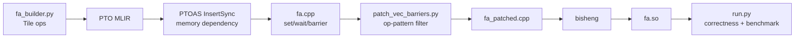
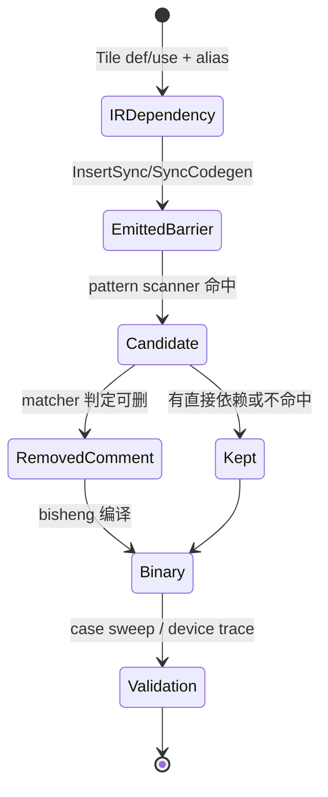

> 源码基线：[`hw-native-sys/pto-isa@3186c381`](https://github.com/hw-native-sys/pto-isa/commit/3186c381bd49e1164092e67ff1b3564302754e76) 与 [`hw-native-sys/PTOAS@e32488c9`](https://github.com/hw-native-sys/PTOAS/commit/e32488c9327a6f5e0fbbb71fb90fabdc669b3de7)。本文以已合入代码为事实；PR 性能数字、仓库文档主张、本文的源码演算和硬件推断会明确分开。

## 本篇在 PTO 课程路线中的位置

上一章把 FlashAttention 拆成 Cube 的 QK/PV、Vector 的 P/GU，以及三条 GM FIFO。今天只追一条窄而关键的链：Python DSL 生成 PTO IR 后，PTOAS 为什么插入 `PIPE_V` barrier，FlashAttention 构建流程又凭什么在生成 C++ 中删除其中一部分。

这是第 14 章，仍属于第一阶段“同步、依赖和真实 kernel”。它同时打开第二阶段的一条缝：ISA 同步语义如何被 PTOAS 分析、生成，再被 kernel 特化工具消费。

## 前置知识

- `TEXP`、`TROWSUM`、`TROWEXPANDMUL`、`TADD` 在 A2/A3 的公开 pipe mapping 中都属于 `PIPE_V`。
- `pipe_barrier(PIPE_V)` 是同一 Vector pipe 的完成边界；`set_flag/wait_flag(PIPE_MTE2, PIPE_V)` 表达 MTE2 producer 到 Vector consumer 的跨 pipe 依赖。
- “源码顺序相邻”不等于设备完成顺序；但“存在 barrier”也不等于它必然不可删除。正确问题是：删除后，所有 RAW/WAR/WAW 和跨 pipe 可见性是否仍由另一条边覆盖。

## 今日两个核心问题

1. PTOAS 已做 buffer alias 与 def-use 分析，为什么 FlashAttention 还要在生成 C++ 后 patch barrier？
2. 当前 `gu`、`softmax-exp-sum`、`softmax-sum-add` matcher 实际证明了什么，又有哪些情况会 fail-open？

## PTO 全栈中的位置



[`compile.sh`](https://github.com/hw-native-sys/pto-isa/blob/3186c381bd49e1164092e67ff1b3564302754e76/kernels/python/flash_atten/compile.sh) 的真实顺序是：

```text
fa_builder.py
→ ptoas --pto-arch=a3 --enable-insert-sync
→ build_artifacts/fa.cpp
→ patch_vec_barriers.py
→ build_artifacts/fa_patched.cpp
→ bisheng -O2
→ fa.so
```

patch 不修改 PTO IR，也不参与运行期调度；它在编译期把一行 barrier 替换为注释。因此它的安全性完全取决于“生成 C++ 的局部文本形状能否充分代表真实数据依赖”。

## 概念和精确语义

### PTOAS 的保守基线

[`PTOInsertSync` 设计](https://github.com/hw-native-sys/PTOAS/blob/e32488c9327a6f5e0fbbb71fb90fabdc669b3de7/docs/designs/ptoas-auto-sync-design.md) 给出的 pass 链为：

```text
PTOIRTranslator
→ InsertSyncAnalysis
→ MoveSyncState
→ RemoveRedundantSync
→ SyncEventIdAllocation
→ SyncCodegen
```

translator 把 Tile/view 追溯到 `rootBuffer + address range + address space`；analysis 反向扫描 def/use，识别 RAW、WAR、WAW。同 pipe hazard 生成 barrier，跨 pipe hazard 生成 set/wait；控制流、零次循环、多 buffer 和 event ID 再由后续 pass 处理。若 event ID 无法安全分配，设计允许退化到更保守的 `PIPE_ALL`，优先正确性。

这说明自动同步不是“每条 Vector op 后机械插 barrier”。PTOAS 自己已有冗余删除。直接测试 [`test_inject_sync_intra_pipe_barrier.pto`](https://github.com/hw-native-sys/PTOAS/blob/e32488c9327a6f5e0fbbb71fb90fabdc669b3de7/test/samples/Sync/test_inject_sync_intra_pipe_barrier.pto) 要求两个共享 `%ub0` 的 `TADD` 之间必须产生 `pto.barrier <PIPE_V>`；而 [`issue646_pipev_repeat_prune.pto`](https://github.com/hw-native-sys/PTOAS/blob/e32488c9327a6f5e0fbbb71fb90fabdc669b3de7/test/lit/pto/issue646_pipev_repeat_prune.pto) 又证明 full-repeat 连续区间可删 barrier，但 `validRow=15`、非连续 repeat 或共享 tmp 的 WAW 必须保留。

### 删除的充分条件

从第一性原理看，删除同 pipe barrier 至少需要满足：

1. 前后操作之间没有未覆盖的 RAW/WAR/WAW；
2. 若消费者依赖 MTE2 数据，跨 pipe wait 仍在且 event 指向正确 producer；
3. Tile/view alias、valid region、in-place destination 都已纳入判断；
4. emitter 形状变化时无法证明的候选必须保留；
5. 性能收益应来自受同步限制的路径，且不能只由最终数值偶然通过来证明。

其中 1–4 是正确性硬约束；是否默认打开、匹配哪些 op、收益多大才是策略。

### 把删除写成 happens-before 证明

设 Vector op `A` 写 Tile `x`，后续 Vector op `B` 读 `x`；MTE2 op `L` 另写 Tile `y`，`B` 也读 `y`。原序列包含两条边：

```text
A --PIPE_V barrier--> B
L --set/wait(MTE2,V)--> B
```

删除 barrier 后，第二条边只能证明 `L happens-before B`，它并不从逻辑上自动推出 `A happens-before B`。若要借 wait 替代 barrier，还必须有公开硬件/编译契约证明：`A` 在该 wait 返回前已经完成，且 `B` 不会在 `A` 的目的 Tile 可见之前读取。仓库文档把 wait 称为“足够间隔”，属于实现主张；当前 matcher 却连 wait 是否存在都不验证，所以它没有把这项前提编码成机器可检查条件。

同理，“A、B 属于同一 pipe”也不能单独完成证明。若 pipe 对相关指令保证严格完成顺序，barrier 本来就可能冗余；若只保证 issue order，而长延迟指令的 destination 尚未可读，则仍需要完成边界。公开代码能证明 PTOAS 按 hazard 保守插入同步，不能证明所有具体 micro-architectural completion rule。因此文章把“当前代码删除了什么”列为事实，把“设备上为什么安全”限制在已有文档与测试覆盖内。

这也给出 fail-closed 的形式化标准：matcher 只有在恢复出 `Read(A)`、`Write(A)`、`Read(B)`、`Write(B)`，并找到删除后仍覆盖所有交集的替代边时才能返回 safe；任一集合或边为 unknown，都必须返回 keep。

## 真实文件、类型和 pattern 逐段解读

### 1. `gu`：默认开启的模式

[`patch_vec_barriers.py`](https://github.com/hw-native-sys/pto-isa/blob/3186c381bd49e1164092e67ff1b3564302754e76/kernels/python/flash_atten/scripts/patch_vec_barriers.py) 扫描：

```text
TROWEXPANDMUL(...)
pipe_barrier(PIPE_V)
[零个或多个 wait_flag(PIPE_MTE2, PIPE_V, ...)]
TADD(...)
```

匹配后删除 barrier。仓库文档把安全理由描述为：GU 先以 `alpha_t` 缩放旧 `runningO`，随后等待 PV 的 MTE2 load，wait 已提供足够间隔，再由 `TADD` 合并 PV。

但代码有一个重要差异：matcher 没有记录“至少见过一个 wait”，所以 **零个 wait 的 `TROWEXPANDMUL → barrier → TADD` 也会匹配并删除**。这不是硬件错误的直接证明，却意味着实现接受的语言严格大于文档声称的安全 pattern。

### 2. `softmax-exp-sum` 与 `softmax-sum-add`

这两个实验模式只接受三行相邻形状。依赖检查器用 `CALL_RE` 解析单行调用，再用 `v\d+` 提取 Tile：

```text
第一个 Tile = write set
其余 Tile = read set
```

它检测 producer-write→consumer-read、WAW 和 WAR；发现直接依赖就 **保留** barrier，没有依赖才删除。这与 README 的实际说明一致：例如 `TEXP(v20,v19)` 后 `TROWSUM(v21,v20)` 会 skipped。

这里也有 fail-open 边界：解析失败返回空集合，而“空集合”被当成“没有依赖”。若 emitter 把变量从 `v20` 政名为 `dst`，或未来 op 参数不再遵循 destination-first，matcher 可能删除一个实际相关的候选。理想逻辑应是三态：`dependent / independent / unknown`；当前只有布尔值，`unknown` 落入 independent。

### 3. 行号模式

`--remove-vec-barriers 123,145` 会检查目标行确实是 `pipe_barrier(PIPE_V);`，否则退出码 2；但它不检查周围操作和依赖。它适合一次性 A/B，不适合作为默认构建契约。相比之下 op pattern 能抵抗普通行号漂移，却仍不是 IR 级 alias analysis。

### 关键接口契约

| 接口/对象 | 输入与输出 | 所有权与有效期 | 前置/后置条件 | 失败方式 |
| --- | --- | --- | --- | --- |
| `BaseMemInfo` | root buffer、memory scope、地址区间与访问大小 | PTOAS analysis 持有，随 IR/pass 生命周期结束 | view/alias 必须能回溯到共同 root；区间必须足以判断 overlap | 信息不完整时应保守同步，不能假定 disjoint |
| `InsertSyncAnalysis` | PTO op 的 memory effects 与 pipe；输出 barrier 或 set/wait state | 编译器拥有；后续 move/prune/allocation 消费 | CFG 路径、loop zero-trip、RAW/WAR/WAW 都纳入 | event 不足可退化 `PIPE_ALL`；不应静默丢依赖 |
| `_call_tile_vars(line)` | 单行 C++ call；输出 read/write Tile 名集合 | patch 过程的临时解析结果 | 当前只识别 `vN`，并假设第一个 Tile 是写集 | 当前解析失败返回空集，形成 fail-open |
| pattern patch | `fa.cpp` 文本；输出 `fa_patched.cpp` 与 removed/skipped 统计 | build artifact，不修改 IR | pattern、依赖与替代顺序边都应可证 | 未命中时保留；当前部分 unknown 会误删 |
| `run.py` | 固定 case 的输入、reference 与 `fa.so` | 测试进程持有输入/输出；不拥有同步证明 | 输出误差阈值通过，计时完成 | 只能发现已触发的数值错误，不能穷举调度 |

Tile 的 shape/dtype/device 也不能被文本层省略：本章例子中 `runningO/PV` 都是 A3 Vector UB 上的 fp32 `[32,128]`，`alpha` 是 fp32 `[32,1]`；但 matcher 只看到变量名，没有看到 location、valid region、view offset 或 alias。即使两次调用的变量名不同，它们仍可能是同一 root buffer 的重叠 view。这正是 PTOAS `BaseMemInfo` 能证明而文本正则无法证明的边界。

## Barrier 候选的生命周期



对象不是运行期 Event，而是一条同步证明逐层降级后的表示：IR 中的 buffer hazard → MLIR sync op → C++ barrier 行 → matcher candidate → 注释或保留。到了文本 patch 层，原始 view、offset 和 alias 信息已经丢失；因此 matcher 越宽，越需要 fail-closed 和生成物 golden。

## 具体 shape、Tile 和状态演算

取上一章 steady state 的 Vector row slice：

- `runningO`：fp32 `[32,128]`，16 KiB；
- `alpha_t`：fp32 `[32,1]`，128 B；
- `PV_t`：fp32 `[32,128]`，16 KiB。

GU 数学为：

```text
scaledO = row_expand_mul(runningO, alpha_t)
PV_t    = load from PV FIFO by MTE2
runningO = scaledO + PV_t
```

意图中的生成序列是：

```text
TROWEXPANDMUL(v_scaled, v_runningO, v_alpha)
pipe_barrier(PIPE_V)
wait_flag(PIPE_MTE2, PIPE_V, event_pv)
TADD(v_runningO, v_scaled, v_pv)
```

删除 barrier 后，正确性依赖两件事：Vector pipe 对 `v_scaled` 的写在后续 `TADD` 读取前完成；`event_pv` 确认 `v_pv` 已由 MTE2 填好。仓库把中间 wait 当作足够的 spacing，这是已合入设计主张；公开材料没有给出 cycle-level trace，因此不能进一步声称所有相似序列都安全。

本文用当前脚本对五个合成 C++ 片段执行，得到：

| 片段 | 当前 matcher 结果 | 含义 |
| --- | --- | --- |
| GU，含 MTE2→V wait | 删除 | 文档意图路径 |
| GU，不含任何 wait | **仍删除** | matcher 未强制 wait 存在 |
| `TEXP(v20,v19) → TROWSUM(v21,v20)` | 保留 | 识别 RAW |
| `TEXP(v30,v29) → TROWSUM(v31,v28)` | 删除 | Tile 集合不相交 |
| `TEXP(dst,src) → TROWSUM(sum,dst)` | **删除** | 变量解析失败被当作无依赖 |

这是脚本行为测试，不是 NPU barrier 安全测试；它证明的是 matcher contract 与文档 contract 不完全相同。

## 为什么这样设计及替代方案

**完全保留 PTOAS 输出。** 最易维护，任何 compiler 升级都偏保守；代价是特定 persistent kernel 可能为通用 alias/控制流边界支付多余 stall。

**当前文本 pattern patch。** 改动小、便于 A/B，`gu` 默认行为可复现；缺点是判断发生在 alias 信息丢失之后，依赖 C++ 命名和参数顺序。

**把特化证明下沉 PTOAS IR。** 在 `RemoveRedundantSync` 或独立 pass 中使用 `BaseMemInfo`、MemoryEffect 和 event 边证明冗余，未知情况自然保留。工程量更大，但测试可以直接断言 IR/C++，不必解析文本。这是更稳健的长期方向。

当前最小修正不是扩大 pattern，而是让 matcher fail-closed：`gu` 必须确认恰好存在所需 wait；softmax parser 必须返回 success，无法解析时保留；再为每个 pattern 增加 positive、negative、rename 和 multiline 单测。

## 访存、计算、流水、并行和硬件约束

- 删除 barrier 不减少 QK/P/PV GM 字节，也不改变 FLOPs；它只可能减少 Vector pipe 的同步空洞。
- 收益上限由 Vector stall 占比决定。PR [#136](https://github.com/hw-native-sys/pto-isa/pull/136) 同时修改 tile、preload、pipeline 与 barrier，公开总性能表不能把提升单独归因给 barrier。
- 小 shape 可能更 launch/sync-bound；大 shape 更接近 Cube 计算或 GM transport-bound，所以 barrier A/B 应按 shape 分层。
- 同样的最终误差不排除竞态：固定调度可能每次“碰巧正确”。必须加入 producer 延迟、Tile poison 或 device trace。
- `pipe_barrier` 的具体硬件执行细节未在公开仓库完整披露；本文只使用 PTOAS 依赖模型、公开 pipe mapping 和测试可证明的结论。

## 测试证据与未覆盖风险

**PTOAS 测试事实：**

- intra-pipe 测试验证共享 buffer 的两个 `TADD` 必须插入 `PIPE_V` barrier；
- issue646 测试同时覆盖“full repeat 可 prune”与“partial/noncontiguous/WAW 必须保留”，说明合法删除依赖 shape 和访问覆盖，不只是 op 名称。

**pto-isa 测试事实：**

- `run.py` 的 case1..case8 比较 host fp32 或 fused NPU reference，并报告最终误差和时延；
- PR #136 的 changed files 没有 `patch_vec_barriers.py` 单元测试；默认 case sweep验证 kernel 输出，却没有验证 matcher 对负例必须拒绝；
- README 示例曾报告删除 74 条、因 direct dependency 跳过 2 条，但删除数量是生成物特征，不是安全证明。

最高风险是两个 fail-open：`gu` 不要求 wait，softmax parse failure 等同无依赖。还缺 PTOAS 版本×pattern 的生成 C++ golden、pattern removed/skipped 数量门禁、真实 NPU 延迟注入和每个中间 `runningO` 的 poison 检查。

一组最小但真正有判别力的 matcher 测试应固定如下不变量：

| 用例 | 预期 | 验证的不变量 |
| --- | --- | --- |
| GU 且恰有目标 MTE2→V wait | remove | 只接受声明过的正例 |
| GU 无 wait、wait pipe pair 错或 event 不同 | keep | 替代顺序边必须真实存在且身份正确 |
| softmax RAW/WAR/WAW | keep | 三类数据 hazard 任一存在都不可删 |
| 两个 `vN` Tile 集合不相交 | remove | 可证明 disjoint 才允许优化 |
| 非 `vN` 名、换行 call、未知 wrapper | keep + diagnostic | parser unknown 必须 fail-closed |
| 两个变量名不同但指向重叠 view | keep | 文本层无法证明 alias 时不得猜测 |
| PTOAS 版本升级后的完整 `fa.cpp` | pattern count golden | emitter 漂移必须显式触发审计 |

其中前五类可以作为纯 Python 单测稳定运行；重叠 view 应优先下沉到 PTOAS IR 测试，因为文本 patch 已丢失 root/offset；最后一类不是把删除数量当安全证明，而是把“证明输入发生变化”变成 CI 可见事件。设备层再叠加 producer delay、随机 poison、重复运行与中间状态检查，才能提高低概率 race 的暴露率。

## 与前后章节的连接

向前，本章给四阶段流水补上了同步证明：stage DAG、FIFO credit 和 Tile identity之外，还要维护同 pipe 完成边界。向后，最自然的下一步是进入 PTOAS 的同步生成本体，继续追踪 `BaseMemInfo → InsertSyncAnalysis → event ID → SyncCodegen`，把 kernel 特化 patch 与通用 compiler 责任边界彻底分开。

## 本篇结论、知识债、三个理解检查问题和下一章

结论：barrier 能否删除是依赖证明题，不是性能经验题。当前 `gu` pattern 有合理的特定 kernel 意图，但 matcher 实际条件比文档宽；softmax 模式能识别简单 `vN` 直接依赖，却在解析未知时 fail-open。通过 case sweep只能证明已测生成物与数据未出错，不能证明 pattern 对 emitter 漂移仍安全。

知识债：补 matcher 负例单测与三态解析；把“必须有 wait”编码进 `gu`；为生成物建立版本化 pattern count/golden；用 device trace 或延迟注入验证删除前后的真实 V/MTE2 顺序。

理解检查：

1. 为什么 `wait_flag(PIPE_MTE2, PIPE_V)` 不能自动证明任意两个相邻 Vector op 之间的 barrier 都可删？
2. `_call_tile_vars` 解析失败时，为何应该返回 unknown 并保留 barrier，而不是返回“无依赖”？
3. case1..case8 最终输出都正确，为什么仍不能证明一个新 PTOAS 版本生成的 `gu` pattern 安全？

下一章：**PTOAS InsertSync 的完整对象生命周期——`BaseMemInfo → RAW/WAR/WAW → set/wait/barrier → event ID → SyncCodegen`。**

## 课程账本增量

- 新增链路：`fa_builder.py → PTOAS InsertSync → fa.cpp → pattern patch → bisheng → fa.so`。
- 新覆盖：`PTOInsertSync` pass 链、`patch_vec_barriers.py` 三类 matcher、行号 fallback 与直接 Tile 依赖模型。
- 新不变量：同步删除必须 fail-closed；parser 成功、alias 独立和替代顺序边必须同时成立；benchmark 正确不等于竞态不可达。
- 新知识债：`gu` wait-presence guard、softmax 三态解析、matcher 单测、生成物 golden 与 device trace。
