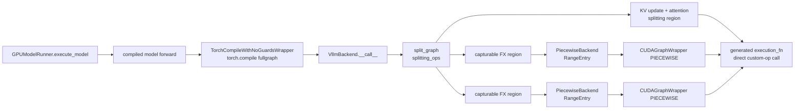
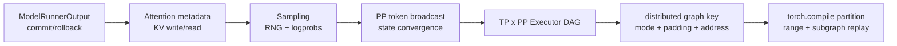

> 源码基线：[`vllm-project/vllm@30b34171`](https://github.com/vllm-project/vllm/commit/30b34171b113887e0e08d7f6d06e2e5a5c33b9d2)。本文把该提交中的实现称为“当前代码事实”；测试事实、历史合入和推断会分别标注。

## 本篇在课程路线中的位置

上一章解释了 runtime 怎样选出 `BatchDescriptor`，以及 FULL/PIECEWISE/NONE 如何决定 replay。今天完成 `CUDA Graph/torch.compile` 阶段的第二层：**PIECEWISE 模式里的“一张模型图”究竟在哪里被切开，谁被编译，谁留在图外？**

这是第 14 篇，正文之后按课程约定追加第二次七章知识图谱回顾。

## 前置知识回顾

- `CudagraphDispatcher` 选择 runtime mode 和 padding 后 token envelope；它不负责切 FX graph。
- attention 同时读 metadata、写 KV cache、读 paged KV，不能只按普通纯函数理解。
- `CUDAGraphWrapper` 需要固定的命令、shape 包络与地址；不兼容的 op 必须在 capture 边界之外执行。

## 本篇要回答的核心问题

1. `torch.compile(fullgraph=True)` 为什么仍然能产生 piecewise graph？
2. `splitting_ops` 为什么既是性能策略，又是 mutation/副作用正确性边界？
3. `PiecewiseBackend` 的 shape range 与 `CUDAGraphWrapper` 的 graph key有何不同？
4. 一个 attention output 从 allocation、被 custom op 写入到被下一子图消费，生命周期如何闭合？

## 组件在全局架构中的位置

[`TorchCompileWithNoGuardsWrapper`](https://github.com/vllm-project/vllm/blob/30b34171b113887e0e08d7f6d06e2e5a5c33b9d2/vllm/compilation/wrapper.py) 调用 `torch.compile(..., fullgraph=True, dynamic=False, backend=VllmBackend)`。“fullgraph”约束的是 Dynamo：一次 trace 必须得到完整 FX graph，不能静默退回 Python；**拿到完整图之后，vLLM backend 仍可主动 partition**。



从第一性原理看，一个“安全且值得”的切点必须同时满足四组约束。第一，跨边界状态必须能由 tensor、`SymInt` 或稳定常量完整表达，不能依赖临时 Python 对象；否则下游子图拿到的不是同一个程序状态。第二，所有写副作用都要出现在 schema 或显式依赖边里，编译器才能在合法优化与错误重排之间划线。第三，被排除 op 的外部签名必须比内部实现稳定：attention 内部可因 prefill/decode、backend 或 paged metadata 改变 kernel，但输入输出 tensor 契约仍可被 Dynamo 描述。第四，边界两侧必须有足够计算可供 fusion/capture；若每个 region 只剩一个微小 kernel，减少兼容风险却会增加 launch 和 graph 管理成本。

据此，**硬约束**是可表达边界、mutation 保序与 backend capture 能力；`splitting_ops`、compile ranges、capture sizes 和 FX/Inductor partition 时机属于可调策略。当前公开代码能证明默认表包含 attention-family op，并在 FX early-partition 路径追加 KV-update op；它不能证明这张表对所有未来模型都是最优。新 custom op、跨层 fusion 或 backend 能力改变时，必须重新检查切点，而不是把默认列表当永久 ISA。

## 完整调用链

模型类经 [`support_torch_compile`](https://github.com/vllm-project/vllm/blob/30b34171b113887e0e08d7f6d06e2e5a5c33b9d2/vllm/compilation/decorators.py) 获得编译 wrapper。首次真实 `forward` 触发 Dynamo，把 token 维标成 symbolic，并把完整图交给 [`VllmBackend.__call__`](https://github.com/vllm-project/vllm/blob/30b34171b113887e0e08d7f6d06e2e5a5c33b9d2/vllm/compilation/backends.py)。backend 的主链是：

1. 根据配置决定 FX-level `fx_split_ops`；`use_inductor_graph_partition=True` 时这里传空表，让 Inductor 稍后切图。
2. `split_graph()` 按节点顺序分配 subgraph id；命中 split op 的节点独占一个 splitting region，连续 split ops 合并。
3. `torch.fx.passes.split_module(..., keep_original_order=True)` 生成 `split_gm` 和有序 `SplitItem`。
4. `PiecewiseCompileInterpreter` 只为 `is_splitting_graph=False` 的子图创建 `PiecewiseBackend`，并在返回 callable 前编译全部 range。
5. PIECEWISE CUDA Graph 开启时，每个 backend 再由 platform 的 static-graph wrapper 包成 `CUDAGraphWrapper(runtime_mode=PIECEWISE)`。
6. [`generate_execution_code`](https://github.com/vllm-project/vllm/blob/30b34171b113887e0e08d7f6d06e2e5a5c33b9d2/vllm/compilation/codegen.py) 生成线性 `execution_fn`：调用已编译子图，内联未编译的 splitting GraphModule，并在最后一次使用后 `del` 临时值。

因此运行期没有重新跑 splitter；只执行已经缝合好的 callable 链。

## 关键类型、字段和状态生命周期

### `SplitItem`：编译资格账本

`SplitItem(submod_name, graph_id, is_splitting_graph, graph)` 记录 partition 的顺序与身份。attention/KV-update region 的 `is_splitting_graph=True`，不会进入 `PiecewiseBackend`；attention 之间的 linear、norm、activation、allocation region 才会被 Inductor 编译并用于 piecewise capture。

### `RangeEntry`：编译 shape 路由

[`PiecewiseBackend`](https://github.com/vllm-project/vllm/blob/30b34171b113887e0e08d7f6d06e2e5a5c33b9d2/vllm/compilation/piecewise_backend.py) 为每个 `Range(start,end)` 保存 `compiled` 和 `runnable`。它先编译通用 range，再为 `compile_sizes` 的精确点建立专用 entry；运行时从跨边界传入的 `SymInt` 选择 entry，越界直接 assert。若没有 symbolic 参数，只允许恰好一个已编译 entry。

这与上一章的 graph key 是两层选择：

- `RangeEntry` 回答“调用哪份 Inductor 代码”；
- `BatchDescriptor` 回答“是否以及 replay 哪张 CUDA Graph”。

同一份动态 Inductor runnable 可以服务多个 token 数，但 CUDA Graph capture 仍必须按离散 envelope 区分。

### 关键接口契约

| 接口 | 输入/输出与所有权 | 前置/后置条件 | 典型失败 |
| --- | --- | --- | --- |
| `TorchCompileWithNoGuardsWrapper.__call__` | 输入是模型 `forward` 的 CUDA tensor；返回 hidden states，tensor storage 仍由调用链管理 | 首次调用完成唯一 Dynamo trace；非 stock mode 默认丢弃 guards，因此模型不能依赖未表达的 Python shape 分支 | Dynamo graph break、条件值变化或错误丢 guard 会 recompile/fail，甚至复用不合法图 |
| `split_graph(graph, ops)` | 消费一张带 fake/example metadata 的 FX `GraphModule`；返回 stitching graph 与有序 `SplitItem` | split op 必须是可识别的 `OpOverload`；跨边界值必须能作为 AOT 参数/返回值；mutation 顺序保持 | 缺 example value、tuple/`torch.Size` 穿越边界、节点重排会在编译期报错或运行期改语义 |
| `PiecewiseBackend.__call__` | 输入是子图 tensor、常量与可能的 runtime `SymInt`；输出保持原 FX 子图签名 | 构造期已编译全部 range；所有 symbolic tensor 共享被选择的 token 维约束 | shape 不属于任何 range 时 assert；静态子图有零个或多个可用 entry 时 assert |
| `unified_attention_with_output` | Q/K/V 与预分配 output 都在 device；layer name 解析 Host 侧静态 context；output 由 op 原地写 | metadata、KV cache、slot mapping 已由当前 `ForwardContext` 绑定；KV update 先于 read | 错 layer identity、缺 context、错误 mutation schema 或依赖被优化掉，可能造成静默 KV 错读 |
| PIECEWISE `CUDAGraphWrapper` | 持有 compiled runnable 与按 descriptor 建立的长寿命 graph entry；不拥有 request | runtime mode 必须匹配，输入地址/shape 与 capture 一致 | 未知 key、stale address、workspace 或 stream 不兼容会 bypass、抛错或产生非法 replay |

并发假设也要说清：一次模型 forward 在单个 worker stream 语义下按 generated code 顺序推进；TP/EP collective 可以位于 compiled region 中，但每个 rank 的 partition 与调用次数必须对称。wrapper 本身不是把任意并发调用自动串行化的事务层。

### attention output：跨边界的 mutable tensor

[`Attention.forward`](https://github.com/vllm-project/vllm/blob/30b34171b113887e0e08d7f6d06e2e5a5c33b9d2/vllm/model_executor/layers/attention/attention.py) 先创建 `output`，再调用 `torch.ops.vllm.unified_attention_with_output`。该 custom op 声明 `mutates_args=["output", "output_block_scale"]`；fake implementation 不计算数值，因为 Dynamo 只需要知道已有 output 的 shape/dtype/device。真实实现从 `ForwardContext` 取 metadata、layer 与 KV cache，再让 backend 把结果写入 output。

output allocation 尽量并入前一个 capturable region，attention 只负责写。这样 allocation 和后续算子仍能进入 CUDA Graph，而复杂 attention kernel 留在外部。output 被后继子图消费、最后一次使用后由 generated code 删除 Python 引用；底层 capture buffer 则由 compiled/CUDA Graph 生命周期复用。

## 逐函数源码解读

### 1. `should_split()`

[`partition_rules.py`](https://github.com/vllm-project/vllm/blob/30b34171b113887e0e08d7f6d06e2e5a5c33b9d2/vllm/compilation/partition_rules.py) 只接受 `call_function` 的 `OpOverloadPacket/OpOverload`，同时匹配 `vllm::op` 与 `vllm::op.default`。普通 Python callable 不会因名字相同被切开，避免字符串误判。

默认 [`CompilationConfig.set_splitting_ops_for_v1`](https://github.com/vllm-project/vllm/blob/30b34171b113887e0e08d7f6d06e2e5a5c33b9d2/vllm/config/compilation.py) 复制 attention op 清单；Dynamo-level partition 还加入 `unified_kv_cache_update` 和 MLA 版本。当前代码说明这是为绕过 string layer name 阻碍 Inductor 子图复用；历史合入 [PR #33441](https://github.com/vllm-project/vllm/pull/33441) 的目标就是修复由此引起的 cold-start 膨胀。

### 2. `split_graph()`

它先把无 dim 的 `x.size()` 分解成逐维 `sym_size.int` 或常量，因为 `torch.Size` 无法安全作为 AOT 子模块输出；这一边界由 [PR #36038](https://github.com/vllm-project/vllm/pull/36038) 补齐。tuple producer 后的 `getitem` 被放回 producer 子图，避免 tuple 穿过 AOT 输入边界。

`keep_original_order=True` 是副作用正确性的硬约束。KV update 与 attention 之间还通过 `kv_cache_dummy_dep` 建立显式数据依赖，防止编译器把隐藏写读重排。仅靠 Python 源码先后顺序不构成足够证明。

### 3. `PiecewiseCompileInterpreter.call_module()`

interpreter 用 fake args 传播每个 submodule 的 example value；对可编译子图收集 `SymInt` 参数位置，立即构造 backend 并编译所有 range。`is_first_graph/is_last_graph` 决定 CUDA Graph 的日志、GC 与 weak output reference 策略。后置条件是 backend 返回前所有 `RangeEntry` 已可调用，运行期不允许临时编译。

### 4. `wrap_with_cudagraph_if_needed()`

只有配置包含 piecewise cudagraph 且未启用 Inductor 内部 partition 时才逐子图包装。FULL 模式的 wrapper 在更外层；runtime mode 为 FULL 时内层 PIECEWISE wrapper直接旁路，避免嵌套 capture 冲突。

## 具体示例与 shape/状态演算

设两层 toy Transformer，`T=2` 个 token，`hidden=8`、`num_heads=2`、`head_size=4`、`num_kv_heads=1`，激活是 CUDA `bfloat16`：

| 状态 | shape | owner/动作 |
| --- | --- | --- |
| Q | `[2, 8] → [2, 2, 4]` | 前区计算，attention view |
| K/V | `[2, 4] → [2, 1, 4]` | 前区计算，KV update 消费 |
| output | `[2, 8] → [2, 2, 4]` | 前区 allocation，custom op 原地写 |
| post-attn hidden | `[2, 8]` | 后区读取 output，执行 residual/MLP |

两次 attention 产生：

```text
P0(capturable) → A0(KV update + attention) → P1(capturable)
               → A1(KV update + attention) → P2(capturable)
```

仓库的 [`test_simple_piecewise_compile`](https://github.com/vllm-project/vllm/blob/30b34171b113887e0e08d7f6d06e2e5a5c33b9d2/tests/compile/fullgraph/test_simple.py) 正好验证这笔账：5 个 partition、3 个可编译子图、3 次 backend compile；capture sizes `[1,2]` 使 3 个可捕获子图各录两次，共 6 张 graph。输入全零时 toy 公式为 `3*x+19`，replay 后输出 `[19,19]`，两个 attention side-effect counter 恰为 2。

把一次 `T=2` replay 展开：

1. generated `execution_fn` 先调用 `P0` 的 wrapper；`BatchDescriptor(num_tokens=2)` 命中已捕获 entry，Q/K/V 与 output storage 由图内 kernel 写好。
2. 代码离开 graph，在同一顺序点执行 `unified_kv_cache_update` 和 `A0`。前者写当前 token 的物理 KV slot，dummy dependency 作为 `A0` 的输入边，后者读取更新后的 cache 并原地填满 `[2,2,4]` output。
3. `P1` replay 消费这个同一 storage，不做重新 allocation；第二层重复该过程。若 `T=3` 不在 capture sizes，但仍落入 compiled range，`PiecewiseBackend` 可运行，而内层 wrapper 必须旁路 CUDA Graph。这正体现两个 shape 路由层不能混为一谈。
4. `P2` 生成最终 `[2,8]` hidden states；codegen 在每个临时 tensor 的最后消费者之后删除局部引用。删除引用不等于释放 graph pool，下一 step 仍复用静态 storage。

若 output allocation 被错误分进 attention splitting region，虽然数值可能仍对，但每次 eager allocation 的地址不再由捕获子图稳定管理；若又把 attention 强行放进 graph，则 backend 是否可捕获、metadata 地址和 KV 副作用都会一起进入更严格的 FULL 契约。

## 为什么这样设计及替代方案

**当前 FX 早切图。** 优点是 attention backend 兼容面大、重复 decoder layer 的中间子图容易命中相同编译 artifact、错误隔离清晰。代价是 attention 两侧无法做跨边界 fusion，子图调用与 graph 数增加。

**`splitting_ops=[]` 的整图方案。** 编译器能看见更大范围，适合 sequence parallelism、attention-quant fusion 等跨层 pass；但 attention、KV 副作用与所有 backend 都必须满足 full capture，兼容性和回归矩阵更重。当前配置会在 piecewise mode 与空 split 表冲突时降级 mode，而不是假装仍有 piecewise graph。

**Inductor 后切图。** `use_inductor_graph_partition=True` 时 FX 保持完整，custom pass 先看全图，再由 Inductor partition rule 排除指定 op。测试表明 toy case仍能得到 6 张 graph，但路径依赖更高 PyTorch 版本，编译/cache 复杂度也更高；当前文档仍把它标为 experimental。它是“既要 whole-graph pass，又要 piecewise capture”的方向，不是免费替换。

性能判断应比较：跨边界 fusion 与 launch 节省，是否大于额外编译时间、graph pool、padding 计算与兼容性成本。不能从“图更大”直接推出“线上更快”。

## 性能、并发、正确性与边界条件

- **cold start**：可编译子图数 × compile ranges 决定编译工作量；layer-name string 混入子图会破坏相同层 artifact 复用。
- **显存**：可捕获子图数 × capture descriptors 决定 entry 数；中间 allocation 放进 graph 有利于地址复用，也放大捕获矩阵。
- **mutation**：`keep_original_order`、custom-op mutation schema、dummy dependency 缺一不可；错误通常是静默 KV/activation 污染，而非立即异常。
- **动态 shape**：symbolic range 负责 Inductor 代码选择，capture size 负责静态 replay；任一层越界都必须 fail/回退，不能错用近似 shape。
- **分布式**：各 rank 必须由相同配置与 FX 结构得到相同 collective 次序；代码缓存按 rank/dp-rank 隔离，但这不自动证明 partition 拓扑一致。
- **生命周期**：request finish 不销毁 compiled subgraph 或 graph entry；它们与模型 runner 同寿命，elastic reset 才需要清除旧 compiled callable 与捕获状态。

## 测试证据与未覆盖风险

当前测试事实：

- [`test_graph_partition.py`](https://github.com/vllm-project/vllm/blob/30b34171b113887e0e08d7f6d06e2e5a5c33b9d2/tests/compile/test_graph_partition.py) 验证 tuple/getitem 不跨边界、连续 split op 合并、empty-only allocation 不被错误塞进 splitting region，并比较切图前后数值。
- `test_simple.py` 同时验证 partition 数、compile 数、capture 数、attention 副作用次数和最终数值；Inductor partition 分支得到相同 6 次 capture。
- [`test_dynamic_shapes_compilation.py`](https://github.com/vllm-project/vllm/blob/30b34171b113887e0e08d7f6d06e2e5a5c33b9d2/tests/compile/test_dynamic_shapes_compilation.py) 覆盖 backed/unbacked shape、guard 失败，以及没有 `sym_shape_indices` 时只能选择唯一 compiled entry。

仍未覆盖：真实 decoder layer 对 partition topology 的稳定断言；attention output alias/poison 测试；KV update→attention 在 AOT cache load、TP collective 与 CUDA Graph replay组合下的顺序 guard；不同 rank 因模型条件分支得到不同 split 拓扑的故障注入；FX 早切与 Inductor 后切的编译时间、graph 显存和 P99 对照。

## 与前后章节的连接

向前，上一章的 PIECEWISE mode 现在有了物理含义：它 replay 的不是“半张模型图”，而是一组 attention 之间的可捕获子图。向后，CUDA Graph/compile 基础链已经完整；下一章进入 Serving，把 `AsyncLLM` 请求流、API server 协程、EngineCore client 与断连取消串起来。

## 本篇结论、知识债、三个理解检查问题和下一章

结论：`splitting_ops` 定义的是**副作用与捕获能力的信任边界**。Dynamo 先得到完整图，vLLM 再把不适合 capture 的 attention/KV-update 区隔离；其余区由 `PiecewiseBackend` 管理编译 range，由 `CUDAGraphWrapper` 管理静态 replay，最后由 generated `execution_fn` 保序缝合。

知识债：需要真实模型 partition topology golden、AOT/cache mutation 顺序测试、跨 rank 拓扑一致性检查，以及 FX/Inductor partition 的分层性能基准。

理解检查：

1. `fullgraph=True` 为什么不等于最终只有一个 Inductor/CUDA Graph？
2. 为什么 attention output 要在 custom op 外分配，并把 output 声明为 mutated arg？
3. `RangeEntry` 与 `BatchDescriptor` 都含 shape 信息，为什么不能合并为一个路由层？

下一章：**Serving 入口的并发与取消——`OpenAIServing → AsyncLLM.generate → EngineCoreClient → disconnect/abort`。**

## 第二次七章知识图谱回顾（08–14）



- 已闭合：`SchedulerOutput → distributed forward → Attention/KV → Sampling → ModelRunnerOutput → Scheduler commit` 的双向执行事务。
- 已闭合：控制计划、collective 次序、graph key、固定地址、partition mutation order 五层共同构成 graph-safe 执行契约。
- 当前最大盲区：这些内部失败如何穿过异步 Serving 协程成为稳定的 HTTP/streaming 取消与错误语义。
- 路线调整：下一阶段按原计划进入 Serving；之后再用测试、性能和故障诊断章节回收跨层知识债。

## 课程账本增量

- 新增链路：`compiled model forward → Dynamo full graph → split_graph → PiecewiseCompileInterpreter → PiecewiseBackend/RangeEntry → CUDAGraphWrapper → generated execution_fn`。
- 新增对象生命周期：`FX GraphModule → SplitItem → compiled subgraph → CUDA Graph entry → runner reset`。
- 新增不变量：split 后保持原始 mutation 顺序；attention output allocation 与 mutation 分属明确边界；compile range 和 replay key不能混淆。
- 新增风险：真实模型 partition topology、AOT/cache 隐藏副作用与跨 rank 拓扑缺少直接 guard。
