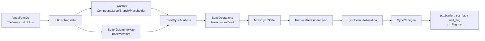

> 源码基线：[`hw-native-sys/PTOAS@e32488c9`](https://github.com/hw-native-sys/PTOAS/commit/e32488c9327a6f5e0fbbb71fb90fabdc669b3de7)。本文只把该 commit 已合入的代码作为当前事实；测试能证明的范围、开放 PR 的计划与硬件映射推断分别标注。

## 本篇在 PTO 课程路线中的位置

上一章从 FlashAttention 的 `PIPE_V` barrier patch 反推出一条原则：同步只能在依赖已被证明不存在或被其他边覆盖时删除。今天向前追到证明的生产者——PTOAS `InsertSync`。本章不继续讲某个特定 kernel，而只回答一个基础问题：**一个 Tile 内存依赖怎样一路变成设备可执行的 barrier 或 event？**

这是第 15 章，仍以 ISA 同步语义为中心，但正式进入第二阶段的 compiler lowering：`BaseMemInfo → SyncIR → SyncOperation → eventIds → pto.set_flag/wait_flag/barrier`。

## 前置知识

- `TLOAD` 通常运行在 `PIPE_MTE2`，Vector elementwise 在 `PIPE_V`，Vec `TSTORE` 在 `PIPE_MTE3`。
- RAW 是“后读依赖前写”，WAR 是“后写不能越过前读”，WAW 是“两次写必须保持顺序”。
- 同 pipe 的发射顺序不自动等价于所有内存副作用均已完成；跨 pipe 更必须建立显式 happens-before。
- Event 是方向明确的 producer/consumer 边，不是全局 barrier；event ID 是有限可复用资源。

## 今日核心问题

1. PTOAS 如何从 SSA Tile/view 恢复物理上可能重叠的内存区间，并识别 RAW/WAR/WAW？
2. 为什么同 pipe 生成 barrier，跨 pipe 生成成对 set/wait；有限 event ID 耗尽时又怎样保正确性？

## PTO 全栈中的位置

[`PTOInsertSyncPass`](https://github.com/hw-native-sys/PTOAS/blob/e32488c9327a6f5e0fbbb71fb90fabdc669b3de7/lib/PTO/Transforms/InsertSync/PTOInsertSync.cpp) 的真实顺序如下：



若函数已经含 `SetFlagOp`、`WaitFlagOp`、`RecordEventOp` 或 `WaitEventOp`，pass 直接返回，避免在手工同步上重复分析。含 gather/scatter-like op 的函数暂时跳过 `RemoveRedundantSync`，这是代码中的 correctness-first 临时边界，不代表不需要同步。

## 概念和精确语义

### `BaseMemInfo`：不是“一个 SSA 名字”，而是一段可能的内存

[`SyncCommon.h`](https://github.com/hw-native-sys/PTOAS/blob/e32488c9327a6f5e0fbbb71fb90fabdc669b3de7/include/PTO/Transforms/InsertSync/SyncCommon.h) 中的 `BaseMemInfo` 记录：

| 字段 | 语义 |
| --- | --- |
| `baseBuffer` | 当前 op 直接看到的 Tile/view SSA value |
| `rootBuffer` | allocation 或 kernel argument 等所有权根 |
| `scope` | GM、VEC、MAT、ACC、LEFT、RIGHT 等地址空间 |
| `baseAddresses` | 一个或多个候选起始地址/相对偏移；多缓冲时可对应多个 slots |
| `allocateSize` | 访问包络的字节数 |
| `hasKnownPhysicalAddresses` | 本地地址是否已经是 PlanMemory 可比较的物理地址 |
| `aliasesUnknownRange` | 指针经整数往返等导致范围丢失时，保守别名同 scope 任意范围 |

对象由 `PTOIRTranslator` 为 kernel 参数、`alloc_tile`、`alloc_multi_tile` 建立，并沿 view/subview/cast/mov 传播；其生命周期不是运行时 allocation，而是 compiler analysis 中对一个内存对象的证据快照。`CompoundInstanceElement` 的 `defVec/useVec` 持有指向这些对象的指针，后续 analysis 消费它们；pass 结束后整个分析容器一起销毁。

[`MemoryDependentAnalyzer::MemAlias`](https://github.com/hw-native-sys/PTOAS/blob/e32488c9327a6f5e0fbbb71fb90fabdc669b3de7/lib/PTO/Transforms/InsertSync/MemoryDependentAnalyzer.cpp) 先排除不同 address space；同 scope 且 `aliasesUnknownRange` 则直接 may-alias。GM 主要沿 root/view 判断；本地内存若两侧已有物理地址，则比较所有半开区间 `[base, base+size)`。信息不足时，同 root 的未知地址或未知 size 按重叠处理。

一个已合入的重要修复是 [PR #935](https://github.com/hw-native-sys/PTOAS/pull/935)：两个不同 SSA allocation 可能被 PlanMemory 复用到重叠 UB 区间。旧逻辑只看 root identity，会漏掉 `MTE3 TSTORE` 尚在读、`PIPE_V` 已覆盖写的 WAR；当前代码能跨 root 比较已知物理区间。相反，[PR #948](https://github.com/hw-native-sys/PTOAS/pull/948) 截至本源码基线仍未合入，它提出更完整的地址 provenance、overflow 与 subview 包络模型，本文只把它视为计划和风险证据。

### `SyncIR` 与 `SyncOperation`

translator 把嵌套 MLIR 拉成顺序 `SyncIRs`，但保留四类节点：

- `CompoundInstanceElement`：真实计算/搬运 op，含 `kPipeValue`、`defVec/useVec`；
- `LoopInstanceElement`：成对保存 `beginId/endId`；
- `BranchInstanceElement`：保存 if/else/end 边界；
- `PlaceHolderInstanceElement`：为 branch yield 或虚拟 else 提供同步锚点。

`SyncOperation` 则是分析产出的逻辑同步。set/wait 共享 `kSyncIndex`，分别挂到 producer 的 `pipeAfter` 和 consumer 的 `pipeBefore`；同 pipe barrier 只有一个对象。它还保存 `srcPipe/dstPipe`、挂载位置、回边 `forEndIndex`、依赖 root、`eventIdNum/eventIds`、多缓冲 `slotSSAExpr/slotCount` 与 `uselessSync` tombstone。

## 真实文件、类型和函数逐段解读

### 1. `InsertSeqSync`：为当前 op 反向寻找最近的充分覆盖

[`InsertSyncAnalysis.cpp`](https://github.com/hw-native-sys/PTOAS/blob/e32488c9327a6f5e0fbbb71fb90fabdc669b3de7/lib/PTO/Transforms/InsertSync/InsertSyncAnalysis.cpp) 对每个 `nowCompound` 从前一节点反向扫描。`IsMemInfoHasDependency` 依次检查：

```text
RAW: now.use × front.def
WAR: now.def × front.use
WAW: now.def × front.def
```

此外，跨 pipe 对 ACC 的 read/read 也被当成特殊硬件 hazard。命中后：

- `nowPipe == frontPipe`：在 consumer 前建立 `PIPE_BARRIER`；
- pipe 不同：producer 后建立 `SET_EVENT`，consumer 前建立匹配 `WAIT_EVENT`。

`SyncRecordList` 有 16 个多缓冲槽，每个槽用 `alreadySync[pipe]` 防止对同一当前 op 重复生成已覆盖的源 pipe 同步，并以 `syncFinder[syncIndex]` 在反扫中配对已经遇到的 wait 与更早的 set。这里的粒度很关键：普通静态 event 可以覆盖 pipe pair 的一段生命周期；slot-keyed dynamic event 只覆盖自己的 lane，不能被当成 whole-pipe coverage。

### 2. 控制流：必须证明每条可达路径都同步

循环可能 zero-trip，因此扫描 loop body 得到的 `alreadySync` 不能提升到外层；当前代码只传播 `syncFinder`。if/else 则用两分支 `alreadySync` 的交集：只有 then、else 都覆盖，外层才能把依赖视为已同步；无 else 时同样不能提升 then-only 的事实。

回边另行处理：`DealWithLoopSync` 拷贝 `[beginId,endId)` 的结构并把当前迭代与“下一迭代”配对，识别 ping-pong slot 复用的 WAR/WAW。动态多缓冲只有在 producer/consumer 都能恢复唯一 slot SSA 时才设置 `eventIdNum>1`；缺失或多组表达式歧义会降为一个静态 event。

### 3. Motion 与冗余删除：移动位置，不改变配对身份

`MoveSyncState` 可把 wait 提到循环/分支前、把 set 沉到后方，但不改 `kSyncIndex`。`RemoveRedundantSync` 只在区间内存在完整同 pipe-pair 内层 set/wait 时删除外层对，并把对象标记 `uselessSync`、从节点挂载表摘除。loop 可能零次执行，所以 loop 内同步不能证明 loop 外同步冗余；branch 必须两侧都覆盖。

### 4. Event ID：有限资源的区间着色

[`SyncEventIdAllocation.h`](https://github.com/hw-native-sys/PTOAS/blob/e32488c9327a6f5e0fbbb71fb90fabdc669b3de7/include/PTO/Transforms/InsertSync/SyncEventIdAllocation.h) 定义普通 event ID 池大小为 8，BlockSync 池为 16，14/15 预留给 block-all。不同 `(srcPipe,dstPipe)` 方向使用不同 `EventCyclePool`；每个 ID 的 `slot[id]` 保存 `[setIndex,waitIndex]` 生命周期端点。

分配器先检查生命周期冲突并选择 idle/reusable ID，再尝试 widen 与回边重分配。多缓冲的 N 个 lanes 需要 N 个 ID。若安全分配仍失败，`ChangeNoEventIdSyncToPipeAll` 把该同步改成原程序点的 `PIPE_ALL`。这会损失 overlap，却满足最基本不变量：**资源紧张只能降低并行度，不能降低依赖覆盖。**

### 5. `SyncCodegen`：把逻辑同步重新锚定到 MLIR

[`SyncCodegen.cpp`](https://github.com/hw-native-sys/PTOAS/blob/e32488c9327a6f5e0fbbb71fb90fabdc669b3de7/lib/PTO/Transforms/InsertSync/SyncCodegen.cpp) 先把 `SyncIR` 上的 `pipeBefore/pipeAfter` 汇总到真实 `Operation*`，再生成：

- 单 event：`pto::SetFlagOp` / `pto::WaitFlagOp`；
- 多缓冲：计算 `slot % N`，以 select chain 选 `eventIds[lane]`，生成 `SetFlagDynOp/WaitFlagDynOp`；
- barrier：`pto::BarrierOp`，相邻相同 barrier 去重；自动尾部 `PIPE_ALL` 延迟到每个 return 前。

A5 的 `PIPE_V` 同 pipe barrier 在这里不发出，注释给出的当前事实是硬件保证排序且 backend 拒绝该 barrier；这是一条 target-specific contract，不能外推到 A2/A3。

## 对象生命周期与端到端指令链

```mermaid
sequenceDiagram
    participant TR as PTOIRTranslator
    participant BM as BaseMemInfo
    participant AN as InsertSyncAnalysis
    participant SO as SyncOperation pair
    participant EA as EventIdAllocation
    participant CG as SyncCodegen

    TR->>BM: create/propagate root, scope, ranges
    TR->>AN: Compound(defVec,useVec,pipe)
    AN->>BM: DepBetween + MemAlias
    BM-->>AN: overlapping pair(s)
    AN->>SO: SET after producer + WAIT before consumer
    Note over SO: same kSyncIndex; no event ID yet
    EA->>SO: allocate eventIds by pipe-pair lifetime
    alt N-slot back edge with proven slot SSA
        EA->>SO: eventIds[0..N-1]
        CG->>CG: lane = slot % N
        CG->>SO: lower *_flag_dyn
    else single/static dependency
        CG->>SO: lower set_flag/wait_flag
    end
    Note over BM,SO: pass end: analysis-only objects released
```

## 具体 shape、Tile 和状态演算

取一个 A3 说明例，三个 local Tile 都是 `!pto.tile_buf<loc=vec,dtype=f16,rows=4,cols=8,v_row=4,v_col=8,row_major>`，每 Tile 有 `4×8×2=64 B`。设 `%x` 在 UB `[0,64)`，`%y` 在 `[64,128)`，互不重叠：

```text
TLOAD  GM[a] -> %x      // PIPE_MTE2, def %x
TADD   %x, %x -> %y     // PIPE_V, use %x, def %y
TSTORE %y -> GM[out]    // PIPE_MTE3, use %y
```

扫描 `TADD` 时，`now.use(%x) × front.def(%x)` 命中 RAW；pipe 不同，生成 `MTE2→V` set/wait。扫描 `TSTORE` 时，`now.use(%y) × front.def(%y)` 命中 RAW，生成 `V→MTE3` set/wait。假设生命周期互不冲突且两个方向各选 ID 0，codegen 近似为：

```text
TLOAD ...
set_flag(MTE2, V, 0)
wait_flag(MTE2, V, 0)
TADD ...
set_flag(V, MTE3, 0)
wait_flag(V, MTE3, 0)
TSTORE ...
```

两个 `0` 不冲突，因为 event pool 按有向 pipe pair 隔离。若随后另一个 `TADD` 原地读写 `%y`，同为 `PIPE_V` 且存在 RAW/WAW，则在第二个 Vector op 前生成 `PIPE_V` barrier，而不是 event。

双缓冲回边再增加 `%buf[i%2]`：第 `i` 次 `TLOAD` 不得覆盖前一轮尚未被 Vector 消费的同一 slot。若 producer 与 consumer 的 slot SSA 都可证明，分配两个 event IDs，例如 `[2,3]`，运行时用 `i%2` 选择 lane。测试所强调的关键点是：region A 的 `[0,1]` 不能替 region B 的 `[2,3]` 提供覆盖，即使两者 pipe pair 都是 `V→MTE2`。

## 为什么这样设计及替代方案

第一性原理上，最小正确输入不是 SSA def-use，而是“操作是否访问同一物理范围、访问方向、所属 pipe 与控制流可达性”。`BaseMemInfo + MemoryEffect + structured SyncIR` 恰好承载这些证据；event allocation 则是正确性约束确定后才做的资源优化。

替代方案一是每个异步 op 后插 `PIPE_ALL`。它简单可靠，但会串行 MTE2/V/MTE3，毁掉 load-compute-store overlap。替代方案二是完全依赖用户手写 event，性能可控，却把 alias、loop back-edge、PlanMemory 复用与 event ID 生命周期交给 kernel 作者，维护成本和静默竞态风险更高。替代方案三是构建全局 dependence graph 并做统一调度/着色，可能减少同步，但控制流、动态 alias 和 target macro pipe 会显著增加编译复杂度。当前局部反扫加保守 fallback 更易审计，但会产生 false-positive 同步。

## 访存、流水、并行和硬件约束

- 精确地址区间能减少假依赖；未知范围保守 alias 会增加 event/barrier，却不应漏同步。
- 同步对象不搬数据；它影响的是 producer 完成可见性与 buffer reuse 时刻。
- 静态 event 一条边可覆盖一段 pipe-pair 生命周期；dynamic event 的每个 ID 只代表一个 slot lane。
- 8 个普通 ID 是每个 pipe pair 的 compiler pool contract。深层嵌套和多 buffer 会加大生命周期重叠，触发 widen/reallocate 或 `PIPE_ALL`。
- 推断：event 比 `PIPE_ALL` 更容易保留跨 pipe overlap，但真实延迟取决于 target 上 flag 指令、队列深度与 stall，源码不能给出周期数。

## 测试证据与未覆盖风险

代码库的 lit/FileCheck 测试验证的是生成 topology，不是设备时序：

- [`test_inject_sync_intra_pipe_barrier.pto`](https://github.com/hw-native-sys/PTOAS/blob/e32488c9327a6f5e0fbbb71fb90fabdc669b3de7/test/samples/Sync/test_inject_sync_intra_pipe_barrier.pto)：两个共享 `%ub0` 的 `TADD`，要求 `PIPE_V` barrier，证明同 pipe hazard 不会被短路。
- [`syncfinder_zero_loop_if_probe.pto`](https://github.com/hw-native-sys/PTOAS/blob/e32488c9327a6f5e0fbbb71fb90fabdc669b3de7/test/lit/pto/syncfinder_zero_loop_if_probe.pto)：循环上界动态、可能 zero-trip，要求 `MTE2→V` wait 被移到 loop 前，证明 bypass path 仍有顺序。
- [`issue226_remove_redundant_pipe_pair.pto`](https://github.com/hw-native-sys/PTOAS/blob/e32488c9327a6f5e0fbbb71fb90fabdc669b3de7/test/lit/pto/issue226_remove_redundant_pipe_pair.pto)：分支内完整同 pipe-pair 同步可覆盖外层冗余对，并检查每方向只保留一次 wait。
- [`multi_tile_two_regions_two_gets_sync.pto`](https://github.com/hw-native-sys/PTOAS/blob/e32488c9327a6f5e0fbbb71fb90fabdc669b3de7/test/lit/pto/multi_tile_two_regions_two_gets_sync.pto)：两个独立双缓冲 region 必须各有两条 event lanes，共四个 IDs；各自 tload 前的 dynamic wait 绑定各自 slot SSA，loop 后再 drain 四个静态 lanes。

这些测试没有证明：event ID 耗尽 fallback 在真机的所有控制流位置均无死锁；alias integer overflow；异常/early-exit 是否闭合 dynamic lanes；A3/A5 同一 topology 的设备语义一致；高 event pressure 下的 stall 与性能。开放 PR #948 明确报告 targeted lit 通过但未做 NPU validation，也不能当成 main 的当前保证。

## 与前后章节的连接

课程 14 的 barrier patch 现在有了上游语义：被 patch 的 barrier 原本来自同 pipe memory hazard；删除者必须重新承担 alias、控制流与 target contract 的证明义务。更早的 TPipe/Online Softmax 章节则解释了为什么 slot identity 不能被一条“同 pipe pair”抽象抹平。

下一章回到最危险的边界：**PTOAS PlanMemory 复用与 InsertSync 的跨 root 物理 alias**，追踪 allocation live range 已结束但异步 MTE3 仍在读时，为何编译器仍必须保留 WAR event。

## 本篇结论、知识债、理解检查和下一章

结论：`InsertSync` 不是“插几条 flag”的文本 pass，而是一条证据保全链。`BaseMemInfo` 确定可能重叠的内存，RAW/WAR/WAW 确定必须排序的访问，`SyncOperation` 保存逻辑边，event allocator 在有限资源中着色，codegen 最后才选择静态或动态指令。任何阶段证据不足都应降低并行度，而不能降低正确性。

知识债：地址 provenance/overflow 和动态 subview 仍在开放 PR 中演进；`syncFinder` 的 may-path 传播需要更形式化的 must/may 模型；event exhaustion、异常退出与设备 race 缺少压力测试；A5 `PIPE_V` implicit ordering 仍缺公开指令级证据。

三个理解检查问题：

1. 为什么 `TSTORE(old)` 之后 SSA 上 `old` 已死，仍可能需要 `MTE3→V` WAR event 才能复用同一 UB？
2. 两个 dynamic event 对的 `src/dst pipe` 相同，为什么仍不能自动删除其中一对？
3. event ID 分配失败时，为什么“在原程序点改成 `PIPE_ALL`”比把自动尾 barrier 提前使用更安全？

## 课程账本增量

- 完成：第 15 章，`PTOIRTranslator → BaseMemInfo → InsertSyncAnalysis → SyncOperation → Move/Remove → EventIdAllocation → SyncCodegen`。
- 新确认不变量：不同 address space 不 alias；未知同 scope 范围保守 alias；同 pipe hazard 用 barrier、跨 pipe用配对 event；slot-keyed event 只覆盖自身 lane；ID 失败降级 `PIPE_ALL`。
- 新增知识债：地址 overflow/subview provenance、must/may 控制流、event exhaustion 真机与异常退出测试。
- 下一章：PlanMemory physical range reuse 与跨 root async WAR。
