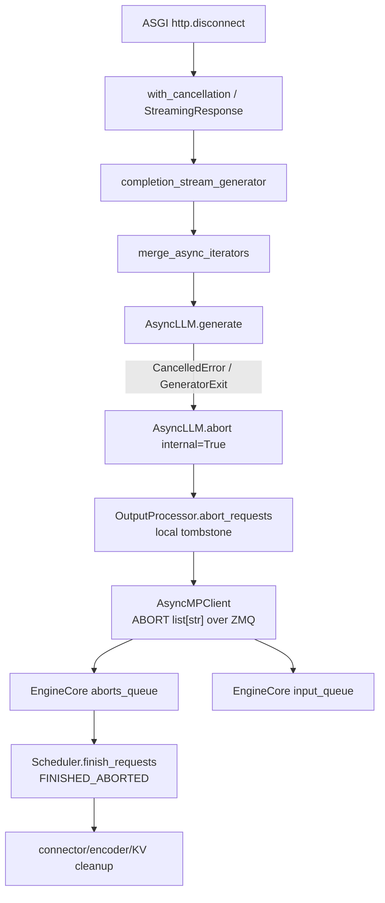
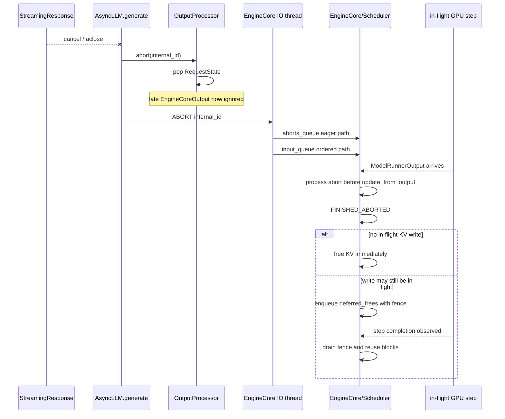

> 源码基线：[`vllm-project/vllm@a7195188`](https://github.com/vllm-project/vllm/commit/a7195188a4b45dec40030467ec6b69b4f1283c8e)。下文把已合入实现称为“代码事实”，测试能证明的行为称为“测试事实”；关于网络时序和负载成本的结论会明确标为推断。

## 本篇在课程路线中的位置

前 14 章已经从请求构造追到 Scheduler、KV、ModelRunner、Attention、Sampling、分布式执行与图编译。现在进入 Serving：设备可能仍在计算，但 HTTP 消费者随时会消失。今天只回答一个边界清晰的问题：**客户端断连以后，谁负责停止生成，迟到 token 为什么不会复活请求，KV 又何时才真正可复用？**

## 前置知识回顾

- `InputProcessor.assign_request_id` 保存 `external_req_id`，并给 EngineCore 内部 ID 追加 8 位随机后缀，防止可复用外部 ID 形成 ABA。
- `SchedulerOutput → ModelRunnerOutput` 是异步事务；abort 可能在 forward 已经发射以后到达。
- KV ownership 的逻辑终止与物理 block 可复用不是同一时刻；在途 GPU 写必须先越过完成 fence。

## 本篇要回答的核心问题

1. `http.disconnect` 如何变成 `AsyncLLM.generate()` 的 `CancelledError` 或 `GeneratorExit`？
2. 为什么取消时先删 `OutputProcessor` 状态，再向 EngineCore 发 ABORT？
3. 同一个 ABORT 为什么同时进入两条 EngineCore 队列？
4. forward 已经在跑时，如何避免自然完成覆盖 `FINISHED_ABORTED`，又如何避免过早复用 KV block？

## 组件在全局架构中的位置

[`completion/api_router.py`](https://github.com/vllm-project/vllm/blob/a7195188a4b45dec40030467ec6b69b4f1283c8e/vllm/entrypoints/openai/completion/api_router.py) 的 `/v1/completions` 由 `@with_cancellation` 包装，并在 streaming 模式返回 `StreamingResponse`。取消有两个阶段：

- **响应对象返回前**：[`with_cancellation`](https://github.com/vllm-project/vllm/blob/a7195188a4b45dec40030467ec6b69b4f1283c8e/vllm/entrypoints/serve/utils/api_utils.py) 同时等待 handler 与 `listen_for_disconnect()`；断连先到就取消 handler。此时 async generator 通常还没开始迭代，也就尚未向 EngineCore admission。
- **StreamingResponse 开始后**：decorator 停止监听，由 response 自己监听断连；stream iterator 被关闭/取消，关闭沿嵌套 async generator 向下传播。

这里没有 token tensor 穿过取消边界。ABORT 的输入是 Host 侧 `list[str]`，经 msgpack/ZMQ 发送，不含 shape、dtype、device 或 auxiliary tensor frame；真正需要保护的是这些字符串所指向的跨进程状态与设备资源。

## 完整调用链

[`OpenAIServingCompletion._create_completion`](https://github.com/vllm-project/vllm/blob/a7195188a4b45dec40030467ec6b69b4f1283c8e/vllm/entrypoints/openai/completion/serving.py) 为每个 prompt 建立 `engine_client.generate(...)`，再用 [`merge_async_iterators`](https://github.com/vllm-project/vllm/blob/a7195188a4b45dec40030467ec6b69b4f1283c8e/vllm/utils/async_utils.py) 汇合。单 iterator fast path 在 `finally` 中执行 `aclose()`；多 iterator path 会 cancel 未完成的 `anext` task，并逐个 `aclose()`。因此上层 stream 停止，不会只关掉 JSON 序列化层而遗留底层生成器。

[`AsyncLLM.generate`](https://github.com/vllm-project/vllm/blob/a7195188a4b45dec40030467ec6b69b4f1283c8e/vllm/v1/engine/async_llm.py) 首次迭代时执行：

1. `add_request()` 处理输入并随机化 internal request ID；
2. 创建 `RequestOutputCollector(output_kind, internal_id)`；
3. `_add_request()` **先**在本进程 `OutputProcessor` 注册 `RequestState`，再 `add_request_async()` 发往 EngineCore；
4. 背景 `output_handler` 从 EngineCore 拉一批输出，按 internal ID 投递到 collector；前台 generator 只消费并 `yield`。

一旦捕获 `CancelledError` 或 `GeneratorExit`，它以 `q.request_id` 调用 `abort(..., internal=True)`，然后重新抛出取消，最终 `q.close()`。`internal=True` 很重要：这已经是随机化后的生命周期 ID，不能再当外部 ID 展开；若是 `n>1` parent，则 `OutputProcessor` 递归展开所有 child IDs。

## 关键类型、字段和状态生命周期

| 状态/接口 | 输入与所有权 | 后置条件 | 失败或竞态 |
| --- | --- | --- | --- |
| `RequestOutputCollector` | API 进程拥有；单槽 `output` + `asyncio.Event` | DELTA 生产快于消费时合并输出 | `close()` 只取消 input-stream task，不代替 EngineCore abort |
| `OutputProcessor.request_states` | internal ID → `RequestState`；API 进程唯一写者 | abort 时先 `pop`，未来迟到输出查不到 state 而被忽略 | 本地删除成功、远端消息尚未到达是允许的短暂状态 |
| `external_req_ids` | external ID → 多个 internal IDs | 显式外部 abort 可终止同名 fan-out；内部取消只终止精确生命周期 | 禁用 ID 随机化会重新暴露复用风险 |
| `AsyncMPClient.abort_requests_async` | `list[str]`，Host/msgpack/ZMQ | socket send await 完成；不等待 Scheduler 已释放资源 | Engine 已 dead 时跳过发送，因为整体正在 shutdown |
| `Scheduler.requests` | EngineCore busy loop 持有 canonical `Request` | terminal status 后从 waiting/running 移除并触发资源回收 | 在途 step 可产生迟到 output，必须按 finished/tombstone 丢弃 |

`OutputProcessor.abort_requests()` 先移除 `RequestState` 与 external→internal 映射，再生成一个 `finish_reason=abort` 的本地终态输出，最后返回需要通知 EngineCore 的 internal IDs。显式 API 调用 `abort(internal=False)` 的消费者仍在，能读到这份 final abort output；断连路径的消费者已经被取消，这份 output 即使放进 collector 也不会再发送到网络。

这不是多余工作：同一实现同时服务“用户显式停止并等待终态”和“消费者消失后静默清理”两种语义。

## 逐函数源码解读

### 1. `with_cancellation`：取消不是轮询业务状态

它不在每个 token 后调用 `request.is_disconnected()`，而是让 handler 与 ASGI receive 并发竞速。这样预处理、排队、prefill 等尚未产生 token 的阶段也能取消；代价是该 decorator 假设 FastAPI 已读完 request body，否则监听任务会消费并丢弃请求消息。代码注释把这个前置条件写得很清楚。

### 2. `RequestOutputCollector`：有限的合并，不是有界背压

collector 只有一个待取对象。`DELTA` 模式下生产者领先时，`RequestOutput.add(..., aggregate=True)` 合并 chunk，避免无限堆积逐 token 对象；但合并后的文本/token 本身仍会增长。因此它降低调度与对象开销，却不是严格的 memory bound。慢消费者和超长输出的峰值内存仍需实测。

### 3. `OutputProcessor.abort_requests`：本地 tombstone 优先

先 `request_states.pop()` 建立“本请求已死”的本地事实。之后即使 EngineCore 的旧输出已在 socket 上，`process_outputs()` 看到 `req_state is None` 就直接忽略。若顺序反过来，等待远端确认期间，旧 token 仍可能进入已取消 collector，扩大状态和内存窗口。

### 4. `AsyncMPClient` 与 EngineCore 双队列

`abort_requests_async()` 发 `EngineCoreRequestType.ABORT`。EngineCore IO thread 把它同时写入：

- `aborts_queue`：forward 返回后、`scheduler.update_from_output()` 前抢占处理，让取消赢过同一步自然 EOS/length completion；
- `input_queue`：保持相对 ADD/ABORT 的 wire 顺序，避免“尚未 admission 的 ADD 被快速 ABORT 越过”而泄漏。

Scheduler 对不存在或已 finished ID 直接跳过，所以双重处理依赖且满足幂等性。

### 5. `Scheduler.finish_requests`：逻辑终止先于物理复用

它先批量从 `running/waiting/skipped_waiting` 移除请求，再标记 `FINISHED_ABORTED`，调用 connector finish hook、释放 encoder cache，并记录 `finished_req_ids`。KV block 若没有在途写可立即 `kv_cache_manager.free(request)`；否则先 `pop_blocks_for_free` 到 `deferred_frees(fence_seq, blocks)`，等 `processed_step_seq` 越过 fence 再归还 block pool。

## 具体示例与状态演算

设 streaming completion 的外部 ID 是 `cmpl-r42-0`，随机化后 internal ID 为 `cmpl-r42-0-a1b2c3d4`；请求已生成 20 tokens，占 3 个 KV blocks，block size 为 16，因此第三块只使用前 4 slots。第 21 token 的 forward 已发射，此时客户端断连。

| 时刻 | API 进程 | EngineCore/Scheduler | KV 状态 |
| --- | --- | --- | --- |
| T0 | collector 等待下一 chunk | request 为 RUNNING | 3 blocks 归请求所有 |
| T1 | stream cancel 进入 `generate` | 第 21 token 正在 GPU 执行 | 最后一块可能被写 slot 4 |
| T2 | `RequestState` 被 pop；迟到 output 将丢弃 | 尚未看到 ABORT | 不能立刻假设写结束 |
| T3 | ZMQ ABORT 已发送 | eager abort 先于 output commit，标记 `FINISHED_ABORTED` | 逻辑 ownership 结束；blocks 进入 deferred fence |
| T4 | generator 已关闭 | 第 21 token output 因 finished request 被跳过 | GPU step 完成后 3 blocks 才回池 |

第 21 token 可能真实算过，算力无法撤销；系统保证的是它不会成为 API 可见 token，也不会把尚在写入的物理页提前分配给别的请求。这正是“取消是终止未来副作用并安全回收，而不是时间倒流”。

## 为什么这样设计及替代方案

从第一性原理看，最小充分设计需要五个条件：断连能打断所有阶段；本地立即建立 tombstone；跨进程取消有顺序；终止幂等；物理资源复用受设备完成 fence 约束。当前设计恰好分别落在 ASGI cancellation、`request_states.pop`、双队列、`finish_requests` 与 `deferred_frees`。

替代方案一是每个输出 chunk 主动轮询 `is_disconnected()`。实现直观，但 prefill/排队期间没有 chunk 就不能及时发现；middleware 下还存在源码注释指出的失效问题，并给 hot path 增加检查。替代方案二是只给 EngineCore 发 abort、等待其确认后再清本地状态；它提供更强确认语义，却扩大迟到输出窗口并增加一轮 RTT。替代方案三是租约/heartbeat：能处理 API 进程硬死或网络黑洞，但需要时钟、续租、超时误杀和持久 ownership，延迟与维护成本显著更高。当前协程取消适合进程仍存活的常规断连；硬崩溃回收仍需外层 liveness 机制。

## 性能、并发、正确性与边界条件

- 取消延迟至少包含 ASGI 断连交付、event-loop 调度和 ZMQ enqueue；已发射 kernel 通常不会被抢占，节省发生在后续 steps。
- `n>1` 与多 prompt 会形成多 internal child；`merge_async_iterators` 关闭剩余 iterators，`ParentRequest` 再展开 child abort，不能只取消第一个流。
- 本地 tombstone 和 Scheduler finished check 是两道迟到输出隔离；二者都按随机 internal ID 工作。
- 连接器可要求延迟释放 remote KV；`request_finished` 返回的 delay 与 GPU in-flight fence 是两个独立原因。
- `completion_stream_generator` 的普通 `except Exception` 不吞掉现代 Python 中继承 `BaseException` 的 `CancelledError`，取消会继续向下传播；这是当前运行时语义，不应靠宽泛异常捕获改写。
- 推断：大量同时断连时，批量 abort 可减少 Scheduler 删除开销，但取消风暴的 ZMQ、event-loop 与 connector 尾延迟尚无公开基准。

## 测试证据与未覆盖风险

[`test_mid_stream_cancellation`](https://github.com/vllm-project/vllm/blob/a7195188a4b45dec40030467ec6b69b4f1283c8e/tests/v1/engine/test_async_llm.py) 并发启动 100 个、上限 1000 tokens 的请求，在累计至少 20 tokens 后提前退出 async iteration。测试断言所有 `OutputProcessor` 状态清空，并复用首个 external ID 再成功生成；它验证 generator close→内部 abort→前端清理和随机 ID 复用的基本闭环。

同文件的 `test_abort_final_output` 覆盖显式 `abort(internal=False)`：DELTA/FINAL_ONLY 均收到 `finished=True, finish_reason="abort"`，且无遗留 request state。它证明显式 abort 的可观察终态，但不等价于断连，因为断连消费者已经消失。

[`test_abort_final_step.py`](https://github.com/vllm-project/vllm/blob/a7195188a4b45dec40030467ec6b69b4f1283c8e/tests/v1/engine/test_abort_final_step.py) 对 `async_scheduling` 两种模式，在 `max_tokens=1` 的最终 forward 中人为阻塞 worker，然后发 abort。测试验证 connector 看到 `FINISHED_ABORTED` 而非 `FINISHED_LENGTH_CAPPED`。对应已合入的 [PR #29987](https://github.com/vllm-project/vllm/pull/29987) 说明了为何要在 `update_from_output` 前处理 eager abort。

仍未覆盖：真实 ASGI socket 断连到 `AsyncLLM` 的端到端测试；断连恰逢 ADD 尚未被 Core 消费；多 prompt × `n>1` 全 child 归零；API 进程硬杀；取消风暴下的 P99；KV connector 延迟释放与 deferred GPU fence 同时存在时的引用归零。现有 mid-stream 测试通过 `return` 关闭生成器，不是 TCP 半开、RST 或代理超时故障注入。

## 与前后章节的连接

第 03 章解释了 ABORT 双队列，本章把它的上游补到 HTTP disconnect，并把下游延伸到当前 Scheduler 的 deferred KV free。第 08 章的 finish transaction 在这里获得外部触发源：自然 stop、显式 abort 与连接取消最终都必须收敛到唯一 terminal state，但 API 可见性不同。

下一章继续 Serving，但只研究输出方向：`EngineCoreOutputs → output_handler → RequestOutputCollector → SSE` 的并发、chunk coalescing、慢消费者内存与错误传播。

## 本篇结论、知识债与理解检查

结论：**Serving 取消的正确性不在于立刻停止 GPU，而在于让消费、Host state、Core scheduling 和物理 KV reuse 按正确顺序收敛。** 本地 tombstone 隔离迟到输出，双队列兼顾 eager 优先级与 ADD/ABORT 顺序，Scheduler fence 则保证旧写结束前 block 不被新请求复用。

知识债：需要 ASGI 真实断连、取消风暴、parent/child fan-out 和 connector×GPU 双重延迟释放测试；还要量化 collector 合并后的实际内存上限。

三个理解检查问题：

1. 为什么断连路径必须用 internal ID abort，而公开 `engine.abort()` 默认接收 external ID？
2. 如果只保留 `aborts_queue`、删除有序 `input_queue` 中的 ABORT，快速 ADD→ABORT 会怎样泄漏？
3. `RequestState` 已 pop 后，为什么 KV blocks 仍可能暂时不能回到 block pool？

## 课程账本增量

- 完成：第 15 章，`OpenAIServingCompletion → StreamingResponse → merge_async_iterators → AsyncLLM.generate → OutputProcessor → AsyncMPClient → EngineCore → Scheduler/KV`。
- 新确认不变量：取消先建立 API 进程 tombstone；ABORT 同时需要 eager 与 ordered 两条 Core 路径；in-flight GPU write 通过 step fence 延迟物理 KV 复用。
- 新增风险：真实网络断连、parent/child 全量清理、API 进程硬死和取消风暴缺少跨层覆盖。
- 下一章：output handler、collector 合并、SSE 慢消费者与错误传播。
