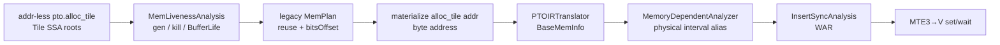

> 源码基线：[`hw-native-sys/PTOAS@203785cf`](https://github.com/hw-native-sys/PTOAS/commit/203785cf791f932acec3f9de0e6977387cd666d6)，默认分支于 2026-08-25 获取。该 commit 的直接主题是 VPTO post-update，并未改动本文核心路径；本文仍以此最新已合入代码为准。代码事实、测试断言、Issue/PR 实验记录和硬件推断分别标注。

## 本篇在 PTO 课程路线中的位置

第 15 章解释了 `BaseMemInfo → RAW/WAR/WAW → event ID → codegen`。但还留下最危险的一问：如果前后两个 op 使用的是**不同 SSA allocation root**，InsertSync 为什么仍会认为它们相互依赖？

本章只研究这一条边界：`PlanMemory` 看到旧 Tile 的最后一次 SSA 使用后复用其 UB；设备上的 `TSTORE` 却可能仍由 `PIPE_MTE3` 异步读取旧地址。正确性因此必须跨越两个 pass：规划器负责压缩物理 footprint，InsertSync 负责把“SSA 已死、设备未完成”的差额变成 `MTE3→V` event。

## 前置知识

- `TSTORE(Vec Tile → GM)` 的 source 是 UB，运行在 `PIPE_MTE3`；Vector `TMULS` 写 Vec Tile，运行在 `PIPE_V`。
- WAR（write after read）表示后写不能越过前读。本章中的“前读”是 MTE3 读取 UB，“后写”是 V pipe 覆盖同一物理 UB。
- `alloc_tile` 的 shape/dtype/location 决定 allocation footprint；valid shape 决定语义有效区，但不能把 allocation 任意缩小。
- Event 只建立顺序，不拥有数据；物理地址的 owner 仍是规划后的 allocation。

## 今日两个核心问题

1. `PlanMemory` 根据什么证据宣布一个 Tile 可以复用，它为什么看不见异步设备完成时刻？
2. `InsertSync` 如何在两个 `rootBuffer` 不同的情况下恢复物理重叠，并生成正确方向的 `MTE3→V` WAR？

## PTO 全栈中的位置

[`ptoas.cpp`](https://github.com/hw-native-sys/PTOAS/blob/203785cf791f932acec3f9de0e6977387cd666d6/tools/ptoas/ptoas.cpp) 当前默认 `--pto-level=level2`、`--plan-memory-impl=legacy`；modern planner 只有显式选择才启用。level1/level2 禁止用户给 `alloc_tile` 写 `addr`，先由 PlanMemory 补地址，再运行被选择的自动同步器：



主干 pass 顺序明确是 `PlanMemory → ResolveReservedBuffers → RemoveIdentityTMov → InsertSync`。这个顺序是契约的一部分：若同步分析早于物理地址物化，它无法可靠识别跨 root 复用。

还要注意：`--enable-insert-sync` 的 CLI 默认值是 `false`。本章的安全结论只适用于显式启用 InsertSync（或存在等价手工/其他同步方案）的完整 pipeline；**PlanMemory 单独成功，不等于异步执行已经安全。**

## 概念与精确语义：三个“结束时刻”

先把常被混淆的三个时刻分开：

| 时刻 | 含义 | 谁能证明 |
| --- | --- | --- |
| SSA last use | 后续 MLIR 不再引用旧 Tile value | MLIR liveness |
| instruction issue | `TSTORE` 已发射到 MTE3 | 程序顺序 / backend |
| device access complete | MTE3 已读完旧 UB 的最后一个字节 | event / barrier / 设备完成语义 |

`MemLivenessAnalysis::OpKillHandle` 使用 `Liveness::isDeadAfter` 检查 allocation 及 aliases；`GenerateBufferLife` 把第一次 gen 和 kill op 的线性序号写成 `[allocTime, freeTime]`。这是一条**编译器值生命周期**，不是 DMA completion fence。

legacy `MemPlan` 将同 address space 的 `StorageEntry` 放进 `MemoryBound`。`VerifyConflictStage0` 仅在逻辑 life interval 相交或存在 semantic no-alias conflict 时拒绝复用；没有相交便可把新 entry 放入同一物理洞。计划成功后，`bitsOffset` 从 bit 转成 byte，rewrite pattern 把常量地址写回 `pto.alloc_tile addr`。

所以 PlanMemory 的局部不变量只是：

> 同时逻辑存活、或语义上必须并存的 allocations 不得物理重叠。

它没有也不应假装证明：前一个异步 pipe 已经完成所有内存访问。

## 真实文件、类型、API 逐段解读

### 1. `BufferLife`：释放的是规划资格，不是硬件 ownership

[`PTOPlanMemory.h`](https://github.com/hw-native-sys/PTOAS/blob/203785cf791f932acec3f9de0e6977387cd666d6/lib/PTO/Transforms/PTOPlanMemory.h) 中，`BufferLife` 只含 `buffer/allocTime/freeTime`；`StorageEntry` 再附加 `alignedConstBits` 与 `bitsOffset`。[`PTOPlanMemory.cpp`](https://github.com/hw-native-sys/PTOAS/blob/203785cf791f932acec3f9de0e6977387cd666d6/lib/PTO/Transforms/PTOPlanMemory.cpp) 以半闭的整数时间区间判断 life overlap，并以半开字节区间检查最终地址冲突。

默认 legacy planner 还会优先安置 DMA touched buffer，并可在容量不足时使用多级 speculative strategy；但不论 placement heuristic 如何变化，本章的正确性条件都不能变：只要物理区间被复用，所有在途访问必须在覆盖写之前完成。

### 2. `BaseMemInfo`：把不同 SSA root 拉回同一物理坐标系

PlanMemory 写回地址后，[`PTOIRTranslator::UpdateAllocTileOpMemInfo`](https://github.com/hw-native-sys/PTOAS/blob/203785cf791f932acec3f9de0e6977387cd666d6/lib/PTO/Transforms/InsertSync/PTOIRTranslator.cpp) 为每个 allocation 建立：

```text
rootBuffer = alloc_tile result
scope = VEC
baseAddresses = [constant addr]
allocateSize = Tile physical footprint bytes
hasKnownPhysicalAddresses = true
```

这里 `rootBuffer` 仍不同，但 `baseAddresses` 已处在相同 UB 字节坐标系。于是 [`MemoryDependentAnalyzer::MemAlias`](https://github.com/hw-native-sys/PTOAS/blob/203785cf791f932acec3f9de0e6977387cd666d6/lib/PTO/Transforms/InsertSync/MemoryDependentAnalyzer.cpp) 在两侧都是已知本地物理地址时直接比较所有半开区间：

\[
[a,a+s_a)\cap[b,b+s_b)\ne\varnothing
\iff \max(a,b)<\min(a+s_a,b+s_b)
\]

严格 `<` 很重要：`a+s_a == b` 只是相邻，不是重叠。主干还保留 `isLocalBufferOverlapCrossRoot` 作为不同 surface/real root 后的物理区间检查。

### 3. WAR 如何变成 event

[`InsertSyncAnalysis::IsMemInfoHasDependency`](https://github.com/hw-native-sys/PTOAS/blob/203785cf791f932acec3f9de0e6977387cd666d6/lib/PTO/Transforms/InsertSync/InsertSyncAnalysis.cpp) 的第二项是：

```text
now.def × front.use   // WAR
```

对本章序列，`front=TSTORE`、`front.use=stored`、`now=TMULS`、`now.def=reused`。物理区间重叠后命中 WAR；因为 `frontPipe=MTE3`、`nowPipe=V` 不同，analysis 把 `SET_EVENT` 挂在 TSTORE 后，把匹配 `WAIT_EVENT` 挂在 TMULS 前。event allocator 再为有向 pair `(MTE3,V)` 分配 ID，codegen 生成 flag。

## 对象与状态生命周期

```mermaid
sequenceDiagram
    participant SSA as stored SSA
    participant PM as PlanMemory
    participant M3 as PIPE_MTE3
    participant IS as InsertSync
    participant V as PIPE_V / reused

    SSA->>PM: last use is TSTORE
    PM->>PM: freeTime reached; address may be reused
    PM->>V: assign overlapping UB to reused root
    SSA->>M3: issue TSTORE; MTE3 reads old UB asynchronously
    PM->>IS: materialized physical ranges
    IS->>IS: now.def × front.use => WAR
    IS->>M3: set_flag(MTE3,V,id) after TSTORE
    IS->>V: wait_flag(MTE3,V,id) before TMULS
    M3-->>V: after wait, reused may overwrite overlap
```

`BufferLife/StorageEntry/MemoryBound` 只活在 PlanMemory pass 内；物化后由 `alloc_tile addr` 承接结果。`BaseMemInfo/SyncOperation` 只活在 InsertSync pass 内；codegen 后由实际 `set_flag/wait_flag` 承接顺序。运行时不再存在这些 C++ 分析对象，只有物理 UB、指令队列与 event 状态。

## 端到端调用链与具体 shape 演算

直接使用主干回归 [`plan_memory_reused_tstore_sync_level2.pto`](https://github.com/hw-native-sys/PTOAS/blob/203785cf791f932acec3f9de0e6977387cd666d6/test/lit/pto/plan_memory_reused_tstore_sync_level2.pto)。目标 Tile 均为：

```text
location = vec, dtype = f32
capacity = valid = 16 × 128
layout = row_major
footprint = 16 × 128 × 4 = 8192 B
```

测试先放入 `1×45056xf32 = 180224 B` 的 pressure Tile，再加入 input、stored、256 B blocker 与 reused；简单无复用总量为 `205056 B`，超过默认 `196608 B` UB，迫使规划器寻找复用。

PlanMemory 的 FileCheck 固定了两个地址：

| allocation | 物理半开区间 | 逻辑状态 |
| --- | --- | --- |
| `stored` | `[8192, 16384)` | 在 `TSTORE` 处达到 SSA last use |
| `reused` | `[8448, 16640)` | 随后由 `TMULS` 写入 |
| overlap | `[8448, 16384)`，7936 B | 必须等待 MTE3 读完 |

对这两个 Tile 单独看，物理 union 只有 `8448 B`，若完全不重叠需 `16384 B`；复用节省 `7936 B` 的局部地址包络。它不是端到端显存或性能实测。

生成链为：

```text
TLOAD src1 -> stored             MTE2 writes UB
TMULS input -> stored            V writes UB
... V→MTE3 dependency ...
TSTORE stored -> GM              MTE3 reads [8192,16384)
set_flag(MTE3,V,event)
wait_flag(MTE3,V,event)
TMULS input -> reused            V writes [8448,16640)
```

若删除最后两条 flag，V pipe 可以在 MTE3 尚未读完 `[8448,16384)` 时覆盖它，GM 输出会静默混入新 Tile 数据。注意这里不是 RAW，也不是 WAW；前 op 对 UB 是读，后 op 对重叠 UB 是写，因此方向只能是 WAR。

另一个 level3 回归 [`plan_memory_reused_tstore_sync.pto`](https://github.com/hw-native-sys/PTOAS/blob/203785cf791f932acec3f9de0e6977387cd666d6/test/lit/pto/plan_memory_reused_tstore_sync.pto) 直接指定 `[1280,9472)` 与 `[8192,16384)`，用更小的 `1280 B` overlap 隔离验证物理 alias，不依赖 planner placement。

## 为什么这样设计及替代方案

从第一性原理看，不可违反的约束只有一个：**新 writer 获得重叠字节 ownership 前，所有旧 readers 必须完成。** 地址如何放、用 event 还是 barrier，是实现策略。

| 方案 | UB footprint | 流水与延迟 | 正确性/维护成本 |
| --- | --- | --- | --- |
| 当前：SSA reuse + post-plan physical InsertSync | 最积极复用 | 只在真实 hazard 处等待，可保留其他 overlap | 依赖 pass 顺序、地址 provenance 与完整 alias 分析 |
| 禁止跨 allocation 复用 | 最高 | 少 event，但可能因 UB 不足迫使更小 Tile/更多分块 | 最易审计，却牺牲容量与吞吐机会 |
| 把异步完成扩进 planner lifetime | 较高且保守 | 可减少后置 alias 复杂度，但会延长许多 ranges | planner 必须理解 pipe/event，层间耦合更强 |
| 每个 TSTORE 后 `PIPE_ALL` | 与当前相同 | MTE2/V/MTE3 大面积串行，延迟最差 | 简单安全，适合 fallback/诊断，不适合常态优化 |

当前设计是合理折中，但有硬前提：物化地址必须无歧义、未知范围必须 fail-conservative、同步 pass 不能被无证明地关闭或后续删除。

## 访存、计算、流水、并行和硬件约束

- 复用不减少 TLOAD/TSTORE 的 payload 字节；它减少同时需要保留的 UB address envelope。
- `MTE3→V` event 不搬数据，只可能让 V 在该点等待；若 MTE3 已完成，等待代价通常较小，但源码没有周期级保证。
- Tile 的 `8192 B` 来自 physical capacity，不因只关心某个 valid 子区而自动变小。
- 两个 range 只有同 address space 才比较；相同数值地址在 VEC 与 MAT 中不是 alias。
- 硬件映射推断：Issue #934 的 q-PASS/k-FAIL 与生成指令表明错误来自 MTE3/V 竞态；公开材料未给出精确队列深度、完成周期或 event latency，本文不据此估算加速。

## 测试证据与未覆盖风险

当前主干有两层直接证据：

1. level3 lit 直接指定两个重叠地址，要求 `TSTORE` 后紧跟 `set_flag(MTE3,V)`，`TMULS` 前有匹配 wait；它验证 alias 与 sync topology。
2. level2 lit 从 addr-less allocations 开始，同时检查 PlanMemory 物化 `stored=8192`、`reused=8448`，以及最终 MTE3→V flag；它验证 pass 顺序与端到端 compiler contract。

[Issue #934](https://github.com/hw-native-sys/PTOAS/issues/934) 记录的设备实验事实是：特定 QK-norm 复现中 PtoAS planner 出现 q-PASS/k-FAIL，k 输出约 `1902/2048` 元素错误、最大误差约 25；生成 C++ 可见重叠 UB 与缺失 flag。该问题由已合入 [PR #935](https://github.com/hw-native-sys/PTOAS/pull/935) 修复，PR 记录了 build、focused lit 和生成代码检查。本文没有重新运行 NPU 实验，不能把历史复现等同当前主干设备验证。

仍未覆盖的风险：

- 当前 tests 主要是 FileCheck topology，没有在主干每日 CI 中注入延迟、poison overlap 或低概率设备调度竞态；
- uint64 地址加 size 的 overflow、动态地址、reinterpret/subview 后的 provenance 仍可能影响 may-alias；
- InsertSync 关闭、被后续文本 patch 误删、或 pass 顺序改变时，没有跨 pass invariant verifier 阻止危险产物；
- modern planner 虽有额外 no-reuse gates，仍要求同步 pass覆盖 aggressive reuse 的跨 pipe hazard。

截至 2026-08-25，[PR #948](https://github.com/hw-native-sys/PTOAS/pull/948) 仍为开放、未合入状态；它提出 known/root-relative/unknown address provenance、overflow guard 与更保守 subview envelope，并报告 targeted lit 通过但 NPU validation 延后。它是计划与风险证据，不是当前主干保证。

## 与前后章节的连接

课程 15 讲的是“已知两个访问 alias 后怎样生成 event”；本章补上 alias 证据的来源，并证明 PlanMemory 与 InsertSync 共同拥有 memory reuse correctness。课程 14 的 barrier patch 也因此多一条审计义务：不能只看 SSA 变量名，必须保留跨 root physical WAR。

下一章将对照 legacy 与 modern planner，只研究一个边界：**touching lifetime 和 target hazard 为什么会让 modern planner宁可放弃一次地址复用**，并判断这些 gate 与 InsertSync 是互补还是重复。

## 本篇结论、知识债、三个理解检查问题和下一章

结论：`TSTORE` 之后存在两条生命周期。SSA 生命周期在最后一次引用处结束，物理读取生命周期在 MTE3 completion 处结束。PlanMemory 可以依据前者复用地址，但必须由 InsertSync 依据物理区间和访问方向建立后者的 fence。跨 root WAR 不是 corner case，而是激进内存复用能够成立的必要成本。

知识债：地址 provenance/overflow 与动态 subview 仍未在 main 完整闭合；缺少自动验证“PlanMemory reuse 必有同步方案”的跨 pass checker；缺少 legacy/modern 同输入的 UB peak、event 数和真机 stall 对照；Issue #934 修复后的真实 QK-norm 长时 race 压测未见公开结果。

三个理解检查问题：

1. 为什么 `stored` 在 `TSTORE` 后 `isDeadAfter==true`，仍不能立刻让 V pipe 覆盖其地址？
2. 若 `stored=[0,8192)`、`reused=[8192,16384)`，为什么不应生成这条 WAR event？若加法发生 uint64 overflow，结论为何不再可信？
3. 如果 planner 通过禁止复用消除了这条 WAR，代价主要发生在 HBM traffic、UB footprint，还是 event 数？为什么？

## 课程账本增量

- 完成：第 16 章，`MemLivenessAnalysis → legacy MemPlan → alloc_tile addr → BaseMemInfo → cross-root WAR → MTE3→V event`。
- 新确认不变量：SSA last use 不等于异步 pipe 完成；物理复用的安全条件是旧 readers 完成后新 writer 才获得 overlap ownership；InsertSync 必须运行在地址物化之后。
- 新增知识债：跨 pass reuse/sync verifier、provenance/overflow、legacy/modern UB/event/device 对照。
- 下一章：modern PlanMemory 的 touching-lifetime 与 target-hazard no-reuse gates。
