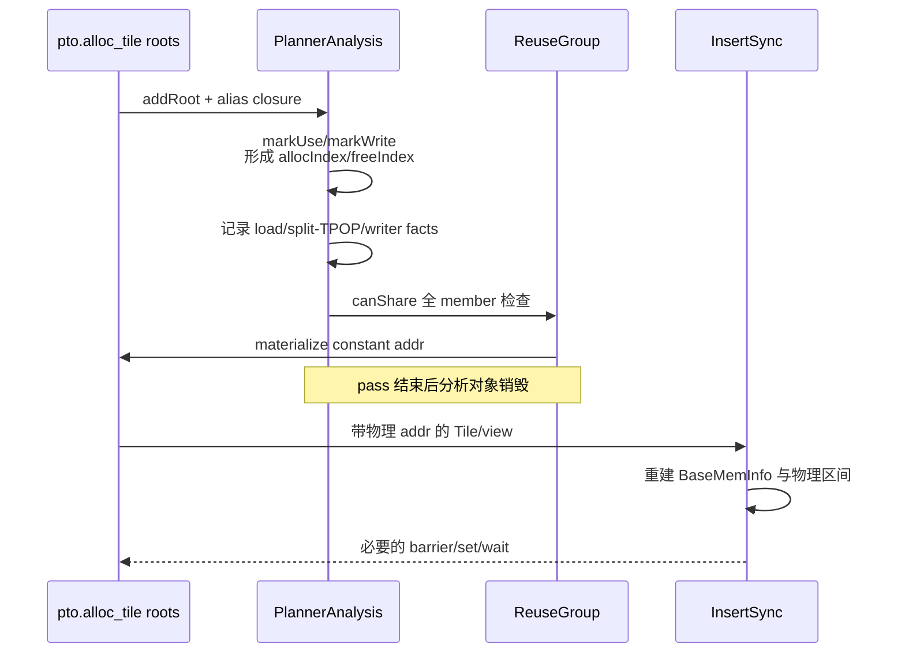

> 源码基线：[`hw-native-sys/PTOAS@e19aff7d`](https://github.com/hw-native-sys/PTOAS/commit/e19aff7dda7a05cbf4e3ba449a036dc13f3134cf)，默认分支于 2026-08-26 获取。最新 commit 合入的是 A2/A3 gather lowering，没有改动本文核心文件；本文仍以该 SHA 的已合入代码为准。代码事实、lit 测试事实、设计文档意图和硬件映射推断分别标注。

## 本篇在 PTO 课程路线中的位置

[第 16 章]()说明了“SSA 已死”不等于“异步设备访问已完成”：两个 root 复用同一 UB 后，InsertSync 必须按物理区间补 `MTE3→V` WAR。本章向前追一个更尖锐的边界：如果旧 input 的最后一次读取和新 output 的第一次写入发生在**同一个 op**，能否先让它们共址，再靠 InsertSync 修复？

答案是不能一概而论。modern PlanMemory 把相接的生命周期交给后续闸门；普通 inplace-safe op 可以继续考虑复用，A3 上“load-derived input + split-TPOP-derived input + DPS writer output”的组合则由 target-specific hard gate 直接禁止。这里训练的不是记一个特例，而是区分三类证明：op 内 alias 合法性、op 间设备完成顺序、以及只影响性能的共址代价。

## 前置知识

- `pto.alloc_tile` 是 local allocation root；shape、dtype、location 决定静态字节 footprint，valid shape 不改变这块容量。
- DPS op 通过 `ins(...) outs(...)` 区分读取对象与输出对象。pure overwrite output 不读取旧值，可以把逻辑 birth 从早期 `alloc_tile` 收缩到 first writer。
- `TLOAD/TPREFETCH` 的目的 Tile 属于 load-derived root；A3 `split != 0` 的 `TPOP` 结果及其 `subview/bitcast/reshape/select` 派生值会携带 split-TPOP provenance。
- InsertSync 能在两个不同 op 之间建立 happens-before；它无法在一条未声明 inplace-safe 的设备指令内部插入“先完整读 source、再写 destination”的阶段边。

## 今日两个核心问题

1. 为什么 `freeIndex == allocIndex` 的 touching 不算严格 lifetime overlap，却也不等于安全？
2. A3 target hazard gate 与后续 InsertSync 各自证明什么，为什么不能互相替代？

## PTO 全栈中的位置

[`ptoas.cpp`](https://github.com/hw-native-sys/PTOAS/blob/e19aff7dda7a05cbf4e3ba449a036dc13f3134cf/tools/ptoas/ptoas.cpp#L3693-L3729) 显示真实 pass 顺序：level1/2 先选择 legacy 或 modern PlanMemory，物化地址后才运行可选的 InsertSync。注意 modern 仍需显式 `--plan-memory-impl=modern`；默认值是 legacy。modern 未显式指定排序开关时才默认 largest-first。

```mermaid
flowchart LR
    IR["addr-less pto.alloc_tile<br/>DPS ops + split TPOP"] --> A["PlannerAnalysis<br/>RootInfo + ConflictFacts"]
    A --> L["gateLifetimeAndPhi<br/>strict overlap or touching"]
    L --> H["gateTargetHazard<br/>A3 load + split-TPOP"]
    H --> N["gateSemanticNoAlias"]
    N --> C["chooseReuseGroupByCost<br/>performance hint"]
    C --> M["materialize alloc_tile addr"]
    M --> I["InsertSync<br/>physical RAW/WAR/WAW"]
    I --> E["barrier or set/wait"]
```



## 概念和精确语义

### `RootInfo`：规划器中的静态生命周期，不是运行时 Tile

[`RootInfo`](https://github.com/hw-native-sys/PTOAS/blob/e19aff7dda7a05cbf4e3ba449a036dc13f3134cf/lib/PTO/Transforms/PTOPlanMemoryModern.cpp#L38-L57) 保存 `root/defOp/address space/slotBytes/totalBytes/alignment/slotCount/allocIndex/freeIndex` 等字段。`PlannerAnalysis` 收集 `pto.alloc_tile(no addr)` 等 root，并把 alias/view value 归约回 root。它拥有这些对象；`ReuseGroup` 只持有 `RootInfo*`，pass 把 offset 写回 IR 后二者一起销毁。运行时真正被使用的是带常量 `addr` 的 Tile descriptor。

接口前置条件是：level1/2、静态可计算的 local Tile、合法 address space 和足够容量。结果是每个仍有 use 的 `alloc_tile` 都获得常量地址；无法计算 footprint、空间溢出或留下未规划 root 时 pass 失败。不同 address space 永不共用 group。

### Writer-defined birth 与 touching

[`markUse/markWrite`](https://github.com/hw-native-sys/PTOAS/blob/e19aff7dda7a05cbf4e3ba449a036dc13f3134cf/lib/PTO/Transforms/PTOPlanMemoryModern.cpp#L475-L507) 的关键不是“alloc 出现在哪”，而是 output 是否 pure overwrite：若 first writer 前没有 use，`allocIndex` 收缩到 writer op；若是 read-modify-write，则必须从旧值存在时开始保守存活。

代码事实是：

```cpp
strict_overlap = !(a.freeIndex <= b.allocIndex ||
                   b.freeIndex <= a.allocIndex);
```

因此 `a.freeIndex == b.allocIndex` 不算严格重叠。这恰好表示一条 op 在同一 program point 最后读取 `a`、第一次写 `b`。它只通过了“两个值不需要在 op 前后同时长期存活”的证明，尚未证明该 op 能执行 `src == dst`。

### A3 target hazard 的四份证据

[`ConflictFacts`](https://github.com/hw-native-sys/PTOAS/blob/e19aff7dda7a05cbf4e3ba449a036dc13f3134cf/lib/PTO/Transforms/PTOPlanMemoryModern.cpp#L70-L79) 不把规则粗暴写成“所有 TPOP 都不复用”，而是组合四份事实：

| 证据 | 当前代码来源 | 含义 |
| --- | --- | --- |
| `targetHazardEnabled` | `target_arch == A3` | 只在 A3 planner 路径启用 |
| `loadDerivedRoots` | `TLoadOp/TPrefetchOp` 的 DPS dst | input 内容来自 load/prefetch |
| split-TPOP provenance | `TPopFromAicOp/TPopOp` 且 `split != 0`，并沿 alias/view 传播 | writer 同时消费 split pop 数据 |
| `tpopConsumerWriteIndices` | 同时读前两类 input 的 DPS writer op index | 风险发生在哪一个 writer |

[`recordDpsTargetHazardFacts`](https://github.com/hw-native-sys/PTOAS/blob/e19aff7dda7a05cbf4e3ba449a036dc13f3134cf/lib/PTO/Transforms/PTOPlanMemoryModern.cpp#L718-L759) 建账；[`hasTargetHazard`](https://github.com/hw-native-sys/PTOAS/blob/e19aff7dda7a05cbf4e3ba449a036dc13f3134cf/lib/PTO/Transforms/PTOPlanMemoryModern.cpp#L1157-L1178) 最终检查：input 是 load-derived、另一 root 是该 writer 的 output，而且 `input.freeIndex` 正是 writer index。左右方向都检查，满足即拒绝同一 `ReuseGroup`。

公开设计把它称为 Ascend910B/A3 的 load/split-AIV hazard；但没有公开微架构时序说明。因而“后端内部仍存在细粒度 overlap”是设计文档给出的理由；具体是哪一级队列、读端口或 writeback 产生竞态，本文只标记为**硬件映射推断**，不自行补全。

## 真实文件、类型、API 或指令逐段解读

### 1. `PlannerAnalysis::walkRegion`

它线性编号 op，建立 root 和 alias closure；普通 operand 调 `markUse`，DPS init 根据 MemoryEffects 调 `markUse/markWrite`。之后依次记录 split-TPOP provenance、target hazard、inplace/semantic no-alias 和 pipe access。顺序很重要：target fact 看到的是已归约到 allocation root 的值，而不是某个短命 subview 名字。

### 2. `gateLifetimeAndPhi`

[`gateLifetimeAndPhi`](https://github.com/hw-native-sys/PTOAS/blob/e19aff7dda7a05cbf4e3ba449a036dc13f3134cf/lib/PTO/Transforms/PTOPlanMemoryModern.cpp#L1129-L1155) 对严格 overlap 返回 false；互斥 `scf.if` 分支 root 是保守豁免。touching 直接通过，继续交给 target 与 semantic gate。loop-carried root 不享受 branch-exclusive 豁免。

### 3. `canShare` 与 group 级闭包

[`canShare`](https://github.com/hw-native-sys/PTOAS/blob/e19aff7dda7a05cbf4e3ba449a036dc13f3134cf/lib/PTO/Transforms/PTOPlanMemoryModern.cpp#L1181-L1205) 是 hard gate 的 AND。新 root 要和 `ReuseGroup` 的**每个** member 两两通过，而不是只和 representative 比较，避免 A 可与 B 共址、B 可与 C 共址，却漏掉 A/C 冲突。

### 4. `chooseReuseGroupByCost`

通过 hard gate 只表示“正确性允许”。[`chooseReuseGroupByCost`](https://github.com/hw-native-sys/PTOAS/blob/e19aff7dda7a05cbf4e3ba449a036dc13f3134cf/lib/PTO/Transforms/PTOPlanMemoryModern.cpp#L1248-L1455) 还给相邻 `PIPE_V` dependency、`MTE3→MTE2` 共址、hot-root 聚集和同 bank 信号加成本；容量宽松时 fresh group 的成本为 1，可优先避免正成本共址，容量紧张时则退回合法复用。这个 cost 是性能启发式，绝不能放松 hard gate，也不能据此宣称端到端更快。

## 对象/Tile/Buffer/IR 生命周期



这条生命周期揭示了一个维护约束：InsertSync 不会读取 `ConflictFacts`，PlanMemory 也不会把 target gate 变成 event。两者通过“已物化地址 + op MemoryEffects”衔接，而不是共享内部对象。

## 端到端调用链或指令链

完整链为：

`compilePTOASModule → createPlanMemoryModernPass → PlannerAnalysis::walkRegion → markUse/markWrite → recordSplitTpopDerivedValue → recordDpsTargetHazardFacts → canJoinReuseGroup → chooseReuseGroupByCost → materializePlannedOffsets → createPTOInsertSyncPass → PTOIRTranslator/BaseMemInfo → MemoryDependentAnalyzer → SyncCodegen`。

其中 target gate 发生在地址选择前；InsertSync 发生在地址物化后。前者拒绝 op 内不能表达的危险 alias，后者排序 op 间可表达的异步访问。

## 具体 shape、Tile 和状态演算

考虑 A3 Vector kernel 的最小模型，三个逻辑 Tile 都是 `Vec/16×128/f32/ND`，单个 footprint：

\[
16\times128\times4=8192\text{ B}
\]

`%pop` 来自 `pto.tpop_from_aic {split = 1}`，不作为新的 plannable `alloc_tile` root；`%load` 和 `%dst` 是两个 8192 B root：

| op index | 操作 | `%load` 状态 | `%dst` 状态 | fact 变化 |
| ---: | --- | --- | --- | --- |
| 2 | `TLOAD(... outs %load)` | first writer，`alloc=2` | 未写 | `%load ∈ loadDerivedRoots` |
| 3 | split `TPOP` 得 `%pop` | live | 未写 | `%pop` 带 split provenance |
| 4 | `TADD ins(%load,%pop) outs(%dst)` | last use，`free=4` | pure overwrite，`alloc=4` | `%dst ∈ tpopConsumerRoots`，writer index `{4}` |
| 5 | `TSTORE(%dst)` | dead | `free=5` | output 被消费 |

Lifetime gate 计算 `[2,4]` 与 `[4,5]`：因为 `4 <= 4`，不是 strict overlap。若只看通用 liveness，两 root 可共用 offset 0，Vec footprint 从 16384 B 降到 8192 B。

但 A3 target gate 得到：`loadDerived(%load)=true`、`tpopConsumer(%dst)=true`、`4 ∈ writeIndices[%dst]`，因此 `canShare=false`；最终至少需要两个 group，例如 `%load@0`、`%dst@8192`。若 `split=0`，该专门 provenance 不成立，但仍须通过 op semantic no-alias 与 group cost，不能反推“一定共址”。

## 为什么这样设计及替代方案

从第一性原理看，必须同时满足：语义值在最后读取前不被破坏、设备异步访问完成前物理字节不被覆盖、以及 local footprint 不越过容量。由此得到三层机制：

1. **全部 touching 都禁止**：最简单、正确性容易维护，但会丢掉合法 inplace 与顺序临时量复用，增加 UB peak，可能让本可运行的 kernel overflow。
2. **全部 touching 都允许，完全依赖 InsertSync**：footprint 最小，却无法修复单 op 内 `src/dst` alias 语义；同步边没有合法插入点。
3. **当前设计**：lifetime 先筛并存，target/semantic hard gate 处理 op 内不可 alias，cost 只优化流水，InsertSync 处理 op 间 physical handoff。维护面更复杂，但每层都对应一项可证不变量。

这里的关键不是“闸门越多越安全”，而是证据要与失败发生的位置一致：无法用 event 表达的冲突必须在 allocator 阶段拒绝；能用 happens-before 表达的跨 op 冲突不必永久牺牲复用。

## 访存、计算、流水、并行和硬件约束

- target gate 不减少 `TLOAD/TADD/TSTORE` 字节数或 FLOPs，只把两个 8192 B root 分开放置，增加 8192 B Vec footprint。
- 不共址可能保留更大的 PIPE 并行窗口；共址则可能要求 InsertSync 增加依赖。是否改善 latency 必须由设备 trace 验证，地址数本身不是性能结论。
- hard gate 失败时 planner 会新建 group；若超过 A3 Vec capacity，编译失败，不会为了“能编过”放松正确性。
- `targetHazardEnabled` 当前等价于 `arch == A3`。这是一条软件 target policy，不是对所有 NPU 的普遍 ISA 定律。
- `allocIndex/freeIndex` 是线性 IR 序号；loop/branch 会另做扩展或互斥建模。未建模 region、动态 alias 或错误 MemoryEffects 都可能破坏证明。

## 测试证据与未覆盖风险

**测试事实：** [`plan_memory_modern_first_writer_reuse.pto`](https://github.com/hw-native-sys/PTOAS/blob/e19aff7dda7a05cbf4e3ba449a036dc13f3134cf/test/lit/pto/plan_memory_modern_first_writer_reuse.pto) 用两个 `1×32768×f32`、各 128 KiB 的顺序 Tile；A3 Vec 容量 192 KiB，只有 writer-defined liveness 允许复用时才能通过，并断言两者都得到 addr 0。

**测试事实：** [`plan_memory_five_gates_lifetime_overlap.pto`](https://github.com/hw-native-sys/PTOAS/blob/e19aff7dda7a05cbf4e3ba449a036dc13f3134cf/test/lit/pto/plan_memory_five_gates_lifetime_overlap.pto) 让两个 `16×16×f16` 同时 live，断言地址分别为 0 与 512，验证 strict overlap 不共址。

**测试事实：** [`plan_memory_pipev_reuse_cost_state_update.pto`](https://github.com/hw-native-sys/PTOAS/blob/e19aff7dda7a05cbf4e3ba449a036dc13f3134cf/test/lit/pto/plan_memory_pipev_reuse_cost_state_update.pto) 用四个 `32×32×f32` root，断言两个连续 Vector output 落在 8192/12288，证明 cost state 会随 group 更新；它验证的是布局启发式，不是 target hazard。

**跨 pass 回归：** [`plan_memory_reused_tstore_sync_level2.pto`](https://github.com/hw-native-sys/PTOAS/blob/e19aff7dda7a05cbf4e3ba449a036dc13f3134cf/test/lit/pto/plan_memory_reused_tstore_sync_level2.pto) 验证地址复用后 InsertSync 仍能发现跨 root physical WAR，这是“允许跨 op 复用后再同步”的证据。

**文档计划而非测试事实：** [modern memplan 设计文档](https://github.com/hw-native-sys/PTOAS/blob/e19aff7dda7a05cbf4e3ba449a036dc13f3134cf/docs/designs/ptoas-largest-first-fit-four-gates-memplan-design.md#L837-L851) 列出 `plan_memory_five_gates_lifetime_touching.pto` 与 `plan_memory_five_gates_target_hazard.pto`；当前主干树中没有这两个文件。合入的 [PR #913](https://github.com/hw-native-sys/PTOAS/pull/913) 说明了 target gate，但现有 lit 未直接构造 A3 `TLOAD + split TPOP + same-op DPS writer` 并断言两地址不同，也没有 `split=0` 对照或 alias-view provenance 矩阵。

仍未覆盖：A3 真机 race 复现、A5/非 A3 policy 对照、`subview/select/reshape` provenance 正负例、MemoryEffects 错标、容量压力下 hard gate 不被 cost 绕过，以及 PlanMemory 与 InsertSync 对同一 physical interval 的跨 pass verifier。

## 与前后章节的连接

第 16 章讲的是“允许复用后，如何把旧异步 reader 的完成时间延长到 event”；本章讲的是“某些同 op alias 根本不应被允许”。两章合起来形成地址复用的双重证明：

```text
canShare 证明：这一对 logical roots 可以共享 storage identity
InsertSync 证明：storage ownership 在不同设备访问之间按序交接
```

下一章将继续 modern planner，但转向控制流：`scf.if` 的 branch-exclusive/phi-family 如何在 liveness 被延长后恢复互斥复用，以及 loop-carried root 为什么必须拒绝该豁免。

## 本篇结论、知识债、三个理解检查问题和下一章

结论：touching 只是 lifetime gate 的边界条件，不是完整安全证明。A3 target gate 用 `loadDerivedRoots + split-TPOP provenance + DPS writer index` 精确拒绝一类同 op 共址；semantic gate处理通用 inplace 约束；InsertSync 则只负责物理地址已经复用后的跨 op RAW/WAR/WAW。性能 cost 可以改变地址偏好，但没有权力推翻任何 hard gate。

知识债：target hazard 缺直接 lit 与设备证据；设计文档仍混用“四道/五道闸门”措辞；target policy 缺 capability table；planner/InsertSync 的 physical interval 视角尚无统一 verifier。

理解检查：

1. 为什么 `freeIndex == allocIndex` 能通过 lifetime gate，却不能直接推出 output 可以复用 input 地址？
2. 若旧 Tile 的最后一次访问是前一条异步 `TSTORE`，新 Tile 在下一条 Vector op 写入，为什么这更适合 InsertSync，而不是一律由 target gate 禁止？
3. `split=0` 让专门 target gate 不触发后，还要经过哪两类判断才能选择同一 group？

下一章：**Modern PlanMemory 的 branch-exclusive phi family——互斥分支复用、loop-carried 反例与 alias closure。**

## 课程账本增量

- 章节：17
- PTOAS 基线：`e19aff7dda7a05cbf4e3ba449a036dc13f3134cf`
- 新覆盖：`RootInfo` writer-defined lifetime、`lifetimesStrictlyOverlap`、`loadDerivedRoots`、split-TPOP provenance、`tpopConsumerRoots/tpopConsumerWriteIndices`、`gateTargetHazard`、`canShare/canJoinReuseGroup`、`chooseReuseGroupByCost`
- 新不变量：touching 只免除 strict lifetime conflict；同 op alias 必须继续通过 target/semantic gate；InsertSync 只承担可用同步边表达的跨 op physical ownership handoff
- 待验证：target-hazard direct lit、split/alias-view 负例矩阵、A3 device trace、跨 pass reuse/sync verifier
- 下一章：branch-exclusive phi family 与 loop-carried no-exemption
